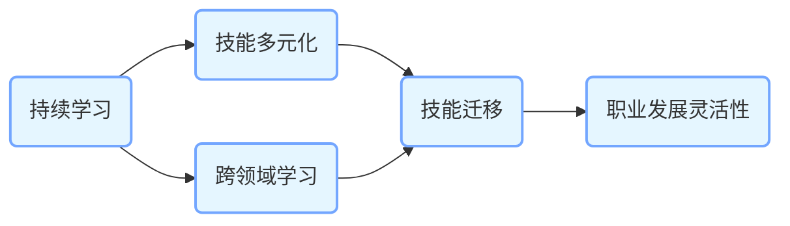

# 如何在AI时代保持职业发展的灵活性

> 关键词：AI时代、职业发展、灵活性、技能提升、跨领域学习

> 摘要：随着AI技术的飞速发展，各个行业都受到了深远的影响，职业格局也在不断发生变化。在这样的时代背景下，保持职业发展的灵活性变得至关重要。本文旨在深入探讨在AI时代保持职业发展灵活性的方法和策略，通过对背景的介绍、核心概念的阐述、具体操作步骤的说明、数学模型的分析、项目实战案例的展示、实际应用场景的探讨、工具和资源的推荐等方面，为读者提供全面且深入的指导，帮助读者在AI时代更好地规划和发展自己的职业生涯。

## 1. 背景介绍 
### 1.1 目的和范围
在AI时代，技术的快速迭代使得职业市场的需求不断变化。许多传统职业面临着被AI取代的风险，而新兴职业不断涌现。本文章的目的在于为广大职场人士提供在这个充满变化的时代保持职业发展灵活性的有效方法和思路。范围涵盖了不同行业、不同职业阶段的人群，旨在帮助他们更好地适应AI带来的变革，实现职业的可持续发展。

### 1.2 预期读者
本文预期读者包括但不限于正在求职的大学生、在职的职场人士、职业规划师以及对AI时代职业发展感兴趣的人群。无论您是刚刚踏入职场，还是已经在职场中摸爬滚打多年，都能从本文中获得有益的启示和指导。

### 1.3 文档结构概述
本文将首先介绍相关的背景知识，包括目的、预期读者和文档结构等内容。接着阐述核心概念与联系，帮助读者理解在AI时代保持职业发展灵活性的关键要素。然后详细讲解核心算法原理和具体操作步骤，通过Python源代码进行示例。之后会介绍相关的数学模型和公式，并举例说明。再通过项目实战案例展示具体的实现过程和代码解读。接着探讨实际应用场景，为读者提供实际参考。随后推荐相关的工具和资源，帮助读者更好地学习和实践。最后总结未来发展趋势与挑战，并提供常见问题与解答以及扩展阅读和参考资料。

### 1.4 术语表
#### 1.4.1 核心术语定义
- **AI（Artificial Intelligence）**：即人工智能，是研究、开发用于模拟、延伸和扩展人的智能的理论、方法、技术及应用系统的一门新的技术科学。
- **职业发展灵活性**：指个体能够快速适应职业市场的变化，通过调整自身的技能、知识和态度，在不同的职业领域或岗位之间顺利转换和发展的能力。

#### 1.4.2 相关概念解释
- **跨领域学习**：指跨越不同学科或专业领域进行学习，以获取更广泛的知识和技能，增强在不同领域的适应能力。
- **技能迁移**：指将在一个领域中所学到的技能应用到其他领域的能力，这是保持职业发展灵活性的重要手段之一。

#### 1.4.3 缩略词列表
- **AI**：Artificial Intelligence（人工智能）

## 2. 核心概念与联系 

在AI时代保持职业发展的灵活性涉及多个核心概念，它们之间相互关联、相互影响。下面是核心概念原理和架构的文本示意图：

| 核心概念 | 原理 | 联系 |
|---|---|---|
| 技能多元化 | 通过学习不同领域的技能，增加自身在职业市场中的竞争力。 | 与跨领域学习密切相关，跨领域学习是实现技能多元化的重要途径。 |
| 跨领域学习 | 跨越不同学科或专业领域进行学习，拓宽知识视野。 | 能够促进技能迁移，为职业转换提供知识和技能基础。 |
| 技能迁移 | 将在一个领域中所学到的技能应用到其他领域。 | 是实现职业发展灵活性的关键，依赖于技能多元化和跨领域学习。 |
| 持续学习 | 不断更新知识和技能，以适应AI时代的快速变化。 | 是技能多元化、跨领域学习和技能迁移的基础，贯穿职业发展的始终。 |

下面是对应的Mermaid流程图：


从流程图可以看出，持续学习是基础，它促进了技能多元化和跨领域学习。技能多元化和跨领域学习又为技能迁移提供了条件，而技能迁移最终实现了职业发展的灵活性。

## 3. 核心算法原理 & 具体操作步骤 

### 核心算法原理
在AI时代保持职业发展的灵活性可以类比为一个优化问题。我们的目标是在职业市场的动态变化中，通过合理分配时间和资源，不断提升自己的技能和能力，以实现职业价值的最大化。可以用以下的伪代码来表示这个过程：

```plaintext
while (职业市场在变化)
{
    评估当前技能和职业目标的差距;
    根据市场需求和个人兴趣选择学习方向;
    制定学习计划并执行;
    定期评估学习效果和职业发展进度;
    if (达到职业目标)
    {
        调整职业目标;
    }
}
```

### 具体操作步骤（Python源代码示例）
以下是一个简单的Python代码示例，模拟了在AI时代保持职业发展灵活性的部分操作步骤：

```python
# 定义当前技能集合
current_skills = set(["编程", "数据分析"])

# 定义职业市场需求的技能集合
market_demand_skills = set(["人工智能", "机器学习", "云计算"])

# 评估当前技能和职业市场需求的差距
def assess_skill_gap(current_skills, market_demand_skills):
    return market_demand_skills - current_skills

# 选择学习方向
def choose_learning_direction(skill_gap):
    # 这里简单选择第一个技能作为学习方向
    if skill_gap:
        return next(iter(skill_gap))
    else:
        return None

# 学习新技能
def learn_new_skill(learning_direction, current_skills):
    current_skills.add(learning_direction)
    return current_skills

# 主循环
while True:
    skill_gap = assess_skill_gap(current_skills, market_demand_skills)
    if not skill_gap:
        print("当前技能已满足市场需求，可考虑调整职业目标。")
        break
    learning_direction = choose_learning_direction(skill_gap)
    print(f"选择学习方向: {learning_direction}")
    current_skills = learn_new_skill(learning_direction, current_skills)
    print(f"当前技能集合: {current_skills}")
```

### 代码解释
1. **当前技能集合**：`current_skills` 表示当前个人所具备的技能。
2. **职业市场需求的技能集合**：`market_demand_skills` 表示当前职业市场所需求的技能。
3. **评估技能差距**：`assess_skill_gap` 函数通过集合的差运算，计算出当前技能和市场需求技能之间的差距。
4. **选择学习方向**：`choose_learning_direction` 函数从技能差距中选择一个技能作为学习方向。
5. **学习新技能**：`learn_new_skill` 函数将选择的学习方向添加到当前技能集合中。
6. **主循环**：不断评估技能差距，选择学习方向，学习新技能，直到当前技能满足市场需求。

## 4. 数学模型和公式 & 详细讲解 & 举例说明 

### 数学模型
可以用一个向量空间模型来表示职业发展的灵活性。假设每个技能可以看作是向量空间中的一个维度，个人的技能组合可以用一个向量 $\vec{S}=(s_1, s_2, \cdots, s_n)$ 来表示，其中 $s_i$ 表示第 $i$ 个技能的掌握程度。职业市场的需求可以用另一个向量 $\vec{D}=(d_1, d_2, \cdots, d_n)$ 来表示。

### 公式
- **技能差距**：技能差距可以用向量的欧几里得距离来表示，即 $G = \sqrt{\sum_{i=1}^{n}(d_i - s_i)^2}$。
- **职业发展灵活性指数**：可以定义为个人技能向量与职业市场需求向量的夹角的余弦值，即 $\text{Flexibility} = \frac{\vec{S} \cdot \vec{D}}{\|\vec{S}\| \|\vec{D}\|}$，其中 $\vec{S} \cdot \vec{D} = \sum_{i=1}^{n}s_i d_i$，$\|\vec{S}\| = \sqrt{\sum_{i=1}^{n}s_i^2}$，$\|\vec{D}\| = \sqrt{\sum_{i=1}^{n}d_i^2}$。

### 详细讲解
- **技能差距**：欧几里得距离 $G$ 表示个人技能与职业市场需求之间的差异程度。$G$ 越大，说明个人技能与市场需求的差距越大，需要学习的内容就越多。
- **职业发展灵活性指数**：夹角的余弦值 $\text{Flexibility}$ 表示个人技能与职业市场需求的相似程度。$\text{Flexibility}$ 越接近 1，说明个人技能与市场需求越匹配，职业发展的灵活性越高。

### 举例说明
假设职业市场需求的技能向量为 $\vec{D}=(3, 4, 2)$，个人的技能向量为 $\vec{S}=(1, 2, 1)$。

1. **计算技能差距**：
   - 首先计算 $(d_i - s_i)^2$ 的值：
     - 对于 $i = 1$，$(3 - 1)^2 = 4$；
     - 对于 $i = 2$，$(4 - 2)^2 = 4$；
     - 对于 $i = 3$，$(2 - 1)^2 = 1$。
   - 然后计算 $\sum_{i=1}^{3}(d_i - s_i)^2 = 4 + 4 + 1 = 9$。
   - 最后计算技能差距 $G = \sqrt{9} = 3$。

2. **计算职业发展灵活性指数**：
   - 计算 $\vec{S} \cdot \vec{D}$：
     - $\vec{S} \cdot \vec{D} = 1 \times 3 + 2 \times 4 + 1 \times 2 = 3 + 8 + 2 = 13$。
   - 计算 $\|\vec{S}\|$：
     - $\|\vec{S}\| = \sqrt{1^2 + 2^2 + 1^2} = \sqrt{1 + 4 + 1} = \sqrt{6}$。
   - 计算 $\|\vec{D}\|$：
     - $\|\vec{D}\| = \sqrt{3^2 + 4^2 + 2^2} = \sqrt{9 + 16 + 4} = \sqrt{29}$。
   - 计算职业发展灵活性指数：
     - $\text{Flexibility} = \frac{13}{\sqrt{6} \times \sqrt{29}} \approx \frac{13}{\sqrt{174}} \approx \frac{13}{13.19} \approx 0.985$。

从这个例子可以看出，通过计算技能差距和职业发展灵活性指数，我们可以定量地评估个人技能与职业市场需求之间的关系，从而有针对性地进行技能提升和职业规划。

## 5. 项目实战：代码实际案例和详细解释说明 

### 5.1  开发环境搭建
在进行项目实战之前，需要搭建相应的开发环境。以下是具体的步骤：

1. **安装Python**：可以从Python官方网站（https://www.python.org/downloads/）下载并安装最新版本的Python。建议安装Python 3.7及以上版本。
2. **安装开发工具**：推荐使用PyCharm作为开发工具，它是一款功能强大的Python集成开发环境（IDE）。可以从JetBrains官方网站（https://www.jetbrains.com/pycharm/download/）下载并安装。
3. **安装必要的库**：在项目中，我们可能会用到一些第三方库，如`numpy`、`pandas`等。可以使用以下命令进行安装：
```bash
pip install numpy pandas
```

### 5.2  源代码详细实现和代码解读
以下是一个更复杂的Python代码示例，模拟了在AI时代根据职业市场需求进行技能学习和职业发展规划的过程：

```python
import numpy as np
import pandas as pd

# 定义技能列表
skills = ["编程", "数据分析", "人工智能", "机器学习", "云计算", "项目管理"]

# 定义职业市场需求的技能权重
market_demand_weights = np.array([0.2, 0.2, 0.3, 0.1, 0.1, 0.1])

# 定义个人初始技能水平
initial_skills_level = np.array([0.3, 0.4, 0.1, 0.1, 0.1, 0.2])

# 定义学习效率矩阵
learning_efficiency_matrix = np.array([
    [0.1, 0.05, 0.03, 0.02, 0.02, 0.01],
    [0.05, 0.1, 0.03, 0.02, 0.02, 0.01],
    [0.03, 0.03, 0.1, 0.05, 0.02, 0.01],
    [0.02, 0.02, 0.05, 0.1, 0.02, 0.01],
    [0.02, 0.02, 0.02, 0.02, 0.1, 0.01],
    [0.01, 0.01, 0.01, 0.01, 0.01, 0.1]
])

# 定义学习时间
learning_time = 10

# 定义目标职业发展灵活性指数
target_flexibility = 0.8

# 计算职业发展灵活性指数
def calculate_flexibility(skills_level, market_demand_weights):
    dot_product = np.dot(skills_level, market_demand_weights)
    skills_level_norm = np.linalg.norm(skills_level)
    market_demand_weights_norm = np.linalg.norm(market_demand_weights)
    return dot_product / (skills_level_norm * market_demand_weights_norm)

# 学习新技能
def learn_skills(skills_level, learning_efficiency_matrix, learning_time):
    for _ in range(learning_time):
        skill_improvement = np.dot(learning_efficiency_matrix, skills_level)
        skills_level += skill_improvement
        skills_level = np.clip(skills_level, 0, 1)  # 确保技能水平在0到1之间
    return skills_level

# 主循环
current_skills_level = initial_skills_level
flexibility = calculate_flexibility(current_skills_level, market_demand_weights)
while flexibility < target_flexibility:
    current_skills_level = learn_skills(current_skills_level, learning_efficiency_matrix, learning_time)
    flexibility = calculate_flexibility(current_skills_level, market_demand_weights)
    print(f"当前职业发展灵活性指数: {flexibility}")

# 输出最终技能水平
print("最终技能水平:")
skill_level_df = pd.DataFrame({"技能": skills, "水平": current_skills_level})
print(skill_level_df)
```

### 5.3  代码解读与分析
1. **技能列表和权重**：`skills` 列表定义了所有的技能，`market_demand_weights` 数组定义了职业市场对每个技能的需求权重。
2. **个人初始技能水平**：`initial_skills_level` 数组表示个人初始的技能水平，取值范围在 0 到 1 之间。
3. **学习效率矩阵**：`learning_efficiency_matrix` 矩阵表示学习不同技能之间的相互影响。例如，学习编程可能会对数据分析技能有一定的提升。
4. **学习时间**：`learning_time` 表示每次学习的时间周期。
5. **目标职业发展灵活性指数**：`target_flexibility` 表示期望达到的职业发展灵活性指数。
6. **计算职业发展灵活性指数**：`calculate_flexibility` 函数根据个人技能水平和市场需求权重计算职业发展灵活性指数。
7. **学习新技能**：`learn_skills` 函数根据学习效率矩阵和当前技能水平，模拟学习过程，更新技能水平。
8. **主循环**：不断学习新技能，直到达到目标职业发展灵活性指数。
9. **输出最终技能水平**：最后输出最终的技能水平，方便查看学习效果。

通过这个项目实战，我们可以看到如何使用Python代码来模拟在AI时代根据职业市场需求进行技能学习和职业发展规划的过程。

## 6. 实际应用场景 

### 传统行业从业者转型
在AI时代，许多传统行业都受到了冲击，从业者需要转型以适应新的市场需求。例如，制造业的工人可以学习人工智能和自动化技术，转型为智能制造工程师；金融行业的从业者可以学习数据分析和机器学习，转型为金融科技分析师。通过保持职业发展的灵活性，他们可以在新的领域中找到更好的职业发展机会。

### 新兴行业的职业发展
在新兴的AI相关行业中，技术更新换代非常快。从业者需要不断学习新的知识和技能，以保持竞争力。例如，人工智能领域的研究人员需要关注最新的研究成果，学习新的算法和模型；AI产品经理需要了解用户需求和市场趋势，不断优化产品。通过跨领域学习和技能迁移，他们可以在不同的岗位之间顺利转换，实现职业的多元化发展。

### 自由职业者的发展
自由职业者在AI时代面临着更多的机遇和挑战。他们需要根据市场需求不断调整自己的服务内容和技能。例如，一名自由设计师可以学习人工智能辅助设计技术，提高设计效率和质量；一名自由撰稿人可以学习自然语言处理技术，为客户提供更个性化的内容创作服务。通过保持职业发展的灵活性，自由职业者可以更好地满足客户需求，提高自己的收入水平。

## 7. 工具和资源推荐
### 7.1 学习资源推荐
#### 7.1.1 书籍推荐
- 《人工智能：一种现代的方法》：这是一本经典的人工智能教材，全面介绍了人工智能的各个领域和方法。
- 《Python机器学习》：详细介绍了使用Python进行机器学习的方法和技巧，适合初学者和有一定基础的开发者。
- 《数据科学实战》：通过实际案例介绍了数据科学的整个流程，包括数据收集、清洗、分析和可视化等。

#### 7.1.2 在线课程
- Coursera：提供了许多关于人工智能、机器学习、数据分析等方面的在线课程，由全球知名大学和机构的教授授课。
- edX：同样提供了丰富的在线课程，涵盖了计算机科学、数学、工程等多个领域。
- 中国大学MOOC：国内的在线课程平台，有许多高校的优质课程可供学习。

#### 7.1.3 技术博客和网站
- Medium：有许多技术专家和从业者在上面分享自己的经验和见解，涵盖了人工智能、机器学习、数据科学等多个领域。
- Towards Data Science：专注于数据科学和机器学习领域的技术博客，提供了许多高质量的文章和教程。
- 开源中国：国内的技术社区，有许多关于人工智能、编程等方面的技术文章和讨论。

### 7.2 开发工具框架推荐
#### 7.2.1 IDE和编辑器
- PyCharm：功能强大的Python集成开发环境，适合开发Python项目。
- Visual Studio Code：轻量级的代码编辑器，支持多种编程语言，有丰富的插件和扩展。
- Jupyter Notebook：交互式的编程环境，适合进行数据探索和分析。

#### 7.2.2 调试和性能分析工具
- pdb：Python自带的调试工具，可以帮助开发者调试代码。
- cProfile：Python的性能分析工具，可以分析代码的运行时间和内存使用情况。
- TensorBoard：TensorFlow的可视化工具，可以帮助开发者可视化模型训练过程和结果。

#### 7.2.3 相关框架和库
- TensorFlow：开源的机器学习框架，广泛应用于深度学习领域。
- PyTorch：另一个流行的深度学习框架，具有动态图的特点，适合快速开发和研究。
- Scikit-learn：用于机器学习的Python库，提供了许多常用的机器学习算法和工具。

### 7.3 相关论文著作推荐
#### 7.3.1 经典论文
- "A Logical Calculus of the Ideas Immanent in Nervous Activity"：这是人工智能领域的经典论文，提出了神经元模型。
- "Learning Representations by Back-propagating Errors"：介绍了反向传播算法，是深度学习的重要基础。
- "ImageNet Classification with Deep Convolutional Neural Networks"：提出了AlexNet模型，开启了深度学习在计算机视觉领域的革命。

#### 7.3.2 最新研究成果
- arXiv：预印本平台，有许多最新的人工智能、机器学习等领域的研究论文。
- IEEE Xplore：电气和电子工程师协会的数字图书馆，提供了许多高质量的学术论文。
- ACM Digital Library：美国计算机协会的数字图书馆，涵盖了计算机科学的各个领域。

#### 7.3.3 应用案例分析
- KDnuggets：数据科学和机器学习领域的资讯平台，有许多实际应用案例和分析。
- Kaggle：数据科学竞赛平台，有许多优秀的数据分析和机器学习项目案例。

## 8. 总结：未来发展趋势与挑战 

### 未来发展趋势
- **AI与各行业深度融合**：未来，AI将与更多的行业深度融合，创造出更多的新兴职业和就业机会。例如，AI在医疗、教育、交通等领域的应用将越来越广泛。
- **技能需求不断变化**：随着AI技术的不断发展，职业市场对技能的需求也将不断变化。未来，除了技术技能，软技能如沟通能力、团队协作能力、创新能力等也将变得越来越重要。
- **终身学习成为常态**：在AI时代，知识和技术更新换代非常快，终身学习将成为人们保持职业竞争力的必要手段。

### 挑战
- **技术更新换代快**：AI技术发展迅速，从业者需要不断学习新的知识和技能，以跟上技术的发展步伐。这对个人的学习能力和时间管理能力提出了很高的要求。
- **职业竞争加剧**：由于AI技术的普及，许多职业的门槛降低，导致职业竞争加剧。从业者需要不断提升自己的技能和能力，以脱颖而出。
- **伦理和法律问题**：AI技术的发展也带来了一系列的伦理和法律问题，如数据隐私、算法偏见、人工智能的责任等。从业者需要了解相关的伦理和法律知识，以确保自己的工作符合规范。

## 9. 附录：常见问题与解答 

### 问题1：如何确定自己应该学习哪些技能？
解答：可以通过以下几种方式确定自己应该学习的技能：
- 研究职业市场需求：了解当前和未来职业市场对技能的需求，选择热门和有前景的技能进行学习。
- 分析个人兴趣和优势：结合自己的兴趣和优势，选择适合自己的技能进行学习，这样可以提高学习的积极性和效果。
- 咨询行业专家和职业规划师：他们可以根据你的情况提供专业的建议和指导。

### 问题2：学习新技能需要多长时间？
解答：学习新技能所需的时间取决于多个因素，如技能的难度、个人的学习能力和学习时间等。一般来说，基础技能可能需要几个月的时间学习，而复杂的技能可能需要几年的时间才能掌握。在学习过程中，可以制定合理的学习计划，分阶段进行学习，以提高学习效率。

### 问题3：如何将所学的技能应用到实际工作中？
解答：可以通过以下几种方式将所学的技能应用到实际工作中：
- 寻找实践机会：在工作中主动寻找机会应用所学的技能，如参与相关项目、解决实际问题等。
- 与同事合作：与同事合作完成项目，分享自己的技能和经验，同时学习同事的长处。
- 持续学习和改进：在实践中不断总结经验，发现问题并及时改进，以提高技能的应用能力。

## 10. 扩展阅读 & 参考资料 

### 扩展阅读
- 《人类简史：从动物到上帝》：探讨了人类的发展历程和未来趋势，对理解AI时代的人类社会有一定的帮助。
- 《智能时代》：介绍了AI技术的发展和应用，以及对社会和经济的影响。
- 《未来简史：从智人到神人》：展望了人类在未来的发展方向，思考了AI技术对人类未来的影响。

### 参考资料
- 《人工智能基础教程》
- 《机器学习实战》
- 相关行业报告和研究论文

通过阅读扩展阅读材料和参考资料，读者可以进一步深入了解AI时代的相关知识和技术，为保持职业发展的灵活性提供更多的思路和方法。