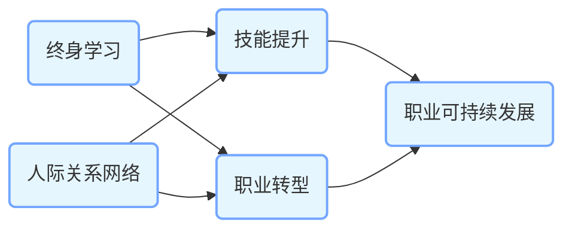

# 如何在AI时代实现职业的可持续发展

> 关键词：AI时代、职业可持续发展、技能提升、职业转型、终身学习

> 摘要：随着人工智能（AI）技术的迅猛发展，各个行业都在经历深刻变革，这给职场带来了前所未有的挑战与机遇。在AI时代实现职业的可持续发展成为众多职场人士关注的焦点。本文将深入探讨在AI时代实现职业可持续发展的背景、核心概念、具体方法、数学模型、实战案例、应用场景等内容，旨在为读者提供全面且具有可操作性的指导，帮助大家在AI浪潮中找到适合自己的职业发展路径。

## 1. 背景介绍 
### 1.1 目的和范围
本文章的目的在于为处于AI时代的职场人士提供实现职业可持续发展的有效策略和方法。范围涵盖了各个行业和不同职业阶段的人群，无论是初入职场的新人，还是有一定工作经验的资深人士，都能从本文中获取有价值的信息，以应对AI带来的职业挑战，实现自身职业的持续成长和发展。

### 1.2 预期读者
预期读者包括所有关注职业发展、希望在AI时代保持竞争力的职场人士，以及对未来职业趋势感兴趣的学生群体。同时，企业管理者和人力资源从业者也可以从本文中了解如何帮助员工在AI时代实现职业可持续发展，以提升企业整体的竞争力。

### 1.3 文档结构概述
本文首先介绍背景信息，包括目的、预期读者和文档结构概述等。接着阐述在AI时代实现职业可持续发展的核心概念及其联系，展示相关的原理和架构。然后详细讲解核心算法原理及具体操作步骤，用Python代码进行示例。之后介绍相关的数学模型和公式，并举例说明。通过项目实战展示实际案例并进行详细解释。探讨实际应用场景，推荐相关的工具和资源。最后总结未来发展趋势与挑战，提供常见问题解答和扩展阅读参考资料。

### 1.4 术语表
#### 1.4.1 核心术语定义
- **AI（Artificial Intelligence）**：即人工智能，是指通过计算机技术模拟人类智能的一系列理论、方法、技术和应用系统。
- **职业可持续发展**：指个人在职业生涯中，能够不断适应外部环境的变化，通过持续学习和技能提升，保持职业的稳定性和发展性，实现个人价值和职业目标的持续达成。
- **技能迁移**：指将在一个领域或工作中获得的技能应用到其他领域或工作中的能力。

#### 1.4.2 相关概念解释
- **数字化转型**：企业或组织利用数字技术对业务流程、产品和服务进行全面改造和升级的过程。在AI时代，数字化转型是企业发展的必然趋势，也对员工的职业技能提出了新的要求。
- **终身学习**：指一个人在一生的各个阶段都持续不断地学习新知识、新技能，以适应社会发展和个人职业发展的需要。在AI时代，知识和技术更新换代速度加快，终身学习成为实现职业可持续发展的关键。

#### 1.4.3 缩略词列表
- **AI**：Artificial Intelligence（人工智能）
- **ML**：Machine Learning（机器学习）
- **DL**：Deep Learning（深度学习）

## 2. 核心概念与联系 
在AI时代，实现职业可持续发展涉及多个核心概念，它们相互关联、相互影响。

### 核心概念原理和架构
核心概念主要包括技能提升、职业转型、终身学习和人际关系网络的构建。

技能提升是基础，通过不断学习新的知识和技能，提高自己在职场上的竞争力。职业转型则是在AI对传统职业产生冲击时，能够及时调整职业方向，进入更有发展前景的领域。终身学习是一种持续的学习态度和行为，贯穿于整个职业生涯。人际关系网络的构建可以为个人提供更多的职业机会和信息资源。

以下是它们之间关系的文本示意图：

技能提升是职业可持续发展的基石，它为职业转型提供了能力支持。终身学习确保了技能提升的持续性和有效性。人际关系网络则在技能提升和职业转型过程中起到促进作用，为个人提供学习资源和职业机会。

### Mermaid流程图


## 3. 核心算法原理 & 具体操作步骤 
### 核心算法原理
在AI时代实现职业可持续发展可以类比为一个优化问题。我们的目标是在给定的时间和资源限制下，最大化个人职业发展的收益。这里的收益可以包括薪资增长、职业满意度、职业影响力等多个方面。

我们可以将个人的职业发展状态表示为一个向量 $X = [x_1, x_2, ..., x_n]$，其中 $x_i$ 表示不同的职业技能、知识水平、人际关系等因素。每个因素都有一个对应的权重 $w_i$，表示其对职业发展收益的重要性。

职业发展收益 $Y$ 可以表示为这些因素的加权和：

$Y = \sum_{i=1}^{n} w_i x_i$

我们的目标是通过不断调整 $X$ 中的元素，使得 $Y$ 最大化。

### 具体操作步骤
以下是使用Python代码实现上述算法原理的示例：

```python
import numpy as np

# 初始化职业发展因素向量 X
X = np.array([5, 3, 4, 2])  # 假设四个因素，如技能水平、知识储备、人际关系、工作经验

# 初始化权重向量 w
w = np.array([0.3, 0.2, 0.3, 0.2])

# 计算初始职业发展收益 Y
Y = np.dot(w, X)
print("初始职业发展收益:", Y)

# 模拟技能提升过程
# 假设第一个因素（技能水平）提升了 2 个单位
X[0] += 2

# 重新计算职业发展收益 Y
Y = np.dot(w, X)
print("技能提升后的职业发展收益:", Y)
```

在这个示例中，我们首先初始化了职业发展因素向量 $X$ 和权重向量 $w$，计算了初始的职业发展收益 $Y$。然后模拟了技能提升的过程，对 $X$ 中的一个元素进行了调整，再次计算职业发展收益 $Y$，可以看到收益有所增加。

## 4. 数学模型和公式 & 详细讲解 & 举例说明 
### 数学模型
在AI时代实现职业可持续发展的数学模型可以用动态规划来描述。

设 $V(t, X)$ 表示在时间 $t$ 时，个人职业发展状态为 $X$ 时的最大职业发展收益。我们的目标是求解 $V(T, X_0)$，其中 $T$ 是最终时间，$X_0$ 是初始职业发展状态。

在每个时间步 $t$，个人可以选择不同的行动 $a$，如学习新技能、进行职业转型等。选择行动 $a$ 后，职业发展状态会从 $X$ 转移到 $X'$，并获得即时收益 $r(t, X, a)$。

动态规划的递推公式为：

$V(t, X) = \max_{a} [r(t, X, a) + \gamma V(t + 1, X')]$

其中 $\gamma$ 是折扣因子，表示未来收益的折现率。

### 详细讲解
这个数学模型的核心思想是在每个时间点上，个人都要选择一个最优的行动，使得当前的即时收益和未来的预期收益之和最大化。折扣因子 $\gamma$ 反映了个人对未来收益的重视程度，$\gamma$ 越接近 1，表示个人越看重未来的收益。

### 举例说明
假设一个职场人士在第 1 年面临两个选择：选择 $a_1$ 是学习一门新的编程语言，即时收益为 2（如提高了工作效率），选择后第 2 年的职业发展状态 $X_1'$ 对应的最大职业发展收益为 10；选择 $a_2$ 是参加一个行业研讨会，即时收益为 3，选择后第 2 年的职业发展状态 $X_2'$ 对应的最大职业发展收益为 8。折扣因子 $\gamma = 0.9$。

则 $V(1, X) = \max [2 + 0.9 \times 10, 3 + 0.9 \times 8] = \max [11, 10.2] = 11$

所以在第 1 年，该职场人士应该选择学习新的编程语言。

## 5. 项目实战：代码实际案例和详细解释说明 
### 5.1  开发环境搭建
为了实现一个简单的职业发展规划系统，我们使用Python语言和Flask框架。

1. **安装Python**：从Python官方网站（https://www.python.org/downloads/）下载并安装Python 3.x 版本。
2. **创建虚拟环境**：打开命令行工具，执行以下命令创建并激活虚拟环境：
```bash
python -m venv myenv
source myenv/bin/activate  # 对于 Windows 系统，使用 myenv\Scripts\activate
```
3. **安装Flask**：在激活的虚拟环境中执行以下命令安装Flask：
```bash
pip install flask
```

### 5.2  源代码详细实现和代码解读
以下是一个简单的职业发展规划系统的代码示例：

```python
from flask import Flask, request, jsonify

app = Flask(__name__)

# 模拟职业发展因素和权重
factors = ["技能水平", "知识储备", "人际关系", "工作经验"]
weights = [0.3, 0.2, 0.3, 0.2]

# 模拟职业发展状态
initial_state = [5, 3, 4, 2]

@app.route('/calculate_income', methods=['POST'])
def calculate_income():
    data = request.get_json()
    state = data.get('state', initial_state)
    income = sum([weights[i] * state[i] for i in range(len(factors))])
    return jsonify({"income": income})

if __name__ == '__main__':
    app.run(debug=True)
```

### 代码解读与分析
1. **导入模块**：导入Flask框架的相关模块，用于创建Web应用。
2. **初始化数据**：定义职业发展因素、权重和初始职业发展状态。
3. **定义路由**：定义一个POST请求的路由 `/calculate_income`，用于接收用户的职业发展状态数据，并计算职业发展收益。
4. **计算收益**：根据用户提供的职业发展状态数据和预设的权重，计算职业发展收益。
5. **返回结果**：将计算得到的收益以JSON格式返回给用户。

## 6. 实际应用场景 
### 传统行业从业者
在制造业中，AI技术的应用使得生产过程更加自动化和智能化。传统的工人可以通过学习AI相关的技能，如机器人操作和维护、数据分析等，转型为智能制造工程师，实现职业的可持续发展。

在金融行业，AI技术在风险评估、投资决策等方面的应用越来越广泛。银行柜员可以学习数据分析和机器学习知识，转型为数据分析师或金融科技专家。

### 新兴行业从业者
在互联网行业，随着AI技术的不断发展，对AI算法工程师、数据科学家等人才的需求持续增长。从事前端开发的人员可以通过学习AI相关课程，转型为AI应用开发工程师，拓宽自己的职业发展道路。

在医疗行业，AI技术在医学影像诊断、疾病预测等方面具有巨大的应用潜力。护士可以学习医学数据分析和AI技术，参与到医疗数据的分析和应用中，提升自己的职业价值。

### 创业者
对于创业者来说，AI技术可以为企业的发展带来新的机遇。例如，利用AI技术开发智能客服系统、智能营销工具等，可以提高企业的运营效率和客户满意度。创业者需要不断学习AI技术和相关的商业知识，以适应市场的变化，实现企业的可持续发展。

## 7. 工具和资源推荐
### 7.1 学习资源推荐
#### 7.1.1 书籍推荐
- 《人工智能：一种现代的方法》：这是一本经典的人工智能教材，全面介绍了人工智能的基本概念、算法和应用。
- 《Python机器学习》：详细介绍了Python在机器学习领域的应用，适合初学者学习。
- 《终身成长》：这本书强调了终身学习的重要性，并提供了实现终身成长的方法和策略。

#### 7.1.2 在线课程
- Coursera上的“机器学习”课程：由斯坦福大学的Andrew Ng教授授课，是学习机器学习的经典课程。
- edX上的“人工智能基础”课程：系统介绍了人工智能的基本原理和技术。
- 中国大学MOOC上的“Python语言程序设计”课程：适合零基础的学习者学习Python编程。

#### 7.1.3 技术博客和网站
- Medium：上面有很多关于AI和职业发展的优秀文章，作者来自不同的领域和背景。
- 机器之心：专注于人工智能领域的技术和应用，提供最新的行业资讯和技术文章。
- 开源中国：是国内知名的开源技术社区，有很多关于AI技术的讨论和分享。

### 7.2 开发工具框架推荐
#### 7.2.1 IDE和编辑器
- PyCharm：是一款专门为Python开发设计的集成开发环境，功能强大，适合开发大型Python项目。
- Visual Studio Code：是一款轻量级的代码编辑器，支持多种编程语言，有丰富的插件可以扩展功能。

#### 7.2.2 调试和性能分析工具
- Py-Spy：可以对Python程序进行性能分析，找出性能瓶颈。
- PDB：Python自带的调试工具，用于调试Python程序。

#### 7.2.3 相关框架和库
- TensorFlow：是一个开源的机器学习框架，广泛应用于深度学习领域。
- PyTorch：是另一个流行的深度学习框架，具有动态图的优势。
- Scikit-learn：是一个简单易用的机器学习库，提供了各种机器学习算法和工具。

### 7.3 相关论文著作推荐
#### 7.3.1 经典论文
- “A Logical Calculus of the Ideas Immanent in Nervous Activity”：这是人工智能领域的经典论文，提出了神经元模型。
- “ImageNet Classification with Deep Convolutional Neural Networks”：介绍了AlexNet，开启了深度学习在计算机视觉领域的应用热潮。

#### 7.3.2 最新研究成果
- 关注顶级学术会议如NeurIPS、ICML、CVPR等的最新论文，了解AI领域的最新研究动态。
- 查阅相关学术期刊如Journal of Artificial Intelligence Research、Artificial Intelligence等的最新文章。

#### 7.3.3 应用案例分析
- 《AI 4.0：智能时代的机器智能与人类未来》：书中包含了很多AI技术在不同行业的应用案例，对了解AI的实际应用有很大帮助。
- 各大企业的官方博客和技术报告，如谷歌、微软、百度等公司发布的关于AI应用的案例和经验分享。

## 8. 总结：未来发展趋势与挑战
### 未来发展趋势
- **AI与各行业深度融合**：未来，AI技术将与更多的行业进行深度融合，创造出更多新的职业和业务模式。例如，在教育领域，AI可以实现个性化学习和智能教学；在农业领域，AI可以实现精准农业和智能养殖。
- **跨学科人才需求增加**：随着AI技术的发展，对跨学科人才的需求将不断增加。例如，既懂AI技术又懂医学知识的人才在医疗AI领域将有很大的发展空间。
- **终身学习成为常态**：知识和技术的更新换代速度越来越快，终身学习将成为人们职业发展的必然选择。人们需要不断学习新的知识和技能，以适应职场的变化。

### 挑战
- **技术更新换代快**：AI技术发展迅速，新的算法和技术不断涌现。职场人士需要不断学习和更新自己的知识和技能，才能跟上技术发展的步伐。
- **职业转型难度大**：从传统职业转型到与AI相关的职业，需要学习大量新的知识和技能，并且可能面临职业发展的不确定性。
- **社会伦理和法律问题**：AI技术的应用也带来了一些社会伦理和法律问题，如数据隐私、算法偏见等。职场人士需要了解相关的法律法规和伦理准则，以确保自己的工作符合规范。

## 9. 附录：常见问题与解答
### 问题1：我没有编程基础，能在AI时代实现职业的可持续发展吗？
解答：可以。虽然编程在AI领域很重要，但并不是唯一的技能。例如，你可以从事AI产品的市场推广、项目管理、伦理审查等工作。同时，也可以逐步学习一些基础的编程知识，提升自己的竞争力。

### 问题2：如何判断自己是否需要进行职业转型？
解答：可以从以下几个方面考虑：当前职业的发展前景是否受到AI的冲击；自己是否对当前职业感到厌倦或缺乏发展空间；是否有新的职业机会和兴趣点出现。如果经过综合评估，认为职业转型是必要的，那么可以制定相应的转型计划。

### 问题3：学习AI相关知识和技能需要多长时间？
解答：这取决于学习的目标和个人的基础。如果只是了解AI的基本概念和应用，可能需要几个月的时间。如果要深入学习AI算法和开发，可能需要几年的时间。重要的是保持持续学习的态度，逐步积累知识和技能。

## 10. 扩展阅读 & 参考资料
- 《人类简史：从动物到上帝》，尤瓦尔·赫拉利著，中信出版社。
- 《未来简史：从智人到神人》，尤瓦尔·赫拉利著，中信出版社。
- 相关行业报告，如麦肯锡、波士顿咨询等公司发布的关于AI对职场影响的报告。
- 各大科技媒体的相关文章，如36氪、钛媒体等。