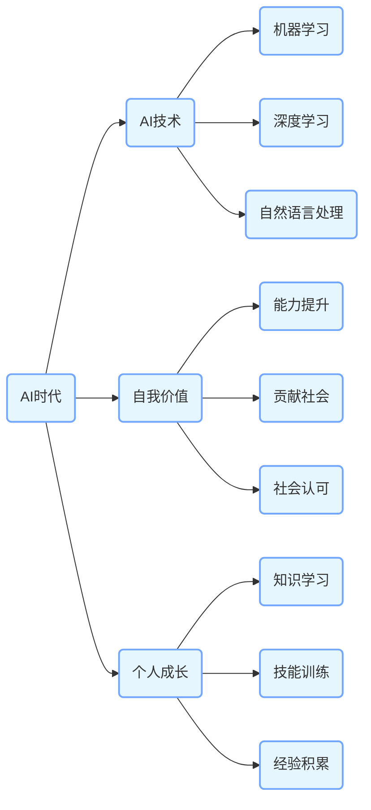

# 如何在AI时代实现自我价值与成长

> 关键词：AI时代、自我价值、个人成长、技能提升、职业发展

> 摘要：随着AI技术的迅猛发展，我们正身处一个前所未有的AI时代。在这个时代，AI深刻地改变了各个领域，也给个人的自我价值实现和成长带来了新的机遇与挑战。本文旨在深入探讨在AI时代，个人应如何顺应时代潮流，通过多种途径实现自我价值与成长，从背景介绍、核心概念解析、具体方法与步骤、数学模型辅助理解、项目实战案例、实际应用场景、工具资源推荐等多个方面进行全面阐述，最后对未来发展趋势与挑战进行总结，为读者提供全面且具有可操作性的指导。

## 1. 背景介绍 
### 1.1 目的和范围
本文章的目的在于帮助读者清晰地认识AI时代的特点和发展趋势，了解AI对个人职业、生活和成长带来的影响，进而探索在这个时代背景下实现自我价值与成长的有效途径和方法。范围涵盖了从理论层面的概念理解到实践层面的项目实战、应用场景分析，以及工具资源的推荐等多个方面，旨在为读者提供一个全面、系统的指导体系。

### 1.2 预期读者
本文预期读者包括但不限于即将步入职场的大学生、正在寻求职业转型的职场人士、对AI技术和个人成长有兴趣的爱好者，以及希望在AI时代提升自身竞争力的各类人群。无论你是刚刚接触AI领域，还是已经有一定的相关经验，都能从本文中获得有价值的信息和启示。

### 1.3 文档结构概述
本文首先介绍了AI时代的背景信息，包括目的、预期读者和文档结构等内容。接着深入探讨了核心概念与联系，帮助读者理解AI时代与自我价值、个人成长之间的内在关系。然后详细阐述了核心算法原理和具体操作步骤，通过Python代码进行示例讲解。随后介绍了数学模型和公式，通过具体的例子帮助读者理解。在项目实战部分，提供了代码实际案例和详细解释说明。接着分析了实际应用场景，让读者了解如何将所学知识应用到实际中。之后推荐了相关的工具和资源，包括学习资源、开发工具框架和论文著作等。最后对未来发展趋势与挑战进行总结，并提供了常见问题与解答以及扩展阅读和参考资料。

### 1.4 术语表
#### 1.4.1 核心术语定义
- **AI（Artificial Intelligence）**：即人工智能，是指计算机系统能够执行通常需要人类智能才能完成的任务，如学习、推理、解决问题、感知和语言理解等。
- **自我价值**：指个人对自己的能力、品德、贡献等方面的肯定和认可，是个人在社会和生活中所体现的价值。
- **个人成长**：包括知识、技能、经验、思维方式等方面的不断提升和发展，使个人在各个方面变得更加优秀和成熟。

#### 1.4.2 相关概念解释
- **AI赋能**：指利用AI技术提升个人或组织的能力和效率，使其在竞争中更具优势。
- **终身学习**：是一种持续的学习理念，强调个人在一生的不同阶段都应不断学习新知识、新技能，以适应社会的变化和发展。

#### 1.4.3 缩略词列表
- **AI**：Artificial Intelligence（人工智能）
- **ML**：Machine Learning（机器学习）
- **DL**：Deep Learning（深度学习）

## 2. 核心概念与联系 

在AI时代，AI技术与自我价值、个人成长之间存在着紧密的联系。AI技术的快速发展改变了社会的生产方式和生活方式，对个人的职业发展和成长带来了新的机遇和挑战。

### 核心概念原理

#### AI技术原理
AI技术主要基于机器学习、深度学习等算法，通过对大量数据的学习和分析，使计算机系统能够模拟人类的智能行为。例如，在图像识别领域，通过训练深度神经网络，让计算机能够识别出图像中的物体、人物等信息。

#### 自我价值原理
自我价值的实现取决于个人的能力、贡献和社会的认可。在AI时代，个人可以通过掌握AI相关技术，为社会创造更多的价值，从而实现自我价值的提升。例如，开发出具有创新性的AI应用，解决社会中的实际问题，就能够得到社会的认可和尊重。

#### 个人成长原理
个人成长是一个持续的过程，需要不断地学习和实践。在AI时代，个人可以利用AI技术提供的学习资源和工具，加速自己的成长。例如，通过在线学习平台，学习AI相关的课程，提升自己的知识和技能水平。

### 架构的文本示意图

```plaintext
AI时代
├── AI技术
│   ├── 机器学习
│   ├── 深度学习
│   └── 自然语言处理
├── 自我价值
│   ├── 能力提升
│   ├── 贡献社会
│   └── 社会认可
└── 个人成长
    ├── 知识学习
    ├── 技能训练
    └── 经验积累
```

### Mermaid流程图



## 3. 核心算法原理 & 具体操作步骤 

### 核心算法原理

在AI时代，机器学习和深度学习是非常重要的算法，下面以简单的线性回归算法为例，介绍其原理。

线性回归是一种用于预测连续数值的机器学习算法，其基本思想是通过找到一条直线，使得所有数据点到这条直线的距离之和最小。假设我们有一组数据 $(x_1, y_1), (x_2, y_2), \cdots, (x_n, y_n)$，我们要找到一条直线 $y = wx + b$，其中 $w$ 是斜率，$b$ 是截距，使得预测值 $\hat{y}_i = wx_i + b$ 与真实值 $y_i$ 之间的误差最小。

### 具体操作步骤

#### 步骤1：数据准备
首先，我们需要准备一组数据，包括输入特征 $x$ 和对应的目标值 $y$。

```python
import numpy as np

# 生成一些示例数据
x = np.array([1, 2, 3, 4, 5])
y = np.array([2, 4, 6, 8, 10])
```

#### 步骤2：定义模型
我们定义一个线性回归模型，即 $y = wx + b$。

```python
# 初始化参数
w = 0
b = 0

# 定义线性回归模型
def linear_regression(x, w, b):
    return w * x + b
```

#### 步骤3：定义损失函数
我们使用均方误差（Mean Squared Error, MSE）作为损失函数，其公式为 $MSE = \frac{1}{n} \sum_{i=1}^{n} (y_i - \hat{y}_i)^2$。

```python
# 定义损失函数
def mse_loss(y_true, y_pred):
    return np.mean((y_true - y_pred) ** 2)
```

#### 步骤4：训练模型
我们使用梯度下降法来更新参数 $w$ 和 $b$，使得损失函数最小化。

```python
# 定义学习率和迭代次数
learning_rate = 0.01
num_iterations = 1000

# 训练模型
for i in range(num_iterations):
    # 前向传播
    y_pred = linear_regression(x, w, b)
    
    # 计算损失
    loss = mse_loss(y, y_pred)
    
    # 计算梯度
    dw = np.mean((y_pred - y) * x)
    db = np.mean(y_pred - y)
    
    # 更新参数
    w -= learning_rate * dw
    b -= learning_rate * db
    
    # 打印损失
    if i % 100 == 0:
        print(f'Iteration {i}, Loss: {loss}')
```

#### 步骤5：预测
训练完成后，我们可以使用训练好的模型进行预测。

```python
# 进行预测
new_x = np.array([6])
new_y_pred = linear_regression(new_x, w, b)
print(f'Predicted value for x = 6: {new_y_pred}')
```

## 4. 数学模型和公式 & 详细讲解 & 举例说明 

### 线性回归数学模型和公式

线性回归的数学模型可以表示为：

$$y = wx + b + \epsilon$$

其中，$y$ 是目标值，$x$ 是输入特征，$w$ 是斜率，$b$ 是截距，$\epsilon$ 是误差项，通常假设 $\epsilon$ 服从均值为 0 的正态分布。

均方误差（MSE）损失函数的公式为：

$$MSE = \frac{1}{n} \sum_{i=1}^{n} (y_i - \hat{y}_i)^2$$

其中，$n$ 是数据点的数量，$y_i$ 是真实值，$\hat{y}_i$ 是预测值。

梯度下降法更新参数的公式为：

$$w = w - \alpha \frac{\partial MSE}{\partial w}$$

$$b = b - \alpha \frac{\partial MSE}{\partial b}$$

其中，$\alpha$ 是学习率，$\frac{\partial MSE}{\partial w}$ 和 $\frac{\partial MSE}{\partial b}$ 分别是损失函数对 $w$ 和 $b$ 的偏导数。

### 详细讲解

线性回归的目标是找到一组最优的参数 $w$ 和 $b$，使得预测值 $\hat{y}_i = wx_i + b$ 与真实值 $y_i$ 之间的误差最小。均方误差（MSE）是一种常用的损失函数，它衡量了预测值与真实值之间的平均误差。梯度下降法是一种迭代优化算法，通过不断地更新参数 $w$ 和 $b$，使得损失函数逐渐减小，最终找到最优的参数值。

### 举例说明

假设我们有一组数据 $(x_1, y_1) = (1, 2), (x_2, y_2) = (2, 4), (x_3, y_3) = (3, 6)$，我们要使用线性回归模型来预测 $x = 4$ 时的 $y$ 值。

首先，我们初始化参数 $w = 0$ 和 $b = 0$。然后，我们计算预测值 $\hat{y}_i = wx_i + b$，并计算损失函数 $MSE$。接着，我们使用梯度下降法更新参数 $w$ 和 $b$，不断迭代，直到损失函数收敛。

经过训练，我们得到最优的参数 $w = 2$ 和 $b = 0$，此时线性回归模型为 $y = 2x$。将 $x = 4$ 代入模型，得到预测值 $\hat{y} = 2 \times 4 = 8$。

## 5. 项目实战：代码实际案例和详细解释说明 

### 5.1  开发环境搭建

#### 安装Python
首先，我们需要安装Python。可以从Python官方网站（https://www.python.org/downloads/） 下载适合你操作系统的Python版本，并按照安装向导进行安装。

#### 安装必要的库
我们需要安装一些必要的Python库，如NumPy、Pandas、Matplotlib等。可以使用以下命令进行安装：

```sh
pip install numpy pandas matplotlib
```

### 5.2  源代码详细实现和代码解读

#### 项目背景
我们要实现一个简单的房价预测项目，使用线性回归算法根据房屋面积来预测房价。

#### 代码实现

```python
import numpy as np
import pandas as pd
import matplotlib.pyplot as plt

# 读取数据
data = pd.read_csv('house_prices.csv')
x = data['area'].values
y = data['price'].values

# 数据可视化
plt.scatter(x, y)
plt.xlabel('Area')
plt.ylabel('Price')
plt.show()

# 数据预处理
x = x.reshape(-1, 1)

# 初始化参数
w = 0
b = 0

# 定义线性回归模型
def linear_regression(x, w, b):
    return w * x + b

# 定义损失函数
def mse_loss(y_true, y_pred):
    return np.mean((y_true - y_pred) ** 2)

# 定义学习率和迭代次数
learning_rate = 0.01
num_iterations = 1000

# 训练模型
losses = []
for i in range(num_iterations):
    # 前向传播
    y_pred = linear_regression(x, w, b)
    
    # 计算损失
    loss = mse_loss(y, y_pred)
    losses.append(loss)
    
    # 计算梯度
    dw = np.mean((y_pred - y) * x)
    db = np.mean(y_pred - y)
    
    # 更新参数
    w -= learning_rate * dw
    b -= learning_rate * db
    
    # 打印损失
    if i % 100 == 0:
        print(f'Iteration {i}, Loss: {loss}')

# 绘制损失曲线
plt.plot(losses)
plt.xlabel('Iteration')
plt.ylabel('Loss')
plt.show()

# 进行预测
new_x = np.array([[200]])
new_y_pred = linear_regression(new_x, w, b)
print(f'Predicted price for area = 200: {new_y_pred}')
```

#### 代码解读

1. **数据读取**：使用 `pandas` 库读取存储房屋面积和房价数据的 CSV 文件。
2. **数据可视化**：使用 `matplotlib` 库绘制房屋面积和房价的散点图，直观地观察数据的分布情况。
3. **数据预处理**：将输入特征 `x` 进行形状调整，使其符合模型的输入要求。
4. **模型定义**：定义线性回归模型和均方误差损失函数。
5. **训练模型**：使用梯度下降法更新参数 $w$ 和 $b$，并记录每次迭代的损失值。
6. **绘制损失曲线**：绘制损失曲线，观察损失值的变化情况，判断模型是否收敛。
7. **预测**：使用训练好的模型对新的房屋面积进行预测。

### 5.3  代码解读与分析

#### 优点
- **简单易懂**：线性回归算法是一种简单的机器学习算法，易于理解和实现。
- **可解释性强**：线性回归模型的参数 $w$ 和 $b$ 具有明确的物理意义，可以解释为房屋面积对房价的影响程度和基础房价。

#### 缺点
- **局限性**：线性回归模型假设输入特征和目标值之间存在线性关系，对于复杂的非线性关系可能无法很好地拟合。
- **容易过拟合**：如果数据量较小或模型复杂度较高，线性回归模型容易过拟合，导致泛化能力下降。

## 6. 实际应用场景 

### 职业发展
在AI时代，掌握AI相关技术可以为个人的职业发展带来更多的机会。例如，数据分析师、AI工程师、机器学习专家等职业需求不断增加。个人可以通过学习和实践，提升自己的AI技能，从而在职业竞争中脱颖而出。

### 创业创新
AI技术为创业创新提供了广阔的空间。创业者可以利用AI技术开发出具有创新性的产品和服务，满足市场需求。例如，智能医疗、智能教育、智能交通等领域都有很大的发展潜力。

### 个人生活
AI技术也可以改善个人的生活质量。例如，智能家居系统可以实现家居设备的自动化控制，提高生活的便利性；智能健康监测设备可以实时监测个人的健康状况，提供个性化的健康建议。

## 7. 工具和资源推荐
### 7.1 学习资源推荐
#### 7.1.1 书籍推荐
- 《Python机器学习》：这本书详细介绍了Python在机器学习领域的应用，包括各种机器学习算法的原理和实现。
- 《深度学习》：由深度学习领域的三位顶尖专家所著，是深度学习领域的经典教材，全面介绍了深度学习的理论和实践。
- 《人工智能：一种现代的方法》：这是一本全面介绍人工智能领域的经典书籍，涵盖了人工智能的各个方面，包括搜索算法、知识表示、机器学习等。

#### 7.1.2 在线课程
- Coursera上的《机器学习》课程：由斯坦福大学的Andrew Ng教授主讲，是机器学习领域的经典课程，讲解深入浅出，适合初学者。
- edX上的《深度学习》课程：由麻省理工学院等高校的教授主讲，系统地介绍了深度学习的理论和实践。
- 中国大学MOOC上的《人工智能基础》课程：由国内知名高校的教授主讲，结合中国的实际情况，介绍了人工智能的基础知识和应用。

#### 7.1.3 技术博客和网站
- Medium：一个汇聚了众多技术专家和爱好者的平台，上面有很多关于AI技术的高质量文章。
- Towards Data Science：专注于数据科学和机器学习领域的博客，提供了很多实用的技术教程和案例分析。
- 机器之心：国内领先的人工智能媒体，提供了丰富的AI技术资讯、行业动态和技术文章。

### 7.2 开发工具框架推荐
#### 7.2.1 IDE和编辑器
- PyCharm：一款专业的Python集成开发环境，具有强大的代码编辑、调试和智能提示功能。
- Jupyter Notebook：一种交互式的开发环境，适合进行数据探索、模型训练和可视化等工作。
- Visual Studio Code：一款轻量级的代码编辑器，支持多种编程语言和插件扩展，非常适合快速开发和调试。

#### 7.2.2 调试和性能分析工具
- TensorBoard：TensorFlow提供的可视化工具，可以帮助用户直观地观察模型的训练过程和性能指标。
- PyTorch Profiler：PyTorch提供的性能分析工具，可以帮助用户找出模型中的性能瓶颈，进行优化。
- cProfile：Python标准库中的性能分析工具，可以分析Python代码的执行时间和函数调用情况。

#### 7.2.3 相关框架和库
- TensorFlow：Google开发的深度学习框架，具有广泛的应用和丰富的文档资源。
- PyTorch：Facebook开发的深度学习框架，以其动态图机制和简洁的API受到很多开发者的喜爱。
- Scikit-learn：一个简单易用的机器学习库，提供了各种机器学习算法的实现和工具。

### 7.3 相关论文著作推荐
#### 7.3.1 经典论文
- 《Gradient-Based Learning Applied to Document Recognition》：Yann LeCun等人发表的关于卷积神经网络（CNN）的经典论文，开创了深度学习在图像识别领域的应用。
- 《Attention Is All You Need》：Vaswani等人发表的关于Transformer架构的论文，提出了注意力机制，在自然语言处理领域取得了巨大的成功。
- 《ImageNet Classification with Deep Convolutional Neural Networks》：Alex Krizhevsky等人发表的关于AlexNet的论文，在2012年的ImageNet图像识别竞赛中取得了巨大的突破，开启了深度学习的新时代。

#### 7.3.2 最新研究成果
- 关注顶级学术会议，如NeurIPS（神经信息处理系统大会）、ICML（国际机器学习会议）、CVPR（计算机视觉与模式识别会议）等，这些会议上会发表很多最新的AI研究成果。
- 关注知名学术期刊，如Journal of Artificial Intelligence Research（JAIR）、Artificial Intelligence等，这些期刊上会发表经过同行评审的高质量研究论文。

#### 7.3.3 应用案例分析
- 《AI Superpowers: China, Silicon Valley, and the New World Order》：李开复所著，通过大量的案例分析，介绍了AI技术在各个领域的应用和发展趋势。
- 《The Age of AI and Our Human Future》：Henry Kissinger等人所著，探讨了AI技术对人类社会、政治、经济等方面的影响，并提出了相应的应对策略。

## 8. 总结：未来发展趋势与挑战

### 未来发展趋势
- **AI技术与各领域的深度融合**：AI技术将与医疗、教育、金融、交通等各个领域深度融合，推动各领域的智能化升级。
- **AI技术的普及化**：随着AI技术的不断发展和成本的降低，AI技术将逐渐普及到普通大众的生活中，成为人们日常生活的一部分。
- **AI技术的创新发展**：未来，AI技术将不断创新发展，出现更多新的算法、模型和应用场景。

### 挑战
- **技术伦理问题**：AI技术的发展带来了一系列的伦理问题，如隐私保护、算法偏见、失业风险等，需要我们认真对待和解决。
- **人才短缺问题**：AI技术的快速发展对人才的需求不断增加，目前AI领域的人才短缺问题较为严重，需要加强人才培养和引进。
- **安全问题**：AI系统的安全性也是一个重要的问题，如AI系统被攻击、数据泄露等，需要加强AI系统的安全防护。

## 9. 附录：常见问题与解答

### 问题1：在AI时代，哪些技能是最重要的？
答：在AI时代，以下技能是比较重要的：
- **数学基础**：包括线性代数、概率论、统计学等，是理解和应用AI算法的基础。
- **编程技能**：掌握Python等编程语言，能够实现和优化AI算法。
- **数据分析能力**：能够对数据进行收集、清洗、分析和可视化，为AI模型提供高质量的数据。
- **领域知识**：了解相关领域的业务知识，能够将AI技术应用到实际场景中。

### 问题2：如何学习AI技术？
答：学习AI技术可以从以下几个方面入手：
- **学习基础知识**：学习数学、编程等基础知识，为学习AI技术打下坚实的基础。
- **在线课程学习**：选择适合自己的在线课程，系统地学习AI技术的理论和实践。
- **实践项目**：通过实践项目，将所学的知识应用到实际中，提高自己的实践能力。
- **阅读论文和书籍**：阅读AI领域的经典论文和书籍，了解最新的研究成果和发展趋势。

### 问题3：AI技术会导致大量失业吗？
答：AI技术的发展确实会对一些传统职业产生影响，但同时也会创造出一些新的职业和就业机会。虽然一些重复性、规律性的工作可能会被AI技术取代，但人类的创造力、情感理解、人际交往等能力是AI技术无法替代的。因此，我们需要不断提升自己的技能和能力，适应AI时代的发展变化。

## 10. 扩展阅读 & 参考资料

### 扩展阅读
- 《人类简史：从动物到上帝》：尤瓦尔·赫拉利所著，探讨了人类的进化历程和未来发展趋势，对理解AI时代的人类社会有一定的启发。
- 《生命3.0：人工智能时代人类的进化与重生》：迈克斯·泰格马克所著，从科学和哲学的角度探讨了AI技术对人类未来的影响。

### 参考资料
- 相关学术论文和研究报告
- 各大技术公司的官方文档和博客
- 知名技术媒体和网站的报道和文章