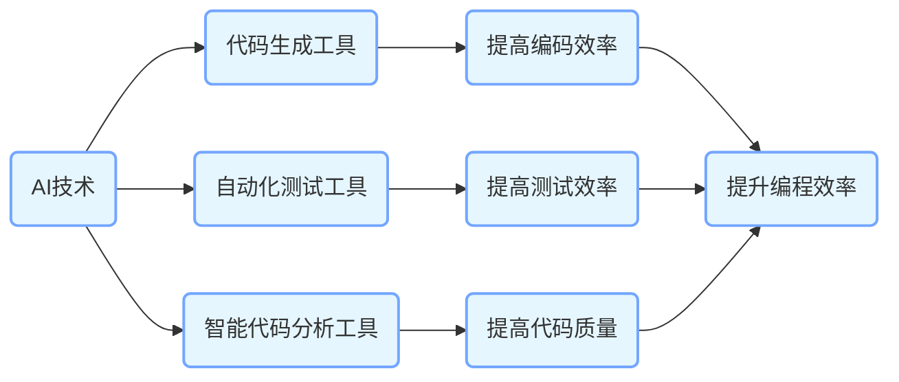

# 如何在AI时代提升编程效率

> 关键词：AI时代、编程效率、代码生成工具、自动化测试、集成开发环境

> 摘要：在当今AI时代，编程领域正经历着深刻的变革。AI技术的快速发展为程序员提供了众多提升编程效率的新途径和方法。本文旨在深入探讨在AI时代提升编程效率的各种策略和技术，从核心概念入手，详细讲解相关算法原理和操作步骤，通过数学模型进行理论支持，结合项目实战案例进行代码分析，阐述实际应用场景，并推荐相关的工具和资源。最后对未来发展趋势与挑战进行总结，帮助程序员更好地利用AI技术提升编程效率。

## 1. 背景介绍 
### 1.1 目的和范围
在AI时代，编程工作的复杂性和规模不断增加，如何提高编程效率成为了程序员和软件开发团队面临的重要问题。本文的目的是全面探讨在AI时代提升编程效率的方法和策略，范围涵盖从基础的编程理念到先进的AI辅助工具和技术。

### 1.2 预期读者
本文预期读者主要包括程序员、软件工程师、软件开发团队成员、编程爱好者以及对AI在编程领域应用感兴趣的相关人员。

### 1.3 文档结构概述
本文首先介绍背景信息，包括目的、预期读者和文档结构概述等内容。接着阐述核心概念与联系，包括相关概念的原理和架构。然后详细讲解核心算法原理和具体操作步骤，通过数学模型和公式进行理论分析。之后通过项目实战案例进行代码实现和解读。再介绍实际应用场景，推荐相关的工具和资源。最后总结未来发展趋势与挑战，提供常见问题与解答以及扩展阅读和参考资料。

### 1.4 术语表
#### 1.4.1 核心术语定义
- **AI（Artificial Intelligence）**：人工智能，是研究、开发用于模拟、延伸和扩展人的智能的理论、方法、技术及应用系统的一门新的技术科学。
- **编程效率**：指程序员在单位时间内完成编程任务的质量和数量。
- **代码生成工具**：利用AI技术自动生成代码的工具。
- **自动化测试**：使用软件工具自动执行测试用例的过程。

#### 1.4.2 相关概念解释
- **AI辅助编程**：利用AI技术为程序员提供代码建议、自动补全、错误检查等功能，帮助程序员更高效地编写代码。
- **持续集成与持续部署（CI/CD）**：通过自动化流程，实现代码的频繁集成和快速部署。

#### 1.4.3 缩略词列表
- **AI**：Artificial Intelligence
- **CI/CD**：Continuous Integration/Continuous Deployment

## 2. 核心概念与联系 

### 核心概念原理
在AI时代，提升编程效率的核心概念主要围绕AI技术与编程的结合。AI技术可以通过对大量代码数据的学习和分析，为程序员提供智能的辅助功能。例如，代码生成工具利用机器学习算法，学习不同编程语言的语法规则和常见代码模式，根据用户输入的需求自动生成代码。自动化测试工具则利用AI技术对测试用例进行优化和智能执行，提高测试效率和覆盖率。

### 架构示意图


这个流程图展示了AI技术与提升编程效率相关工具和目标之间的关系。AI技术作为核心，为代码生成工具、自动化测试工具和智能代码分析工具提供支持，这些工具分别从不同方面提高编码效率、测试效率和代码质量，最终实现提升编程效率的目标。

## 3. 核心算法原理 & 具体操作步骤 

### 代码生成工具的核心算法原理
代码生成工具的核心算法通常基于深度学习中的序列到序列（Sequence-to-Sequence）模型，如Transformer架构。下面是一个简单的Python示例，使用PyTorch实现一个基本的序列到序列模型：

```python
import torch
import torch.nn as nn

# 定义编码器
class Encoder(nn.Module):
    def __init__(self, input_size, hidden_size):
        super(Encoder, self).__init__()
        self.hidden_size = hidden_size
        self.embedding = nn.Embedding(input_size, hidden_size)
        self.gru = nn.GRU(hidden_size, hidden_size)

    def forward(self, input, hidden):
        embedded = self.embedding(input).view(1, 1, -1)
        output = embedded
        output, hidden = self.gru(output, hidden)
        return output, hidden

    def initHidden(self):
        return torch.zeros(1, 1, self.hidden_size)

# 定义解码器
class Decoder(nn.Module):
    def __init__(self, hidden_size, output_size):
        super(Decoder, self).__init__()
        self.hidden_size = hidden_size
        self.embedding = nn.Embedding(output_size, hidden_size)
        self.gru = nn.GRU(hidden_size, hidden_size)
        self.out = nn.Linear(hidden_size, output_size)
        self.softmax = nn.LogSoftmax(dim=1)

    def forward(self, input, hidden):
        output = self.embedding(input).view(1, 1, -1)
        output = nn.functional.relu(output)
        output, hidden = self.gru(output, hidden)
        output = self.softmax(self.out(output[0]))
        return output, hidden

    def initHidden(self):
        return torch.zeros(1, 1, self.hidden_size)
```

### 具体操作步骤
1. **数据准备**：收集大量的代码数据，并进行预处理，包括分词、标记化等操作。
2. **模型训练**：使用准备好的数据对序列到序列模型进行训练，调整模型的参数以提高生成代码的质量。
3. **模型部署**：将训练好的模型部署到代码生成工具中，供程序员使用。
4. **用户交互**：程序员在编写代码时，输入需求，代码生成工具根据需求生成相应的代码。

## 4. 数学模型和公式 & 详细讲解 & 举例说明 

### 序列到序列模型的数学模型
序列到序列模型的核心是编码器 - 解码器（Encoder - Decoder）结构。编码器将输入序列 $X = \{x_1, x_2, ..., x_n\}$ 编码为一个固定长度的向量 $c$，解码器根据这个向量生成输出序列 $Y = \{y_1, y_2, ..., y_m\}$。

编码器的数学公式可以表示为：
$$
h_t = f(x_t, h_{t-1})
$$
其中 $h_t$ 是编码器在时间步 $t$ 的隐藏状态，$x_t$ 是输入序列在时间步 $t$ 的输入，$f$ 是编码器的循环神经网络（如GRU或LSTM）的更新函数。

解码器的数学公式可以表示为：
$$
p(y_t|y_{<t}, c) = g(y_{t-1}, s_{t-1}, c)
$$
其中 $p(y_t|y_{<t}, c)$ 是在给定之前的输出 $y_{<t}$ 和编码器输出 $c$ 的条件下，生成 $y_t$ 的概率，$g$ 是解码器的神经网络函数，$s_t$ 是解码器在时间步 $t$ 的隐藏状态。

### 举例说明
假设我们要生成一个简单的Python函数，输入需求为“生成一个计算两个数之和的函数”。编码器将这个需求编码为一个向量，解码器根据这个向量生成如下代码：

```python
def add_numbers(a, b):
    return a + b
```

## 5. 项目实战：代码实际案例和详细解释说明 

### 5.1  开发环境搭建
- **操作系统**：Windows、Linux或macOS
- **编程语言**：Python 3.x
- **深度学习框架**：PyTorch
- **开发工具**：PyCharm或VS Code

### 5.2  源代码详细实现和代码解读
下面是一个使用PyTorch实现的简单代码生成工具的完整示例：

```python
import torch
import torch.nn as nn
import torch.optim as optim
import random

# 定义编码器
class Encoder(nn.Module):
    def __init__(self, input_size, hidden_size):
        super(Encoder, self).__init__()
        self.hidden_size = hidden_size
        self.embedding = nn.Embedding(input_size, hidden_size)
        self.gru = nn.GRU(hidden_size, hidden_size)

    def forward(self, input, hidden):
        embedded = self.embedding(input).view(1, 1, -1)
        output = embedded
        output, hidden = self.gru(output, hidden)
        return output, hidden

    def initHidden(self):
        return torch.zeros(1, 1, self.hidden_size)

# 定义解码器
class Decoder(nn.Module):
    def __init__(self, hidden_size, output_size):
        super(Decoder, self).__init__()
        self.hidden_size = hidden_size
        self.embedding = nn.Embedding(output_size, hidden_size)
        self.gru = nn.GRU(hidden_size, hidden_size)
        self.out = nn.Linear(hidden_size, output_size)
        self.softmax = nn.LogSoftmax(dim=1)

    def forward(self, input, hidden):
        output = self.embedding(input).view(1, 1, -1)
        output = nn.functional.relu(output)
        output, hidden = self.gru(output, hidden)
        output = self.softmax(self.out(output[0]))
        return output, hidden

    def initHidden(self):
        return torch.zeros(1, 1, self.hidden_size)

# 训练函数
def train(input_tensor, target_tensor, encoder, decoder, encoder_optimizer, decoder_optimizer, criterion):
    encoder_hidden = encoder.initHidden()
    encoder_optimizer.zero_grad()
    decoder_optimizer.zero_grad()
    input_length = input_tensor.size(0)
    target_length = target_tensor.size(0)
    encoder_outputs = torch.zeros(input_length, encoder.hidden_size)
    loss = 0
    for ei in range(input_length):
        encoder_output, encoder_hidden = encoder(input_tensor[ei], encoder_hidden)
        encoder_outputs[ei] = encoder_output[0, 0]
    decoder_input = torch.tensor([[0]])
    decoder_hidden = encoder_hidden
    for di in range(target_length):
        decoder_output, decoder_hidden = decoder(decoder_input, decoder_hidden)
        topv, topi = decoder_output.topk(1)
        decoder_input = topi.squeeze().detach()
        loss += criterion(decoder_output, target_tensor[di].unsqueeze(0))
        if decoder_input.item() == 1:
            break
    loss.backward()
    encoder_optimizer.step()
    decoder_optimizer.step()
    return loss.item() / target_length

# 主函数
def main():
    # 定义参数
    input_size = 100
    hidden_size = 128
    output_size = 100
    learning_rate = 0.01
    n_iters = 1000
    print_every = 100
    plot_every = 100
    # 初始化模型
    encoder = Encoder(input_size, hidden_size)
    decoder = Decoder(hidden_size, output_size)
    # 定义优化器和损失函数
    encoder_optimizer = optim.SGD(encoder.parameters(), lr=learning_rate)
    decoder_optimizer = optim.SGD(decoder.parameters(), lr=learning_rate)
    criterion = nn.NLLLoss()
    # 模拟训练数据
    training_pairs = []
    for i in range(100):
        input_tensor = torch.randint(0, input_size, (10,))
        target_tensor = torch.randint(0, output_size, (10,))
        training_pairs.append((input_tensor, target_tensor))
    # 训练模型
    for iter in range(1, n_iters + 1):
        training_pair = random.choice(training_pairs)
        input_tensor = training_pair[0]
        target_tensor = training_pair[1]
        loss = train(input_tensor, target_tensor, encoder, decoder, encoder_optimizer, decoder_optimizer, criterion)
        if iter % print_every == 0:
            print(f'Iter: {iter}, Loss: {loss}')

if __name__ == '__main__':
    main()
```

### 5.3  代码解读与分析
- **编码器（Encoder）**：将输入序列编码为一个固定长度的向量。使用嵌入层将输入的单词转换为向量，然后通过GRU循环神经网络进行编码。
- **解码器（Decoder）**：根据编码器输出的向量生成输出序列。同样使用嵌入层和GRU循环神经网络，最后通过线性层和softmax函数输出每个单词的概率。
- **训练函数（train）**：使用随机梯度下降（SGD）优化器和负对数似然损失（NLLLoss）函数进行训练。在每个时间步，计算损失并进行反向传播更新模型参数。
- **主函数（main）**：初始化模型、优化器和损失函数，模拟训练数据，然后进行训练。

## 6. 实际应用场景 
### 快速原型开发
在快速原型开发阶段，程序员可以使用代码生成工具快速生成基本的代码框架，节省时间和精力。例如，在开发一个Web应用时，可以使用代码生成工具快速生成数据库操作、路由配置等代码。

### 代码优化和重构
AI辅助工具可以对现有代码进行分析，提供优化建议和重构方案。例如，智能代码分析工具可以检测代码中的性能瓶颈和潜在的错误，并提供相应的改进建议。

### 自动化测试
自动化测试工具可以利用AI技术自动生成测试用例，提高测试效率和覆盖率。例如，在进行单元测试时，自动化测试工具可以根据代码的功能和结构自动生成测试用例，减少手动编写测试用例的工作量。

## 7. 工具和资源推荐
### 7.1 学习资源推荐
#### 7.1.1 书籍推荐
- 《深度学习》（Deep Learning）：由Ian Goodfellow、Yoshua Bengio和Aaron Courville撰写，是深度学习领域的经典教材。
- 《Python深度学习》（Deep Learning with Python）：由Francois Chollet撰写，介绍了如何使用Python和Keras进行深度学习开发。

#### 7.1.2 在线课程
- Coursera上的“深度学习专项课程”（Deep Learning Specialization）：由Andrew Ng教授授课，涵盖了深度学习的各个方面。
- edX上的“使用Python进行数据科学”（Data Science with Python）：介绍了Python在数据科学和机器学习中的应用。

#### 7.1.3 技术博客和网站
- Medium：有许多关于AI和编程的技术博客文章。
- Towards Data Science：专注于数据科学和机器学习领域的技术文章。

### 7.2 开发工具框架推荐
#### 7.2.1 IDE和编辑器
- PyCharm：功能强大的Python集成开发环境，提供代码自动补全、调试等功能。
- Visual Studio Code：轻量级的代码编辑器，支持多种编程语言，有丰富的插件扩展。

#### 7.2.2 调试和性能分析工具
- Py-Spy：用于分析Python代码的性能，找出性能瓶颈。
- PDB：Python自带的调试器，可用于调试Python代码。

#### 7.2.3 相关框架和库
- PyTorch：开源的深度学习框架，提供丰富的深度学习模型和工具。
- TensorFlow：Google开发的深度学习框架，广泛应用于各种深度学习任务。

### 7.3 相关论文著作推荐
#### 7.3.1 经典论文
- “Attention Is All You Need”：介绍了Transformer架构，是序列到序列模型的重要突破。
- “Generative Adversarial Nets”：提出了生成对抗网络（GAN）的概念。

#### 7.3.2 最新研究成果
- 关注顶级学术会议，如NeurIPS、ICML等，了解最新的AI研究成果。

#### 7.3.3 应用案例分析
- 查看开源项目和实际应用案例，了解AI在编程领域的具体应用和实践经验。

## 8. 总结：未来发展趋势与挑战
### 未来发展趋势
- **更智能的代码生成工具**：未来的代码生成工具将更加智能，能够理解更复杂的需求，生成更高质量的代码。
- **AI与编程教育的结合**：AI技术将在编程教育中发挥更大的作用，提供个性化的学习方案和智能辅导。
- **自动化软件开发流程**：AI将进一步推动软件开发流程的自动化，实现从需求分析到代码部署的全流程自动化。

### 挑战
- **数据隐私和安全**：AI技术依赖大量的数据，如何保护数据的隐私和安全是一个重要的挑战。
- **AI的可解释性**：AI模型的决策过程往往难以解释，如何提高AI的可解释性是一个需要解决的问题。
- **人类与AI的协作**：如何实现人类程序员与AI工具的有效协作，发挥各自的优势，是一个需要探索的领域。

## 9. 附录：常见问题与解答
### 问题1：代码生成工具生成的代码质量如何保证？
答：代码生成工具生成的代码质量可以通过以下方式保证：一是使用大量高质量的代码数据进行训练，提高模型的学习能力；二是对生成的代码进行人工审查和优化；三是结合智能代码分析工具对生成的代码进行检查和改进。

### 问题2：AI辅助编程会取代人类程序员吗？
答：不会。AI辅助编程工具可以提高编程效率，但人类程序员的创造力、逻辑思维和问题解决能力是不可替代的。AI辅助编程工具是人类程序员的助手，帮助他们更高效地完成工作。

### 问题3：如何选择适合自己的AI辅助编程工具？
答：可以根据自己的需求和使用场景选择适合的AI辅助编程工具。例如，如果需要快速生成代码，可以选择代码生成工具；如果需要进行代码优化和重构，可以选择智能代码分析工具。同时，还可以参考工具的用户评价和社区活跃度等因素。

## 10. 扩展阅读 & 参考资料
- 《人工智能：一种现代的方法》（Artificial Intelligence: A Modern Approach）
- OpenAI官方文档
- GitHub上的相关开源项目

以上就是关于如何在AI时代提升编程效率的详细介绍，希望对读者有所帮助。通过不断学习和应用新的技术和方法，程序员可以在AI时代更好地提升编程效率，实现更高效的软件开发。