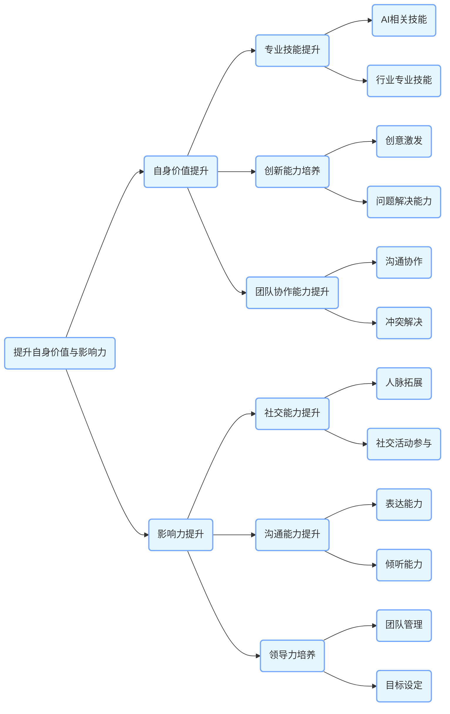

# 如何在AI时代提升自身的价值与影响力

> 关键词：AI时代、自身价值、影响力提升、技能发展、职业规划

> 摘要：随着人工智能技术的飞速发展，AI时代已经深刻地改变了我们的生活和工作方式。在这个充满机遇和挑战的时代，每个人都面临着如何提升自身价值与影响力的问题。本文将深入探讨在AI时代提升自身价值与影响力的方法和策略，从背景介绍入手，分析核心概念，阐述相关算法原理，建立数学模型，通过项目实战案例进行说明，介绍实际应用场景，推荐相关工具和资源，最后总结未来发展趋势与挑战，并解答常见问题，为读者提供全面且深入的指导。

## 1. 背景介绍 
### 1.1 目的和范围
在AI时代，人工智能技术的广泛应用对各个行业产生了深远的影响。许多传统的工作岗位面临着被自动化和智能化取代的风险，同时也催生了大量与AI相关的新兴职业。本文的目的在于帮助读者了解在这样的时代背景下，如何通过提升自身的价值与影响力，更好地适应变化，抓住机遇，实现个人的职业发展和成长。本文的范围涵盖了个人在技能培养、职业规划、社交互动等多个方面的提升策略，旨在为读者提供全面的指导。

### 1.2 预期读者
本文的预期读者包括但不限于以下几类人群：正在寻求职业转型的职场人士，希望在AI时代找到新的发展方向；即将毕业的大学生，为进入职场做好充分准备；对个人成长和发展有追求的终身学习者，希望不断提升自己的竞争力。

### 1.3 文档结构概述
本文将按照以下结构进行阐述：首先介绍核心概念与联系，帮助读者理解在AI时代提升自身价值与影响力的相关概念和原理；接着讲解核心算法原理和具体操作步骤，以Python代码为例进行详细说明；然后建立数学模型并进行公式讲解和举例；通过项目实战案例展示如何将理论应用到实际中；介绍在不同领域的实际应用场景；推荐相关的学习工具、资源和论文著作；最后总结未来发展趋势与挑战，解答常见问题，并提供扩展阅读和参考资料。

### 1.4 术语表
#### 1.4.1 核心术语定义
- **AI时代**：指以人工智能技术为核心驱动力，广泛应用于各个领域，深刻改变社会经济和生活方式的时代。
- **自身价值**：个人所具备的知识、技能、经验、品质等方面的综合能力，以及这些能力在社会和职场中所体现出的价值。
- **影响力**：个人通过自身的行为、言论、成果等对他人、组织或社会产生的影响和作用。

#### 1.4.2 相关概念解释
- **技能迁移**：将在一个领域或岗位上所学到的技能应用到其他领域或岗位的过程。在AI时代，技能迁移能力对于个人适应不同的工作需求至关重要。
- **数字素养**：指个人在数字环境中获取、理解、评估、创造和交流信息的能力，包括对数字技术的使用、数据的处理和分析等方面。

#### 1.4.3 缩略词列表
- **AI**：Artificial Intelligence，人工智能
- **ML**：Machine Learning，机器学习
- **DL**：Deep Learning，深度学习

## 2. 核心概念与联系 

### 核心概念原理
在AI时代，提升自身价值与影响力的核心在于不断学习和掌握新的知识与技能，适应技术的发展和变化。自身价值的提升主要体现在专业技能、创新能力、团队协作能力等方面。专业技能是个人在职场中立足的基础，随着AI技术的发展，掌握与AI相关的技能如机器学习、数据分析等将成为提升自身价值的关键。创新能力则是在竞争激烈的市场中脱颖而出的重要因素，能够提出新颖的想法和解决方案，为企业和社会创造更大的价值。团队协作能力也是不可或缺的，在AI项目中，往往需要不同专业背景的人员共同合作，才能完成复杂的任务。

影响力的提升则与个人的社交能力、沟通能力和领导力密切相关。通过积极参与社交活动，与同行、专家进行交流和合作，可以扩大自己的人脉资源，提高自己的知名度和影响力。良好的沟通能力能够让个人更好地表达自己的观点和想法，赢得他人的认可和支持。领导力则体现在能够带领团队实现目标，推动项目的进展。

### 架构的文本示意图
```plaintext
提升自身价值与影响力
|-- 自身价值提升
|   |-- 专业技能提升
|   |   |-- AI相关技能（机器学习、数据分析等）
|   |   |-- 行业专业技能
|   |-- 创新能力培养
|   |   |-- 创意激发
|   |   |-- 问题解决能力
|   |-- 团队协作能力提升
|       |-- 沟通协作
|       |-- 冲突解决
|-- 影响力提升
|   |-- 社交能力提升
|   |   |-- 人脉拓展
|   |   |-- 社交活动参与
|   |-- 沟通能力提升
|   |   |-- 表达能力
|   |   |-- 倾听能力
|   |-- 领导力培养
|       |-- 团队管理
|       |-- 目标设定
```

### Mermaid流程图


## 3. 核心算法原理 & 具体操作步骤 

### 核心算法原理
在提升自身价值与影响力的过程中，可以借鉴一些算法的思想。例如，我们可以将个人的成长过程看作是一个优化问题，通过不断地迭代和改进，逐步提高自身的价值和影响力。以下是一个简单的算法模型：

#### 目标函数
假设我们用 $V$ 表示自身价值，$I$ 表示影响力，我们的目标是最大化目标函数 $F(V, I)$，可以简单表示为：

$F(V, I) = w_1V + w_2I$

其中 $w_1$ 和 $w_2$ 是权重系数，根据个人的需求和重点进行调整。

#### 迭代过程
在每一个迭代步骤中，我们可以通过以下方式更新自身价值和影响力：

- **自身价值更新**：
$V_{t+1} = V_t + \Delta V$

其中 $\Delta V$ 表示在当前迭代中自身价值的增加量，可以通过学习新的知识和技能、完成项目等方式获得。

- **影响力更新**：
$I_{t+1} = I_t + \Delta I$

其中 $\Delta I$ 表示在当前迭代中影响力的增加量，可以通过社交活动、发表文章等方式获得。

### 具体操作步骤

#### 步骤1：设定目标
根据个人的职业规划和发展需求，确定自身价值和影响力的目标。例如，在一定时间内掌握某种AI技能，或者在某个领域建立一定的知名度。

#### 步骤2：制定计划
根据目标，制定详细的学习和发展计划。例如，安排学习时间，参加培训课程，参与社交活动等。

#### 步骤3：执行计划
按照计划进行学习和实践，不断积累知识和经验，提高自身的价值和影响力。

#### 步骤4：评估和调整
定期对自己的进展进行评估，根据评估结果调整计划。如果发现某个方面的进展不理想，可以及时调整学习方法或重点。

### Python源代码实现
```python
# 初始化参数
w1 = 0.6  # 自身价值权重
w2 = 0.4  # 影响力权重
V = 10    # 初始自身价值
I = 5     # 初始影响力
iterations = 10  # 迭代次数

# 迭代过程
for t in range(iterations):
    # 模拟自身价值增加量
    delta_V = 2  # 这里简单假设每次迭代自身价值增加2
    V = V + delta_V
    
    # 模拟影响力增加量
    delta_I = 1  # 这里简单假设每次迭代影响力增加1
    I = I + delta_I
    
    # 计算目标函数值
    F = w1 * V + w2 * I
    
    print(f"迭代次数: {t+1}, 自身价值: {V}, 影响力: {I}, 目标函数值: {F}")
```

### 代码解释
- 首先，我们初始化了自身价值和影响力的权重系数 $w_1$ 和 $w_2$，以及初始的自身价值 $V$ 和影响力 $I$。
- 然后，我们设定了迭代次数 `iterations`。
- 在每次迭代中，我们模拟了自身价值和影响力的增加量 $\Delta V$ 和 $\Delta I$，并更新了自身价值和影响力。
- 最后，我们计算了目标函数 $F(V, I)$ 的值，并打印出每次迭代的结果。

## 4. 数学模型和公式 & 详细讲解 & 举例说明 

### 数学模型
我们可以将提升自身价值与影响力的过程建立一个更复杂的数学模型。假设自身价值 $V$ 受到多个因素的影响，包括知识储备 $K$、技能水平 $S$、经验 $E$ 等，可以表示为：

$V = f(K, S, E)$

影响力 $I$ 则受到社交网络规模 $N$、个人声誉 $R$、成果展示 $P$ 等因素的影响，可以表示为：

$I = g(N, R, P)$

目标函数仍然是 $F(V, I) = w_1V + w_2I$。

### 公式详细讲解
- **自身价值公式**：
$V = f(K, S, E)$ 可以是一个线性组合，例如：

$V = a_1K + a_2S + a_3E$

其中 $a_1$、$a_2$、$a_3$ 是权重系数，表示不同因素对自身价值的贡献程度。知识储备 $K$ 可以通过学习的课程数量、阅读的书籍数量等进行量化；技能水平 $S$ 可以通过技能考试的成绩、项目实践的经验等进行评估；经验 $E$ 可以通过工作年限、参与的项目数量等进行衡量。

- **影响力公式**：
$I = g(N, R, P)$ 也可以是一个线性组合，例如：

$I = b_1N + b_2R + b_3P$

其中 $b_1$、$b_2$、$b_3$ 是权重系数。社交网络规模 $N$ 可以通过社交平台上的关注者数量、人脉关系的数量等进行统计；个人声誉 $R$ 可以通过他人的评价、获得的奖项等进行评估；成果展示 $P$ 可以通过发表的文章数量、获得的专利数量等进行衡量。

### 举例说明
假设一个人在某个领域的知识储备 $K = 80$（满分100分），技能水平 $S = 70$，经验 $E = 5$ 年。权重系数 $a_1 = 0.4$，$a_2 = 0.3$，$a_3 = 0.3$，则自身价值为：

$V = 0.4\times80 + 0.3\times70 + 0.3\times5 = 32 + 21 + 1.5 = 54.5$

假设这个人的社交网络规模 $N = 200$ 人，个人声誉 $R = 85$（满分100分），成果展示 $P = 10$ 篇文章。权重系数 $b_1 = 0.2$，$b_2 = 0.5$，$b_3 = 0.3$，则影响力为：

$I = 0.2\times200 + 0.5\times85 + 0.3\times10 = 40 + 42.5 + 3 = 85.5$

假设权重系数 $w_1 = 0.6$，$w_2 = 0.4$，则目标函数值为：

$F = 0.6\times54.5 + 0.4\times85.5 = 32.7 + 34.2 = 66.9$

## 5. 项目实战：代码实际案例和详细解释说明 

### 5.1  开发环境搭建
为了实现一个简单的项目来提升自身在AI领域的价值和影响力，我们可以选择Python作为开发语言，并使用一些常用的库，如 `numpy`、`pandas`、`scikit-learn` 等。以下是搭建开发环境的步骤：

#### 步骤1：安装Python
可以从Python官方网站（https://www.python.org/downloads/） 下载并安装Python 3.x版本。

#### 步骤2：安装虚拟环境
使用 `venv` 模块创建一个虚拟环境，打开终端并执行以下命令：

```sh
python -m venv myenv
```

激活虚拟环境：

- 在Windows上：
```sh
myenv\Scripts\activate
```

- 在Linux或Mac上：
```sh
source myenv/bin/activate
```

#### 步骤3：安装所需库
在激活的虚拟环境中，使用 `pip` 安装所需的库：

```sh
pip install numpy pandas scikit-learn
```

### 5.2  源代码详细实现和代码解读
我们以一个简单的机器学习项目为例，使用鸢尾花数据集进行分类任务。

```python
# 导入所需的库
import numpy as np
import pandas as pd
from sklearn.datasets import load_iris
from sklearn.model_selection import train_test_split
from sklearn.tree import DecisionTreeClassifier
from sklearn.metrics import accuracy_score

# 加载鸢尾花数据集
iris = load_iris()
X = iris.data  # 特征数据
y = iris.target  # 标签数据

# 划分训练集和测试集
X_train, X_test, y_train, y_test = train_test_split(X, y, test_size=0.2, random_state=42)

# 创建决策树分类器
clf = DecisionTreeClassifier()

# 训练模型
clf.fit(X_train, y_train)

# 预测测试集
y_pred = clf.predict(X_test)

# 计算准确率
accuracy = accuracy_score(y_test, y_pred)
print(f"模型准确率: {accuracy}")
```

### 代码解读与分析
- **导入库**：导入了 `numpy`、`pandas`、`sklearn` 等库，用于数据处理、机器学习模型的构建和评估。
- **加载数据集**：使用 `load_iris` 函数加载鸢尾花数据集，并将特征数据和标签数据分别存储在 `X` 和 `y` 中。
- **划分训练集和测试集**：使用 `train_test_split` 函数将数据集划分为训练集和测试集，测试集占比为20%。
- **创建模型**：创建一个决策树分类器 `DecisionTreeClassifier`。
- **训练模型**：使用训练集数据对模型进行训练。
- **预测测试集**：使用训练好的模型对测试集进行预测。
- **计算准确率**：使用 `accuracy_score` 函数计算模型的准确率。

通过完成这个项目，我们可以学习到机器学习的基本流程，提高自己在AI领域的技能水平，从而提升自身价值。同时，我们可以将这个项目分享到社交媒体或技术论坛上，展示自己的成果，提高自己的影响力。

## 6. 实际应用场景 
### 职场晋升
在AI时代，企业对于具备AI技能的人才需求越来越大。通过提升自身在AI领域的价值和影响力，个人可以更容易地获得职场晋升的机会。例如，在数据分析岗位上，掌握机器学习和深度学习技术的员工能够更好地处理和分析大量的数据，为企业提供更有价值的决策支持，从而得到上级的认可和晋升。

### 创业创新
AI技术为创业创新提供了广阔的空间。拥有AI相关技能和影响力的创业者可以更容易地吸引投资和合作伙伴。例如，开发一款基于AI的智能客服系统，创业者需要具备机器学习、自然语言处理等技术能力，同时通过在行业内的影响力，吸引客户和投资者的关注。

### 学术研究
在学术领域，提升自身价值和影响力对于科研人员来说至关重要。掌握AI技术可以帮助科研人员更好地处理和分析实验数据，提高研究效率和质量。同时，在学术会议上发表论文、展示研究成果，可以扩大自己在学术界的影响力，获得更多的合作机会和资源支持。

### 教育领域
在教育领域，教师可以通过学习AI技术，将其应用到教学中，提高教学效果。例如，使用AI辅助教学工具进行个性化教学，根据学生的学习情况提供针对性的学习建议。教师还可以通过分享自己的教学经验和成果，在教育领域建立自己的影响力。

## 7. 工具和资源推荐
### 7.1 学习资源推荐
#### 7.1.1 书籍推荐
- 《Python机器学习》：全面介绍了使用Python进行机器学习的方法和技术，适合初学者入门。
- 《深度学习》：由深度学习领域的三位顶尖专家撰写，是深度学习领域的经典著作。
- 《人工智能：一种现代的方法》：涵盖了人工智能的各个方面，是人工智能领域的权威教材。

#### 7.1.2 在线课程
- Coursera上的“机器学习”课程：由斯坦福大学教授Andrew Ng主讲，是机器学习领域的经典课程。
- edX上的“深度学习”课程：提供了深度学习的系统学习内容，包括理论和实践。
- 中国大学MOOC上的“人工智能基础”课程：适合国内学习者，内容丰富，讲解详细。

#### 7.1.3 技术博客和网站
- Medium：有很多关于AI和机器学习的优质文章，作者来自不同的领域和背景。
- Towards Data Science：专注于数据科学和机器学习领域，提供了大量的技术文章和案例分析。
- 机器之心：国内知名的AI技术媒体，及时报道AI领域的最新动态和技术进展。

### 7.2 开发工具框架推荐
#### 7.2.1 IDE和编辑器
- PyCharm：功能强大的Python集成开发环境，提供了代码编辑、调试、版本控制等功能。
- Jupyter Notebook：交互式的开发环境，适合进行数据分析和机器学习实验，方便代码的展示和分享。
- Visual Studio Code：轻量级的代码编辑器，支持多种编程语言，有丰富的插件扩展。

#### 7.2.2 调试和性能分析工具
- PDB：Python自带的调试器，可以帮助开发者定位和解决代码中的问题。
- TensorBoard：用于可视化深度学习模型的训练过程和性能指标，方便开发者进行模型调优。
- cProfile：Python的性能分析工具，可以分析代码的运行时间和内存使用情况。

#### 7.2.3 相关框架和库
- TensorFlow：Google开发的开源深度学习框架，广泛应用于各种深度学习任务。
- PyTorch：Facebook开发的深度学习框架，具有动态图的优势，适合研究和开发。
- Scikit-learn：简单易用的机器学习库，提供了各种机器学习算法和工具。

### 7.3 相关论文著作推荐
#### 7.3.1 经典论文
- 《ImageNet Classification with Deep Convolutional Neural Networks》：提出了AlexNet，开启了深度学习在计算机视觉领域的革命。
- 《Long Short-Term Memory》：介绍了长短期记忆网络（LSTM），解决了循环神经网络中的梯度消失问题。
- 《Attention Is All You Need》：提出了Transformer架构，在自然语言处理领域取得了巨大的成功。

#### 7.3.2 最新研究成果
可以关注顶级学术会议如NeurIPS、ICML、CVPR等的论文，了解AI领域的最新研究动态和成果。

#### 7.3.3 应用案例分析
可以阅读一些关于AI应用的案例分析报告，了解AI技术在不同行业的实际应用和效果。例如，麦肯锡的相关报告、Gartner的技术成熟度曲线报告等。

## 8. 总结：未来发展趋势与挑战
### 未来发展趋势
- **AI技术与各行业深度融合**：AI技术将不断渗透到各个行业，如医疗、金融、交通等，为这些行业带来新的发展机遇和变革。
- **智能化与自动化程度不断提高**：越来越多的工作将实现智能化和自动化，人们需要不断提升自己的技能，以适应这种变化。
- **跨学科研究和合作增多**：AI领域涉及多个学科，如数学、计算机科学、心理学等，未来跨学科的研究和合作将越来越普遍。

### 挑战
- **技术更新换代快**：AI技术发展迅速，新的算法和模型不断涌现，人们需要不断学习和更新知识，才能跟上技术的发展。
- **数据隐私和安全问题**：随着AI技术的应用，数据的收集和使用越来越广泛，数据隐私和安全问题成为了一个重要的挑战。
- **就业结构调整**：AI技术的发展将导致就业结构的调整，一些传统的工作岗位将减少，而一些新兴的岗位将增加，人们需要做好职业规划和转型准备。

## 9. 附录：常见问题与解答
### 问题1：在AI时代，哪些技能是最重要的？
在AI时代，以下技能是比较重要的：
- AI相关技能，如机器学习、深度学习、数据分析等。
- 编程技能，如Python、Java等。
- 跨学科知识，如数学、统计学、领域专业知识等。
- 创新能力和问题解决能力。
- 沟通协作能力和团队管理能力。

### 问题2：如何快速学习AI技术？
可以通过以下方法快速学习AI技术：
- 选择优质的学习资源，如书籍、在线课程等。
- 实践项目，通过实际操作加深对知识的理解和掌握。
- 加入技术社区，与同行交流和学习。
- 参加培训课程或工作坊，系统地学习和实践。

### 问题3：如何提升自己在AI领域的影响力？
可以通过以下方式提升自己在AI领域的影响力：
- 在技术博客或社交媒体上分享自己的学习经验和研究成果。
- 参加技术会议和活动，发表演讲或展示项目。
- 参与开源项目，为社区做出贡献。
- 与行业内的专家和学者建立联系，进行合作和交流。

## 10. 扩展阅读 & 参考资料
### 扩展阅读
- 《AI未来简史》：探讨了AI技术对人类社会和未来发展的影响。
- 《奇点临近》：提出了奇点理论，预测了AI技术的发展趋势。
- 《智能时代》：介绍了AI技术在各个领域的应用和影响。

### 参考资料
- 相关学术论文和研究报告。
- 各大科技公司的官方文档和技术博客。
- 行业协会和研究机构发布的统计数据和分析报告。