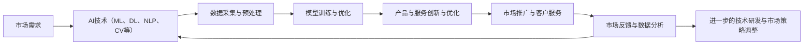

# 如何在AI驱动的市场中保持优势

> 关键词：AI驱动市场、市场优势、人工智能技术、创新策略、人才管理

> 摘要：本文聚焦于在AI驱动的市场中如何保持优势这一核心问题。首先介绍了文章的背景，包括目的、预期读者、文档结构和相关术语。接着阐述了AI驱动市场的核心概念及联系，深入分析了核心算法原理和具体操作步骤，并结合数学模型和公式进行详细讲解。通过项目实战案例展示了代码实现和解读，探讨了AI在不同场景下的实际应用。同时推荐了学习、开发工具和相关论文著作等资源。最后总结了未来发展趋势与挑战，解答了常见问题并提供了扩展阅读和参考资料，旨在为企业和从业者在AI驱动的市场竞争中提供全面、深入的指导。

## 1. 背景介绍 
### 1.1 目的和范围
在当今数字化时代，人工智能（AI）技术正以前所未有的速度改变着各个行业的市场格局。企业和从业者面临着巨大的机遇和挑战，如何在AI驱动的市场中保持优势成为了亟待解决的关键问题。本文旨在深入探讨在AI驱动的市场中保持优势的策略和方法，涵盖了技术、管理、市场等多个方面，为相关人员提供全面的指导和参考。

### 1.2 预期读者
本文的预期读者包括企业管理者、创业者、AI技术开发者、市场营销人员以及对AI市场发展感兴趣的研究人员。无论您是希望通过AI技术提升企业竞争力的管理者，还是致力于开发创新AI应用的技术人员，都能从本文中获得有价值的信息和启示。

### 1.3 文档结构概述
本文将按照以下结构进行阐述：首先介绍核心概念与联系，帮助读者了解AI驱动市场的基本原理和架构；接着深入分析核心算法原理和具体操作步骤，并结合数学模型和公式进行详细讲解；通过项目实战案例展示代码实现和解读，使读者能够将理论知识应用到实际项目中；探讨AI在不同场景下的实际应用，为读者提供实际参考；推荐学习、开发工具和相关论文著作等资源，帮助读者进一步深入学习和研究；最后总结未来发展趋势与挑战，解答常见问题并提供扩展阅读和参考资料。

### 1.4 术语表
#### 1.4.1 核心术语定义
- **人工智能（AI）**：是指计算机系统能够执行通常需要人类智能才能完成的任务，如学习、推理、解决问题、感知和语言理解等。
- **机器学习（ML）**：是AI的一个子集，专注于使计算机系统能够从数据中学习模式和规律，而无需明确的编程指令。
- **深度学习（DL）**：是机器学习的一个分支，使用深度神经网络来学习数据的高级抽象表示，在图像识别、语音识别等领域取得了显著的成果。
- **大数据**：指海量、高增长率和多样化的信息资产，需要新的处理模式来增强决策力、洞察发现力和流程优化能力。
- **市场优势**：指企业在市场中相对于竞争对手所具有的优势地位，表现为更高的市场份额、更好的客户满意度、更强的盈利能力等。

#### 1.4.2 相关概念解释
- **AI驱动的市场**：指市场的发展和竞争主要由人工智能技术推动的市场环境。在这种市场中，企业需要利用AI技术来提升产品和服务的质量、效率和竞争力。
- **AI战略**：指企业为了在AI驱动的市场中取得优势而制定的长期规划和策略，包括技术研发、人才培养、市场拓展等方面。
- **AI伦理**：指在AI技术的开发和应用过程中需要遵循的道德和法律准则，以确保AI技术的安全、可靠和公平使用。

#### 1.4.3 缩略词列表
- **AI**：Artificial Intelligence
- **ML**：Machine Learning
- **DL**：Deep Learning
- **NLP**：Natural Language Processing
- **CV**：Computer Vision

## 2. 核心概念与联系 

### 核心概念原理
在AI驱动的市场中，核心概念主要围绕人工智能技术以及其与市场的相互作用展开。人工智能技术包括机器学习、深度学习、自然语言处理、计算机视觉等多个领域，这些技术通过对大量数据的分析和处理，能够发现数据中的模式和规律，从而为企业提供决策支持、优化业务流程、开发创新产品和服务等。

市场则是企业竞争的舞台，企业需要通过提供满足客户需求的产品和服务来获取市场份额和利润。在AI驱动的市场中，企业需要利用人工智能技术来提升自身的竞争力，例如通过精准的市场细分和个性化推荐来提高客户满意度，通过自动化生产和供应链管理来降低成本和提高效率。

### 架构的文本示意图
以下是一个简单的AI驱动市场的架构示意图：

```plaintext
                市场需求
                    |
                    v
         AI技术（ML、DL、NLP、CV等）
                    |
                    v
            数据采集与预处理
                    |
                    v
         模型训练与优化
                    |
                    v
      产品与服务创新与优化
                    |
                    v
         市场推广与客户服务
                    |
                    v
            市场反馈与数据分析
                    |
                    v
         进一步的技术研发与市场策略调整
```

### Mermaid流程图


这个流程图展示了AI驱动市场的循环过程。首先，市场需求是整个过程的起点，企业根据市场需求选择合适的AI技术。然后，进行数据采集和预处理，为模型训练提供高质量的数据。模型训练和优化后，应用到产品和服务的创新与优化中。通过市场推广和客户服务将产品和服务推向市场，收集市场反馈和进行数据分析。最后，根据分析结果进行进一步的技术研发和市场策略调整，以适应市场的变化。

## 3. 核心算法原理 & 具体操作步骤 

### 核心算法原理

#### 机器学习算法 - 线性回归
线性回归是一种简单而常用的机器学习算法，用于建立自变量和因变量之间的线性关系。其基本原理是通过最小化预测值与真实值之间的误差平方和来确定最佳的回归系数。

假设我们有一组数据集 $\{(x_1, y_1), (x_2, y_2), \cdots, (x_n, y_n)\}$，其中 $x_i$ 是自变量，$y_i$ 是因变量。线性回归模型可以表示为：

$$y = \theta_0 + \theta_1x_1 + \theta_2x_2 + \cdots + \theta_mx_m + \epsilon$$

其中 $\theta_0, \theta_1, \cdots, \theta_m$ 是回归系数，$\epsilon$ 是误差项。

我们的目标是找到一组最佳的回归系数 $\theta$，使得误差平方和最小：

$$J(\theta) = \frac{1}{2n}\sum_{i=1}^{n}(h_{\theta}(x^{(i)}) - y^{(i)})^2$$

其中 $h_{\theta}(x^{(i)})$ 是模型的预测值，$y^{(i)}$ 是真实值。

#### 深度学习算法 - 神经网络
神经网络是一种模仿人类神经系统的计算模型，由多个神经元组成的层次结构。每个神经元接收输入信号，经过加权求和和非线性激活函数处理后输出结果。

一个简单的神经网络由输入层、隐藏层和输出层组成。输入层接收原始数据，隐藏层对数据进行特征提取和转换，输出层输出最终的预测结果。

神经网络的训练过程通常使用反向传播算法，通过不断调整神经元之间的连接权重来最小化损失函数。

### 具体操作步骤

#### 线性回归的Python实现
```python
import numpy as np
from sklearn.linear_model import LinearRegression
from sklearn.model_selection import train_test_split
from sklearn.metrics import mean_squared_error

# 生成一些示例数据
np.random.seed(0)
X = 2 * np.random.rand(100, 1)
y = 4 + 3 * X + np.random.randn(100, 1)

# 划分训练集和测试集
X_train, X_test, y_train, y_test = train_test_split(X, y, test_size=0.2, random_state=42)

# 创建线性回归模型
model = LinearRegression()

# 训练模型
model.fit(X_train, y_train)

# 预测
y_pred = model.predict(X_test)

# 计算均方误差
mse = mean_squared_error(y_test, y_pred)
print(f"均方误差: {mse}")

# 输出回归系数
print(f"截距: {model.intercept_}")
print(f"斜率: {model.coef_}")
```

#### 神经网络的Python实现
```python
import numpy as np
import tensorflow as tf
from tensorflow.keras.datasets import mnist
from tensorflow.keras.models import Sequential
from tensorflow.keras.layers import Dense, Flatten
from tensorflow.keras.utils import to_categorical

# 加载MNIST数据集
(X_train, y_train), (X_test, y_test) = mnist.load_data()

# 数据预处理
X_train = X_train / 255.0
X_test = X_test / 255.0
y_train = to_categorical(y_train)
y_test = to_categorical(y_test)

# 创建神经网络模型
model = Sequential([
    Flatten(input_shape=(28, 28)),
    Dense(128, activation='relu'),
    Dense(10, activation='softmax')
])

# 编译模型
model.compile(optimizer='adam',
              loss='categorical_crossentropy',
              metrics=['accuracy'])

# 训练模型
model.fit(X_train, y_train, epochs=5, batch_size=32, validation_data=(X_test, y_test))

# 评估模型
test_loss, test_acc = model.evaluate(X_test, y_test)
print(f"测试集损失: {test_loss}")
print(f"测试集准确率: {test_acc}")
```

## 4. 数学模型和公式 & 详细讲解 & 举例说明 

### 线性回归的数学模型和公式

#### 数学模型
线性回归的数学模型如前面所述：

$$y = \theta_0 + \theta_1x_1 + \theta_2x_2 + \cdots + \theta_mx_m + \epsilon$$

#### 损失函数
损失函数 $J(\theta)$ 用于衡量模型预测值与真实值之间的误差：

$$J(\theta) = \frac{1}{2n}\sum_{i=1}^{n}(h_{\theta}(x^{(i)}) - y^{(i)})^2$$

其中 $h_{\theta}(x^{(i)}) = \theta_0 + \theta_1x_1^{(i)} + \theta_2x_2^{(i)} + \cdots + \theta_mx_m^{(i)}$ 是模型的预测值。

#### 最小化损失函数
为了找到最佳的回归系数 $\theta$，我们需要最小化损失函数 $J(\theta)$。可以使用梯度下降法来实现：

$$\theta_j := \theta_j - \alpha\frac{\partial}{\partial\theta_j}J(\theta)$$

其中 $\alpha$ 是学习率，控制每次更新的步长。

#### 举例说明
假设我们有一个简单的线性回归问题，只有一个自变量 $x$ 和一个因变量 $y$。数据集如下：

| $x$ | $y$ |
| --- | --- |
| 1 | 3 |
| 2 | 5 |
| 3 | 7 |

我们的目标是找到一条直线 $y = \theta_0 + \theta_1x$ 来拟合这些数据。

首先，初始化 $\theta_0 = 0$ 和 $\theta_1 = 0$。

损失函数 $J(\theta)$ 为：

$$J(\theta) = \frac{1}{2\times3}[( \theta_0 + \theta_1\times1 - 3)^2 + (\theta_0 + \theta_1\times2 - 5)^2 + (\theta_0 + \theta_1\times3 - 7)^2]$$

使用梯度下降法更新 $\theta_0$ 和 $\theta_1$：

$$\frac{\partial}{\partial\theta_0}J(\theta) = \frac{1}{3}[(\theta_0 + \theta_1\times1 - 3) + (\theta_0 + \theta_1\times2 - 5) + (\theta_0 + \theta_1\times3 - 7)]$$

$$\frac{\partial}{\partial\theta_1}J(\theta) = \frac{1}{3}[1\times(\theta_0 + \theta_1\times1 - 3) + 2\times(\theta_0 + \theta_1\times2 - 5) + 3\times(\theta_0 + \theta_1\times3 - 7)]$$

假设学习率 $\alpha = 0.1$，经过多次迭代更新 $\theta_0$ 和 $\theta_1$，最终可以得到最佳的回归系数。

### 神经网络的数学模型和公式

#### 神经元模型
神经网络中的神经元模型可以表示为：

$$z = \sum_{i=1}^{n}w_ix_i + b$$

$$a = f(z)$$

其中 $w_i$ 是输入 $x_i$ 的权重，$b$ 是偏置，$f$ 是激活函数。

#### 激活函数
常见的激活函数有 sigmoid 函数、ReLU 函数等。

- sigmoid 函数：

$$f(z) = \frac{1}{1 + e^{-z}}$$

- ReLU 函数：

$$f(z) = \max(0, z)$$

#### 损失函数
在分类问题中，常用的损失函数是交叉熵损失函数：

$$L(y, \hat{y}) = -\sum_{i=1}^{C}y_i\log(\hat{y}_i)$$

其中 $y$ 是真实标签，$\hat{y}$ 是模型的预测概率，$C$ 是类别数。

#### 反向传播算法
反向传播算法用于计算损失函数对每个权重和偏置的梯度，然后使用梯度下降法更新权重和偏置。

假设我们有一个简单的两层神经网络，输入层有 $n$ 个神经元，隐藏层有 $m$ 个神经元，输出层有 $C$ 个神经元。

前向传播过程：

$$z_1 = W_1x + b_1$$

$$a_1 = f(z_1)$$

$$z_2 = W_2a_1 + b_2$$

$$\hat{y} = \text{softmax}(z_2)$$

反向传播过程：

$$\delta_2 = \hat{y} - y$$

$$\frac{\partial L}{\partial W_2} = \delta_2a_1^T$$

$$\frac{\partial L}{\partial b_2} = \delta_2$$

$$\delta_1 = W_2^T\delta_2 \odot f'(z_1)$$

$$\frac{\partial L}{\partial W_1} = \delta_1x^T$$

$$\frac{\partial L}{\partial b_1} = \delta_1$$

其中 $\odot$ 表示逐元素相乘，$f'(z_1)$ 是激活函数的导数。

#### 举例说明
以MNIST手写数字识别为例，输入层有 $28\times28 = 784$ 个神经元，隐藏层有 128 个神经元，输出层有 10 个神经元。

在训练过程中，首先将输入图像 $x$ 传入神经网络进行前向传播，得到预测概率 $\hat{y}$。然后计算损失函数 $L(y, \hat{y})$，使用反向传播算法计算梯度，最后使用梯度下降法更新权重和偏置。经过多次迭代训练，模型可以学习到如何识别手写数字。

## 5. 项目实战：代码实际案例和详细解释说明 

### 5.1  开发环境搭建
#### 安装Python
首先，确保你已经安装了Python。可以从Python官方网站（https://www.python.org/downloads/）下载并安装适合你操作系统的Python版本。建议使用Python 3.6及以上版本。

#### 安装必要的库
在命令行中使用以下命令安装必要的库：
```sh
pip install numpy pandas scikit-learn tensorflow keras matplotlib
```

- `numpy`：用于数值计算和数组操作。
- `pandas`：用于数据处理和分析。
- `scikit-learn`：提供了各种机器学习算法和工具。
- `tensorflow` 和 `keras`：用于深度学习模型的开发和训练。
- `matplotlib`：用于数据可视化。

### 5.2  源代码详细实现和代码解读

#### 项目背景
我们以一个简单的房价预测项目为例，使用线性回归模型来预测房屋的价格。数据集包含了房屋的面积、卧室数量等特征，以及对应的房价。

#### 代码实现
```python
import numpy as np
import pandas as pd
from sklearn.model_selection import train_test_split
from sklearn.linear_model import LinearRegression
from sklearn.metrics import mean_squared_error
import matplotlib.pyplot as plt

# 加载数据集
data = pd.read_csv('housing.csv')

# 提取特征和目标变量
X = data[['area', 'bedrooms']].values
y = data['price'].values

# 划分训练集和测试集
X_train, X_test, y_train, y_test = train_test_split(X, y, test_size=0.2, random_state=42)

# 创建线性回归模型
model = LinearRegression()

# 训练模型
model.fit(X_train, y_train)

# 预测
y_pred = model.predict(X_test)

# 计算均方误差
mse = mean_squared_error(y_test, y_pred)
print(f"均方误差: {mse}")

# 可视化预测结果
plt.scatter(y_test, y_pred)
plt.xlabel('真实房价')
plt.ylabel('预测房价')
plt.title('房价预测结果')
plt.show()
```

#### 代码解读
1. **数据加载**：使用 `pandas` 库的 `read_csv` 函数加载数据集。
2. **特征提取**：从数据集中提取房屋面积和卧室数量作为特征，房价作为目标变量。
3. **数据划分**：使用 `train_test_split` 函数将数据集划分为训练集和测试集，测试集占比为 20%。
4. **模型创建**：创建一个线性回归模型。
5. **模型训练**：使用训练集数据对模型进行训练。
6. **模型预测**：使用训练好的模型对测试集数据进行预测。
7. **误差计算**：使用 `mean_squared_error` 函数计算预测结果的均方误差。
8. **结果可视化**：使用 `matplotlib` 库绘制真实房价和预测房价的散点图，直观展示预测结果。

### 5.3  代码解读与分析

#### 模型评估
均方误差（MSE）是衡量回归模型性能的常用指标，它表示预测值与真实值之间误差的平方的平均值。MSE 值越小，说明模型的预测效果越好。

在本项目中，我们计算了测试集上的均方误差，可以根据这个值来评估模型的性能。如果 MSE 值较大，可能需要考虑调整模型的参数、增加特征或者使用更复杂的模型。

#### 可视化分析
通过绘制真实房价和预测房价的散点图，我们可以直观地观察模型的预测效果。如果散点图中的点大致分布在一条直线上，说明模型的预测效果较好；如果点比较分散，说明模型的预测误差较大。

#### 模型优化
为了提高模型的性能，可以尝试以下方法：
- **特征工程**：对特征进行预处理，如归一化、标准化等，或者提取更多的相关特征。
- **模型选择**：尝试使用其他的回归模型，如决策树回归、随机森林回归等。
- **超参数调整**：调整模型的超参数，如线性回归的正则化参数等，以找到最优的模型配置。

## 6. 实际应用场景 

### 金融领域
- **风险评估**：银行和金融机构可以使用AI技术对客户的信用风险进行评估。通过分析客户的历史数据、交易记录、社交媒体信息等，建立风险评估模型，预测客户违约的可能性，从而做出更准确的信贷决策。
- **投资决策**：AI可以分析大量的金融数据，如股票价格、市场趋势、宏观经济指标等，为投资者提供投资建议和决策支持。例如，使用机器学习算法预测股票价格的走势，帮助投资者制定投资策略。

### 医疗领域
- **疾病诊断**：AI技术可以辅助医生进行疾病诊断。通过分析医学影像（如X光、CT、MRI等）和临床数据，建立诊断模型，帮助医生更准确地识别疾病，提高诊断效率和准确性。
- **药物研发**：AI可以加速药物研发的过程。通过分析大量的生物数据和化合物结构，预测药物的疗效和副作用，筛选出有潜力的药物候选物，减少研发周期和成本。

### 零售领域
- **个性化推荐**：电商平台可以使用AI技术根据用户的浏览历史、购买记录、搜索关键词等信息，为用户提供个性化的商品推荐。通过提高推荐的准确性，增加用户的购买转化率和忠诚度。
- **供应链管理**：AI可以优化零售企业的供应链管理。通过分析销售数据、库存水平、物流信息等，预测需求，合理安排库存，提高供应链的效率和灵活性。

### 交通领域
- **自动驾驶**：自动驾驶技术是AI在交通领域的重要应用。通过使用传感器、摄像头、雷达等设备收集车辆周围的环境信息，结合深度学习算法进行决策和控制，实现车辆的自动驾驶，提高交通安全和效率。
- **交通流量预测**：AI可以分析交通数据，如道路拥堵情况、车辆行驶速度等，预测交通流量的变化，为交通管理部门提供决策支持，优化交通信号控制，缓解交通拥堵。

### 教育领域
- **个性化学习**：在线教育平台可以使用AI技术根据学生的学习进度、学习能力、兴趣爱好等信息，为学生提供个性化的学习方案和课程推荐。通过提高学习的针对性和效率，提升学生的学习效果。
- **智能辅导**：AI可以作为智能辅导工具，为学生提供实时的答疑解惑和学习指导。例如，使用自然语言处理技术实现智能问答系统，帮助学生解决学习中遇到的问题。

## 7. 工具和资源推荐
### 7.1 学习资源推荐
#### 7.1.1 书籍推荐
- 《Python机器学习》：由Sebastian Raschka和Vahid Mirjalili所著，全面介绍了Python在机器学习中的应用，包括各种机器学习算法的原理和实现。
- 《深度学习》：由Ian Goodfellow、Yoshua Bengio和Aaron Courville所著，是深度学习领域的经典教材，涵盖了深度学习的基本概念、算法和应用。
- 《人工智能：一种现代的方法》：由Stuart Russell和Peter Norvig所著，是人工智能领域的权威教材，系统地介绍了人工智能的各个方面，包括搜索算法、知识表示、机器学习等。

#### 7.1.2 在线课程
- Coursera上的“机器学习”课程：由Andrew Ng教授授课，是机器学习领域的经典课程，介绍了机器学习的基本概念、算法和应用。
- edX上的“深度学习”课程：由多个知名教授联合授课，深入讲解了深度学习的原理和实践。
- Udemy上的“Python数据科学和机器学习实战”课程：通过实际项目案例，介绍了Python在数据科学和机器学习中的应用。

#### 7.1.3 技术博客和网站
- Medium：是一个知名的技术博客平台，有很多关于AI、机器学习和深度学习的优秀文章。
- Towards Data Science：专注于数据科学和机器学习领域，提供了大量的技术文章和案例分析。
- AI Stack Exchange：是一个问答社区，用户可以在这里提问和交流关于AI的技术问题。

### 7.2 开发工具框架推荐
#### 7.2.1 IDE和编辑器
- PyCharm：是一款专门为Python开发设计的集成开发环境（IDE），提供了丰富的功能和插件，方便开发者进行代码编写、调试和项目管理。
- Jupyter Notebook：是一个交互式的开发环境，支持多种编程语言，适合进行数据探索、模型实验和结果展示。
- Visual Studio Code：是一款轻量级的代码编辑器，支持多种编程语言和插件，具有强大的代码编辑和调试功能。

#### 7.2.2 调试和性能分析工具
- TensorBoard：是TensorFlow提供的一个可视化工具，用于监控和分析深度学习模型的训练过程，包括损失函数、准确率、梯度等指标的变化。
- PyTorch Profiler：是PyTorch提供的性能分析工具，用于分析模型的运行时间和内存使用情况，帮助开发者优化模型性能。
- cProfile：是Python内置的性能分析工具，用于分析Python代码的运行时间和函数调用情况。

#### 7.2.3 相关框架和库
- TensorFlow：是一个开源的深度学习框架，由Google开发，提供了丰富的深度学习模型和工具，支持分布式训练和部署。
- PyTorch：是另一个流行的深度学习框架，由Facebook开发，具有简洁的API和动态计算图的特点，适合快速原型开发和研究。
- Scikit-learn：是一个用于机器学习的Python库，提供了各种机器学习算法和工具，如分类、回归、聚类等，方便开发者进行机器学习任务。

### 7.3 相关论文著作推荐
#### 7.3.1 经典论文
- 《Gradient-based learning applied to document recognition》：由Yann LeCun等人发表，介绍了卷积神经网络（CNN）在手写数字识别中的应用，是CNN领域的经典论文。
- 《Long Short-Term Memory》：由Sepp Hochreiter和Jürgen Schmidhuber发表，提出了长短期记忆网络（LSTM），解决了传统循环神经网络（RNN）的梯度消失问题。
- 《Attention Is All You Need》：由Vaswani等人发表，提出了Transformer架构，在自然语言处理领域取得了显著的成果。

#### 7.3.2 最新研究成果
- 可以关注顶级学术会议如NeurIPS（神经信息处理系统大会）、ICML（国际机器学习会议）、CVPR（计算机视觉与模式识别会议）等的论文，了解AI领域的最新研究动态和成果。
- 一些知名的学术期刊如Journal of Artificial Intelligence Research（JAIR）、Artificial Intelligence等也会发表高质量的AI研究论文。

#### 7.3.3 应用案例分析
- 《AI Superpowers: China, Silicon Valley, and the New World Order》：由李开复所著，通过实际案例分析了中国和美国在AI领域的发展现状和竞争态势。
- 《Hands-On Machine Learning with Scikit-Learn, Keras, and TensorFlow: Concepts, Tools, and Techniques to Build Intelligent Systems》：通过实际项目案例，介绍了如何使用Scikit-Learn、Keras和TensorFlow构建智能系统。

## 8. 总结：未来发展趋势与挑战

### 未来发展趋势
- **AI与其他技术的融合**：AI将与物联网（IoT）、大数据、云计算等技术深度融合，创造出更加智能、高效的应用场景。例如，物联网设备收集大量的数据，通过云计算进行存储和处理，AI则对数据进行分析和决策，实现智能化的管理和控制。
- **自动化和智能化的普及**：随着AI技术的不断发展，越来越多的工作将被自动化和智能化。例如，自动驾驶技术将逐渐取代人类驾驶员，智能客服系统将取代部分人工客服工作。这将提高生产效率和服务质量，但也会对就业市场产生一定的影响。
- **AI在医疗和生物领域的应用拓展**：AI将在医疗和生物领域发挥越来越重要的作用。例如，基因编辑技术与AI的结合将有望实现个性化的医疗治疗，提高疾病的治愈率。同时，AI也可以用于药物研发、疾病诊断和健康管理等方面。
- **AI伦理和法律的重视**：随着AI技术的广泛应用，AI伦理和法律问题将越来越受到关注。例如，如何确保AI系统的公平性、透明度和安全性，如何规范AI的使用和开发等。相关的伦理准则和法律法规将不断完善，以保障AI技术的健康发展。

### 挑战
- **数据隐私和安全问题**：AI的发展依赖于大量的数据，但数据的隐私和安全问题也日益突出。例如，个人敏感信息可能被泄露和滥用，恶意攻击可能导致AI系统的故障和数据丢失。因此，如何保护数据的隐私和安全是一个亟待解决的问题。
- **人才短缺**：AI领域的发展需要大量的专业人才，包括AI算法工程师、数据科学家、AI伦理专家等。但目前全球范围内AI人才短缺的问题比较严重，这限制了AI技术的进一步发展和应用。
- **算法可解释性**：许多AI算法，特别是深度学习算法，具有较高的复杂度和黑盒性，难以解释其决策过程和结果。这在一些关键领域，如医疗、金融等，可能会导致信任问题和法律风险。因此，提高算法的可解释性是一个重要的挑战。
- **社会和经济影响**：AI的发展可能会对社会和经济产生深远的影响。例如，自动化和智能化可能会导致部分岗位的消失，加剧就业不平等。同时，AI技术的应用也可能会加剧数字鸿沟，使一些地区和人群无法享受到AI带来的好处。

## 9. 附录：常见问题与解答

### 问题1：如何选择适合的AI算法？
解答：选择适合的AI算法需要考虑多个因素，包括问题的类型（如分类、回归、聚类等）、数据的特点（如数据量、特征维度、数据分布等）、模型的复杂度和可解释性要求等。一般来说，可以先尝试一些简单的算法，如线性回归、逻辑回归等，然后根据实验结果逐步尝试更复杂的算法，如决策树、神经网络等。

### 问题2：如何处理数据中的缺失值和异常值？
解答：处理数据中的缺失值和异常值可以采用以下方法：
- **缺失值处理**：可以使用均值、中位数、众数等统计量来填充缺失值，也可以使用插值法或基于模型的方法进行填充。另外，如果缺失值较多，可以考虑删除包含缺失值的样本或特征。
- **异常值处理**：可以使用统计方法（如Z-score、IQR等）来识别异常值，然后根据具体情况进行处理。例如，可以删除异常值、对异常值进行修正或使用鲁棒的模型来处理异常值。

### 问题3：如何评估AI模型的性能？
解答：评估AI模型的性能需要根据问题的类型选择合适的评估指标。例如，在分类问题中，可以使用准确率、召回率、F1值等指标；在回归问题中，可以使用均方误差（MSE）、均方根误差（RMSE）、平均绝对误差（MAE）等指标。此外，还可以使用交叉验证等方法来评估模型的泛化能力。

### 问题4：如何避免AI模型的过拟合和欠拟合？
解答：避免AI模型的过拟合和欠拟合可以采用以下方法：
- **过拟合**：可以增加训练数据的数量、减少模型的复杂度（如减少神经网络的层数和神经元数量）、使用正则化方法（如L1和L2正则化）、进行数据增强等。
- **欠拟合**：可以增加模型的复杂度（如增加神经网络的层数和神经元数量）、使用更复杂的模型结构、提取更多的特征等。

## 10. 扩展阅读 & 参考资料
- 《Python数据分析实战》，作者：[美] 韦斯·麦金尼，机械工业出版社
- 《深度学习实战：基于Python的理论与实现》，作者：[日] 斋藤康毅，人民邮电出版社
- Kaggle网站（https://www.kaggle.com/）：提供了大量的数据集和机器学习竞赛，是学习和实践AI的好平台。
- arXiv网站（https://arxiv.org/）：是一个预印本服务器，提供了大量的学术论文，包括AI领域的最新研究成果。
- Google AI Blog（https://ai.googleblog.com/）：Google官方的AI博客，分享了Google在AI领域的最新研究和应用成果。