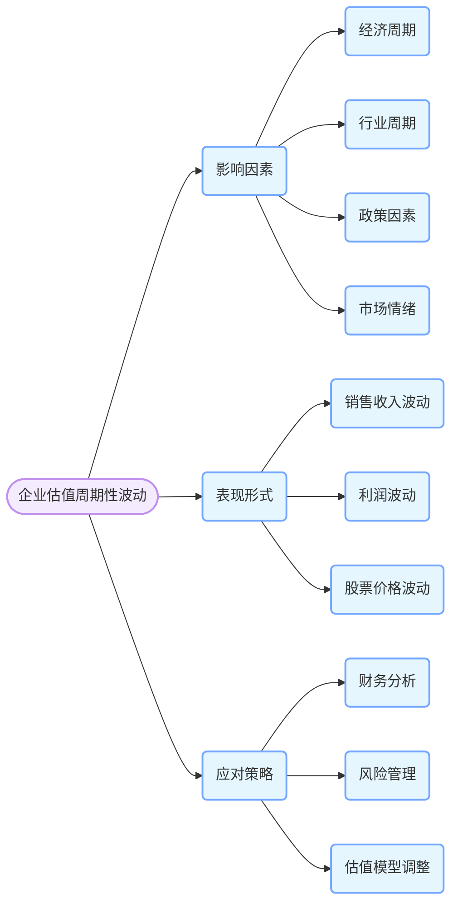

# 如何处理企业估值中的周期性波动

> 关键词：企业估值、周期性波动、财务分析、风险管理、经济周期、估值模型、市场趋势

> 摘要：本文聚焦于企业估值中周期性波动这一关键问题，旨在深入剖析周期性波动的本质、影响及形成原因，为企业和投资者提供处理周期性波动的有效策略与方法。通过对核心概念的阐述、算法原理的分析、数学模型的讲解以及项目实战案例的展示，帮助读者全面理解和掌握应对企业估值周期性波动的要点。同时，介绍了相关的实际应用场景、工具和资源，探讨了未来发展趋势与挑战，并对常见问题进行了解答，为相关领域的专业人士和研究人员提供了系统而全面的参考。

## 1. 背景介绍 
### 1.1 目的和范围
企业估值是金融领域和企业管理中的重要环节，准确的估值有助于企业制定战略决策、投资者做出合理的投资选择。然而，企业估值并非固定不变，它受到多种因素的影响，其中周期性波动是一个不容忽视的因素。本文章的目的在于深入探讨如何处理企业估值中的周期性波动，范围涵盖周期性波动的理论基础、实际操作方法、应用场景以及未来发展趋势等方面。

### 1.2 预期读者
本文预期读者包括企业管理人员、财务分析师、投资者、金融研究人员以及对企业估值和周期性波动感兴趣的相关人士。这些读者希望通过本文深入了解企业估值中周期性波动的相关知识和应对策略，以提升自身在企业决策、投资分析等方面的能力。

### 1.3 文档结构概述
本文将按照以下结构展开：首先介绍背景知识，包括目的、预期读者和文档结构概述等；接着阐述核心概念与联系，明确周期性波动的相关概念和原理；然后讲解核心算法原理和具体操作步骤，结合Python代码进行详细说明；随后介绍数学模型和公式，并通过举例进行详细讲解；再通过项目实战展示代码实际案例和详细解释说明；接着探讨实际应用场景；推荐相关的工具和资源；总结未来发展趋势与挑战；最后在附录中解答常见问题，并提供扩展阅读和参考资料。

### 1.4 术语表
#### 1.4.1 核心术语定义
- **企业估值**：指对企业的价值进行评估的过程，通常基于企业的财务状况、市场前景、行业竞争力等多种因素。
- **周期性波动**：指企业的经营业绩、市场价值等随时间呈现出的有规律的起伏变化，这种变化通常与经济周期、行业周期等因素相关。
- **经济周期**：指经济活动沿着经济发展的总体趋势所经历的有规律的扩张和收缩过程，一般包括繁荣、衰退、萧条和复苏四个阶段。
- **行业周期**：指某个行业从诞生、成长、成熟到衰退的整个过程，不同行业的周期长度和特点可能有所不同。
- **估值模型**：用于评估企业价值的数学模型，常见的有现金流折现模型、相对估值模型等。

#### 1.4.2 相关概念解释
- **财务杠杆**：指企业通过债务融资来增加股东权益报酬的一种财务手段。在经济繁荣时期，适当的财务杠杆可以提高企业的盈利能力；但在经济衰退时期，过高的财务杠杆可能会增加企业的财务风险。
- **市场情绪**：指投资者对市场的整体看法和预期，市场情绪的波动会影响股票价格和企业估值。例如，在市场乐观情绪高涨时，企业估值可能会偏高；而在市场悲观情绪蔓延时，企业估值可能会偏低。
- **宏观经济指标**：反映宏观经济运行状况的统计数据，如国内生产总值（GDP）、通货膨胀率、利率等。这些指标的变化会对企业的经营环境和估值产生影响。

#### 1.4.3 缩略词列表
- **DCF**：Discounted Cash Flow，现金流折现模型
- **P/E**：Price-to-Earnings Ratio，市盈率
- **P/B**：Price-to-Book Ratio，市净率
- **GDP**：Gross Domestic Product，国内生产总值

## 2. 核心概念与联系 

### 周期性波动的本质
企业估值的周期性波动本质上是企业经营环境和市场条件变化的反映。经济周期的起伏会影响消费者的消费能力和消费意愿，进而影响企业的销售收入和利润。行业周期的变化也会对企业的市场份额和竞争力产生影响。例如，在行业成长阶段，企业往往面临着更多的发展机遇，估值可能会上升；而在行业衰退阶段，企业可能面临着市场萎缩和竞争加剧的压力，估值可能会下降。

### 周期性波动的影响因素
- **经济周期**：经济周期是影响企业估值周期性波动的重要因素之一。在经济繁荣时期，企业的销售收入和利润通常会增加，市场对企业的预期也较为乐观，企业估值往往会上升；而在经济衰退时期，企业的经营业绩可能会下滑，市场对企业的预期也会变得悲观，企业估值可能会下降。
- **行业周期**：不同行业的周期特点不同，对企业估值的影响也不同。例如，新兴行业通常处于成长阶段，具有较高的增长潜力，企业估值可能会相对较高；而传统行业可能已经进入成熟或衰退阶段，企业估值可能会相对较低。
- **政策因素**：政府的宏观经济政策、产业政策等会对企业的经营环境和市场前景产生影响，进而影响企业估值。例如，政府对某个行业的扶持政策可能会促进该行业的发展，提高企业的估值；而对某个行业的限制政策可能会抑制该行业的发展，降低企业的估值。
- **市场情绪**：投资者的市场情绪会影响股票价格和企业估值。在市场乐观情绪高涨时，投资者往往愿意为企业支付更高的价格，企业估值可能会偏高；而在市场悲观情绪蔓延时，投资者可能会对企业的前景持谨慎态度，企业估值可能会偏低。

### 核心概念原理和架构的文本示意图
```plaintext
企业估值周期性波动
|
|-- 影响因素
|   |-- 经济周期
|   |-- 行业周期
|   |-- 政策因素
|   |-- 市场情绪
|
|-- 表现形式
|   |-- 销售收入波动
|   |-- 利润波动
|   |-- 股票价格波动
|
|-- 应对策略
|   |-- 财务分析
|   |-- 风险管理
|   |-- 估值模型调整
```

### Mermaid 流程图


## 3. 核心算法原理 & 具体操作步骤 

### 财务分析算法原理
财务分析是处理企业估值周期性波动的重要手段之一。通过对企业财务报表的分析，可以了解企业的经营状况、盈利能力、偿债能力等，从而更好地评估企业的价值。以下是一些常用的财务分析指标和算法：

- **盈利能力分析**
    - **净利润率**：净利润率是指企业净利润与销售收入的比率，反映了企业的盈利能力。计算公式为：
$$净利润率 = \frac{净利润}{销售收入} \times 100\%$$
    - **净资产收益率（ROE）**：净资产收益率是指企业净利润与净资产的比率，反映了企业运用自有资本的效率。计算公式为：
$$ROE = \frac{净利润}{净资产} \times 100\%$$

- **偿债能力分析**
    - **资产负债率**：资产负债率是指企业负债总额与资产总额的比率，反映了企业的偿债能力。计算公式为：
$$资产负债率 = \frac{负债总额}{资产总额} \times 100\%$$
    - **流动比率**：流动比率是指企业流动资产与流动负债的比率，反映了企业的短期偿债能力。计算公式为：
$$流动比率 = \frac{流动资产}{流动负债}$$

### Python 代码实现财务分析
```python
import pandas as pd

# 示例财务数据
financial_data = {
    '年份': [2018, 2019, 2020, 2021, 2022],
    '销售收入': [1000, 1200, 1300, 1400, 1500],
    '净利润': [100, 120, 130, 140, 150],
    '净资产': [500, 600, 700, 800, 900],
    '负债总额': [200, 250, 300, 350, 400],
    '流动资产': [300, 350, 400, 450, 500],
    '流动负债': [150, 200, 250, 300, 350]
}

df = pd.DataFrame(financial_data)

# 计算净利润率
df['净利润率'] = df['净利润'] / df['销售收入'] * 100

# 计算净资产收益率（ROE）
df['ROE'] = df['净利润'] / df['净资产'] * 100

# 计算资产负债率
df['资产负债率'] = df['负债总额'] / df['资产总额'] * 100

# 计算流动比率
df['流动比率'] = df['流动资产'] / df['流动负债']

print(df)
```

### 具体操作步骤
1. **数据收集**：收集企业的财务报表数据，包括资产负债表、利润表、现金流量表等。
2. **数据整理**：将收集到的数据进行整理和清洗，确保数据的准确性和完整性。
3. **指标计算**：根据上述公式计算各项财务分析指标。
4. **数据分析**：对计算得到的指标进行分析，了解企业的经营状况和财务健康程度。
5. **趋势分析**：将不同时期的指标进行比较，分析企业的发展趋势和周期性波动情况。

## 4. 数学模型和公式 & 详细讲解 & 举例说明 

### 现金流折现模型（DCF）
现金流折现模型是一种常用的企业估值模型，它通过预测企业未来的现金流量，并将其折现到当前时点，从而得到企业的价值。

#### 基本公式
$$V = \sum_{t=1}^{n} \frac{CF_t}{(1 + r)^t} + \frac{TV}{(1 + r)^n}$$
其中：
- $V$ 表示企业的价值
- $CF_t$ 表示第 $t$ 期的现金流量
- $r$ 表示折现率
- $n$ 表示预测期数
- $TV$ 表示终值

#### 详细讲解
- **现金流量预测**：现金流量是企业在一定时期内的现金流入和流出的净额。预测现金流量需要考虑企业的销售收入、成本、费用、投资等因素。一般来说，可以采用历史数据分析法、行业比较法等方法进行预测。
- **折现率确定**：折现率反映了投资者对投资风险的预期。折现率越高，说明投资者对风险的要求越高，企业的价值就越低。折现率的确定通常需要考虑无风险利率、市场风险溢价、企业特定风险等因素。
- **终值计算**：终值是指预测期结束后企业的价值。终值的计算方法有多种，常见的有永续增长模型、退出倍数模型等。

#### 举例说明
假设某企业未来 5 年的现金流量分别为 100 万元、120 万元、130 万元、140 万元、150 万元，折现率为 10%，预测期结束后企业的终值为 1000 万元。则该企业的价值为：
$$V = \frac{100}{(1 + 0.1)^1} + \frac{120}{(1 + 0.1)^2} + \frac{130}{(1 + 0.1)^3} + \frac{140}{(1 + 0.1)^4} + \frac{150}{(1 + 0.1)^5} + \frac{1000}{(1 + 0.1)^5}$$
```python
import numpy as np

cash_flows = [100, 120, 130, 140, 150]
discount_rate = 0.1
terminal_value = 1000

# 计算各期现金流量的现值
present_values = [cf / (1 + discount_rate) ** (i + 1) for i, cf in enumerate(cash_flows)]

# 计算终值的现值
terminal_value_pv = terminal_value / (1 + discount_rate) ** 5

# 计算企业价值
enterprise_value = sum(present_values) + terminal_value_pv

print(f"企业价值: {enterprise_value} 万元")
```

### 相对估值模型
相对估值模型是通过比较企业与同行业其他企业的估值指标，来评估企业的价值。常见的相对估值指标有市盈率（P/E）、市净率（P/B）等。

#### 市盈率（P/E）模型
$$P = E \times P/E$$
其中：
- $P$ 表示企业的股价
- $E$ 表示企业的每股收益
- $P/E$ 表示市盈率

#### 详细讲解
市盈率反映了市场对企业盈利能力的预期。市盈率越高，说明市场对企业的未来发展前景越乐观，企业的价值就越高。在使用市盈率模型进行估值时，需要选择合适的可比企业，并计算其平均市盈率。

#### 举例说明
假设某企业的每股收益为 2 元，同行业可比企业的平均市盈率为 15 倍。则该企业的股价为：
$$P = 2 \times 15 = 30$$（元）

## 5. 项目实战：代码实际案例和详细解释说明 

### 5.1  开发环境搭建
- **Python 环境**：建议使用 Python 3.7 及以上版本。可以从 Python 官方网站（https://www.python.org/downloads/）下载并安装。
- **开发工具**：推荐使用 PyCharm 或 Jupyter Notebook 作为开发工具。
- **相关库**：需要安装 pandas、numpy 等库，可以使用以下命令进行安装：
```sh
pip install pandas numpy
```

### 5.2  源代码详细实现和代码解读
以下是一个完整的企业估值案例，包括数据收集、财务分析、现金流折现模型估值等步骤。

```python
import pandas as pd
import numpy as np

# 数据收集
financial_data = {
    '年份': [2018, 2019, 2020, 2021, 2022],
    '销售收入': [1000, 1200, 1300, 1400, 1500],
    '净利润': [100, 120, 130, 140, 150],
    '净资产': [500, 600, 700, 800, 900],
    '负债总额': [200, 250, 300, 350, 400],
    '流动资产': [300, 350, 400, 450, 500],
    '流动负债': [150, 200, 250, 300, 350]
}

df = pd.DataFrame(financial_data)

# 财务分析
df['净利润率'] = df['净利润'] / df['销售收入'] * 100
df['ROE'] = df['净利润'] / df['净资产'] * 100
df['资产负债率'] = df['负债总额'] / df['净资产'] * 100
df['流动比率'] = df['流动资产'] / df['流动负债']

print("财务分析结果:")
print(df)

# 现金流折现模型估值
# 假设未来 5 年的现金流量增长率为 10%
cash_flows = df['净利润'].tolist()
growth_rate = 0.1
future_cash_flows = [cash_flows[-1] * (1 + growth_rate) ** i for i in range(1, 6)]

discount_rate = 0.1
terminal_value_growth_rate = 0.03  # 终值增长率
terminal_value = future_cash_flows[-1] * (1 + terminal_value_growth_rate) / (discount_rate - terminal_value_growth_rate)

# 计算各期现金流量的现值
present_values = [cf / (1 + discount_rate) ** (i + 1) for i, cf in enumerate(future_cash_flows)]

# 计算终值的现值
terminal_value_pv = terminal_value / (1 + discount_rate) ** 5

# 计算企业价值
enterprise_value = sum(present_values) + terminal_value_pv

print(f"企业价值: {enterprise_value} 万元")
```

### 5.3  代码解读与分析
1. **数据收集**：使用字典 `financial_data` 存储企业的财务数据，并使用 `pandas` 库将其转换为 DataFrame 格式。
2. **财务分析**：计算净利润率、净资产收益率（ROE）、资产负债率和流动比率等财务指标，以了解企业的经营状况和财务健康程度。
3. **现金流折现模型估值**：
    - 预测未来 5 年的现金流量，假设增长率为 10%。
    - 确定折现率为 10%，终值增长率为 3%。
    - 计算终值，并将各期现金流量和终值折现到当前时点。
    - 计算企业价值。

## 6. 实际应用场景 
### 企业战略决策
企业在制定战略决策时，需要考虑自身的价值和市场环境的变化。通过处理企业估值中的周期性波动，企业可以更好地了解自身的优势和劣势，把握市场机会，制定合理的战略规划。例如，在经济繁荣时期，企业可以加大投资力度，扩大生产规模；而在经济衰退时期，企业可以采取保守的财务策略，降低成本，提高抗风险能力。

### 投资决策
投资者在进行投资决策时，需要对企业的价值进行评估。周期性波动会影响企业的估值，投资者需要考虑周期性因素对企业未来业绩的影响，从而做出合理的投资决策。例如，在行业低谷期，一些具有潜力的企业可能被低估，投资者可以抓住机会进行投资；而在行业高峰期，投资者需要谨慎对待高估的企业，避免盲目投资。

### 并购重组
在企业并购重组过程中，准确的估值是关键。周期性波动会影响目标企业的价值，并购方需要考虑周期性因素对目标企业未来业绩的影响，从而确定合理的并购价格。同时，并购方还需要考虑自身的财务状况和抗风险能力，以确保并购重组的成功。

### 融资决策
企业在进行融资决策时，需要考虑自身的估值和市场环境的变化。周期性波动会影响企业的融资成本和融资难度，企业需要根据自身的实际情况选择合适的融资方式和融资时机。例如，在经济繁荣时期，企业可以选择股权融资，以获得更多的资金支持；而在经济衰退时期，企业可以选择债务融资，以降低融资成本。

## 7. 工具和资源推荐
### 7.1 学习资源推荐
#### 7.1.1 书籍推荐
- 《估值：难点、解决方案及相关案例》：这本书详细介绍了企业估值的方法和技巧，包括现金流折现模型、相对估值模型等，同时还通过实际案例进行了深入分析。
- 《财务报表分析与证券定价》：该书从财务报表分析的角度出发，介绍了如何通过分析企业的财务报表来评估企业的价值，是一本非常实用的财务分析工具书。
- 《漫步华尔街》：这本书以通俗易懂的语言介绍了投资的基本原理和方法，包括股票投资、债券投资等，对于投资者了解市场和企业估值有很大的帮助。

#### 7.1.2 在线课程
- Coursera 上的《企业估值》课程：该课程由知名教授授课，系统地介绍了企业估值的理论和方法，包括现金流折现模型、相对估值模型等。
- edX 上的《财务分析与决策》课程：该课程从财务分析的角度出发，介绍了如何通过分析企业的财务报表来评估企业的价值，同时还介绍了投资决策、融资决策等相关内容。
- 中国大学 MOOC 上的《财务管理》课程：该课程由国内知名高校的教授授课，系统地介绍了财务管理的基本理论和方法，包括财务分析、投资决策、融资决策等。

#### 7.1.3 技术博客和网站
- Seeking Alpha：这是一个知名的金融投资网站，提供了大量的企业分析和估值报告，对于投资者了解市场和企业估值有很大的帮助。
- Bloomberg：这是一个全球知名的金融信息服务提供商，提供了丰富的金融数据和分析工具，对于研究企业估值和市场趋势有很大的帮助。
- 雪球网：这是一个国内知名的投资社区，提供了大量的股票分析和投资策略，对于投资者了解市场和企业估值有很大的帮助。

### 7.2 开发工具框架推荐
#### 7.2.1 IDE和编辑器
- PyCharm：这是一款专业的 Python 集成开发环境，提供了丰富的代码编辑、调试、版本控制等功能，对于开发 Python 程序非常方便。
- Jupyter Notebook：这是一个基于 Web 的交互式计算环境，支持多种编程语言，包括 Python、R 等，对于数据分析和可视化非常方便。

#### 7.2.2 调试和性能分析工具
- PDB：这是 Python 自带的调试工具，可以帮助开发者快速定位和解决代码中的问题。
- cProfile：这是 Python 自带的性能分析工具，可以帮助开发者分析代码的性能瓶颈，优化代码性能。

#### 7.2.3 相关框架和库
- pandas：这是一个强大的数据分析库，提供了丰富的数据结构和数据处理功能，对于处理财务数据和进行财务分析非常方便。
- numpy：这是一个基础的科学计算库，提供了丰富的数学函数和数组操作功能，对于进行数值计算和数据分析非常方便。
- scikit-learn：这是一个常用的机器学习库，提供了丰富的机器学习算法和工具，对于进行预测和建模非常方便。

### 7.3 相关论文著作推荐
#### 7.3.1 经典论文
- Modigliani, F., & Miller, M. H. (1958). The Cost of Capital, Corporation Finance and the Theory of Investment. The American Economic Review, 48(3), 261-297. 这篇论文提出了著名的 MM 定理，对于理解企业的资本结构和估值有重要的意义。
- Fama, E. F., & French, K. R. (1992). The Cross-Section of Expected Stock Returns. The Journal of Finance, 47(2), 427-465. 这篇论文提出了 Fama-French 三因子模型，对于理解股票的预期收益率和估值有重要的意义。

#### 7.3.2 最新研究成果
- 可以通过 Google Scholar、Web of Science 等学术搜索引擎查找关于企业估值和周期性波动的最新研究成果。这些研究成果通常会涉及到新的理论、方法和模型，对于深入了解企业估值和周期性波动有很大的帮助。

#### 7.3.3 应用案例分析
- 可以通过阅读相关的商业杂志、财经报纸等，了解企业估值和周期性波动在实际应用中的案例分析。这些案例分析通常会结合实际情况，介绍企业在处理周期性波动时所采取的策略和方法，对于实际应用有很大的参考价值。

## 8. 总结：未来发展趋势与挑战
### 未来发展趋势
- **数字化转型**：随着信息技术的快速发展，企业的数字化转型将成为未来的发展趋势。数字化转型将改变企业的经营模式和管理方式，提高企业的效率和竞争力，同时也会对企业估值产生影响。例如，数字化企业的估值可能会更高，因为它们具有更强的创新能力和发展潜力。
- **绿色可持续发展**：随着全球对环境保护和可持续发展的关注度不断提高，绿色可持续发展将成为未来企业发展的重要方向。绿色可持续发展的企业可能会获得更多的政策支持和市场认可，其估值也可能会更高。
- **全球化竞争**：随着经济全球化的深入发展，企业面临的竞争将更加激烈。全球化竞争将促使企业不断提高自身的竞争力，拓展市场空间，同时也会对企业估值产生影响。例如，具有全球竞争力的企业可能会获得更高的估值。

### 挑战
- **数据质量和可靠性**：在处理企业估值中的周期性波动时，需要大量的财务数据和市场数据。然而，数据的质量和可靠性可能会受到多种因素的影响，如数据采集方法、数据处理过程等。因此，如何保证数据的质量和可靠性是一个重要的挑战。
- **模型的准确性和适用性**：现有的企业估值模型大多基于一定的假设和前提条件，这些假设和前提条件可能与实际情况存在差异。因此，如何提高模型的准确性和适用性，使其更好地反映企业的真实价值，是一个需要解决的问题。
- **市场不确定性**：市场环境是复杂多变的，存在着很多不确定性因素，如经济政策变化、市场情绪波动等。这些不确定性因素会对企业估值产生影响，增加了处理企业估值周期性波动的难度。

## 9. 附录：常见问题与解答
### 问题 1：如何判断企业估值的周期性波动是由经济周期还是行业周期引起的？
解答：可以通过分析宏观经济数据和行业数据来判断。如果企业估值的波动与宏观经济指标（如 GDP、通货膨胀率等）的变化趋势一致，那么可能是由经济周期引起的；如果企业估值的波动与行业的发展阶段和特点相关，那么可能是由行业周期引起的。同时，还可以结合企业的经营状况和市场环境进行综合分析。

### 问题 2：在使用现金流折现模型进行估值时，如何确定折现率？
解答：折现率的确定需要考虑多个因素，包括无风险利率、市场风险溢价、企业特定风险等。无风险利率可以参考国债收益率等；市场风险溢价可以根据历史数据和市场预期进行估算；企业特定风险需要考虑企业的行业特点、经营状况、财务状况等因素。一般来说，可以采用资本资产定价模型（CAPM）来确定折现率。

### 问题 3：如何应对企业估值周期性波动对投资决策的影响？
解答：投资者可以采取以下策略来应对企业估值周期性波动对投资决策的影响：
- **分散投资**：通过投资多个不同行业、不同企业的股票，降低单一企业估值波动对投资组合的影响。
- **长期投资**：从长期来看，企业的价值会逐渐回归其内在价值。因此，投资者可以采取长期投资的策略，避免短期市场波动的影响。
- **关注基本面**：投资者应该关注企业的基本面，如财务状况、盈利能力、市场竞争力等，选择具有良好基本面的企业进行投资。

### 问题 4：企业在经济衰退时期应该采取哪些措施来应对估值下降？
解答：企业在经济衰退时期可以采取以下措施来应对估值下降：
- **降低成本**：通过优化生产流程、减少不必要的开支等方式，降低企业的运营成本。
- **优化财务结构**：合理调整债务和股权比例，降低财务杠杆，提高企业的抗风险能力。
- **加强创新**：加大研发投入，推出新产品、新服务，提高企业的市场竞争力。
- **拓展市场**：寻找新的市场机会，拓展业务领域，降低对单一市场的依赖。

## 10. 扩展阅读 & 参考资料
### 扩展阅读
- 《金融炼金术》：这本书由乔治·索罗斯所著，介绍了他的投资哲学和方法，对于理解市场和企业估值有很大的启发。
- 《聪明的投资者》：这本书由本杰明·格雷厄姆所著，是价值投资的经典著作，对于投资者了解企业估值和投资决策有很大的帮助。

### 参考资料
- 相关的财务报表分析书籍和文献
- 宏观经济数据和行业数据报告
- 金融投资网站和论坛上的相关文章和讨论
- 学术期刊上发表的关于企业估值和周期性波动的研究论文