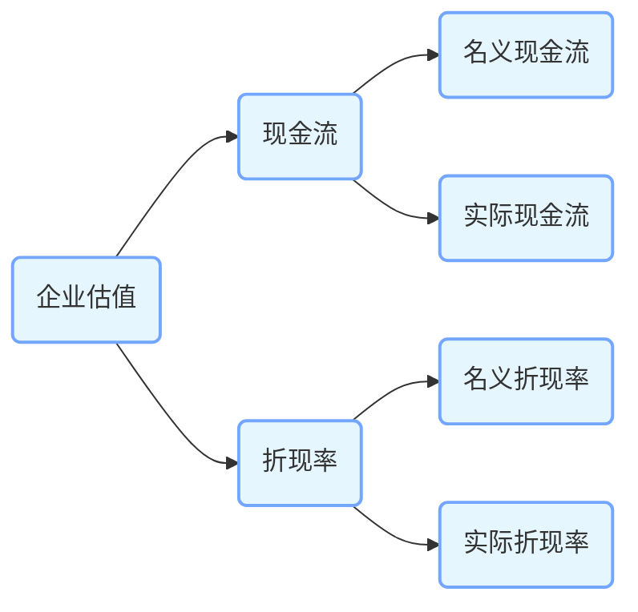

# 如何处理企业估值中的通货膨胀影响

> 关键词：企业估值、通货膨胀、折现率调整、现金流调整、估值模型

> 摘要：本文旨在深入探讨如何处理企业估值中的通货膨胀影响。首先介绍了处理该问题的背景，包括目的、预期读者等。接着阐述了企业估值和通货膨胀的核心概念及其联系，详细讲解了核心算法原理和具体操作步骤，并结合数学模型和公式进行说明。通过项目实战给出实际案例，分析了不同通货膨胀处理方式对企业估值的影响。同时列举了该领域的实际应用场景，推荐了相关的工具和资源。最后总结了未来发展趋势与挑战，提供了常见问题解答和扩展阅读资料，帮助读者全面了解并掌握处理企业估值中通货膨胀影响的方法。

## 1. 背景介绍 
### 1.1 目的和范围
在企业估值过程中，通货膨胀是一个不可忽视的重要因素。通货膨胀会对企业的现金流、折现率等产生影响，进而影响企业的估值结果。本文的目的是系统地介绍如何处理企业估值中的通货膨胀影响，涵盖了不同估值方法下考虑通货膨胀的具体方式，以及相关的理论和实践操作。通过本文的阐述，读者能够了解通货膨胀对企业估值的作用机制，并掌握相应的处理技巧，从而提高企业估值的准确性和可靠性。

### 1.2 预期读者
本文预期读者包括金融分析师、投资经理、企业财务管理人员、学者以及对企业估值和通货膨胀相关领域感兴趣的人士。这些读者可能需要在实际工作中进行企业估值，或者在学术研究中探讨通货膨胀对企业经济活动的影响，本文将为他们提供有价值的参考和指导。

### 1.3 文档结构概述
本文首先介绍背景信息，让读者了解处理企业估值中通货膨胀影响的重要性和意义。接着阐述核心概念与联系，明确企业估值和通货膨胀的基本概念及其相互关系。然后详细讲解核心算法原理和具体操作步骤，通过Python代码展示如何在实际计算中考虑通货膨胀因素。之后给出数学模型和公式，并结合具体例子进行说明。在项目实战部分，通过实际案例展示如何在开发环境中实现考虑通货膨胀的企业估值，并对代码进行解读和分析。随后介绍该领域的实际应用场景，让读者了解在哪些情况下需要重点考虑通货膨胀对企业估值的影响。接着推荐相关的工具和资源，包括学习资源、开发工具框架和相关论文著作。最后总结未来发展趋势与挑战，解答常见问题，并提供扩展阅读和参考资料。

### 1.4 术语表
#### 1.4.1 核心术语定义
- **企业估值**：是指着眼于企业本身，对企业的内在价值进行评估。企业的内在价值是企业未来预期自由现金流量的现值之和，它是一个企业在其持续经营期间内所产生的经济利润的折现值。
- **通货膨胀**：是指在货币流通条件下，因货币供给大于货币实际需求，也即现实购买力大于产出供给，导致货币贬值，而引起的一段时间内物价持续而普遍地上涨现象。其实质是社会总需求大于社会总供给 。
- **折现率**：是指将未来有限期预期收益折算成现值的比率。在企业估值中，折现率反映了投资者对投资风险的要求和对资金时间价值的考虑。
- **现金流**：是指企业在一定会计期间按照现金收付实现制，通过一定经济活动（包括经营活动、投资活动、筹资活动和非经常性项目）而产生的现金流入、现金流出及其总量情况的总称。

#### 1.4.2 相关概念解释
- **名义现金流**：是指包含了通货膨胀影响的现金流，即按照当前市场价格计算的未来现金流量。
- **实际现金流**：是指剔除了通货膨胀影响后的现金流，反映了现金流的实际购买力。
- **名义折现率**：是指包含了通货膨胀因素的折现率，通常由实际折现率和通货膨胀率组成。
- **实际折现率**：是指不考虑通货膨胀因素的折现率，反映了资金的真实成本和投资的实际回报要求。

#### 1.4.3 缩略词列表
- **NPV**：Net Present Value，净现值，是指投资方案所产生的现金净流量以资金成本为贴现率折现之后与原始投资额现值的差额。
- **IRR**：Internal Rate of Return，内部收益率，是指使投资项目的净现值等于零时的折现率。

## 2. 核心概念与联系 
### 核心概念原理
企业估值的基本原理是基于企业未来的现金流量和折现率来计算企业的现值。而通货膨胀会对这两个关键因素产生影响。

从现金流角度来看，通货膨胀会导致物价上涨，企业的销售收入和成本都会受到影响。如果不考虑通货膨胀，可能会低估企业的未来现金流量。例如，企业的产品价格会随着通货膨胀而上升，从而增加销售收入；同时，原材料成本、劳动力成本等也会上升，增加企业的运营成本。

从折现率角度来看，通货膨胀会影响投资者对资金时间价值和风险的预期。投资者会要求更高的回报率来补偿通货膨胀带来的货币贬值风险，因此折现率会上升。

### 架构的文本示意图
```plaintext
企业估值
|-- 现金流
|   |-- 名义现金流（受通货膨胀影响）
|   |-- 实际现金流（剔除通货膨胀影响）
|-- 折现率
|   |-- 名义折现率（包含通货膨胀因素）
|   |-- 实际折现率（不包含通货膨胀因素）
```

### Mermaid 流程图


## 3. 核心算法原理 & 具体操作步骤 
### 核心算法原理
在企业估值中，常用的方法是现金流折现法（DCF），其基本公式为：

$$NPV=\sum_{t=0}^{n}\frac{CF_t}{(1 + r)^t}$$

其中，$NPV$ 是净现值，$CF_t$ 是第 $t$ 期的现金流量，$r$ 是折现率，$n$ 是期数。

考虑通货膨胀时，有两种处理方式：

#### 名义现金流 - 名义折现率法
使用包含通货膨胀影响的名义现金流和名义折现率进行计算。名义折现率 $r_n$ 可以通过费雪方程式计算：

$$r_n=(1 + r_r)(1 + i)-1$$

其中，$r_r$ 是实际折现率，$i$ 是通货膨胀率。

#### 实际现金流 - 实际折现率法
使用剔除通货膨胀影响的实际现金流和实际折现率进行计算。实际现金流 $CF_{r,t}$ 可以通过名义现金流 $CF_{n,t}$ 计算：

$$CF_{r,t}=\frac{CF_{n,t}}{(1 + i)^t}$$

### 具体操作步骤
#### 名义现金流 - 名义折现率法
1. 预测企业未来各期的名义现金流 $CF_{n,t}$。
2. 根据费雪方程式计算名义折现率 $r_n$。
3. 使用 DCF 公式计算净现值：

$$NPV=\sum_{t=0}^{n}\frac{CF_{n,t}}{(1 + r_n)^t}$$

#### 实际现金流 - 实际折现率法
1. 预测企业未来各期的名义现金流 $CF_{n,t}$。
2. 根据通货膨胀率 $i$ 计算实际现金流 $CF_{r,t}$。
3. 确定实际折现率 $r_r$。
4. 使用 DCF 公式计算净现值：

$$NPV=\sum_{t=0}^{n}\frac{CF_{r,t}}{(1 + r_r)^t}$$

### Python 源代码实现
```python
import numpy as np

# 名义现金流 - 名义折现率法
def nominal_dcf(nominal_cash_flows, real_discount_rate, inflation_rate):
    nominal_discount_rate = (1 + real_discount_rate) * (1 + inflation_rate) - 1
    n = len(nominal_cash_flows)
    periods = np.arange(n)
    npv = np.sum(nominal_cash_flows / (1 + nominal_discount_rate) ** periods)
    return npv

# 实际现金流 - 实际折现率法
def real_dcf(nominal_cash_flows, real_discount_rate, inflation_rate):
    n = len(nominal_cash_flows)
    periods = np.arange(n)
    real_cash_flows = nominal_cash_flows / (1 + inflation_rate) ** periods
    npv = np.sum(real_cash_flows / (1 + real_discount_rate) ** periods)
    return npv

# 示例数据
nominal_cash_flows = np.array([-100, 30, 40, 50, 60])
real_discount_rate = 0.1
inflation_rate = 0.05

# 计算净现值
npv_nominal = nominal_dcf(nominal_cash_flows, real_discount_rate, inflation_rate)
npv_real = real_dcf(nominal_cash_flows, real_discount_rate, inflation_rate)

print(f"名义现金流 - 名义折现率法净现值: {npv_nominal}")
print(f"实际现金流 - 实际折现率法净现值: {npv_real}")
```

## 4. 数学模型和公式 & 详细讲解 & 举例说明 
### 费雪方程式
费雪方程式是用来描述名义利率、实际利率和通货膨胀率之间关系的公式：

$$r_n=(1 + r_r)(1 + i)-1$$

展开可得：

$$r_n=r_r + i+ r_r\times i$$

当通货膨胀率 $i$ 较小时，$r_r\times i$ 可以忽略不计，此时 $r_n\approx r_r + i$。

### 现金流调整公式
实际现金流 $CF_{r,t}$ 与名义现金流 $CF_{n,t}$ 的关系为：

$$CF_{r,t}=\frac{CF_{n,t}}{(1 + i)^t}$$

### 举例说明
假设企业初始投资 100 万元，预计未来 3 年的名义现金流分别为 30 万元、40 万元和 50 万元。实际折现率为 10%，通货膨胀率为 5%。

#### 名义现金流 - 名义折现率法
首先计算名义折现率：

$$r_n=(1 + 0.1)(1 + 0.05)-1=0.155$$

然后计算净现值：

$$NPV=\frac{-100}{(1 + 0.155)^0}+\frac{30}{(1 + 0.155)^1}+\frac{40}{(1 + 0.155)^2}+\frac{50}{(1 + 0.155)^3}$$

```python
import numpy as np

nominal_cash_flows = np.array([-100, 30, 40, 50])
real_discount_rate = 0.1
inflation_rate = 0.05
nominal_discount_rate = (1 + real_discount_rate) * (1 + inflation_rate) - 1
periods = np.arange(len(nominal_cash_flows))
npv_nominal = np.sum(nominal_cash_flows / (1 + nominal_discount_rate) ** periods)
print(f"名义现金流 - 名义折现率法净现值: {npv_nominal}")
```

#### 实际现金流 - 实际折现率法
先计算实际现金流：

$$CF_{r,1}=\frac{30}{(1 + 0.05)^1}\approx28.57$$
$$CF_{r,2}=\frac{40}{(1 + 0.05)^2}\approx36.28$$
$$CF_{r,3}=\frac{50}{(1 + 0.05)^3}\approx43.19$$

然后计算净现值：

$$NPV=\frac{-100}{(1 + 0.1)^0}+\frac{28.57}{(1 + 0.1)^1}+\frac{36.28}{(1 + 0.1)^2}+\frac{43.19}{(1 + 0.1)^3}$$

```python
real_cash_flows = nominal_cash_flows / (1 + inflation_rate) ** periods
npv_real = np.sum(real_cash_flows / (1 + real_discount_rate) ** periods)
print(f"实际现金流 - 实际折现率法净现值: {npv_real}")
```

通过以上计算可以发现，两种方法计算的净现值应该是相近的，这也验证了在考虑通货膨胀时，两种处理方式的内在一致性。

## 5. 项目实战：代码实际案例和详细解释说明 
### 5.1  开发环境搭建
为了实现考虑通货膨胀的企业估值，我们可以使用 Python 语言进行开发。以下是搭建开发环境的步骤：

1. **安装 Python**：可以从 Python 官方网站（https://www.python.org/downloads/）下载并安装适合你操作系统的 Python 版本。建议安装 Python 3.7 及以上版本。
2. **安装必要的库**：我们需要使用 `numpy` 库进行数值计算。可以使用以下命令安装：

```sh
pip install numpy
```

### 5.2  源代码详细实现和代码解读
以下是一个完整的 Python 代码示例，用于实现考虑通货膨胀的企业估值：

```python
import numpy as np

# 名义现金流 - 名义折现率法
def nominal_dcf(nominal_cash_flows, real_discount_rate, inflation_rate):
    # 计算名义折现率
    nominal_discount_rate = (1 + real_discount_rate) * (1 + inflation_rate) - 1
    # 获取现金流的期数
    n = len(nominal_cash_flows)
    # 生成期数数组
    periods = np.arange(n)
    # 计算净现值
    npv = np.sum(nominal_cash_flows / (1 + nominal_discount_rate) ** periods)
    return npv

# 实际现金流 - 实际折现率法
def real_dcf(nominal_cash_flows, real_discount_rate, inflation_rate):
    # 获取现金流的期数
    n = len(nominal_cash_flows)
    # 生成期数数组
    periods = np.arange(n)
    # 计算实际现金流
    real_cash_flows = nominal_cash_flows / (1 + inflation_rate) ** periods
    # 计算净现值
    npv = np.sum(real_cash_flows / (1 + real_discount_rate) ** periods)
    return npv

# 示例数据
nominal_cash_flows = np.array([-100, 30, 40, 50, 60])
real_discount_rate = 0.1
inflation_rate = 0.05

# 计算净现值
npv_nominal = nominal_dcf(nominal_cash_flows, real_discount_rate, inflation_rate)
npv_real = real_dcf(nominal_cash_flows, real_discount_rate, inflation_rate)

print(f"名义现金流 - 名义折现率法净现值: {npv_nominal}")
print(f"实际现金流 - 实际折现率法净现值: {npv_real}")
```

### 代码解读与分析
1. **`nominal_dcf` 函数**：
    - 该函数接受名义现金流数组 `nominal_cash_flows`、实际折现率 `real_discount_rate` 和通货膨胀率 `inflation_rate` 作为输入。
    - 首先，根据费雪方程式计算名义折现率 `nominal_discount_rate`。
    - 然后，使用 `np.arange` 函数生成期数数组 `periods`。
    - 最后，使用 `np.sum` 函数计算净现值。

2. **`real_dcf` 函数**：
    - 该函数同样接受名义现金流数组、实际折现率和通货膨胀率作为输入。
    - 首先，生成期数数组。
    - 然后，根据通货膨胀率计算实际现金流 `real_cash_flows`。
    - 最后，使用 `np.sum` 函数计算净现值。

3. **主程序**：
    - 定义示例数据，包括名义现金流数组、实际折现率和通货膨胀率。
    - 分别调用 `nominal_dcf` 和 `real_dcf` 函数计算净现值。
    - 打印计算结果。

通过这个代码示例，我们可以清晰地看到如何在企业估值中考虑通货膨胀的影响，并使用不同的方法进行计算。

## 6. 实际应用场景 
### 投资决策
在进行投资决策时，投资者需要准确评估企业的价值。考虑通货膨胀因素可以使估值结果更符合实际情况，帮助投资者做出更明智的决策。例如，在评估一个长期投资项目时，如果不考虑通货膨胀，可能会低估项目的成本和风险，从而高估项目的价值。

### 企业并购
在企业并购过程中，准确评估目标企业的价值至关重要。通货膨胀会影响目标企业的未来现金流和折现率，进而影响企业的估值。通过合理处理通货膨胀影响，可以避免因估值不准确而导致的并购风险。

### 财务报表分析
在分析企业的财务报表时，通货膨胀会对企业的收入、成本和利润产生影响。通过调整财务数据以反映通货膨胀的影响，可以更准确地评估企业的经营业绩和财务状况。

### 融资活动
企业在进行融资活动时，如发行债券或股票，需要确定合理的融资成本和发行价格。考虑通货膨胀因素可以使融资成本和发行价格更符合市场实际情况，提高融资的成功率。

## 7. 工具和资源推荐
### 7.1 学习资源推荐
#### 7.1.1 书籍推荐
- 《公司理财》（Corporate Finance）：作者是斯蒂芬·A·罗斯（Stephen A. Ross）等，这本书是公司理财领域的经典教材，详细介绍了企业估值的各种方法，包括考虑通货膨胀的现金流折现法。
- 《投资学》（Investments）：作者是滋维·博迪（Zvi Bodie）等，该书涵盖了投资决策、资产估值等内容，对理解通货膨胀对投资的影响有很大帮助。
- 《估值：难点、解决方案及相关案例》（Valuation: Measuring and Managing the Value of Companies）：作者是蒂姆·科勒（Tim Koller）等，这本书专注于企业估值的实际应用，提供了很多实用的估值技巧和案例。

#### 7.1.2 在线课程
- Coursera 平台上的“公司财务基础”（Fundamentals of Corporate Finance）课程：该课程由知名教授授课，系统介绍了公司财务的基本概念和方法，包括企业估值。
- edX 平台上的“投资学原理”（Principles of Investments）课程：涵盖了投资领域的核心知识，对通货膨胀与资产估值的关系有深入讲解。

#### 7.1.3 技术博客和网站
- Seeking Alpha（https://seekingalpha.com/）：是一个金融投资领域的知名博客网站，提供了大量关于企业估值、投资分析的文章和观点。
- Investopedia（https://www.investopedia.com/）：是一个专业的金融知识学习网站，有丰富的企业估值和通货膨胀相关的词条和文章。

### 7.2 开发工具框架推荐
#### 7.2.1 IDE和编辑器
- PyCharm：是一款专业的 Python 集成开发环境，提供了丰富的代码编辑、调试和项目管理功能，适合开发企业估值相关的 Python 程序。
- Jupyter Notebook：是一个交互式的开发环境，支持 Python 代码的编写、运行和可视化展示，方便进行数据分析和模型验证。

#### 7.2.2 调试和性能分析工具
- `pdb`：是 Python 自带的调试工具，可以帮助开发者定位代码中的错误和问题。
- `cProfile`：是 Python 的性能分析工具，可以分析代码的运行时间和资源消耗情况，帮助优化代码性能。

#### 7.2.3 相关框架和库
- `numpy`：是 Python 中用于科学计算的基础库，提供了高效的数组操作和数学函数，在企业估值计算中经常使用。
- `pandas`：是一个强大的数据处理和分析库，可以方便地处理和分析企业的财务数据。

### 7.3 相关论文著作推荐
#### 7.3.1 经典论文
- Modigliani, F., & Cohn, R. A. (1979). Inflation, rational valuation, and the market. Financial Analysts Journal, 35(2), 24-44. 该论文探讨了通货膨胀对股票市场估值的影响。
- Fama, E. F., & Schwert, G. W. (1977). Asset returns and inflation. Journal of Financial Economics, 5(2), 115-146. 研究了资产收益率与通货膨胀之间的关系。

#### 7.3.2 最新研究成果
可以通过学术数据库如 Google Scholar、Web of Science 等搜索关于企业估值和通货膨胀的最新研究论文，了解该领域的前沿动态。

#### 7.3.3 应用案例分析
一些专业的金融研究机构和咨询公司会发布企业估值的应用案例分析报告，这些报告可以帮助读者更好地理解如何在实际项目中处理通货膨胀对企业估值的影响。

## 8. 总结：未来发展趋势与挑战
### 未来发展趋势
- **更加精确的通货膨胀预测**：随着大数据和人工智能技术的发展，对通货膨胀的预测将更加精确。这将有助于提高企业估值中对通货膨胀影响处理的准确性。
- **多因素综合考虑**：未来的企业估值将不仅仅考虑通货膨胀因素，还会综合考虑利率波动、汇率变化、宏观经济政策等多种因素，以提供更全面的估值结果。
- **行业差异化处理**：不同行业对通货膨胀的敏感度不同，未来的企业估值将更加注重行业差异化，采用更适合各行业特点的通货膨胀处理方法。

### 挑战
- **通货膨胀的不确定性**：通货膨胀受到多种因素的影响，如宏观经济政策、国际经济形势等，其走势具有较大的不确定性。这给企业估值中准确考虑通货膨胀影响带来了挑战。
- **数据质量和获取难度**：准确的企业估值需要大量的历史数据和预测数据，包括现金流数据、通货膨胀数据等。然而，数据的质量和获取难度可能会影响估值的准确性。
- **模型的复杂性和适用性**：为了更准确地处理通货膨胀影响，可能需要使用更复杂的估值模型。但这些模型的复杂性可能会导致理解和应用的困难，同时也需要考虑模型在不同情况下的适用性。

## 9. 附录：常见问题与解答
### 问题 1：两种处理通货膨胀的方法（名义现金流 - 名义折现率法和实际现金流 - 实际折现率法）结果为什么应该相近？
两种方法本质上都是对企业未来现金流量进行折现计算，只是在处理通货膨胀的方式上有所不同。名义现金流 - 名义折现率法直接考虑了通货膨胀对现金流和折现率的影响；实际现金流 - 实际折现率法先剔除了通货膨胀对现金流的影响，再使用不包含通货膨胀因素的折现率进行计算。在理论上，如果数据准确且计算正确，两种方法的结果应该相近。

### 问题 2：如何确定实际折现率和通货膨胀率？
实际折现率可以根据市场的无风险利率、企业的风险溢价等因素来确定。无风险利率通常可以参考国债收益率，风险溢价则需要根据企业的行业特点、经营风险等进行评估。通货膨胀率可以参考国家公布的通货膨胀数据，如消费者物价指数（CPI）的增长率。

### 问题 3：在企业估值中，是否必须考虑通货膨胀因素？
在大多数情况下，考虑通货膨胀因素可以提高企业估值的准确性。特别是在通货膨胀率较高或估值期限较长的情况下，通货膨胀对企业的现金流和折现率会产生显著影响，忽略通货膨胀因素可能会导致估值结果与实际情况偏差较大。但在通货膨胀率较低且对企业影响较小的情况下，可以根据实际情况决定是否考虑通货膨胀因素。

## 10. 扩展阅读 & 参考资料
### 扩展阅读
- 《金融市场与金融机构》（Financial Markets and Institutions）：进一步了解金融市场的运作和金融机构的作用，有助于更好地理解企业估值的市场环境。
- 《宏观经济学》（Macroeconomics）：学习宏观经济理论和政策，掌握通货膨胀的形成机制和影响因素，为处理企业估值中的通货膨胀影响提供更深入的理论基础。

### 参考资料
- 相关的财务报表和企业年报，这些资料可以提供企业的历史财务数据和经营信息，用于企业估值的计算。
- 国家统计局发布的宏观经济数据，如通货膨胀率、GDP 增长率等，为分析通货膨胀对企业的影响提供数据支持。
- 金融行业的研究报告和分析文章，了解行业动态和市场趋势，有助于更准确地评估企业的未来发展前景。