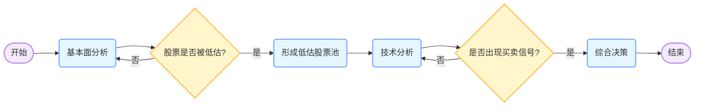

# 如何将特价股票策略与技术分析相结合

> 关键词：特价股票策略、技术分析、股票投资、市场趋势、交易决策

> 摘要：本文旨在深入探讨如何将特价股票策略与技术分析有机结合，以提升股票投资的效果。首先介绍了相关的背景知识，包括目的范围、预期读者等。接着阐述了特价股票策略和技术分析的核心概念及联系，并给出了相应的原理和架构示意图。详细讲解了结合过程中涉及的核心算法原理及具体操作步骤，通过Python源代码进行了说明。同时给出了相关的数学模型和公式，并举例说明。通过项目实战展示了代码实际案例及详细解释。探讨了该结合方式在实际中的应用场景，推荐了相关的工具和资源。最后总结了未来发展趋势与挑战，提供了常见问题与解答及扩展阅读参考资料，帮助投资者更好地掌握将特价股票策略与技术分析相结合的方法，做出更明智的投资决策。

## 1. 背景介绍 
### 1.1 目的和范围
在股票投资领域，投资者总是在寻找能够获取更高收益且降低风险的投资策略。特价股票策略和技术分析作为两种重要的投资分析方法，各自具有独特的优势。特价股票策略侧重于寻找被市场低估的股票，以获取价值回归带来的收益；技术分析则通过研究股票价格和交易量等历史数据，预测股票未来的走势。本文章的目的在于探讨如何将这两种策略相结合，充分发挥它们的优势，提高投资决策的准确性和有效性。范围涵盖了从基本概念的介绍到实际应用案例的分析，以及相关工具和资源的推荐等多个方面。

### 1.2 预期读者
本文预期读者主要包括对股票投资有一定了解，希望进一步提升投资技巧的个人投资者；从事金融投资研究和实践的专业人士，如投资顾问、分析师等；以及对股票投资领域感兴趣的学生和研究人员。

### 1.3 文档结构概述
本文将按照以下结构进行阐述：首先介绍相关的背景知识，包括目的范围、预期读者等；接着深入讲解特价股票策略和技术分析的核心概念及它们之间的联系，并给出相应的原理和架构示意图；然后详细说明结合过程中涉及的核心算法原理及具体操作步骤，同时通过Python源代码进行演示；再给出相关的数学模型和公式，并举例说明；通过项目实战展示代码实际案例及详细解释；探讨该结合方式在实际中的应用场景；推荐相关的工具和资源；最后总结未来发展趋势与挑战，提供常见问题与解答及扩展阅读参考资料。

### 1.4 术语表
#### 1.4.1 核心术语定义
- **特价股票策略**：是一种基于价值投资理念的投资策略，通过分析股票的基本面信息，如财务报表、行业前景等，寻找被市场低估的股票，认为这些股票在未来有较大的上涨空间，投资者可以在股价低估时买入，等待价值回归获取收益。
- **技术分析**：是通过研究股票价格、交易量等历史数据，运用各种技术指标和图表形态，来预测股票未来价格走势的分析方法。它认为市场行为包含了一切信息，历史会重演，通过对过去价格和交易量的分析可以预测未来的价格变化。

#### 1.4.2 相关概念解释
- **基本面分析**：是对影响股票价值和价格的基本因素进行分析，包括宏观经济状况、行业发展趋势、公司的财务状况、经营管理水平等。基本面分析是特价股票策略的重要基础，通过评估公司的内在价值来判断股票是否被低估。
- **技术指标**：是根据股票价格、交易量等数据计算出来的一系列数值，用于辅助技术分析。常见的技术指标包括移动平均线、相对强弱指数（RSI）、布林带等，这些指标可以帮助投资者判断股票的趋势、买卖信号等。

#### 1.4.3 缩略词列表
- **RSI**：相对强弱指数（Relative Strength Index），是一种衡量股票价格变动幅度的技术指标，用于判断股票的超买超卖情况。
- **MACD**：指数平滑异同移动平均线（Moving Average Convergence Divergence），是一种常用的技术分析工具，用于判断股票的趋势和买卖信号。

## 2. 核心概念与联系 
### 特价股票策略原理
特价股票策略的核心在于寻找被市场低估的股票。其基本原理是基于价值投资理论，认为股票的价格会围绕其内在价值波动。当股票的市场价格低于其内在价值时，股票就被低估，具有投资价值。投资者通过对公司的基本面进行深入分析，包括财务报表分析、行业前景评估等，来估算股票的内在价值。例如，通过分析公司的盈利能力、资产负债状况、现金流等指标，运用估值模型（如市盈率法、市净率法等）来确定股票的合理价值范围。

### 技术分析原理
技术分析的理论基础主要基于三个假设：市场行为包含一切信息、价格沿趋势移动、历史会重演。技术分析通过研究股票价格和交易量等历史数据，运用各种技术指标和图表形态来预测股票未来的走势。例如，移动平均线可以帮助投资者判断股票的趋势，当短期移动平均线向上穿过长期移动平均线时，通常被视为买入信号；相对强弱指数（RSI）可以判断股票的超买超卖情况，当RSI值超过70时，股票可能被超买，存在回调风险。

### 两者联系
特价股票策略和技术分析并不是相互独立的，而是可以相互补充的。特价股票策略侧重于寻找具有投资价值的股票，但它无法确定股票价格上涨的具体时机。技术分析则可以通过对股票价格走势的研究，为投资者提供买卖时机的参考。例如，当通过特价股票策略筛选出被低估的股票后，可以运用技术分析来判断何时是最佳的买入时机。同时，技术分析也可以帮助投资者验证特价股票策略的判断，如果一只被认为是低估的股票在技术分析中显示出明显的上涨趋势，那么其投资价值就更值得信赖。

### 原理和架构的文本示意图
特价股票策略和技术分析相结合的原理和架构可以用以下文本描述：首先，通过基本面分析运用特价股票策略筛选出被低估的股票池。然后，对股票池中的股票进行技术分析，运用各种技术指标和图表形态来判断股票的趋势和买卖信号。最后，综合考虑特价股票策略和技术分析的结果，做出投资决策。

### Mermaid 流程图


## 3. 核心算法原理 & 具体操作步骤 
### 核心算法原理
在将特价股票策略与技术分析相结合的过程中，主要涉及到两个核心算法：一是特价股票筛选算法，二是技术分析信号判断算法。

#### 特价股票筛选算法
特价股票筛选算法的核心是通过对公司基本面数据的分析，计算股票的内在价值，并与市场价格进行比较。常见的方法是运用估值模型，如市盈率法、市净率法等。以市盈率法为例，其计算公式为：

$$V = EPS \times P/E$$

其中，$V$ 表示股票的内在价值，$EPS$ 表示每股收益，$P/E$ 表示合理的市盈率。合理的市盈率可以根据行业平均市盈率、公司的成长前景等因素进行调整。当股票的市场价格低于其内在价值时，认为该股票被低估。

#### 技术分析信号判断算法
技术分析信号判断算法主要是通过计算各种技术指标，并根据指标的数值和变化情况来判断买卖信号。以移动平均线为例，当短期移动平均线（如5日均线）向上穿过长期移动平均线（如20日均线）时，产生买入信号；当短期移动平均线向下穿过长期移动平均线时，产生卖出信号。

### 具体操作步骤
#### 步骤1：数据收集
收集股票的基本面数据，如财务报表数据、行业数据等；同时收集股票的历史价格和交易量数据，用于技术分析。

#### 步骤2：特价股票筛选
运用特价股票筛选算法，对收集到的基本面数据进行分析，计算股票的内在价值，并与市场价格进行比较，筛选出被低估的股票。

#### 步骤3：技术分析
对筛选出的被低估的股票进行技术分析，计算各种技术指标，如移动平均线、相对强弱指数（RSI）等，并根据指标的数值和变化情况判断买卖信号。

#### 步骤4：综合决策
综合考虑特价股票筛选和技术分析的结果，做出投资决策。例如，如果一只股票被认为是被低估的，并且技术分析显示出买入信号，那么可以考虑买入该股票。

### Python源代码实现
```python
import pandas as pd
import numpy as np
import yfinance as yf
from datetime import datetime

# 步骤1：数据收集
def collect_data(ticker, start_date, end_date):
    data = yf.download(ticker, start=start_date, end=end_date)
    return data

# 步骤2：特价股票筛选（简单示例：市盈率法）
def special_stock_screening(data, industry_pe):
    # 假设每股收益数据可以从其他渠道获取，这里简单模拟
    eps = 1.0
    intrinsic_value = eps * industry_pe
    current_price = data['Close'].iloc[-1]
    if current_price < intrinsic_value:
        return True
    else:
        return False

# 步骤3：技术分析（移动平均线交叉信号）
def technical_analysis(data, short_window=5, long_window=20):
    data['short_ma'] = data['Close'].rolling(window=short_window).mean()
    data['long_ma'] = data['Close'].rolling(window=long_window).mean()
    if data['short_ma'].iloc[-1] > data['long_ma'].iloc[-1] and data['short_ma'].iloc[-2] <= data['long_ma'].iloc[-2]:
        return 'buy'
    elif data['short_ma'].iloc[-1] < data['long_ma'].iloc[-1] and data['short_ma'].iloc[-2] >= data['long_ma'].iloc[-2]:
        return 'sell'
    else:
        return 'hold'

# 步骤4：综合决策
def comprehensive_decision(ticker, start_date, end_date, industry_pe):
    data = collect_data(ticker, start_date, end_date)
    is_special_stock = special_stock_screening(data, industry_pe)
    signal = technical_analysis(data)
    if is_special_stock and signal == 'buy':
        return 'buy'
    else:
        return 'hold'

# 示例调用
ticker = 'AAPL'
start_date = '2020-01-01'
end_date = datetime.today().strftime('%Y-%m-%d')
industry_pe = 20
decision = comprehensive_decision(ticker, start_date, end_date, industry_pe)
print(f"投资决策: {decision}")
```

## 4. 数学模型和公式 & 详细讲解 & 举例说明 
### 特价股票筛选相关数学模型和公式
#### 市盈率法
市盈率法是一种常用的股票估值方法，其基本公式为：

$$V = EPS \times P/E$$

其中，$V$ 表示股票的内在价值，$EPS$ 表示每股收益，$P/E$ 表示合理的市盈率。

详细讲解：每股收益（$EPS$）是指公司净利润与发行在外普通股股数的比值，反映了公司的盈利能力。合理的市盈率（$P/E$）可以根据行业平均市盈率、公司的成长前景等因素进行调整。例如，对于成长型公司，其合理的市盈率可能会高于行业平均市盈率；对于成熟型公司，其合理的市盈率可能会接近行业平均市盈率。

举例说明：假设某公司的每股收益为2元，行业平均市盈率为15倍，考虑到该公司具有较好的成长前景，给予其20倍的市盈率。则该公司股票的内在价值为：

$$V = 2 \times 20 = 40$$（元）

如果该股票的市场价格为35元，低于其内在价值40元，则认为该股票被低估。

#### 市净率法
市净率法的公式为：

$$V = BVPS \times P/B$$

其中，$V$ 表示股票的内在价值，$BVPS$ 表示每股净资产，$P/B$ 表示市净率。

详细讲解：每股净资产（$BVPS$）是指公司净资产与发行在外普通股股数的比值，反映了公司的净资产价值。市净率（$P/B$）是指股票市场价格与每股净资产的比值，反映了市场对公司净资产的估值水平。一般来说，市净率越低，股票越具有投资价值。

举例说明：假设某公司的每股净资产为5元，行业平均市净率为2倍。则该公司股票的内在价值为：

$$V = 5 \times 2 = 10$$（元）

如果该股票的市场价格为8元，低于其内在价值10元，则认为该股票被低估。

### 技术分析相关数学模型和公式
#### 移动平均线
移动平均线（MA）是一种常用的技术分析工具，其计算公式为：

$$MA_n = \frac{\sum_{i=0}^{n-1} P_{t-i}}{n}$$

其中，$MA_n$ 表示 $n$ 日移动平均线，$P_t$ 表示第 $t$ 日的股票价格，$n$ 表示移动平均线的周期。

详细讲解：移动平均线可以平滑股票价格的波动，反映股票价格的趋势。短期移动平均线（如5日均线）对价格变化比较敏感，能够及时反映股票价格的短期波动；长期移动平均线（如20日均线）对价格变化的反应相对较慢，能够反映股票价格的长期趋势。

举例说明：假设某股票最近5日的收盘价分别为10元、11元、12元、13元、14元，则其5日移动平均线为：

$$MA_5 = \frac{10 + 11 + 12 + 13 + 14}{5} = 12$$（元）

#### 相对强弱指数（RSI）
相对强弱指数（RSI）的计算公式为：

$$RSI = 100 - \frac{100}{1 + RS}$$

其中，$RS$ 表示相对强度，计算公式为：

$$RS = \frac{\text{平均上涨幅度}}{\text{平均下跌幅度}}$$

详细讲解：相对强弱指数（RSI）用于衡量股票价格变动的幅度和速度，判断股票的超买超卖情况。RSI值的范围在0到100之间，一般来说，当RSI值超过70时，股票被认为是超买，存在回调风险；当RSI值低于30时，股票被认为是超卖，存在反弹机会。

举例说明：假设某股票在过去14个交易日中，平均上涨幅度为2元，平均下跌幅度为1元，则其相对强度为：

$$RS = \frac{2}{1} = 2$$

相对强弱指数为：

$$RSI = 100 - \frac{100}{1 + 2} \approx 66.67$$

由于RSI值接近70，该股票可能处于超买状态。

## 5. 项目实战：代码实际案例和详细解释说明 
### 5.1  开发环境搭建
#### 安装Python
首先需要安装Python开发环境，建议使用Python 3.7及以上版本。可以从Python官方网站（https://www.python.org/downloads/）下载安装包，按照安装向导进行安装。

#### 安装必要的库
在命令行中使用以下命令安装必要的库：
```sh
pip install pandas numpy yfinance
```

### 5.2  源代码详细实现和代码解读
```python
import pandas as pd
import numpy as np
import yfinance as yf
from datetime import datetime

# 步骤1：数据收集
def collect_data(ticker, start_date, end_date):
    data = yf.download(ticker, start=start_date, end=end_date)
    return data

# 代码解读：该函数使用yfinance库从雅虎财经下载指定股票在指定日期范围内的历史数据，包括开盘价、收盘价、最高价、最低价、交易量等。

# 步骤2：特价股票筛选（简单示例：市盈率法）
def special_stock_screening(data, industry_pe):
    # 假设每股收益数据可以从其他渠道获取，这里简单模拟
    eps = 1.0
    intrinsic_value = eps * industry_pe
    current_price = data['Close'].iloc[-1]
    if current_price < intrinsic_value:
        return True
    else:
        return False

# 代码解读：该函数使用市盈率法进行特价股票筛选。首先模拟每股收益数据，然后计算股票的内在价值。最后将当前收盘价与内在价值进行比较，如果当前收盘价低于内在价值，则认为该股票被低估，返回True；否则返回False。

# 步骤3：技术分析（移动平均线交叉信号）
def technical_analysis(data, short_window=5, long_window=20):
    data['short_ma'] = data['Close'].rolling(window=short_window).mean()
    data['long_ma'] = data['Close'].rolling(window=long_window).mean()
    if data['short_ma'].iloc[-1] > data['long_ma'].iloc[-1] and data['short_ma'].iloc[-2] <= data['long_ma'].iloc[-2]:
        return 'buy'
    elif data['short_ma'].iloc[-1] < data['long_ma'].iloc[-1] and data['short_ma'].iloc[-2] >= data['long_ma'].iloc[-2]:
        return 'sell'
    else:
        return 'hold'

# 代码解读：该函数使用移动平均线交叉信号进行技术分析。首先计算短期移动平均线（5日均线）和长期移动平均线（20日均线）。然后根据短期移动平均线和长期移动平均线的交叉情况判断买卖信号。如果短期移动平均线向上穿过长期移动平均线，则返回'buy'；如果短期移动平均线向下穿过长期移动平均线，则返回'sell'；否则返回'hold'。

# 步骤4：综合决策
def comprehensive_decision(ticker, start_date, end_date, industry_pe):
    data = collect_data(ticker, start_date, end_date)
    is_special_stock = special_stock_screening(data, industry_pe)
    signal = technical_analysis(data)
    if is_special_stock and signal == 'buy':
        return 'buy'
    else:
        return 'hold'

# 代码解读：该函数综合考虑特价股票筛选和技术分析的结果，做出投资决策。首先调用collect_data函数收集股票数据，然后调用special_stock_screening函数进行特价股票筛选，调用technical_analysis函数进行技术分析。如果股票被认为是被低估的，并且技术分析显示出买入信号，则返回'buy'；否则返回'hold'。

# 示例调用
ticker = 'AAPL'
start_date = '2020-01-01'
end_date = datetime.today().strftime('%Y-%m-%d')
industry_pe = 20
decision = comprehensive_decision(ticker, start_date, end_date, industry_pe)
print(f"投资决策: {decision}")
```

### 5.3  代码解读与分析
#### 数据收集部分
使用`yfinance`库从雅虎财经下载股票历史数据，该库提供了简单方便的接口，可以快速获取股票的各种数据。

#### 特价股票筛选部分
采用市盈率法进行特价股票筛选，虽然这里的每股收益数据是简单模拟的，但在实际应用中，可以从公司的财务报表中获取准确的每股收益数据。通过比较当前收盘价和内在价值，判断股票是否被低估。

#### 技术分析部分
使用移动平均线交叉信号进行技术分析，通过计算短期和长期移动平均线，根据它们的交叉情况判断买卖信号。这种方法简单直观，但在实际应用中，还可以结合其他技术指标进行更准确的判断。

#### 综合决策部分
综合考虑特价股票筛选和技术分析的结果，只有当股票被认为是被低估的，并且技术分析显示出买入信号时，才做出买入决策，提高了投资决策的准确性。

## 6. 实际应用场景 
### 个人投资者
对于个人投资者来说，将特价股票策略与技术分析相结合可以帮助他们在众多的股票中筛选出具有投资价值的股票，并确定合适的买卖时机。例如，个人投资者可以使用上述方法筛选出被低估的股票，然后通过技术分析判断何时买入，以获取更高的收益。同时，这种方法也可以帮助个人投资者降低投资风险，避免盲目跟风投资。

### 专业投资机构
专业投资机构可以利用特价股票策略与技术分析相结合的方法进行大规模的股票筛选和投资组合管理。例如，投资机构可以使用计算机程序自动化地执行上述方法，对大量的股票进行分析和筛选，构建投资组合。通过不断地调整投资组合，提高投资收益，降低风险。

### 股票研究分析
在股票研究分析领域，将特价股票策略与技术分析相结合可以提供更全面的分析视角。研究人员可以通过对股票的基本面和技术面进行综合分析，深入了解股票的投资价值和价格走势，为投资者提供更有价值的研究报告和投资建议。

## 7. 工具和资源推荐
### 7.1 学习资源推荐
#### 7.1.1 书籍推荐
- 《聪明的投资者》（The Intelligent Investor）：作者是本杰明·格雷厄姆（Benjamin Graham），这本书是价值投资领域的经典之作，详细介绍了价值投资的理念和方法，对于理解特价股票策略具有重要的指导意义。
- 《期货市场技术分析》（Technical Analysis of the Financial Markets）：作者是约翰·墨菲（John J. Murphy），这本书是技术分析领域的权威著作，全面介绍了技术分析的理论和方法，包括各种技术指标和图表形态的分析。

#### 7.1.2 在线课程
- Coursera上的“Investment Management Specialization”：该课程由哥伦比亚大学教授授课，涵盖了投资管理的各个方面，包括价值投资、技术分析等内容。
- Udemy上的“Technical Analysis Masterclass”：该课程详细介绍了技术分析的各种方法和技巧，通过实际案例进行讲解，适合初学者学习。

#### 7.1.3 技术博客和网站
- 雪球（https://xueqiu.com/）：是一个股票投资社区，提供了丰富的股票资讯、研究报告和投资者交流平台。
- 东方财富网（https://www.eastmoney.com/）：是国内知名的金融信息网站，提供了全面的股票行情、财经新闻和数据分析工具。

### 7.2 开发工具框架推荐
#### 7.2.1 IDE和编辑器
- PyCharm：是一款专业的Python集成开发环境，提供了丰富的代码编辑、调试和项目管理功能，适合Python开发。
- Jupyter Notebook：是一个交互式的开发环境，支持Python等多种编程语言，适合数据分析和算法开发。

#### 7.2.2 调试和性能分析工具
- pdb：是Python自带的调试工具，可以帮助开发者进行代码调试，查找程序中的错误。
- cProfile：是Python的性能分析工具，可以帮助开发者分析程序的性能瓶颈，优化代码。

#### 7.2.3 相关框架和库
- pandas：是一个强大的数据分析库，提供了高效的数据结构和数据处理功能，适合处理股票数据。
- numpy：是一个科学计算库，提供了高效的数组操作和数学函数，适合进行数值计算。
- yfinance：是一个用于下载股票历史数据的库，提供了简单方便的接口，可以快速获取股票的各种数据。

### 7.3 相关论文著作推荐
#### 7.3.1 经典论文
- Fama, Eugene F., and Kenneth R. French. "The Cross‐Section of Expected Stock Returns." The Journal of Finance 47.2 (1992): 427-465. 该论文提出了著名的Fama-French三因子模型，对股票收益的横截面进行了深入分析，对于理解股票投资的风险和收益具有重要意义。
- Jegadeesh, Narasimhan, and Sheridan Titman. "Returns to Buying Winners and Selling Losers: Implications for Stock Market Efficiency." The Journal of Finance 48.1 (1993): 65-91. 该论文研究了股票市场中的动量效应，即过去表现好的股票在未来一段时间内仍然表现好，过去表现差的股票在未来一段时间内仍然表现差，为技术分析提供了理论支持。

#### 7.3.2 最新研究成果
可以通过学术数据库（如IEEE Xplore、ACM Digital Library等）搜索最新的关于股票投资策略和技术分析的研究论文，了解该领域的最新研究动态和发展趋势。

#### 7.3.3 应用案例分析
一些金融研究机构和投资公司会发布关于股票投资策略和技术分析的应用案例分析报告，可以通过这些报告了解实际应用中的经验和教训。

## 8. 总结：未来发展趋势与挑战
### 未来发展趋势
#### 智能化和自动化
随着人工智能和机器学习技术的不断发展，未来将有更多的智能化和自动化工具应用于股票投资领域。例如，利用机器学习算法对股票的基本面和技术面数据进行分析和预测，实现自动化的投资决策。

#### 大数据和云计算
大数据和云计算技术的发展将为股票投资提供更丰富的数据资源和更强大的计算能力。通过对海量的股票数据进行分析和挖掘，可以发现更多的投资机会和规律。

#### 跨市场和跨资产投资
未来的股票投资将不再局限于单一市场和单一资产，投资者将更加注重跨市场和跨资产的投资组合管理。将特价股票策略与技术分析相结合的方法也将应用于更广泛的投资领域，如债券、期货、外汇等。

### 挑战
#### 数据质量和可靠性
股票投资分析依赖于大量的数据，数据的质量和可靠性直接影响到分析结果的准确性。然而，数据的获取和处理过程中可能存在误差和噪声，如何提高数据的质量和可靠性是一个挑战。

#### 市场不确定性
股票市场是一个复杂多变的系统，受到多种因素的影响，如宏观经济环境、政策变化、突发事件等。这些因素的不确定性增加了股票投资分析的难度，如何应对市场不确定性是投资者面临的一个重要挑战。

#### 技术分析的局限性
技术分析虽然可以提供一些有用的信息和信号，但它也存在一定的局限性。例如，技术分析无法考虑到公司的基本面变化和宏观经济环境的影响，有时会出现信号滞后或错误的情况。如何正确认识和利用技术分析的局限性是投资者需要解决的问题。

## 9. 附录：常见问题与解答
### 问题1：如何准确估算股票的内在价值？
解答：估算股票的内在价值需要综合考虑多个因素，如公司的财务状况、行业前景、宏观经济环境等。常见的方法包括市盈率法、市净率法、现金流折现法等。在实际应用中，可以结合多种方法进行估算，并根据具体情况进行调整。

### 问题2：技术分析的信号一定准确吗？
解答：技术分析的信号并不是绝对准确的，它只是一种参考。技术分析基于历史数据和统计规律，无法考虑到所有的因素和未来的变化。因此，在使用技术分析信号时，需要结合其他因素进行综合判断，如基本面分析、市场情绪等。

### 问题3：如何选择合适的技术指标？
解答：选择合适的技术指标需要根据自己的投资风格和目标来确定。不同的技术指标适用于不同的市场情况和投资策略。例如，移动平均线适用于判断趋势，相对强弱指数（RSI）适用于判断超买超卖情况。在实际应用中，可以结合多种技术指标进行分析，提高分析的准确性。

### 问题4：如何处理数据缺失和异常值？
解答：对于数据缺失的情况，可以采用插值法、均值法等方法进行填充。对于异常值，可以采用滤波法、统计分析法等方法进行处理。在处理数据缺失和异常值时，需要根据具体情况选择合适的方法，避免对分析结果产生影响。

## 10. 扩展阅读 & 参考资料
### 扩展阅读
- 《金融炼金术》（The Alchemy of Finance）：作者是乔治·索罗斯（George Soros），这本书介绍了索罗斯的投资哲学和方法，对于理解金融市场的运行机制和投资策略具有重要的启示。
- 《股票大作手回忆录》（Reminiscences of a Stock Operator）：作者是爱德温·勒菲弗（Edwin Lefèvre），这本书以小说的形式讲述了股票大作手杰西·利弗莫尔（Jesse Livermore）的投资经历和交易技巧，是一本经典的投资读物。

### 参考资料
- 雅虎财经（https://finance.yahoo.com/）：提供了丰富的股票数据和财经新闻。
- 中国证券监督管理委员会（https://www.csrc.gov.cn/）：提供了中国证券市场的政策法规和监管信息。
- 美国证券交易委员会（https://www.sec.gov/）：提供了美国证券市场的政策法规和监管信息。