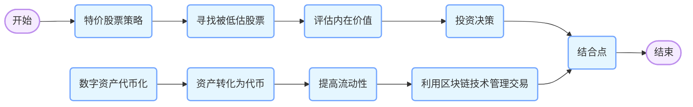

# 如何将特价股票策略与数字资产代币化投资结合

> 关键词：特价股票策略、数字资产代币化、投资结合、金融创新、风险管理、资产配置、市场机遇

> 摘要：本文聚焦于如何将特价股票策略与数字资产代币化投资进行有机结合。首先阐述了相关背景，包括目的、预期读者等内容。接着深入剖析了特价股票策略和数字资产代币化的核心概念及相互联系，介绍了相关核心算法原理与具体操作步骤，并通过数学模型和公式进行详细讲解与举例说明。通过项目实战，给出代码实际案例并进行详细解释。探讨了其实际应用场景，推荐了学习资源、开发工具框架以及相关论文著作。最后总结了未来发展趋势与挑战，解答常见问题并提供扩展阅读与参考资料，旨在为投资者提供一种创新的投资思路和方法，在复杂多变的金融市场中寻找新的机遇和平衡。

## 1. 背景介绍 
### 1.1 目的和范围
在当今复杂多变的金融市场环境下，投资者不断寻求新的投资策略和方法以实现资产的增值和风险的有效管理。特价股票策略专注于挖掘被市场低估的股票，通过长期持有或短期交易获取超额收益；而数字资产代币化则是利用区块链技术将现实世界的资产转化为可交易的数字代币，为资产的流通和交易带来了新的活力和可能性。本文章的目的在于探讨如何将这两种看似不同的投资方式进行有机结合，分析其可行性、潜在风险和收益，为投资者提供一种创新的投资思路和方法。范围涵盖了相关概念的介绍、算法原理的分析、实际案例的探讨以及应用场景的研究等方面。

### 1.2 预期读者
本文预期读者主要包括金融投资者，无论是个人投资者还是机构投资者，他们希望通过多元化的投资策略来优化资产配置，提高投资收益；金融分析师，需要深入了解市场动态和创新投资模式，为客户提供专业的投资建议；区块链技术开发者和研究人员，对数字资产代币化技术有兴趣，希望探索其在金融投资领域的应用；以及对金融创新和投资策略有研究需求的学者和学生等。

### 1.3 文档结构概述
本文首先介绍背景信息，包括目的、预期读者和文档结构概述等内容。接着阐述特价股票策略和数字资产代币化的核心概念及相互联系，通过文本示意图和 Mermaid 流程图进行直观展示。然后详细讲解核心算法原理和具体操作步骤，并用 Python 源代码进行说明。之后介绍相关的数学模型和公式，通过举例加深理解。再通过项目实战，介绍开发环境搭建、源代码实现和代码解读。探讨实际应用场景，推荐相关的工具和资源，包括学习资源、开发工具框架和论文著作等。最后总结未来发展趋势与挑战，解答常见问题并提供扩展阅读与参考资料。

### 1.4 术语表
#### 1.4.1 核心术语定义
- **特价股票策略**：指投资者通过对股票基本面、市场估值等因素的分析，寻找那些市场价格低于其内在价值的股票，并进行投资的一种策略。其核心思想是利用市场的错误定价来获取超额收益。
- **数字资产代币化**：是指利用区块链技术，将现实世界中的资产（如股票、债券、房地产等）的所有权或权益转化为数字代币的过程。这些代币可以在区块链网络上进行交易、流通和管理，具有去中心化、透明、不可篡改等特点。
- **智能合约**：是一种基于区块链技术的自动化合约，它通过代码的形式定义了合约的条款和条件，当满足特定条件时，合约会自动执行，无需第三方的干预。

#### 1.4.2 相关概念解释
- **区块链**：是一种分布式账本技术，它由多个节点组成，每个节点都保存着相同的账本数据。区块链通过密码学技术保证数据的安全性和不可篡改性，同时利用共识机制来确保节点之间的数据一致性。
- **去中心化**：是指在一个系统中，没有一个中心化的控制机构，所有的参与者都具有平等的地位和权利。在区块链网络中，去中心化使得系统更加透明、安全和可靠。
- **加密货币**：是一种基于密码学技术的数字货币，它利用区块链技术实现了去中心化的交易和管理。比特币是最著名的加密货币之一。

#### 1.4.3 缩略词列表
- **ICO**：Initial Coin Offering，首次代币发行，是一种通过发行数字代币来筹集资金的方式。
- **ERC-20**：Ethereum Request for Comments 20，以太坊上的一种代币标准，定义了代币的基本功能和接口。
- **NFT**：Non-Fungible Token，非同质化代币，是一种基于区块链技术的独特数字资产，每个代币都具有唯一的标识和属性。

## 2. 核心概念与联系 

### 特价股票策略核心概念
特价股票策略的核心在于寻找被市场低估的股票。这通常需要对公司的基本面进行深入分析，包括财务报表、行业地位、管理团队等方面。通过比较股票的市场价格和其内在价值，投资者可以判断股票是否被低估。如果市场价格低于内在价值，投资者认为该股票具有投资价值，可能会选择买入并持有，等待市场价格回归其内在价值，从而获得收益。

### 数字资产代币化核心概念
数字资产代币化是利用区块链技术将现实世界的资产转化为数字代币的过程。这些代币可以代表资产的所有权、收益权或其他权益。代币化的资产可以在区块链网络上进行交易和流通，提高了资产的流动性和可分割性。例如，将房地产代币化后，投资者可以购买部分代币，从而拥有房地产的部分权益，而不需要购买整个房产。

### 两者的联系
特价股票策略与数字资产代币化的结合可以为投资者带来新的机遇。一方面，通过将特价股票代币化，可以提高股票的流动性，吸引更多的投资者参与。另一方面，数字资产代币化的技术可以为特价股票的交易和管理提供更加高效、透明和安全的解决方案。例如，利用智能合约可以自动执行股票交易的条款和条件，减少人工干预和交易成本。

### 文本示意图
```plaintext
特价股票策略 -- 寻找被低估股票 -- 评估内在价值 -- 投资决策
                |
                | 结合
                v
数字资产代币化 -- 资产转化为代币 -- 提高流动性 -- 利用区块链技术管理交易
```

### Mermaid 流程图


## 3. 核心算法原理 & 具体操作步骤 

### 核心算法原理
#### 特价股票筛选算法
特价股票筛选通常基于一些财务指标和估值模型。例如，可以使用市盈率（P/E）、市净率（P/B）等指标来筛选被低估的股票。以下是一个简单的 Python 代码示例，用于筛选市盈率低于行业平均水平的股票：

```python
import pandas as pd

# 假设这是一个包含股票信息的 DataFrame，包含 'stock_name', 'pe_ratio', 'industry' 列
stock_data = pd.DataFrame({
    'stock_name': ['A', 'B', 'C', 'D'],
    'pe_ratio': [10, 15, 20, 5],
    'industry': ['tech', 'tech', 'finance', 'finance']
})

# 计算每个行业的平均市盈率
industry_avg_pe = stock_data.groupby('industry')['pe_ratio'].mean()

# 筛选市盈率低于行业平均水平的股票
selected_stocks = []
for index, row in stock_data.iterrows():
    industry = row['industry']
    if row['pe_ratio'] < industry_avg_pe[industry]:
        selected_stocks.append(row['stock_name'])

print(selected_stocks)
```

#### 数字资产代币化算法
数字资产代币化通常涉及区块链技术和智能合约。以以太坊为例，ERC-20 是一种常用的代币标准。以下是一个简单的 Solidity 代码示例，用于创建一个 ERC-20 代币：

```solidity
// SPDX-License-Identifier: MIT
pragma solidity ^0.8.0;

import "@openzeppelin/contracts/token/ERC20/ERC20.sol";

contract MyToken is ERC20 {
    constructor(uint256 initialSupply) ERC20("MyToken", "MTK") {
        _mint(msg.sender, initialSupply);
    }
}
```

### 具体操作步骤
#### 特价股票筛选步骤
1. **数据收集**：收集股票的财务数据、市场数据和行业数据等。
2. **指标计算**：计算市盈率、市净率等估值指标。
3. **行业分析**：分析不同行业的平均估值水平。
4. **筛选股票**：根据估值指标筛选出被低估的股票。

#### 数字资产代币化步骤
1. **资产评估**：对要代币化的资产进行评估，确定其价值和权益。
2. **智能合约开发**：根据资产的特点和需求，开发相应的智能合约。
3. **代币发行**：在区块链网络上发行代币，并将其与资产进行关联。
4. **市场流通**：将代币在数字资产交易平台上进行流通和交易。

## 4. 数学模型和公式 & 详细讲解 & 举例说明 

### 特价股票估值模型
#### 市盈率模型
市盈率（P/E）是指股票价格与每股收益（EPS）的比率，公式为：
$$P/E = \frac{股价}{每股收益}$$

市盈率模型认为，股票的合理价格应该与其每股收益成正比。通过比较不同股票的市盈率，可以判断股票是否被低估或高估。例如，某行业的平均市盈率为 20，而某只股票的市盈率为 15，说明该股票可能被低估。

#### 市净率模型
市净率（P/B）是指股票价格与每股净资产（BVPS）的比率，公式为：
$$P/B = \frac{股价}{每股净资产}$$

市净率模型认为，股票的合理价格应该与其每股净资产成正比。当市净率低于行业平均水平时，股票可能被低估。例如，某行业的平均市净率为 2，而某只股票的市净率为 1.5，说明该股票可能被低估。

### 数字资产代币化价值模型
#### 基于资产价值的代币定价模型
假设要代币化的资产价值为 $V$，发行的代币数量为 $N$，则每个代币的价值 $P$ 可以通过以下公式计算：
$$P = \frac{V}{N}$$

例如，要将价值 1000 万元的房地产代币化，发行 100 万个代币，则每个代币的价值为 10 元。

### 举例说明
#### 特价股票筛选举例
假设有三只股票 A、B、C，其财务数据如下表所示：

| 股票 | 股价 | 每股收益 | 每股净资产 | 行业平均市盈率 | 行业平均市净率 |
|---|---|---|---|---|---|
| A | 20 | 2 | 10 | 15 | 2 |
| B | 30 | 3 | 15 | 15 | 2 |
| C | 15 | 1 | 5 | 15 | 2 |

计算三只股票的市盈率和市净率：

- 股票 A：$P/E_A = \frac{20}{2} = 10$，$P/B_A = \frac{20}{10} = 2$
- 股票 B：$P/E_B = \frac{30}{3} = 10$，$P/B_B = \frac{30}{15} = 2$
- 股票 C：$P/E_C = \frac{15}{1} = 15$，$P/B_C = \frac{15}{5} = 3$

比较三只股票的市盈率和市净率与行业平均水平：

- 股票 A 和 B 的市盈率低于行业平均水平，可能被低估。
- 股票 A 和 B 的市净率等于行业平均水平，股票 C 的市净率高于行业平均水平，股票 C 可能被高估。

#### 数字资产代币化举例
假设有一个价值 500 万元的艺术品要进行代币化，计划发行 50 万个代币。则每个代币的价值为：
$$P = \frac{5000000}{500000} = 10$$（元）

投资者可以购买部分代币，从而拥有该艺术品的部分权益。

## 5. 项目实战：代码实际案例和详细解释说明 

### 5.1  开发环境搭建
#### 特价股票筛选环境搭建
- **Python 环境**：安装 Python 3.x 版本。
- **数据分析库**：安装 Pandas、Numpy 等库，用于数据处理和分析。可以使用以下命令进行安装：
```bash
pip install pandas numpy
```

#### 数字资产代币化环境搭建
- **以太坊开发环境**：安装 Ganache 作为本地以太坊测试网络，安装 Truffle 作为以太坊开发框架。可以使用以下命令进行安装：
```bash
npm install -g ganache-cli truffle
```
- **Solidity 编译器**：安装 Solidity 编译器，用于编译智能合约。可以使用 Truffle 自带的编译器。

### 5.2  源代码详细实现和代码解读
#### 特价股票筛选代码实现
```python
import pandas as pd

# 模拟股票数据
stock_data = pd.DataFrame({
    'stock_name': ['Stock1', 'Stock2', 'Stock3', 'Stock4'],
    'pe_ratio': [12, 18, 22, 8],
    'industry': ['tech', 'tech', 'finance', 'finance']
})

# 计算每个行业的平均市盈率
industry_avg_pe = stock_data.groupby('industry')['pe_ratio'].mean()

# 筛选市盈率低于行业平均水平的股票
selected_stocks = []
for index, row in stock_data.iterrows():
    industry = row['industry']
    if row['pe_ratio'] < industry_avg_pe[industry]:
        selected_stocks.append(row['stock_name'])

print("筛选出的特价股票：", selected_stocks)
```

**代码解读**：
1. **数据模拟**：使用 Pandas 的 DataFrame 模拟股票数据，包含股票名称、市盈率和行业信息。
2. **行业平均市盈率计算**：使用 `groupby` 方法按行业分组，然后计算每个行业的平均市盈率。
3. **股票筛选**：遍历股票数据，比较每只股票的市盈率与所在行业的平均市盈率，如果低于平均水平，则将该股票添加到筛选结果列表中。

#### 数字资产代币化代码实现
```solidity
// SPDX-License-Identifier: MIT
pragma solidity ^0.8.0;

import "@openzeppelin/contracts/token/ERC20/ERC20.sol";

contract MyToken is ERC20 {
    constructor(uint256 initialSupply) ERC20("MyToken", "MTK") {
        _mint(msg.sender, initialSupply);
    }
}
```

**代码解读**：
1. **合约声明**：使用 `pragma` 声明 Solidity 版本，使用 `import` 导入 OpenZeppelin 的 ERC20 合约库。
2. **合约定义**：定义一个名为 `MyToken` 的合约，继承自 ERC20 合约。
3. **构造函数**：在构造函数中，使用 `_mint` 方法创建初始代币供应，并将其分配给合约创建者。

### 5.3  代码解读与分析
#### 特价股票筛选代码分析
- **优点**：代码简单易懂，使用 Pandas 库可以方便地进行数据处理和分析。通过比较市盈率与行业平均水平，可以快速筛选出可能被低估的股票。
- **缺点**：仅使用市盈率作为筛选指标可能不够全面，还需要考虑其他因素，如公司的财务状况、行业前景等。

#### 数字资产代币化代码分析
- **优点**：使用 OpenZeppelin 的 ERC20 合约库可以提高代码的安全性和可靠性。智能合约的自动化执行可以减少人工干预和交易成本。
- **缺点**：智能合约的开发和部署需要一定的区块链技术知识，对于普通投资者来说可能有一定的难度。同时，智能合约的安全性也需要不断关注和改进。

## 6. 实际应用场景 
### 资产多元化配置
投资者可以将特价股票代币化后纳入投资组合，实现资产的多元化配置。通过投资不同类型的资产，降低投资风险。例如，投资者可以同时持有股票代币、房地产代币和艺术品代币等，以分散市场风险。

### 跨境投资
数字资产代币化可以打破地域限制，方便投资者进行跨境投资。通过区块链网络，投资者可以直接购买和交易全球范围内的特价股票代币，无需通过复杂的跨境交易流程。

### 小额投资
数字资产代币化可以将大额资产分割成小额代币，使得小额投资者也能够参与到原本门槛较高的投资项目中。例如，投资者可以通过购买房地产代币，以较低的成本参与房地产投资。

### 流动性管理
将特价股票代币化可以提高股票的流动性。代币可以在数字资产交易平台上进行 24 小时交易，投资者可以随时买卖代币，提高资金的使用效率。

## 7. 工具和资源推荐
### 7.1 学习资源推荐
#### 7.1.1 书籍推荐
- 《聪明的投资者》：本杰明·格雷厄姆著，介绍了价值投资的基本理念和方法，对于理解特价股票策略有很大帮助。
- 《区块链：从数字货币到信用社会》：长铗、韩锋等著，系统介绍了区块链技术的原理、应用和发展趋势，对于学习数字资产代币化有重要参考价值。
- 《Python 数据分析实战》：李金洪著，详细介绍了 Python 在数据分析领域的应用，对于实现特价股票筛选算法有帮助。

#### 7.1.2 在线课程
- Coursera 上的 “Financial Markets” 课程：由耶鲁大学教授罗伯特·席勒主讲，介绍了金融市场的基本原理和投资策略。
- Udemy 上的 “Blockchain A-Z™: Learn How To Build Your First Blockchain” 课程：详细介绍了区块链技术的开发和应用，对于学习数字资产代币化有帮助。
- 中国大学 MOOC 上的 “Python 语言程序设计” 课程：由北京理工大学教授嵩天主讲，适合初学者学习 Python 编程。

#### 7.1.3 技术博客和网站
- Medium：有很多关于金融投资和区块链技术的优质文章，可以关注一些知名博主的博客。
- CoinDesk：专注于区块链和加密货币领域的新闻和分析，提供最新的行业动态和技术发展。
- 雪球网：国内知名的金融投资社区，有很多投资者分享的投资经验和研究报告。

### 7.2 开发工具框架推荐
#### 7.2.1 IDE和编辑器
- Visual Studio Code：一款轻量级的代码编辑器，支持多种编程语言和插件，适合开发 Python 代码和 Solidity 智能合约。
- Remix：以太坊官方推荐的在线智能合约开发 IDE，支持 Solidity 代码的编写、编译和部署。

#### 7.2.2 调试和性能分析工具
- Ganache：本地以太坊测试网络，可以模拟以太坊环境，方便调试智能合约。
- Truffle Console：Truffle 框架提供的命令行工具，可以用于调试和测试智能合约。

#### 7.2.3 相关框架和库
- Pandas：Python 中用于数据处理和分析的库，提供了丰富的数据结构和函数。
- OpenZeppelin：以太坊智能合约开发的安全库，提供了一系列经过审计的智能合约模板和工具。

### 7.3 相关论文著作推荐
#### 7.3.1 经典论文
- “The Pricing of Options and Corporate Liabilities”：由费舍尔·布莱克和迈伦·斯科尔斯发表，提出了著名的布莱克 - 斯科尔斯期权定价模型，对于金融定价理论有重要贡献。
- “Bitcoin: A Peer-to-Peer Electronic Cash System”：中本聪发表的比特币白皮书，介绍了比特币的原理和实现方法，是区块链技术的开山之作。

#### 7.3.2 最新研究成果
- 关注顶级金融学术期刊，如《Journal of Finance》、《Review of Financial Studies》等，了解金融投资领域的最新研究成果。
- 关注区块链技术领域的学术会议，如 IEEE International Conference on Blockchain 和 ACM Conference on Computer and Communications Security 等，了解数字资产代币化的最新技术发展。

#### 7.3.3 应用案例分析
- 研究一些成功的数字资产代币化项目案例，如房地产代币化项目 Propy、艺术品代币化项目 Maecenas 等，了解其商业模式和技术实现。

## 8. 总结：未来发展趋势与挑战
### 未来发展趋势
- **市场规模扩大**：随着投资者对数字资产代币化的认识不断提高，以及相关技术和监管环境的不断完善，特价股票代币化和数字资产代币化投资的市场规模有望不断扩大。
- **创新模式涌现**：未来可能会出现更多创新的投资模式和产品，如基于人工智能和大数据的投资策略、去中心化金融（DeFi）应用等，进一步丰富投资者的选择。
- **跨行业融合**：数字资产代币化将与其他行业进行更深入的融合，如供应链金融、物联网等，创造更多的商业机会和价值。

### 挑战
- **监管不确定性**：数字资产代币化涉及到金融、法律等多个领域，目前相关的监管政策还不够完善，存在一定的监管不确定性。这可能会影响投资者的信心和市场的发展。
- **技术安全风险**：区块链技术虽然具有一定的安全性，但仍然面临着黑客攻击、智能合约漏洞等技术安全风险。保障数字资产代币化系统的安全稳定运行是一个重要挑战。
- **投资者教育**：数字资产代币化是一种新兴的投资方式，很多投资者对其原理和风险还不够了解。加强投资者教育，提高投资者的风险意识和投资能力是促进市场健康发展的关键。

## 9. 附录：常见问题与解答
### 1. 特价股票策略一定能获得收益吗？
不一定。特价股票策略是基于股票被低估的假设，但市场价格的回归是不确定的，可能受到多种因素的影响，如宏观经济环境、行业竞争、公司经营状况等。因此，特价股票策略并不能保证一定能获得收益，投资者需要承担一定的风险。

### 2. 数字资产代币化合法吗？
数字资产代币化的合法性在不同国家和地区存在差异。一些国家和地区对数字资产代币化采取了积极的监管态度，制定了相关的法律法规；而另一些国家和地区则对其持谨慎或限制的态度。投资者在参与数字资产代币化投资时，需要了解当地的法律法规，确保投资行为的合法性。

### 3. 如何保障数字资产代币化的安全？
保障数字资产代币化的安全需要从多个方面入手。一方面，要选择安全可靠的区块链平台和智能合约开发框架，确保代码的安全性和可靠性。另一方面，要加强用户身份验证、数据加密等安全措施，防止黑客攻击和数据泄露。此外，定期进行安全审计和漏洞修复也是保障安全的重要措施。

### 4. 数字资产代币化的流动性如何？
数字资产代币化的流动性取决于多个因素，如代币的发行规模、交易平台的活跃度、市场需求等。一般来说，在成熟的数字资产交易平台上，流动性较好的代币可以快速买卖，实现资金的快速流转。但对于一些小众或新发行的代币，流动性可能相对较差。

## 10. 扩展阅读 & 参考资料
### 扩展阅读
- 《金融炼金术》：乔治·索罗斯著，介绍了作者的投资哲学和实践经验，对于理解金融市场的复杂性和不确定性有很大帮助。
- 《失控》：凯文·凯利著，探讨了互联网、生物系统等领域的去中心化、自组织等特性，对于理解区块链技术的发展趋势有启发作用。

### 参考资料
- 相关金融数据网站，如东方财富网、同花顺等，提供股票的财务数据和市场信息。
- 区块链技术官方文档，如以太坊官方文档、Solidity 官方文档等，提供区块链技术的详细说明和开发指南。
- 金融学术论文数据库，如中国知网、万方数据等，提供金融投资领域的学术研究成果。