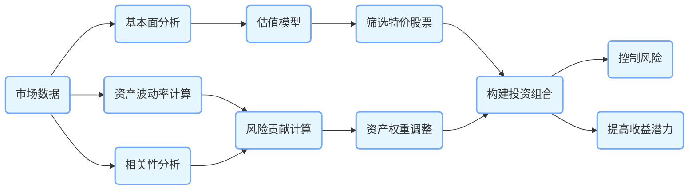

# 如何将特价股票策略应用于风险平价投资

> 关键词：特价股票策略、风险平价投资、资产配置、投资组合、风险控制、收益优化、量化投资

> 摘要：本文聚焦于如何将特价股票策略应用于风险平价投资。首先介绍了研究的背景，包括目的、预期读者、文档结构等内容。接着阐述了特价股票策略和风险平价投资的核心概念及其联系，给出了原理和架构的文本示意图与 Mermaid 流程图。详细讲解了核心算法原理和具体操作步骤，并使用 Python 源代码进行了阐述。同时介绍了相关的数学模型和公式，并举例说明。通过项目实战，展示了代码实际案例并进行详细解释。分析了该策略在不同场景下的实际应用。推荐了学习该策略和进行相关开发的工具和资源。最后总结了未来发展趋势与挑战，解答了常见问题并提供了扩展阅读和参考资料，旨在为投资者提供全面且深入的指导，帮助其更好地将特价股票策略融入风险平价投资中，实现投资组合的优化和风险控制。

## 1. 背景介绍 
### 1.1 目的和范围
在当今复杂多变的金融市场中，投资者面临着众多的投资选择和风险挑战。风险平价投资作为一种均衡风险的投资策略，旨在通过合理配置资产，使不同资产对投资组合的风险贡献相等，从而降低投资组合的整体风险。而特价股票策略则侧重于挖掘市场中被低估的股票，以获取超额收益。本研究的目的在于探讨如何将特价股票策略有效地应用于风险平价投资中，在控制风险的前提下，提高投资组合的收益。

本研究的范围涵盖了特价股票策略和风险平价投资的基本概念、核心算法原理、数学模型、实际应用场景等方面。通过理论分析和项目实战，深入探讨两者结合的可行性和有效性，为投资者提供具体的操作方法和决策依据。

### 1.2 预期读者
本文预期读者包括对金融投资领域感兴趣的个人投资者、专业的投资机构从业者、金融分析师、量化投资研究人员以及相关专业的学生等。无论是希望优化个人投资组合的普通投资者，还是寻求创新投资策略的专业人士，都能从本文中获取有价值的信息和启示。

### 1.3 文档结构概述
本文共分为十个部分。第一部分为背景介绍，阐述了研究的目的、预期读者和文档结构。第二部分介绍特价股票策略和风险平价投资的核心概念及其联系，并给出相应的文本示意图和 Mermaid 流程图。第三部分详细讲解核心算法原理和具体操作步骤，使用 Python 源代码进行说明。第四部分介绍相关的数学模型和公式，并举例说明。第五部分通过项目实战，展示代码实际案例并进行详细解释。第六部分分析该策略在不同场景下的实际应用。第七部分推荐学习该策略和进行相关开发的工具和资源。第八部分总结未来发展趋势与挑战。第九部分解答常见问题。第十部分提供扩展阅读和参考资料。

### 1.4 术语表
#### 1.4.1 核心术语定义
- **特价股票策略**：一种投资策略，通过对股票的基本面分析、估值模型等方法，寻找市场中被低估的股票，认为这些股票在未来有较大的上涨空间，从而获取超额收益。
- **风险平价投资**：一种资产配置策略，旨在通过调整不同资产的权重，使各资产对投资组合的风险贡献相等，以实现投资组合风险的均衡分布，降低整体风险。
- **投资组合**：由多种资产组成的集合，投资者通过合理配置不同资产的比例，以达到风险和收益的平衡。
- **风险贡献**：指某一资产对投资组合整体风险的影响程度，通常用该资产的波动率、与其他资产的相关性等因素来衡量。
- **波动率**：衡量资产价格波动程度的指标，通常用标准差来表示。波动率越大，资产价格的波动越剧烈，风险也就越高。

#### 1.4.2 相关概念解释
- **基本面分析**：通过对公司的财务状况、经营业绩、行业前景等基本因素的分析，评估公司的内在价值，从而判断股票的投资价值。
- **估值模型**：用于估算股票内在价值的数学模型，常见的估值模型包括市盈率模型、市净率模型、现金流折现模型等。
- **资产配置**：根据投资者的风险偏好、投资目标和市场情况，将资金分配到不同的资产类别中，如股票、债券、基金等，以实现投资组合的优化。
- **相关性**：衡量两个资产价格变动之间的关联程度，取值范围在 -1 到 1 之间。相关性为 1 表示两个资产价格变动完全同步，相关性为 -1 表示两个资产价格变动完全相反，相关性为 0 表示两个资产价格变动没有关联。

#### 1.4.3 缩略词列表
- **ETF**：交易型开放式指数基金（Exchange Traded Fund）
- **CAPM**：资本资产定价模型（Capital Asset Pricing Model）
- **VAR**：风险价值（Value at Risk）

## 2. 核心概念与联系 

### 特价股票策略原理
特价股票策略的核心思想是基于价值投资理念，认为市场中存在一些被低估的股票，这些股票的价格低于其内在价值。投资者通过深入的基本面分析和估值模型，挖掘出这些被低估的股票，并在合适的时机买入，等待市场对其价值的重新发现，从而获取超额收益。

基本面分析主要包括对公司的财务报表、行业地位、管理层能力、竞争优势等方面的研究。通过分析公司的盈利能力、偿债能力、运营能力等财务指标，评估公司的经营状况和发展前景。估值模型则是根据公司的未来现金流、盈利预测等因素，估算股票的内在价值。常见的估值方法有市盈率法、市净率法、现金流折现法等。

### 风险平价投资原理
风险平价投资的目标是实现投资组合中各资产的风险贡献均衡。传统的资产配置方法往往基于资产的预期收益率来确定资产权重，而风险平价投资则更关注资产的风险特征。通过调整不同资产的权重，使得每个资产对投资组合的风险贡献相等，从而降低投资组合的整体风险。

风险平价投资通常使用波动率作为风险度量指标。波动率反映了资产价格的波动程度，波动率越大，资产的风险越高。在风险平价投资中，通过计算各资产的波动率和相关性，确定各资产的风险贡献，并根据风险贡献调整资产权重，以实现风险的均衡分布。

### 两者联系
特价股票策略和风险平价投资可以相互补充。特价股票策略注重挖掘被低估的股票，以获取超额收益，但可能面临较高的个股风险。而风险平价投资通过均衡各资产的风险贡献，降低投资组合的整体风险。将特价股票策略应用于风险平价投资中，可以在控制风险的前提下，提高投资组合的收益潜力。

具体来说，可以将筛选出的特价股票纳入风险平价投资组合中，根据风险平价的原则确定其权重。这样既可以利用特价股票的潜在收益，又可以通过风险平价的方法控制其带来的风险。同时，风险平价投资的资产多元化配置也可以降低特价股票策略中个股风险的影响，提高投资组合的稳定性。

### 文本示意图
特价股票策略和风险平价投资的联系可以用以下文本示意图表示：

特价股票策略：基本面分析 -> 估值模型 -> 筛选特价股票 -> 潜在超额收益
风险平价投资：资产波动率计算 -> 相关性分析 -> 风险贡献计算 -> 资产权重调整 -> 风险均衡
两者结合：将特价股票纳入投资组合 -> 根据风险平价原则确定权重 -> 控制风险，提高收益潜力

### Mermaid 流程图


## 3. 核心算法原理 & 具体操作步骤 

### 特价股票筛选算法
特价股票筛选通常基于基本面分析和估值模型。以下是一个简单的特价股票筛选算法示例，使用市盈率（PE）和市净率（PB）作为筛选指标：

```python
import pandas as pd

def screen_bargain_stocks(stocks_data, pe_threshold, pb_threshold):
    """
    筛选特价股票
    :param stocks_data: 股票数据，包含市盈率（PE）和市净率（PB）等信息
    :param pe_threshold: 市盈率阈值
    :param pb_threshold: 市净率阈值
    :return: 筛选出的特价股票数据
    """
    bargain_stocks = stocks_data[(stocks_data['PE'] < pe_threshold) & (stocks_data['PB'] < pb_threshold)]
    return bargain_stocks
```

### 风险平价权重计算算法
风险平价权重计算的核心是使各资产的风险贡献相等。以下是一个简单的风险平价权重计算算法示例，使用波动率作为风险度量指标：

```python
import numpy as np

def risk_parity_weights(returns):
    """
    计算风险平价权重
    :param returns: 资产收益率数据
    :return: 风险平价权重
    """
    cov_matrix = np.cov(returns.T)
    volatilities = np.sqrt(np.diag(cov_matrix))
    num_assets = len(volatilities)
    target_risk = 1 / num_assets  # 目标风险贡献
    weights = np.zeros(num_assets)
    for i in range(num_assets):
        weights[i] = target_risk / volatilities[i]
    weights = weights / np.sum(weights)  # 归一化权重
    return weights
```

### 具体操作步骤
1. **数据收集**：收集股票的基本面数据（如市盈率、市净率等）和历史收益率数据。
2. **特价股票筛选**：使用特价股票筛选算法，根据设定的市盈率和市净率阈值，筛选出被低估的股票。
3. **风险平价权重计算**：将筛选出的特价股票和其他资产（如债券、基金等）的收益率数据输入风险平价权重计算算法，计算各资产的风险平价权重。
4. **构建投资组合**：根据计算得到的风险平价权重，将资金分配到不同的资产中，构建投资组合。
5. **监控和调整**：定期监控投资组合的表现和市场情况，根据需要调整投资组合的权重，以保持风险的均衡和实现收益目标。

## 4. 数学模型和公式 & 详细讲解 & 举例说明 

### 特价股票估值模型
常见的特价股票估值模型之一是现金流折现模型（DCF）。该模型的基本思想是将公司未来的现金流折现到当前时刻，以估算公司的内在价值。

#### 现金流折现模型公式
$$V = \sum_{t=1}^{n} \frac{FCF_t}{(1 + r)^t} + \frac{TV}{(1 + r)^n}$$

其中：
- $V$ 表示公司的内在价值
- $FCF_t$ 表示第 $t$ 期的自由现金流
- $r$ 表示折现率
- $n$ 表示预测期数
- $TV$ 表示终值

#### 详细讲解
自由现金流（FCF）是指公司在满足了所有必要的资本支出后，剩余的可以自由分配给股东和债权人的现金流量。折现率 $r$ 通常采用公司的加权平均资本成本（WACC），反映了投资者对投资该公司所要求的回报率。终值 $TV$ 是指预测期结束后公司的价值，通常采用永续增长模型计算。

#### 举例说明
假设某公司未来 5 年的自由现金流分别为 100 万元、120 万元、140 万元、160 万元和 180 万元，折现率为 10%，预测期结束后公司的自由现金流以 3% 的增长率永续增长。则该公司的内在价值计算如下：

首先计算预测期内的现金流现值：
$$PV_1 = \frac{100}{(1 + 0.1)^1} = 90.91 \text{ 万元}$$
$$PV_2 = \frac{120}{(1 + 0.1)^2} = 99.17 \text{ 万元}$$
$$PV_3 = \frac{140}{(1 + 0.1)^3} = 105.18 \text{ 万元}$$
$$PV_4 = \frac{160}{(1 + 0.1)^4} = 109.28 \text{ 万元}$$
$$PV_5 = \frac{180}{(1 + 0.1)^5} = 111.78 \text{ 万元}$$

预测期内现金流现值总和为：
$$PV_{total} = PV_1 + PV_2 + PV_3 + PV_4 + PV_5 = 516.32 \text{ 万元}$$

然后计算终值：
$$TV = \frac{FCF_5 \times (1 + g)}{r - g} = \frac{180 \times (1 + 0.03)}{0.1 - 0.03} = 2631.43 \text{ 万元}$$

终值的现值为：
$$PV_{TV} = \frac{TV}{(1 + r)^n} = \frac{2631.43}{(1 + 0.1)^5} = 1632.68 \text{ 万元}$$

公司的内在价值为：
$$V = PV_{total} + PV_{TV} = 516.32 + 1632.68 = 2149 \text{ 万元}$$

### 风险平价权重计算模型
风险平价权重计算的核心是使各资产的风险贡献相等。风险贡献通常用资产的边际风险贡献（MRC）来衡量。

#### 边际风险贡献公式
$$MRC_i = \frac{\partial \sigma_p}{\partial w_i}$$

其中：
- $MRC_i$ 表示第 $i$ 种资产的边际风险贡献
- $\sigma_p$ 表示投资组合的波动率
- $w_i$ 表示第 $i$ 种资产的权重

在风险平价投资中，目标是使各资产的风险贡献相等，即：
$$MRC_1 = MRC_2 = \cdots = MRC_n$$

#### 详细讲解
边际风险贡献反映了资产权重的微小变化对投资组合波动率的影响。通过使各资产的边际风险贡献相等，可以实现各资产对投资组合风险的均衡贡献。在实际计算中，通常使用数值方法来求解风险平价权重。

#### 举例说明
假设投资组合由三种资产组成，其收益率的协方差矩阵为：
$$\Sigma = \begin{bmatrix}
0.04 & 0.01 & 0.02 \\
0.01 & 0.09 & 0.03 \\
0.02 & 0.03 & 0.16
\end{bmatrix}$$

初始权重为 $w = [0.3, 0.4, 0.3]$。首先计算投资组合的波动率：
$$\sigma_p = \sqrt{w^T \Sigma w} = \sqrt{[0.3, 0.4, 0.3] \begin{bmatrix}
0.04 & 0.01 & 0.02 \\
0.01 & 0.09 & 0.03 \\
0.02 & 0.03 & 0.16
\end{bmatrix} \begin{bmatrix}
0.3 \\
0.4 \\
0.3
\end{bmatrix}} = 0.22$$

然后计算各资产的边际风险贡献：
$$MRC_1 = \frac{\partial \sigma_p}{\partial w_1} = \frac{1}{2\sigma_p} \times 2 \times (0.04 \times 0.3 + 0.01 \times 0.4 + 0.02 \times 0.3) = 0.02$$
$$MRC_2 = \frac{\partial \sigma_p}{\partial w_2} = \frac{1}{2\sigma_p} \times 2 \times (0.01 \times 0.3 + 0.09 \times 0.4 + 0.03 \times 0.3) = 0.07$$
$$MRC_3 = \frac{\partial \sigma_p}{\partial w_3} = \frac{1}{2\sigma_p} \times 2 \times (0.02 \times 0.3 + 0.03 \times 0.4 + 0.16 \times 0.3) = 0.13$$

由于各资产的边际风险贡献不相等，需要调整权重。通过数值优化方法（如最小化各资产边际风险贡献的差异），可以得到风险平价权重。假设经过优化后得到的风险平价权重为 $w_{rp} = [0.5, 0.3, 0.2]$，此时各资产的边际风险贡献将更加接近相等。

## 5. 项目实战：代码实际案例和详细解释说明 

### 5.1  开发环境搭建
本项目使用 Python 进行开发，需要安装以下必要的库：
- **pandas**：用于数据处理和分析
- **numpy**：用于数值计算
- **matplotlib**：用于数据可视化

可以使用以下命令安装这些库：
```sh
pip install pandas numpy matplotlib
```

### 5.2  源代码详细实现和代码解读
以下是一个完整的项目实战代码示例，展示了如何将特价股票策略应用于风险平价投资：

```python
import pandas as pd
import numpy as np
import matplotlib.pyplot as plt

# 生成示例股票数据
def generate_stock_data(num_stocks, num_periods):
    np.random.seed(42)
    stocks_data = pd.DataFrame()
    stocks_data['PE'] = np.random.uniform(5, 20, num_stocks)
    stocks_data['PB'] = np.random.uniform(1, 5, num_stocks)
    returns = np.random.normal(0.01, 0.05, (num_periods, num_stocks))
    stocks_data['returns'] = [returns[:, i] for i in range(num_stocks)]
    return stocks_data

# 筛选特价股票
def screen_bargain_stocks(stocks_data, pe_threshold, pb_threshold):
    bargain_stocks = stocks_data[(stocks_data['PE'] < pe_threshold) & (stocks_data['PB'] < pb_threshold)]
    return bargain_stocks

# 计算风险平价权重
def risk_parity_weights(returns):
    cov_matrix = np.cov(returns.T)
    volatilities = np.sqrt(np.diag(cov_matrix))
    num_assets = len(volatilities)
    target_risk = 1 / num_assets
    weights = np.zeros(num_assets)
    for i in range(num_assets):
        weights[i] = target_risk / volatilities[i]
    weights = weights / np.sum(weights)
    return weights

# 计算投资组合收益率
def portfolio_returns(returns, weights):
    portfolio_returns = np.dot(returns, weights)
    return portfolio_returns

# 主函数
def main():
    num_stocks = 10
    num_periods = 100
    pe_threshold = 10
    pb_threshold = 2

    # 生成股票数据
    stocks_data = generate_stock_data(num_stocks, num_periods)

    # 筛选特价股票
    bargain_stocks = screen_bargain_stocks(stocks_data, pe_threshold, pb_threshold)

    # 获取特价股票的收益率数据
    bargain_returns = np.array(bargain_stocks['returns'].tolist()).T

    # 计算风险平价权重
    weights = risk_parity_weights(bargain_returns)

    # 计算投资组合收益率
    portfolio_ret = portfolio_returns(bargain_returns, weights)

    # 绘制投资组合收益率曲线
    plt.plot(portfolio_ret)
    plt.xlabel('Period')
    plt.ylabel('Portfolio Returns')
    plt.title('Portfolio Returns of Bargain Stocks with Risk Parity')
    plt.show()

if __name__ == "__main__":
    main()
```

### 5.3  代码解读与分析
1. **数据生成**：`generate_stock_data` 函数用于生成示例股票数据，包括市盈率（PE）、市净率（PB）和历史收益率数据。
2. **特价股票筛选**：`screen_bargain_stocks` 函数根据设定的市盈率和市净率阈值，筛选出被低估的股票。
3. **风险平价权重计算**：`risk_parity_weights` 函数根据资产的收益率数据计算风险平价权重。
4. **投资组合收益率计算**：`portfolio_returns` 函数根据资产的收益率数据和风险平价权重，计算投资组合的收益率。
5. **主函数**：`main` 函数调用上述函数，完成数据生成、特价股票筛选、风险平价权重计算和投资组合收益率计算，并绘制投资组合收益率曲线。

通过这个代码示例，我们可以看到如何将特价股票策略应用于风险平价投资，以及如何使用 Python 实现相关的算法和操作。

## 6. 实际应用场景 
### 个人投资者
对于个人投资者来说，将特价股票策略应用于风险平价投资可以帮助他们优化投资组合，降低风险并提高收益。个人投资者可以根据自己的风险偏好和投资目标，选择适合自己的特价股票和其他资产，构建风险平价投资组合。例如，一个风险偏好较低的个人投资者可以在投资组合中增加债券等低风险资产的比例，同时筛选出一些被低估的蓝筹股作为特价股票，通过风险平价的方法确定各资产的权重，实现投资组合的风险均衡。

### 投资机构
投资机构通常管理着大量的资金，需要在控制风险的前提下实现资产的增值。将特价股票策略应用于风险平价投资可以为投资机构提供一种新的投资思路和方法。投资机构可以利用专业的研究团队和数据分析工具，筛选出更具潜力的特价股票，并结合风险平价投资策略进行资产配置。例如，一些量化投资机构可以通过建立复杂的数学模型和算法，对市场上的股票进行全面的分析和筛选，然后根据风险平价的原则构建投资组合，实现投资组合的优化和风险控制。

### 养老基金和保险公司
养老基金和保险公司等机构投资者对资产的安全性和稳定性要求较高。将特价股票策略应用于风险平价投资可以帮助这些机构在保证资产安全的前提下，获取一定的收益。养老基金和保险公司可以将一部分资金投资于被低估的优质股票，同时通过风险平价的方法调整资产权重，降低投资组合的整体风险。例如，养老基金可以将大部分资金投资于债券等固定收益类资产，同时筛选出一些具有稳定分红和良好基本面的股票作为特价股票，通过风险平价的方法确定股票和债券的权重，实现资产的保值增值。

## 7. 工具和资源推荐
### 7.1 学习资源推荐
#### 7.1.1 书籍推荐
- 《聪明的投资者》（The Intelligent Investor）：本杰明·格雷厄姆（Benjamin Graham）著，价值投资领域的经典著作，介绍了价值投资的基本理念和方法，对特价股票策略有重要的指导意义。
- 《漫步华尔街》（A Random Walk Down Wall Street）：伯顿·马尔基尔（Burton Malkiel）著，介绍了投资的基本原理和方法，包括资产配置、风险控制等内容，对风险平价投资有一定的参考价值。
- 《量化投资：策略与技术》：丁鹏著，详细介绍了量化投资的基本概念、策略和技术，包括特价股票筛选、风险平价权重计算等内容，适合对量化投资感兴趣的读者。

#### 7.1.2 在线课程
- Coursera 上的“Financial Markets”：由耶鲁大学的罗伯特·席勒（Robert Shiller）教授授课，介绍了金融市场的基本原理和投资策略，包括价值投资、资产配置等内容。
- edX 上的“Investment Management with Python and Machine Learning”：介绍了如何使用 Python 和机器学习方法进行投资管理，包括风险平价投资、股票筛选等内容。

#### 7.1.3 技术博客和网站
- 雪球（xueqiu.com）：国内知名的投资社区，提供了丰富的股票分析和投资策略分享，对特价股票策略和风险平价投资有一定的参考价值。
- Seeking Alpha（seekingalpha.com）：国外知名的金融投资网站，提供了大量的股票分析报告和投资策略文章，对投资者有很大的帮助。

### 7.2 开发工具框架推荐
#### 7.2.1 IDE和编辑器
- PyCharm：一款功能强大的 Python 集成开发环境，提供了代码编辑、调试、版本控制等功能，适合专业的 Python 开发者。
- Jupyter Notebook：一种交互式的开发环境，适合进行数据探索和分析，以及快速验证算法和模型。

#### 7.2.2 调试和性能分析工具
- pdb：Python 内置的调试工具，可以帮助开发者定位和解决代码中的问题。
- cProfile：Python 内置的性能分析工具，可以帮助开发者分析代码的性能瓶颈，优化代码效率。

#### 7.2.3 相关框架和库
- pandas：用于数据处理和分析，提供了高效的数据结构和数据分析工具。
- numpy：用于数值计算，提供了高效的数组和矩阵运算功能。
- scikit-learn：用于机器学习和数据分析，提供了丰富的机器学习算法和工具。

### 7.3 相关论文著作推荐
#### 7.3.1 经典论文
- “A Risk Parity Approach to Asset Allocation”：介绍了风险平价投资的基本原理和方法，是风险平价投资领域的经典论文。
- “Value Investing: The Use of Historical Financial Statement Information to Separate Winners from Losers”：介绍了价值投资的基本理念和方法，对特价股票策略有重要的指导意义。

#### 7.3.2 最新研究成果
- 关注顶级金融学术期刊，如 the Journal of Finance、the Review of Financial Studies 等，这些期刊会发表关于投资策略和资产配置的最新研究成果。
- 参加金融学术会议，如 the American Finance Association Annual Meeting、the Western Finance Association Annual Meeting 等，了解最新的学术动态和研究成果。

#### 7.3.3 应用案例分析
- 一些金融机构和研究机构会发布关于投资策略应用案例的研究报告，可以通过查阅这些报告了解特价股票策略和风险平价投资在实际应用中的效果和经验。

## 8. 总结：未来发展趋势与挑战
### 未来发展趋势
- **智能化和自动化**：随着人工智能和机器学习技术的不断发展，未来将有更多的智能化和自动化工具应用于特价股票策略和风险平价投资中。例如，利用深度学习算法对海量的金融数据进行分析和挖掘，更准确地筛选出特价股票；使用自动化交易系统根据风险平价原则实时调整投资组合的权重，提高投资效率和决策的准确性。
- **多元化资产配置**：除了传统的股票、债券等资产外，未来风险平价投资可能会涉及更多元化的资产类别，如大宗商品、房地产、数字货币等。通过将不同类型的资产纳入投资组合，可以进一步降低投资组合的风险，提高收益的稳定性。
- **个性化投资服务**：随着投资者对个性化投资需求的增加，未来将有更多的金融机构和投资顾问提供基于特价股票策略和风险平价投资的个性化投资服务。根据投资者的风险偏好、投资目标、财务状况等因素，为投资者量身定制投资组合，满足不同投资者的需求。

### 挑战
- **数据质量和可靠性**：特价股票策略和风险平价投资都依赖于大量的金融数据，数据的质量和可靠性直接影响到投资决策的准确性。然而，金融数据往往存在噪声、缺失值、错误等问题，如何获取高质量、可靠的数据是一个挑战。
- **模型的有效性和稳定性**：特价股票筛选模型和风险平价权重计算模型都是基于一定的假设和理论构建的，在实际应用中可能会受到市场环境变化、突发事件等因素的影响，导致模型的有效性和稳定性下降。如何提高模型的适应性和鲁棒性是一个需要解决的问题。
- **市场不确定性**：金融市场具有高度的不确定性，股票价格的波动受到多种因素的影响，如宏观经济环境、政策变化、公司业绩等。即使采用了特价股票策略和风险平价投资，也无法完全消除市场风险，如何应对市场不确定性是投资者面临的一个重要挑战。

## 9. 附录：常见问题与解答
### 问题 1：特价股票策略和风险平价投资的适用人群有哪些？
答：特价股票策略和风险平价投资适用于不同类型的投资者，包括个人投资者、投资机构、养老基金和保险公司等。个人投资者可以根据自己的风险偏好和投资目标，选择适合自己的特价股票和其他资产，构建风险平价投资组合；投资机构可以利用专业的研究团队和数据分析工具，筛选出更具潜力的特价股票，并结合风险平价投资策略进行资产配置；养老基金和保险公司等机构投资者可以将一部分资金投资于被低估的优质股票，同时通过风险平价的方法调整资产权重，降低投资组合的整体风险。

### 问题 2：如何筛选出真正的特价股票？
答：筛选特价股票需要综合考虑多个因素，包括公司的基本面、估值水平、行业前景等。常见的方法包括基本面分析和估值模型。基本面分析主要包括对公司的财务报表、行业地位、管理层能力、竞争优势等方面的研究；估值模型则是根据公司的未来现金流、盈利预测等因素，估算股票的内在价值。常见的估值方法有市盈率法、市净率法、现金流折现法等。同时，还需要结合市场情况和行业趋势，对筛选出的股票进行进一步的分析和评估。

### 问题 3：风险平价投资是否能完全消除投资风险？
答：风险平价投资不能完全消除投资风险。虽然风险平价投资通过均衡各资产的风险贡献，降低了投资组合的整体风险，但金融市场具有高度的不确定性，股票价格的波动受到多种因素的影响，如宏观经济环境、政策变化、公司业绩等。即使采用了风险平价投资，也无法完全避免市场风险。风险平价投资只是一种降低风险的方法，投资者仍然需要根据市场情况和自身的风险承受能力，合理调整投资组合。

### 问题 4：如何确定风险平价投资中的资产权重？
答：确定风险平价投资中的资产权重通常需要计算各资产的风险贡献，并根据风险贡献调整资产权重，使各资产的风险贡献相等。常见的方法是使用波动率作为风险度量指标，通过计算各资产的波动率和相关性，确定各资产的风险贡献。在实际计算中，可以使用数值优化方法（如最小化各资产边际风险贡献的差异）来求解风险平价权重。

## 10. 扩展阅读 & 参考资料
### 扩展阅读
- 《金融炼金术》（The Alchemy of Finance）：乔治·索罗斯（George Soros）著，介绍了索罗斯的投资哲学和方法，对投资者有一定的启发。
- 《金融市场与金融机构基础》（Fundamentals of Financial Markets and Institutions）：弗兰克·J·法博齐（Frank J. Fabozzi）著，介绍了金融市场和金融机构的基本原理和运作机制，对理解金融投资有帮助。

### 参考资料
- 相关金融学术期刊，如 the Journal of Finance、the Review of Financial Studies 等。
- 金融数据提供商，如 Bloomberg、Wind 等提供的金融数据和研究报告。
- 投资机构和研究机构发布的关于投资策略和资产配置的研究报告。