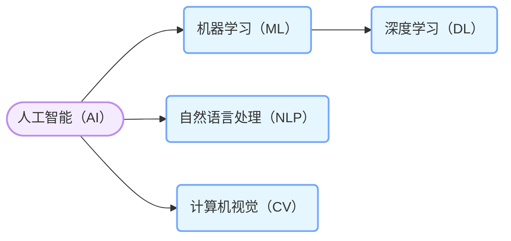

# 如何成为AI领域的顶级人才

> 关键词：AI领域、顶级人才、技术能力、学习方法、实践经验、创新思维、职业发展

> 摘要：本文旨在探讨如何成为AI领域的顶级人才。通过对AI领域的背景介绍，阐述成为顶级人才所需的核心概念、算法原理、数学模型等基础知识，结合项目实战案例展示实际操作能力，分析AI的实际应用场景，推荐相关的学习工具和资源，最后总结未来发展趋势与挑战，解答常见问题并提供扩展阅读和参考资料，为有志于在AI领域取得卓越成就的人士提供全面且深入的指导。

## 1. 背景介绍 
### 1.1 目的和范围
在当今数字化时代，人工智能（AI）已经成为推动科技进步和社会发展的关键力量。AI技术在医疗、金融、交通、娱乐等各个领域都有着广泛的应用，并且其影响力还在不断扩大。本文章的目的在于为那些渴望成为AI领域顶级人才的人提供一个全面的指导框架。我们将涵盖从基础知识的学习到实际项目的实践，再到职业发展和创新能力培养等多个方面，帮助读者了解成为AI领域顶级人才所需的条件和步骤，范围涉及AI领域的核心技术、相关理论以及行业发展趋势等内容。

### 1.2 预期读者
本文预期读者主要包括对AI领域有浓厚兴趣，希望深入学习并在该领域有所建树的学生、工程师、科研人员以及其他想要转行进入AI领域的专业人士。无论您是刚刚接触AI的初学者，还是已经有一定基础的从业者，都能从本文中获取有价值的信息和指导。

### 1.3 文档结构概述
本文将按照以下结构进行组织：首先介绍AI领域的背景知识，包括目的、预期读者和文档结构概述等内容；接着讲解AI领域的核心概念与联系，通过文本示意图和Mermaid流程图进行详细说明；然后阐述核心算法原理和具体操作步骤，使用Python源代码进行讲解；再介绍数学模型和公式，并通过举例进行详细说明；之后通过项目实战案例展示实际操作能力和代码解读；分析AI的实际应用场景；推荐相关的学习工具和资源；总结未来发展趋势与挑战；解答常见问题；最后提供扩展阅读和参考资料。

### 1.4 术语表
#### 1.4.1 核心术语定义
- **人工智能（AI）**：是一门研究如何使计算机能够模拟人类智能的学科和技术领域，包括机器学习、深度学习、自然语言处理、计算机视觉等多个子领域。
- **机器学习（ML）**：是AI的一个重要分支，它让计算机通过数据学习模式和规律，从而进行预测和决策，而无需明确的编程指令。
- **深度学习（DL）**：是机器学习的一个子集，基于人工神经网络，尤其是深度神经网络，能够自动从大量数据中学习复杂的模式和特征。
- **自然语言处理（NLP）**：是AI的一个领域，专注于使计算机能够理解、处理和生成人类语言。
- **计算机视觉（CV）**：是AI的一个方向，致力于让计算机能够理解和处理图像和视频数据。

#### 1.4.2 相关概念解释
- **数据挖掘**：是从大量数据中发现有用信息和模式的过程，与机器学习密切相关，为机器学习提供数据基础。
- **模型训练**：在机器学习和深度学习中，通过将数据输入到模型中，调整模型的参数，使其能够更好地拟合数据，从而提高模型的性能。
- **超参数调优**：超参数是在模型训练之前设置的参数，超参数调优就是通过实验和优化方法找到最优的超参数组合，以提高模型的性能。
- **过拟合和欠拟合**：过拟合是指模型在训练数据上表现很好，但在测试数据上表现不佳；欠拟合则是指模型在训练数据和测试数据上的表现都不好。

#### 1.4.3 缩略词列表
- **AI**：Artificial Intelligence（人工智能）
- **ML**：Machine Learning（机器学习）
- **DL**：Deep Learning（深度学习）
- **NLP**：Natural Language Processing（自然语言处理）
- **CV**：Computer Vision（计算机视觉）

## 2. 核心概念与联系 
在AI领域，有几个核心概念相互关联，构成了整个领域的基础框架。以下是对这些核心概念的详细介绍以及它们之间的联系。

### 核心概念原理
- **人工智能（AI）**：AI的目标是使计算机具备人类智能的某些特征，如学习、推理、感知和决策等。它是一个广泛的领域，涵盖了多个子领域和技术。
- **机器学习（ML）**：ML是AI的重要实现方式之一。它基于数据驱动的方法，通过让计算机从数据中学习模式和规律，从而实现预测和决策。ML的核心是模型，模型可以是线性回归、决策树、支持向量机等。
- **深度学习（DL）**：DL是ML的一个子集，它基于人工神经网络，尤其是深度神经网络。深度神经网络由多个层次的神经元组成，能够自动从大量数据中学习复杂的模式和特征。DL在图像识别、语音识别和自然语言处理等领域取得了巨大的成功。
- **自然语言处理（NLP）**：NLP旨在让计算机能够理解、处理和生成人类语言。它涉及到词法分析、句法分析、语义理解、文本生成等多个任务。NLP的应用包括机器翻译、智能客服、文本分类等。
- **计算机视觉（CV）**：CV致力于让计算机能够理解和处理图像和视频数据。它包括图像分类、目标检测、图像分割、人脸识别等任务。CV的应用广泛，如自动驾驶、安防监控、医学影像分析等。

### 文本示意图
```plaintext
                人工智能（AI）
                /         |         \
           机器学习（ML）  自然语言处理（NLP）  计算机视觉（CV）
              /
        深度学习（DL）
```

### Mermaid流程图


从流程图和示意图中可以看出，人工智能是一个大的范畴，机器学习、自然语言处理和计算机视觉是其重要的子领域。而深度学习又是机器学习的一个重要分支，它们相互关联、相互促进，共同推动AI领域的发展。

## 3. 核心算法原理 & 具体操作步骤 
在AI领域，有许多核心算法，下面我们将以线性回归和神经网络为例，详细讲解其原理和具体操作步骤，并使用Python源代码进行实现。

### 线性回归算法原理
线性回归是一种简单而常用的机器学习算法，用于预测连续数值的输出。其基本原理是通过找到一条最佳的直线（在二维空间中）或超平面（在多维空间中），使得所有数据点到该直线或超平面的距离之和最小。线性回归的数学模型可以表示为：

$$y = \theta_0 + \theta_1x_1 + \theta_2x_2 + \cdots + \theta_nx_n + \epsilon$$

其中，$y$ 是输出变量，$x_1, x_2, \cdots, x_n$ 是输入变量，$\theta_0, \theta_1, \theta_2, \cdots, \theta_n$ 是模型的参数，$\epsilon$ 是误差项。

### 线性回归具体操作步骤
1. **数据准备**：收集和整理数据集，将其分为训练集和测试集。
2. **模型初始化**：随机初始化模型的参数 $\theta_0, \theta_1, \theta_2, \cdots, \theta_n$。
3. **定义损失函数**：通常使用均方误差（MSE）作为损失函数，其公式为：

$$MSE = \frac{1}{m} \sum_{i=1}^{m} (y_i - \hat{y}_i)^2$$

其中，$m$ 是样本数量，$y_i$ 是真实值，$\hat{y}_i$ 是预测值。

4. **参数更新**：使用梯度下降法更新模型的参数，使得损失函数的值不断减小。梯度下降法的更新公式为：

$$\theta_j := \theta_j - \alpha \frac{\partial}{\partial \theta_j} MSE$$

其中，$\alpha$ 是学习率。

5. **模型评估**：使用测试集评估模型的性能，计算均方误差等指标。

### 线性回归Python源代码实现
```python
import numpy as np

class LinearRegression:
    def __init__(self, learning_rate=0.01, num_iterations=1000):
        self.learning_rate = learning_rate
        self.num_iterations = num_iterations
        self.weights = None
        self.bias = None

    def fit(self, X, y):
        num_samples, num_features = X.shape
        self.weights = np.zeros(num_features)
        self.bias = 0

        for _ in range(self.num_iterations):
            y_pred = np.dot(X, self.weights) + self.bias

            dw = (1 / num_samples) * np.dot(X.T, (y_pred - y))
            db = (1 / num_samples) * np.sum(y_pred - y)

            self.weights -= self.learning_rate * dw
            self.bias -= self.learning_rate * db

    def predict(self, X):
        return np.dot(X, self.weights) + self.bias
```

### 神经网络算法原理
神经网络是一种模仿人类神经系统的计算模型，由多个神经元组成。每个神经元接收输入信号，经过加权求和和非线性变换后输出信号。神经网络通常由输入层、隐藏层和输出层组成，隐藏层可以有多个。神经网络的训练过程就是通过调整神经元之间的连接权重，使得网络的输出尽可能接近真实值。

### 神经网络具体操作步骤
1. **数据准备**：同样需要收集和整理数据集，将其分为训练集和测试集。
2. **网络初始化**：随机初始化神经网络的权重和偏置。
3. **前向传播**：将输入数据输入到神经网络中，经过各个层的计算，得到输出结果。
4. **定义损失函数**：常用的损失函数有交叉熵损失、均方误差损失等。
5. **反向传播**：根据损失函数的值，计算每个权重和偏置的梯度。
6. **参数更新**：使用优化算法（如随机梯度下降、Adam等）更新神经网络的权重和偏置。
7. **模型评估**：使用测试集评估神经网络的性能。

### 神经网络Python源代码实现
```python
import numpy as np

class NeuralNetwork:
    def __init__(self, input_size, hidden_size, output_size):
        self.input_size = input_size
        self.hidden_size = hidden_size
        self.output_size = output_size

        self.weights1 = np.random.randn(self.input_size, self.hidden_size)
        self.bias1 = np.zeros((1, self.hidden_size))
        self.weights2 = np.random.randn(self.hidden_size, self.output_size)
        self.bias2 = np.zeros((1, self.output_size))

    def sigmoid(self, x):
        return 1 / (1 + np.exp(-x))

    def sigmoid_derivative(self, x):
        return x * (1 - x)

    def forward(self, X):
        self.z1 = np.dot(X, self.weights1) + self.bias1
        self.a1 = self.sigmoid(self.z1)
        self.z2 = np.dot(self.a1, self.weights2) + self.bias2
        self.a2 = self.sigmoid(self.z2)
        return self.a2

    def backward(self, X, y, output):
        self.error = y - output
        self.delta2 = self.error * self.sigmoid_derivative(output)
        self.d_weights2 = np.dot(self.a1.T, self.delta2)
        self.d_bias2 = np.sum(self.delta2, axis=0, keepdims=True)
        self.delta1 = np.dot(self.delta2, self.weights2.T) * self.sigmoid_derivative(self.a1)
        self.d_weights1 = np.dot(X.T, self.delta1)
        self.d_bias1 = np.sum(self.delta1, axis=0, keepdims=True)

    def update_weights(self, learning_rate):
        self.weights1 += learning_rate * self.d_weights1
        self.bias1 += learning_rate * self.d_bias1
        self.weights2 += learning_rate * self.d_weights2
        self.bias2 += learning_rate * self.d_bias2

    def train(self, X, y, learning_rate, num_iterations):
        for _ in range(num_iterations):
            output = self.forward(X)
            self.backward(X, y, output)
            self.update_weights(learning_rate)
```

## 4. 数学模型和公式 & 详细讲解 & 举例说明 
### 线性回归数学模型和公式
线性回归的数学模型前面已经介绍过，为 $y = \theta_0 + \theta_1x_1 + \theta_2x_2 + \cdots + \theta_nx_n + \epsilon$。损失函数均方误差（MSE）的公式为 $MSE = \frac{1}{m} \sum_{i=1}^{m} (y_i - \hat{y}_i)^2$。梯度下降法的更新公式为 $\theta_j := \theta_j - \alpha \frac{\partial}{\partial \theta_j} MSE$。

详细讲解：线性回归的目标是找到一组最优的参数 $\theta_0, \theta_1, \theta_2, \cdots, \theta_n$，使得损失函数 MSE 的值最小。梯度下降法是一种迭代优化算法，通过不断更新参数的值，朝着损失函数的负梯度方向前进，从而逐渐减小损失函数的值。

举例说明：假设我们有一个简单的二维数据集，$x = [1, 2, 3, 4, 5]$，$y = [2, 4, 6, 8, 10]$。我们可以使用线性回归模型 $y = \theta_0 + \theta_1x$ 来拟合这个数据集。首先，随机初始化 $\theta_0 = 0$，$\theta_1 = 0$。然后，计算损失函数 $MSE$ 的值，并使用梯度下降法更新 $\theta_0$ 和 $\theta_1$ 的值。经过多次迭代后，我们可以得到一组最优的参数，使得 $MSE$ 的值最小。

### 神经网络数学模型和公式
神经网络的前向传播过程可以用以下公式表示：

- 隐藏层：$z_1 = XW_1 + b_1$，$a_1 = \sigma(z_1)$
- 输出层：$z_2 = a_1W_2 + b_2$，$a_2 = \sigma(z_2)$

其中，$X$ 是输入数据，$W_1$ 和 $W_2$ 是权重矩阵，$b_1$ 和 $b_2$ 是偏置向量，$\sigma$ 是激活函数（如 sigmoid 函数）。

反向传播过程的公式如下：

- 输出层误差：$\delta_2 = (y - a_2) \odot \sigma'(z_2)$
- 隐藏层误差：$\delta_1 = \delta_2W_2^T \odot \sigma'(z_1)$
- 权重更新：$\Delta W_2 = a_1^T\delta_2$，$\Delta b_2 = \sum_{i=1}^{m} \delta_2$，$\Delta W_1 = X^T\delta_1$，$\Delta b_1 = \sum_{i=1}^{m} \delta_1$

详细讲解：前向传播过程是将输入数据从输入层传递到输出层，经过加权求和和激活函数的处理，得到输出结果。反向传播过程是根据输出结果和真实值之间的误差，计算每个权重和偏置的梯度，然后使用梯度下降法更新权重和偏置。

举例说明：假设我们有一个简单的神经网络，输入层有 2 个神经元，隐藏层有 3 个神经元，输出层有 1 个神经元。输入数据 $X = [0.1, 0.2]$，真实值 $y = 0.5$。首先，进行前向传播，计算隐藏层和输出层的输出值。然后，根据输出值和真实值之间的误差，进行反向传播，计算每个权重和偏置的梯度。最后，使用梯度下降法更新权重和偏置。经过多次迭代后，神经网络的输出结果会逐渐接近真实值。

## 5. 项目实战：代码实际案例和详细解释说明 
### 5.1  开发环境搭建
在进行AI项目实战之前，需要搭建好开发环境。以下是搭建开发环境的步骤：

1. **安装Python**：Python是AI领域最常用的编程语言，建议安装Python 3.7及以上版本。可以从Python官方网站（https://www.python.org/downloads/）下载并安装。
2. **安装Python包管理工具**：推荐使用pip作为Python包管理工具，它可以方便地安装和管理各种Python库。
3. **安装必要的Python库**：在AI领域，常用的Python库包括NumPy、Pandas、Scikit-learn、TensorFlow、PyTorch等。可以使用pip命令进行安装，例如：
```sh
pip install numpy pandas scikit-learn tensorflow torch
```
4. **选择集成开发环境（IDE）**：可以选择PyCharm、Jupyter Notebook等作为开发环境。PyCharm是一个功能强大的Python IDE，适合开发大型项目；Jupyter Notebook则适合进行交互式开发和数据分析。

### 5.2  源代码详细实现和代码解读
下面我们以一个简单的手写数字识别项目为例，详细介绍代码的实现和解读。

#### 数据准备
```python
import numpy as np
from tensorflow.keras.datasets import mnist
from tensorflow.keras.utils import to_categorical

# 加载MNIST数据集
(train_images, train_labels), (test_images, test_labels) = mnist.load_data()

# 数据预处理
train_images = train_images.reshape((60000, 28 * 28)).astype('float32') / 255
test_images = test_images.reshape((10000, 28 * 28)).astype('float32') / 255

# 标签编码
train_labels = to_categorical(train_labels)
test_labels = to_categorical(test_labels)
```
代码解读：首先，使用 `mnist.load_data()` 函数加载MNIST手写数字数据集，该数据集包含60000个训练样本和10000个测试样本。然后，将图像数据从二维数组（28x28）转换为一维数组（784），并将像素值归一化到0到1之间。最后，使用 `to_categorical()` 函数将标签进行one-hot编码。

#### 模型构建
```python
from tensorflow.keras import models
from tensorflow.keras import layers

# 构建神经网络模型
model = models.Sequential()
model.add(layers.Dense(512, activation='relu', input_shape=(28 * 28,)))
model.add(layers.Dense(10, activation='softmax'))

# 编译模型
model.compile(optimizer='rmsprop',
              loss='categorical_crossentropy',
              metrics=['accuracy'])
```
代码解读：使用 `models.Sequential()` 构建一个顺序模型，该模型由多个层组成。首先添加一个全连接层（Dense），包含512个神经元，激活函数为ReLU。然后添加一个输出层，包含10个神经元，激活函数为softmax，用于输出每个类别的概率。最后，使用 `compile()` 函数编译模型，指定优化器、损失函数和评估指标。

#### 模型训练
```python
# 训练模型
model.fit(train_images, train_labels, epochs=5, batch_size=128)
```
代码解读：使用 `fit()` 函数训练模型，指定训练数据、训练轮数（epochs）和批次大小（batch_size）。训练过程中，模型会不断调整权重和偏置，使得损失函数的值不断减小。

#### 模型评估
```python
# 评估模型
test_loss, test_acc = model.evaluate(test_images, test_labels)
print(f"Test accuracy: {test_acc}")
```
代码解读：使用 `evaluate()` 函数评估模型在测试集上的性能，返回损失值和准确率。

### 5.3  代码解读与分析
通过上述代码，我们实现了一个简单的手写数字识别模型。在数据准备阶段，我们对图像数据进行了预处理和标签编码，这是为了提高模型的训练效果。在模型构建阶段，我们使用了全连接层和softmax激活函数，这是因为手写数字识别是一个多分类问题。在模型训练阶段，我们使用了 `fit()` 函数进行训练，通过不断调整权重和偏置，使得模型的性能不断提高。在模型评估阶段，我们使用了 `evaluate()` 函数评估模型在测试集上的性能，得到了模型的准确率。

需要注意的是，这只是一个简单的示例，实际的AI项目可能会更加复杂，需要更多的技术和方法来提高模型的性能。

## 6. 实际应用场景 
AI技术在各个领域都有着广泛的应用，以下是一些常见的实际应用场景：

### 医疗领域
- **疾病诊断**：AI可以通过分析医学影像（如X光、CT、MRI等）和病历数据，辅助医生进行疾病诊断。例如，深度学习模型可以检测出肺部的肿瘤、心脏疾病等。
- **药物研发**：AI可以加速药物研发的过程，通过分析大量的生物数据和化学数据，预测药物的疗效和副作用，帮助研发人员筛选出更有潜力的药物。
- **健康管理**：AI可以通过智能穿戴设备收集用户的健康数据（如心率、血压、睡眠等），为用户提供个性化的健康建议和预警。

### 金融领域
- **风险评估**：AI可以通过分析客户的信用数据、交易记录等，评估客户的信用风险和违约概率，帮助金融机构做出更明智的决策。
- **投资决策**：AI可以通过分析市场数据、新闻资讯等，预测股票、基金等金融产品的走势，为投资者提供投资建议。
- **客户服务**：AI可以通过智能客服系统，自动回答客户的问题，处理客户的投诉和建议，提高客户服务的效率和质量。

### 交通领域
- **自动驾驶**：AI是自动驾驶技术的核心，通过传感器、摄像头等设备收集车辆周围的环境信息，使用机器学习和深度学习算法进行分析和决策，实现车辆的自动驾驶。
- **交通流量预测**：AI可以通过分析交通数据（如车辆流量、车速、拥堵情况等），预测交通流量的变化趋势，帮助交通管理部门进行交通疏导和规划。
- **智能物流**：AI可以通过优化物流路径、调度车辆等，提高物流效率，降低物流成本。

### 娱乐领域
- **内容推荐**：AI可以通过分析用户的历史行为数据（如观看记录、收藏记录等），为用户推荐个性化的电影、音乐、书籍等内容。
- **游戏开发**：AI可以用于游戏中的角色行为控制、智能对手设计等，提高游戏的趣味性和挑战性。
- **虚拟偶像**：AI可以通过语音合成、图像生成等技术，创造出虚拟偶像，为用户带来全新的娱乐体验。

## 7. 工具和资源推荐
### 7.1 学习资源推荐
#### 7.1.1 书籍推荐
- 《深度学习》（Deep Learning）：由Ian Goodfellow、Yoshua Bengio和Aaron Courville三位深度学习领域的先驱所著，是深度学习领域的经典教材。
- 《Python机器学习》（Python Machine Learning）：由Sebastian Raschka所著，详细介绍了使用Python进行机器学习的方法和技术。
- 《人工智能：一种现代的方法》（Artificial Intelligence: A Modern Approach）：由Stuart Russell和Peter Norvig所著，是人工智能领域的权威教材，涵盖了人工智能的各个方面。

#### 7.1.2 在线课程
- Coursera上的《机器学习》（Machine Learning）课程：由Andrew Ng教授主讲，是机器学习领域最受欢迎的在线课程之一。
- edX上的《深度学习》（Deep Learning Specialization）课程：由Yoshua Bengio、Geoffrey Hinton和Yann LeCun等深度学习领域的专家主讲，深入介绍了深度学习的理论和实践。
- 中国大学MOOC上的《人工智能》课程：由国内多所高校的教授联合主讲，系统地介绍了人工智能的基本概念、方法和应用。

#### 7.1.3 技术博客和网站
- Medium：是一个技术博客平台，上面有很多AI领域的专家和从业者分享自己的经验和见解。
- Towards Data Science：是一个专注于数据科学和机器学习的技术博客，提供了很多实用的教程和案例。
- AI开源社区：如GitHub、GitLab等，上面有很多开源的AI项目和代码，可以学习和参考。

### 7.2 开发工具框架推荐
#### 7.2.1 IDE和编辑器
- PyCharm：是一个功能强大的Python IDE，提供了代码编辑、调试、版本控制等功能，适合开发大型的AI项目。
- Jupyter Notebook：是一个交互式的开发环境，支持Python、R等多种编程语言，适合进行数据分析和模型实验。
- Visual Studio Code：是一个轻量级的代码编辑器，支持多种编程语言和插件，具有良好的扩展性和用户体验。

#### 7.2.2 调试和性能分析工具
- TensorBoard：是TensorFlow提供的一个可视化工具，可以帮助用户可视化模型的训练过程、损失函数的变化、模型的结构等。
- PyTorch Profiler：是PyTorch提供的一个性能分析工具，可以帮助用户分析模型的性能瓶颈，优化模型的运行效率。
- cProfile：是Python内置的一个性能分析工具，可以帮助用户分析Python代码的性能，找出性能瓶颈。

#### 7.2.3 相关框架和库
- TensorFlow：是Google开发的一个开源深度学习框架，提供了丰富的API和工具，支持分布式训练和模型部署。
- PyTorch：是Facebook开发的一个开源深度学习框架，具有动态计算图的特点，易于使用和调试。
- Scikit-learn：是一个开源的机器学习库，提供了各种机器学习算法和工具，适合初学者和快速原型开发。

### 7.3 相关论文著作推荐
#### 7.3.1 经典论文
- 《Gradient-based learning applied to document recognition》：由Yann LeCun等人发表，提出了卷积神经网络（CNN）的经典架构LeNet，开创了深度学习在图像识别领域的先河。
- 《ImageNet Classification with Deep Convolutional Neural Networks》：由Alex Krizhevsky等人发表，提出了AlexNet，在ImageNet图像分类竞赛中取得了巨大的成功，推动了深度学习的发展。
- 《Attention Is All You Need》：由Vaswani等人发表，提出了Transformer架构，在自然语言处理领域取得了重大突破。

#### 7.3.2 最新研究成果
- arXiv：是一个预印本平台，上面有很多最新的AI研究成果和论文，可以及时了解AI领域的最新动态。
- NeurIPS、ICML、CVPR等学术会议：是AI领域的顶级学术会议，每年都会有很多优秀的研究成果在会议上发表。

#### 7.3.3 应用案例分析
- 《AI in Healthcare: Opportunities and Challenges》：分析了AI在医疗领域的应用案例和面临的挑战。
- 《AI in Finance: Transforming the Industry》：探讨了AI在金融领域的应用案例和发展趋势。
- 《AI in Transportation: From Autonomous Vehicles to Smart Cities》：介绍了AI在交通领域的应用案例和未来展望。

## 8. 总结：未来发展趋势与挑战
### 未来发展趋势
- **技术融合**：AI将与其他技术（如物联网、大数据、云计算等）深度融合，创造出更多的应用场景和商业价值。例如，物联网设备可以收集大量的数据，AI可以对这些数据进行分析和处理，实现智能决策和控制。
- **行业应用深化**：AI将在更多的行业得到应用和深化，如教育、农业、能源等。例如，在教育领域，AI可以实现个性化学习、智能辅导等；在农业领域，AI可以实现精准农业、病虫害预测等。
- **人工智能芯片发展**：随着AI技术的不断发展，对计算能力的需求也越来越高。人工智能芯片（如GPU、TPU等）将得到快速发展，为AI的发展提供更强大的计算支持。
- **人工智能伦理和法律问题重视**：AI的发展也带来了一些伦理和法律问题，如隐私保护、算法偏见、自动驾驶责任认定等。未来，人们将更加重视这些问题，制定相应的伦理和法律规范。

### 挑战
- **数据质量和安全**：AI的发展离不开大量的数据，但是数据的质量和安全问题也越来越突出。如何保证数据的准确性、完整性和安全性，是AI发展面临的一个重要挑战。
- **算法可解释性**：深度学习等AI算法通常是黑盒模型，难以解释其决策过程和结果。在一些关键领域（如医疗、金融等），算法的可解释性是非常重要的，如何提高算法的可解释性是一个亟待解决的问题。
- **人才短缺**：AI领域的发展需要大量的专业人才，但是目前AI领域的人才短缺问题比较严重。如何培养和吸引更多的AI人才，是AI发展面临的一个重要挑战。
- **社会影响**：AI的发展可能会对社会产生一些影响，如就业结构的变化、贫富差距的扩大等。如何应对这些社会影响，实现AI的可持续发展，是一个需要深入思考的问题。

## 9. 附录：常见问题与解答
### 1. 学习AI需要具备哪些基础知识？
学习AI需要具备一定的数学基础（如线性代数、概率论、微积分等）、编程基础（如Python）和机器学习基础。

### 2. 如何选择适合自己的AI学习路径？
可以根据自己的兴趣和职业规划选择适合自己的学习路径。如果对图像识别感兴趣，可以重点学习计算机视觉相关的知识和技术；如果对自然语言处理感兴趣，可以重点学习NLP相关的知识和技术。

### 3. AI领域有哪些热门的研究方向？
AI领域的热门研究方向包括深度学习、强化学习、生成对抗网络、迁移学习、元学习等。

### 4. 如何提高自己的AI实践能力？
可以通过参加开源项目、参加竞赛、做实际项目等方式提高自己的AI实践能力。

### 5. AI领域的就业前景如何？
AI领域的就业前景非常广阔，包括算法工程师、数据分析师、深度学习工程师、自然语言处理工程师等职位。随着AI技术的不断发展，对AI人才的需求也会越来越大。

## 10. 扩展阅读 & 参考资料
### 扩展阅读
- 《AI未来进行式》：由李开复和王咏刚所著，探讨了AI对未来社会的影响和发展趋势。
- 《生命3.0：人工智能时代的人类进化》：由迈克斯·泰格马克所著，思考了AI与人类的未来关系。

### 参考资料
- [TensorFlow官方文档](https://www.tensorflow.org/)
- [PyTorch官方文档](https://pytorch.org/)
- [Scikit-learn官方文档](https://scikit-learn.org/)
- [Coursera官方网站](https://www.coursera.org/)
- [edX官方网站](https://www.edx.org/)
- [中国大学MOOC官方网站](https://www.icourse163.org/)