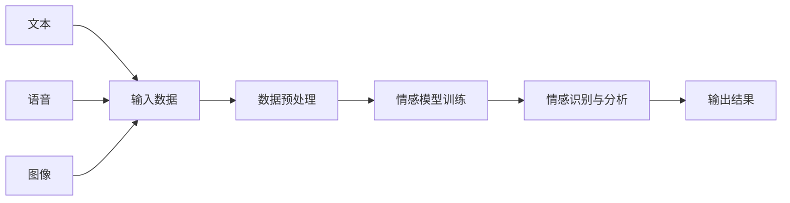

# 如何评估企业的AI驱动的情感计算技术

> 关键词：AI驱动、情感计算技术、技术评估、企业评估、评估指标、应用场景、未来趋势

> 摘要：本文围绕如何评估企业的AI驱动的情感计算技术展开深入探讨。首先介绍了评估的背景信息，包括目的、预期读者等内容。接着阐述了情感计算技术的核心概念与联系，分析其核心算法原理并给出Python代码示例，同时讲解了相关的数学模型和公式。通过项目实战案例，详细说明了开发环境搭建、代码实现与解读。进一步探讨了该技术的实际应用场景，推荐了学习资源、开发工具框架以及相关论文著作。最后总结了未来发展趋势与挑战，还给出了常见问题解答和扩展阅读参考资料，旨在为全面评估企业的AI驱动的情感计算技术提供系统、科学的方法和思路。

## 1. 背景介绍 
### 1.1 目的和范围
随着人工智能技术的飞速发展，情感计算技术作为其中一个重要的分支，在企业的多个领域得到了广泛应用。评估企业的AI驱动的情感计算技术的目的在于准确了解企业在该技术领域的实力和水平，为企业自身的技术改进、投资决策、市场竞争等提供有力依据。本评估涵盖了企业情感计算技术的各个方面，包括技术原理、算法实现、实际应用效果、未来发展潜力等。

### 1.2 预期读者
本文的预期读者主要包括企业的技术决策者、投资者、研究人员以及对AI驱动的情感计算技术感兴趣的相关人士。企业技术决策者可以通过本文了解如何评估自身企业的情感计算技术，以便制定合理的技术发展战略；投资者可以借助评估方法来判断企业在该领域的投资价值；研究人员可以在评估过程中获取灵感，推动技术的进一步发展；而对该技术感兴趣的人士则可以全面了解情感计算技术评估的相关知识。

### 1.3 文档结构概述
本文首先介绍评估的背景信息，让读者对评估的目的、范围和预期读者有清晰的认识。接着详细阐述情感计算技术的核心概念与联系，为后续的评估提供理论基础。然后深入分析核心算法原理和具体操作步骤，并结合数学模型和公式进行详细讲解。通过项目实战案例，展示如何将理论应用到实际中。之后探讨该技术的实际应用场景，为评估其应用价值提供参考。推荐相关的工具和资源，帮助读者进一步学习和研究。最后总结未来发展趋势与挑战，解答常见问题，并提供扩展阅读和参考资料。

### 1.4 术语表
#### 1.4.1 核心术语定义
- **AI驱动的情感计算技术**：指利用人工智能技术，对人类情感进行识别、分析、理解和表达的一系列技术和方法。
- **情感识别**：通过对文本、语音、图像等数据的分析，判断其中所包含的情感倾向，如积极、消极、中性等。
- **情感分析**：在情感识别的基础上，进一步分析情感的强度、类型和产生原因等。
- **情感合成**：根据给定的情感信息，生成具有相应情感表达的文本、语音或图像等。

#### 1.4.2 相关概念解释
- **机器学习**：是人工智能的一个重要分支，通过让计算机从数据中学习模式和规律，从而实现对未知数据的预测和分类。在情感计算中，机器学习算法常用于情感识别和分析。
- **深度学习**：是一种基于神经网络的机器学习方法，具有强大的特征提取和模式识别能力。深度学习模型在情感计算中取得了很好的效果，如卷积神经网络（CNN）和循环神经网络（RNN）。
- **自然语言处理（NLP）**：主要研究如何让计算机理解和处理人类语言。在情感计算中，NLP技术用于对文本数据进行情感分析。

#### 1.4.3 缩略词列表
- **AI**：Artificial Intelligence，人工智能
- **CNN**：Convolutional Neural Network，卷积神经网络
- **RNN**：Recurrent Neural Network，循环神经网络
- **NLP**：Natural Language Processing，自然语言处理

## 2. 核心概念与联系 

### 核心概念原理
AI驱动的情感计算技术主要基于对人类情感表达的多模态数据进行分析和处理。人类的情感可以通过多种方式表达，如语言、面部表情、语音语调等。情感计算技术的核心原理就是通过对这些多模态数据的特征提取和分析，来识别和理解人类的情感状态。

以文本情感分析为例，其基本原理是将文本数据转化为计算机可以处理的数值特征，然后利用机器学习或深度学习模型对这些特征进行分类，判断文本所表达的情感倾向。常用的特征包括词频、词性、情感词典等。

### 架构的文本示意图
以下是一个简单的AI驱动的情感计算技术架构示意图：

输入数据（文本、语音、图像） -> 数据预处理（清洗、特征提取） -> 情感模型训练（机器学习/深度学习） -> 情感识别与分析 -> 输出结果（情感倾向、强度等）

### Mermaid流程图


## 3. 核心算法原理 & 具体操作步骤 

### 核心算法原理
在情感计算中，常用的核心算法包括机器学习算法和深度学习算法。这里以基于Python的朴素贝叶斯算法为例，介绍文本情感分析的核心算法原理。

朴素贝叶斯算法是一种基于贝叶斯定理的简单概率分类器，它假设特征之间相互独立。在文本情感分析中，我们可以将文本中的每个词看作一个特征，通过计算每个词在不同情感类别下的概率，来判断文本的情感倾向。

### 具体操作步骤
#### 步骤1：数据准备
首先，我们需要准备一个包含文本和对应情感标签的数据集。以下是一个简单的示例：
```python
import pandas as pd

# 示例数据集
data = {
    'text': ['这部电影太棒了', '这个产品质量很差', '今天天气真好', '这次旅行很糟糕'],
    'label': ['积极', '消极', '积极', '消极']
}
df = pd.DataFrame(data)
```

#### 步骤2：数据预处理
对文本数据进行预处理，包括分词、去除停用词等操作。这里使用`jieba`库进行中文分词：
```python
import jieba

# 分词函数
def tokenize(text):
    return jieba.lcut(text)

df['tokens'] = df['text'].apply(tokenize)
```

#### 步骤3：特征提取
将分词后的文本转化为特征向量。这里使用词袋模型（Bag of Words）：
```python
from sklearn.feature_extraction.text import CountVectorizer

# 将分词后的文本转化为字符串
df['text_processed'] = df['tokens'].apply(lambda x: ' '.join(x))

# 词袋模型
vectorizer = CountVectorizer()
X = vectorizer.fit_transform(df['text_processed'])
y = df['label']
```

#### 步骤4：模型训练
使用朴素贝叶斯算法进行模型训练：
```python
from sklearn.naive_bayes import MultinomialNB

# 初始化模型
model = MultinomialNB()

# 训练模型
model.fit(X, y)
```

#### 步骤5：模型预测
使用训练好的模型对新的文本进行情感预测：
```python
# 新的文本
new_text = ['这本书很精彩']
new_text_processed = [' '.join(tokenize(new_text[0]))]
new_X = vectorizer.transform(new_text_processed)

# 预测情感
prediction = model.predict(new_X)
print('预测情感：', prediction[0])
```

## 4. 数学模型和公式 & 详细讲解 & 举例说明 

### 数学模型和公式
在朴素贝叶斯算法中，核心的数学模型是贝叶斯定理，其公式如下：

$$P(C|X)=\frac{P(X|C)P(C)}{P(X)}$$

其中，$P(C|X)$ 表示在特征 $X$ 出现的情况下，类别 $C$ 发生的概率；$P(X|C)$ 表示在类别 $C$ 发生的情况下，特征 $X$ 出现的概率；$P(C)$ 表示类别 $C$ 发生的先验概率；$P(X)$ 表示特征 $X$ 出现的概率。

在文本情感分析中，我们需要计算每个情感类别 $C$ 在给定文本特征 $X$ 下的后验概率 $P(C|X)$，并选择后验概率最大的类别作为文本的情感倾向。

### 详细讲解
由于在实际计算中，$P(X)$ 对于所有类别都是相同的，因此可以忽略不计。我们只需要计算 $P(X|C)P(C)$ 的值。

$P(C)$ 可以通过训练数据中每个类别出现的频率来估计。$P(X|C)$ 可以根据朴素贝叶斯的独立性假设，将其分解为每个特征在类别 $C$ 下出现的概率的乘积：

$$P(X|C)=\prod_{i=1}^{n}P(x_i|C)$$

其中，$x_i$ 表示第 $i$ 个特征。

### 举例说明
假设我们有一个包含两个情感类别（积极和消极）的训练数据集，其中积极类别的文本有 100 条，消极类别的文本有 200 条。那么积极类别的先验概率 $P(积极)=\frac{100}{100 + 200}=\frac{1}{3}$，消极类别的先验概率 $P(消极)=\frac{200}{100 + 200}=\frac{2}{3}$。

对于一个新的文本，我们提取了三个特征 $x_1$、$x_2$、$x_3$。在积极类别下，$P(x_1|积极)=0.2$，$P(x_2|积极)=0.3$，$P(x_3|积极)=0.4$；在消极类别下，$P(x_1|消极)=0.1$，$P(x_2|消极)=0.2$，$P(x_3|消极)=0.3$。

则积极类别的后验概率 $P(积极|X)=P(X|积极)P(积极)=0.2\times0.3\times0.4\times\frac{1}{3}=0.008$；消极类别的后验概率 $P(消极|X)=P(X|消极)P(消极)=0.1\times0.2\times0.3\times\frac{2}{3}=0.004$。

由于 $P(积极|X)>P(消极|X)$，因此我们预测该文本的情感倾向为积极。

## 5. 项目实战：代码实际案例和详细解释说明 

### 5.1  开发环境搭建
#### 安装Python
首先，需要安装Python环境。可以从Python官方网站（https://www.python.org/downloads/）下载适合自己操作系统的Python版本，并按照安装向导进行安装。

#### 安装必要的库
在命令行中使用以下命令安装所需的库：
```bash
pip install pandas jieba sklearn
```

### 5.2  源代码详细实现和代码解读
以下是一个完整的文本情感分析项目的源代码：
```python
import pandas as pd
import jieba
from sklearn.feature_extraction.text import CountVectorizer
from sklearn.naive_bayes import MultinomialNB

# 示例数据集
data = {
    'text': ['这部电影太棒了', '这个产品质量很差', '今天天气真好', '这次旅行很糟糕'],
    'label': ['积极', '消极', '积极', '消极']
}
df = pd.DataFrame(data)

# 分词函数
def tokenize(text):
    return jieba.lcut(text)

df['tokens'] = df['text'].apply(tokenize)

# 将分词后的文本转化为字符串
df['text_processed'] = df['tokens'].apply(lambda x: ' '.join(x))

# 词袋模型
vectorizer = CountVectorizer()
X = vectorizer.fit_transform(df['text_processed'])
y = df['label']

# 初始化模型
model = MultinomialNB()

# 训练模型
model.fit(X, y)

# 新的文本
new_text = ['这本书很精彩']
new_text_processed = [' '.join(tokenize(new_text[0]))]
new_X = vectorizer.transform(new_text_processed)

# 预测情感
prediction = model.predict(new_X)
print('预测情感：', prediction[0])
```

### 代码解读与分析
- **数据准备**：使用`pandas`库创建一个包含文本和情感标签的DataFrame。
- **数据预处理**：使用`jieba`库对文本进行分词，并将分词后的结果转化为字符串。
- **特征提取**：使用`CountVectorizer`将文本转化为词袋模型的特征向量。
- **模型训练**：使用`MultinomialNB`初始化朴素贝叶斯模型，并使用训练数据进行训练。
- **模型预测**：对新的文本进行预处理和特征提取，然后使用训练好的模型进行情感预测。

## 6. 实际应用场景 
### 客户服务
企业可以利用情感计算技术分析客户的语音或文本反馈，了解客户的情感状态。例如，当客户在客服电话中表达愤怒或不满时，系统可以及时识别并将问题转接给更高级别的客服人员，以提高客户满意度。

### 市场营销
通过分析社交媒体上的用户评论和反馈，企业可以了解消费者对产品或服务的情感倾向。根据这些信息，企业可以调整营销策略，推出更符合消费者需求的产品和服务。

### 员工管理
情感计算技术可以用于监测员工的情绪状态。例如，通过分析员工的语音或文本沟通记录，了解员工的工作压力和情绪变化。企业可以根据这些信息采取相应的措施，如提供心理辅导、调整工作安排等，以提高员工的工作效率和幸福感。

### 教育领域
在教育领域，情感计算技术可以用于评估学生的学习状态和情绪。例如，通过分析学生的面部表情和语音语调，了解学生在课堂上的注意力和兴趣程度。教师可以根据这些信息调整教学方法和内容，提高教学效果。

## 7. 工具和资源推荐
### 7.1 学习资源推荐
#### 7.1.1 书籍推荐
- 《情感计算》：全面介绍了情感计算的基本概念、理论和方法，是学习情感计算的经典教材。
- 《Python自然语言处理实战》：详细介绍了Python在自然语言处理中的应用，包括文本情感分析等内容。

#### 7.1.2 在线课程
- Coursera上的“Natural Language Processing Specialization”：由顶尖大学的教授授课，系统地介绍了自然语言处理的相关知识和技术。
- edX上的“Artificial Intelligence for Trading”：涉及到人工智能在金融领域的应用，其中也包括情感分析技术。

#### 7.1.3 技术博客和网站
- Medium：上面有很多关于人工智能和情感计算的技术文章和案例分享。
- Towards Data Science：专注于数据科学和机器学习领域的技术博客，有很多关于情感分析的优质文章。

### 7.2 开发工具框架推荐
#### 7.2.1 IDE和编辑器
- PyCharm：是一款专门为Python开发设计的集成开发环境，具有强大的代码编辑、调试和智能提示功能。
- Jupyter Notebook：是一个交互式的开发环境，适合进行数据分析和模型实验。

#### 7.2.2 调试和性能分析工具
- TensorBoard：是TensorFlow的可视化工具，可以用于查看模型的训练过程和性能指标。
- Py-Spy：可以用于分析Python代码的性能瓶颈，找出耗时较长的代码段。

#### 7.2.3 相关框架和库
- NLTK：是Python中最常用的自然语言处理库，提供了丰富的文本处理工具和数据集。
- SpaCy：是一个快速、高效的自然语言处理库，支持多种语言的处理。
- TensorFlow和PyTorch：是深度学习领域的两大主流框架，可用于构建和训练复杂的情感分析模型。

### 7.3 相关论文著作推荐
#### 7.3.1 经典论文
- “A Sentimental Education: Sentiment Analysis Using Subjectivity Summarization Based on Minimum Cuts”：提出了一种基于最小割的主观性摘要方法，用于文本情感分析。
- “Learning Word Vectors for Sentiment Analysis”：介绍了如何使用词向量进行情感分析，为深度学习在情感分析中的应用奠定了基础。

#### 7.3.2 最新研究成果
- 关注顶级学术会议如ACL（Association for Computational Linguistics）、EMNLP（Conference on Empirical Methods in Natural Language Processing）上的相关论文，了解情感计算领域的最新研究进展。

#### 7.3.3 应用案例分析
- 可以参考一些知名企业的技术博客或研究报告，了解他们在情感计算技术应用方面的实践经验和案例分析。

## 8. 总结：未来发展趋势与挑战
### 未来发展趋势
- **多模态融合**：未来的情感计算技术将更加注重多模态数据的融合，结合文本、语音、图像等多种信息，更准确地识别和理解人类的情感。
- **个性化情感分析**：根据用户的个人特征和历史数据，提供个性化的情感分析服务，满足不同用户的需求。
- **与其他技术的融合**：情感计算技术将与物联网、虚拟现实、增强现实等技术深度融合，创造出更加智能、人性化的应用场景。

### 挑战
- **数据质量和标注**：情感计算技术需要大量高质量的标注数据进行训练，但数据标注是一项耗时、耗力的工作，而且标注结果可能存在主观性。
- **情感理解的复杂性**：人类的情感是复杂多变的，受到文化、环境、个人经历等多种因素的影响，如何准确理解和分析这些复杂的情感是一个挑战。
- **隐私和伦理问题**：情感计算技术涉及到对用户情感信息的收集和分析，如何保护用户的隐私和避免伦理问题是需要解决的重要问题。

## 9. 附录：常见问题与解答
### 问题1：情感计算技术的准确率有多高？
情感计算技术的准确率受到多种因素的影响，如数据质量、算法选择、应用场景等。在一些简单的文本情感分析任务中，准确率可以达到80%以上，但在复杂的多模态情感分析任务中，准确率可能会有所下降。

### 问题2：如何提高情感计算技术的性能？
可以从以下几个方面提高情感计算技术的性能：
- 收集更多高质量的标注数据，以提高模型的泛化能力。
- 选择合适的算法和模型，根据不同的应用场景进行优化。
- 进行特征工程，提取更有代表性的特征。
- 采用集成学习等方法，结合多个模型的结果，提高预测的准确性。

### 问题3：情感计算技术在实际应用中有哪些限制？
情感计算技术在实际应用中存在一些限制，如对文化和语言的依赖性较强，不同文化和语言中的情感表达可能存在差异；对复杂情感的识别能力有限，难以准确区分一些微妙的情感变化；以及受到数据噪声和干扰的影响较大等。

## 10. 扩展阅读 & 参考资料
- 《人工智能：现代方法》
- 《机器学习》（周志华）
- https://www.aclweb.org/anthology/
- https://www.tensorflow.org/
- https://pytorch.org/