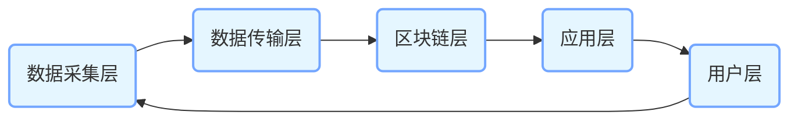

# 如何评估企业的区块链供应链溯源平台

> 关键词：区块链、供应链溯源平台、评估指标、数据安全、智能合约、透明度、信任机制

> 摘要：随着区块链技术的发展，企业的区块链供应链溯源平台越来越受到关注。本文章旨在为读者提供全面、系统的方法来评估企业的区块链供应链溯源平台。通过对背景的介绍，阐述评估的目的和范围等内容；深入解析核心概念与联系，明晰平台的架构与运行逻辑；详细讲解核心算法原理及操作步骤，结合 Python 代码示例说明；介绍数学模型和公式并举例；通过项目实战展示开发环境搭建、代码实现与解读；探讨实际应用场景；推荐相关工具和资源；总结未来发展趋势与挑战；提供常见问题解答及扩展阅读参考资料，帮助读者深入了解并有效评估此类平台。

## 1. 背景介绍 
### 1.1 目的和范围
在当今数字化时代，供应链管理面临着诸多挑战，如信息不透明、数据易篡改、信任缺失等问题。区块链技术的出现为解决这些问题提供了新的思路，区块链供应链溯源平台应运而生。评估企业的区块链供应链溯源平台的目的在于确保平台能够有效实现供应链信息的透明、可信、可追溯，提高供应链的效率和安全性，保护消费者权益，促进企业的可持续发展。本评估的范围涵盖平台的技术架构、功能特性、性能指标、安全机制、业务流程适配性等多个方面。

### 1.2 预期读者
本文预期读者包括企业管理者、供应链从业者、区块链技术爱好者、投资机构人员、监管部门工作人员等。企业管理者可以通过本文了解如何评估企业内部或合作伙伴的区块链供应链溯源平台，以便做出合理的决策；供应链从业者能够掌握评估方法，优化供应链管理流程；区块链技术爱好者可以深入了解区块链在供应链溯源领域的应用及评估要点；投资机构人员可以依据评估标准判断投资项目的可行性；监管部门工作人员可以利用评估方法对相关平台进行监管。

### 1.3 文档结构概述
本文首先介绍评估企业区块链供应链溯源平台的背景信息，包括目的、范围、预期读者和文档结构概述等内容。接着阐述核心概念与联系，包括区块链、供应链溯源的原理和架构，并用文本示意图和 Mermaid 流程图展示。然后讲解核心算法原理和具体操作步骤，通过 Python 代码详细阐述。再介绍数学模型和公式，并举例说明。之后通过项目实战，介绍开发环境搭建、源代码实现与解读。随后探讨实际应用场景。再推荐相关工具和资源，包括学习资源、开发工具框架和相关论文著作。最后总结未来发展趋势与挑战，提供常见问题解答及扩展阅读参考资料。

### 1.4 术语表
#### 1.4.1 核心术语定义
- **区块链**：一种分布式账本技术，通过密码学方法将数据块按时间顺序相连，形成链式数据结构，具有去中心化、不可篡改、可追溯等特点。
- **供应链溯源**：指通过记录和追踪产品在供应链各个环节的信息，实现对产品来源、生产过程、流通情况等的追溯和查询。
- **智能合约**：一种基于区块链的自动化合约，通过代码实现合约条款，当满足预设条件时自动执行。
- **共识机制**：区块链网络中节点达成一致的算法，确保数据的一致性和可靠性。
- **哈希函数**：一种将任意长度的输入转换为固定长度输出的函数，具有单向性和唯一性，常用于数据完整性验证。

#### 1.4.2 相关概念解释
- **去中心化**：指在区块链网络中，没有单一的中心化机构进行管理和控制，各个节点共同参与维护网络。
- **分布式账本**：由多个节点共同维护的账本，每个节点都有完整的账本副本，确保数据的一致性和可靠性。
- **加密算法**：用于对数据进行加密和解密的算法，保护数据的安全性和隐私性。

#### 1.4.3 缩略词列表
- **P2P**：Peer - to - Peer，点对点网络。
- **PoW**：Proof of Work，工作量证明。
- **PoS**：Proof of Stake，权益证明。
- **DAG**：Directed Acyclic Graph，有向无环图。

## 2. 核心概念与联系 

### 核心概念原理
- **区块链原理**：区块链基于分布式账本技术，通过密码学算法将数据块链接成链式结构。每个数据块包含前一个数据块的哈希值、时间戳和交易数据等信息。当新的交易发生时，节点将交易信息打包成新的数据块，并通过共识机制验证和添加到区块链中。由于每个数据块都包含前一个数据块的哈希值，一旦某个数据块被篡改，后续的数据块哈希值都会发生变化，从而保证了数据的不可篡改和可追溯性。
- **供应链溯源原理**：供应链溯源通过在产品的生产、加工、运输、销售等各个环节采集相关信息，并将这些信息存储在区块链上。消费者和监管部门可以通过扫描产品上的二维码或其他标识，查询产品的详细溯源信息，了解产品的来源、生产过程、质量检测等情况，从而实现对产品质量和安全的有效监管。

### 架构的文本示意图
一个典型的区块链供应链溯源平台架构主要包括数据采集层、数据传输层、区块链层、应用层和用户层。
- **数据采集层**：负责在供应链各个环节采集产品的相关信息，如原材料信息、生产工艺信息、物流信息等。采集设备可以包括传感器、RFID 标签、二维码扫描器等。
- **数据传输层**：将采集到的数据安全、可靠地传输到区块链网络中。可以采用有线或无线网络技术，如以太网、Wi - Fi、4G/5G 等。
- **区块链层**：是平台的核心，负责存储和管理供应链溯源数据。区块链网络由多个节点组成，通过共识机制保证数据的一致性和可靠性。
- **应用层**：提供各种应用服务，如溯源查询、数据分析、智能合约执行等。
- **用户层**：包括消费者、企业、监管部门等不同类型的用户，通过应用层提供的服务实现对供应链溯源信息的查询和管理。

### Mermaid 流程图


## 3. 核心算法原理 & 具体操作步骤 

### 核心算法原理
#### 哈希算法
哈希算法是区块链中用于保证数据完整性的重要算法。常见的哈希算法有 SHA - 256 等。哈希算法将任意长度的输入数据转换为固定长度的哈希值，具有单向性和唯一性。即使输入数据发生微小的变化，其哈希值也会发生很大的变化。在区块链中，每个数据块的哈希值都包含前一个数据块的哈希值，从而形成链式结构，保证了数据的不可篡改。

#### 共识算法
共识算法是区块链网络中节点达成一致的算法。常见的共识算法有 PoW（工作量证明）、PoS（权益证明）等。PoW 算法要求节点通过计算复杂的数学难题来证明自己的工作量，只有第一个找到正确答案的节点才能将新的数据块添加到区块链中。PoS 算法则根据节点持有的代币数量来决定其获得记账权的概率。

### 具体操作步骤及 Python 代码示例
#### 哈希算法示例
```python
import hashlib

def calculate_hash(data):
    """
    计算数据的 SHA - 256 哈希值
    :param data: 输入的数据
    :return: 哈希值
    """
    data = str(data).encode('utf - 8')
    hash_object = hashlib.sha256(data)
    return hash_object.hexdigest()

# 示例数据
data = "Hello, Blockchain!"
hash_value = calculate_hash(data)
print(f"数据: {data}")
print(f"哈希值: {hash_value}")
```
#### 简单的区块链实现示例
```python
import hashlib
import time

class Block:
    def __init__(self, index, timestamp, data, previous_hash):
        self.index = index
        self.timestamp = timestamp
        self.data = data
        self.previous_hash = previous_hash
        self.hash = self.calculate_hash()

    def calculate_hash(self):
        block_string = f"{self.index}{self.timestamp}{self.data}{self.previous_hash}"
        return hashlib.sha256(block_string.encode('utf - 8')).hexdigest()

class Blockchain:
    def __init__(self):
        self.chain = [self.create_genesis_block()]

    def create_genesis_block(self):
        return Block(0, time.time(), "Genesis Block", "0")

    def get_latest_block(self):
        return self.chain[-1]

    def add_block(self, new_block):
        new_block.previous_hash = self.get_latest_block().hash
        new_block.hash = new_block.calculate_hash()
        self.chain.append(new_block)

# 创建区块链实例
blockchain = Blockchain()

# 添加新的区块
block1 = Block(1, time.time(), "Transaction Data 1", "")
blockchain.add_block(block1)

block2 = Block(2, time.time(), "Transaction Data 2", "")
blockchain.add_block(block2)

# 打印区块链
for block in blockchain.chain:
    print(f"Index: {block.index}")
    print(f"Timestamp: {block.timestamp}")
    print(f"Data: {block.data}")
    print(f"Previous Hash: {block.previous_hash}")
    print(f"Hash: {block.hash}")
    print("-" * 50)
```

## 4. 数学模型和公式 & 详细讲解 & 举例说明 

### 哈希函数的数学原理
哈希函数可以表示为 $H: M \to R$，其中 $M$ 是输入消息的集合，$R$ 是哈希值的集合。哈希函数需要满足以下几个特性：
- **确定性**：对于相同的输入 $m \in M$，哈希函数 $H(m)$ 总是返回相同的输出 $r \in R$。
- **快速计算**：能够在较短的时间内计算出哈希值。
- **单向性**：给定哈希值 $r \in R$，很难找到对应的输入 $m \in M$ 使得 $H(m)=r$。
- **抗碰撞性**：很难找到两个不同的输入 $m_1, m_2 \in M$ 使得 $H(m_1)=H(m_2)$。

例如，对于 SHA - 256 哈希函数，输入可以是任意长度的字符串，输出是固定长度的 256 位（32 字节）哈希值。

### 共识算法的数学模型
以 PoW 算法为例，PoW 算法的目标是找到一个满足特定条件的随机数（nonce）。设区块链网络的难度目标为 $T$，当前区块的哈希值为 $H$，则需要找到一个 nonce 使得 $H(block, nonce)<T$。其中 $block$ 表示当前区块的信息，包括前一个区块的哈希值、时间戳、交易数据等。节点通过不断尝试不同的 nonce 值，直到找到满足条件的 nonce 为止。找到满足条件的 nonce 的节点将获得记账权，并将新的区块添加到区块链中。

### 举例说明
假设当前区块的信息如下：
- 前一个区块的哈希值：`0x123456789abcdef`
- 时间戳：`1630416000`
- 交易数据：`"Transaction Data"`

难度目标 $T = 0x0000000000000000000000000000000000000000000000000000000000000010$

节点通过不断尝试不同的 nonce 值，计算哈希值 $H(block, nonce)$。当找到一个 nonce 值使得 $H(block, nonce)<T$ 时，节点将获得记账权。

## 5. 项目实战：代码实际案例和详细解释说明 

### 5.1  开发环境搭建
#### 安装 Python
首先需要安装 Python 开发环境。可以从 Python 官方网站（https://www.python.org/downloads/）下载适合自己操作系统的 Python 版本，并按照安装向导进行安装。

#### 安装相关库
在本项目中，需要使用 `Flask` 框架来搭建 Web 服务器，使用 `pycryptodome` 库来进行加密操作。可以使用以下命令进行安装：
```sh
pip install Flask pycryptodome
```

#### 安装区块链平台
如果需要使用区块链平台进行开发，可以选择 Hyperledger Fabric、Ethereum 等。以 Hyperledger Fabric 为例，可以参考官方文档（https://hyperledger-fabric.readthedocs.io/en/release - 2.4/）进行安装和配置。

### 5.2  源代码详细实现和代码解读
#### 实现一个简单的区块链 API
```python
from flask import Flask, jsonify, request
import hashlib
import json
from time import time

class Blockchain:
    def __init__(self):
        self.chain = []
        self.current_transactions = []
        # 创建创世区块
        self.new_block(previous_hash='1', proof=100)

    def new_block(self, proof, previous_hash=None):
        """
        创建一个新的区块并添加到区块链中
        :param proof: 工作量证明
        :param previous_hash: 前一个区块的哈希值
        :return: 新的区块
        """
        block = {
            'index': len(self.chain) + 1,
            'timestamp': time(),
            'transactions': self.current_transactions,
            'proof': proof,
            'previous_hash': previous_hash or self.hash(self.chain[-1])
        }
        # 重置当前交易列表
        self.current_transactions = []
        self.chain.append(block)
        return block

    def new_transaction(self, sender, recipient, amount):
        """
        添加一个新的交易到交易列表中
        :param sender: 发送者地址
        :param recipient: 接收者地址
        :param amount: 交易金额
        :return: 下一个待挖掘的区块的索引
        """
        self.current_transactions.append({
            'sender': sender,
            'recipient': recipient,
            'amount': amount
        })
        return self.last_block['index'] + 1

    @staticmethod
    def hash(block):
        """
        计算一个区块的哈希值
        :param block: 区块
        :return: 哈希值
        """
        block_string = json.dumps(block, sort_keys=True).encode()
        return hashlib.sha256(block_string).hexdigest()

    @property
    def last_block(self):
        return self.chain[-1]

# 实例化我们的节点
app = Flask(__name__)

# 实例化区块链
blockchain = Blockchain()

@app.route('/mine', methods=['GET'])
def mine():
    # 我们运行工作量证明算法来获得下一个证明...
    last_block = blockchain.last_block
    last_proof = last_block['proof']
    proof = blockchain.proof_of_work(last_proof)

    # 我们必须收到一个奖励来挖掘一个新的区块
    # 发送者为 "0" 表明这是一个新挖掘出来的币
    blockchain.new_transaction(
        sender="0",
        recipient="miner_address",
        amount=1
    )

    # 锻造新的区块
    previous_hash = blockchain.hash(last_block)
    block = blockchain.new_block(proof, previous_hash)

    response = {
        'message': "New Block Forged",
        'index': block['index'],
        'transactions': block['transactions'],
        'proof': block['proof'],
        'previous_hash': block['previous_hash']
    }
    return jsonify(response), 200

@app.route('/transactions/new', methods=['POST'])
def new_transaction():
    values = request.get_json()

    # 检查必填字段是否在 POST 的数据中
    required = ['sender', 'recipient', 'amount']
    if not all(k in values for k in required):
        return 'Missing values', 400

    # 创建一个新的交易
    index = blockchain.new_transaction(values['sender'], values['recipient'], values['amount'])

    response = {'message': f'Transaction will be added to Block {index}'}
    return jsonify(response), 201

@app.route('/chain', methods=['GET'])
def full_chain():
    response = {
        'chain': blockchain.chain,
        'length': len(blockchain.chain)
    }
    return jsonify(response), 200

if __name__ == '__main__':
    app.run(host='0.0.0.0', port=5000)
```

### 5.3  代码解读与分析
- **Blockchain 类**：定义了区块链的基本结构和操作方法。`__init__` 方法初始化区块链，创建创世区块。`new_block` 方法用于创建新的区块并添加到区块链中。`new_transaction` 方法用于添加新的交易到交易列表中。`hash` 方法用于计算区块的哈希值。`last_block` 属性返回区块链中的最后一个区块。
- **Flask 应用**：使用 Flask 框架搭建了一个简单的 Web 服务器，提供了三个 API 接口：`/mine` 用于挖掘新的区块，`/transactions/new` 用于添加新的交易，`/chain` 用于获取整个区块链的信息。

## 6. 实际应用场景 
### 食品行业
在食品行业，区块链供应链溯源平台可以实现对食品从原材料采购、生产加工、运输存储到销售的全过程追溯。消费者可以通过扫描食品包装上的二维码，查询食品的产地、生产日期、生产工艺、质量检测报告等信息，了解食品的安全和质量情况。企业可以通过溯源平台及时发现和处理食品质量问题，提高供应链的透明度和可信度。

### 药品行业
药品的质量和安全直接关系到人们的生命健康。区块链供应链溯源平台可以对药品的研发、生产、流通、使用等环节进行全程记录和追溯。监管部门可以通过溯源平台实时监控药品的流向和质量情况，及时发现和查处假药、劣药等违法行为。患者可以通过溯源平台查询药品的真伪和来源，保障用药安全。

### 奢侈品行业
奢侈品行业存在着假冒伪劣产品泛滥的问题。区块链供应链溯源平台可以对奢侈品的设计、生产、加工、销售等环节进行记录和追溯，为消费者提供奢侈品的真伪证明和详细信息。消费者可以通过溯源平台验证奢侈品的真实性，提高购买的信心。

### 汽车行业
在汽车行业，区块链供应链溯源平台可以对汽车零部件的生产、采购、装配、销售等环节进行追溯。汽车制造商可以通过溯源平台确保零部件的质量和来源，提高汽车的质量和安全性。消费者可以通过溯源平台查询汽车的零部件信息和维修记录，了解汽车的真实情况。

## 7. 工具和资源推荐
### 7.1 学习资源推荐
#### 7.1.1 书籍推荐
- 《区块链：技术驱动金融》：全面介绍了区块链的技术原理、应用场景和发展趋势，是学习区块链的经典书籍。
- 《区块链实战》：通过实际案例详细介绍了区块链的开发和应用，适合有一定编程基础的读者。
- 《供应链管理》：系统介绍了供应链管理的基本理论和方法，对于理解区块链在供应链溯源中的应用有很大帮助。

#### 7.1.2 在线课程
- Coursera 上的“Blockchain Basics”：由专业的教授授课，系统介绍了区块链的基本概念、技术原理和应用场景。
- edX 上的“Distributed Ledger Technologies (DLT) Fundamentals”：深入讲解了分布式账本技术的原理和应用，包括区块链、哈希图等。
- 中国大学 MOOC 上的“供应链管理”：由国内知名高校的教授授课，介绍了供应链管理的前沿理论和实践经验。

#### 7.1.3 技术博客和网站
- Medium 上的区块链相关博客：有很多区块链领域的专家和开发者分享他们的经验和见解。
- 巴比特（https://www.8btc.com/）：国内知名的区块链资讯平台，提供最新的区块链行业动态、技术文章和项目分析。
- 链闻（https://www.chainnews.com/）：专注于区块链行业的新闻和深度报道，为读者提供全面的区块链信息。

### 7.2 开发工具框架推荐
#### 7.2.1 IDE和编辑器
- PyCharm：一款专业的 Python 集成开发环境，提供代码编辑、调试、版本控制等功能，适合开发区块链相关的 Python 项目。
- Visual Studio Code：一款轻量级的代码编辑器，支持多种编程语言和插件扩展，可用于开发区块链项目。
- Remix：以太坊官方推荐的在线集成开发环境，用于开发和部署以太坊智能合约。

#### 7.2.2 调试和性能分析工具
- Ganache：一个个人以太坊区块链，用于快速搭建本地开发环境，方便调试和测试以太坊智能合约。
- Truffle：一个以太坊开发框架，提供了项目管理、合约编译、部署、测试等功能，提高开发效率。
- Hyperledger Caliper：一个区块链性能测试框架，用于对不同的区块链平台进行性能测试和分析。

#### 7.2.3 相关框架和库
- Web3.py：一个 Python 库，用于与以太坊区块链进行交互，提供了丰富的 API 接口，方便开发以太坊应用。
- Fabric - SDK - Python：Hyperledger Fabric 的 Python 开发工具包，用于开发基于 Hyperledger Fabric 的区块链应用。
- CryptoJS：一个 JavaScript 加密库，用于对数据进行加密和解密操作，可用于区块链应用中的数据安全处理。

### 7.3 相关论文著作推荐
#### 7.3.1 经典论文
- “Bitcoin: A Peer - to - Peer Electronic Cash System”：比特币的白皮书，首次提出了区块链的概念和实现方法。
- “Ethereum: A Next - Generation Smart Contract and Decentralized Application Platform”：以太坊的白皮书，介绍了以太坊的智能合约和去中心化应用平台。
- “Hyperledger Fabric: A Distributed Operating System for Permissioned Blockchains”：Hyperledger Fabric 的技术论文，详细介绍了 Hyperledger Fabric 的架构和实现原理。

#### 7.3.2 最新研究成果
- 关注 IEEE、ACM 等计算机领域的顶级会议和期刊，如 IEEE Transactions on Dependable and Secure Computing、ACM Transactions on Information and System Security 等，获取区块链领域的最新研究成果。
- 参考各大高校和研究机构的学术论文库，如清华大学、麻省理工学院等的论文库，了解区块链在供应链溯源等领域的前沿研究。

#### 7.3.3 应用案例分析
- 分析沃尔玛、IBM 等企业在区块链供应链溯源方面的应用案例，了解实际项目的实施过程、技术选型和业务模式。
- 参考政府部门发布的区块链应用示范项目，如中国国家药品监督管理局的药品追溯体系建设项目，学习如何利用区块链技术实现供应链溯源和监管。

## 8. 总结：未来发展趋势与挑战
### 未来发展趋势
- **技术融合**：区块链技术将与物联网、大数据、人工智能等技术深度融合，进一步拓展供应链溯源的应用场景和功能。例如，通过物联网设备实时采集产品的环境数据，结合大数据分析和人工智能算法，实现对产品质量和安全的预测和预警。
- **跨行业应用**：区块链供应链溯源平台将从食品、药品等特定行业向更多行业拓展，如制造业、能源行业、物流行业等。跨行业的应用将促进供应链的协同发展，提高整个产业链的效率和竞争力。
- **标准化和规范化**：随着区块链技术的发展，相关的标准和规范将逐渐完善。标准化和规范化将有助于不同区块链平台之间的互操作性，促进区块链供应链溯源平台的大规模应用。
- **监管加强**：政府部门将加强对区块链供应链溯源平台的监管，确保平台的安全性和可靠性。监管的加强将有助于建立良好的市场秩序，保护消费者权益。

### 挑战
- **技术性能**：当前区块链技术在性能方面还存在一些问题，如交易处理速度慢、存储成本高、可扩展性差等。这些问题限制了区块链供应链溯源平台的大规模应用。需要不断优化区块链技术，提高其性能和效率。
- **数据隐私和安全**：区块链供应链溯源平台需要处理大量的敏感数据，如企业的商业机密、消费者的个人信息等。如何保障数据的隐私和安全是一个重要的挑战。需要采用先进的加密算法和安全机制，确保数据的安全性和隐私性。
- **法律和监管**：区块链技术的发展带来了一些新的法律和监管问题，如智能合约的法律效力、数据的所有权和使用权等。需要制定相应的法律法规和监管政策，规范区块链供应链溯源平台的发展。
- **用户接受度**：区块链技术相对较新，很多用户对其了解和认识不足。如何提高用户对区块链供应链溯源平台的接受度和信任度是一个挑战。需要加强宣传和推广，提高用户的认知水平。

## 9. 附录：常见问题与解答
### 1. 区块链供应链溯源平台的成本高吗？
区块链供应链溯源平台的成本包括技术开发成本、硬件设备成本、维护成本等。具体成本因平台的规模、功能和技术选型而异。一般来说，初期的开发和部署成本相对较高，但随着技术的发展和应用的普及，成本会逐渐降低。同时，区块链供应链溯源平台可以带来很多潜在的收益，如提高供应链效率、增强消费者信任、降低质量风险等，从长期来看，投资回报率是比较高的。

### 2. 区块链供应链溯源平台的数据安全如何保障？
区块链供应链溯源平台采用了多种技术手段来保障数据安全。首先，区块链的分布式账本技术使得数据存储在多个节点上，即使部分节点出现故障或被攻击，数据也不会丢失。其次，采用加密算法对数据进行加密处理，只有授权的用户才能访问和查看数据。此外，智能合约可以实现对数据访问和操作的自动化控制，确保数据的安全性和合规性。

### 3. 区块链供应链溯源平台如何与现有供应链系统集成？
可以通过 API 接口实现区块链供应链溯源平台与现有供应链系统的集成。现有供应链系统可以通过调用区块链平台的 API 接口，将相关数据上传到区块链上，同时也可以从区块链上获取溯源信息。在集成过程中，需要注意数据格式的兼容性和数据传输的安全性。

### 4. 区块链供应链溯源平台对企业的管理水平有要求吗？
区块链供应链溯源平台对企业的管理水平有一定的要求。企业需要建立完善的数据采集和管理体系，确保数据的准确性和完整性。同时，企业需要加强内部管理，提高员工的信息化水平和安全意识，确保平台的正常运行和数据的安全。

## 10. 扩展阅读 & 参考资料
### 扩展阅读
- 阅读更多关于区块链技术的前沿研究和应用案例，了解区块链在不同领域的发展动态。
- 学习供应链管理的最新理论和方法，深入理解供应链溯源的重要性和意义。
- 关注物联网、大数据、人工智能等相关技术的发展，了解它们与区块链技术的融合应用。

### 参考资料
- 相关区块链技术的官方文档，如 Ethereum 官方文档、Hyperledger Fabric 官方文档等。
- 行业报告和研究机构发布的关于区块链供应链溯源的研究报告，如 Gartner、IDC 等的报告。
- 学术期刊和会议上发表的关于区块链和供应链管理的学术论文。