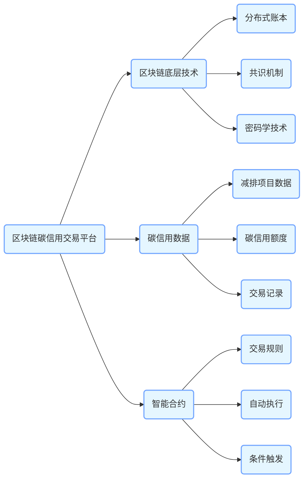

# 如何评估企业的区块链碳信用交易平台

> 关键词：区块链、碳信用交易平台、评估指标、企业应用、可持续发展、智能合约、数据安全

> 摘要：随着全球对可持续发展的关注度不断提升，碳信用交易成为了应对气候变化的重要市场机制。区块链技术凭借其去中心化、不可篡改、透明可追溯等特性，为碳信用交易平台的建设带来了新的机遇和变革。企业纷纷搭建基于区块链的碳信用交易平台，然而如何科学、全面地评估这些平台成为了关键问题。本文围绕如何评估企业的区块链碳信用交易平台展开，深入探讨了相关的背景知识、核心概念、算法原理、数学模型、项目实战、应用场景等内容，并推荐了相关的工具和资源，最后对未来发展趋势与挑战进行了总结，旨在为企业和相关从业者提供全面、系统的评估参考。

## 1. 背景介绍 
### 1.1 目的和范围
本文章的主要目的在于为企业、投资者、监管机构以及其他相关利益方提供一套全面且系统的评估方法，以准确衡量企业的区块链碳信用交易平台的性能、价值和潜力。评估范围涵盖了平台的技术架构、功能特性、业务模式、安全保障、合规性等多个方面，旨在深入剖析平台的优势与不足，为平台的优化升级、投资决策、监管政策制定等提供有力依据。

### 1.2 预期读者
本文的预期读者包括企业的管理人员、技术人员、金融从业者、监管机构工作人员、环保组织成员以及对区块链和碳信用交易感兴趣的研究人员和爱好者。通过阅读本文，不同背景的读者可以获取与自身需求相关的信息，为其在碳信用交易领域的决策和实践提供参考。

### 1.3 文档结构概述
本文将按照以下结构展开：首先介绍背景知识，包括目的、预期读者和文档结构概述等；接着阐述区块链碳信用交易平台的核心概念与联系，通过文本示意图和 Mermaid 流程图进行直观展示；然后详细讲解核心算法原理和具体操作步骤，结合 Python 源代码进行说明；随后介绍相关的数学模型和公式，并举例说明；再通过项目实战，展示代码实际案例并进行详细解释；之后探讨平台的实际应用场景；接着推荐相关的工具和资源；最后总结未来发展趋势与挑战，并提供常见问题与解答以及扩展阅读和参考资料。

### 1.4 术语表
#### 1.4.1 核心术语定义
- **区块链（Blockchain）**：一种分布式账本技术，由多个区块组成，每个区块包含一定时间内的交易数据，并通过密码学技术链接在一起，具有去中心化、不可篡改、透明可追溯等特点。
- **碳信用（Carbon Credit）**：是一种市场机制下的减排凭证，代表一定数量的温室气体减排量。企业或组织通过采取减排措施获得碳信用，并可以在碳市场上进行交易。
- **碳信用交易平台（Carbon Credit Trading Platform）**：为碳信用的买卖双方提供交易场所和服务的平台，实现碳信用的登记、转让、结算等功能。
- **智能合约（Smart Contract）**：一种基于区块链技术的自动化合约，通过代码实现合约条款的自动执行，无需第三方干预。

#### 1.4.2 相关概念解释
- **去中心化（Decentralization）**：区块链的核心特性之一，指系统中不存在单一的中心化控制节点，所有节点共同参与系统的运行和维护，提高了系统的可靠性和抗攻击能力。
- **不可篡改（Immutability）**：区块链中的数据一旦被记录，就无法被轻易修改或删除，保证了数据的真实性和完整性。
- **透明可追溯（Transparency and Traceability）**：区块链上的交易数据对所有参与者公开透明，并且可以通过区块链的链式结构追溯到每一笔交易的源头，增强了交易的可信度。

#### 1.4.3 缩略词列表
- **NFT（Non - Fungible Token）**：非同质化代币，在碳信用交易中可用于表示独特的碳资产。
- **API（Application Programming Interface）**：应用程序编程接口，用于实现不同系统之间的交互和数据共享。
- **SDK（Software Development Kit）**：软件开发工具包，提供了开发应用程序所需的工具和资源。

## 2. 核心概念与联系 
### 2.1 区块链与碳信用交易的结合原理
区块链技术为碳信用交易带来了诸多优势。传统的碳信用交易存在信息不透明、信任成本高、交易效率低等问题。而区块链的去中心化特性可以消除中间机构的垄断，降低交易成本；不可篡改的特性保证了碳信用数据的真实性和完整性；透明可追溯的特性使得交易过程公开透明，增强了参与者的信任。

### 2.2 核心概念架构示意图


### 2.3 核心概念联系解释
区块链底层技术为碳信用交易平台提供了技术支撑。分布式账本用于记录碳信用数据，共识机制保证了节点之间的数据一致性，密码学技术确保了数据的安全性。碳信用数据是交易的基础，包括减排项目数据、碳信用额度和交易记录等。智能合约则是实现交易自动化的关键，通过预设的交易规则，在满足条件时自动执行交易，提高了交易效率和可信度。

## 3. 核心算法原理 & 具体操作步骤 
### 3.1 共识算法原理
在区块链碳信用交易平台中，常用的共识算法有工作量证明（PoW）、权益证明（PoS）等。这里以权益证明（PoS）为例进行讲解。

权益证明（PoS）算法的核心思想是根据节点持有的代币数量和持有时间来确定节点生成新区块的概率。节点持有的代币越多，持有时间越长，其获得记账权的概率就越大。

以下是一个简化的 Python 代码示例，模拟权益证明（PoS）算法的基本过程：
```python
import random

# 定义节点类
class Node:
    def __init__(self, name, stake):
        self.name = name
        self.stake = stake

    def get_stake(self):
        return self.stake

# 定义权益证明算法类
class PoSAlgorithm:
    def __init__(self, nodes):
        self.nodes = nodes

    def select_validator(self):
        total_stake = sum(node.get_stake() for node in self.nodes)
        random_value = random.uniform(0, total_stake)
        accumulated_stake = 0
        for node in self.nodes:
            accumulated_stake += node.get_stake()
            if random_value <= accumulated_stake:
                return node

# 创建节点
node1 = Node("Node1", 100)
node2 = Node("Node2", 200)
node3 = Node("Node3", 300)

# 初始化权益证明算法
nodes = [node1, node2, node3]
pos_algorithm = PoSAlgorithm(nodes)

# 选择验证节点
validator = pos_algorithm.select_validator()
print(f"Selected validator: {validator.name}")
```
### 3.2 具体操作步骤
1. **节点注册**：参与碳信用交易的各方作为节点加入区块链网络，向网络注册自己的身份信息和初始权益。
2. **交易发起**：买卖双方在平台上发起碳信用交易请求，包括交易数量、价格等信息。
3. **交易验证**：网络中的验证节点根据共识算法对交易进行验证，确保交易的合法性和有效性。
4. **智能合约执行**：如果交易验证通过，智能合约根据预设的规则自动执行交易，更新碳信用账户余额。
5. **区块生成**：验证节点将验证通过的交易打包成区块，并添加到区块链上。
6. **数据同步**：区块链网络中的所有节点同步最新的区块数据，确保数据的一致性。

## 4. 数学模型和公式 & 详细讲解 & 举例说明 
### 4.1 碳信用价值评估模型
碳信用的价值受到多种因素的影响，如减排成本、市场需求、政策环境等。一种简单的碳信用价值评估模型可以表示为：

$$V = \alpha \times C + \beta \times D + \gamma \times P$$

其中，$V$ 表示碳信用的价值，$C$ 表示减排成本，$D$ 表示市场需求，$P$ 表示政策因素，$\alpha$、$\beta$、$\gamma$ 分别表示各因素的权重，且 $\alpha + \beta + \gamma = 1$。

### 4.2 详细讲解
- **减排成本（$C$）**：指企业或组织为实现减排目标所付出的成本，包括技术研发、设备购置、运营管理等方面的费用。减排成本越高，碳信用的价值相对越高。
- **市场需求（$D$）**：反映了市场对碳信用的需求程度。当市场需求旺盛时，碳信用的价格会上涨，价值也会相应提高。
- **政策因素（$P$）**：政策对碳信用市场的影响较大。政府的减排目标、补贴政策、税收政策等都会影响碳信用的价值。

### 4.3 举例说明
假设某企业的减排成本为 100 万元，市场需求指数为 0.8，政策因素指数为 0.9，各因素的权重分别为 $\alpha = 0.4$，$\beta = 0.3$，$\gamma = 0.3$。则该企业的碳信用价值为：

$$V = 0.4 \times 100 + 0.3 \times 0.8 + 0.3 \times 0.9 = 40 + 0.24 + 0.27 = 40.51$$（万元）

## 5. 项目实战：代码实际案例和详细解释说明 
### 5.1  开发环境搭建
#### 5.1.1 区块链平台选择
选择 Hyperledger Fabric 作为区块链开发平台，它是一个开源的企业级区块链框架，具有高度可定制性和安全性。

#### 5.1.2 开发语言和工具
使用 Python 作为开发语言，结合 Docker 进行容器化部署，使用 Visual Studio Code 作为代码编辑器。

#### 5.1.3 环境配置步骤
1. 安装 Docker 和 Docker Compose。
2. 下载 Hyperledger Fabric 开发工具包（SDK）。
3. 配置 Python 开发环境，安装必要的依赖库，如 Fabric SDK for Python。

### 5.2  源代码详细实现和代码解读
#### 5.2.1 智能合约实现
以下是一个简单的碳信用交易智能合约的 Python 代码示例：
```python
from hfc.fabric import Client

# 创建客户端实例
cli = Client(net_profile="connection.yaml")

# 定义智能合约操作类
class CarbonCreditContract:
    def __init__(self, channel_name, chaincode_name):
        self.channel_name = channel_name
        self.chaincode_name = chaincode_name

    def create_credit(self, creator, amount):
        response = cli.chaincode_invoke(
            requestor=creator,
            channel_name=self.channel_name,
            chaincode_name=self.chaincode_name,
            fcn='createCredit',
            args=[str(amount)],
            wait_for_event=True
        )
        return response

    def transfer_credit(self, sender, receiver, amount):
        response = cli.chaincode_invoke(
            requestor=sender,
            channel_name=self.channel_name,
            chaincode_name=self.chaincode_name,
            fcn='transferCredit',
            args=[receiver, str(amount)],
            wait_for_event=True
        )
        return response

    def query_credit(self, query_user, owner):
        response = cli.chaincode_query(
            requestor=query_user,
            channel_name=self.channel_name,
            chaincode_name=self.chaincode_name,
            fcn='queryCredit',
            args=[owner]
        )
        return response
```
#### 5.2.2 代码解读
- `create_credit` 方法：用于创建新的碳信用，调用智能合约的 `createCredit` 函数，传入创建者和碳信用数量作为参数。
- `transfer_credit` 方法：用于实现碳信用的转移，调用智能合约的 `transferCredit` 函数，传入发送者、接收者和转移数量作为参数。
- `query_credit` 方法：用于查询指定用户的碳信用余额，调用智能合约的 `queryCredit` 函数，传入查询用户和所有者作为参数。

### 5.3  代码解读与分析
#### 5.3.1 智能合约调用流程
通过 Hyperledger Fabric 的 Python SDK 实现与区块链网络的交互。首先创建客户端实例，然后定义智能合约操作类，通过调用 `chaincode_invoke` 和 `chaincode_query` 方法实现智能合约的调用。

#### 5.3.2 安全性分析
在代码中，通过 `requestor` 参数指定调用智能合约的用户，确保只有授权用户才能进行操作。同时，Hyperledger Fabric 本身提供了多维度的安全机制，如身份认证、访问控制等，保障了碳信用交易的安全性。

#### 5.3.3 性能优化建议
为了提高系统性能，可以采用批量处理、异步调用等方式减少区块链网络的通信开销。同时，合理配置区块链节点的资源，优化共识算法的参数，提高系统的吞吐量。

## 6. 实际应用场景 
### 6.1 企业内部碳管理
企业可以利用区块链碳信用交易平台对内部的碳排放进行管理和控制。通过对各个部门的碳排放进行监测和记录，将减排目标分解到各个部门，并为其分配相应的碳信用额度。部门之间可以通过平台进行碳信用的交易，激励各部门积极采取减排措施，降低企业的整体碳排放。

### 6.2 碳市场交易
在碳市场中，企业、金融机构和投资者可以通过区块链碳信用交易平台进行碳信用的买卖。平台提供了透明、高效的交易环境，降低了交易成本和风险。同时，区块链的不可篡改和可追溯特性保证了碳信用的真实性和合法性，增强了市场的信任。

### 6.3 国际合作减排
在国际层面，不同国家和地区的企业和组织可以通过区块链碳信用交易平台开展合作减排项目。通过平台记录减排项目的实施情况和碳信用的产生、转移过程，确保国际合作的公平性和透明度。同时，区块链技术可以打破地域限制，促进全球碳市场的互联互通。

## 7. 工具和资源推荐
### 7.1 学习资源推荐
#### 7.1.1 书籍推荐
- 《区块链：技术驱动金融》：全面介绍了区块链的技术原理、应用场景和发展趋势，是区块链领域的经典著作。
- 《碳金融：理论与实践》：深入探讨了碳金融的相关理论和实践，包括碳信用交易、碳市场机制等内容。

#### 7.1.2 在线课程
- Coursera 上的“区块链基础”课程：由知名大学教授授课，系统讲解区块链的基础知识和核心技术。
- edX 上的“碳市场与碳金融”课程：介绍碳市场的运行机制和碳金融的创新实践。

#### 7.1.3 技术博客和网站
- 区块链技术博客：如 Medium 上的区块链相关文章，及时分享区块链技术的最新发展和应用案例。
- 碳交易网：提供碳市场的实时行情、政策法规、行业资讯等信息。

### 7.2 开发工具框架推荐
#### 7.2.1 IDE和编辑器
- Visual Studio Code：功能强大的代码编辑器，支持多种编程语言和开发框架，具有丰富的插件生态系统。
- PyCharm：专业的 Python 集成开发环境，提供代码调试、代码分析、自动补全等功能，提高开发效率。

#### 7.2.2 调试和性能分析工具
- Fabric Test Network：Hyperledger Fabric 提供的测试网络，用于开发和调试区块链应用程序。
- Grafana：开源的可视化监控工具，可用于监控区块链节点的性能指标，如 CPU 使用率、内存使用率、网络带宽等。

#### 7.2.3 相关框架和库
- Fabric SDK for Python：Hyperledger Fabric 提供的 Python 开发工具包，方便开发者与区块链网络进行交互。
- Web3.py：以太坊的 Python 开发库，可用于开发基于以太坊的区块链应用程序。

### 7.3 相关论文著作推荐
#### 7.3.1 经典论文
- “Bitcoin: A Peer - to - Peer Electronic Cash System”：比特币的白皮书，阐述了区块链的基本原理和设计思想。
- “The Promise of Blockchain Technology for Sustainable Development”：探讨了区块链技术在可持续发展领域的应用潜力和挑战。

#### 7.3.2 最新研究成果
- 关注顶级学术期刊和会议，如 IEEE Transactions on Blockchain、ACM Conference on Computer and Communications Security 等，获取区块链和碳信用交易领域的最新研究成果。

#### 7.3.3 应用案例分析
- 参考国际知名企业和组织的区块链碳信用交易平台应用案例，如 IBM 的 Food Trust 项目、能源区块链实验室的相关实践等，学习其成功经验和创新模式。

## 8. 总结：未来发展趋势与挑战
### 8.1 未来发展趋势
- **技术创新**：随着区块链技术的不断发展，新的共识算法、智能合约技术、隐私保护技术等将不断涌现，提高区块链碳信用交易平台的性能和安全性。
- **跨界融合**：区块链碳信用交易平台将与物联网、大数据、人工智能等技术深度融合，实现碳数据的实时监测、智能分析和精准决策，推动碳市场的智能化发展。
- **国际合作加强**：在全球应对气候变化的背景下，各国将加强在碳信用交易领域的合作，推动建立统一的国际碳市场，区块链技术将为国际合作提供更加可靠的技术支撑。

### 8.2 挑战
- **技术标准不统一**：目前区块链技术的标准尚未完全统一，不同的区块链平台和碳信用交易平台之间存在兼容性问题，阻碍了区块链碳信用交易平台的推广和应用。
- **法律法规不完善**：区块链碳信用交易涉及到复杂的法律和监管问题，目前相关的法律法规还不完善，需要进一步制定和完善相关政策，规范市场秩序。
- **社会认知度不高**：区块链和碳信用交易对于大多数人来说还比较陌生，社会认知度不高，需要加强宣传和教育，提高公众对区块链碳信用交易的认识和理解。

## 9. 附录：常见问题与解答
### 9.1 区块链碳信用交易平台的安全性如何保障？
区块链碳信用交易平台通过多种技术手段保障安全性，如密码学技术、共识机制、访问控制等。密码学技术用于加密数据，防止数据泄露；共识机制确保数据的一致性和不可篡改；访问控制机制限制只有授权用户才能进行操作。

### 9.2 如何确保碳信用数据的真实性和准确性？
在区块链碳信用交易平台中，碳信用数据的产生和记录都有严格的审核机制。减排项目需要经过专业机构的认证和审核，确保减排量的真实性和准确性。同时，区块链的不可篡改和可追溯特性保证了数据的完整性和可靠性。

### 9.3 区块链碳信用交易平台的成本高吗？
区块链碳信用交易平台的成本包括技术开发成本、运营成本、维护成本等。虽然初期的技术开发成本可能较高，但随着技术的成熟和规模的扩大，成本会逐渐降低。同时，区块链技术可以降低交易成本和信任成本，提高交易效率，从长期来看具有较高的性价比。

## 10. 扩展阅读 & 参考资料
### 10.1 扩展阅读
- 《区块链革命：比特币底层技术如何改变货币、商业和世界》：深入探讨了区块链技术对社会和经济的影响，提供了更广阔的视野和思考角度。
- 《低碳经济：通往可持续发展之路》：介绍了低碳经济的发展模式和实践经验，与区块链碳信用交易平台的发展密切相关。

### 10.2 参考资料
- Hyperledger Fabric 官方文档：https://hyperledger-fabric.readthedocs.io/
- 联合国气候变化框架公约（UNFCCC）官方网站：https://unfccc.int/
- 国际碳行动伙伴组织（ICAP）官方网站：https://icapcarbonaction.com/