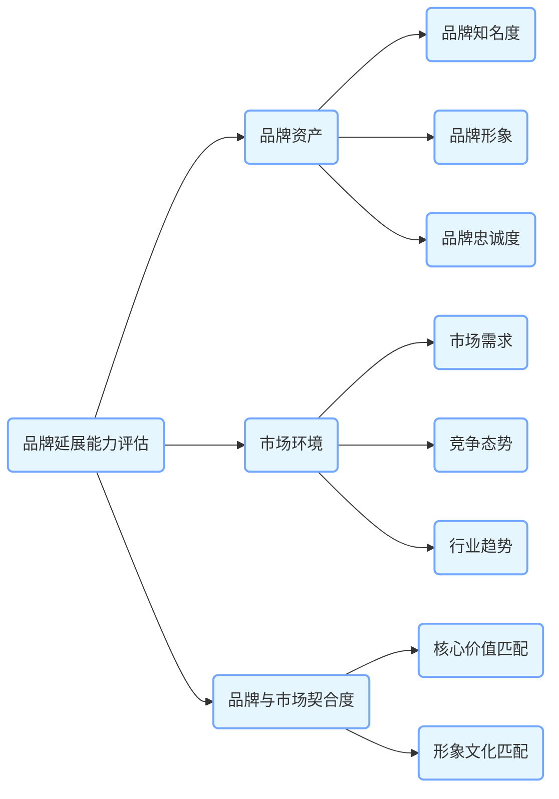

# 如何评估企业的品牌延展能力

> 关键词：企业品牌、品牌延展能力、评估指标、品牌资产、市场环境

> 摘要：本文旨在深入探讨如何评估企业的品牌延展能力。品牌延展是企业利用现有品牌进入新市场或推出新产品的重要战略，评估其延展能力对于企业制定合理的发展规划至关重要。文章首先介绍了评估品牌延展能力的背景，包括目的、预期读者、文档结构和相关术语。接着阐述了核心概念及联系，通过文本示意图和 Mermaid 流程图进行说明。详细讲解了核心算法原理和具体操作步骤，结合 Python 代码进行阐述。分析了相关的数学模型和公式，并举例说明。通过项目实战展示代码案例及详细解释。探讨了品牌延展能力评估在实际中的应用场景。推荐了学习资源、开发工具框架和相关论文著作。最后总结了未来发展趋势与挑战，提供常见问题解答和扩展阅读参考资料。

## 1. 背景介绍 
### 1.1 目的和范围
企业在市场竞争中，常常需要通过品牌延展来扩大市场份额、提升品牌价值。评估企业的品牌延展能力的目的在于帮助企业准确了解自身品牌的优势和局限性，为品牌战略的制定提供科学依据。范围涵盖了从品牌的内部资产到外部市场环境等多个方面，包括品牌形象、消费者认知、市场需求、竞争态势等因素，以全面、系统地评估企业品牌在不同领域和产品上的延展潜力。

### 1.2 预期读者
本文的预期读者主要包括企业的品牌管理者、市场营销人员、战略规划师，以及对品牌管理和市场营销领域感兴趣的学者和研究人员。这些读者希望通过了解品牌延展能力的评估方法，提升企业的品牌管理水平和市场竞争力。

### 1.3 文档结构概述
本文将按照以下结构进行阐述：首先介绍品牌延展能力评估的背景知识，包括目的、读者和文档结构等；接着阐述核心概念及它们之间的联系，通过示意图和流程图进行直观展示；详细讲解核心算法原理和具体操作步骤，并结合 Python 代码实现；分析相关的数学模型和公式，并举例说明其应用；通过项目实战展示代码案例及详细解释；探讨品牌延展能力评估在实际中的应用场景；推荐学习资源、开发工具框架和相关论文著作；最后总结未来发展趋势与挑战，提供常见问题解答和扩展阅读参考资料。

### 1.4 术语表
#### 1.4.1 核心术语定义
- **品牌延展能力**：指企业利用现有品牌的影响力和资源，将品牌应用于新的产品或服务领域，从而实现品牌价值拓展和市场份额扩大的能力。
- **品牌资产**：是品牌所拥有的一系列资产和负债，包括品牌知名度、品牌形象、品牌忠诚度等，它是品牌价值的重要体现。
- **品牌联想**：消费者在看到品牌时所联想到的一系列属性、利益和形象，是品牌形象的重要组成部分。
- **市场契合度**：指品牌与目标市场在需求、文化、消费习惯等方面的匹配程度。

#### 1.4.2 相关概念解释
- **品牌定位**：企业为品牌在市场中确定的独特位置，它决定了品牌的目标受众、产品特点和市场竞争策略。
- **品牌忠诚度**：消费者对品牌的重复购买意愿和行为，是品牌价值的重要体现。
- **品牌声誉**：品牌在市场中所获得的公众评价和口碑，对品牌的市场形象和市场竞争力有着重要影响。

#### 1.4.3 缩略词列表
- **SWOT**：Strengths（优势）、Weaknesses（劣势）、Opportunities（机会）、Threats（威胁）的缩写，是一种常用的战略分析工具。
- **ROI**：Return on Investment（投资回报率）的缩写，用于衡量投资的收益情况。

## 2. 核心概念与联系 
品牌延展能力的评估涉及多个核心概念，这些概念相互关联，共同影响着品牌的延展潜力。以下是核心概念的原理和架构的文本示意图：

品牌延展能力评估主要围绕品牌资产、市场环境和品牌与市场的契合度展开。品牌资产包括品牌知名度、品牌形象、品牌忠诚度等要素，它是品牌延展的基础。市场环境包括市场需求、竞争态势、行业趋势等因素，它为品牌延展提供了机会和挑战。品牌与市场的契合度则是指品牌的核心价值和形象与目标市场的需求和文化的匹配程度，它决定了品牌在新市场中的接受度和竞争力。

下面是用 Mermaid 绘制的流程图：


从流程图可以看出，品牌资产、市场环境和品牌与市场的契合度是评估品牌延展能力的三个关键因素。品牌资产中的各个要素相互影响，共同构成了品牌的整体价值。市场环境中的市场需求、竞争态势和行业趋势也相互关联，影响着品牌延展的机会和风险。品牌与市场的契合度则需要综合考虑品牌的核心价值和形象与目标市场的需求和文化的匹配程度。

## 3. 核心算法原理 & 具体操作步骤 
### 核心算法原理
评估企业的品牌延展能力可以采用综合评价法，将品牌资产、市场环境和品牌与市场的契合度等多个因素进行量化评估，然后根据各因素的权重计算出品牌延展能力的综合得分。具体步骤如下：
1. **确定评估指标体系**：根据品牌延展能力的影响因素，确定具体的评估指标，如品牌知名度、品牌形象、市场需求、竞争态势等。
2. **收集数据**：通过市场调研、问卷调查、数据分析等方式，收集各评估指标的数据。
3. **确定指标权重**：采用层次分析法（AHP）等方法，确定各评估指标的权重。
4. **量化评估指标**：将各评估指标的数据进行量化处理，如将品牌知名度分为高、中、低三个等级，并赋予相应的分值。
5. **计算综合得分**：根据各评估指标的分值和权重，计算品牌延展能力的综合得分。

### 具体操作步骤及 Python 代码实现
以下是一个简单的 Python 代码示例，用于演示如何计算品牌延展能力的综合得分：

```python
# 定义评估指标及其权重
indicators = {
    "品牌知名度": 0.2,
    "品牌形象": 0.2,
    "品牌忠诚度": 0.2,
    "市场需求": 0.15,
    "竞争态势": 0.15,
    "核心价值匹配": 0.05,
    "形象文化匹配": 0.05
}

# 收集各评估指标的得分
scores = {
    "品牌知名度": 80,
    "品牌形象": 75,
    "品牌忠诚度": 85,
    "市场需求": 70,
    "竞争态势": 60,
    "核心价值匹配": 75,
    "形象文化匹配": 80
}

# 计算综合得分
total_score = 0
for indicator, weight in indicators.items():
    score = scores[indicator]
    total_score += score * weight

print(f"品牌延展能力综合得分: {total_score}")
```

在上述代码中，首先定义了评估指标及其权重，然后收集了各评估指标的得分。最后，通过遍历评估指标，根据权重计算出品牌延展能力的综合得分。

## 4. 数学模型和公式 & 详细讲解 & 举例说明 
### 数学模型和公式
品牌延展能力的综合得分可以用以下公式表示：

$$S = \sum_{i=1}^{n} w_i \times s_i$$

其中，$S$ 表示品牌延展能力的综合得分，$w_i$ 表示第 $i$ 个评估指标的权重，$s_i$ 表示第 $i$ 个评估指标的得分，$n$ 表示评估指标的数量。

### 详细讲解
这个公式的原理是将各评估指标的得分按照其权重进行加权求和，得到品牌延展能力的综合得分。权重的确定反映了各评估指标在品牌延展能力评估中的重要程度。得分的量化可以根据具体的评估标准进行，如将品牌知名度分为高、中、低三个等级，并分别赋予 80、60、40 分。

### 举例说明
假设某企业的品牌延展能力评估指标及其权重和得分如下表所示：

| 评估指标 | 权重 | 得分 |
| ---- | ---- | ---- |
| 品牌知名度 | 0.2 | 80 |
| 品牌形象 | 0.2 | 75 |
| 品牌忠诚度 | 0.2 | 85 |
| 市场需求 | 0.15 | 70 |
| 竞争态势 | 0.15 | 60 |
| 核心价值匹配 | 0.05 | 75 |
| 形象文化匹配 | 0.05 | 80 |

根据上述公式，计算该企业的品牌延展能力综合得分：

$$S = 0.2\times80 + 0.2\times75 + 0.2\times85 + 0.15\times70 + 0.15\times60 + 0.05\times75 + 0.05\times80$$
$$S = 16 + 15 + 17 + 10.5 + 9 + 3.75 + 4$$
$$S = 75.25$$

因此，该企业的品牌延展能力综合得分是 75.25 分。

## 5. 项目实战：代码实际案例和详细解释说明 
### 5.1  开发环境搭建
在进行品牌延展能力评估的项目实战时，需要搭建以下开发环境：
- **Python 环境**：建议使用 Python 3.7 及以上版本。可以从 Python 官方网站（https://www.python.org/downloads/）下载并安装。
- **开发工具**：可以使用 PyCharm、VS Code 等集成开发环境（IDE），方便代码的编写、调试和管理。
- **相关库**：需要安装 `pandas`、`numpy` 等库，用于数据处理和分析。可以使用以下命令进行安装：
```sh
pip install pandas numpy
```

### 5.2  源代码详细实现和代码解读
以下是一个更完整的 Python 代码示例，用于实现品牌延展能力的评估：

```python
import pandas as pd
import numpy as np

# 定义评估指标及其权重
indicators = {
    "品牌知名度": 0.2,
    "品牌形象": 0.2,
    "品牌忠诚度": 0.2,
    "市场需求": 0.15,
    "竞争态势": 0.15,
    "核心价值匹配": 0.05,
    "形象文化匹配": 0.05
}

# 收集各评估指标的得分数据，这里假设数据存储在 CSV 文件中
data = pd.read_csv('brand_extension_data.csv')

# 计算每个企业的综合得分
scores = []
for index, row in data.iterrows():
    total_score = 0
    for indicator, weight in indicators.items():
        score = row[indicator]
        total_score += score * weight
    scores.append(total_score)

# 将综合得分添加到数据中
data['综合得分'] = scores

# 对企业按照综合得分进行排序
sorted_data = data.sort_values(by='综合得分', ascending=False)

# 输出排名前 5 的企业
top_5 = sorted_data.head(5)
print(top_5)
```

### 代码解读与分析
1. **导入必要的库**：导入 `pandas` 和 `numpy` 库，用于数据处理和分析。
2. **定义评估指标及其权重**：定义了品牌延展能力评估的各项指标及其权重。
3. **收集数据**：假设各评估指标的得分数据存储在 `brand_extension_data.csv` 文件中，使用 `pandas` 的 `read_csv` 函数读取数据。
4. **计算综合得分**：遍历数据中的每一行，根据评估指标的权重计算每个企业的综合得分，并将得分存储在 `scores` 列表中。
5. **添加综合得分到数据中**：将计算得到的综合得分添加到原始数据中。
6. **排序并输出结果**：对企业按照综合得分进行排序，输出排名前 5 的企业。

通过这个项目实战，我们可以看到如何使用 Python 代码实现品牌延展能力的评估，并对企业进行排名，为企业的品牌战略决策提供参考。

## 6. 实际应用场景 
品牌延展能力的评估在企业的多个实际应用场景中具有重要价值：
### 新产品推出决策
企业在推出新产品时，可以通过评估品牌延展能力，判断现有品牌是否适合应用于新产品。如果品牌延展能力较强，企业可以借助现有品牌的影响力和资源，快速打开新产品的市场。例如，苹果公司凭借其强大的品牌影响力，成功将品牌延展到 iPhone、iPad、Apple Watch 等多个产品领域。

### 新市场进入战略
当企业考虑进入新的市场时，评估品牌延展能力可以帮助企业了解品牌在新市场中的适应能力和竞争优势。如果品牌与新市场的契合度较高，企业可以利用品牌的知名度和美誉度，降低市场进入成本，提高市场成功率。例如，星巴克将其品牌成功延展到全球多个国家和地区，通过提供高品质的咖啡和独特的消费体验，赢得了消费者的喜爱。

### 品牌合作与并购
在品牌合作或并购过程中，评估品牌延展能力可以帮助企业评估合作或并购对象的品牌价值和潜力。如果双方品牌的延展能力互补，合作或并购可以实现品牌资源的整合和优化，提升企业的市场竞争力。例如，雀巢公司通过并购多个知名品牌，实现了品牌的多元化和市场份额的扩大。

### 品牌战略调整
企业可以根据品牌延展能力的评估结果，对品牌战略进行调整。如果品牌延展能力较弱，企业可以考虑加强品牌建设，提升品牌资产，或者调整品牌定位，寻找更适合品牌延展的领域。例如，一些传统企业在面临市场竞争压力时，通过品牌创新和升级，成功实现了品牌的延展和转型。

## 7. 工具和资源推荐
### 7.1 学习资源推荐
#### 7.1.1 书籍推荐
- 《品牌管理》：全面介绍了品牌管理的理论和实践，包括品牌定位、品牌传播、品牌延伸等内容，是品牌管理领域的经典著作。
- 《定位》：阐述了品牌定位的重要性和方法，帮助企业在市场中找到独特的定位，提高品牌的竞争力。
- 《品牌资产的管理》：深入探讨了品牌资产的构成和评估方法，为企业提升品牌价值提供了实用的指导。

#### 7.1.2 在线课程
- Coursera 平台上的“品牌战略与管理”课程：由知名大学的教授授课，系统讲解了品牌战略的制定和实施，以及品牌管理的最新趋势。
- edX 平台上的“市场营销：品牌塑造”课程：从市场营销的角度出发，介绍了品牌塑造的原理和方法，通过案例分析帮助学员掌握品牌管理的实践技能。

#### 7.1.3 技术博客和网站
- 品牌营销网：提供了丰富的品牌营销案例和行业动态，是了解品牌管理最新趋势的重要渠道。
- 艾瑞网：专注于互联网行业的研究和分析，发布了大量关于品牌数字化营销的报告和文章，对企业的品牌延展战略具有重要的参考价值。

### 7.2 开发工具框架推荐
#### 7.2.1 IDE和编辑器
- PyCharm：一款专业的 Python 集成开发环境，具有代码智能提示、调试、版本控制等功能，适合开发品牌延展能力评估的 Python 代码。
- VS Code：一款轻量级的代码编辑器，支持多种编程语言和插件扩展，方便快捷地编写和调试代码。

#### 7.2.2 调试和性能分析工具
- Py-Spy：一款用于 Python 代码性能分析的工具，可以帮助开发者找出代码中的性能瓶颈，优化代码性能。
- PDB：Python 自带的调试器，可以在代码中设置断点，逐步执行代码，帮助开发者定位和解决问题。

#### 7.2.3 相关框架和库
- Pandas：用于数据处理和分析的 Python 库，提供了丰富的数据结构和数据操作方法，方便处理品牌延展能力评估中的数据。
- Numpy：用于科学计算的 Python 库，提供了高效的数组操作和数学函数，在品牌延展能力评估的数学计算中具有重要作用。

### 7.3 相关论文著作推荐
#### 7.3.1 经典论文
- Aaker, D. A., & Keller, K. L. (1990). Consumer evaluations of brand extensions. Journal of Marketing, 54(1), 27-41. 该论文探讨了消费者对品牌延伸的评价机制，为品牌延展能力的研究提供了重要的理论基础。
- Keller, K. L. (1993). Conceptualizing, measuring, and managing customer-based brand equity. Journal of Marketing, 57(1), 1-22. 提出了基于顾客的品牌资产概念和测量方法，对品牌延展能力的评估具有重要的指导意义。

#### 7.3.2 最新研究成果
- 近年来，随着数字化营销和社交媒体的发展，关于品牌延展能力在数字环境下的研究逐渐增多。例如，一些研究探讨了社交媒体对品牌延展的影响，以及如何利用大数据分析评估品牌延展能力。
- 还有研究关注品牌延展能力与可持续发展的关系，探讨如何通过品牌延展推动企业的可持续发展战略。

#### 7.3.3 应用案例分析
- 《哈佛商业评论》上发表的一些品牌管理案例，如苹果、星巴克等企业的品牌延展案例，深入分析了这些企业在品牌延展过程中的策略和经验，为企业的品牌延展实践提供了借鉴。
- 一些咨询公司发布的品牌研究报告，如麦肯锡、贝恩等公司的报告，对不同行业的品牌延展情况进行了分析和总结，具有较高的参考价值。

## 8. 总结：未来发展趋势与挑战
### 未来发展趋势
#### 数字化驱动的品牌延展
随着互联网和数字技术的发展，品牌延展将更加依赖数字化渠道和工具。企业可以通过社交媒体、电子商务平台等数字化手段，快速传播品牌信息，拓展品牌影响力。同时，大数据分析和人工智能技术将为品牌延展能力的评估提供更加精准和全面的支持，帮助企业更好地了解消费者需求和市场趋势。

#### 跨界融合与多元化品牌延展
未来，企业将更加注重跨界融合和多元化品牌延展。通过与不同行业的企业合作，推出跨界产品或服务，实现品牌的多元化发展。例如，时尚品牌与科技企业合作推出智能穿戴设备，餐饮品牌与文创企业合作推出主题餐厅等。这种跨界融合的品牌延展方式可以为消费者带来全新的消费体验，提升品牌的竞争力。

#### 可持续发展导向的品牌延展
消费者对可持续发展的关注度不断提高，未来的品牌延展将更加注重可持续发展理念的融入。企业将通过推出环保、社会责任等方面的产品或服务，实现品牌的可持续发展。例如，一些服装品牌推出可持续面料的服装，食品品牌推出有机食品等。这种可持续发展导向的品牌延展不仅可以满足消费者的需求，还可以提升品牌的社会形象和美誉度。

### 挑战
#### 品牌形象维护与管理
在品牌延展过程中，如何维护和管理品牌形象是一个重要的挑战。如果品牌延展不当，可能会导致品牌形象受损，影响消费者对品牌的信任和忠诚度。因此，企业需要在品牌延展前进行充分的市场调研和分析，确保品牌延展与品牌核心价值和形象相符合。

#### 市场竞争加剧
随着品牌延展的日益普遍，市场竞争将更加激烈。企业需要不断提升品牌的差异化竞争优势，才能在市场中脱颖而出。同时，企业还需要关注竞争对手的品牌延展策略，及时调整自身的品牌战略，以应对市场竞争的挑战。

#### 消费者需求变化快速
消费者需求变化快速，企业需要及时了解消费者的需求和偏好，调整品牌延展策略。如果企业不能及时跟上消费者需求的变化，可能会导致品牌延展失败。因此，企业需要建立完善的市场监测机制，加强与消费者的沟通和互动，及时获取消费者的反馈信息。

## 9. 附录：常见问题与解答
### 问题 1：品牌延展能力评估的结果是否具有绝对准确性？
品牌延展能力评估的结果是基于一定的模型和数据得出的，虽然可以为企业提供参考，但并不具有绝对准确性。评估过程中可能存在数据误差、模型假设不合理等问题，同时市场环境和消费者需求也在不断变化。因此，企业在参考评估结果时，还需要结合自身的实际情况和市场经验进行综合判断。

### 问题 2：如何提高品牌延展能力评估的准确性？
为了提高品牌延展能力评估的准确性，可以从以下几个方面入手：
- 收集更全面、准确的数据：通过多种渠道收集数据，如市场调研、消费者反馈、行业报告等，确保数据的真实性和可靠性。
- 优化评估模型：根据实际情况对评估模型进行调整和优化，考虑更多的影响因素和变量，提高模型的合理性和准确性。
- 定期更新评估结果：由于市场环境和消费者需求不断变化，企业需要定期对品牌延展能力进行评估，及时更新评估结果，为品牌战略决策提供最新的依据。

### 问题 3：品牌延展能力评估是否适用于所有企业？
品牌延展能力评估适用于大多数企业，但不同企业的评估重点和方法可能会有所不同。对于大型企业和知名品牌，评估可以帮助其更好地规划品牌战略，拓展品牌价值；对于小型企业和新兴品牌，评估可以帮助其了解自身品牌的优势和不足，制定合理的品牌发展规划。然而，评估方法需要根据企业的具体情况进行调整和优化，以确保评估结果的有效性和实用性。

## 10. 扩展阅读 & 参考资料
### 扩展阅读
- 《品牌的力量：如何打造世界级品牌》：深入探讨了品牌建设和品牌管理的核心要素，为企业提升品牌价值提供了深入的见解和实用的建议。
- 《营销革命 4.0：从传统营销到数字营销》：介绍了数字营销时代的营销理念和策略，对品牌延展在数字环境下的发展具有重要的启示作用。

### 参考资料
- Aaker, D. A. (1991). Managing brand equity: capitalizing on the value of a brand name. Free Press.
- Keller, K. L. (2008). Strategic brand management: building, measuring, and managing brand equity. Prentice Hall.
- Kotler, P., & Armstrong, G. (2018). Principles of marketing. Pearson.

以上文章通过全面、系统的阐述，为企业评估品牌延展能力提供了详细的方法和指导，同时也探讨了品牌延展能力评估在实际应用中的场景和未来发展趋势与挑战，希望对企业的品牌管理和市场营销工作有所帮助。