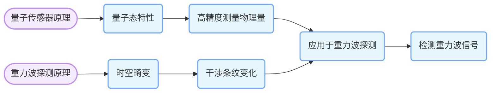

# 如何评估企业的量子传感器重力波探测技术潜力

> 关键词：量子传感器、重力波探测、技术潜力评估、企业评估、量子技术、重力波物理学

> 摘要：本文旨在探讨如何评估企业在量子传感器重力波探测技术方面的潜力。通过对该技术的背景介绍，深入剖析核心概念与联系，详细阐述核心算法原理及操作步骤，引入数学模型和公式并举例说明，结合项目实战案例进行分析，探讨实际应用场景，推荐相关工具和资源，最后总结未来发展趋势与挑战，解答常见问题并提供扩展阅读和参考资料，为全面评估企业在这一前沿领域的技术潜力提供系统且专业的指导。

## 1. 背景介绍 
### 1.1 目的和范围
重力波探测是现代物理学中极具挑战性和前沿性的研究领域，而量子传感器作为一种新兴技术，为重力波探测带来了新的可能性。本评估的目的在于建立一套科学、全面的方法，用于评估企业在量子传感器重力波探测技术方面的潜力。评估范围涵盖企业的技术研发能力、创新实力、资源储备、市场竞争力等多个方面，旨在为投资者、合作伙伴以及企业自身提供准确的决策依据。

### 1.2 预期读者
本文的预期读者包括对量子传感器重力波探测技术感兴趣的投资者、科技行业的分析师、相关企业的管理人员和技术研发人员，以及从事物理学研究的学者等。这些读者希望通过本文了解如何评估企业在该领域的技术潜力，以便做出合理的投资决策、制定合作战略或指导企业的技术研发方向。

### 1.3 文档结构概述
本文将按照以下结构进行阐述：首先介绍核心概念与联系，帮助读者理解量子传感器和重力波探测的基本原理；接着详细讲解核心算法原理和具体操作步骤，并通过Python代码进行示例；然后引入数学模型和公式，进一步解释技术的理论基础；之后通过项目实战案例，展示实际应用中的代码实现和分析；探讨该技术的实际应用场景；推荐相关的工具和资源；最后总结未来发展趋势与挑战，解答常见问题并提供扩展阅读和参考资料。

### 1.4 术语表
#### 1.4.1 核心术语定义
- **量子传感器**：基于量子力学原理工作的传感器，利用量子态的特性（如量子纠缠、量子叠加等）来实现高精度的测量。
- **重力波**：爱因斯坦广义相对论预言的一种时空涟漪，由加速运动的大质量物体产生，以光速传播。
- **重力波探测**：通过各种技术手段检测重力波的存在，并测量其相关参数（如频率、振幅等）。
- **技术潜力**：企业在特定技术领域内未来发展和取得成果的可能性，包括技术创新能力、研发实力、市场竞争力等方面。

#### 1.4.2 相关概念解释
- **量子态**：量子系统的状态，是量子力学描述微观粒子的基本概念。量子态具有叠加性和纠缠性等独特性质。
- **干涉仪**：一种利用光的干涉现象进行测量的仪器，常用于重力波探测中，通过测量干涉条纹的变化来检测重力波引起的时空微小变化。
- **噪声**：在测量过程中引入的干扰信号，会影响测量的精度。量子传感器需要克服各种噪声的影响，以实现高精度的测量。

#### 1.4.3 缩略词列表
- **LIGO**：Laser Interferometer Gravitational - Wave Observatory，激光干涉引力波天文台
- **QKD**：Quantum Key Distribution，量子密钥分发

## 2. 核心概念与联系 

### 2.1 量子传感器原理
量子传感器利用量子态的特性来实现高精度的测量。以基于原子干涉的量子传感器为例，其基本原理是利用原子的物质波干涉现象。原子具有波粒二象性，当原子处于量子态时，其物质波可以发生干涉。通过精确控制原子的量子态和运动轨迹，使原子的物质波产生干涉条纹。外界物理量（如重力、加速度等）的变化会影响原子的运动，从而导致干涉条纹的移动。通过测量干涉条纹的移动量，就可以精确测量外界物理量的变化。

### 2.2 重力波探测原理
重力波是时空的涟漪，当重力波传播到地球时，会引起时空的微小畸变。目前，最常用的重力波探测方法是激光干涉仪。激光干涉仪由两条相互垂直的长臂组成，激光束在长臂中来回反射。当重力波通过时，两条长臂的长度会发生微小的变化，导致两束激光的光程差发生变化，从而引起干涉条纹的移动。通过测量干涉条纹的移动量，就可以检测到重力波的存在。

### 2.3 量子传感器在重力波探测中的应用
量子传感器可以为重力波探测提供更高的灵敏度和精度。传统的激光干涉仪重力波探测器受到经典噪声的限制，而量子传感器利用量子态的特性可以克服部分经典噪声的影响。例如，基于原子干涉的量子传感器可以对重力的微小变化进行高精度测量，有望检测到更微弱的重力波信号。此外，量子传感器还可以与传统的激光干涉仪相结合，形成混合探测系统，进一步提高重力波探测的性能。

### 2.4 核心概念的文本示意图
```plaintext
              量子传感器
                |
                |  利用量子态特性
                v
 高精度物理量测量（如重力）
                |
                |  应用于
                v
        重力波探测系统
                |
                |  检测
                v
           重力波信号
```

### 2.5 Mermaid 流程图


## 3. 核心算法原理 & 具体操作步骤 

### 3.1 原子干涉量子传感器算法原理
在原子干涉量子传感器中，核心算法是对原子干涉条纹的处理和分析。原子干涉条纹的强度分布可以用以下公式描述：

$$I(\phi) = I_0(1 + \cos(\phi))$$

其中，$I(\phi)$ 是干涉条纹的强度，$I_0$ 是最大强度，$\phi$ 是干涉相位。外界物理量（如重力）的变化会导致干涉相位 $\phi$ 的变化。通过测量干涉条纹的强度变化，就可以反推出干涉相位的变化，进而得到外界物理量的变化。

### 3.2 具体操作步骤
#### 3.2.1 原子制备
首先，需要将原子冷却到极低的温度，使其处于量子态。常用的方法是激光冷却和磁光阱技术。通过激光冷却，可以将原子的温度降低到微开尔文甚至纳开尔文量级，使其速度降低到极小值，从而可以更好地控制原子的量子态。

#### 3.2.2 原子干涉过程
在原子处于量子态后，通过一系列的激光脉冲对原子进行操作，使其产生干涉。例如，使用 $\pi/2$ 脉冲将原子的量子态分裂成两个叠加态，然后让这两个叠加态在不同的路径上传播，最后再使用 $\pi/2$ 脉冲将两个叠加态重新合并，产生干涉条纹。

#### 3.2.3 干涉条纹测量
使用探测器测量干涉条纹的强度分布。探测器可以是光电探测器，将光信号转换为电信号进行测量。

#### 3.2.4 数据处理和分析
对测量得到的干涉条纹强度数据进行处理和分析，通过拟合公式 $I(\phi) = I_0(1 + \cos(\phi))$ 来确定干涉相位 $\phi$ 的值。然后根据干涉相位与外界物理量的关系，计算出外界物理量的变化。

### 3.3 Python 代码示例
```python
import numpy as np
import matplotlib.pyplot as plt

# 模拟干涉条纹强度数据
I0 = 1.0  # 最大强度
phi_range = np.linspace(0, 2 * np.pi, 100)  # 干涉相位范围
I = I0 * (1 + np.cos(phi_range))  # 干涉条纹强度

# 绘制干涉条纹强度曲线
plt.plot(phi_range, I)
plt.xlabel('干涉相位 $\phi$')
plt.ylabel('干涉条纹强度 $I$')
plt.title('原子干涉条纹强度分布')
plt.show()

# 数据处理：拟合干涉条纹数据，确定干涉相位
from scipy.optimize import curve_fit

def interference_function(phi, I0, phi0):
    return I0 * (1 + np.cos(phi + phi0))

# 给数据添加一些噪声
noise = np.random.normal(0, 0.1, len(I))
noisy_I = I + noise

# 初始猜测参数
p0 = [1.0, 0.0]

# 拟合数据
popt, pcov = curve_fit(interference_function, phi_range, noisy_I, p0=p0)

# 输出拟合结果
print(f'拟合得到的 I0: {popt[0]}')
print(f'拟合得到的相位偏移: {popt[1]}')
```

## 4. 数学模型和公式 & 详细讲解 & 举例说明 

### 4.1 原子干涉相位与重力的关系
在原子干涉量子传感器中，干涉相位 $\phi$ 与重力加速度 $g$ 之间存在一定的关系。对于一个简单的原子干涉仪，干涉相位可以表示为：

$$\phi = k g T^2$$

其中，$k$ 是波矢，$T$ 是原子在干涉仪中的飞行时间。这个公式表明，干涉相位与重力加速度成正比，与飞行时间的平方成正比。通过测量干涉相位的变化，就可以计算出重力加速度的变化。

### 4.2 详细讲解
- **波矢 $k$**：波矢是描述物质波的一个物理量，它与原子的动量有关。对于原子物质波，波矢 $k = \frac{2\pi}{\lambda}$，其中 $\lambda$ 是原子物质波的波长。在原子干涉仪中，波矢 $k$ 可以通过激光的参数来精确控制。
- **飞行时间 $T$**：飞行时间是指原子在干涉仪中从一个位置到另一个位置所花费的时间。通过精确控制激光脉冲的时间和强度，可以控制原子的运动轨迹和飞行时间。

### 4.3 举例说明
假设一个原子干涉仪的波矢 $k = 10^7 m^{-1}$，飞行时间 $T = 0.1 s$。当重力加速度发生 $\Delta g = 10^{-9} m/s^2$ 的变化时，干涉相位的变化为：

$$\Delta \phi = k \Delta g T^2 = 10^7 m^{-1} \times 10^{-9} m/s^2 \times (0.1 s)^2 = 10^{-4} rad$$

通过测量干涉相位的变化 $\Delta \phi$，就可以计算出重力加速度的变化 $\Delta g$。

### 4.4 重力波引起的干涉相位变化
当重力波通过原子干涉仪时，会引起干涉相位的额外变化。重力波引起的干涉相位变化可以表示为：

$$\Delta \phi_{gw} = \frac{2L}{c} h_{+} \cos(2\theta)$$

其中，$L$ 是干涉仪的臂长，$c$ 是光速，$h_{+}$ 是重力波的应变振幅，$\theta$ 是重力波传播方向与干涉仪臂的夹角。

例如，假设干涉仪的臂长 $L = 100 m$，重力波的应变振幅 $h_{+} = 10^{-21}$，$\theta = 0$，则重力波引起的干涉相位变化为：

$$\Delta \phi_{gw} = \frac{2 \times 100 m}{3 \times 10^8 m/s} \times 10^{-21} \times \cos(0) \approx 6.7 \times 10^{-28} rad$$

这个变化非常微小，需要高精度的测量技术才能检测到。

## 5. 项目实战：代码实际案例和详细解释说明 

### 5.1  开发环境搭建
#### 5.1.1 操作系统
可以选择 Linux（如 Ubuntu）、Windows 或 macOS 作为开发操作系统。这里以 Ubuntu 为例，因为它是开源且广泛应用于科学计算和开发的操作系统。

#### 5.1.2 编程语言和环境
使用 Python 作为开发语言，Python 具有丰富的科学计算库和易于学习的语法。可以使用 Anaconda 来管理 Python 环境，它包含了许多常用的科学计算库，如 NumPy、SciPy、Matplotlib 等。

```bash
# 下载 Anaconda 安装包
wget https://repo.anaconda.com/archive/Anaconda3-2023.03-Linux-x86_64.sh

# 安装 Anaconda
bash Anaconda3-2023.03-Linux-x86_64.sh

# 配置环境变量
source ~/.bashrc

# 创建一个新的 Python 环境
conda create -n quantum_gw python=3.9

# 激活环境
conda activate quantum_gw
```

#### 5.1.3 安装必要的库
在激活的环境中，安装所需的库：

```bash
conda install numpy scipy matplotlib
```

### 5.2  源代码详细实现和代码解读
#### 5.2.1 模拟原子干涉数据
```python
import numpy as np
import matplotlib.pyplot as plt

# 定义参数
I0 = 1.0  # 最大强度
phi_range = np.linspace(0, 2 * np.pi, 100)  # 干涉相位范围
k = 10**7  # 波矢
T = 0.1  # 飞行时间
g = 9.8  # 重力加速度

# 计算干涉相位
phi = k * g * T**2

# 计算干涉条纹强度
I = I0 * (1 + np.cos(phi_range + phi))

# 给数据添加噪声
noise = np.random.normal(0, 0.1, len(I))
noisy_I = I + noise

# 绘制干涉条纹强度曲线
plt.plot(phi_range, noisy_I)
plt.xlabel('干涉相位 $\phi$')
plt.ylabel('干涉条纹强度 $I$')
plt.title('模拟原子干涉条纹强度分布')
plt.show()
```

**代码解读**：
- 首先，定义了一些参数，如最大强度 $I_0$、干涉相位范围 $\phi_{range}$、波矢 $k$、飞行时间 $T$ 和重力加速度 $g$。
- 然后，根据公式 $\phi = k g T^2$ 计算干涉相位。
- 接着，根据公式 $I(\phi) = I_0(1 + \cos(\phi))$ 计算干涉条纹强度。
- 为了模拟实际测量中的噪声，给干涉条纹强度数据添加了高斯噪声。
- 最后，使用 Matplotlib 库绘制干涉条纹强度曲线。

#### 5.2.2 数据拟合和重力加速度计算
```python
from scipy.optimize import curve_fit

def interference_function(phi, I0, phi0):
    return I0 * (1 + np.cos(phi + phi0))

# 初始猜测参数
p0 = [1.0, 0.0]

# 拟合数据
popt, pcov = curve_fit(interference_function, phi_range, noisy_I, p0=p0)

# 输出拟合结果
print(f'拟合得到的 I0: {popt[0]}')
print(f'拟合得到的相位偏移: {popt[1]}')

# 计算重力加速度
g_fit = popt[1] / (k * T**2)
print(f'拟合得到的重力加速度: {g_fit} m/s^2')
```

**代码解读**：
- 定义了一个干涉函数 `interference_function`，用于拟合干涉条纹强度数据。
- 初始猜测参数 `p0` 用于开始拟合过程。
- 使用 `curve_fit` 函数对干涉条纹强度数据进行拟合，得到拟合参数 `popt` 和协方差矩阵 `pcov`。
- 输出拟合得到的最大强度 $I_0$ 和相位偏移 $\phi_0$。
- 根据公式 $g = \frac{\phi}{k T^2}$ 计算拟合得到的重力加速度。

### 5.3  代码解读与分析
#### 5.3.1 模拟数据的意义
通过模拟原子干涉数据，可以在没有实际实验数据的情况下，验证算法的正确性和性能。模拟数据可以包含不同程度的噪声，以模拟实际测量中的情况。

#### 5.3.2 数据拟合的作用
数据拟合是从测量数据中提取有用信息的重要步骤。通过拟合干涉条纹强度数据，可以确定干涉相位的变化，进而计算出重力加速度的变化。拟合过程可以使用最小二乘法等优化算法，以找到最优的拟合参数。

#### 5.3.3 误差分析
在实际应用中，拟合得到的重力加速度可能存在误差。误差来源包括噪声、拟合算法的局限性等。可以通过多次测量和统计分析来评估误差的大小，并采取相应的措施来减小误差。

## 6. 实际应用场景 
### 6.1 基础科学研究
在基础科学研究中，量子传感器重力波探测技术可以用于验证广义相对论、研究黑洞合并、探索宇宙的早期演化等。例如，通过探测重力波，可以研究黑洞的质量、自旋等参数，验证广义相对论在强引力场下的预测。

### 6.2 地球物理勘探
量子传感器重力波探测技术可以用于地球物理勘探，如探测地下矿产资源、监测地震活动等。重力的微小变化可以反映地下物质的分布和结构，通过高精度的重力测量，可以探测到地下的矿产资源（如石油、天然气等）。同时，监测重力的变化还可以提前预警地震活动。

### 6.3 导航和定位
在导航和定位领域，量子传感器重力波探测技术可以提供高精度的重力参考，用于惯性导航系统的校准。传统的惯性导航系统会随着时间的推移积累误差，而量子传感器可以实时测量重力的变化，为惯性导航系统提供准确的参考，提高导航的精度和可靠性。

### 6.4 军事应用
在军事领域，量子传感器重力波探测技术可以用于潜艇的探测和定位。潜艇在水下航行时会引起周围重力场的微小变化，通过量子传感器可以检测到这些变化，从而实现对潜艇的探测和定位。

## 7. 工具和资源推荐
### 7.1 学习资源推荐
#### 7.1.1 书籍推荐
- 《量子力学导论》（Introduction to Quantum Mechanics）：这本书是量子力学领域的经典教材，详细介绍了量子力学的基本原理和概念，对于理解量子传感器的工作原理非常有帮助。
- 《广义相对论基础》（Gravitation）：这本书是广义相对论领域的权威著作，深入讲解了广义相对论的理论和应用，包括重力波的产生和探测。
- 《原子物理学》（Atomic Physics）：介绍了原子的结构、光谱和相互作用等知识，对于理解原子干涉量子传感器的原理至关重要。

#### 7.1.2 在线课程
- Coursera 上的“量子力学基础”（Fundamentals of Quantum Mechanics）课程：由知名教授授课，系统地介绍了量子力学的基本概念和理论。
- edX 上的“广义相对论与黑洞”（General Relativity and Black Holes）课程：深入讲解了广义相对论的原理和黑洞的相关知识。
- Udemy 上的“Python 科学计算入门”（Introduction to Scientific Computing with Python）课程：帮助学习者掌握 Python 在科学计算中的应用，为开发量子传感器重力波探测系统提供编程基础。

#### 7.1.3 技术博客和网站
- arXiv：一个预印本服务器，提供了大量关于量子物理、重力波探测等领域的最新研究论文。
- Physics Stack Exchange：一个物理领域的问答社区，学习者可以在这里提出问题，与其他专业人士交流讨论。
- Quantum Computing Report：专注于量子计算和量子技术的新闻和分析，提供了关于量子传感器的最新发展动态。

### 7.2 开发工具框架推荐
#### 7.2.1 IDE和编辑器
- PyCharm：一款专业的 Python 集成开发环境，提供了丰富的代码编辑、调试和分析功能，适合开发量子传感器重力波探测系统的 Python 代码。
- Jupyter Notebook：一种交互式的开发环境，支持 Python 代码的实时运行和可视化，非常适合进行数据处理和分析。
- Visual Studio Code：一款轻量级的代码编辑器，支持多种编程语言和插件，具有强大的代码编辑和调试功能。

#### 7.2.2 调试和性能分析工具
- IPython：一个增强的 Python 交互式 shell，提供了丰富的调试和分析功能，如代码自动补全、变量查看等。
- cProfile：Python 内置的性能分析工具，可以分析代码的运行时间和函数调用次数，帮助优化代码性能。
- Py-Spy：一个用于分析 Python 程序性能的工具，可以实时监控代码的运行状态，找出性能瓶颈。

#### 7.2.3 相关框架和库
- NumPy：Python 中用于科学计算的基础库，提供了高效的数组操作和数学函数，是开发量子传感器重力波探测系统的必备库。
- SciPy：基于 NumPy 的科学计算库，提供了丰富的数值计算和优化算法，可用于数据拟合、信号处理等。
- Matplotlib：Python 中用于数据可视化的库，可用于绘制干涉条纹强度曲线、重力加速度变化曲线等。

### 7.3 相关论文著作推荐
#### 7.3.1 经典论文
- “Observation of Gravitational Waves from a Binary Black Hole Merger”（LIGO Scientific Collaboration and Virgo Collaboration）：这篇论文是 LIGO 团队首次探测到重力波的成果，具有里程碑意义。
- “Quantum Metrology with Entangled States”（V. Giovannetti, S. Lloyd, and L. Maccone）：介绍了量子纠缠在量子计量学中的应用，为量子传感器的发展提供了理论基础。
- “Atomic Interferometry”（M. A. Kasevich and S. Chu）：详细阐述了原子干涉的原理和应用，对于理解原子干涉量子传感器至关重要。

#### 7.3.2 最新研究成果
可以通过 arXiv 和学术期刊（如 Physical Review Letters、Nature Physics 等）获取关于量子传感器重力波探测技术的最新研究成果。这些研究成果涵盖了新的传感器设计、算法改进、实验验证等方面。

#### 7.3.3 应用案例分析
一些学术会议（如 the Conference on Lasers and Electro - Optics、the International Conference on Quantum Information Processing）和技术报告中会有关于量子传感器重力波探测技术在实际应用中的案例分析。这些案例分析可以帮助我们了解该技术在不同领域的应用场景和挑战。

## 8. 总结：未来发展趋势与挑战
### 8.1 未来发展趋势
#### 8.1.1 更高的灵敏度和精度
随着量子技术的不断发展，量子传感器的灵敏度和精度将不断提高。未来的量子传感器有望检测到更微弱的重力波信号，为重力波天文学的发展提供更丰富的数据。

#### 8.1.2 小型化和集成化
目前，量子传感器和重力波探测设备通常体积较大、成本较高。未来的发展趋势是将这些设备小型化和集成化，使其更易于部署和应用。例如，开发基于芯片的量子传感器，将大大降低设备的成本和体积。

#### 8.1.3 多模态探测
将量子传感器与其他探测技术（如传统的激光干涉仪、射电望远镜等）相结合，实现多模态探测。多模态探测可以提高重力波探测的可靠性和准确性，同时还可以获取更多关于重力波源的信息。

#### 8.1.4 应用领域拓展
除了基础科学研究和地球物理勘探等领域，量子传感器重力波探测技术还将在更多领域得到应用，如医疗、通信等。例如，在医疗领域，量子传感器可以用于高精度的生物信号检测；在通信领域，量子传感器可以用于保障通信的安全性。

### 8.2 挑战
#### 8.2.1 技术难题
量子传感器的制造和操作需要精确的控制和测量技术，目前仍存在许多技术难题需要解决。例如，如何降低量子传感器的噪声、提高量子态的稳定性等。

#### 8.2.2 成本问题
量子传感器和重力波探测设备的研发和制造成本较高，限制了其大规模应用。如何降低成本，提高设备的性价比，是未来需要解决的重要问题。

#### 8.2.3 数据分析和处理
随着重力波探测数据的不断增加，如何高效地分析和处理这些数据成为一个挑战。需要开发新的算法和技术，以提取有用的信息，提高重力波探测的效率和准确性。

#### 8.2.4 人才短缺
量子传感器重力波探测技术是一个交叉学科领域，需要掌握量子物理、光学、电子工程、计算机科学等多方面知识的专业人才。目前，该领域的人才短缺问题较为严重，需要加强人才培养和引进。

## 9. 附录：常见问题与解答
### 9.1 量子传感器与传统传感器有什么区别？
量子传感器基于量子力学原理工作，利用量子态的特性（如量子纠缠、量子叠加等）来实现高精度的测量。与传统传感器相比，量子传感器具有更高的灵敏度和精度，可以检测到更微弱的信号。此外，量子传感器还可以克服一些传统传感器的局限性，如经典噪声的影响。

### 9.2 重力波探测有什么实际意义？
重力波探测具有重要的科学和实际意义。在科学方面，重力波探测可以验证广义相对论、研究黑洞合并、探索宇宙的早期演化等。在实际应用方面，重力波探测可以用于地球物理勘探、导航和定位、军事等领域。

### 9.3 如何提高量子传感器的灵敏度？
提高量子传感器灵敏度的方法有很多，例如：
- 优化量子态的制备和控制，提高量子态的纯度和稳定性。
- 降低传感器的噪声，采用低温技术、屏蔽技术等减少外界干扰。
- 改进测量方法和算法，提高测量的精度和分辨率。

### 9.4 量子传感器重力波探测技术的发展前景如何？
量子传感器重力波探测技术具有广阔的发展前景。随着量子技术的不断进步，该技术的灵敏度和精度将不断提高，应用领域也将不断拓展。未来，量子传感器重力波探测技术有望在基础科学研究、地球物理勘探、导航和定位、军事等领域发挥重要作用。

## 10. 扩展阅读 & 参考资料
### 10.1 扩展阅读
- 《量子物理史话》：这本书以生动有趣的方式介绍了量子物理的发展历程，适合对量子物理感兴趣的读者阅读。
- 《时间简史》：由斯蒂芬·霍金所著，介绍了宇宙的起源、黑洞、时间旅行等前沿科学问题，对于理解重力波的相关知识有很大帮助。

### 10.2 参考资料
- LIGO 官方网站：https://www.ligo.org/
- 量子科学与技术领域的学术期刊，如 Physical Review A、Quantum Science and Technology 等。
- 相关的学术会议论文集，如 the Proceedings of the Conference on Lasers and Electro - Optics。