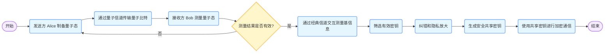

# 如何评估企业的量子密码通信网络

> 关键词：量子密码通信网络、企业评估、安全性、性能、可靠性

> 摘要：本文围绕如何评估企业的量子密码通信网络展开。详细阐述了量子密码通信网络的相关核心概念，深入分析其核心算法原理与具体操作步骤，介绍了涉及的数学模型和公式。通过项目实战案例，讲解开发环境搭建、源代码实现与解读。探讨了量子密码通信网络的实际应用场景，推荐了相关学习资源、开发工具框架及论文著作。最后总结其未来发展趋势与挑战，还提供了常见问题解答及参考资料，旨在为企业全面、科学地评估量子密码通信网络提供技术指导和参考依据。

## 1. 背景介绍 
### 1.1 目的和范围
随着信息技术的飞速发展，企业对通信安全的要求日益提高。量子密码通信网络作为一种具有极高安全性的通信方式，逐渐受到企业的关注。本文章的目的在于为企业提供一套全面、科学的评估量子密码通信网络的方法和思路。范围涵盖量子密码通信网络的各个方面，包括安全性、性能、可靠性等，旨在帮助企业准确判断量子密码通信网络是否满足自身的业务需求和安全要求。

### 1.2 预期读者
本文预期读者主要包括企业的信息技术管理人员、网络安全专家、通信工程师以及对量子密码通信网络感兴趣的技术爱好者。这些读者可能希望通过本文了解量子密码通信网络的评估方法，以便在企业中更好地应用和管理相关网络，或者深入研究量子密码通信技术。

### 1.3 文档结构概述
本文首先介绍量子密码通信网络的背景知识，包括目的、预期读者和文档结构。接着阐述核心概念与联系，展示其原理和架构的文本示意图及 Mermaid 流程图。然后详细讲解核心算法原理和具体操作步骤，结合 Python 源代码进行说明。之后介绍数学模型和公式，并举例说明。通过项目实战部分，呈现代码实际案例和详细解释。探讨实际应用场景，推荐相关工具和资源。最后总结未来发展趋势与挑战，提供常见问题解答和参考资料。

### 1.4 术语表
#### 1.4.1 核心术语定义
- **量子密码通信**：基于量子力学原理实现的密码通信方式，利用量子态的特性（如量子纠缠、量子不可克隆定理等）来保证通信的安全性。
- **量子密钥分发（QKD）**：量子密码通信中的关键技术，用于在通信双方之间安全地分发密钥。
- **量子比特（qubit）**：量子信息的基本单位，与经典比特（0 和 1）不同，量子比特可以处于 0 和 1 的叠加态。

#### 1.4.2 相关概念解释
- **量子纠缠**：是指两个或多个量子系统之间存在的一种特殊的关联状态，即使它们在空间上相隔很远，一个量子系统的状态变化也会瞬间影响到其他相关量子系统的状态。
- **量子不可克隆定理**：该定理表明，不可能对任意未知的量子态进行精确的复制。这一特性为量子密码通信的安全性提供了重要保障。

#### 1.4.3 缩略词列表
- **QKD**：Quantum Key Distribution（量子密钥分发）
- **BB84**：一种经典的量子密钥分发协议，由 Bennett 和 Brassard 在 1984 年提出。

## 2. 核心概念与联系 

### 核心概念原理
量子密码通信网络的核心在于利用量子力学的特性来保障通信的安全性。其中，量子密钥分发（QKD）是实现安全通信的关键环节。QKD 基于量子态的特性，如量子纠缠和量子不可克隆定理，使得通信双方能够安全地共享密钥。

在 QKD 过程中，发送方（Alice）通过量子信道向接收方（Bob）发送一系列量子比特（qubit）。这些量子比特的状态编码了密钥信息。由于量子不可克隆定理，任何试图窃听量子信道的行为都会干扰量子态，从而被通信双方检测到。通信双方通过经典信道进行信息交互，对量子比特的测量结果进行筛选和纠错，最终得到安全的共享密钥。

利用这个共享密钥，通信双方可以采用传统的对称加密算法（如 AES）对通信内容进行加密和解密，从而实现安全的通信。

### 架构的文本示意图
```plaintext
+-----------------+      +----------------+      +-----------------+
| 发送方设备 (Alice) | ---> | 量子信道       | ---> | 接收方设备 (Bob) |
|                   |      |                |      |                   |
| - 量子态制备       |      | - 传输量子比特 |      | - 量子态测量       |
| - 经典信息交互    |      |                |      | - 经典信息交互    |
| - 密钥生成与管理 |      |                |      | - 密钥生成与管理 |
+-----------------+      +----------------+      +-----------------+
```

### Mermaid 流程图


## 3. 核心算法原理 & 具体操作步骤 

### 核心算法原理 - BB84 协议
BB84 协议是一种经典的量子密钥分发协议，其基本原理基于量子态的特性。该协议使用两种不同的量子比特编码基：直角基（|0⟩ 和 |1⟩）和对角基（|+⟩ 和 | - ⟩）。

发送方 Alice 随机选择编码基和比特值，制备相应的量子比特并发送给接收方 Bob。Bob 随机选择测量基对接收的量子比特进行测量。测量完成后，Alice 和 Bob 通过经典信道公开他们所使用的测量基，但不公开测量结果。只有当他们使用相同的测量基时，测量结果才是有效的，这些有效结果构成了初始密钥。

为了确保密钥的安全性，Alice 和 Bob 还需要进行纠错和隐私放大操作。纠错操作是为了纠正由于量子信道噪声等原因导致的测量错误，隐私放大操作则是为了减少可能被窃听者获取的信息，进一步提高密钥的安全性。

### 具体操作步骤及 Python 源代码实现

```python
import random

# 定义量子态编码基
# 直角基：|0⟩ 和 |1⟩
# 对角基：|+⟩ 和 | - ⟩
BASIS = ["rect", "diag"]

# 生成随机比特序列
def generate_random_bits(length):
    return [random.randint(0, 1) for _ in range(length)]

# 生成随机基序列
def generate_random_basis(length):
    return [random.choice(BASIS) for _ in range(length)]

# 制备量子比特
def prepare_qubits(bits, basis):
    qubits = []
    for bit, base in zip(bits, basis):
        if base == "rect":
            if bit == 0:
                qubits.append("|0⟩")
            else:
                qubits.append("|1⟩")
        else:
            if bit == 0:
                qubits.append("|+⟩")
            else:
                qubits.append("| - ⟩")
    return qubits

# 测量量子比特
def measure_qubits(qubits, basis):
    results = []
    for qubit, base in zip(qubits, basis):
        if base == "rect":
            if qubit == "|0⟩":
                results.append(0)
            elif qubit == "|1⟩":
                results.append(1)
            else:
                # 如果测量基与制备基不同，随机得到 0 或 1
                results.append(random.randint(0, 1))
        else:
            if qubit == "|+⟩":
                results.append(0)
            elif qubit == "| - ⟩":
                results.append(1)
            else:
                results.append(random.randint(0, 1))
    return results

# 筛选有效密钥
def sift_keys(alice_bits, alice_basis, bob_basis, bob_results):
    sifted_key = []
    for i in range(len(alice_bits)):
        if alice_basis[i] == bob_basis[i]:
            sifted_key.append(bob_results[i])
    return sifted_key

# 主函数
def bb84_protocol(length):
    # 生成随机比特序列和基序列
    alice_bits = generate_random_bits(length)
    alice_basis = generate_random_basis(length)
    bob_basis = generate_random_basis(length)

    # 制备量子比特
    qubits = prepare_qubits(alice_bits, alice_basis)

    # 测量量子比特
    bob_results = measure_qubits(qubits, bob_basis)

    # 筛选有效密钥
    sifted_key = sift_keys(alice_bits, alice_basis, bob_basis, bob_results)

    return sifted_key

# 示例运行
key_length = 100
sifted_key = bb84_protocol(key_length)
print("筛选后的密钥长度:", len(sifted_key))
print("筛选后的密钥:", sifted_key)
```

### 代码解释
1. **生成随机比特序列和基序列**：`generate_random_bits` 函数用于生成指定长度的随机比特序列，`generate_random_basis` 函数用于生成随机的基序列。
2. **制备量子比特**：`prepare_qubits` 函数根据比特值和基序列制备相应的量子比特。
3. **测量量子比特**：`measure_qubits` 函数根据测量基对量子比特进行测量，当测量基与制备基不同时，随机得到 0 或 1。
4. **筛选有效密钥**：`sift_keys` 函数根据 Alice 和 Bob 使用的基序列，筛选出使用相同基的测量结果，构成有效密钥。
5. **主函数**：`bb84_protocol` 函数整合了上述步骤，完成 BB84 协议的整个过程。

## 4. 数学模型和公式 & 详细讲解 & 举例说明 

### 量子态表示
在量子力学中，量子比特可以用狄拉克符号（Dirac notation）表示。例如，直角基的量子比特可以表示为 $|0⟩$ 和 $|1⟩$，对角基的量子比特可以表示为 $|+⟩ = \frac{1}{\sqrt{2}}(|0⟩ + |1⟩)$ 和 $| - ⟩ = \frac{1}{\sqrt{2}}(|0⟩ - |1⟩)$。

### 测量概率
当使用不同的测量基对量子比特进行测量时，测量结果的概率不同。例如，当制备的量子比特为 $|+⟩$，使用直角基进行测量时，得到 0 的概率为 $\frac{1}{2}$，得到 1 的概率也为 $\frac{1}{2}$。

设制备的量子比特为 $|\psi⟩$，测量基为 $|i⟩$，则测量得到 $|i⟩$ 的概率为 $P(i) = |⟨i|\psi⟩|^2$。

### 举例说明
假设制备的量子比特为 $|+⟩ = \frac{1}{\sqrt{2}}(|0⟩ + |1⟩)$，使用直角基 $|0⟩$ 进行测量。

计算测量得到 $|0⟩$ 的概率：

$$
\begin{align*}
P(0) &= |⟨0|+⟩|^2 \\
&= |⟨0|\frac{1}{\sqrt{2}}(|0⟩ + |1⟩)|^2 \\
&= |\frac{1}{\sqrt{2}}⟨0|0⟩ + \frac{1}{\sqrt{2}}⟨0|1⟩|^2 \\
&= |\frac{1}{\sqrt{2}} \times 1 + \frac{1}{\sqrt{2}} \times 0|^2 \\
&= \frac{1}{2}
\end{align*}
$$

同理，计算测量得到 $|1⟩$ 的概率也为 $\frac{1}{2}$。

### 密钥生成过程中的错误率
在量子密钥分发过程中，由于量子信道噪声等原因，可能会导致测量结果出现错误。设错误率为 $e$，则在筛选有效密钥后，需要进行纠错操作来降低错误率。

纠错操作通常采用经典的纠错码，如汉明码、里德 - 所罗门码等。通过纠错码可以检测和纠正一定数量的错误，提高密钥的准确性。

### 隐私放大
隐私放大是为了减少可能被窃听者获取的信息，进一步提高密钥的安全性。隐私放大通常采用哈希函数来实现。

设初始密钥长度为 $n$，经过隐私放大后得到的最终密钥长度为 $m$，则 $m < n$。隐私放大的过程可以表示为：

$K_{final} = H(K_{initial})$

其中，$K_{initial}$ 是初始密钥，$H$ 是哈希函数，$K_{final}$ 是最终密钥。

## 5. 项目实战：代码实际案例和详细解释说明 

### 5.1  开发环境搭建
#### 硬件环境
- **量子通信设备**：需要配备量子密钥分发设备，如单光子源、量子探测器等。这些设备用于实现量子比特的制备、传输和测量。
- **经典通信设备**：包括网络交换机、路由器等，用于经典信息的传输和交互。
- **计算机服务器**：用于运行量子密钥分发协议的软件程序，处理量子和经典信息。

#### 软件环境
- **操作系统**：推荐使用 Linux 系统，如 Ubuntu、CentOS 等，因为 Linux 系统具有良好的稳定性和开源性。
- **编程语言**：使用 Python 作为开发语言，Python 具有丰富的科学计算库和网络编程库，方便实现量子密钥分发协议。
- **开发工具**：可以使用 PyCharm 作为集成开发环境（IDE），它提供了代码编辑、调试、版本控制等功能，提高开发效率。

### 5.2  源代码详细实现和代码解读
以下是一个更完整的量子密钥分发模拟程序，包括纠错和隐私放大功能。

```python
import random
import hashlib

# 定义量子态编码基
BASIS = ["rect", "diag"]

# 生成随机比特序列
def generate_random_bits(length):
    return [random.randint(0, 1) for _ in range(length)]

# 生成随机基序列
def generate_random_basis(length):
    return [random.choice(BASIS) for _ in range(length)]

# 制备量子比特
def prepare_qubits(bits, basis):
    qubits = []
    for bit, base in zip(bits, basis):
        if base == "rect":
            if bit == 0:
                qubits.append("|0⟩")
            else:
                qubits.append("|1⟩")
        else:
            if bit == 0:
                qubits.append("|+⟩")
            else:
                qubits.append("| - ⟩")
    return qubits

# 测量量子比特
def measure_qubits(qubits, basis):
    results = []
    for qubit, base in zip(qubits, basis):
        if base == "rect":
            if qubit == "|0⟩":
                results.append(0)
            elif qubit == "|1⟩":
                results.append(1)
            else:
                # 如果测量基与制备基不同，随机得到 0 或 1
                results.append(random.randint(0, 1))
        else:
            if qubit == "|+⟩":
                results.append(0)
            elif qubit == "| - ⟩":
                results.append(1)
            else:
                results.append(random.randint(0, 1))
    return results

# 筛选有效密钥
def sift_keys(alice_bits, alice_basis, bob_basis, bob_results):
    sifted_key = []
    for i in range(len(alice_bits)):
        if alice_basis[i] == bob_basis[i]:
            sifted_key.append(bob_results[i])
    return sifted_key

# 纠错 - 简单的奇偶校验
def error_correction(key):
    parity = sum(key) % 2
    corrected_key = key.copy()
    if parity != 0:
        # 简单地翻转最后一个比特
        corrected_key[-1] = 1 - corrected_key[-1]
    return corrected_key

# 隐私放大 - 使用哈希函数
def privacy_amplification(key):
    key_str = ''.join(map(str, key))
    hash_object = hashlib.sha256(key_str.encode())
    hash_hex = hash_object.hexdigest()
    hash_bits = [int(b) for b in format(int(hash_hex, 16), 'b').zfill(256)]
    return hash_bits[:len(key) // 2]

# 主函数
def quantum_key_distribution(length):
    # 生成随机比特序列和基序列
    alice_bits = generate_random_bits(length)
    alice_basis = generate_random_basis(length)
    bob_basis = generate_random_basis(length)

    # 制备量子比特
    qubits = prepare_qubits(alice_bits, alice_basis)

    # 测量量子比特
    bob_results = measure_qubits(qubits, bob_basis)

    # 筛选有效密钥
    sifted_key = sift_keys(alice_bits, alice_basis, bob_basis, bob_results)

    # 纠错
    corrected_key = error_correction(sifted_key)

    # 隐私放大
    final_key = privacy_amplification(corrected_key)

    return final_key

# 示例运行
key_length = 100
final_key = quantum_key_distribution(key_length)
print("最终密钥长度:", len(final_key))
print("最终密钥:", final_key)
```

### 5.3  代码解读与分析
1. **纠错功能**：`error_correction` 函数实现了简单的奇偶校验纠错方法。通过计算密钥中所有比特的和的奇偶性，如果奇偶性不符合预期，则简单地翻转最后一个比特来纠正错误。
2. **隐私放大功能**：`privacy_amplification` 函数使用 SHA - 256 哈希函数对密钥进行隐私放大。将密钥转换为字符串，计算其哈希值，然后将哈希值转换为比特序列，取前一半作为最终密钥。
3. **主函数**：`quantum_key_distribution` 函数整合了量子密钥分发的整个过程，包括生成随机比特和基序列、制备量子比特、测量量子比特、筛选有效密钥、纠错和隐私放大。

## 6. 实际应用场景 
### 金融行业
在金融行业，企业需要处理大量的敏感信息，如客户账户信息、交易记录等。量子密码通信网络可以为金融机构提供极高的通信安全性，防止信息泄露和金融诈骗。例如，银行之间的资金转账、证券交易等业务可以通过量子密码通信网络进行加密传输，确保交易的安全性和可靠性。

### 政府机构
政府机构涉及大量的机密信息和国家重要数据，对通信安全的要求极高。量子密码通信网络可以应用于政府部门之间的文件传输、内部通信等场景，保障国家信息安全。例如，军事指挥系统、国家安全部门的通信可以采用量子密码通信技术，防止敌方窃听和攻击。

### 医疗行业
医疗行业存储着患者的大量个人健康信息，如病历、诊断结果等。这些信息属于敏感信息，需要严格保护。量子密码通信网络可以用于医院内部的信息系统、医疗数据的远程传输等场景，确保患者信息的安全性和隐私性。

### 科研领域
在科研领域，研究人员需要共享大量的科研数据和实验结果。量子密码通信网络可以为科研合作提供安全的通信渠道，防止数据在传输过程中被窃取或篡改。例如，国际科研项目中的数据共享、大型科学实验的数据传输等可以采用量子密码通信技术。

## 7. 工具和资源推荐
### 7.1 学习资源推荐
#### 7.1.1 书籍推荐
- 《量子计算与量子信息》（*Quantum Computation and Quantum Information*）：由 Michael A. Nielsen 和 Isaac L. Chuang 所著，是量子计算和量子信息领域的经典教材，详细介绍了量子力学基础、量子算法、量子密码等内容。
- 《量子密码学：原理、技术与应用》：系统介绍了量子密码学的基本原理、关键技术和实际应用，对于深入了解量子密码通信网络具有重要参考价值。

#### 7.1.2 在线课程
- Coursera 平台上的“Quantum Mechanics for Scientists and Engineers”：该课程由知名高校教授授课，讲解量子力学的基本原理和应用，为学习量子密码通信奠定理论基础。
- edX 平台上的“Quantum Cryptography”：专门介绍量子密码学的相关知识，包括量子密钥分发协议、安全性分析等内容。

#### 7.1.3 技术博客和网站
- Quantum Computing Report：提供量子计算和量子密码领域的最新研究动态、技术进展和行业资讯。
- arXiv.org：一个预印本服务器，收录了大量的量子科学相关的研究论文，可以及时了解最新的研究成果。

### 7.2 开发工具框架推荐
#### 7.2.1 IDE和编辑器
- PyCharm：功能强大的 Python 集成开发环境，提供代码编辑、调试、版本控制等功能，适合开发量子密钥分发协议的软件程序。
- Visual Studio Code：轻量级的代码编辑器，支持多种编程语言和插件扩展，方便进行代码开发和调试。

#### 7.2.2 调试和性能分析工具
- Py-Spy：用于分析 Python 程序的性能瓶颈，帮助优化量子密钥分发程序的性能。
- GDB：通用的调试器，可以用于调试 Python 程序，定位程序中的错误和问题。

#### 7.2.3 相关框架和库
- Qiskit：IBM 开发的开源量子计算框架，提供了量子算法、量子电路模拟等功能，可用于模拟量子密钥分发过程。
- Strawberry Fields：Xanadu 公司开发的量子编程框架，支持连续变量量子计算和量子密码通信的开发。

### 7.3 相关论文著作推荐
#### 7.3.1 经典论文
- C. H. Bennett and G. Brassard, "Quantum cryptography: Public key distribution and coin tossing," in Proceedings of the IEEE International Conference on Computers, Systems & Signal Processing, Bangalore, India, 1984, pp. 175 - 179.：该论文提出了经典的 BB84 量子密钥分发协议，是量子密码学领域的奠基性论文。

#### 7.3.2 最新研究成果
- 关注 Nature、Science、Physical Review Letters 等顶级学术期刊，这些期刊经常发表量子密码通信领域的最新研究成果。

#### 7.3.3 应用案例分析
- 可以查阅相关行业报告和研究论文，了解量子密码通信网络在金融、政府、医疗等行业的实际应用案例和效果分析。

## 8. 总结：未来发展趋势与挑战
### 未来发展趋势
- **技术融合**：量子密码通信技术将与其他新兴技术（如区块链、人工智能等）进行深度融合。例如，量子密码可以为区块链提供更高的安全性，保障区块链网络中的数据隐私和交易安全；人工智能可以用于优化量子密钥分发协议，提高通信效率和安全性。
- **产业化发展**：随着量子密码通信技术的不断成熟，将逐渐实现产业化发展。量子通信设备的成本将不断降低，性能将不断提高，更多的企业和机构将采用量子密码通信网络，推动量子通信产业的发展。
- **全球化布局**：量子密码通信网络将逐渐实现全球化布局，建立跨国、跨地区的量子通信网络。这将有助于保障全球信息安全，促进国际间的信息交流和合作。

### 挑战
- **技术难题**：目前量子密码通信技术还面临一些技术难题，如量子比特的制备和控制精度、量子信道的损耗和噪声等。这些问题需要进一步的研究和技术创新来解决。
- **成本问题**：量子通信设备的成本较高，限制了量子密码通信网络的大规模应用。如何降低量子通信设备的成本，提高性价比，是推广量子密码通信网络的关键。
- **标准和规范**：量子密码通信领域目前还缺乏统一的标准和规范，这给量子密码通信网络的建设和应用带来了一定的困难。需要制定相关的标准和规范，确保量子密码通信网络的互操作性和安全性。

## 9. 附录：常见问题与解答
### 量子密码通信网络是否绝对安全？
量子密码通信网络基于量子力学原理，利用量子不可克隆定理等特性，在理论上提供了极高的安全性。但是，实际应用中由于量子信道噪声、设备不完善等因素，可能存在一定的安全风险。通过纠错和隐私放大等技术可以进一步提高安全性，但不能保证绝对安全。

### 量子密码通信网络的成本高吗？
目前量子密码通信网络的成本相对较高，主要原因是量子通信设备的研发和制造成本较高。随着技术的不断发展和产业化进程的推进，量子通信设备的成本有望逐渐降低。

### 量子密码通信网络与传统密码通信网络有什么区别？
传统密码通信网络主要基于数学算法的复杂性来保障安全性，而量子密码通信网络基于量子力学原理，利用量子态的特性来保障安全性。量子密码通信网络在理论上具有更高的安全性，能够检测到任何试图窃听的行为。

### 企业如何选择适合自己的量子密码通信网络方案？
企业在选择量子密码通信网络方案时，需要考虑自身的业务需求、安全要求、预算等因素。可以咨询专业的量子通信技术提供商，了解不同方案的特点和优势，进行综合评估和比较。

## 10. 扩展阅读 & 参考资料
- Nielsen, M. A., & Chuang, I. L. (2010). Quantum Computation and Quantum Information: 10th Anniversary Edition. Cambridge University Press.
- 量子密码学相关的学术论文和研究报告，可在 arXiv.org、IEEE Xplore 等学术数据库中查找。
- 量子通信设备制造商的官方网站，如国盾量子等，获取最新的产品信息和技术资料。