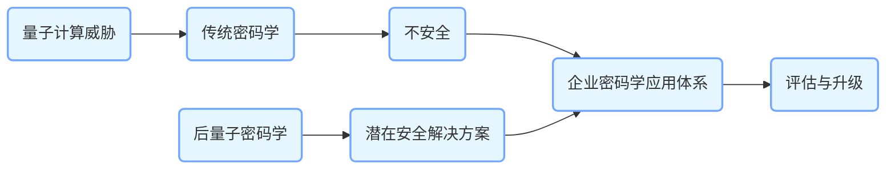

# 如何评估企业的量子计算密码学应用

> 关键词：量子计算密码学、企业评估、量子威胁、密码算法、应用评估指标

> 摘要：本文围绕如何评估企业的量子计算密码学应用展开。随着量子计算技术的发展，传统密码学面临巨大挑战，企业需要评估自身在量子计算密码学方面的应用情况。文章首先介绍了评估的背景，包括目的、范围、预期读者等内容。接着阐述了量子计算密码学的核心概念与联系，分析了核心算法原理和具体操作步骤，并给出了相应的数学模型和公式。通过项目实战案例，详细说明了开发环境搭建、源代码实现及解读。还探讨了实际应用场景，推荐了相关的工具和资源。最后总结了未来发展趋势与挑战，提供了常见问题解答和扩展阅读参考资料，旨在为企业全面评估量子计算密码学应用提供系统的方法和思路。

## 1. 背景介绍 
### 1.1 目的和范围
量子计算作为一种新兴的计算技术，其强大的计算能力对传统密码学构成了潜在威胁。许多传统的密码算法，如 RSA、ECC 等，在量子计算机面前可能变得脆弱不堪。企业评估自身的量子计算密码学应用，目的在于提前识别潜在的安全风险，确保企业的信息系统在量子时代依然具有足够的安全性。评估的范围涵盖了企业现有的密码学应用体系、数据安全策略、技术研发能力以及对量子计算密码学的认知和准备程度等多个方面。

### 1.2 预期读者
本文的预期读者主要包括企业的信息安全管理人员、技术决策人员、密码学研究人员以及对量子计算密码学感兴趣的技术爱好者。信息安全管理人员可以通过本文了解如何评估企业在量子计算环境下的密码学安全状况，以便制定相应的安全策略；技术决策人员可以依据评估结果决定是否需要投入资源进行量子计算密码学的研究和应用；密码学研究人员可以从本文中获取关于量子计算密码学评估的系统性方法和思路；技术爱好者则可以通过本文初步了解量子计算密码学及其评估的相关知识。

### 1.3 文档结构概述
本文将按照以下结构进行阐述：首先介绍量子计算密码学的背景信息，包括目的、范围、预期读者和术语表；接着详细讲解量子计算密码学的核心概念与联系，给出原理和架构的文本示意图以及 Mermaid 流程图；然后分析核心算法原理和具体操作步骤，通过 Python 源代码进行详细阐述；再介绍相关的数学模型和公式，并举例说明；通过项目实战案例，说明开发环境搭建、源代码实现和代码解读；探讨量子计算密码学的实际应用场景；推荐相关的工具和资源；总结未来发展趋势与挑战；提供常见问题解答和扩展阅读参考资料。

### 1.4 术语表
#### 1.4.1 核心术语定义
- **量子计算**：基于量子力学原理的计算方式，利用量子比特（qubit）的叠加和纠缠特性进行信息处理，具有比传统计算机更强大的计算能力。
- **密码学**：研究编制密码和破译密码的技术科学，旨在保护信息的机密性、完整性和可用性。
- **量子计算密码学**：结合量子计算技术和密码学原理的交叉学科，主要研究量子计算对传统密码学的影响以及基于量子力学原理的新型密码算法。
- **后量子密码学**：旨在开发能够抵抗量子计算机攻击的密码算法，是量子计算密码学的重要研究方向。

#### 1.4.2 相关概念解释
- **量子比特（qubit）**：是量子计算中的基本信息单位，与传统的二进制比特不同，量子比特可以处于 0 和 1 的叠加态，这使得量子计算机能够同时处理多个计算任务。
- **量子纠缠**：是一种量子力学现象，当两个或多个量子比特处于纠缠态时，它们之间的状态会相互关联，即使它们相隔很远，对其中一个量子比特的测量会瞬间影响另一个量子比特的状态。
- **密码算法**：用于加密和解密信息的数学算法，常见的传统密码算法有 RSA、ECC 等，后量子密码算法有格密码、哈希密码等。

#### 1.4.3 缩略词列表
- **RSA**：一种非对称加密算法，由 Ron Rivest、Adi Shamir 和 Leonard Adleman 提出。
- **ECC**：椭圆曲线密码学，是一种基于椭圆曲线数学的公钥密码体制。
- **NIST**：美国国家标准与技术研究院，在密码学标准制定方面具有重要影响力。

## 2. 核心概念与联系 

### 核心概念原理
#### 传统密码学与量子计算的冲突
传统密码学主要基于数学难题，如大整数分解、离散对数问题等。例如，RSA 算法的安全性依赖于大整数分解的困难性，即给定两个大素数 $p$ 和 $q$，计算它们的乘积 $n = p \times q$ 很容易，但从 $n$ 分解出 $p$ 和 $q$ 则非常困难。然而，量子计算机可以利用 Shor 算法在多项式时间内解决大整数分解问题，这使得 RSA 等基于大整数分解的传统密码算法在量子计算机面前变得不安全。

#### 量子计算密码学的解决方案
为了应对量子计算对传统密码学的威胁，后量子密码学应运而生。后量子密码学主要研究基于其他数学难题的密码算法，如格密码、哈希密码、代码密码等。这些算法的安全性不依赖于大整数分解和离散对数问题，因此被认为具有抵抗量子计算机攻击的潜力。

### 架构的文本示意图
```plaintext
                量子计算威胁
                      |
                      v
        传统密码学（RSA、ECC等）  <--  不安全
                      |
                      v
        后量子密码学（格密码、哈希密码等）  <--  潜在安全解决方案
                      |
                      v
  企业密码学应用体系  <--  评估与升级
```

### Mermaid 流程图


## 3. 核心算法原理 & 具体操作步骤 

### Shor 算法原理
Shor 算法是量子计算中用于解决大整数分解问题的经典算法。其基本思想是将大整数分解问题转化为求函数周期的问题，然后利用量子傅里叶变换来高效地求解函数的周期。

#### 具体步骤
1. **随机选择一个小于 $N$ 的整数 $a$**：其中 $N$ 是要分解的大整数。
2. **计算 $a$ 和 $N$ 的最大公约数 $d = \gcd(a, N)$**：如果 $d > 1$，则 $d$ 是 $N$ 的一个非平凡因子，分解完成；否则，继续下一步。
3. **定义函数 $f(x) = a^x \bmod N$**：该函数是一个周期函数，设其周期为 $r$。
4. **利用量子傅里叶变换求解函数 $f(x)$ 的周期 $r$**：这是 Shor 算法的核心步骤，通过量子计算机的叠加和纠缠特性，可以在多项式时间内完成。
5. **检查 $r$ 是否满足条件**：如果 $r$ 是偶数且 $a^{r/2} \not\equiv -1 \pmod{N}$，则 $p = \gcd(a^{r/2} + 1, N)$ 和 $q = \gcd(a^{r/2} - 1, N)$ 是 $N$ 的两个非平凡因子。

### Python 代码实现
```python
import math
from sympy import gcd
from qiskit import QuantumCircuit, Aer, execute
from qiskit.visualization import plot_histogram

# 定义要分解的大整数
N = 15

# 随机选择一个小于 N 的整数 a
a = 2

# 计算 a 和 N 的最大公约数
d = gcd(a, N)
if d > 1:
    print(f"找到非平凡因子: {d}")
else:
    # 定义量子比特数
    n = math.ceil(math.log2(N))
    m = 2 * n

    # 创建量子电路
    qc = QuantumCircuit(m, m)

    # 初始化第一个寄存器为叠加态
    for i in range(n):
        qc.h(i)

    # 实现函数 f(x) = a^x mod N
    for i in range(n):
        for j in range(2**i):
            qc.cx(i, n + j % n)

    # 进行逆量子傅里叶变换
    for i in range(n):
        for j in range(i):
            qc.cp(-math.pi / 2**(i - j), j, i)
        qc.h(i)

    # 测量
    qc.measure(range(m), range(m))

    # 运行量子电路
    backend = Aer.get_backend('qasm_simulator')
    job = execute(qc, backend, shots=1024)
    result = job.result()
    counts = result.get_counts(qc)

    # 找到最大计数的测量结果
    output = max(counts, key=counts.get)
    phase = int(output, 2) / 2**m

    # 计算周期 r
    from fractions import Fraction
    frac = Fraction(phase).limit_denominator(N)
    r = frac.denominator

    # 检查 r 是否满足条件
    if r % 2 == 0 and pow(a, r // 2, N) != N - 1:
        p = gcd(a**(r // 2) + 1, N)
        q = gcd(a**(r // 2) - 1, N)
        print(f"找到非平凡因子: {p} 和 {q}")
    else:
        print("未找到非平凡因子")
```

### 代码解释
1. **选择随机数 $a$ 并计算最大公约数**：首先随机选择一个小于 $N$ 的整数 $a$，然后计算 $a$ 和 $N$ 的最大公约数 $d$。如果 $d > 1$，则 $d$ 是 $N$ 的一个非平凡因子。
2. **创建量子电路**：使用 Qiskit 库创建一个包含 $m = 2n$ 个量子比特和 $m$ 个经典比特的量子电路。其中 $n$ 是根据 $N$ 计算得到的量子比特数。
3. **初始化叠加态**：对前 $n$ 个量子比特应用 Hadamard 门，将其初始化为叠加态。
4. **实现函数 $f(x)$**：通过一系列的控制非门实现函数 $f(x) = a^x \bmod N$。
5. **逆量子傅里叶变换**：对前 $n$ 个量子比特应用逆量子傅里叶变换，用于求解函数的周期。
6. **测量和计算周期**：对所有量子比特进行测量，得到测量结果。根据测量结果计算相位，进而计算出周期 $r$。
7. **检查周期并分解因子**：检查 $r$ 是否满足条件，如果满足则计算 $N$ 的两个非平凡因子 $p$ 和 $q$。

## 4. 数学模型和公式 & 详细讲解 & 举例说明 

### Shor 算法的数学基础
#### 函数 $f(x) = a^x \bmod N$
设 $N$ 是要分解的大整数，$a$ 是一个小于 $N$ 的随机整数。定义函数 $f(x) = a^x \bmod N$，其中 $x$ 是一个非负整数。该函数是一个周期函数，即存在一个正整数 $r$，使得对于任意的 $x$，都有 $f(x + r) = f(x)$。

#### 量子傅里叶变换
量子傅里叶变换（QFT）是 Shor 算法的核心操作之一。对于一个 $n$ 量子比特的态 $\vert x \rangle$，其量子傅里叶变换定义为：
$$
\mathrm{QFT}(\vert x \rangle) = \frac{1}{\sqrt{2^n}} \sum_{y = 0}^{2^n - 1} e^{2\pi i xy / 2^n} \vert y \rangle
$$

#### 周期求解
通过量子傅里叶变换，可以得到函数 $f(x)$ 的周期 $r$。具体来说，测量量子傅里叶变换后的态，得到一个测量结果 $y$，则 $y / 2^n$ 近似等于 $s / r$，其中 $s$ 是一个小于 $r$ 的整数。通过连分数展开等方法，可以从 $y / 2^n$ 中得到 $r$。

### 举例说明
假设要分解的大整数 $N = 15$，随机选择 $a = 2$。
1. **计算函数 $f(x)$**：
    - $f(0) = 2^0 \bmod 15 = 1$
    - $f(1) = 2^1 \bmod 15 = 2$
    - $f(2) = 2^2 \bmod 15 = 4$
    - $f(3) = 2^3 \bmod 15 = 8$
    - $f(4) = 2^4 \bmod 15 = 1$
    可以看出，函数 $f(x)$ 的周期 $r = 4$。
2. **量子傅里叶变换**：
    - 假设通过量子傅里叶变换得到测量结果 $y = 8$，则 $y / 2^n = 8 / 16 = 0.5$。
    - 通过连分数展开，$0.5$ 可以表示为 $1/2$，因此 $r = 2$（这里只是简单示例，实际计算可能需要更复杂的处理）。
3. **分解因子**：
    - 计算 $a^{r/2} = 2^2 = 4$。
    - 计算 $p = \gcd(4 + 1, 15) = 5$ 和 $q = \gcd(4 - 1, 15) = 3$，成功分解出 $N$ 的两个非平凡因子。

## 5. 项目实战：代码实际案例和详细解释说明 

### 5.1  开发环境搭建
#### 安装 Python
首先需要安装 Python 环境，建议使用 Python 3.7 及以上版本。可以从 Python 官方网站（https://www.python.org/downloads/）下载并安装。

#### 安装 Qiskit
Qiskit 是一个用于量子计算的开源框架，提供了丰富的工具和库。可以使用以下命令安装 Qiskit：
```sh
pip install qiskit
```

#### 安装其他依赖库
还需要安装一些其他的依赖库，如 SymPy 用于数学计算：
```sh
pip install sympy
```

### 5.2  源代码详细实现和代码解读
以下是一个完整的基于 Qiskit 实现 Shor 算法的代码示例：
```python
import math
from sympy import gcd
from qiskit import QuantumCircuit, Aer, execute
from qiskit.visualization import plot_histogram

# 定义要分解的大整数
N = 15

# 随机选择一个小于 N 的整数 a
a = 2

# 计算 a 和 N 的最大公约数
d = gcd(a, N)
if d > 1:
    print(f"找到非平凡因子: {d}")
else:
    # 定义量子比特数
    n = math.ceil(math.log2(N))
    m = 2 * n

    # 创建量子电路
    qc = QuantumCircuit(m, m)

    # 初始化第一个寄存器为叠加态
    for i in range(n):
        qc.h(i)

    # 实现函数 f(x) = a^x mod N
    for i in range(n):
        for j in range(2**i):
            qc.cx(i, n + j % n)

    # 进行逆量子傅里叶变换
    for i in range(n):
        for j in range(i):
            qc.cp(-math.pi / 2**(i - j), j, i)
        qc.h(i)

    # 测量
    qc.measure(range(m), range(m))

    # 运行量子电路
    backend = Aer.get_backend('qasm_simulator')
    job = execute(qc, backend, shots=1024)
    result = job.result()
    counts = result.get_counts(qc)

    # 找到最大计数的测量结果
    output = max(counts, key=counts.get)
    phase = int(output, 2) / 2**m

    # 计算周期 r
    from fractions import Fraction
    frac = Fraction(phase).limit_denominator(N)
    r = frac.denominator

    # 检查 r 是否满足条件
    if r % 2 == 0 and pow(a, r // 2, N) != N - 1:
        p = gcd(a**(r // 2) + 1, N)
        q = gcd(a**(r // 2) - 1, N)
        print(f"找到非平凡因子: {p} 和 {q}")
    else:
        print("未找到非平凡因子")
```

### 代码解读与分析
1. **输入参数**：定义要分解的大整数 $N$ 和随机选择的整数 $a$。
2. **最大公约数检查**：计算 $a$ 和 $N$ 的最大公约数 $d$，如果 $d > 1$，则直接得到 $N$ 的一个非平凡因子。
3. **量子电路构建**：
    - 确定量子比特数 $n$ 和总量子比特数 $m = 2n$。
    - 创建量子电路，并对前 $n$ 个量子比特应用 Hadamard 门，将其初始化为叠加态。
    - 通过一系列的控制非门实现函数 $f(x) = a^x \bmod N$。
    - 对前 $n$ 个量子比特应用逆量子傅里叶变换。
4. **测量和结果处理**：
    - 对所有量子比特进行测量，得到测量结果。
    - 找到最大计数的测量结果，计算相位。
    - 通过连分数展开计算周期 $r$。
5. **因子分解**：检查 $r$ 是否满足条件，如果满足则计算 $N$ 的两个非平凡因子 $p$ 和 $q$。

## 6. 实际应用场景 
### 金融行业
金融行业涉及大量的敏感信息和资金交易，对信息安全的要求极高。在量子计算时代，传统的金融密码学应用，如网上银行的登录认证、交易加密等，可能面临被破解的风险。企业需要评估自身的密码学应用，考虑采用后量子密码算法来保护客户的账户信息和交易数据。例如，银行可以使用格密码算法对客户的账户余额、交易记录等敏感信息进行加密，以确保在量子计算机攻击下信息的安全性。

### 政府和国防领域
政府和国防领域处理的是国家的核心机密信息，其安全性至关重要。量子计算的发展可能会使传统的军事通信加密、情报传输加密等手段失效。政府和国防部门需要对现有的密码学应用进行全面评估，加快后量子密码技术的研究和应用。例如，在军事通信中采用哈希密码算法，保证通信内容的机密性和完整性，防止敌方通过量子计算手段窃取情报。

### 医疗行业
医疗行业存储着大量患者的个人健康信息，如病历、诊断结果等。这些信息的泄露可能会对患者的隐私和权益造成严重影响。随着量子计算技术的发展，医疗企业需要评估自身的密码学应用，确保患者信息的安全。例如，医院可以使用基于代码密码的加密算法对患者的电子病历进行加密，防止信息被非法获取。

### 互联网行业
互联网企业拥有海量的用户数据，如用户账号信息、社交关系、消费记录等。在量子计算的威胁下，这些数据的安全性面临挑战。互联网企业需要评估自身的密码学应用，采用后量子密码技术来保护用户数据。例如，社交平台可以使用后量子密码算法对用户的聊天记录、私信内容等进行加密，保障用户的隐私安全。

## 7. 工具和资源推荐
### 7.1 学习资源推荐
#### 7.1.1 书籍推荐
- 《量子计算与量子信息》（Quantum Computation and Quantum Information）：由 Michael A. Nielsen 和 Isaac L. Chuang 所著，是量子计算领域的经典教材，全面介绍了量子计算的基本原理、算法和应用。
- 《后量子密码学》（Post-Quantum Cryptography）：详细介绍了后量子密码学的各种算法和技术，是研究量子计算密码学的重要参考书籍。

#### 7.1.2 在线课程
- Coursera 上的“量子计算基础”（Foundations of Quantum Computing）课程：由专业教授授课，讲解量子计算的基本概念和原理。
- edX 上的“量子信息科学与工程”（Quantum Information Science and Engineering）课程：涵盖了量子信息、量子算法、量子密码学等多个方面的内容。

#### 7.1.3 技术博客和网站
- Quantum Computing Report：提供量子计算领域的最新技术动态、研究成果和市场分析。
- Qiskit 官方博客：Qiskit 是一个开源的量子计算框架，其官方博客会发布关于量子计算算法、应用案例等方面的文章。

### 7.2 开发工具框架推荐
#### 7.2.1 IDE和编辑器
- PyCharm：是一款功能强大的 Python 集成开发环境，支持代码调试、自动补全、版本控制等功能，适合开发量子计算相关的 Python 代码。
- Visual Studio Code：是一款轻量级的代码编辑器，具有丰富的插件生态系统，可以方便地进行量子计算代码的编写和调试。

#### 7.2.2 调试和性能分析工具
- Qiskit Aer：是 Qiskit 框架中的一个模拟器，可用于模拟量子电路的运行，帮助开发者调试和验证量子算法。
- QuTiP：是一个用于量子信息处理和量子光学的 Python 库，提供了丰富的工具和函数，可用于量子系统的模拟和性能分析。

#### 7.2.3 相关框架和库
- Qiskit：是一个开源的量子计算框架，提供了量子电路构建、模拟、优化等功能，支持多种量子硬件平台。
- Cirq：是 Google 开发的一个量子计算框架，专注于量子电路的设计和模拟，具有简洁易用的接口。

### 7.3 相关论文著作推荐
#### 7.3.1 经典论文
- “Polynomial-Time Algorithms for Prime Factorization and Discrete Logarithms on a Quantum Computer”：Peter Shor 发表的关于 Shor 算法的经典论文，奠定了量子计算在密码学领域的重要地位。
- “A Public-Key Cryptosystem and a Signature Scheme Based on Discrete Logarithms”：介绍了基于离散对数问题的公钥密码体制和签名方案，是传统密码学的重要研究成果。

#### 7.3.2 最新研究成果
- NIST 发布的后量子密码学标准化项目相关论文：NIST 正在进行后量子密码算法的标准化工作，其发布的相关论文反映了后量子密码学的最新研究进展。
- 国际密码学会议（Crypto、Eurocrypt 等）上发表的关于量子计算密码学的最新研究论文。

#### 7.3.3 应用案例分析
- 金融机构关于量子计算密码学应用的研究报告：分析了金融行业在量子计算时代面临的密码学挑战和应对策略。
- 政府和国防部门关于量子计算密码学应用的案例分析：介绍了政府和国防领域如何应用量子计算密码学技术保障信息安全。

## 8. 总结：未来发展趋势与挑战
### 未来发展趋势
#### 后量子密码算法标准化
随着量子计算技术的不断发展，后量子密码算法的标准化工作将成为未来的重要趋势。NIST 已经启动了后量子密码学标准化项目，预计在未来几年内会确定一批标准化的后量子密码算法。企业需要关注这些标准的制定，及时采用标准化的算法来保障自身的信息安全。

#### 量子密码技术的融合
未来，量子密码技术可能会与传统密码技术进行融合，形成更加安全可靠的密码体系。例如，量子密钥分发（QKD）技术可以与传统的对称加密算法相结合，提供更高的安全性。企业可以探索这种融合模式，提升自身的密码学应用水平。

#### 量子计算硬件的发展
量子计算硬件的性能将不断提升，量子比特的数量和稳定性将逐渐提高。这将使得量子计算在实际应用中的可行性增强，也会对传统密码学带来更大的挑战。企业需要密切关注量子计算硬件的发展动态，提前做好应对准备。

### 挑战
#### 技术难度
后量子密码算法的研究和实现具有较高的技术难度，需要企业具备深厚的数学和物理知识。目前，后量子密码算法的性能和效率还存在一定的问题，需要进一步优化和改进。企业在采用后量子密码技术时，需要投入大量的研发资源和技术力量。

#### 兼容性问题
企业现有的信息系统和密码学应用已经形成了一定的规模和体系，引入后量子密码技术可能会面临兼容性问题。例如，新的密码算法可能与现有的软件和硬件不兼容，需要进行大量的改造和升级。企业需要谨慎考虑兼容性问题，制定合理的过渡方案。

#### 人才短缺
量子计算密码学是一个新兴的交叉学科，相关的专业人才非常短缺。企业在开展量子计算密码学应用评估和研究时，可能会面临人才不足的问题。企业需要加强人才培养和引进，建立一支专业的技术团队。

## 9. 附录：常见问题与解答
### 问题 1：量子计算对传统密码学的威胁有多大？
量子计算的强大计算能力可以在多项式时间内解决传统密码学中基于大整数分解和离散对数问题的算法，如 RSA、ECC 等。这意味着在量子计算机面前，这些传统密码算法可能变得不安全，企业的信息系统面临被破解的风险。

### 问题 2：后量子密码算法一定能抵抗量子计算机的攻击吗？
目前的后量子密码算法是基于其他数学难题设计的，被认为具有抵抗量子计算机攻击的潜力。但由于量子计算技术仍在不断发展，未来可能会出现新的攻击方法，因此不能绝对保证后量子密码算法一定能抵抗量子计算机的攻击。企业需要持续关注后量子密码算法的研究进展，及时更新和改进自身的密码学应用。

### 问题 3：企业如何确定是否需要采用后量子密码技术？
企业可以从以下几个方面进行评估：一是企业信息的敏感程度，如果企业存储和处理的是高度敏感的信息，如金融交易数据、国家机密等，那么应尽快考虑采用后量子密码技术；二是量子计算技术的发展趋势，关注量子计算硬件的性能提升和应用情况，如果量子计算的威胁日益临近，企业应提前做好准备；三是成本效益分析，评估采用后量子密码技术的成本和带来的安全收益，做出合理的决策。

### 问题 4：采用后量子密码技术会对企业的现有业务产生影响吗？
采用后量子密码技术可能会对企业的现有业务产生一定的影响。一方面，新的密码算法可能需要对现有的信息系统进行改造和升级，这可能会导致业务系统的停机和数据迁移等问题；另一方面，后量子密码算法的性能和效率可能不如传统密码算法，会对业务系统的运行速度产生一定的影响。企业需要在实施后量子密码技术时，制定详细的过渡方案，尽量减少对现有业务的影响。

## 10. 扩展阅读 & 参考资料
### 扩展阅读
- 《量子比特和量子计算机》（Qubits and Quantum Computers）：深入介绍了量子比特的物理原理和量子计算机的工作机制。
- 《密码学原理与实践》（Cryptography: Theory and Practice）：全面阐述了密码学的基本原理和各种密码算法。

### 参考资料
- NIST 官方网站（https://www.nist.gov/）：获取后量子密码学标准化项目的最新信息。
- IEEE 量子计算技术委员会（https://qct.ieee.org/）：关注量子计算技术的最新研究成果和发展动态。
- Qiskit 官方文档（https://qiskit.org/documentation/）：学习 Qiskit 框架的使用和量子计算算法的实现。