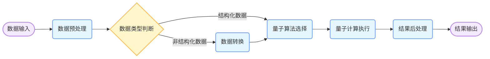

# 如何评估企业的量子计算金融风险模型

> 关键词：量子计算、金融风险模型、模型评估、企业风险、量化分析

> 摘要：本文聚焦于如何评估企业的量子计算金融风险模型。随着量子计算技术的不断发展，其在金融领域的应用日益广泛，量子计算金融风险模型也逐渐成为企业管理金融风险的重要工具。然而，准确评估这些模型的有效性和可靠性至关重要。文章将深入探讨量子计算金融风险模型的背景，阐述其核心概念与联系，详细讲解核心算法原理及操作步骤，介绍相关数学模型和公式，通过项目实战展示代码实现与解读，分析实际应用场景，推荐相关工具和资源，最后总结未来发展趋势与挑战，并对常见问题进行解答，旨在为企业提供全面且深入的量子计算金融风险模型评估指导。

## 1. 背景介绍 
### 1.1 目的和范围
本文章的主要目的是为企业提供一套全面、系统且科学的方法来评估量子计算金融风险模型。随着金融市场的日益复杂和量子计算技术的快速发展，企业面临着更多样化的金融风险，而量子计算金融风险模型作为一种新兴的风险管理工具，其评估的准确性直接关系到企业的风险管控能力和决策的科学性。

本文的范围涵盖了从量子计算金融风险模型的基本概念、核心算法原理到实际应用场景等多个方面，旨在帮助企业理解模型的运作机制，掌握评估的关键要点，从而更好地运用量子计算金融风险模型来管理金融风险。

### 1.2 预期读者
本文预期读者主要包括企业的金融风险管理部门人员、金融科技从业者、量子计算研究人员以及对量子计算在金融领域应用感兴趣的学者和学生。这些读者可能希望了解量子计算金融风险模型的评估方法，以便在实际工作中更好地运用和管理这些模型，或者深入研究相关理论和技术。

### 1.3 文档结构概述
本文将按照以下结构进行阐述：首先介绍量子计算金融风险模型的背景知识，包括目的、预期读者和文档结构概述等；接着深入探讨核心概念与联系，通过文本示意图和 Mermaid 流程图展示模型的原理和架构；然后详细讲解核心算法原理及具体操作步骤，并使用 Python 源代码进行阐述；再介绍相关数学模型和公式，并进行详细讲解和举例说明；之后通过项目实战展示代码实际案例和详细解释说明；分析实际应用场景；推荐相关工具和资源；最后总结未来发展趋势与挑战，解答常见问题，并提供扩展阅读和参考资料。

### 1.4 术语表
#### 1.4.1 核心术语定义
- **量子计算**：是一种基于量子力学原理的计算模式，利用量子比特的叠加、纠缠等特性进行信息处理，具有强大的计算能力和并行性。
- **金融风险模型**：是用于评估、量化和管理金融风险的数学模型，通过对各种金融数据的分析和处理，预测金融市场的变化和潜在风险。
- **量子计算金融风险模型**：是将量子计算技术应用于金融风险评估和管理的模型，利用量子计算的优势提高模型的计算效率和准确性。

#### 1.4.2 相关概念解释
- **量子比特（qubit）**：是量子计算中的基本信息单位，与经典比特不同，量子比特可以同时处于 0 和 1 的叠加态，这使得量子计算具有并行计算的能力。
- **风险度量**：是对金融风险的量化表示，常见的风险度量指标包括方差、标准差、风险价值（VaR）、条件风险价值（CVaR）等。
- **蒙特卡罗模拟**：是一种通过随机抽样来模拟复杂系统行为的方法，在金融风险评估中广泛应用，用于生成大量的可能情景，从而评估风险。

#### 1.4.3 缩略词列表
- **VaR**：Value at Risk，风险价值
- **CVaR**：Conditional Value at Risk，条件风险价值
- **GPU**：Graphics Processing Unit，图形处理器
- **API**：Application Programming Interface，应用程序编程接口

## 2. 核心概念与联系 
### 2.1 量子计算与金融风险模型的基本原理
量子计算的核心原理基于量子力学的基本定律，如量子叠加和量子纠缠。量子比特可以同时处于多个状态的叠加态，这使得量子计算机能够在一次计算中处理多个数据，从而实现并行计算。相比之下，经典计算机的比特只能处于 0 或 1 的单一状态，计算是串行进行的。

金融风险模型的基本原理是通过对历史数据和市场信息的分析，建立数学模型来描述金融资产的价格波动和风险特征。常见的金融风险模型包括基于统计分析的模型、基于机器学习的模型和基于深度学习的模型等。

### 2.2 量子计算在金融风险模型中的应用联系
量子计算在金融风险模型中的应用主要体现在提高计算效率和处理复杂问题的能力上。例如，在蒙特卡罗模拟中，量子计算机可以通过并行计算快速生成大量的可能情景，从而提高风险评估的准确性和效率。此外，量子计算还可以用于优化金融投资组合，通过求解复杂的优化问题找到最优的投资组合方案。

### 2.3 核心概念原理和架构的文本示意图
量子计算金融风险模型的核心架构主要包括数据输入层、量子计算层和结果输出层。数据输入层负责收集和整理金融市场的相关数据，如资产价格、利率、汇率等。量子计算层利用量子计算机对输入的数据进行处理，通过特定的算法进行风险评估和分析。结果输出层将量子计算的结果以可视化的方式呈现给用户，如风险报告、投资建议等。

### 2.4 Mermaid 流程图


## 3. 核心算法原理 & 具体操作步骤 
### 3.1 蒙特卡罗模拟的量子算法原理
蒙特卡罗模拟是一种常用的金融风险评估方法，其基本思想是通过随机抽样来模拟金融市场的各种可能情景，从而评估风险。在量子计算中，蒙特卡罗模拟可以通过量子随机数生成器和量子并行计算来实现。

量子随机数生成器利用量子力学的不确定性原理生成真正的随机数，而经典随机数生成器通常是伪随机数生成器。量子并行计算可以同时处理多个随机样本，从而大大提高模拟的效率。

### 3.2 Python 源代码实现
```python
import numpy as np
from qiskit import QuantumCircuit, Aer, execute

# 定义量子随机数生成函数
def quantum_random_number_generator(num_qubits):
    circuit = QuantumCircuit(num_qubits, num_qubits)
    for qubit in range(num_qubits):
        circuit.h(qubit)
    circuit.measure(range(num_qubits), range(num_qubits))

    backend = Aer.get_backend('qasm_simulator')
    job = execute(circuit, backend, shots=1)
    result = job.result()
    counts = result.get_counts(circuit)
    random_binary = list(counts.keys())[0]
    random_number = int(random_binary, 2)
    return random_number

# 蒙特卡罗模拟的量子实现
def quantum_monte_carlo_simulation(num_samples, num_qubits):
    samples = []
    for _ in range(num_samples):
        random_num = quantum_random_number_generator(num_qubits)
        samples.append(random_num)
    return samples

# 示例参数
num_samples = 100
num_qubits = 5

# 执行量子蒙特卡罗模拟
samples = quantum_monte_carlo_simulation(num_samples, num_qubits)
print("量子蒙特卡罗模拟结果:", samples)
```

### 3.3 具体操作步骤
1. **数据准备**：收集和整理金融市场的相关数据，包括资产价格、利率、汇率等。
2. **量子随机数生成**：使用量子随机数生成器生成随机数，用于模拟金融市场的各种可能情景。
3. **量子并行计算**：利用量子计算机的并行计算能力，同时处理多个随机样本，提高模拟的效率。
4. **结果分析**：对量子蒙特卡罗模拟的结果进行分析，计算风险度量指标，如 VaR、CVaR 等。

## 4. 数学模型和公式 & 详细讲解 & 举例说明 
### 4.1 风险价值（VaR）模型
风险价值（VaR）是一种常用的金融风险度量指标，用于衡量在一定的置信水平下，金融资产在未来一段时间内可能遭受的最大损失。其数学定义为：

$$VaR_{\alpha}(X) = -inf\{x \in \mathbb{R}: F_X(x) \geq \alpha\}$$

其中，$X$ 表示金融资产的收益率，$F_X(x)$ 表示 $X$ 的累积分布函数，$\alpha$ 表示置信水平。

### 4.2 条件风险价值（CVaR）模型
条件风险价值（CVaR）是在 VaR 的基础上发展起来的一种风险度量指标，用于衡量在损失超过 VaR 的情况下，金融资产的平均损失。其数学定义为：

$$CVaR_{\alpha}(X) = E[X|X \leq -VaR_{\alpha}(X)]$$

### 4.3 详细讲解
VaR 模型的优点是简单直观，易于理解和计算，能够提供一个明确的风险度量指标。然而，VaR 模型也存在一些局限性，如不满足次可加性，不能反映极端损失的情况等。

CVaR 模型克服了 VaR 模型的一些局限性，满足次可加性，能够更好地反映极端损失的情况。因此，CVaR 模型在金融风险管理中得到了广泛的应用。

### 4.4 举例说明
假设某金融资产的收益率服从正态分布 $N(0.05, 0.1^2)$，置信水平 $\alpha = 0.95$。

首先，计算 VaR：

```python
import scipy.stats as stats

mu = 0.05
sigma = 0.1
alpha = 0.95

var = -stats.norm.ppf(1 - alpha, mu, sigma)
print("VaR:", var)
```

然后，计算 CVaR：

```python
cvar = mu + sigma * stats.norm.pdf(stats.norm.ppf(1 - alpha)) / (1 - alpha)
print("CVaR:", cvar)
```

## 5. 项目实战：代码实际案例和详细解释说明 
### 5.1  开发环境搭建
1. **安装 Python**：建议使用 Python 3.7 及以上版本，可以从 Python 官方网站下载安装。
2. **安装 Qiskit**：Qiskit 是一个开源的量子计算框架，可以使用以下命令进行安装：
```sh
pip install qiskit
```
3. **安装相关依赖库**：如 NumPy、SciPy 等，可以使用以下命令进行安装：
```sh
pip install numpy scipy
```

### 5.2  源代码详细实现和代码解读
```python
import numpy as np
from qiskit import QuantumCircuit, Aer, execute
import scipy.stats as stats

# 定义量子随机数生成函数
def quantum_random_number_generator(num_qubits):
    circuit = QuantumCircuit(num_qubits, num_qubits)
    for qubit in range(num_qubits):
        circuit.h(qubit)  # 应用 Hadamard 门，使量子比特处于叠加态
    circuit.measure(range(num_qubits), range(num_qubits))  # 测量量子比特

    backend = Aer.get_backend('qasm_simulator')  # 使用 Qiskit 的模拟器作为后端
    job = execute(circuit, backend, shots=1)  # 执行量子电路
    result = job.result()  # 获取执行结果
    counts = result.get_counts(circuit)  # 获取测量结果的计数
    random_binary = list(counts.keys())[0]  # 获取二进制随机数
    random_number = int(random_binary, 2)  # 将二进制随机数转换为十进制
    return random_number

# 蒙特卡罗模拟的量子实现
def quantum_monte_carlo_simulation(num_samples, num_qubits):
    samples = []
    for _ in range(num_samples):
        random_num = quantum_random_number_generator(num_qubits)
        samples.append(random_num)
    return samples

# 计算 VaR 和 CVaR
def calculate_var_cvar(samples, alpha):
    sorted_samples = np.sort(samples)
    index = int((1 - alpha) * len(sorted_samples))
    var = -sorted_samples[index]

    cvar_samples = sorted_samples[:index]
    cvar = -np.mean(cvar_samples)

    return var, cvar

# 示例参数
num_samples = 1000
num_qubits = 5
alpha = 0.95

# 执行量子蒙特卡罗模拟
samples = quantum_monte_carlo_simulation(num_samples, num_qubits)

# 计算 VaR 和 CVaR
var, cvar = calculate_var_cvar(samples, alpha)

print("VaR:", var)
print("CVaR:", cvar)
```

### 5.3  代码解读与分析
1. **量子随机数生成函数**：`quantum_random_number_generator` 函数通过创建一个量子电路，应用 Hadamard 门使量子比特处于叠加态，然后进行测量，得到一个二进制随机数，最后将其转换为十进制随机数。
2. **蒙特卡罗模拟的量子实现**：`quantum_monte_carlo_simulation` 函数通过多次调用量子随机数生成函数，生成多个随机样本，实现蒙特卡罗模拟。
3. **计算 VaR 和 CVaR**：`calculate_var_cvar` 函数通过对随机样本进行排序，计算 VaR 和 CVaR。

通过以上代码，我们可以利用量子计算实现蒙特卡罗模拟，并计算金融风险度量指标 VaR 和 CVaR。

## 6. 实际应用场景 
### 6.1 投资组合优化
在投资组合优化中，量子计算金融风险模型可以帮助投资者快速找到最优的投资组合方案。通过量子并行计算，模型可以同时考虑多个投资组合的风险和收益，从而在更短的时间内找到最优解。

### 6.2 信用风险评估
在信用风险评估中，量子计算金融风险模型可以通过对大量的客户数据进行分析，更准确地评估客户的信用风险。量子计算的强大计算能力可以处理复杂的信用风险模型，提高评估的准确性。

### 6.3 市场风险预测
在市场风险预测中，量子计算金融风险模型可以通过对市场数据的实时分析，预测市场的变化趋势和潜在风险。量子计算的快速计算能力可以及时响应市场变化，为投资者提供更及时的风险预警。

## 7. 工具和资源推荐
### 7.1 学习资源推荐
#### 7.1.1 书籍推荐
- 《量子计算与量子信息》：由 Michael A. Nielsen 和 Isaac L. Chuang 所著，是量子计算领域的经典教材，系统地介绍了量子计算的基本原理和算法。
- 《金融风险管理基础》：由 Philippe Jorion 所著，全面介绍了金融风险管理的基本概念、方法和技术。

#### 7.1.2 在线课程
- Coursera 上的“量子计算基础”课程：由知名高校的教授授课，详细讲解量子计算的基本原理和编程方法。
- edX 上的“金融风险管理”课程：提供了丰富的金融风险管理案例和实践项目，帮助学习者掌握金融风险管理的实际应用。

#### 7.1.3 技术博客和网站
- Qiskit 官方博客：提供了量子计算领域的最新技术动态和研究成果，以及 Qiskit 框架的使用教程和案例。
- 金融时报（FT）网站：提供了全球金融市场的最新资讯和分析，以及金融风险管理的相关文章和报告。

### 7.2 开发工具框架推荐
#### 7.2.1 IDE和编辑器
- PyCharm：是一款功能强大的 Python 集成开发环境，提供了代码编辑、调试、版本控制等功能，适合开发量子计算和金融风险模型相关的 Python 代码。
- Visual Studio Code：是一款轻量级的代码编辑器，支持多种编程语言和插件，具有丰富的扩展功能，可用于快速开发和调试量子计算代码。

#### 7.2.2 调试和性能分析工具
- Qiskit Visualization Tools：Qiskit 提供的可视化工具，可以帮助开发者直观地查看量子电路的结构和执行结果，方便调试和分析。
- Python 的 `cProfile` 模块：可以用于分析 Python 代码的性能，找出代码中的性能瓶颈，进行优化。

#### 7.2.3 相关框架和库
- Qiskit：是一个开源的量子计算框架，提供了量子电路的创建、编译、执行等功能，支持多种量子计算机模拟器和硬件后端。
- NumPy 和 SciPy：是 Python 中常用的科学计算库，提供了丰富的数学函数和数据处理工具，可用于金融风险模型的数值计算和分析。

### 7.3 相关论文著作推荐
#### 7.3.1 经典论文
- “Quantum Algorithms for Financial Applications”：介绍了量子算法在金融领域的应用，包括投资组合优化、风险评估等方面的研究成果。
- “On the Coherence of Expected Shortfall”：对条件风险价值（CVaR）的理论和性质进行了深入研究，证明了 CVaR 的次可加性。

#### 7.3.2 最新研究成果
- 关注 arXiv 预印本平台上关于量子计算和金融风险管理的最新研究论文，了解该领域的前沿动态和研究进展。

#### 7.3.3 应用案例分析
- 查阅金融机构和科研机构发布的关于量子计算金融风险模型应用案例的报告，学习实际应用中的经验和方法。

## 8. 总结：未来发展趋势与挑战
### 8.1 未来发展趋势
- **技术融合**：量子计算将与人工智能、机器学习等技术深度融合，进一步提高金融风险模型的准确性和效率。
- **应用拓展**：量子计算金融风险模型将在更多的金融领域得到应用，如保险、证券、基金等，为金融行业的风险管理提供更全面的支持。
- **硬件发展**：随着量子计算机硬件技术的不断发展，量子计算的性能将不断提高，为量子计算金融风险模型的应用提供更强大的计算能力。

### 8.2 挑战
- **技术难题**：量子计算技术仍处于发展阶段，存在量子比特的退相干、量子门的误差等技术难题，需要进一步研究和解决。
- **人才短缺**：量子计算和金融风险管理的交叉领域人才短缺，需要加强相关人才的培养和引进。
- **法规和监管**：量子计算金融风险模型的应用可能会带来新的风险和挑战，需要制定相应的法规和监管政策，确保其安全、合规地应用。

## 9. 附录：常见问题与解答
### 9.1 量子计算金融风险模型与经典金融风险模型有什么区别？
量子计算金融风险模型利用量子计算的并行计算能力和量子随机数生成器，能够更快速、准确地处理复杂的金融风险问题。相比之下，经典金融风险模型受限于计算能力，在处理大规模数据和复杂问题时效率较低。

### 9.2 如何选择合适的量子算法来评估金融风险？
选择合适的量子算法需要考虑问题的复杂度、数据规模和量子计算机的性能等因素。一般来说，可以根据问题的特点选择相应的量子算法，如蒙特卡罗模拟、量子优化算法等。

### 9.3 量子计算金融风险模型的应用需要具备哪些条件？
量子计算金融风险模型的应用需要具备以下条件：一是具备一定的量子计算知识和技能；二是拥有足够的金融数据和相关领域的专业知识；三是需要有相应的量子计算硬件或模拟器支持。

## 10. 扩展阅读 & 参考资料
### 10.1 扩展阅读
- 阅读更多关于量子计算和金融风险管理的学术论文和研究报告，深入了解该领域的前沿技术和研究成果。
- 关注行业动态和新闻，了解量子计算金融风险模型在实际应用中的案例和经验。

### 10.2 参考资料
- Nielsen, M. A., & Chuang, I. L. (2010). Quantum Computation and Quantum Information. Cambridge University Press.
- Jorion, P. (2007). Financial Risk Management: Foundations and Principles. McGraw-Hill.
- Qiskit Documentation: https://qiskit.org/documentation/