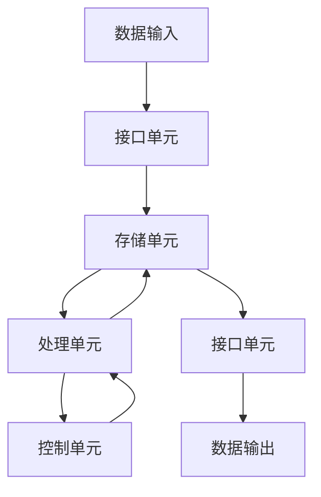

# 如何识别企业的边缘AI芯片优势

> 关键词：边缘AI芯片、企业优势、芯片性能、应用场景、技术创新

> 摘要：边缘AI芯片在当今的人工智能和物联网领域中扮演着至关重要的角色。企业的边缘AI芯片优势不仅决定了其在市场中的竞争力，也影响着相关技术的发展和应用。本文旨在深入探讨如何识别企业的边缘AI芯片优势，通过对背景知识的介绍、核心概念的剖析、算法原理的讲解、数学模型的分析、项目实战案例的展示、实际应用场景的探讨、工具和资源的推荐等多个方面进行系统阐述，帮助读者全面、准确地判断企业边缘AI芯片的优势所在，同时也对未来发展趋势与挑战进行了总结和展望。

## 1. 背景介绍 
### 1.1 目的和范围
本文章的目的在于为读者提供一套全面且系统的方法，用以识别企业的边缘AI芯片优势。边缘AI芯片作为近年来新兴的技术领域，发展迅速且应用广泛。了解企业在该领域的优势，对于投资者、开发者、行业研究者以及相关企业的决策层都具有重要意义。本文的范围将涵盖边缘AI芯片的技术原理、性能指标、应用场景、市场竞争力等多个维度，通过综合分析来判断企业的优势。

### 1.2 预期读者
本文预期读者包括但不限于以下几类人群：
- 投资者：希望了解边缘AI芯片企业的发展潜力和投资价值，以便做出明智的投资决策。
- 开发者：关注边缘AI芯片的技术特点和性能优势，为开发相关应用提供参考。
- 行业研究者：对边缘AI芯片领域的发展趋势和企业竞争力进行深入研究。
- 企业决策层：评估自身企业在边缘AI芯片领域的优势和不足，制定合理的发展战略。

### 1.3 文档结构概述
本文将按照以下结构进行阐述：
- 核心概念与联系：介绍边缘AI芯片的基本概念、工作原理以及与其他相关技术的联系。
- 核心算法原理 & 具体操作步骤：讲解边缘AI芯片中涉及的核心算法原理，并给出具体的操作步骤示例。
- 数学模型和公式 & 详细讲解 & 举例说明：通过数学模型和公式对边缘AI芯片的性能进行分析和评估。
- 项目实战：代码实际案例和详细解释说明：通过实际项目案例，展示边缘AI芯片的应用和开发过程。
- 实际应用场景：探讨边缘AI芯片在不同领域的实际应用场景。
- 工具和资源推荐：推荐学习边缘AI芯片相关知识的工具和资源。
- 总结：未来发展趋势与挑战：总结边缘AI芯片的发展趋势，并分析面临的挑战。
- 附录：常见问题与解答：解答读者在了解边缘AI芯片优势过程中常见的问题。
- 扩展阅读 & 参考资料：提供相关的扩展阅读材料和参考资料。

### 1.4 术语表
#### 1.4.1 核心术语定义
- **边缘AI芯片**：是一种集成了人工智能处理能力的芯片，可在靠近数据源的边缘设备上进行实时数据处理和分析，减少数据传输延迟，提高系统的响应速度和隐私性。
- **AI加速**：通过硬件或软件的方式，提高人工智能算法的执行效率，缩短计算时间。
- **能效比**：指芯片在单位功耗下所能实现的计算性能，是衡量芯片能源利用效率的重要指标。
- **算力**：芯片进行计算的能力，通常用每秒浮点运算次数（FLOPS）等指标来衡量。

#### 1.4.2 相关概念解释
- **边缘计算**：是一种将计算和数据存储靠近数据源的计算模式，与云计算相对。边缘计算可以减少数据传输到云端的延迟，提高系统的实时性和可靠性。
- **人工智能**：是一门研究如何使计算机能够模拟人类智能的学科，包括机器学习、深度学习等技术。
- **物联网**：是通过各种信息传感设备，将物品与互联网连接起来，实现物品的智能化识别、定位、跟踪、监控和管理的网络。

#### 1.4.3 缩略词列表
- **FLOPS**：每秒浮点运算次数（Floating-point Operations Per Second）
- **GPU**：图形处理器（Graphics Processing Unit）
- **CPU**：中央处理器（Central Processing Unit）
- **NPU**：神经网络处理器（Neural Processing Unit）

## 2. 核心概念与联系 
### 2.1 边缘AI芯片的基本原理
边缘AI芯片的核心任务是在边缘设备上实现人工智能算法的高效运行。其基本原理是通过专门设计的硬件架构，对人工智能算法中的计算密集型任务进行加速处理。例如，深度学习算法中的卷积运算、矩阵乘法等操作，在传统的CPU或GPU上运行效率较低，而边缘AI芯片可以通过优化的硬件电路，提高这些操作的执行速度。

边缘AI芯片通常包含多个处理单元，如NPU、DSP（数字信号处理器）等，这些处理单元可以并行工作，提高芯片的整体计算能力。同时，芯片还会集成内存、缓存等存储单元，以减少数据传输延迟，提高数据处理效率。

### 2.2 边缘AI芯片与其他技术的联系
#### 2.2.1 与边缘计算的联系
边缘AI芯片是边缘计算的重要组成部分。边缘计算强调在靠近数据源的地方进行数据处理，而边缘AI芯片可以在边缘设备上实现人工智能算法的运行，从而实现实时的数据分析和决策。例如，在智能摄像头中，边缘AI芯片可以对视频流进行实时分析，检测目标物体、识别行为等，而不需要将大量的视频数据传输到云端进行处理，大大减少了延迟和带宽需求。

#### 2.2.2 与人工智能的联系
边缘AI芯片是人工智能技术在边缘设备上的具体实现。人工智能算法需要大量的计算资源来进行训练和推理，而边缘AI芯片可以提供高效的计算能力，使得人工智能算法能够在资源受限的边缘设备上运行。例如，在智能家居设备中，边缘AI芯片可以实现语音识别、图像识别等功能，为用户提供更加智能的交互体验。

#### 2.2.3 与物联网的联系
边缘AI芯片是物联网发展的关键技术之一。物联网设备产生的大量数据需要进行实时处理和分析，以实现智能化的管理和控制。边缘AI芯片可以在物联网设备端对数据进行预处理和分析，提取有价值的信息，减少数据传输量，提高系统的效率和可靠性。例如，在工业物联网中，边缘AI芯片可以对传感器数据进行实时分析，预测设备故障，实现预防性维护。

### 2.3 核心概念原理和架构的文本示意图
边缘AI芯片的架构通常包括以下几个主要部分：
- **处理单元**：如NPU、DSP等，负责执行人工智能算法中的计算任务。
- **存储单元**：包括内存、缓存等，用于存储数据和程序。
- **接口单元**：用于与外部设备进行数据通信，如USB、以太网等。
- **控制单元**：负责协调各个单元的工作，确保芯片的正常运行。

其工作原理是：数据通过接口单元进入芯片，存储在存储单元中。处理单元从存储单元中读取数据，并执行相应的计算任务。计算结果再通过接口单元输出到外部设备。

### 2.4 Mermaid流程图


## 3. 核心算法原理 & 具体操作步骤 
### 3.1 核心算法原理
边缘AI芯片中涉及的核心算法主要包括深度学习算法，如卷积神经网络（CNN）、循环神经网络（RNN）等。这些算法在图像识别、语音识别、自然语言处理等领域具有广泛的应用。

以卷积神经网络为例，其基本原理是通过卷积层、池化层和全连接层等组件，对输入的图像数据进行特征提取和分类。卷积层通过卷积核与输入图像进行卷积运算，提取图像的局部特征。池化层对卷积层的输出进行下采样，减少数据量。全连接层将池化层的输出进行分类，得到最终的识别结果。

### 3.2 Python源代码示例
以下是一个简单的使用Python和PyTorch库实现的卷积神经网络示例：
```python
import torch
import torch.nn as nn
import torch.optim as optim

# 定义卷积神经网络模型
class SimpleCNN(nn.Module):
    def __init__(self):
        super(SimpleCNN, self).__init__()
        self.conv1 = nn.Conv2d(3, 16, kernel_size=3, padding=1)
        self.relu1 = nn.ReLU()
        self.pool1 = nn.MaxPool2d(kernel_size=2, stride=2)
        self.conv2 = nn.Conv2d(16, 32, kernel_size=3, padding=1)
        self.relu2 = nn.ReLU()
        self.pool2 = nn.MaxPool2d(kernel_size=2, stride=2)
        self.fc1 = nn.Linear(32 * 8 * 8, 128)
        self.relu3 = nn.ReLU()
        self.fc2 = nn.Linear(128, 10)

    def forward(self, x):
        x = self.pool1(self.relu1(self.conv1(x)))
        x = self.pool2(self.relu2(self.conv2(x)))
        x = x.view(-1, 32 * 8 * 8)
        x = self.relu3(self.fc1(x))
        x = self.fc2(x)
        return x

# 初始化模型、损失函数和优化器
model = SimpleCNN()
criterion = nn.CrossEntropyLoss()
optimizer = optim.SGD(model.parameters(), lr=0.001, momentum=0.9)

# 模拟训练数据
inputs = torch.randn(10, 3, 32, 32)
labels = torch.randint(0, 10, (10,))

# 训练模型
for epoch in range(10):
    optimizer.zero_grad()
    outputs = model(inputs)
    loss = criterion(outputs, labels)
    loss.backward()
    optimizer.step()
    print(f'Epoch {epoch+1}, Loss: {loss.item()}')
```

### 3.3 具体操作步骤
#### 3.3.1 数据准备
首先需要准备训练数据和测试数据。数据可以是图像、语音、文本等，根据具体的应用场景进行选择。数据需要进行预处理，如归一化、裁剪、缩放等，以提高模型的训练效果。

#### 3.3.2 模型定义
根据具体的任务需求，选择合适的深度学习模型，如卷积神经网络、循环神经网络等。使用深度学习框架（如PyTorch、TensorFlow等）定义模型的结构和参数。

#### 3.3.3 模型训练
使用训练数据对模型进行训练。在训练过程中，需要定义损失函数和优化器，通过不断调整模型的参数，使损失函数的值最小化。

#### 3.3.4 模型评估
使用测试数据对训练好的模型进行评估，计算模型的准确率、召回率、F1值等指标，评估模型的性能。

#### 3.3.5 模型部署
将训练好的模型部署到边缘AI芯片上。在部署过程中，需要对模型进行量化、剪枝等优化操作，以减少模型的大小和计算量，提高模型在边缘设备上的运行效率。

## 4. 数学模型和公式 & 详细讲解 & 举例说明 
### 4.1 卷积神经网络的数学模型
卷积神经网络中的卷积层是其核心组件之一，其数学模型可以用以下公式表示：

设输入图像为 $X \in \mathbb{R}^{H \times W \times C}$，其中 $H$ 表示图像的高度，$W$ 表示图像的宽度，$C$ 表示图像的通道数。卷积核为 $K \in \mathbb{R}^{k \times k \times C \times F}$，其中 $k$ 表示卷积核的大小，$F$ 表示卷积核的数量。卷积层的输出为 $Y \in \mathbb{R}^{H' \times W' \times F}$，其中 $H'$ 和 $W'$ 分别表示输出特征图的高度和宽度。

卷积运算可以表示为：

$$Y_{i,j,f} = \sum_{c=0}^{C-1} \sum_{m=0}^{k-1} \sum_{n=0}^{k-1} X_{i+m,j+n,c} \cdot K_{m,n,c,f} + b_f$$

其中，$Y_{i,j,f}$ 表示输出特征图中第 $f$ 个通道的第 $(i,j)$ 个元素，$b_f$ 表示第 $f$ 个卷积核的偏置项。

### 4.2 池化层的数学模型
池化层的作用是对卷积层的输出进行下采样，减少数据量。常见的池化操作有最大池化和平均池化。

以最大池化为例，设输入特征图为 $X \in \mathbb{R}^{H \times W \times C}$，池化窗口的大小为 $p \times p$，步长为 $s$。最大池化的输出为 $Y \in \mathbb{R}^{H' \times W' \times C}$，其中 $H' = \lfloor \frac{H - p}{s} \rfloor + 1$，$W' = \lfloor \frac{W - p}{s} \rfloor + 1$。

最大池化运算可以表示为：

$$Y_{i,j,c} = \max_{m=0}^{p-1} \max_{n=0}^{p-1} X_{i \cdot s + m, j \cdot s + n, c}$$

### 4.3 全连接层的数学模型
全连接层将池化层的输出进行分类，得到最终的识别结果。设输入向量为 $X \in \mathbb{R}^{N}$，全连接层的权重矩阵为 $W \in \mathbb{R}^{M \times N}$，偏置向量为 $b \in \mathbb{R}^{M}$，输出向量为 $Y \in \mathbb{R}^{M}$。

全连接层的运算可以表示为：

$$Y = WX + b$$

### 4.4 举例说明
假设有一个输入图像的大小为 $32 \times 32 \times 3$，使用一个大小为 $3 \times 3$ 的卷积核，卷积核的数量为 16，步长为 1，填充为 1。则卷积层的输出特征图的大小为 $32 \times 32 \times 16$。

接着，使用一个大小为 $2 \times 2$ 的最大池化窗口，步长为 2。则池化层的输出特征图的大小为 $16 \times 16 \times 16$。

最后，将池化层的输出展平为一个一维向量，输入到全连接层中进行分类。假设全连接层的输出维度为 10，则可以将输入图像分类为 10 个不同的类别。

## 5. 项目实战：代码实际案例和详细解释说明 
### 5.1  开发环境搭建
#### 5.1.1 硬件环境
- 边缘AI芯片开发板，如英伟达Jetson Nano、英特尔Movidius Neural Compute Stick等。
- 计算机，用于开发和调试代码。

#### 5.1.2 软件环境
- 操作系统：如Ubuntu、Windows等。
- 深度学习框架：如PyTorch、TensorFlow等。
- 开发工具：如Visual Studio Code、PyCharm等。

### 5.2  源代码详细实现和代码解读
以下是一个使用英伟达Jetson Nano开发板实现图像分类的项目案例：

#### 5.2.1 数据准备
首先需要准备图像数据集，如CIFAR-10数据集。可以使用以下代码下载和加载数据集：
```python
import torch
import torchvision
import torchvision.transforms as transforms

# 定义数据预处理
transform = transforms.Compose(
    [transforms.ToTensor(),
     transforms.Normalize((0.5, 0.5, 0.5), (0.5, 0.5, 0.5))])

# 下载和加载训练数据集
trainset = torchvision.datasets.CIFAR10(root='./data', train=True,
                                        download=True, transform=transform)
trainloader = torch.utils.data.DataLoader(trainset, batch_size=4,
                                          shuffle=True, num_workers=2)

# 下载和加载测试数据集
testset = torchvision.datasets.CIFAR10(root='./data', train=False,
                                       download=True, transform=transform)
testloader = torch.utils.data.DataLoader(testset, batch_size=4,
                                         shuffle=False, num_workers=2)

# 定义类别标签
classes = ('plane', 'car', 'bird', 'cat',
           'deer', 'dog', 'frog', 'horse', 'ship', 'truck')
```

#### 5.2.2 模型定义
使用之前定义的SimpleCNN模型：
```python
import torch.nn as nn
import torch.nn.functional as F

class SimpleCNN(nn.Module):
    def __init__(self):
        super(SimpleCNN, self).__init__()
        self.conv1 = nn.Conv2d(3, 16, kernel_size=3, padding=1)
        self.relu1 = nn.ReLU()
        self.pool1 = nn.MaxPool2d(kernel_size=2, stride=2)
        self.conv2 = nn.Conv2d(16, 32, kernel_size=3, padding=1)
        self.relu2 = nn.ReLU()
        self.pool2 = nn.MaxPool2d(kernel_size=2, stride=2)
        self.fc1 = nn.Linear(32 * 8 * 8, 128)
        self.relu3 = nn.ReLU()
        self.fc2 = nn.Linear(128, 10)

    def forward(self, x):
        x = self.pool1(self.relu1(self.conv1(x)))
        x = self.pool2(self.relu2(self.conv2(x)))
        x = x.view(-1, 32 * 8 * 8)
        x = self.relu3(self.fc1(x))
        x = self.fc2(x)
        return x

model = SimpleCNN()
```

#### 5.2.3 模型训练
定义损失函数和优化器，并进行模型训练：
```python
import torch.optim as optim

criterion = nn.CrossEntropyLoss()
optimizer = optim.SGD(model.parameters(), lr=0.001, momentum=0.9)

for epoch in range(10):  # 训练10个epoch
    running_loss = 0.0
    for i, data in enumerate(trainloader, 0):
        inputs, labels = data
        optimizer.zero_grad()
        outputs = model(inputs)
        loss = criterion(outputs, labels)
        loss.backward()
        optimizer.step()

        running_loss += loss.item()
        if i % 2000 == 1999:    # 每2000个batch打印一次损失值
            print(f'[{epoch + 1}, {i + 1:5d}] loss: {running_loss / 2000:.3f}')
            running_loss = 0.0

print('Finished Training')
```

#### 5.2.4 模型评估
使用测试数据集对训练好的模型进行评估：
```python
correct = 0
total = 0
with torch.no_grad():
    for data in testloader:
        images, labels = data
        outputs = model(images)
        _, predicted = torch.max(outputs.data, 1)
        total += labels.size(0)
        correct += (predicted == labels).sum().item()

print(f'Accuracy of the network on the 10000 test images: {100 * correct / total} %')
```

### 5.3  代码解读与分析
- **数据准备**：使用`torchvision`库下载和加载CIFAR-10数据集，并进行数据预处理，如将图像转换为张量和归一化。
- **模型定义**：定义了一个简单的卷积神经网络模型`SimpleCNN`，包括卷积层、池化层和全连接层。
- **模型训练**：使用交叉熵损失函数和随机梯度下降优化器进行模型训练，通过不断调整模型的参数，使损失函数的值最小化。
- **模型评估**：使用测试数据集对训练好的模型进行评估，计算模型的准确率。

通过这个项目案例，可以看到如何在边缘AI芯片开发板上实现图像分类任务，以及如何使用深度学习框架进行模型的训练和评估。

## 6. 实际应用场景 
### 6.1 智能家居
在智能家居领域，边缘AI芯片可以实现语音识别、图像识别等功能，为用户提供更加智能的交互体验。例如，智能摄像头可以使用边缘AI芯片对视频流进行实时分析，检测家中是否有异常情况，如入侵、火灾等，并及时向用户发送警报。智能音箱可以使用边缘AI芯片实现语音识别和自然语言处理，用户可以通过语音指令控制智能家居设备，如开关灯、调节温度等。

### 6.2 智能安防
在智能安防领域，边缘AI芯片可以实现目标检测、行为识别等功能，提高安防系统的实时性和准确性。例如，在公共场所安装的智能监控摄像头可以使用边缘AI芯片对视频流进行实时分析，检测人员的行为和动作，如奔跑、打架等，并及时报警。在门禁系统中，边缘AI芯片可以实现人脸识别功能，提高门禁系统的安全性。

### 6.3 工业物联网
在工业物联网领域，边缘AI芯片可以对传感器数据进行实时分析，预测设备故障，实现预防性维护。例如，在工厂的生产线上，边缘AI芯片可以对设备的振动、温度、压力等传感器数据进行实时分析，预测设备是否会出现故障，并及时通知维修人员进行维护，减少设备停机时间，提高生产效率。

### 6.4 智能交通
在智能交通领域，边缘AI芯片可以实现车辆检测、交通流量监测等功能，提高交通管理的效率和安全性。例如，在路口安装的智能摄像头可以使用边缘AI芯片对视频流进行实时分析，检测车辆的数量、速度、行驶方向等信息，并将这些信息传输到交通管理中心，以便进行交通调度和管理。在自动驾驶汽车中，边缘AI芯片可以对传感器数据进行实时处理，实现环境感知和决策规划，提高自动驾驶的安全性和可靠性。

## 7. 工具和资源推荐
### 7.1 学习资源推荐
#### 7.1.1 书籍推荐
- 《深度学习》（Deep Learning）：由Ian Goodfellow、Yoshua Bengio和Aaron Courville合著，是深度学习领域的经典教材，全面介绍了深度学习的基本原理、算法和应用。
- 《Python深度学习》（Deep Learning with Python）：由Francois Chollet著，介绍了如何使用Python和Keras库进行深度学习开发，适合初学者。
- 《动手学深度学习》（Dive into Deep Learning）：由李沐、Aston Zhang等合著，是一本开源的深度学习教材，提供了丰富的代码示例和实践项目。

#### 7.1.2 在线课程
- Coursera上的“深度学习专项课程”（Deep Learning Specialization）：由Andrew Ng教授授课，包括深度学习的基础、卷积神经网络、循环神经网络等多个课程，是学习深度学习的优质课程。
- edX上的“人工智能基础”（Introduction to Artificial Intelligence）：介绍了人工智能的基本概念、算法和应用，适合初学者。
- 哔哩哔哩上的“李宏毅机器学习”：由李宏毅教授授课，以生动有趣的方式讲解机器学习的基本原理和算法，深受广大学习者的喜爱。

#### 7.1.3 技术博客和网站
- Medium：是一个技术博客平台，有很多关于深度学习、人工智能等领域的优秀文章。
- Towards Data Science：是一个专注于数据科学和机器学习的技术博客，提供了很多实用的技术文章和案例分析。
- arXiv：是一个预印本服务器，提供了大量的学术论文，包括深度学习、人工智能等领域的最新研究成果。

### 7.2 开发工具框架推荐
#### 7.2.1 IDE和编辑器
- Visual Studio Code：是一个轻量级的代码编辑器，支持多种编程语言和开发框架，具有丰富的插件和扩展功能。
- PyCharm：是一个专门为Python开发设计的集成开发环境，提供了代码编辑、调试、测试等功能，适合Python开发者。
- Jupyter Notebook：是一个交互式的开发环境，支持多种编程语言，适合进行数据探索和模型开发。

#### 7.2.2 调试和性能分析工具
- TensorBoard：是TensorFlow提供的一个可视化工具，可以用于查看模型的训练过程、损失函数的变化、模型的结构等信息。
- PyTorch Profiler：是PyTorch提供的一个性能分析工具，可以用于分析模型的计算性能、内存使用情况等信息。
- NVIDIA Nsight Systems：是英伟达提供的一个性能分析工具，可以用于分析GPU的计算性能、内存使用情况等信息。

#### 7.2.3 相关框架和库
- PyTorch：是一个开源的深度学习框架，提供了丰富的深度学习模型和工具，适合进行研究和开发。
- TensorFlow：是一个开源的深度学习框架，由谷歌开发，具有广泛的应用场景和社区支持。
- OpenCV：是一个开源的计算机视觉库，提供了丰富的图像处理和计算机视觉算法，适合进行图像识别、目标检测等任务。

### 7.3 相关论文著作推荐
#### 7.3.1 经典论文
- “ImageNet Classification with Deep Convolutional Neural Networks”：由Alex Krizhevsky、Ilya Sutskever和Geoffrey E. Hinton合著，介绍了AlexNet卷积神经网络，开启了深度学习在图像识别领域的热潮。
- “Long Short-Term Memory”：由Sepp Hochreiter和Jürgen Schmidhuber合著，介绍了长短期记忆网络（LSTM），解决了循环神经网络中的梯度消失问题。
- “Attention Is All You Need”：由Ashish Vaswani等人合著，介绍了Transformer模型，是自然语言处理领域的重要突破。

#### 7.3.2 最新研究成果
- 关注顶级学术会议，如NeurIPS、ICML、CVPR等，这些会议上发表的论文代表了深度学习、人工智能等领域的最新研究成果。
- 关注知名学术期刊，如Journal of Artificial Intelligence Research（JAIR）、Artificial Intelligence等，这些期刊上发表的论文具有较高的学术水平。

#### 7.3.3 应用案例分析
- 可以参考一些实际应用案例的研究报告和论文，了解边缘AI芯片在不同领域的应用场景和效果。例如，一些关于智能安防、智能家居等领域的应用案例分析，可以帮助我们更好地理解边缘AI芯片的优势和价值。

## 8. 总结：未来发展趋势与挑战
### 8.1 未来发展趋势
#### 8.1.1 更高的性能和能效比
未来的边缘AI芯片将不断提高计算性能和能效比，以满足日益增长的人工智能应用需求。例如，采用更先进的制程工艺、优化的硬件架构和算法，提高芯片的算力和能源利用效率。

#### 8.1.2 更强的集成度和智能化
边缘AI芯片将集成更多的功能模块，如传感器、通信模块等，实现更高的集成度和智能化。例如，在智能摄像头中，边缘AI芯片可以集成图像传感器、无线通信模块等，实现图像采集、处理和传输的一体化。

#### 8.1.3 更广泛的应用场景
随着边缘AI芯片技术的不断发展，其应用场景将越来越广泛。除了智能家居、智能安防、工业物联网、智能交通等领域，边缘AI芯片还将在医疗、教育、农业等领域得到应用，推动各行业的智能化升级。

### 8.2 挑战
#### 8.2.1 技术挑战
边缘AI芯片的研发需要掌握多学科的知识，如半导体物理、计算机科学、人工智能等。同时，还需要解决芯片设计、制造、测试等方面的技术难题，如芯片的功耗、散热、可靠性等问题。

#### 8.2.2 安全挑战
边缘AI芯片在处理敏感数据时，需要保证数据的安全性和隐私性。例如，在智能安防领域，边缘AI芯片处理的视频数据包含大量的个人信息，需要采取有效的安全措施，防止数据泄露和滥用。

#### 8.2.3 市场挑战
边缘AI芯片市场竞争激烈，企业需要不断提高产品的性能和竞争力，以满足市场需求。同时，还需要面对来自国内外企业的竞争压力，如英伟达、英特尔、华为等。

## 9. 附录：常见问题与解答
### 9.1 边缘AI芯片和传统芯片有什么区别？
边缘AI芯片集成了人工智能处理能力，可以在边缘设备上实现人工智能算法的高效运行。而传统芯片主要用于通用计算，对人工智能算法的支持能力较弱。边缘AI芯片具有更高的计算性能和能效比，能够满足边缘设备对实时性和低功耗的要求。

### 9.2 如何选择适合的边缘AI芯片？
选择适合的边缘AI芯片需要考虑以下几个因素：
- **性能需求**：根据具体的应用场景和任务需求，选择具有足够算力和处理能力的芯片。
- **能效比**：考虑芯片的功耗和能源利用效率，选择能效比高的芯片，以延长边缘设备的续航时间。
- **成本**：根据项目的预算，选择性价比高的芯片。
- **生态系统**：选择具有丰富的开发工具和库、完善的技术支持和社区的芯片，以降低开发难度和成本。

### 9.3 边缘AI芯片的开发难度大吗？
边缘AI芯片的开发难度较大，需要掌握多学科的知识，如半导体物理、计算机科学、人工智能等。同时，还需要具备芯片设计、制造、测试等方面的技术能力。对于初学者来说，可以先从学习深度学习算法和使用开源的深度学习框架开始，逐步了解边缘AI芯片的开发流程和技术。

## 10. 扩展阅读 & 参考资料
### 10.1 扩展阅读
- 《人工智能时代的芯片技术》：介绍了人工智能时代芯片技术的发展趋势和应用前景。
- 《物联网与边缘计算》：探讨了物联网和边缘计算的基本概念、技术和应用。
- 《深度学习实战》：通过实际案例介绍了深度学习的应用和开发过程。

### 10.2 参考资料
- 英伟达官方网站：https://www.nvidia.com/
- 英特尔官方网站：https://www.intel.com/
- 华为官方网站：https://www.huawei.com/
- PyTorch官方文档：https://pytorch.org/docs/stable/index.html
- TensorFlow官方文档：https://www.tensorflow.org/api_docs
- OpenCV官方文档：https://docs.opencv.org/