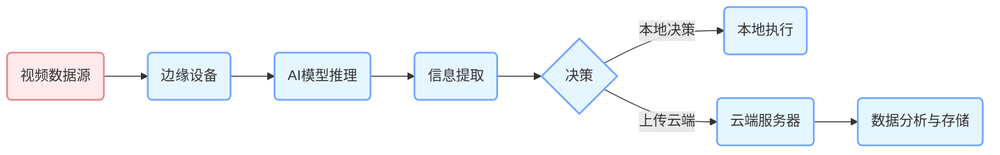

# 如何识别企业的边缘AI视频分析优势

> 关键词：企业、边缘AI、视频分析、优势识别、人工智能、计算机视觉、数据分析

> 摘要：本文围绕如何识别企业的边缘AI视频分析优势展开。首先介绍了边缘AI视频分析的背景知识，包括其目的、适用读者等。接着阐述了核心概念与联系，深入剖析其原理和架构，并通过Mermaid流程图展示。详细讲解了核心算法原理，用Python代码进行了具体操作步骤的说明。从数学模型和公式的角度对其进行深入分析，并举例说明。通过项目实战，展示代码实际案例并进行详细解释。探讨了实际应用场景，推荐了相关的工具和资源。最后总结未来发展趋势与挑战，给出常见问题解答和参考资料，旨在帮助读者全面、深入地了解如何识别企业在边缘AI视频分析方面的优势。

## 1. 背景介绍 
### 1.1 目的和范围
边缘AI视频分析作为一种新兴的技术，在企业的各个领域展现出巨大的潜力。本文章的目的在于帮助读者全面、深入地了解如何识别企业在边缘AI视频分析方面的优势。范围涵盖边缘AI视频分析的基本概念、核心算法、数学模型、实际应用场景等多个方面，旨在为读者提供一个系统的知识体系，以便能够准确、客观地评估企业在这一领域的优势。

### 1.2 预期读者
本文预期读者包括企业管理人员、技术决策者、AI和视频分析领域的从业者、研究人员以及对边缘AI视频分析感兴趣的爱好者。企业管理人员可以通过本文了解边缘AI视频分析对企业的价值，从而更好地做出战略决策；技术决策者可以获取技术细节，以便在项目中进行技术选型；从业者和研究人员可以深入了解相关技术，拓展自己的知识领域；爱好者可以通过本文初步了解边缘AI视频分析的相关知识。

### 1.3 文档结构概述
本文首先介绍边缘AI视频分析的背景知识，包括目的、预期读者等。接着阐述核心概念与联系，展示其原理和架构。详细讲解核心算法原理，并给出Python代码示例。从数学模型和公式的角度进行深入分析，并举例说明。通过项目实战，展示代码实际案例并进行详细解释。探讨实际应用场景，推荐相关的工具和资源。最后总结未来发展趋势与挑战，给出常见问题解答和参考资料。

### 1.4 术语表
#### 1.4.1 核心术语定义
- **边缘AI（Edge AI）**：将人工智能技术与边缘计算相结合，在靠近数据源的边缘设备上进行数据处理和分析，减少数据传输延迟，提高系统的实时性和效率。
- **视频分析（Video Analysis）**：对视频内容进行处理、分析和理解，提取有用的信息，如目标检测、行为识别、事件预警等。
- **边缘设备（Edge Device）**：位于网络边缘的设备，如摄像头、传感器、网关等，能够进行数据采集和初步处理。
- **AI模型（AI Model）**：用于实现人工智能任务的数学模型，如卷积神经网络（CNN）、循环神经网络（RNN）等。

#### 1.4.2 相关概念解释
- **边缘计算（Edge Computing）**：一种分布式计算范式，将计算和数据存储靠近数据源，减少数据传输到云端的需求，降低延迟，提高系统的响应速度和可靠性。
- **计算机视觉（Computer Vision）**：人工智能的一个分支，研究如何使计算机能够“看”，即从图像或视频中提取信息，进行分析和理解。
- **深度学习（Deep Learning）**：一种基于人工神经网络的机器学习方法，通过多层神经网络自动学习数据的特征和模式，在图像识别、语音识别等领域取得了显著的成果。

#### 1.4.3 缩略词列表
- **CNN（Convolutional Neural Network）**：卷积神经网络
- **RNN（Recurrent Neural Network）**：循环神经网络
- **GPU（Graphics Processing Unit）**：图形处理器
- **CPU（Central Processing Unit）**：中央处理器

## 2. 核心概念与联系 

### 边缘AI视频分析的原理
边缘AI视频分析结合了边缘计算和人工智能技术，其原理是在边缘设备上对视频数据进行实时处理和分析。边缘设备首先采集视频数据，然后利用预先训练好的AI模型对视频中的内容进行分析，提取有用的信息，如目标的位置、类别、行为等。这些信息可以直接在边缘设备上进行处理和决策，也可以将部分结果传输到云端进行进一步的分析和存储。

### 架构示意图


### 核心概念联系
边缘AI视频分析涉及多个核心概念，它们之间相互关联、相互影响。边缘计算为视频分析提供了低延迟、高可靠性的计算环境，使得视频数据能够在本地进行快速处理。人工智能技术，特别是深度学习，为视频分析提供了强大的算法支持，能够准确地识别视频中的目标和行为。视频分析则是边缘AI的具体应用场景，通过对视频数据的分析，为企业提供有价值的信息和决策依据。

## 3. 核心算法原理 & 具体操作步骤 

### 目标检测算法原理
目标检测是边缘AI视频分析中常用的算法之一，其目的是在视频帧中检测出感兴趣的目标，并确定其位置和类别。常用的目标检测算法有基于深度学习的Faster R-CNN、YOLO等。

以YOLO（You Only Look Once）算法为例，其核心思想是将目标检测问题转化为一个回归问题。YOLO算法将输入的图像划分为多个网格，每个网格负责预测目标的边界框、置信度和类别。具体步骤如下：
1. **图像划分**：将输入的图像划分为 $S\times S$ 个网格。
2. **边界框预测**：每个网格预测 $B$ 个边界框，每个边界框包含四个坐标值 $(x, y, w, h)$，分别表示边界框的中心坐标、宽度和高度。
3. **置信度预测**：每个边界框预测一个置信度，表示该边界框中是否包含目标以及预测的准确性。
4. **类别预测**：每个网格预测 $C$ 个类别概率，表示该网格中目标的类别。

### Python代码实现
```python
import cv2
import numpy as np

# 加载YOLO模型
net = cv2.dnn.readNet('yolov3.weights', 'yolov3.cfg')

# 加载类别名称
classes = []
with open('coco.names', 'r') as f:
    classes = [line.strip() for line in f.readlines()]

# 获取输出层名称
layer_names = net.getLayerNames()
output_layers = [layer_names[i[0] - 1] for i in net.getUnconnectedOutLayers()]

# 读取视频
cap = cv2.VideoCapture('video.mp4')

while True:
    ret, frame = cap.read()
    if not ret:
        break

    height, width, channels = frame.shape

    # 图像预处理
    blob = cv2.dnn.blobFromImage(frame, 0.00392, (416, 416), (0, 0, 0), True, crop=False)
    net.setInput(blob)

    # 前向传播
    outs = net.forward(output_layers)

    # 初始化变量
    class_ids = []
    confidences = []
    boxes = []

    # 解析输出结果
    for out in outs:
        for detection in out:
            scores = detection[5:]
            class_id = np.argmax(scores)
            confidence = scores[class_id]
            if confidence > 0.5:
                # 目标检测
                center_x = int(detection[0] * width)
                center_y = int(detection[1] * height)
                w = int(detection[2] * width)
                h = int(detection[3] * height)

                # 计算边界框坐标
                x = int(center_x - w / 2)
                y = int(center_y - h / 2)

                boxes.append([x, y, w, h])
                confidences.append(float(confidence))
                class_ids.append(class_id)

    # 非极大值抑制
    indexes = cv2.dnn.NMSBoxes(boxes, confidences, 0.5, 0.4)

    # 绘制边界框和标签
    font = cv2.FONT_HERSHEY_PLAIN
    colors = np.random.uniform(0, 255, size=(len(classes), 3))
    if len(indexes) > 0:
        for i in indexes.flatten():
            x, y, w, h = boxes[i]
            label = str(classes[class_ids[i]])
            confidence = str(round(confidences[i], 2))
            color = colors[class_ids[i]]
            cv2.rectangle(frame, (x, y), (x + w, y + h), color, 2)
            cv2.putText(frame, label + " " + confidence, (x, y + 20), font, 2, color, 2)

    # 显示结果
    cv2.imshow('Object Detection', frame)
    if cv2.waitKey(1) & 0xFF == ord('q'):
        break

# 释放资源
cap.release()
cv2.destroyAllWindows()
```

### 具体操作步骤
1. **模型加载**：加载预训练的YOLO模型和类别名称。
2. **视频读取**：使用OpenCV读取视频文件。
3. **图像预处理**：将视频帧转换为适合模型输入的格式。
4. **前向传播**：将预处理后的图像输入到模型中，进行前向传播，得到输出结果。
5. **结果解析**：解析输出结果，提取目标的边界框、置信度和类别。
6. **非极大值抑制**：去除重叠的边界框，保留置信度最高的边界框。
7. **绘制边界框和标签**：在视频帧上绘制目标的边界框和标签。
8. **显示结果**：显示处理后的视频帧。

## 4. 数学模型和公式 & 详细讲解 & 举例说明 

### 损失函数
在目标检测算法中，损失函数用于衡量模型预测结果与真实标签之间的差异，从而指导模型的训练。以YOLO算法为例，其损失函数由多个部分组成，包括边界框坐标损失、置信度损失和类别损失。

#### 边界框坐标损失
边界框坐标损失用于衡量预测的边界框坐标与真实边界框坐标之间的差异。常用的损失函数是均方误差（MSE），其公式如下：
$$
L_{coord} = \lambda_{coord} \sum_{i=0}^{S^2} \sum_{j=0}^{B} \mathbb{1}_{ij}^{obj} \left[ (x_i - \hat{x}_i)^2 + (y_i - \hat{y}_i)^2 \right] + \lambda_{coord} \sum_{i=0}^{S^2} \sum_{j=0}^{B} \mathbb{1}_{ij}^{obj} \left[ (\sqrt{w_i} - \sqrt{\hat{w}_i})^2 + (\sqrt{h_i} - \sqrt{\hat{h}_i})^2 \right]
$$
其中，$\lambda_{coord}$ 是边界框坐标损失的权重，$\mathbb{1}_{ij}^{obj}$ 表示第 $i$ 个网格的第 $j$ 个边界框是否包含目标，$(x_i, y_i, w_i, h_i)$ 是真实边界框的坐标，$(\hat{x}_i, \hat{y}_i, \hat{w}_i, \hat{h}_i)$ 是预测边界框的坐标。

#### 置信度损失
置信度损失用于衡量预测的置信度与真实置信度之间的差异。常用的损失函数是二元交叉熵损失，其公式如下：
$$
L_{conf} = \sum_{i=0}^{S^2} \sum_{j=0}^{B} \mathbb{1}_{ij}^{obj} (C_i - \hat{C}_i)^2 + \lambda_{noobj} \sum_{i=0}^{S^2} \sum_{j=0}^{B} \mathbb{1}_{ij}^{noobj} (C_i - \hat{C}_i)^2
$$
其中，$\lambda_{noobj}$ 是不包含目标的边界框置信度损失的权重，$\mathbb{1}_{ij}^{noobj}$ 表示第 $i$ 个网格的第 $j$ 个边界框是否不包含目标，$C_i$ 是真实置信度，$\hat{C}_i$ 是预测置信度。

#### 类别损失
类别损失用于衡量预测的类别概率与真实类别概率之间的差异。常用的损失函数是交叉熵损失，其公式如下：
$$
L_{class} = \sum_{i=0}^{S^2} \mathbb{1}_{i}^{obj} \sum_{c \in classes} (p_i(c) - \hat{p}_i(c))^2
$$
其中，$\mathbb{1}_{i}^{obj}$ 表示第 $i$ 个网格是否包含目标，$p_i(c)$ 是真实类别概率，$\hat{p}_i(c)$ 是预测类别概率。

### 整体损失函数
YOLO算法的整体损失函数是边界框坐标损失、置信度损失和类别损失的加权和，其公式如下：
$$
L = L_{coord} + L_{conf} + L_{class}
$$

### 举例说明
假设我们有一个 $7\times7$ 的网格，每个网格预测 2 个边界框，共有 20 个类别。对于一个包含目标的网格，其真实边界框坐标为 $(0.5, 0.6, 0.3, 0.4)$，真实置信度为 1，真实类别为“person”。模型预测的边界框坐标为 $(0.45, 0.65, 0.25, 0.35)$，预测置信度为 0.9，预测类别概率为 $(0.1, 0.2, \cdots, 0.8, \cdots, 0.1)$，其中第 15 个类别概率为 0.8。

#### 边界框坐标损失
$$
\begin{align*}
L_{coord} &= \lambda_{coord} \left[ (0.5 - 0.45)^2 + (0.6 - 0.65)^2 + (\sqrt{0.3} - \sqrt{0.25})^2 + (\sqrt{0.4} - \sqrt{0.35})^2 \right] \\
&= 5 \times (0.0025 + 0.0025 + 0.005 + 0.003) \\
&= 5 \times 0.013 \\
&= 0.065
\end{align*}
$$

#### 置信度损失
$$
\begin{align*}
L_{conf} &= (1 - 0.9)^2 \\
&= 0.01
\end{align*}
$$

#### 类别损失
$$
\begin{align*}
L_{class} &= (0 - 0.1)^2 + \cdots + (1 - 0.8)^2 + \cdots + (0 - 0.1)^2 \\
&= 0.01 \times 19 + 0.04 \\
&= 0.23
\end{align*}
$$

#### 整体损失函数
$$
\begin{align*}
L &= L_{coord} + L_{conf} + L_{class} \\
&= 0.065 + 0.01 + 0.23 \\
&= 0.305
\end{align*}
$$

## 5. 项目实战：代码实际案例和详细解释说明 

### 5.1  开发环境搭建
#### 安装Python
首先需要安装Python，建议使用Python 3.7及以上版本。可以从Python官方网站（https://www.python.org/downloads/）下载并安装。

#### 安装依赖库
需要安装OpenCV、NumPy等依赖库，可以使用pip命令进行安装：
```sh
pip install opencv-python numpy
```

#### 下载YOLO模型和类别名称文件
从YOLO官方网站（https://pjreddie.com/darknet/yolo/）下载预训练的YOLO模型（如yolov3.weights、yolov3.cfg）和类别名称文件（coco.names）。

### 5.2  源代码详细实现和代码解读
```python
import cv2
import numpy as np

# 加载YOLO模型
net = cv2.dnn.readNet('yolov3.weights', 'yolov3.cfg')

# 加载类别名称
classes = []
with open('coco.names', 'r') as f:
    classes = [line.strip() for line in f.readlines()]

# 获取输出层名称
layer_names = net.getLayerNames()
output_layers = [layer_names[i[0] - 1] for i in net.getUnconnectedOutLayers()]

# 读取视频
cap = cv2.VideoCapture('video.mp4')

while True:
    ret, frame = cap.read()
    if not ret:
        break

    height, width, channels = frame.shape

    # 图像预处理
    blob = cv2.dnn.blobFromImage(frame, 0.00392, (416, 416), (0, 0, 0), True, crop=False)
    net.setInput(blob)

    # 前向传播
    outs = net.forward(output_layers)

    # 初始化变量
    class_ids = []
    confidences = []
    boxes = []

    # 解析输出结果
    for out in outs:
        for detection in out:
            scores = detection[5:]
            class_id = np.argmax(scores)
            confidence = scores[class_id]
            if confidence > 0.5:
                # 目标检测
                center_x = int(detection[0] * width)
                center_y = int(detection[1] * height)
                w = int(detection[2] * width)
                h = int(detection[3] * height)

                # 计算边界框坐标
                x = int(center_x - w / 2)
                y = int(center_y - h / 2)

                boxes.append([x, y, w, h])
                confidences.append(float(confidence))
                class_ids.append(class_id)

    # 非极大值抑制
    indexes = cv2.dnn.NMSBoxes(boxes, confidences, 0.5, 0.4)

    # 绘制边界框和标签
    font = cv2.FONT_HERSHEY_PLAIN
    colors = np.random.uniform(0, 255, size=(len(classes), 3))
    if len(indexes) > 0:
        for i in indexes.flatten():
            x, y, w, h = boxes[i]
            label = str(classes[class_ids[i]])
            confidence = str(round(confidences[i], 2))
            color = colors[class_ids[i]]
            cv2.rectangle(frame, (x, y), (x + w, y + h), color, 2)
            cv2.putText(frame, label + " " + confidence, (x, y + 20), font, 2, color, 2)

    # 显示结果
    cv2.imshow('Object Detection', frame)
    if cv2.waitKey(1) & 0xFF == ord('q'):
        break

# 释放资源
cap.release()
cv2.destroyAllWindows()
```

### 代码解读与分析
1. **模型加载**：使用 `cv2.dnn.readNet` 函数加载预训练的YOLO模型和配置文件。
2. **类别名称加载**：从 `coco.names` 文件中读取类别名称。
3. **输出层名称获取**：使用 `net.getUnconnectedOutLayers` 函数获取模型的输出层名称。
4. **视频读取**：使用 `cv2.VideoCapture` 函数读取视频文件。
5. **图像预处理**：使用 `cv2.dnn.blobFromImage` 函数将视频帧转换为适合模型输入的格式。
6. **前向传播**：使用 `net.forward` 函数进行前向传播，得到模型的输出结果。
7. **结果解析**：遍历输出结果，提取目标的边界框、置信度和类别。
8. **非极大值抑制**：使用 `cv2.dnn.NMSBoxes` 函数去除重叠的边界框，保留置信度最高的边界框。
9. **绘制边界框和标签**：使用 `cv2.rectangle` 和 `cv2.putText` 函数在视频帧上绘制目标的边界框和标签。
10. **显示结果**：使用 `cv2.imshow` 函数显示处理后的视频帧。
11. **资源释放**：使用 `cap.release` 和 `cv2.destroyAllWindows` 函数释放资源。

## 6. 实际应用场景 
### 安防监控
边缘AI视频分析在安防监控领域有着广泛的应用。通过在监控摄像头等边缘设备上进行实时视频分析，可以实现目标检测、行为识别、事件预警等功能。例如，在公共场所的监控系统中，可以实时检测人员的行为，如奔跑、摔倒、打架等，及时发出预警信息，提高安全防范能力。

### 智能交通
在智能交通领域，边缘AI视频分析可以用于交通流量监测、车辆识别、违章行为检测等。通过在路口的摄像头等边缘设备上进行实时视频分析，可以实时获取交通流量信息，优化交通信号控制，提高交通效率。同时，可以识别车辆的类型、车牌号码等信息，检测车辆的违章行为，如闯红灯、超速行驶等。

### 工业制造
在工业制造领域，边缘AI视频分析可以用于产品质量检测、设备状态监测等。通过在生产线上的摄像头等边缘设备上进行实时视频分析，可以实时检测产品的外观缺陷、尺寸偏差等质量问题，提高产品质量。同时，可以监测设备的运行状态，及时发现设备故障，减少停机时间。

### 零售行业
在零售行业，边缘AI视频分析可以用于顾客行为分析、商品陈列优化等。通过在店铺内的摄像头等边缘设备上进行实时视频分析，可以实时获取顾客的行为信息，如顾客的停留时间、浏览路径、购买行为等，为商家提供决策依据，优化商品陈列和营销策略。

## 7. 工具和资源推荐
### 7.1 学习资源推荐
#### 7.1.1 书籍推荐
- 《深度学习》（Deep Learning）：由Ian Goodfellow、Yoshua Bengio和Aaron Courville撰写，是深度学习领域的经典教材，系统地介绍了深度学习的基本概念、算法和应用。
- 《计算机视觉：算法与应用》（Computer Vision: Algorithms and Applications）：由Richard Szeliski撰写，全面介绍了计算机视觉的基本算法和应用，包括图像滤波、特征提取、目标检测、图像分割等。
- 《Python计算机视觉编程》（Programming Computer Vision with Python）：由Jan Erik Solem撰写，通过Python代码示例介绍了计算机视觉的基本算法和应用，适合初学者学习。

#### 7.1.2 在线课程
- Coursera上的“深度学习专项课程”（Deep Learning Specialization）：由Andrew Ng教授授课，系统地介绍了深度学习的基本概念、算法和应用，包括神经网络、卷积神经网络、循环神经网络等。
- edX上的“计算机视觉基础”（Foundations of Computer Vision）：由Berkeley大学的Jitendra Malik教授授课，全面介绍了计算机视觉的基本算法和应用，包括图像滤波、特征提取、目标检测、图像分割等。
- 哔哩哔哩（Bilibili）上的相关教程：有许多关于边缘AI、视频分析等方面的教程，由一些技术博主分享，内容丰富、生动易懂。

#### 7.1.3 技术博客和网站
- Medium：是一个技术博客平台，有许多关于边缘AI、视频分析等方面的文章，由一些技术专家和从业者分享，内容前沿、深入。
- arXiv：是一个预印本论文平台，有许多关于边缘AI、视频分析等方面的研究论文，由一些科研机构和学者分享，内容最新、权威。
- OpenCV官方文档：OpenCV是一个开源的计算机视觉库，其官方文档详细介绍了OpenCV的功能和使用方法，是学习计算机视觉的重要资源。

### 7.2 开发工具框架推荐
#### 7.2.1 IDE和编辑器
- PyCharm：是一款专门为Python开发设计的集成开发环境（IDE），具有代码编辑、调试、代码分析等功能，适合Python开发。
- Visual Studio Code：是一款轻量级的代码编辑器，支持多种编程语言，具有丰富的插件和扩展功能，适合快速开发和调试。
- Jupyter Notebook：是一个交互式的开发环境，支持Python、R等多种编程语言，适合数据探索、模型训练和实验验证。

#### 7.2.2 调试和性能分析工具
- OpenCV的调试工具：OpenCV提供了一些调试工具，如cv2.imshow、cv2.waitKey等，可以用于调试图像和视频处理代码。
- TensorBoard：是TensorFlow提供的一个可视化工具，可以用于可视化模型的训练过程、性能指标等，帮助开发者进行模型调试和优化。
- Py-Spy：是一个Python性能分析工具，可以用于分析Python代码的性能瓶颈，帮助开发者优化代码性能。

#### 7.2.3 相关框架和库
- OpenCV：是一个开源的计算机视觉库，提供了丰富的图像处理和计算机视觉算法，如图像滤波、特征提取、目标检测、图像分割等。
- TensorFlow：是一个开源的机器学习框架，提供了丰富的深度学习算法和工具，如神经网络、卷积神经网络、循环神经网络等。
- PyTorch：是一个开源的深度学习框架，提供了动态计算图和自动求导等功能，适合快速开发和实验验证。

### 7.3 相关论文著作推荐
#### 7.3.1 经典论文
- “You Only Look Once: Unified, Real-Time Object Detection”：介绍了YOLO算法的原理和实现，是目标检测领域的经典论文。
- “Faster R-CNN: Towards Real-Time Object Detection with Region Proposal Networks”：介绍了Faster R-CNN算法的原理和实现，是目标检测领域的重要论文。
- “ImageNet Classification with Deep Convolutional Neural Networks”：介绍了AlexNet算法的原理和实现，是深度学习在图像分类领域的开创性论文。

#### 7.3.2 最新研究成果
- 关注顶级学术会议，如CVPR（计算机视觉与模式识别会议）、ICCV（国际计算机视觉会议）、ECCV（欧洲计算机视觉会议）等，这些会议上有许多关于边缘AI、视频分析等方面的最新研究成果。
- 关注顶级学术期刊，如IEEE Transactions on Pattern Analysis and Machine Intelligence（PAMI）、International Journal of Computer Vision（IJCV）等，这些期刊上有许多关于边缘AI、视频分析等方面的高质量研究论文。

#### 7.3.3 应用案例分析
- 关注一些知名企业的技术博客和案例分享，如谷歌、微软、亚马逊等，这些企业在边缘AI、视频分析等方面有许多成功的应用案例，可以从中学习到实际应用中的经验和技巧。
- 关注一些行业报告和研究机构的分析报告，如Gartner、IDC等，这些报告可以提供关于边缘AI、视频分析等方面的市场趋势和应用案例分析。

## 8. 总结：未来发展趋势与挑战
### 未来发展趋势
- **算法优化**：未来，边缘AI视频分析的算法将不断优化，提高检测精度和效率。例如，采用更先进的深度学习架构，如Transformer、Vision Transformer等，提高目标检测、行为识别等任务的性能。
- **多模态融合**：将视频分析与其他传感器数据，如音频、雷达、激光雷达等进行融合，实现多模态分析，提高对场景的理解和感知能力。例如，在安防监控中，结合视频和音频数据，实现对声音来源和内容的分析，提高安全防范能力。
- **边缘计算能力提升**：随着边缘设备硬件性能的不断提升，边缘计算能力将不断增强，能够支持更复杂的AI模型和算法。例如，采用更强大的GPU、FPGA等硬件设备，提高边缘设备的计算能力和处理速度。
- **应用场景拓展**：边缘AI视频分析的应用场景将不断拓展，除了安防监控、智能交通、工业制造、零售行业等领域，还将应用于医疗、教育、农业等领域。例如，在医疗领域，用于疾病诊断、手术辅助等；在教育领域，用于课堂行为分析、教学质量评估等。

### 挑战
- **数据隐私和安全**：边缘AI视频分析涉及大量的视频数据，这些数据包含个人隐私信息，如面部特征、行为习惯等。如何保护数据的隐私和安全，防止数据泄露和滥用，是一个重要的挑战。
- **模型优化和部署**：边缘设备的计算资源和存储资源有限，如何在有限的资源下优化AI模型，提高模型的效率和性能，并将模型部署到边缘设备上，是一个技术难题。
- **标准和规范缺失**：目前，边缘AI视频分析领域还缺乏统一的标准和规范，导致不同企业的产品和解决方案之间存在兼容性问题，影响了行业的发展。
- **人才短缺**：边缘AI视频分析是一个新兴的领域，需要具备计算机视觉、人工智能、边缘计算等多方面知识的复合型人才。目前，相关领域的人才短缺，制约了行业的发展。

## 9. 附录：常见问题与解答
### 1. 边缘AI视频分析与传统视频分析有什么区别？
传统视频分析通常将视频数据传输到云端进行处理和分析，存在数据传输延迟、带宽压力大等问题。边缘AI视频分析则将人工智能技术与边缘计算相结合，在靠近数据源的边缘设备上进行数据处理和分析，减少数据传输延迟，提高系统的实时性和效率。

### 2. 如何选择适合的边缘设备？
选择适合的边缘设备需要考虑以下因素：
- **计算能力**：根据应用场景的需求，选择具有足够计算能力的边缘设备，以支持AI模型的运行。
- **存储容量**：根据视频数据的存储需求，选择具有足够存储容量的边缘设备。
- **网络连接**：根据应用场景的网络环境，选择具有合适网络连接方式的边缘设备，如有线网络、无线网络等。
- **功耗**：根据应用场景的需求，选择功耗较低的边缘设备，以降低运行成本。

### 3. 如何优化边缘AI视频分析的性能？
可以从以下几个方面优化边缘AI视频分析的性能：
- **模型优化**：采用更轻量级的AI模型，减少模型的计算量和存储量。
- **算法优化**：采用更高效的算法，提高目标检测、行为识别等任务的效率。
- **硬件加速**：采用GPU、FPGA等硬件设备，加速AI模型的推理过程。
- **数据预处理**：在边缘设备上进行数据预处理，减少数据传输量和计算量。

### 4. 边缘AI视频分析的应用前景如何？
边缘AI视频分析具有广阔的应用前景，在安防监控、智能交通、工业制造、零售行业等领域已经得到了广泛的应用。随着技术的不断发展和应用场景的不断拓展，边缘AI视频分析将在更多领域发挥重要作用，为企业和社会带来更大的价值。

## 10. 扩展阅读 & 参考资料
- 《人工智能：一种现代的方法》（Artificial Intelligence: A Modern Approach），作者：Stuart Russell、Peter Norvig
- 《深度学习入门：基于Python的理论与实现》（Deep Learning from Scratch），作者：斋藤康毅
- OpenCV官方文档：https://docs.opencv.org/
- TensorFlow官方文档：https://www.tensorflow.org/
- PyTorch官方文档：https://pytorch.org/
- CVPR会议论文集：https://openaccess.thecvf.com/CVPR
- ICCV会议论文集：https://openaccess.thecvf.com/ICCV
- ECCV会议论文集：https://www.ecva.net/
- IEEE Transactions on Pattern Analysis and Machine Intelligence（PAMI）期刊：https://ieeexplore.ieee.org/xpl/RecentIssue.jsp?punumber=34
- International Journal of Computer Vision（IJCV）期刊：https://link.springer.com/journal/11263