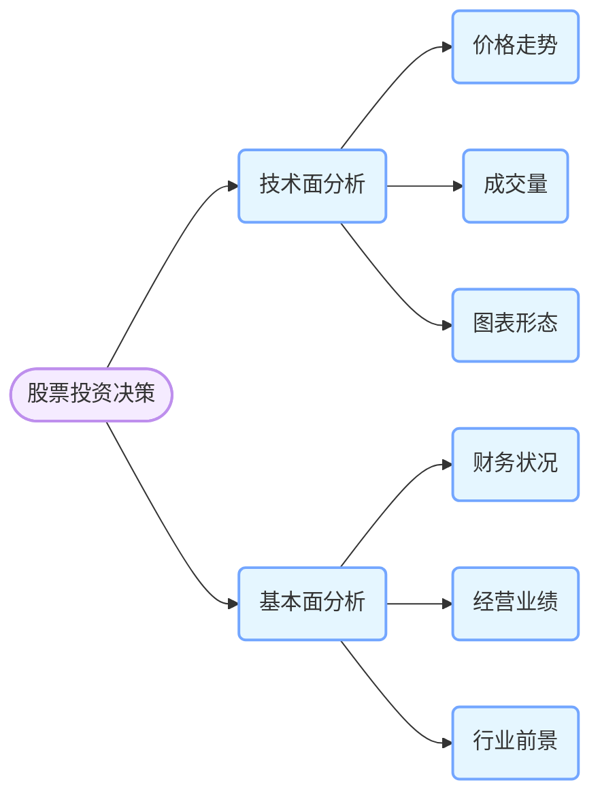

# 威廉·欧奈尔的技术面与基本面结合策略

> 关键词：威廉·欧奈尔、技术面分析、基本面分析、投资策略、股票投资、CAN SLIM 法则、成长股投资

> 摘要：本文深入探讨了威廉·欧奈尔所提出的技术面与基本面结合的投资策略。威廉·欧奈尔作为投资领域的传奇人物，其 CAN SLIM 法则影响深远。文章首先介绍该策略的背景，包括目的、预期读者等内容。接着阐述核心概念，即技术面与基本面的内涵及联系，并以文本示意图和 Mermaid 流程图呈现。然后详细讲解核心算法原理，用 Python 代码阐述操作步骤，同时给出相关数学模型和公式并举例说明。通过项目实战展示代码实际案例及解读，分析其在实际应用场景中的作用。还推荐了学习该策略的工具和资源，最后总结其未来发展趋势与挑战，解答常见问题并提供扩展阅读和参考资料，旨在为投资者全面剖析这一实用的投资策略。

## 1. 背景介绍 
### 1.1 目的和范围
威廉·欧奈尔的技术面与基本面结合策略旨在为投资者提供一种全面且有效的投资决策方法。该策略的目的在于帮助投资者筛选出具有高成长潜力的股票，从而在股票市场中获取超额收益。其范围涵盖了股票投资的各个环节，从股票的筛选、分析到最终的投资决策制定。它不仅仅适用于专业投资者，对于普通的个人投资者也具有重要的指导意义。该策略通过综合考虑公司的基本面因素（如盈利、销售额等）和技术面因素（如股价走势、成交量等），试图在众多股票中找到那些真正具有投资价值的标的。

### 1.2 预期读者
本文的预期读者主要包括对股票投资感兴趣的个人投资者、金融专业的学生以及从事投资分析工作的专业人士。对于个人投资者来说，该策略可以帮助他们在复杂的股票市场中找到适合自己的投资方向，提高投资成功率。金融专业的学生可以通过学习该策略，加深对股票投资理论和实践的理解，为未来的职业发展打下坚实的基础。专业的投资分析人士则可以将该策略作为一种参考，进一步完善自己的投资分析体系，提高投资决策的准确性。

### 1.3 文档结构概述
本文将按照以下结构进行阐述：首先介绍威廉·欧奈尔技术面与基本面结合策略的背景信息，包括目的、预期读者等。接着深入探讨该策略的核心概念，解释技术面和基本面的原理以及它们之间的联系，并通过文本示意图和 Mermaid 流程图进行直观展示。然后详细讲解该策略的核心算法原理，并使用 Python 代码给出具体的操作步骤。之后介绍相关的数学模型和公式，并通过举例进行说明。再通过项目实战，展示该策略在实际中的代码实现和详细解释。随后介绍该策略的实际应用场景，以及为读者推荐学习该策略的工具和资源。最后总结该策略的未来发展趋势与挑战，解答常见问题并提供扩展阅读和参考资料。

### 1.4 术语表
#### 1.4.1 核心术语定义
- **技术面分析**：通过研究股票的价格、成交量、图表形态等市场数据，来预测股票未来价格走势的分析方法。它主要关注市场的供求关系和投资者的心理因素。
- **基本面分析**：通过研究公司的财务状况、经营业绩、行业前景等基本信息，来评估公司的内在价值和投资价值的分析方法。它主要关注公司的实际经营情况和发展潜力。
- **CAN SLIM 法则**：威廉·欧奈尔提出的一套选股法则，包括 C（当前季度的盈利）、A（年收益增长率）、N（新产品、新管理、股价创新高）、S（供给与需求）、L（领军者或拖油瓶）、I（机构投资者的认同）、M（市场走势）。
- **成长股**：指那些销售额和利润持续增长，并且其增长速度快于整个行业平均水平的股票。成长股通常具有较高的投资价值，但也伴随着较高的风险。

#### 1.4.2 相关概念解释
- **股价走势**：指股票价格在一段时间内的变化情况。股价走势可以分为上升趋势、下降趋势和横盘整理趋势。通过分析股价走势，可以判断股票的强弱和未来的发展方向。
- **成交量**：指在一定时间内股票的交易数量。成交量是反映市场供求关系的重要指标，较大的成交量通常意味着市场的活跃度较高，股票的流动性较好。
- **盈利增长率**：指公司在一定时期内盈利的增长幅度。盈利增长率是衡量公司盈利能力和发展潜力的重要指标，较高的盈利增长率通常意味着公司具有较好的发展前景。
- **行业前景**：指某个行业在未来一段时间内的发展趋势和市场潜力。行业前景是影响公司发展的重要因素，处于前景较好行业的公司通常具有更大的发展空间。

#### 1.4.3 缩略词列表
- **EPS**：Earnings Per Share，每股收益，指公司净利润与发行在外普通股股数的比值，是衡量公司盈利能力的重要指标。
- **ROE**：Return on Equity，净资产收益率，指公司净利润与净资产的比值，反映了公司运用自有资本的效率。
- **P/E**：Price-to-Earnings Ratio，市盈率，指股票价格与每股收益的比值，是衡量股票估值水平的重要指标。

## 2. 核心概念与联系 

### 技术面分析原理
技术面分析的核心思想是认为股票的价格已经反映了所有已知的信息，包括公司的基本面信息、市场的供求关系、投资者的心理因素等。因此，通过研究股票的价格、成交量、图表形态等市场数据，可以预测股票未来的价格走势。技术面分析主要基于以下几个假设：
1. 市场行为包容消化一切信息：股票的价格已经反映了所有已知的信息，包括公司的基本面信息、市场的供求关系、投资者的心理因素等。
2. 价格以趋势方式演变：股票的价格走势具有一定的趋势性，即上涨趋势、下降趋势或横盘整理趋势。趋势一旦形成，就会持续一段时间。
3. 历史会重演：股票市场的走势具有一定的规律性，历史上出现过的价格走势和市场情况可能会在未来再次出现。

### 基本面分析原理
基本面分析的核心思想是认为股票的内在价值决定了其市场价格。因此，通过研究公司的财务状况、经营业绩、行业前景等基本信息，可以评估公司的内在价值和投资价值。基本面分析主要基于以下几个方面：
1. 公司的财务状况：包括公司的资产负债表、利润表、现金流量表等财务报表，通过分析这些报表可以了解公司的盈利能力、偿债能力、运营能力等。
2. 公司的经营业绩：包括公司的销售额、净利润、盈利增长率等指标，通过分析这些指标可以了解公司的经营状况和发展潜力。
3. 行业前景：包括行业的市场规模、增长速度、竞争格局等因素，通过分析这些因素可以了解公司所处行业的发展趋势和市场潜力。

### 技术面与基本面的联系
技术面分析和基本面分析并不是相互独立的，而是相互补充的。基本面分析可以帮助投资者了解公司的内在价值和投资价值，从而筛选出具有投资潜力的股票。而技术面分析可以帮助投资者把握股票的买卖时机，从而提高投资收益。例如，当基本面分析显示某只股票具有较高的投资价值时，技术面分析可以帮助投资者确定何时买入该股票，以获得更好的投资回报。

### 文本示意图
技术面与基本面结合策略可以用以下文本示意图表示：

```plaintext
         股票投资决策
        /                \
  技术面分析           基本面分析
  /      |      \       /      |      \
价格走势 成交量 图表形态 财务状况 经营业绩 行业前景
```

### Mermaid 流程图


## 3. 核心算法原理 & 具体操作步骤 

### 核心算法原理
威廉·欧奈尔的技术面与基本面结合策略的核心算法原理是基于 CAN SLIM 法则。CAN SLIM 法则通过综合考虑公司的基本面因素和技术面因素，筛选出具有高成长潜力的股票。具体来说，CAN SLIM 法则的各个要素如下：
- **C（当前季度的盈利）**：公司当前季度的每股收益（EPS）应该有显著的增长，通常要求增长幅度在 25% 以上。
- **A（年收益增长率）**：公司的年收益增长率应该持续保持在较高水平，通常要求在过去三年中每年的收益增长率都在 25% 以上。
- **N（新产品、新管理、股价创新高）**：公司应该有新产品、新管理等积极的变化，同时股价应该创出新高。股价创新高是一个重要的技术信号，表明股票具有较强的上涨动力。
- **S（供给与需求）**：股票的供给与需求关系应该有利于股价上涨。通常要求股票的流通股本较小，同时成交量在股价上涨时应该明显放大。
- **L（领军者或拖油瓶）**：公司应该是行业的领军者，具有较强的竞争力和市场份额。行业领军者通常具有更好的发展前景和抗风险能力。
- **I（机构投资者的认同）**：应该有较多的机构投资者关注和持有该股票。机构投资者通常具有较强的研究能力和资金实力，他们的认同是股票具有投资价值的重要信号。
- **M（市场走势）**：市场整体走势应该有利于股票上涨。在牛市行情中，大多数股票都有上涨的机会，而在熊市行情中，大多数股票都会下跌。因此，投资者应该在市场走势向好时进行投资。

### 具体操作步骤
以下是使用 Python 代码实现威廉·欧奈尔的技术面与基本面结合策略的具体操作步骤：

```python
import pandas as pd
import yfinance as yf

# 步骤 1: 获取股票数据
def get_stock_data(ticker, start_date, end_date):
    data = yf.download(ticker, start=start_date, end=end_date)
    return data

# 步骤 2: 计算当前季度的盈利增长率
def calculate_current_quarter_eps_growth(data):
    # 这里假设数据中包含 EPS 信息，实际应用中需要从财务报表中获取
    eps_current_quarter = data['EPS'].iloc[-1]
    eps_previous_quarter = data['EPS'].iloc[-2]
    eps_growth = (eps_current_quarter - eps_previous_quarter) / eps_previous_quarter * 100
    return eps_growth

# 步骤 3: 计算年收益增长率
def calculate_annual_eps_growth(data):
    # 这里假设数据中包含每年的 EPS 信息，实际应用中需要从财务报表中获取
    eps_current_year = data['EPS'].iloc[-1]
    eps_three_years_ago = data['EPS'].iloc[-4]
    annual_eps_growth = ((eps_current_year / eps_three_years_ago) ** (1/3) - 1) * 100
    return annual_eps_growth

# 步骤 4: 判断股价是否创新高
def is_price_at_new_high(data):
    current_price = data['Close'].iloc[-1]
    max_price_in_history = data['Close'].max()
    return current_price == max_price_in_history

# 步骤 5: 判断成交量是否放大
def is_volume_increasing(data):
    current_volume = data['Volume'].iloc[-1]
    average_volume = data['Volume'].mean()
    return current_volume > average_volume

# 步骤 6: 综合筛选股票
def screen_stocks(ticker, start_date, end_date):
    data = get_stock_data(ticker, start_date, end_date)
    eps_growth = calculate_current_quarter_eps_growth(data)
    annual_eps_growth = calculate_annual_eps_growth(data)
    is_new_high = is_price_at_new_high(data)
    is_volume_up = is_volume_increasing(data)

    if eps_growth > 25 and annual_eps_growth > 25 and is_new_high and is_volume_up:
        return True
    else:
        return False

# 示例使用
ticker = 'AAPL'
start_date = '2020-01-01'
end_date = '2023-12-31'
result = screen_stocks(ticker, start_date, end_date)
print(f"股票 {ticker} 是否符合筛选条件: {result}")
```

### 代码解释
1. **获取股票数据**：使用 `yfinance` 库从雅虎财经获取股票的历史数据，包括开盘价、收盘价、成交量等信息。
2. **计算当前季度的盈利增长率**：通过比较当前季度和上一季度的每股收益（EPS），计算出当前季度的盈利增长率。
3. **计算年收益增长率**：通过比较当前年度和三年前的每股收益（EPS），计算出年收益增长率。
4. **判断股价是否创新高**：比较当前股价和历史最高价，如果当前股价等于历史最高价，则认为股价创新高。
5. **判断成交量是否放大**：比较当前成交量和平均成交量，如果当前成交量大于平均成交量，则认为成交量放大。
6. **综合筛选股票**：根据 CAN SLIM 法则的要求，综合考虑当前季度的盈利增长率、年收益增长率、股价是否创新高、成交量是否放大等因素，判断股票是否符合筛选条件。

## 4. 数学模型和公式 & 详细讲解 & 举例说明 

### 盈利增长率计算公式
#### 当前季度的盈利增长率
当前季度的盈利增长率可以用以下公式计算：

$$
\text{当前季度的盈利增长率} = \frac{\text{当前季度的 EPS} - \text{上一季度的 EPS}}{\text{上一季度的 EPS}} \times 100\%
$$

其中，EPS 表示每股收益。

#### 年收益增长率
年收益增长率可以用以下公式计算：

$$
\text{年收益增长率} = \left(\frac{\text{当前年度的 EPS}}{\text{三年前的 EPS}}\right)^{\frac{1}{3}} - 1 \times 100\%
$$

### 详细讲解
当前季度的盈利增长率反映了公司近期的盈利增长情况，是衡量公司短期盈利能力的重要指标。较高的当前季度盈利增长率通常意味着公司的业务发展良好，盈利能力较强。年收益增长率反映了公司长期的盈利增长情况，是衡量公司长期发展潜力的重要指标。较高的年收益增长率通常意味着公司具有较好的发展前景和增长潜力。

### 举例说明
假设某公司的每股收益数据如下：

| 时间 | 每股收益（EPS） |
| ---- | ---- |
| 上一季度 | 1.00 |
| 当前季度 | 1.25 |
| 三年前 | 0.80 |
| 当前年度 | 1.60 |

则该公司的当前季度的盈利增长率为：

$$
\text{当前季度的盈利增长率} = \frac{1.25 - 1.00}{1.00} \times 100\% = 25\%
$$

该公司的年收益增长率为：

$$
\text{年收益增长率} = \left(\frac{1.60}{0.80}\right)^{\frac{1}{3}} - 1 \times 100\% \approx 26\%
$$

## 5. 项目实战：代码实际案例和详细解释说明 

### 5.1  开发环境搭建
在进行项目实战之前，需要搭建好开发环境。以下是具体的步骤：

1. **安装 Python**：从 Python 官方网站（https://www.python.org/downloads/）下载并安装 Python 3.x 版本。
2. **安装必要的库**：使用 `pip` 命令安装必要的库，包括 `pandas` 和 `yfinance`。

```sh
pip install pandas yfinance
```

### 5.2  源代码详细实现和代码解读
以下是一个完整的项目实战代码示例，用于筛选符合威廉·欧奈尔的技术面与基本面结合策略的股票：

```python
import pandas as pd
import yfinance as yf

# 步骤 1: 获取股票数据
def get_stock_data(ticker, start_date, end_date):
    data = yf.download(ticker, start=start_date, end=end_date)
    return data

# 步骤 2: 计算当前季度的盈利增长率
def calculate_current_quarter_eps_growth(data):
    # 这里假设数据中包含 EPS 信息，实际应用中需要从财务报表中获取
    eps_current_quarter = data['EPS'].iloc[-1]
    eps_previous_quarter = data['EPS'].iloc[-2]
    eps_growth = (eps_current_quarter - eps_previous_quarter) / eps_previous_quarter * 100
    return eps_growth

# 步骤 3: 计算年收益增长率
def calculate_annual_eps_growth(data):
    # 这里假设数据中包含每年的 EPS 信息，实际应用中需要从财务报表中获取
    eps_current_year = data['EPS'].iloc[-1]
    eps_three_years_ago = data['EPS'].iloc[-4]
    annual_eps_growth = ((eps_current_year / eps_three_years_ago) ** (1/3) - 1) * 100
    return annual_eps_growth

# 步骤 4: 判断股价是否创新高
def is_price_at_new_high(data):
    current_price = data['Close'].iloc[-1]
    max_price_in_history = data['Close'].max()
    return current_price == max_price_in_history

# 步骤 5: 判断成交量是否放大
def is_volume_increasing(data):
    current_volume = data['Volume'].iloc[-1]
    average_volume = data['Volume'].mean()
    return current_volume > average_volume

# 步骤 6: 综合筛选股票
def screen_stocks(ticker, start_date, end_date):
    data = get_stock_data(ticker, start_date, end_date)
    eps_growth = calculate_current_quarter_eps_growth(data)
    annual_eps_growth = calculate_annual_eps_growth(data)
    is_new_high = is_price_at_new_high(data)
    is_volume_up = is_volume_increasing(data)

    if eps_growth > 25 and annual_eps_growth > 25 and is_new_high and is_volume_up:
        return True
    else:
        return False

# 步骤 7: 批量筛选股票
def batch_screen_stocks(tickers, start_date, end_date):
    results = {}
    for ticker in tickers:
        result = screen_stocks(ticker, start_date, end_date)
        results[ticker] = result
    return results

# 示例使用
tickers = ['AAPL', 'MSFT', 'GOOG']
start_date = '2020-01-01'
end_date = '2023-12-31'
results = batch_screen_stocks(tickers, start_date, end_date)
for ticker, result in results.items():
    print(f"股票 {ticker} 是否符合筛选条件: {result}")
```

### 5.3  代码解读与分析
1. **获取股票数据**：`get_stock_data` 函数使用 `yfinance` 库从雅虎财经获取指定股票在指定时间段内的历史数据。
2. **计算盈利增长率**：`calculate_current_quarter_eps_growth` 函数和 `calculate_annual_eps_growth` 函数分别计算当前季度的盈利增长率和年收益增长率。需要注意的是，实际应用中需要从财务报表中获取每股收益（EPS）信息。
3. **判断股价是否创新高**：`is_price_at_new_high` 函数比较当前股价和历史最高价，如果当前股价等于历史最高价，则认为股价创新高。
4. **判断成交量是否放大**：`is_volume_increasing` 函数比较当前成交量和平均成交量，如果当前成交量大于平均成交量，则认为成交量放大。
5. **综合筛选股票**：`screen_stocks` 函数根据 CAN SLIM 法则的要求，综合考虑当前季度的盈利增长率、年收益增长率、股价是否创新高、成交量是否放大等因素，判断股票是否符合筛选条件。
6. **批量筛选股票**：`batch_screen_stocks` 函数可以批量筛选多个股票，返回每个股票是否符合筛选条件的结果。

## 6. 实际应用场景 
### 个人投资者
对于个人投资者来说，威廉·欧奈尔的技术面与基本面结合策略可以帮助他们在众多股票中筛选出具有高成长潜力的股票，从而提高投资成功率。个人投资者可以使用该策略进行长期投资，通过持有优质股票获取长期的投资收益。例如，个人投资者可以根据该策略筛选出一些科技行业的成长股，长期持有，分享科技行业发展带来的红利。

### 机构投资者
对于机构投资者来说，该策略可以作为一种投资分析工具，帮助他们制定投资策略和资产配置方案。机构投资者通常具有较强的研究能力和资金实力，他们可以使用该策略对大量的股票进行筛选和分析，找出那些具有投资价值的股票，然后进行投资组合的构建。例如，基金公司可以使用该策略筛选出一些优质的股票，构建投资组合，为投资者提供更好的投资回报。

### 投资顾问
对于投资顾问来说，该策略可以作为一种投资建议的依据，帮助他们为客户提供专业的投资建议。投资顾问可以根据客户的风险偏好和投资目标，使用该策略为客户筛选出适合的股票，并提供相应的投资建议。例如，投资顾问可以为风险偏好较高的客户推荐一些成长型股票，为风险偏好较低的客户推荐一些价值型股票。

## 7. 工具和资源推荐
### 7.1 学习资源推荐
#### 7.1.1 书籍推荐
- 《笑傲股市》（How to Make Money in Stocks）：威廉·欧奈尔的经典著作，详细介绍了 CAN SLIM 法则和他的投资理念，是学习该策略的必读之书。
- 《股票大作手回忆录》（Reminiscences of a Stock Operator）：讲述了华尔街传奇交易员杰西·利弗莫尔的交易生涯和投资经验，对于理解股票市场和投资策略具有重要的参考价值。
- 《聪明的投资者》（The Intelligent Investor）：本杰明·格雷厄姆的经典著作，介绍了价值投资的理念和方法，对于理解基本面分析具有重要的指导意义。

#### 7.1.2 在线课程
- Coursera 上的“Investment Management Specialization”：该课程由哥伦比亚大学教授授课，介绍了投资管理的基本理论和方法，包括基本面分析、技术面分析等内容。
- Udemy 上的“Stock Market Investing for Beginners”：该课程适合初学者，介绍了股票市场的基本知识和投资策略，包括威廉·欧奈尔的技术面与基本面结合策略。

#### 7.1.3 技术博客和网站
- 欧奈尔官方网站（https://www.investors.com/）：提供了威廉·欧奈尔的投资理念、研究报告、选股工具等资源，是学习该策略的重要网站。
- 雪球网（https://xueqiu.com/）：国内知名的投资社区，提供了丰富的股票资讯、研究报告和投资者交流平台，可以帮助投资者了解市场动态和学习投资策略。

### 7.2 开发工具框架推荐
#### 7.2.1 IDE和编辑器
- PyCharm：一款专业的 Python 集成开发环境，提供了丰富的代码编辑、调试、版本控制等功能，适合开发 Python 程序。
- Visual Studio Code：一款轻量级的代码编辑器，支持多种编程语言，具有丰富的插件生态系统，可以满足不同的开发需求。

#### 7.2.2 调试和性能分析工具
- PDB：Python 自带的调试工具，可以帮助开发者调试 Python 程序，定位和解决代码中的问题。
- cProfile：Python 自带的性能分析工具，可以帮助开发者分析 Python 程序的性能瓶颈，优化代码性能。

#### 7.2.3 相关框架和库
- Pandas：一个强大的数据处理和分析库，提供了丰富的数据结构和数据处理函数，适合处理和分析股票数据。
- yfinance：一个用于获取雅虎财经股票数据的库，使用简单方便，可以快速获取股票的历史数据。

### 7.3 相关论文著作推荐
#### 7.3.1 经典论文
- “The Cross - Section of Expected Stock Returns” by Eugene F. Fama and Kenneth R. French：该论文提出了著名的 Fama - French 三因子模型，对于理解股票的预期收益率具有重要的理论意义。
- “Efficient Capital Markets: A Review of Theory and Empirical Work” by Eugene F. Fama：该论文对有效市场假说进行了系统的阐述和总结，是金融领域的经典论文之一。

#### 7.3.2 最新研究成果
- 关注《Journal of Finance》、《Review of Financial Studies》等金融领域的顶级学术期刊，了解关于股票投资策略和市场效率的最新研究成果。

#### 7.3.3 应用案例分析
- 可以参考一些投资机构的研究报告和案例分析，了解威廉·欧奈尔的技术面与基本面结合策略在实际投资中的应用情况和效果。

## 8. 总结：未来发展趋势与挑战
### 未来发展趋势
1. **数字化和智能化**：随着信息技术的不断发展，投资分析将越来越数字化和智能化。未来，投资者可以使用大数据、人工智能等技术对股票数据进行更深入的分析和挖掘，提高投资决策的准确性和效率。例如，使用机器学习算法对股票的基本面和技术面数据进行建模和预测，帮助投资者更好地把握市场趋势。
2. **全球化**：随着全球经济的一体化，股票市场的全球化趋势也越来越明显。未来，投资者将有更多的机会投资全球范围内的股票，威廉·欧奈尔的技术面与基本面结合策略也将在全球范围内得到更广泛的应用。例如，投资者可以使用该策略筛选出全球范围内的优质成长股，构建全球化的投资组合。
3. **多策略融合**：未来，投资者可能会将威廉·欧奈尔的技术面与基本面结合策略与其他投资策略进行融合，形成更加综合和有效的投资策略。例如，将该策略与量化投资策略、价值投资策略等进行结合，发挥不同策略的优势，提高投资收益。

### 挑战
1. **数据质量和准确性**：该策略需要大量的股票数据进行分析，数据的质量和准确性直接影响到投资决策的准确性。然而，股票数据的获取和处理存在一定的困难，数据可能存在错误、缺失等问题，需要投资者进行有效的数据清洗和预处理。
2. **市场变化的不确定性**：股票市场是一个复杂多变的系统，市场变化具有很大的不确定性。即使使用了威廉·欧奈尔的技术面与基本面结合策略，也不能完全预测市场的变化，投资者仍然面临着投资风险。例如，宏观经济环境的变化、政策的调整等因素都可能导致股票市场的波动，影响投资收益。
3. **投资者情绪的影响**：投资者情绪是影响股票市场的重要因素之一。在市场行情好的时候，投资者往往会过于乐观，导致股票价格高估；而在市场行情不好的时候，投资者往往会过于悲观，导致股票价格低估。投资者情绪的波动可能会干扰威廉·欧奈尔的技术面与基本面结合策略的应用效果，需要投资者保持理性和冷静。

## 9. 附录：常见问题与解答
### 问题 1：如何获取准确的财务报表数据？
答：可以通过以下途径获取准确的财务报表数据：
1. 公司官方网站：大多数公司都会在其官方网站上公布财务报表，投资者可以直接从公司官方网站上下载最新的财务报表。
2. 证券交易所网站：证券交易所会要求上市公司定期披露财务报表，投资者可以从证券交易所网站上查询和下载相关公司的财务报表。
3. 金融数据提供商：如 Bloomberg、Wind 等金融数据提供商，提供了丰富的金融数据和财务报表信息，投资者可以通过订阅这些数据服务获取准确的财务报表数据。

### 问题 2：CAN SLIM 法则中的各个要素的权重如何确定？
答：CAN SLIM 法则中的各个要素并没有固定的权重，投资者可以根据自己的投资经验和风险偏好进行综合考虑。一般来说，当前季度的盈利增长率（C）和年收益增长率（A）是比较重要的基本面因素，股价创新高（N）和成交量放大（S）是比较重要的技术面因素。投资者可以根据这些因素的综合表现来判断股票的投资价值。

### 问题 3：该策略适用于所有类型的股票吗？
答：该策略主要适用于成长型股票，对于价值型股票和周期型股票的适用性相对较差。成长型股票通常具有较高的盈利增长率和发展潜力，符合 CAN SLIM 法则的筛选标准。而价值型股票和周期型股票的盈利增长相对较为稳定或具有周期性，需要使用其他的投资策略进行分析和筛选。

## 10. 扩展阅读 & 参考资料
### 扩展阅读
- 《金融炼金术》（The Alchemy of Finance）：乔治·索罗斯的著作，介绍了他的反身性理论和投资哲学，对于理解金融市场的运行机制和投资策略具有重要的启示作用。
- 《黑天鹅》（The Black Swan）：纳西姆·尼古拉斯·塔勒布的著作，探讨了极端事件对金融市场和投资决策的影响，提醒投资者要关注市场的不确定性和风险。

### 参考资料
- 威廉·欧奈尔的官方网站：https://www.investors.com/
- 雅虎财经：https://finance.yahoo.com/
- 雪球网：https://xueqiu.com/
- 《笑傲股市》（How to Make Money in Stocks），威廉·欧奈尔著
- 《股票大作手回忆录》（Reminiscences of a Stock Operator），爱德温·勒菲弗著
- 《聪明的投资者》（The Intelligent Investor），本杰明·格雷厄姆著