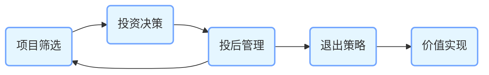

# 威廉·贝恩的私募股权价值创造模型

> 关键词：私募股权、价值创造模型、威廉·贝恩、投资策略、企业增长

> 摘要：本文深入探讨了威廉·贝恩的私募股权价值创造模型。首先介绍了该模型产生的背景，包括目的、预期读者等内容。接着阐述核心概念与联系，详细剖析模型的原理和架构，并通过 Mermaid 流程图呈现其逻辑。然后深入讲解核心算法原理，以 Python 代码进行详细阐述，同时给出相关数学模型和公式并举例说明。在项目实战部分，提供开发环境搭建、源代码实现及解读。随后探讨了该模型的实际应用场景，推荐了相关的学习资源、开发工具框架以及论文著作。最后总结未来发展趋势与挑战，提供常见问题解答和扩展阅读参考资料，旨在帮助读者全面理解和运用威廉·贝恩的私募股权价值创造模型。

## 1. 背景介绍 
### 1.1 目的和范围
私募股权投资在全球金融市场中扮演着日益重要的角色。威廉·贝恩的私募股权价值创造模型旨在为私募股权投资者提供一套系统、科学的方法，以实现投资项目的价值最大化。该模型的范围涵盖了私募股权投资的整个生命周期，从项目筛选、投资决策到投后管理和退出，通过对各个环节的优化和协同，提升投资回报。

### 1.2 预期读者
本文的预期读者主要包括私募股权行业的从业者，如投资经理、分析师、合伙人等，他们可以通过深入理解该模型，优化投资策略和决策过程。同时，也适合对金融投资领域感兴趣的学者和学生，作为研究和学习私募股权投资的参考资料。此外，企业管理者也可以从该模型中获取有关提升企业价值的思路和方法。

### 1.3 文档结构概述
本文将按照以下结构进行阐述：首先介绍背景信息，包括目的、读者和文档结构。接着详细讲解核心概念与联系，呈现模型的原理和架构。然后深入探讨核心算法原理和具体操作步骤，给出相关数学模型和公式。通过项目实战部分展示代码实现和解读。随后探讨实际应用场景，推荐相关工具和资源。最后总结未来发展趋势与挑战，提供常见问题解答和扩展阅读参考资料。

### 1.4 术语表
#### 1.4.1 核心术语定义
- **私募股权**：是指对非上市企业进行的权益性投资，并通过上市、并购或管理层回购等方式，出售持股获利。
- **价值创造**：在私募股权投资中，是指通过各种手段提升被投资企业的内在价值，从而实现投资回报的增加。
- **威廉·贝恩的私募股权价值创造模型**：是一套基于对私募股权投资过程深入研究而提出的，旨在实现投资项目价值最大化的理论和方法体系。

#### 1.4.2 相关概念解释
- **投后管理**：是指私募股权投资机构在完成项目投资后，对被投资企业进行的一系列管理和增值服务活动，以促进企业发展和提升价值。
- **退出策略**：是指私募股权投资机构在合适的时机，通过一定的方式将持有的被投资企业股权变现的计划和安排。

#### 1.4.3 缩略词列表
- **PE**：私募股权（Private Equity）

## 2. 核心概念与联系 

### 核心概念原理
威廉·贝恩的私募股权价值创造模型基于以下核心原理：私募股权投资的价值创造不仅仅依赖于投资时机和标的选择，更重要的是在投资后通过积极的管理和战略调整，提升被投资企业的运营效率和竞争力。该模型强调从多个维度对被投资企业进行改造和优化，包括财务、运营、战略等方面。

### 架构的文本示意图
该模型主要包括以下几个关键部分：
1. **项目筛选**：通过一系列标准和方法，从众多潜在投资项目中筛选出具有高增长潜力和价值提升空间的项目。
2. **投资决策**：基于对项目的深入分析和评估，做出是否投资以及投资金额、股权比例等决策。
3. **投后管理**：在投资后，通过参与企业管理、提供战略指导、优化运营流程等方式，提升企业价值。
4. **退出策略**：在合适的时机，选择合适的退出方式，实现投资回报。

这些部分相互关联、相互影响，共同构成了私募股权价值创造的完整过程。

### Mermaid 流程图


## 3. 核心算法原理 & 具体操作步骤 

### 核心算法原理
威廉·贝恩的私募股权价值创造模型的核心算法原理在于对被投资企业的价值评估和优化。可以通过以下步骤实现：
1. **价值评估**：使用多种方法对被投资企业的当前价值进行评估，包括财务分析、市场分析、行业比较等。
2. **价值驱动因素分析**：识别影响企业价值的关键因素，如市场份额、成本结构、技术创新能力等。
3. **优化策略制定**：基于价值驱动因素分析，制定针对性的优化策略，以提升企业价值。
4. **价值提升评估**：在实施优化策略后，定期对企业价值的提升情况进行评估，调整优化策略。

### 具体操作步骤及 Python 代码实现
以下是一个简单的 Python 代码示例，用于模拟对被投资企业的价值评估和优化过程：

```python
# 定义企业类
class Enterprise:
    def __init__(self, revenue, cost, market_share, innovation_capability):
        self.revenue = revenue
        self.cost = cost
        self.market_share = market_share
        self.innovation_capability = innovation_capability

    # 计算企业当前价值
    def calculate_value(self):
        # 简单的价值计算公式，仅作示例
        value = self.revenue - self.cost + self.market_share * 100 + self.innovation_capability * 50
        return value

    # 实施优化策略
    def implement_optimization(self, revenue_increase, cost_decrease, market_share_increase, innovation_capability_increase):
        self.revenue += revenue_increase
        self.cost -= cost_decrease
        self.market_share += market_share_increase
        self.innovation_capability += innovation_capability_increase

# 创建企业实例
enterprise = Enterprise(1000, 500, 0.2, 3)

# 计算初始价值
initial_value = enterprise.calculate_value()
print(f"初始价值: {initial_value}")

# 实施优化策略
enterprise.implement_optimization(200, 100, 0.05, 1)

# 计算优化后的价值
optimized_value = enterprise.calculate_value()
print(f"优化后的价值: {optimized_value}")

# 计算价值提升
value_increase = optimized_value - initial_value
print(f"价值提升: {value_increase}")
```

### 代码解释
1. **Enterprise 类**：定义了企业的基本属性，包括收入、成本、市场份额和创新能力。
2. **calculate_value 方法**：用于计算企业的当前价值，通过简单的公式将各个属性进行加权求和。
3. **implement_optimization 方法**：用于实施优化策略，对企业的各个属性进行调整。
4. **主程序**：创建企业实例，计算初始价值，实施优化策略，计算优化后的价值，并计算价值提升。

## 4. 数学模型和公式 & 详细讲解 & 举例说明 

### 数学模型和公式
在威廉·贝恩的私募股权价值创造模型中，企业价值可以用以下公式表示：

$$V = \sum_{t=0}^{n} \frac{FCF_t}{(1 + r)^t} + TV$$

其中：
- $V$ 表示企业的总价值。
- $FCF_t$ 表示第 $t$ 期的自由现金流。
- $r$ 表示折现率，反映了投资的风险和机会成本。
- $n$ 表示预测期数。
- $TV$ 表示终值，即预测期结束后的企业价值。

### 详细讲解
1. **自由现金流（$FCF$）**：是指企业在满足了所有运营和投资需求后剩余的现金流量，反映了企业的实际盈利能力和现金创造能力。
2. **折现率（$r$）**：是根据投资的风险程度和市场利率等因素确定的，用于将未来的现金流量折现到当前时刻。风险越高，折现率越高。
3. **终值（$TV$）**：通常采用永续增长模型或倍数法进行估算。永续增长模型的公式为：

$$TV = \frac{FCF_{n+1}}{r - g}$$

其中：
- $FCF_{n+1}$ 表示预测期结束后下一期的自由现金流。
- $g$ 表示永续增长率。

### 举例说明
假设一个企业的预测期为 5 年，每年的自由现金流分别为 100 万元、120 万元、150 万元、180 万元和 200 万元。折现率为 10%，预测期结束后的永续增长率为 3%。

1. 计算预测期内自由现金流的现值：

$$PV_{FCF} = \frac{100}{(1 + 0.1)^1} + \frac{120}{(1 + 0.1)^2} + \frac{150}{(1 + 0.1)^3} + \frac{180}{(1 + 0.1)^4} + \frac{200}{(1 + 0.1)^5}$$

```python
import math

fcfs = [100, 120, 150, 180, 200]
r = 0.1
pv_fcf = sum([fcf / (1 + r) ** (i + 1) for i, fcf in enumerate(fcfs)])
print(f"预测期内自由现金流的现值: {pv_fcf}")
```

2. 计算终值：

$$FCF_{6} = 200 \times (1 + 0.03) = 206$$

$$TV = \frac{206}{0.1 - 0.03} \approx 2942.86$$

```python
g = 0.03
fcf_6 = fcfs[-1] * (1 + g)
tv = fcf_6 / (r - g)
print(f"终值: {tv}")
```

3. 计算企业总价值：

$$V = PV_{FCF} + \frac{TV}{(1 + r)^5}$$

```python
v = pv_fcf + tv / (1 + r) ** 5
print(f"企业总价值: {v}")
```

通过以上计算，我们可以得到该企业的总价值。

## 5. 项目实战：代码实际案例和详细解释说明 

### 5.1  开发环境搭建
为了实现威廉·贝恩的私募股权价值创造模型的相关代码，我们需要搭建以下开发环境：
1. **Python 环境**：建议使用 Python 3.7 及以上版本。可以从 Python 官方网站（https://www.python.org/downloads/）下载并安装。
2. **开发工具**：可以选择 PyCharm、VS Code 等集成开发环境（IDE），或者使用 Jupyter Notebook 进行交互式开发。
3. **相关库**：需要安装 `numpy`、`pandas` 等常用库，用于数据处理和分析。可以使用以下命令进行安装：

```sh
pip install numpy pandas
```

### 5.2  源代码详细实现和代码解读
以下是一个更完整的 Python 代码示例，用于模拟私募股权价值创造的项目实战：

```python
import numpy as np
import pandas as pd

# 定义企业类
class Enterprise:
    def __init__(self, name, initial_revenue, initial_cost, initial_market_share, initial_innovation_capability):
        self.name = name
        self.revenue = initial_revenue
        self.cost = initial_cost
        self.market_share = initial_market_share
        self.innovation_capability = initial_innovation_capability
        self.history = []

    # 计算企业当前价值
    def calculate_value(self):
        value = self.revenue - self.cost + self.market_share * 100 + self.innovation_capability * 50
        return value

    # 实施优化策略
    def implement_optimization(self, revenue_increase, cost_decrease, market_share_increase, innovation_capability_increase):
        self.revenue += revenue_increase
        self.cost -= cost_decrease
        self.market_share += market_share_increase
        self.innovation_capability += innovation_capability_increase
        value = self.calculate_value()
        self.history.append({
            'revenue': self.revenue,
            'cost': self.cost,
            'market_share': self.market_share,
            'innovation_capability': self.innovation_capability,
            'value': value
        })
        return value

    # 显示历史记录
    def show_history(self):
        df = pd.DataFrame(self.history)
        print(df)

# 创建企业实例
enterprise = Enterprise("ABC 公司", 1000, 500, 0.2, 3)

# 模拟多个阶段的优化
for i in range(5):
    revenue_increase = np.random.randint(100, 300)
    cost_decrease = np.random.randint(50, 150)
    market_share_increase = np.random.uniform(0.01, 0.05)
    innovation_capability_increase = np.random.randint(1, 3)
    enterprise.implement_optimization(revenue_increase, cost_decrease, market_share_increase, innovation_capability_increase)

# 显示历史记录
enterprise.show_history()
```

### 5.3  代码解读与分析
1. **Enterprise 类**：
    - `__init__` 方法：初始化企业的基本信息，包括名称、初始收入、成本、市场份额和创新能力，并创建一个空的历史记录列表。
    - `calculate_value` 方法：计算企业的当前价值，使用简单的公式将各个属性进行加权求和。
    - `implement_optimization` 方法：实施优化策略，对企业的各个属性进行调整，并记录每次优化后的企业信息和价值。
    - `show_history` 方法：将历史记录转换为 Pandas 数据框并显示。
2. **主程序**：
    - 创建企业实例。
    - 模拟多个阶段的优化，每次优化的参数随机生成。
    - 显示企业的历史记录，包括每次优化后的收入、成本、市场份额、创新能力和价值。

通过这个代码示例，我们可以模拟私募股权价值创造的过程，观察企业在不同优化策略下的价值变化。

## 6. 实际应用场景 
### 私募股权投资机构
私募股权投资机构可以使用威廉·贝恩的私募股权价值创造模型来筛选投资项目、制定投资决策和实施投后管理。通过对被投资企业的价值评估和优化，提升投资回报。例如，在项目筛选阶段，使用该模型评估潜在投资项目的价值和增长潜力，选择具有高价值提升空间的项目进行投资。在投后管理阶段，通过实施优化策略，如改善企业的财务状况、提升运营效率、加强市场拓展等，提升企业价值。

### 企业管理者
企业管理者可以借鉴该模型的思想和方法，提升企业的内在价值。例如，通过分析企业的价值驱动因素，制定针对性的战略和措施，优化企业的运营和管理。同时，企业管理者也可以利用该模型与私募股权投资机构进行沟通和合作，吸引投资，实现企业的快速发展。

### 金融分析师
金融分析师可以使用该模型对企业进行价值评估和分析，为投资者提供决策参考。通过对企业的财务数据、市场数据和行业数据的分析，运用该模型的方法和公式，计算企业的价值和增长潜力，评估投资风险和回报。

## 7. 工具和资源推荐
### 7.1 学习资源推荐
#### 7.1.1 书籍推荐
- 《私募股权投资：策略、结构与过程》：全面介绍了私募股权投资的理论和实践，包括投资策略、项目筛选、投后管理等方面的内容。
- 《价值评估：公司价值的衡量与管理》：详细讲解了企业价值评估的方法和模型，对理解威廉·贝恩的私募股权价值创造模型有很大帮助。

#### 7.1.2 在线课程
- Coursera 上的“私募股权投资基础”课程：由知名教授授课，系统介绍私募股权投资的基本知识和操作流程。
- edX 上的“企业价值评估与投资决策”课程：深入讲解企业价值评估的方法和应用，适合有一定金融基础的学习者。

#### 7.1.3 技术博客和网站
- 投中网：提供私募股权投资领域的最新资讯、研究报告和案例分析。
- 清科研究中心：专注于私募股权投资行业的研究和分析，发布行业数据和趋势报告。

### 7.2 开发工具框架推荐
#### 7.2.1 IDE和编辑器
- PyCharm：功能强大的 Python 集成开发环境，提供代码编辑、调试、版本控制等功能。
- VS Code：轻量级的代码编辑器，支持多种编程语言，具有丰富的插件生态系统。

#### 7.2.2 调试和性能分析工具
- PDB：Python 内置的调试器，用于调试 Python 代码。
- cProfile：Python 标准库中的性能分析工具，用于分析代码的性能瓶颈。

#### 7.2.3 相关框架和库
- Numpy：用于科学计算和数值处理的 Python 库。
- Pandas：用于数据处理和分析的 Python 库，提供了高效的数据结构和数据操作方法。

### 7.3 相关论文著作推荐
#### 7.3.1 经典论文
- “The Value Creation Process in Private Equity Investments”：深入探讨了私募股权投资中的价值创造过程和机制。
- “Valuation Methods in Private Equity: A Review”：对私募股权投资中的价值评估方法进行了综述和比较。

#### 7.3.2 最新研究成果
- 关注《Journal of Financial Economics》、《Review of Financial Studies》等金融领域的顶级学术期刊，获取私募股权投资领域的最新研究成果。

#### 7.3.3 应用案例分析
- 研究知名私募股权投资机构的成功案例，如黑石集团、凯雷集团等，了解他们在私募股权价值创造方面的实践经验和策略。

## 8. 总结：未来发展趋势与挑战
### 未来发展趋势
1. **数字化转型**：随着科技的不断发展，私募股权投资机构将越来越重视数字化技术的应用，如大数据、人工智能等，以提升投资决策的效率和准确性，优化投后管理流程。
2. **绿色投资**：在全球可持续发展的背景下，私募股权投资将更加关注环境、社会和治理（ESG）因素，加大对绿色产业和可持续发展项目的投资。
3. **跨境投资**：经济全球化的趋势将促使私募股权投资机构更加积极地开展跨境投资，寻找全球范围内的优质投资项目，实现资源的优化配置。

### 挑战
1. **市场竞争加剧**：随着私募股权投资行业的发展，市场竞争日益激烈，投资项目的获取和估值难度增加，投资回报压力增大。
2. **风险管理**：私募股权投资面临着多种风险，如市场风险、信用风险、操作风险等，如何有效地识别、评估和管理这些风险是私募股权投资机构面临的重要挑战。
3. **政策法规变化**：私募股权投资行业受到政策法规的严格监管，政策法规的变化可能对行业发展产生重大影响，私募股权投资机构需要及时适应政策法规的变化。

## 9. 附录：常见问题与解答
### 1. 威廉·贝恩的私募股权价值创造模型适用于所有类型的企业吗？
该模型的基本原理和方法适用于大多数企业，但在实际应用中需要根据企业的行业特点、发展阶段和具体情况进行调整和优化。

### 2. 如何确定折现率和永续增长率？
折现率和永续增长率的确定需要综合考虑多种因素，如市场利率、投资风险、行业发展趋势等。通常可以参考同行业类似企业的相关数据，结合专业的金融分析方法进行估算。

### 3. 该模型在实际应用中需要注意哪些问题？
在实际应用中，需要注意数据的准确性和可靠性，确保价值评估和优化策略的制定基于真实、有效的数据。同时，要充分考虑市场环境和企业内部因素的变化，及时调整优化策略。

## 10. 扩展阅读 & 参考资料
1. 威廉·贝恩的相关著作和研究论文。
2. 私募股权投资行业的权威报告和统计数据。
3. 金融领域的学术期刊和研究成果。
4. 相关的行业会议和研讨会资料。