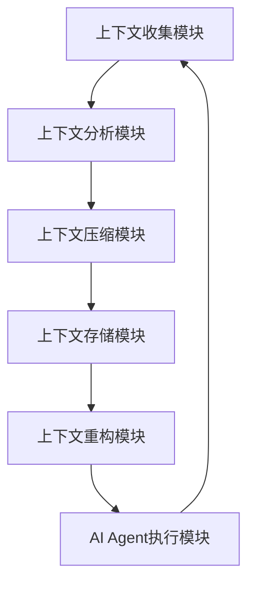

# 实现AI Agent的动态上下文压缩与重构

> 关键词：AI Agent、动态上下文压缩、上下文重构、自然语言处理、信息压缩、知识表示、人工智能

> 摘要：本文围绕实现AI Agent的动态上下文压缩与重构展开深入探讨。随着AI技术的发展，AI Agent在处理复杂任务时面临着上下文信息管理的挑战，过多的上下文信息会导致计算资源的浪费和处理效率的降低，而有效的压缩与重构机制能显著提升AI Agent的性能。文章详细介绍了相关核心概念、算法原理、数学模型，通过项目实战展示了具体实现过程，分析了实际应用场景，并推荐了相关工具和资源，最后对未来发展趋势与挑战进行了总结，为AI Agent的上下文管理提供了全面且深入的技术指导。

## 1. 背景介绍 
### 1.1 目的和范围
AI Agent在自然语言处理、智能对话系统、自动化决策等众多领域发挥着重要作用。在执行任务过程中，AI Agent需要处理大量的上下文信息，这些信息包含了历史对话、任务状态、环境信息等。然而，过多的上下文信息会给AI Agent带来计算负担，降低其处理效率。本文章的目的在于探讨如何实现AI Agent的动态上下文压缩与重构，以优化上下文信息的管理，提高AI Agent的性能和资源利用效率。范围涵盖了从核心概念的介绍到具体算法实现，再到实际应用场景的分析等多个方面。

### 1.2 预期读者
本文预期读者包括人工智能领域的研究人员、开发者、工程师，以及对AI Agent技术感兴趣的学生和爱好者。对于正在从事AI Agent开发和优化工作的专业人员，本文提供了深入的技术细节和实践指导；对于初学者，本文可以帮助他们了解AI Agent上下文管理的基本概念和方法。

### 1.3 文档结构概述
本文首先介绍相关背景知识，包括目的、预期读者和文档结构概述等。接着阐述核心概念与联系，通过文本示意图和Mermaid流程图展示其原理和架构。然后详细讲解核心算法原理，并给出Python源代码示例。之后介绍数学模型和公式，并进行详细讲解和举例说明。通过项目实战展示代码实际案例和详细解释。分析实际应用场景，推荐相关工具和资源。最后总结未来发展趋势与挑战，提供常见问题与解答和扩展阅读参考资料。

### 1.4 术语表
#### 1.4.1 核心术语定义
- **AI Agent**：人工智能代理，是一种能够感知环境、根据感知信息进行决策并采取行动的智能实体。
- **动态上下文**：在AI Agent执行任务过程中，随时间和任务进展不断变化的相关信息集合，包括历史对话、任务状态、环境信息等。
- **上下文压缩**：将动态上下文中的冗余信息去除，以减少信息存储空间和处理复杂度的过程。
- **上下文重构**：在需要使用上下文信息时，将压缩后的信息恢复为原始或接近原始状态的过程。

#### 1.4.2 相关概念解释
- **知识表示**：将知识以计算机能够理解和处理的形式进行表示的方法，是上下文管理的基础。
- **信息熵**：用于衡量信息的不确定性，在上下文压缩中可作为评估信息冗余度的指标。
- **语义理解**：对文本信息的语义进行分析和理解，有助于更准确地进行上下文压缩和重构。

#### 1.4.3 缩略词列表
- **NLP**：Natural Language Processing，自然语言处理
- **ML**：Machine Learning，机器学习
- **DL**：Deep Learning，深度学习

## 2. 核心概念与联系 

### 核心概念原理
AI Agent的动态上下文压缩与重构是一个涉及多个环节的过程。动态上下文是AI Agent在执行任务过程中所积累的各种信息，这些信息可能包含大量的冗余和重复内容。上下文压缩的目的是去除这些冗余信息，提取关键信息，从而减少信息的存储空间和处理复杂度。压缩的方法可以基于规则、统计或机器学习等技术。

上下文重构则是在需要使用上下文信息时，将压缩后的信息恢复为原始或接近原始的状态。重构的过程需要保证信息的完整性和准确性，以便AI Agent能够正确地理解和利用上下文信息。

### 架构的文本示意图
AI Agent的动态上下文压缩与重构架构主要包括以下几个部分：
1. **上下文收集模块**：负责收集AI Agent在执行任务过程中的各种上下文信息，包括用户输入、系统反馈、任务状态等。
2. **上下文分析模块**：对收集到的上下文信息进行分析，识别其中的关键信息和冗余信息。
3. **上下文压缩模块**：根据分析结果，采用合适的压缩算法对上下文信息进行压缩。
4. **上下文存储模块**：将压缩后的上下文信息存储在合适的存储介质中，如数据库或文件系统。
5. **上下文重构模块**：在需要使用上下文信息时，从存储模块中读取压缩后的信息，并进行重构。
6. **AI Agent执行模块**：根据重构后的上下文信息，进行决策和行动。

### Mermaid流程图


## 3. 核心算法原理 & 具体操作步骤 

### 算法原理
一种常见的上下文压缩算法是基于词向量表示和聚类的方法。首先，将文本形式的上下文信息转换为词向量表示，这样可以将文本信息映射到低维向量空间中，便于进行计算和分析。然后，使用聚类算法对词向量进行聚类，将相似的词向量归为同一类。最后，选择每个类的中心向量作为该类的代表，从而实现上下文信息的压缩。

上下文重构的过程则是根据压缩后的代表向量，找到与其最相似的原始词向量，然后将这些原始词向量组合成文本信息，从而恢复上下文信息。

### Python源代码实现
```python
import numpy as np
from sklearn.cluster import KMeans
from sklearn.feature_extraction.text import TfidfVectorizer
from sklearn.metrics.pairwise import cosine_similarity

# 示例上下文信息
contexts = [
    "The cat is on the mat.",
    "A dog is running in the park.",
    "The cat and the dog are playing together."
]

# 将文本转换为词向量表示
vectorizer = TfidfVectorizer()
X = vectorizer.fit_transform(contexts)

# 聚类算法
kmeans = KMeans(n_clusters=2)
kmeans.fit(X)

# 获取每个类的中心向量
cluster_centers = kmeans.cluster_centers_

# 上下文压缩：选择每个类的中心向量作为代表
compressed_contexts = []
for center in cluster_centers:
    # 找到与中心向量最相似的原始向量
    similarities = cosine_similarity([center], X)
    most_similar_index = np.argmax(similarities)
    compressed_contexts.append(contexts[most_similar_index])

print("Compressed contexts:", compressed_contexts)

# 上下文重构：根据压缩后的代表向量恢复上下文信息
reconstructed_contexts = []
for compressed_context in compressed_contexts:
    # 找到与压缩后的上下文最相似的原始上下文
    compressed_vector = vectorizer.transform([compressed_context])
    similarities = cosine_similarity(compressed_vector, X)
    most_similar_index = np.argmax(similarities)
    reconstructed_contexts.append(contexts[most_similar_index])

print("Reconstructed contexts:", reconstructed_contexts)
```

### 具体操作步骤
1. **数据收集**：收集AI Agent在执行任务过程中的上下文信息，将其存储为文本形式。
2. **特征提取**：使用词向量表示方法将文本信息转换为向量形式，如TF-IDF、Word2Vec等。
3. **聚类分析**：使用聚类算法对词向量进行聚类，确定聚类的数量。
4. **上下文压缩**：选择每个类的中心向量作为该类的代表，将代表向量对应的文本信息作为压缩后的上下文信息。
5. **上下文重构**：根据压缩后的代表向量，找到与其最相似的原始词向量，将这些原始词向量组合成文本信息，恢复上下文信息。

## 4. 数学模型和公式 & 详细讲解 & 举例说明 

### 词向量表示
在文本信息的处理中，常用的词向量表示方法是TF-IDF（Term Frequency-Inverse Document Frequency）。TF-IDF表示一个词在文档中的重要性，其计算公式如下：

$$TF - IDF(t, d, D) = TF(t, d) \times IDF(t, D)$$

其中，$TF(t, d)$ 表示词 $t$ 在文档 $d$ 中出现的频率，计算公式为：

$$TF(t, d) = \frac{\text{词 }t\text{ 在文档 }d\text{ 中出现的次数}}{\text{文档 }d\text{ 中的总词数}}$$

$IDF(t, D)$ 表示词 $t$ 在文档集合 $D$ 中的逆文档频率，计算公式为：

$$IDF(t, D) = \log\frac{\text{文档集合 }D\text{ 中的文档总数}}{\text{包含词 }t\text{ 的文档数} + 1}$$

### 聚类算法
常用的聚类算法是K-Means算法。K-Means算法的目标是将数据点划分为 $K$ 个簇，使得簇内的数据点相似度最大，簇间的数据点相似度最小。其优化目标是最小化所有数据点到其所属簇中心的距离平方和，即：

$$\min_{C_1, C_2, \cdots, C_K} \sum_{k = 1}^{K} \sum_{x_i \in C_k} \|x_i - \mu_k\|^2$$

其中，$C_k$ 表示第 $k$ 个簇，$\mu_k$ 表示第 $k$ 个簇的中心向量，$x_i$ 表示数据点。

### 相似度计算
在上下文重构过程中，需要计算向量之间的相似度。常用的相似度计算方法是余弦相似度，其计算公式为：

$$\text{Cosine Similarity}(x, y) = \frac{x \cdot y}{\|x\| \|y\|}$$

其中，$x$ 和 $y$ 表示两个向量，$\cdot$ 表示向量的点积，$\|x\|$ 和 $\|y\|$ 分别表示向量 $x$ 和 $y$ 的模。

### 举例说明
假设有以下三个文档：
- $d_1$: "The cat is on the mat."
- $d_2$: "A dog is running in the park."
- $d_3$: "The cat and the dog are playing together."

计算词 "cat" 在文档 $d_1$ 中的TF-IDF值：
- $TF(\text{cat}, d_1) = \frac{1}{6}$
- 包含词 "cat" 的文档数为 2，文档集合中的文档总数为 3，则 $IDF(\text{cat}, D) = \log\frac{3}{2 + 1} \approx -0.405$
- $TF - IDF(\text{cat}, d_1, D) = \frac{1}{6} \times (-0.405) \approx -0.0675$

假设已经将这三个文档转换为向量表示，$x = [0.1, 0.2, 0.3]$ 和 $y = [0.2, 0.3, 0.4]$，则它们的余弦相似度为：

$$\text{Cosine Similarity}(x, y) = \frac{0.1 \times 0.2 + 0.2 \times 0.3 + 0.3 \times 0.4}{\sqrt{0.1^2 + 0.2^2 + 0.3^2} \sqrt{0.2^2 + 0.3^2 + 0.4^2}} \approx 0.993$$

## 5. 项目实战：代码实际案例和详细解释说明 

### 5.1  开发环境搭建
- **操作系统**：推荐使用Linux或macOS系统，也可以使用Windows系统。
- **Python版本**：Python 3.6及以上版本。
- **依赖库安装**：使用pip安装所需的依赖库，命令如下：
```sh
pip install numpy scikit-learn
```

### 5.2  源代码详细实现和代码解读
```python
import numpy as np
from sklearn.cluster import KMeans
from sklearn.feature_extraction.text import TfidfVectorizer
from sklearn.metrics.pairwise import cosine_similarity

# 示例上下文信息
contexts = [
    "The cat is on the mat.",
    "A dog is running in the park.",
    "The cat and the dog are playing together."
]

# 将文本转换为词向量表示
vectorizer = TfidfVectorizer()
X = vectorizer.fit_transform(contexts)
# 代码解读：使用TfidfVectorizer将文本信息转换为TF-IDF向量表示，fit_transform方法会同时进行拟合和转换操作。

# 聚类算法
kmeans = KMeans(n_clusters=2)
kmeans.fit(X)
# 代码解读：使用KMeans算法对向量进行聚类，n_clusters参数指定聚类的数量为2，fit方法进行聚类训练。

# 获取每个类的中心向量
cluster_centers = kmeans.cluster_centers_

# 上下文压缩：选择每个类的中心向量作为代表
compressed_contexts = []
for center in cluster_centers:
    # 找到与中心向量最相似的原始向量
    similarities = cosine_similarity([center], X)
    most_similar_index = np.argmax(similarities)
    compressed_contexts.append(contexts[most_similar_index])
# 代码解读：遍历每个类的中心向量，计算其与所有原始向量的余弦相似度，选择相似度最大的原始向量对应的文本作为压缩后的上下文信息。

print("Compressed contexts:", compressed_contexts)

# 上下文重构：根据压缩后的代表向量恢复上下文信息
reconstructed_contexts = []
for compressed_context in compressed_contexts:
    # 找到与压缩后的上下文最相似的原始上下文
    compressed_vector = vectorizer.transform([compressed_context])
    similarities = cosine_similarity(compressed_vector, X)
    most_similar_index = np.argmax(similarities)
    reconstructed_contexts.append(contexts[most_similar_index])
# 代码解读：遍历每个压缩后的上下文信息，将其转换为向量表示，计算其与所有原始向量的余弦相似度，选择相似度最大的原始向量对应的文本作为重构后的上下文信息。

print("Reconstructed contexts:", reconstructed_contexts)
```

### 5.3  代码解读与分析
- **数据预处理**：使用TfidfVectorizer将文本信息转换为向量表示，这是上下文压缩和重构的基础。
- **聚类操作**：使用KMeans算法对向量进行聚类，将相似的向量归为同一类，从而实现上下文信息的压缩。
- **相似度计算**：使用余弦相似度计算向量之间的相似度，用于选择最相似的向量和恢复上下文信息。
- **压缩与重构**：通过选择每个类的中心向量作为代表实现上下文压缩，根据压缩后的代表向量找到最相似的原始向量实现上下文重构。

## 6. 实际应用场景 
### 智能对话系统
在智能对话系统中，AI Agent需要处理大量的历史对话信息。通过动态上下文压缩与重构，可以减少对话历史的存储空间，提高对话系统的响应速度。例如，在长对话中，只保留关键的对话信息，当需要回顾历史对话时，再将压缩后的信息进行重构。

### 自动化决策系统
在自动化决策系统中，AI Agent需要考虑多个任务的状态和环境信息。动态上下文压缩与重构可以帮助AI Agent更高效地管理这些信息，提高决策的准确性和效率。例如，在机器人导航任务中，只保留与当前导航路径相关的环境信息，当需要重新规划路径时，再将相关信息进行重构。

### 自然语言处理任务
在自然语言处理任务中，如文本分类、情感分析等，AI Agent需要处理大量的文本信息。上下文压缩与重构可以减少文本信息的冗余，提高模型的训练效率和性能。例如，在文本分类任务中，只保留与分类标签相关的关键信息，从而减少计算量和内存占用。

## 7. 工具和资源推荐
### 7.1 学习资源推荐
#### 7.1.1 书籍推荐
- 《人工智能：一种现代的方法》：全面介绍了人工智能的基本概念、算法和应用，是学习人工智能的经典教材。
- 《自然语言处理入门》：详细介绍了自然语言处理的基本技术和方法，适合初学者学习。
- 《机器学习》：系统地介绍了机器学习的基本算法和模型，对理解上下文压缩和重构的算法原理有很大帮助。

#### 7.1.2 在线课程
- Coursera上的“人工智能基础”课程：由知名高校教授授课，内容涵盖人工智能的各个方面。
- edX上的“自然语言处理”课程：提供了丰富的自然语言处理知识和实践项目。
- 哔哩哔哩上的“机器学习实战”课程：通过实际案例讲解机器学习的应用，适合实践能力的提升。

#### 7.1.3 技术博客和网站
- Medium：有很多人工智能领域的优秀博客文章，涵盖了最新的技术和研究成果。
- 机器之心：专注于人工智能领域的资讯和技术解读，提供了丰富的学习资源。
- 开源中国：有很多关于人工智能和自然语言处理的开源项目和技术文章。

### 7.2 开发工具框架推荐
#### 7.2.1 IDE和编辑器
- PyCharm：一款功能强大的Python集成开发环境，提供了代码编辑、调试、版本控制等功能。
- Visual Studio Code：轻量级的代码编辑器，支持多种编程语言和插件扩展，适合快速开发。

#### 7.2.2 调试和性能分析工具
- PDB：Python自带的调试工具，可用于调试Python代码。
- cProfile：Python的性能分析工具，可用于分析代码的运行时间和性能瓶颈。

#### 7.2.3 相关框架和库
- Scikit-learn：一个简单易用的机器学习库，提供了各种机器学习算法和工具。
- TensorFlow：一个开源的深度学习框架，可用于构建和训练深度学习模型。
- PyTorch：另一个流行的深度学习框架，具有动态计算图和简洁的API。

### 7.3 相关论文著作推荐
#### 7.3.1 经典论文
- “Efficient Estimation of Word Representations in Vector Space”：介绍了Word2Vec算法，是词向量表示的经典论文。
- “A Survey on Contextual Embeddings”：对上下文嵌入技术进行了全面的综述，有助于理解上下文信息的表示方法。

#### 7.3.2 最新研究成果
- 关注arXiv上关于AI Agent、自然语言处理和信息压缩的最新研究论文，了解最新的技术和方法。

#### 7.3.3 应用案例分析
- 参考ACM、IEEE等学术会议和期刊上的相关应用案例，学习如何在实际项目中应用动态上下文压缩与重构技术。

## 8. 总结：未来发展趋势与挑战
### 未来发展趋势
- **多模态上下文处理**：未来的AI Agent将不仅处理文本信息，还将处理图像、音频、视频等多模态信息。动态上下文压缩与重构技术需要适应多模态信息的特点，实现更高效的信息管理。
- **实时性要求提高**：在一些实时性要求较高的应用场景中，如自动驾驶、智能安防等，AI Agent需要在短时间内完成上下文信息的压缩和重构。因此，未来的技术需要进一步提高处理速度和效率。
- **与知识图谱的结合**：知识图谱可以提供更丰富的背景知识和语义信息，将动态上下文压缩与重构技术与知识图谱相结合，可以提高AI Agent的语义理解能力和决策准确性。

### 挑战
- **信息损失控制**：在上下文压缩过程中，如何在保证压缩率的前提下，尽可能减少信息损失，是一个亟待解决的问题。
- **语义理解的准确性**：上下文压缩和重构需要对文本信息进行语义理解，如何提高语义理解的准确性，是提高上下文管理效果的关键。
- **可扩展性**：随着AI Agent处理的上下文信息规模不断增大，如何保证动态上下文压缩与重构技术的可扩展性，是一个挑战。

## 9. 附录：常见问题与解答
### 问题1：如何选择合适的聚类数量？
答：选择合适的聚类数量是一个关键问题。常用的方法是使用手肘法，即通过绘制不同聚类数量下的簇内误差平方和（SSE）曲线，选择曲线的拐点作为合适的聚类数量。

### 问题2：上下文压缩后是否会影响AI Agent的性能？
答：如果压缩过程中信息损失过大，可能会影响AI Agent的性能。因此，需要在压缩率和信息损失之间进行平衡，选择合适的压缩算法和参数。

### 问题3：如何处理不同类型的上下文信息？
答：对于不同类型的上下文信息，如文本、图像、音频等，需要采用不同的特征提取和压缩方法。例如，对于文本信息可以使用词向量表示，对于图像信息可以使用卷积神经网络提取特征。

## 10. 扩展阅读 & 参考资料
- 《人工智能技术前沿》
- 《自然语言处理进阶》
- 相关学术期刊和会议论文，如ACM Transactions on Intelligent Systems and Technology、IEEE Transactions on Pattern Analysis and Machine Intelligence等。
- 开源项目的文档和代码，如Scikit-learn、TensorFlow、PyTorch等。