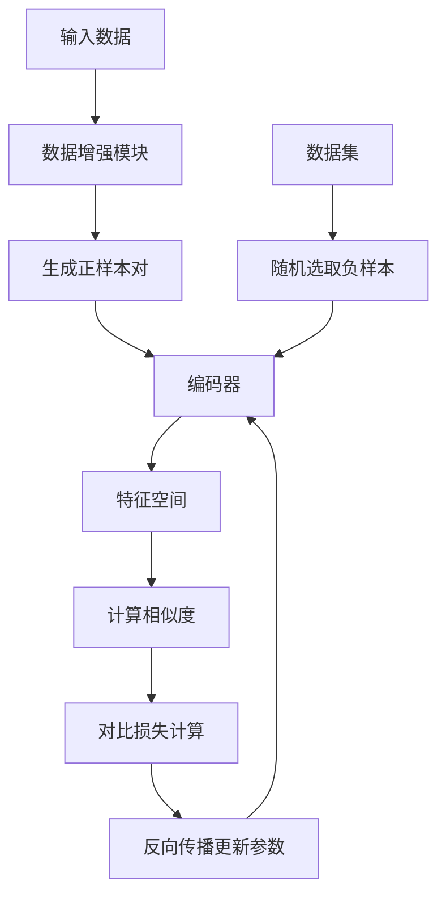

# 对比表示学习:提升特征质量的新方法

> 关键词：对比表示学习、特征质量、表示学习方法、自监督学习、深度学习

> 摘要：本文围绕对比表示学习这一提升特征质量的新方法展开深入探讨。首先介绍了对比表示学习提出的背景，包括其目的、适用读者群体以及文档结构等内容。接着详细阐述了对比表示学习的核心概念、原理和架构，通过文本示意图和 Mermaid 流程图进行直观呈现。在核心算法原理部分，使用 Python 源代码详细讲解其实现步骤。同时给出了对比表示学习的数学模型和公式，并结合具体例子进行说明。通过项目实战，展示了开发环境搭建、源代码实现及代码解读分析。还探讨了对比表示学习的实际应用场景，推荐了相关的学习资源、开发工具框架以及论文著作。最后总结了其未来发展趋势与挑战，并提供常见问题解答和扩展阅读参考资料，旨在全面介绍对比表示学习这一新技术，为相关研究者和开发者提供全面且深入的技术参考。

## 1. 背景介绍 
### 1.1 目的和范围
在深度学习领域，特征质量对于模型的性能起着至关重要的作用。传统的特征提取方法往往依赖于大量的标注数据，这不仅成本高昂，而且在某些场景下难以获取足够的标注信息。对比表示学习作为一种自监督学习方法，旨在通过学习数据之间的相对关系，无需大量标注数据就能学习到高质量的特征表示。

本文的范围涵盖对比表示学习的基本概念、原理、算法实现、数学模型，以及实际应用场景等方面。通过理论与实践相结合的方式，全面深入地介绍这一技术，帮助读者理解和掌握对比表示学习的核心要点，从而在实际项目中应用该方法提升特征质量。

### 1.2 预期读者
本文预期读者包括深度学习研究者、人工智能领域的开发者、对表示学习感兴趣的学生以及相关技术爱好者。对于希望深入了解对比表示学习技术，提升自身在特征工程和深度学习方面能力的读者，本文将提供有价值的参考。

### 1.3 文档结构概述
本文将按照以下结构展开：首先介绍对比表示学习的背景信息，包括目的、读者群体和文档结构等。接着阐述其核心概念、原理和架构，通过图形化方式进行直观展示。然后详细讲解核心算法原理和具体操作步骤，使用 Python 代码进行实现。之后给出对比表示学习的数学模型和公式，并结合实例进行说明。通过项目实战展示如何在实际项目中应用对比表示学习。探讨其实际应用场景，推荐相关的学习资源、开发工具框架和论文著作。最后总结对比表示学习的未来发展趋势与挑战，提供常见问题解答和扩展阅读参考资料。

### 1.4 术语表
#### 1.4.1 核心术语定义
- **对比表示学习（Contrastive Representation Learning）**：一种自监督学习方法，通过对比不同数据样本之间的相似性和差异性，学习到数据的高质量特征表示。
- **正样本对（Positive Pairs）**：在对比表示学习中，具有相似语义或属于同一类别的数据样本对。
- **负样本对（Negative Pairs）**：在对比表示学习中，具有不同语义或属于不同类别的数据样本对。
- **表示（Representation）**：数据在特征空间中的向量表示，通过学习得到的特征表示能够更好地反映数据的本质特征。

#### 1.4.2 相关概念解释
- **自监督学习（Self - Supervised Learning）**：一种无监督学习的变体，通过利用数据自身的结构和模式生成监督信号，从而学习到数据的特征表示。对比表示学习是自监督学习的一种具体实现方式。
- **特征质量（Feature Quality）**：指特征能够准确、有效地表示数据的程度。高质量的特征能够提高模型的性能，如分类准确率、回归精度等。

#### 1.4.3 缩略词列表
- **MLP（Multilayer Perceptron）**：多层感知机，一种常见的神经网络结构。
- **CNN（Convolutional Neural Network）**：卷积神经网络，常用于处理图像等具有网格结构的数据。

## 2. 核心概念与联系 

### 核心概念原理
对比表示学习的核心思想是通过对比正样本对和负样本对，学习到数据的特征表示，使得正样本对在特征空间中距离更近，负样本对在特征空间中距离更远。具体来说，给定一个数据集，我们通过某种方式生成正样本对和负样本对，然后使用一个编码器（如神经网络）将数据样本映射到特征空间中。在特征空间中，通过定义一个对比损失函数，来衡量正样本对和负样本对之间的距离关系，通过最小化这个损失函数，使得编码器学习到更好的特征表示。

### 架构的文本示意图
对比表示学习的基本架构可以描述如下：

输入数据首先经过一个数据增强模块，该模块对输入数据进行随机变换，生成正样本对。同时，从数据集中随机选取其他样本作为负样本。正样本对和负样本一起输入到编码器中，编码器将这些样本映射到特征空间中。在特征空间中，计算正样本对和负样本对之间的相似度，根据相似度计算对比损失。最后，通过反向传播算法更新编码器的参数，使得正样本对的相似度增加，负样本对的相似度减小。

### Mermaid 流程图


## 3. 核心算法原理 & 具体操作步骤 

### 核心算法原理
对比表示学习的核心算法基于对比损失函数。常见的对比损失函数有 InfoNCE（Info Noise - Contrastive Estimation）损失。InfoNCE 损失的目标是最大化正样本对之间的互信息，同时最小化负样本对之间的互信息。

给定一个正样本对 $(x_i, x_j)$ 和一组负样本 $\{x_k\}_{k = 1}^{K}$，编码器将这些样本映射到特征空间中，得到特征向量 $z_i, z_j, \{z_k\}_{k = 1}^{K}$。InfoNCE 损失的计算公式如下：

$$L_{InfoNCE}=-\log\frac{\exp(\text{sim}(z_i, z_j)/\tau)}{\exp(\text{sim}(z_i, z_j)/\tau)+\sum_{k = 1}^{K}\exp(\text{sim}(z_i, z_k)/\tau)}$$

其中，$\text{sim}(u, v)$ 表示特征向量 $u$ 和 $v$ 之间的相似度，通常使用点积 $\text{sim}(u, v)=u^T v$，$\tau$ 是温度参数，用于控制相似度的分布。

### 具体操作步骤
以下是使用 Python 和 PyTorch 实现对比表示学习的具体步骤：

```python
import torch
import torch.nn as nn
import torch.optim as optim
import torchvision.transforms as transforms
from torch.utils.data import DataLoader, Dataset
import numpy as np

# 定义编码器网络
class Encoder(nn.Module):
    def __init__(self, input_dim, hidden_dim, output_dim):
        super(Encoder, self).__init__()
        self.mlp = nn.Sequential(
            nn.Linear(input_dim, hidden_dim),
            nn.ReLU(),
            nn.Linear(hidden_dim, output_dim)
        )

    def forward(self, x):
        return self.mlp(x)

# 定义对比损失函数
class InfoNCELoss(nn.Module):
    def __init__(self, temperature=0.1):
        super(InfoNCELoss, self).__init__()
        self.temperature = temperature

    def forward(self, z_i, z_j, negative_z):
        batch_size = z_i.shape[0]
        # 计算正样本对的相似度
        sim_pos = torch.sum(z_i * z_j, dim=1) / self.temperature
        # 计算负样本对的相似度
        sim_neg = torch.mm(z_i, negative_z.T) / self.temperature
        # 拼接正样本和负样本的相似度
        logits = torch.cat([sim_pos.unsqueeze(1), sim_neg], dim=1)
        labels = torch.zeros(batch_size, dtype=torch.long).to(z_i.device)
        loss = nn.CrossEntropyLoss()(logits, labels)
        return loss

# 定义数据集类
class CustomDataset(Dataset):
    def __init__(self, data):
        self.data = data

    def __len__(self):
        return len(self.data)

    def __getitem__(self, idx):
        return self.data[idx]

# 生成一些示例数据
input_dim = 10
num_samples = 100
data = torch.randn(num_samples, input_dim)

# 数据集和数据加载器
dataset = CustomDataset(data)
dataloader = DataLoader(dataset, batch_size=16, shuffle=True)

# 初始化编码器和损失函数
encoder = Encoder(input_dim, 20, 10)
criterion = InfoNCELoss()
optimizer = optim.Adam(encoder.parameters(), lr=0.001)

# 训练过程
num_epochs = 10
for epoch in range(num_epochs):
    for batch in dataloader:
        batch_size = batch.shape[0]
        # 数据增强生成正样本对（这里简单地复制数据）
        x_i = batch
        x_j = batch.clone()
        # 随机选取负样本
        negative_indices = np.random.choice(num_samples, batch_size)
        negative_x = data[negative_indices]

        # 编码正样本和负样本
        z_i = encoder(x_i)
        z_j = encoder(x_j)
        negative_z = encoder(negative_x)

        # 计算损失
        loss = criterion(z_i, z_j, negative_z)

        # 反向传播和优化
        optimizer.zero_grad()
        loss.backward()
        optimizer.step()

    print(f'Epoch {epoch + 1}/{num_epochs}, Loss: {loss.item()}')
```

### 代码解释
1. **编码器网络（Encoder）**：定义了一个简单的多层感知机作为编码器，将输入数据映射到特征空间中。
2. **对比损失函数（InfoNCELoss）**：实现了 InfoNCE 损失函数，通过计算正样本对和负样本对的相似度，使用交叉熵损失进行优化。
3. **数据集和数据加载器**：自定义了一个数据集类，用于加载数据。使用数据加载器批量加载数据。
4. **训练过程**：在每个 epoch 中，对每个批次的数据进行处理。通过数据增强生成正样本对，随机选取负样本。将正样本和负样本输入到编码器中，计算对比损失，然后进行反向传播和参数更新。

## 4. 数学模型和公式 & 详细讲解 & 举例说明 

### 数学模型和公式
#### InfoNCE 损失函数
如前面所述，InfoNCE 损失函数的公式为：

$$L_{InfoNCE}=-\log\frac{\exp(\text{sim}(z_i, z_j)/\tau)}{\exp(\text{sim}(z_i, z_j)/\tau)+\sum_{k = 1}^{K}\exp(\text{sim}(z_i, z_k)/\tau)}$$

其中，$\text{sim}(u, v)$ 表示特征向量 $u$ 和 $v$ 之间的相似度，通常使用点积 $\text{sim}(u, v)=u^T v$，$\tau$ 是温度参数。

#### 详细讲解
InfoNCE 损失函数的目标是最大化正样本对之间的相似度，同时最小化负样本对之间的相似度。分子 $\exp(\text{sim}(z_i, z_j)/\tau)$ 表示正样本对的相似度得分，分母 $\exp(\text{sim}(z_i, z_j)/\tau)+\sum_{k = 1}^{K}\exp(\text{sim}(z_i, z_k)/\tau)$ 表示正样本对和所有负样本对的相似度得分之和。通过取对数和取负号，将最大化正样本对相似度的问题转化为最小化损失函数的问题。

温度参数 $\tau$ 控制了相似度得分的分布。当 $\tau$ 较小时，相似度得分的分布会更加尖锐，模型会更加关注正样本对和负样本对之间的差异；当 $\tau$ 较大时，相似度得分的分布会更加平滑，模型会更加关注整体的相似度关系。

### 举例说明
假设我们有一个正样本对 $(x_1, x_2)$ 和两个负样本 $x_3, x_4$。编码器将这些样本映射到特征空间中，得到特征向量 $z_1, z_2, z_3, z_4$。假设 $\text{sim}(z_1, z_2)=0.8$，$\text{sim}(z_1, z_3)=0.2$，$\text{sim}(z_1, z_4)=0.3$，温度参数 $\tau = 0.1$。

首先计算分子：

$$\exp(\text{sim}(z_1, z_2)/\tau)=\exp(0.8/0.1)=\exp(8)\approx 2980.96$$

然后计算分母：

$$\exp(\text{sim}(z_1, z_2)/\tau)+\exp(\text{sim}(z_1, z_3)/\tau)+\exp(\text{sim}(z_1, z_4)/\tau)=\exp(8)+\exp(2)+\exp(3)\approx 2980.96 + 7.39+20.09 = 3008.44$$

最后计算 InfoNCE 损失：

$$L_{InfoNCE}=-\log\frac{2980.96}{3008.44}\approx - \log(0.991)\approx 0.009$$

这个例子展示了如何根据给定的相似度得分和温度参数计算 InfoNCE 损失。

## 5. 项目实战：代码实际案例和详细解释说明 

### 5.1  开发环境搭建
#### 安装 Python
首先需要安装 Python 环境，建议使用 Python 3.7 及以上版本。可以从 Python 官方网站（https://www.python.org/downloads/） 下载并安装适合自己操作系统的 Python 版本。

#### 安装 PyTorch
PyTorch 是一个常用的深度学习框架，用于实现对比表示学习。可以根据自己的 CUDA 版本和操作系统，从 PyTorch 官方网站（https://pytorch.org/get-started/locally/） 选择合适的安装命令进行安装。例如，对于没有 CUDA 支持的系统，可以使用以下命令安装：

```bash
pip install torch torchvision
```

#### 安装其他依赖库
还需要安装一些其他的依赖库，如 numpy、torchvision 等。可以使用以下命令进行安装：

```bash
pip install numpy torchvision
```

### 5.2  源代码详细实现和代码解读
以下是一个基于 CIFAR - 10 数据集的对比表示学习项目的详细实现：

```python
import torch
import torch.nn as nn
import torch.optim as optim
import torchvision
import torchvision.transforms as transforms
from torch.utils.data import DataLoader

# 定义编码器网络
class Encoder(nn.Module):
    def __init__(self):
        super(Encoder, self).__init__()
        self.conv1 = nn.Conv2d(3, 64, kernel_size=3, stride=1, padding=1)
        self.relu1 = nn.ReLU()
        self.pool1 = nn.MaxPool2d(kernel_size=2, stride=2)
        self.conv2 = nn.Conv2d(64, 128, kernel_size=3, stride=1, padding=1)
        self.relu2 = nn.ReLU()
        self.pool2 = nn.MaxPool2d(kernel_size=2, stride=2)
        self.fc1 = nn.Linear(128 * 8 * 8, 256)
        self.relu3 = nn.ReLU()
        self.fc2 = nn.Linear(256, 128)

    def forward(self, x):
        x = self.pool1(self.relu1(self.conv1(x)))
        x = self.pool2(self.relu2(self.conv2(x)))
        x = x.view(-1, 128 * 8 * 8)
        x = self.relu3(self.fc1(x))
        x = self.fc2(x)
        return x

# 定义对比损失函数
class InfoNCELoss(nn.Module):
    def __init__(self, temperature=0.1):
        super(InfoNCELoss, self).__init__()
        self.temperature = temperature

    def forward(self, z_i, z_j, negative_z):
        batch_size = z_i.shape[0]
        sim_pos = torch.sum(z_i * z_j, dim=1) / self.temperature
        sim_neg = torch.mm(z_i, negative_z.T) / self.temperature
        logits = torch.cat([sim_pos.unsqueeze(1), sim_neg], dim=1)
        labels = torch.zeros(batch_size, dtype=torch.long).to(z_i.device)
        loss = nn.CrossEntropyLoss()(logits, labels)
        return loss

# 数据增强
transform = transforms.Compose([
    transforms.RandomResizedCrop(32),
    transforms.RandomHorizontalFlip(),
    transforms.ToTensor(),
    transforms.Normalize((0.5, 0.5, 0.5), (0.5, 0.5, 0.5))
])

# 加载 CIFAR - 10 数据集
trainset = torchvision.datasets.CIFAR10(root='./data', train=True,
                                        download=True, transform=transform)
trainloader = DataLoader(trainset, batch_size=32, shuffle=True)

# 初始化编码器和损失函数
encoder = Encoder()
criterion = InfoNCELoss()
optimizer = optim.Adam(encoder.parameters(), lr=0.001)

# 训练过程
num_epochs = 10
device = torch.device("cuda:0" if torch.cuda.is_available() else "cpu")
encoder.to(device)

for epoch in range(num_epochs):
    running_loss = 0.0
    for i, data in enumerate(trainloader, 0):
        inputs, _ = data
        inputs = inputs.to(device)

        batch_size = inputs.shape[0]
        # 数据增强生成正样本对
        x_i = inputs
        x_j = transforms.RandomApply([
            transforms.ColorJitter(0.8, 0.8, 0.8, 0.2)
        ])(inputs)

        # 编码正样本
        z_i = encoder(x_i)
        z_j = encoder(x_j)

        # 随机选取负样本
        negative_indices = torch.randperm(batch_size)
        negative_z = z_i[negative_indices]

        # 计算损失
        loss = criterion(z_i, z_j, negative_z)

        # 反向传播和优化
        optimizer.zero_grad()
        loss.backward()
        optimizer.step()

        running_loss += loss.item()

    print(f'Epoch {epoch + 1}/{num_epochs}, Loss: {running_loss / len(trainloader)}')
```

### 5.3  代码解读与分析
1. **编码器网络（Encoder）**：定义了一个简单的卷积神经网络作为编码器，用于将图像数据映射到特征空间中。网络包含两个卷积层、两个池化层和两个全连接层。
2. **对比损失函数（InfoNCELoss）**：与前面的实现相同，使用 InfoNCE 损失函数进行优化。
3. **数据增强**：使用 `torchvision.transforms` 对图像数据进行随机裁剪、水平翻转、颜色抖动等增强操作，生成正样本对。
4. **数据集和数据加载器**：使用 `torchvision.datasets.CIFAR10` 加载 CIFAR - 10 数据集，并使用数据加载器批量加载数据。
5. **训练过程**：在每个 epoch 中，对每个批次的数据进行处理。通过数据增强生成正样本对，随机选取负样本。将正样本和负样本输入到编码器中，计算对比损失，然后进行反向传播和参数更新。

通过这个项目实战，我们可以看到如何在实际数据集上应用对比表示学习，通过学习数据之间的相对关系，提升特征质量。

## 6. 实际应用场景 
### 计算机视觉领域
- **图像分类**：在图像分类任务中，对比表示学习可以学习到图像的高质量特征表示，无需大量标注数据。通过预训练编码器，然后在少量标注数据上进行微调，可以提高图像分类的准确率。
- **目标检测**：对比表示学习可以帮助提取图像中目标的特征，提高目标检测的精度。例如，在一些复杂场景下，通过对比不同目标之间的特征，可以更好地区分目标和背景。
- **图像检索**：在图像检索任务中，对比表示学习可以学习到图像的特征表示，使得相似的图像在特征空间中距离更近。通过计算查询图像和数据库中图像的特征相似度，可以快速找到相似的图像。

### 自然语言处理领域
- **文本分类**：对比表示学习可以学习到文本的语义特征，提高文本分类的性能。例如，在情感分析任务中，通过对比不同情感倾向的文本，可以学习到更具区分性的特征表示。
- **语义相似度计算**：在语义相似度计算任务中，对比表示学习可以学习到文本的语义表示，使得语义相似的文本在特征空间中距离更近。通过计算文本之间的特征相似度，可以判断文本的语义相似度。
- **机器翻译**：对比表示学习可以帮助学习到源语言和目标语言之间的语义关系，提高机器翻译的质量。例如，通过对比源语言句子和目标语言句子的特征表示，可以更好地进行翻译。

### 音频处理领域
- **语音识别**：对比表示学习可以学习到语音信号的特征表示，提高语音识别的准确率。通过对比不同语音信号之间的特征，可以更好地区分不同的语音内容。
- **音频分类**：在音频分类任务中，对比表示学习可以学习到音频的特征表示，提高音频分类的性能。例如，在音乐分类任务中，通过对比不同音乐风格的音频特征，可以更好地进行分类。

## 7. 工具和资源推荐
### 7.1 学习资源推荐
#### 7.1.1 书籍推荐
- 《深度学习》（Deep Learning）：由 Ian Goodfellow、Yoshua Bengio 和 Aaron Courville 所著，是深度学习领域的经典教材，涵盖了深度学习的基本概念、算法和应用。
- 《Python 深度学习》（Deep Learning with Python）：由 Francois Chollet 所著，介绍了如何使用 Python 和 Keras 进行深度学习开发，包括神经网络、卷积神经网络、循环神经网络等内容。

#### 7.1.2 在线课程
- Coursera 上的“深度学习专项课程”（Deep Learning Specialization）：由 Andrew Ng 教授授课，包括神经网络和深度学习、改善深层神经网络、结构化机器学习项目、卷积神经网络、序列模型等课程，全面介绍了深度学习的理论和实践。
- edX 上的“强化学习基础”（Foundations of Reinforcement Learning）：介绍了强化学习的基本概念、算法和应用，对于理解对比表示学习在强化学习中的应用有一定帮助。

#### 7.1.3 技术博客和网站
- Medium 上的 Towards Data Science：是一个数据科学和机器学习领域的技术博客平台，有很多关于对比表示学习和深度学习的优秀文章。
- arXiv.org：是一个预印本服务器，提供了大量的学术论文，包括对比表示学习领域的最新研究成果。

### 7.2 开发工具框架推荐
#### 7.2.1 IDE和编辑器
- PyCharm：是一个专业的 Python 集成开发环境，提供了代码编辑、调试、版本控制等功能，适合开发深度学习项目。
- Jupyter Notebook：是一个交互式的开发环境，适合进行数据探索、模型训练和结果可视化等工作。

#### 7.2.2 调试和性能分析工具
- TensorBoard：是 TensorFlow 提供的可视化工具，可以用于可视化训练过程中的损失曲线、准确率曲线、模型结构等信息，帮助调试和优化模型。
- PyTorch Profiler：是 PyTorch 提供的性能分析工具，可以用于分析模型的性能瓶颈，如计算时间、内存占用等。

#### 7.2.3 相关框架和库
- PyTorch：是一个开源的深度学习框架，提供了丰富的神经网络层、优化器、损失函数等工具，方便实现对比表示学习。
- TensorFlow：是另一个流行的深度学习框架，也可以用于实现对比表示学习。
- scikit - learn：是一个机器学习库，提供了各种机器学习算法和工具，如数据预处理、模型评估等，在对比表示学习的应用中可以辅助进行数据处理和模型评估。

### 7.3 相关论文著作推荐
#### 7.3.1 经典论文
- “A Simple Framework for Contrastive Learning of Visual Representations”（SimCLR）：提出了一种简单的对比表示学习框架，在图像表示学习任务中取得了很好的效果。
- “Momentum Contrast for Unsupervised Visual Representation Learning”（MoCo）：提出了一种基于动量对比的无监督视觉表示学习方法，通过维护一个动态的字典来提高对比表示学习的性能。

#### 7.3.2 最新研究成果
- 关注 arXiv.org 上关于对比表示学习的最新论文，了解该领域的最新研究进展。
- 参加相关的学术会议，如 NeurIPS、ICML、CVPR 等，获取最新的研究成果和技术趋势。

#### 7.3.3 应用案例分析
- 在 Kaggle 等数据科学竞赛平台上搜索对比表示学习的应用案例，学习其他开发者的实践经验。
- 关注一些知名公司的技术博客，如 Google AI Blog、Facebook AI Research Blog 等，了解对比表示学习在实际应用中的案例和效果。

## 8. 总结：未来发展趋势与挑战
### 未来发展趋势
- **多模态融合**：未来对比表示学习可能会更多地应用于多模态数据的处理，如将图像、文本、音频等不同模态的数据进行融合，学习到更全面、更丰富的特征表示。
- **自监督学习与强化学习的结合**：对比表示学习作为自监督学习的一种方法，与强化学习相结合，可以在无监督或少量监督的情况下学习到更有效的策略和表示，提高强化学习的性能。
- **大规模预训练模型**：类似于自然语言处理中的 BERT、GPT 等大规模预训练模型，对比表示学习也可能会出现大规模的预训练模型，通过在大规模数据集上进行预训练，然后在特定任务上进行微调，提高模型的泛化能力和性能。

### 挑战
- **计算资源需求**：对比表示学习通常需要大量的计算资源，特别是在处理大规模数据集和复杂模型时。如何降低计算成本，提高计算效率是一个需要解决的问题。
- **负样本选择**：负样本的选择对对比表示学习的性能有重要影响。如何选择合适的负样本，提高负样本的质量，是一个具有挑战性的问题。
- **理论基础的完善**：虽然对比表示学习在实践中取得了很好的效果，但目前其理论基础还不够完善。如何从理论上深入理解对比表示学习的原理和机制，是未来需要研究的方向。

## 9. 附录：常见问题与解答
### 1. 对比表示学习和传统的监督学习有什么区别？
传统的监督学习需要大量的标注数据，通过标注数据来学习模型的参数。而对比表示学习是一种自监督学习方法，通过学习数据之间的相对关系，无需大量标注数据就能学习到高质量的特征表示。

### 2. 对比表示学习中负样本的选择有什么影响？
负样本的选择对对比表示学习的性能有重要影响。如果负样本选择不当，可能会导致模型学习到错误的特征表示，降低模型的性能。合适的负样本应该与正样本有足够的差异，能够帮助模型学习到更具区分性的特征。

### 3. 对比表示学习的计算复杂度高吗？
对比表示学习的计算复杂度通常较高，特别是在处理大规模数据集和复杂模型时。这是因为对比表示学习需要计算正样本对和负样本对之间的相似度，并且需要进行大量的参数更新。为了降低计算复杂度，可以采用一些优化方法，如使用更高效的算法、并行计算等。

### 4. 对比表示学习可以应用于哪些领域？
对比表示学习可以应用于计算机视觉、自然语言处理、音频处理等多个领域，如图像分类、目标检测、文本分类、语义相似度计算、语音识别等任务。

## 10. 扩展阅读 & 参考资料
### 扩展阅读
- “Dimensionality Reduction by Learning an Invariant Mapping”：介绍了一种通过学习不变映射进行降维的方法，与对比表示学习有一定的关联。
- “Representation Learning: A Review and New Perspectives”：对表示学习进行了全面的综述，包括对比表示学习等方法。

### 参考资料
- Goodfellow, I., Bengio, Y., & Courville, A. (2016). Deep Learning. MIT Press.
- Chollet, F. (2018). Deep Learning with Python. Manning Publications.
- Chen, T., Kornblith, S., Norouzi, M., & Hinton, G. (2020). A Simple Framework for Contrastive Learning of Visual Representations. arXiv preprint arXiv:2002.05709.
- He, K., Fan, H., Wu, Y., Xie, S., & Girshick, R. (2020). Momentum Contrast for Unsupervised Visual Representation Learning. In Proceedings of the IEEE/CVF Conference on Computer Vision and Pattern Recognition (pp. 9729 - 9738).