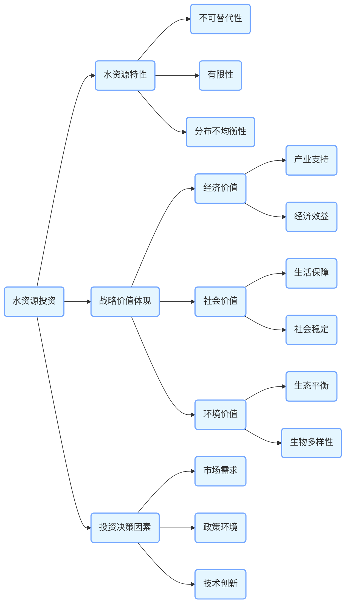

# 巴菲特 - 芒格的水资源投资：稀缺资源的战略价值

> 关键词：巴菲特、芒格、水资源投资、稀缺资源、战略价值、投资逻辑、市场趋势

> 摘要：本文聚焦于巴菲特和芒格的水资源投资行为，深入剖析稀缺资源——水资源所蕴含的战略价值。通过对巴菲特和芒格投资理念的探讨，结合水资源的特性和市场现状，阐述水资源投资背后的逻辑。详细分析水资源投资的核心概念、相关算法原理、数学模型，并且通过项目实战案例展示具体操作过程。同时探讨水资源投资在实际中的应用场景，推荐相关的学习工具、资源及论文著作。最后总结水资源投资的未来发展趋势与挑战，为读者提供全面且深入的关于巴菲特 - 芒格水资源投资的专业解读。

## 1. 背景介绍 
### 1.1 目的和范围
本文旨在全面解读巴菲特和芒格的水资源投资决策，揭示水资源作为稀缺资源的战略价值。范围涵盖了水资源投资的各个方面，包括投资的理论基础、市场分析、实际操作案例以及未来发展趋势等。通过对这些内容的探讨，帮助读者理解水资源投资的本质和意义，以及如何在投资决策中考虑水资源这一关键因素。

### 1.2 预期读者
本文预期读者包括对投资领域感兴趣的专业人士，如投资者、基金经理、金融分析师等；也适合关注资源战略和可持续发展的研究人员、政策制定者；同时，对巴菲特和芒格投资理念有学习需求的普通读者也能从本文中获得有价值的信息。

### 1.3 文档结构概述
本文将按照以下结构展开：首先介绍核心概念与联系，帮助读者建立对水资源投资相关概念的基本认知；接着阐述核心算法原理和具体操作步骤，以Python代码示例展示相关算法；然后讲解数学模型和公式，并举例说明；通过项目实战部分呈现代码实际案例和详细解释；探讨实际应用场景；推荐相关的工具和资源；最后总结未来发展趋势与挑战，并提供常见问题解答和扩展阅读参考资料。

### 1.4 术语表
#### 1.4.1 核心术语定义
- **水资源投资**：指对与水资源相关的产业、项目或资产进行的投资活动，包括水资源的开发、利用、保护、管理等环节。
- **稀缺资源**：在一定时间和空间范围内，相对于人类的需求而言，供给量有限且难以满足全部需求的资源。
- **战略价值**：资源或资产在长期发展过程中，对企业、国家或社会的战略目标实现具有重要意义和作用的价值。

#### 1.4.2 相关概念解释
- **水资源产权**：指对水资源的所有权、使用权、收益权和处分权等一系列权利的统称。不同的水资源产权制度会影响水资源的配置和投资决策。
- **水资源定价机制**：确定水资源价格的方式和方法，包括成本定价、市场定价、影子价格定价等多种方式，合理的定价机制对于水资源投资的经济效益至关重要。

#### 1.4.3 缩略词列表
- **GDP**：国内生产总值（Gross Domestic Product）
- **ROI**：投资回报率（Return on Investment）

## 2. 核心概念与联系 
### 核心概念原理
水资源作为地球上最重要的自然资源之一，具有不可替代性、有限性和分布不均衡性等特点。随着全球人口的增长、经济的发展和气候变化的影响，水资源的稀缺性日益凸显。巴菲特和芒格的水资源投资正是基于对水资源稀缺性和战略价值的深刻认识。

水资源的战略价值体现在多个方面。从经济角度看，水资源是众多产业的基础生产要素，如农业、工业和服务业都离不开水资源的支持。水资源的供应稳定与否直接影响着这些产业的发展和经济效益。从社会角度看，水资源是人类生存和发展的基本保障，关系到人民的生活质量和社会的稳定。从环境角度看，水资源对于维持生态平衡、保护生物多样性具有至关重要的作用。

### 架构的文本示意图
```plaintext
水资源投资
|-- 水资源特性
|   |-- 不可替代性
|   |-- 有限性
|   |-- 分布不均衡性
|-- 战略价值体现
|   |-- 经济价值
|   |   |-- 产业支持
|   |   |-- 经济效益
|   |-- 社会价值
|   |   |-- 生活保障
|   |   |-- 社会稳定
|   |-- 环境价值
|   |   |-- 生态平衡
|   |   |-- 生物多样性
|-- 投资决策因素
|   |-- 市场需求
|   |-- 政策环境
|   |-- 技术创新
```

### Mermaid 流程图


## 3. 核心算法原理 & 具体操作步骤 
### 核心算法原理
在水资源投资决策中，常用的算法之一是基于净现值（NPV）的投资评估算法。净现值是指投资项目在未来各期现金流量的现值之和与初始投资之间的差额。其基本原理是考虑资金的时间价值，将未来的现金流量按照一定的折现率折现到当前时刻，以评估投资项目的盈利能力和可行性。

### Python 源代码详细阐述
```python
import numpy as np

def calculate_npv(initial_investment, cash_flows, discount_rate):
    """
    计算投资项目的净现值

    :param initial_investment: 初始投资金额
    :param cash_flows: 未来各期的现金流量列表
    :param discount_rate: 折现率
    :return: 净现值
    """
    npv = -initial_investment
    for i, cash_flow in enumerate(cash_flows):
        present_value = cash_flow / (1 + discount_rate) ** (i + 1)
        npv += present_value
    return npv

# 示例数据
initial_investment = 1000000  # 初始投资 100 万元
cash_flows = [200000, 300000, 400000, 500000, 600000]  # 未来 5 年的现金流量
discount_rate = 0.1  # 折现率为 10%

npv = calculate_npv(initial_investment, cash_flows, discount_rate)
print(f"该水资源投资项目的净现值为: {npv} 元")
```

### 具体操作步骤
1. **确定初始投资**：明确水资源投资项目所需的初始资金投入，包括设备购置、土地租赁、工程建设等费用。
2. **预测未来现金流量**：根据项目的运营计划和市场分析，预测项目在未来各期（通常按年计算）的现金流入和流出情况，计算出净现金流量。
3. **选择折现率**：折现率反映了资金的时间价值和投资的风险水平。一般可以参考市场利率、行业平均收益率等因素来确定折现率。
4. **计算净现值**：使用上述 Python 代码中的 `calculate_npv` 函数，将初始投资、未来现金流量和折现率作为输入参数，计算出项目的净现值。
5. **决策判断**：如果净现值大于零，说明项目的预期收益超过了初始投资和资金的时间价值，项目具有投资价值；如果净现值小于零，则项目可能不具有投资可行性。

## 4. 数学模型和公式 & 详细讲解 & 举例说明 
### 数学模型和公式
净现值（NPV）的数学模型可以用以下公式表示：

$$NPV = -I_0 + \sum_{t=1}^{n} \frac{CF_t}{(1 + r)^t}$$

其中：
- $NPV$ 表示净现值
- $I_0$ 表示初始投资
- $CF_t$ 表示第 $t$ 期的现金流量
- $r$ 表示折现率
- $n$ 表示投资项目的寿命期

### 详细讲解
公式的第一项 $-I_0$ 表示初始投资的现金流出，为负数。后面的求和项 $\sum_{t=1}^{n} \frac{CF_t}{(1 + r)^t}$ 表示未来各期现金流量的现值之和。对于每一期的现金流量 $CF_t$，需要将其按照折现率 $r$ 折现到当前时刻，即除以 $(1 + r)^t$。

### 举例说明
假设一个水资源投资项目的初始投资 $I_0 = 500000$ 元，未来 3 年的现金流量分别为 $CF_1 = 100000$ 元，$CF_2 = 200000$ 元，$CF_3 = 300000$ 元，折现率 $r = 0.08$。

首先计算各期现金流量的现值：
- 第 1 期现金流量的现值：$\frac{CF_1}{(1 + r)^1} = \frac{100000}{(1 + 0.08)^1} \approx 92592.59$ 元
- 第 2 期现金流量的现值：$\frac{CF_2}{(1 + r)^2} = \frac{200000}{(1 + 0.08)^2} \approx 171467.76$ 元
- 第 3 期现金流量的现值：$\frac{CF_3}{(1 + r)^3} = \frac{300000}{(1 + 0.08)^3} \approx 238149.67$ 元

然后计算净现值：
$$NPV = -500000 + 92592.59 + 171467.76 + 238149.67 \approx 22210.02$$ 元

由于净现值 $NPV > 0$，说明该水资源投资项目在给定的折现率下具有投资价值。

## 5. 项目实战：代码实际案例和详细解释说明 
### 5.1 开发环境搭建
#### 操作系统
可以选择 Windows、Linux 或 macOS 等主流操作系统。

#### Python 环境
推荐使用 Python 3.7 及以上版本。可以从 Python 官方网站（https://www.python.org/downloads/） 下载并安装 Python。

#### 开发工具
可以使用 PyCharm、VS Code 等集成开发环境（IDE），或者使用 Jupyter Notebook 进行交互式开发。

### 5.2 源代码详细实现和代码解读
```python
import numpy as np

def calculate_npv(initial_investment, cash_flows, discount_rate):
    """
    计算投资项目的净现值

    :param initial_investment: 初始投资金额
    :param cash_flows: 未来各期的现金流量列表
    :param discount_rate: 折现率
    :return: 净现值
    """
    npv = -initial_investment
    for i, cash_flow in enumerate(cash_flows):
        present_value = cash_flow / (1 + discount_rate) ** (i + 1)
        npv += present_value
    return npv

def analyze_water_investment():
    # 输入初始投资
    initial_investment = float(input("请输入水资源投资项目的初始投资金额（元）: "))
    # 输入未来现金流量期数
    num_periods = int(input("请输入未来现金流量的期数: "))
    cash_flows = []
    for i in range(num_periods):
        cash_flow = float(input(f"请输入第 {i + 1} 期的现金流量（元）: "))
        cash_flows.append(cash_flow)
    # 输入折现率
    discount_rate = float(input("请输入折现率（例如 0.1 表示 10%）: "))

    npv = calculate_npv(initial_investment, cash_flows, discount_rate)
    print(f"该水资源投资项目的净现值为: {npv} 元")

    if npv > 0:
        print("该项目具有投资价值。")
    else:
        print("该项目可能不具有投资可行性。")

if __name__ == "__main__":
    analyze_water_investment()
```

### 代码解读与分析
- **`calculate_npv` 函数**：该函数实现了净现值的计算逻辑。首先将初始投资作为负数赋值给 `npv`，然后遍历未来各期的现金流量，计算每一期现金流量的现值并累加到 `npv` 中，最后返回净现值。
- **`analyze_water_investment` 函数**：该函数用于与用户交互，获取用户输入的初始投资、未来现金流量和折现率。调用 `calculate_npv` 函数计算净现值，并根据净现值的结果输出投资建议。
- **主程序**：调用 `analyze_water_investment` 函数，启动投资分析程序。

## 6. 实际应用场景 
### 水资源开发项目投资
对于水资源开发项目，如建设水库、水电站、海水淡化厂等，投资者可以使用净现值等投资评估方法来判断项目的可行性。通过预测项目的建设成本、运营收入和维护费用等现金流量，结合适当的折现率，计算项目的净现值，从而决定是否进行投资。

### 水资源处理企业投资
投资水资源处理企业，如污水处理厂、自来水公司等，也需要考虑水资源的稀缺性和战略价值。投资者可以分析企业的市场前景、技术实力、运营成本和收益等因素，使用相关的投资评估工具来评估投资的价值。

### 水资源相关技术研发投资
随着水资源问题的日益严峻，对水资源相关技术研发的投资也越来越受到关注。例如，投资研发节水技术、水资源监测技术、污水处理新技术等。投资者可以通过评估技术的创新性、市场需求和商业潜力等因素，来决定是否进行投资。

## 7. 工具和资源推荐
### 7.1 学习资源推荐
#### 7.1.1 书籍推荐
- 《聪明的投资者》（The Intelligent Investor）：作者本杰明·格雷厄姆（Benjamin Graham），这本书是价值投资的经典著作，巴菲特称其为自己投资生涯的启蒙书，书中的投资理念对理解巴菲特和芒格的投资行为具有重要意义。
- 《穷查理宝典：查理·芒格的智慧箴言录》（Poor Charlie's Almanack: The Wit and Wisdom of Charles T. Munger）：全面介绍了查理·芒格的投资思想、人生哲学和多元思维模型，对于学习巴菲特 - 芒格的投资方法有很大帮助。
- 《水资源经济学》：系统介绍了水资源的经济特性、水资源的配置和管理、水资源定价等方面的知识，有助于深入理解水资源投资的经济原理。

#### 7.1.2 在线课程
- Coursera 平台上的“投资学原理”课程：由知名大学的教授授课，涵盖了投资的基本概念、投资评估方法、资产定价等内容，对于学习投资理论和方法非常有帮助。
- edX 平台上的“水资源管理与政策”课程：介绍了水资源管理的基本理论和方法、水资源政策的制定和实施等内容，有助于了解水资源领域的相关政策和管理知识。

#### 7.1.3 技术博客和网站
- 雪球网：是国内知名的投资交流社区，有很多投资者分享自己的投资经验和观点，对于了解市场动态和投资趋势有很大帮助。
- 世界银行官网（https://www.worldbank.org/）：提供了大量关于水资源开发、管理和投资的研究报告和数据，是了解全球水资源状况和相关政策的重要渠道。

### 7.2 开发工具框架推荐
#### 7.2.1 IDE和编辑器
- PyCharm：是一款专门为 Python 开发设计的集成开发环境，具有强大的代码编辑、调试和自动完成等功能，适合开发复杂的 Python 项目。
- VS Code：是一款轻量级的代码编辑器，支持多种编程语言，具有丰富的插件生态系统，可以根据需要安装各种插件来扩展功能。

#### 7.2.2 调试和性能分析工具
- PDB：是 Python 内置的调试器，可以帮助开发者定位代码中的错误和问题。
- cProfile：是 Python 标准库中的性能分析工具，可以分析代码的运行时间和函数调用情况，帮助开发者优化代码性能。

#### 7.2.3 相关框架和库
- NumPy：是 Python 中用于科学计算的基础库，提供了高效的数组操作和数学函数，在处理水资源投资中的数据计算和分析时非常有用。
- Pandas：是 Python 中用于数据处理和分析的库，提供了丰富的数据结构和数据处理方法，方便对水资源投资数据进行整理和分析。

### 7.3 相关论文著作推荐
#### 7.3.1 经典论文
- 《The Theory of Investment Value》（投资价值理论）：作者约翰·伯尔·威廉姆斯（John Burr Williams），提出了现金流折现模型，是投资评估理论的重要基础。
- 《The Economic Theory of Natural Resource Depletion》（自然资源耗竭的经济理论）：探讨了自然资源的稀缺性和经济价值，对于理解水资源等稀缺资源的投资具有重要参考价值。

#### 7.3.2 最新研究成果
- 关注《Water Resources Research》《Journal of Hydrology》等国际知名期刊上的最新研究论文，了解水资源领域的最新研究动态和技术发展趋势。

#### 7.3.3 应用案例分析
- 参考世界银行、国际货币基金组织等国际组织发布的关于水资源投资项目的案例分析报告，学习实际项目中的投资决策方法和经验教训。

## 8. 总结：未来发展趋势与挑战
### 未来发展趋势
- **技术创新推动投资机会增加**：随着科技的不断进步，水资源领域的技术创新将不断涌现，如更高效的节水技术、更先进的污水处理技术、更精准的水资源监测技术等。这些技术创新将为水资源投资带来更多的机会，投资者可以关注相关的技术研发和应用项目。
- **政策支持力度加大**：为了应对水资源短缺和水污染等问题，各国政府将加大对水资源领域的政策支持力度，出台更多的优惠政策和补贴措施，鼓励社会资本参与水资源投资。这将为水资源投资创造更加有利的政策环境。
- **国际合作加强**：水资源是全球性的问题，需要各国共同合作来解决。未来，国际间在水资源开发、利用和保护等方面的合作将不断加强，跨国水资源投资项目也将逐渐增多。

### 挑战
- **投资风险较高**：水资源投资项目通常具有投资周期长、资金需求量大、技术难度高、政策风险大等特点，投资风险相对较高。投资者需要充分评估投资风险，制定合理的投资策略。
- **水资源产权和定价机制不完善**：目前，全球范围内的水资源产权和定价机制还不完善，导致水资源的价值难以得到准确体现，影响了水资源投资的经济效益和市场积极性。需要进一步完善水资源产权和定价机制，提高水资源的配置效率。
- **环境和社会影响评估难度大**：水资源投资项目往往会对环境和社会产生重要影响，如水库建设可能会影响生态环境和居民的生活。对环境和社会影响的评估需要综合考虑多个因素，难度较大。投资者需要加强对环境和社会影响的评估和管理，确保项目的可持续发展。

## 9. 附录：常见问题与解答
### 1. 水资源投资的回报周期一般有多长？
水资源投资项目的回报周期因项目类型和规模而异。一般来说，水资源开发项目如水库建设、水电站建设等的回报周期较长，可能需要 10 年以上；而水资源处理企业投资和水资源相关技术研发投资的回报周期相对较短，可能在 3 - 5 年左右。

### 2. 如何评估水资源投资项目的风险？
评估水资源投资项目的风险需要综合考虑多个因素，包括市场风险、技术风险、政策风险、环境风险等。可以使用风险评估模型和方法，如敏感性分析、情景分析等，对项目的风险进行量化评估。同时，还需要关注项目的可行性研究报告、环境影响评价报告等相关文件，了解项目的风险状况。

### 3. 水资源投资与可持续发展有什么关系？
水资源投资与可持续发展密切相关。合理的水资源投资可以促进水资源的可持续利用，保障人民的生活用水需求，支持经济的可持续发展。同时，水资源投资项目也需要考虑环境和社会影响，遵循可持续发展的原则，实现经济效益、社会效益和环境效益的统一。

## 10. 扩展阅读 & 参考资料
### 扩展阅读
- 《金融炼金术》（The Alchemy of Finance）：作者乔治·索罗斯（George Soros），介绍了索罗斯的投资哲学和投资方法，对于拓宽投资视野和思维方式有很大帮助。
- 《创新者的窘境》（The Innovator's Dilemma）：作者克莱顿·克里斯坦森（Clayton Christensen），探讨了创新对于企业和行业发展的影响，对于理解水资源领域的技术创新和投资机会有一定的启示作用。

### 参考资料
- 巴菲特和芒格的历年股东大会发言记录
- 世界银行发布的《世界水资源发展报告》
- 国际货币基金组织发布的相关经济研究报告
- 各水资源相关企业的年报和财务报表