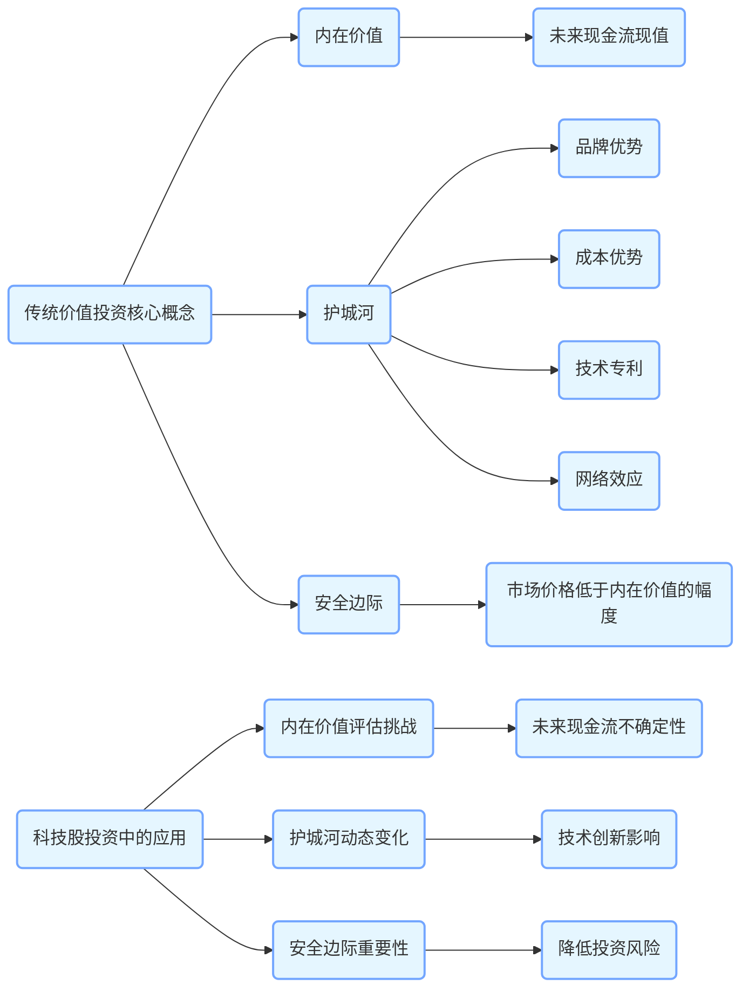

# 巴菲特 - 芒格的科技股投资观：传统价值投资在科技领域的应用

> 关键词：巴菲特、芒格、科技股投资、传统价值投资、护城河、内在价值、安全边际

> 摘要：本文深入探讨了巴菲特和芒格的科技股投资观，以及传统价值投资理念在科技领域的应用。通过对巴菲特和芒格投资思想的背景介绍，阐述了核心概念如内在价值、护城河等在科技股投资中的意义与联系。详细分析了其核心投资算法原理及操作步骤，借助数学模型和公式加深理解。结合实际案例展示了传统价值投资在科技股投资中的具体应用，探讨了其实际应用场景。同时推荐了相关学习资源、开发工具框架和论文著作。最后总结了未来科技股投资的发展趋势与挑战，并提供常见问题解答和参考资料，旨在为投资者理解和运用传统价值投资于科技股领域提供全面且深入的指导。

## 1. 背景介绍 
### 1.1 目的和范围
本文的目的在于深入剖析巴菲特 - 芒格的科技股投资观，探究传统价值投资理念如何在科技领域得以应用。传统价值投资理论由本杰明·格雷厄姆创立，经巴菲特和芒格等投资大师的发展与实践，在金融市场取得了巨大成功。然而，科技行业具有快速变化、创新驱动等特点，与传统行业存在显著差异。因此，研究传统价值投资在科技领域的应用，有助于投资者更好地理解科技股的投资逻辑，把握科技行业的投资机会，同时也能为价值投资理论的发展和完善提供新的视角。

本文的范围涵盖了巴菲特和芒格的投资思想和理念，传统价值投资的核心概念在科技股投资中的应用，科技股投资的核心算法原理和操作步骤，以及相关的数学模型和公式。此外，还将通过实际案例分析展示传统价值投资在科技股投资中的具体应用，并探讨其在不同场景下的应用价值。

### 1.2 预期读者
本文预期读者包括对投资领域感兴趣的普通投资者、专业投资机构的从业人员、金融领域的研究人员以及相关专业的学生。对于普通投资者而言，本文可以帮助他们理解巴菲特 - 芒格的投资智慧，学习如何运用传统价值投资理念进行科技股投资，提高投资决策的科学性和合理性。专业投资机构的从业人员可以通过本文深入探讨传统价值投资在科技领域的应用，为投资策略的制定和优化提供参考。金融领域的研究人员可以从理论和实践的角度对本文进行分析和研究，为价值投资理论的发展做出贡献。相关专业的学生则可以将本文作为学习投资知识和研究投资案例的参考资料，加深对投资学的理解和认识。

### 1.3 文档结构概述
本文将按照以下结构进行阐述：
1. **背景介绍**：介绍本文的目的和范围、预期读者、文档结构概述以及相关术语表。
2. **核心概念与联系**：阐述传统价值投资的核心概念，如内在价值、护城河、安全边际等，并分析这些概念在科技股投资中的意义与联系，同时提供相应的文本示意图和 Mermaid 流程图。
3. **核心算法原理 & 具体操作步骤**：详细讲解传统价值投资在科技股投资中的核心算法原理，并给出具体的操作步骤，同时使用 Python 源代码进行详细阐述。
4. **数学模型和公式 & 详细讲解 & 举例说明**：介绍与科技股投资相关的数学模型和公式，并进行详细讲解和举例说明。
5. **项目实战：代码实际案例和详细解释说明**：通过实际案例展示传统价值投资在科技股投资中的具体应用，包括开发环境搭建、源代码详细实现和代码解读、代码解读与分析。
6. **实际应用场景**：探讨传统价值投资在科技股投资中的实际应用场景，如新兴科技企业投资、成熟科技巨头投资等。
7. **工具和资源推荐**：推荐相关的学习资源、开发工具框架和论文著作，帮助读者进一步深入学习和研究。
8. **总结：未来发展趋势与挑战**：总结传统价值投资在科技领域的应用现状，分析未来发展趋势和面临的挑战。
9. **附录：常见问题与解答**：提供常见问题的解答，帮助读者更好地理解和应用本文的内容。
10. **扩展阅读 & 参考资料**：提供扩展阅读的建议和相关参考资料，方便读者进一步深入学习和研究。

### 1.4 术语表
#### 1.4.1 核心术语定义
- **价值投资**：一种基于公司内在价值进行投资的策略，投资者通过分析公司的财务状况、经营业绩、竞争优势等因素，评估公司的内在价值，并在股价低于内在价值时买入，等待股价回归内在价值时实现收益。
- **内在价值**：公司未来现金流的现值，是公司真实的价值水平，不受市场短期波动的影响。
- **护城河**：公司所拥有的可持续竞争优势，能够保护公司的市场份额和盈利能力，使其在竞争中脱颖而出。
- **安全边际**：股票的市场价格低于其内在价值的幅度，安全边际越大，投资的风险越低。
- **科技股**：指与科技行业相关的股票，包括互联网、半导体、人工智能、生物技术等领域的企业股票。

#### 1.4.2 相关概念解释
- **现金流折现模型（DCF）**：一种用于评估公司内在价值的方法，通过预测公司未来的现金流，并将其折现到当前时刻，得到公司的内在价值。
- **净资产收益率（ROE）**：衡量公司盈利能力的指标，反映了公司运用自有资本的效率。
- **市盈率（PE）**：股票价格与每股收益的比率，反映了市场对公司未来盈利的预期。

#### 1.4.3 缩略词列表
- **DCF**：Discounted Cash Flow（现金流折现模型）
- **ROE**：Return on Equity（净资产收益率）
- **PE**：Price - Earnings Ratio（市盈率）

## 2. 核心概念与联系 

### 传统价值投资核心概念
传统价值投资的核心概念包括内在价值、护城河和安全边际。

#### 内在价值
内在价值是价值投资的基石。它是公司未来现金流的现值，反映了公司的真实价值。从本质上讲，一家公司的价值取决于其未来能够产生的现金流量。对于投资者来说，准确评估公司的内在价值是做出正确投资决策的关键。例如，一家稳定盈利的传统制造业公司，其内在价值可以通过对其未来多年的盈利预测，并结合适当的折现率来计算。

#### 护城河
护城河是公司竞争优势的体现。它可以表现为多种形式，如品牌优势、成本优势、技术专利、网络效应等。拥有强大护城河的公司能够在市场竞争中抵御竞争对手的侵蚀，保持较高的市场份额和盈利能力。以可口可乐为例，其强大的品牌优势是其重要的护城河，使得它在全球饮料市场占据主导地位。

#### 安全边际
安全边际是价值投资的重要原则。它是指股票的市场价格低于其内在价值的幅度。当投资者以低于内在价值的价格买入股票时，就获得了安全边际。安全边际能够为投资者提供一定的缓冲，降低投资风险。例如，如果一家公司的内在价值被评估为每股 100 元，而其市场价格为每股 80 元，那么就存在 20% 的安全边际。

### 核心概念在科技股投资中的意义与联系
在科技股投资中，这些核心概念同样具有重要意义，但也面临一些挑战和变化。

#### 内在价值的评估挑战
科技行业的快速变化使得对科技公司内在价值的评估更加困难。科技公司的未来现金流往往具有较高的不确定性，因为它们所处的行业技术更新换代快，市场竞争激烈。例如，一家新兴的人工智能公司，其未来的盈利模式可能还不清晰，技术发展也存在较大的不确定性，这就给内在价值的评估带来了很大的挑战。

#### 护城河的动态变化
科技公司的护城河也具有动态变化的特点。在科技领域，技术创新是推动行业发展的关键因素。一家科技公司可能因为一项领先的技术而建立起强大的护城河，但随着技术的发展和竞争对手的追赶，其护城河可能会逐渐削弱。例如，曾经在智能手机市场占据领先地位的诺基亚，由于未能及时跟上智能手机技术的发展潮流，其原有的品牌和市场份额优势逐渐丧失，护城河被削弱。

#### 安全边际的重要性
在科技股投资中，安全边际的重要性更加凸显。由于科技股的波动性较大，市场价格可能会出现较大的波动。因此，投资者在投资科技股时，更需要关注安全边际，以降低投资风险。例如，在投资一家高估值的科技公司时，投资者需要仔细评估其内在价值，确保以足够低的价格买入，以获得安全边际。

### 文本示意图
```plaintext
传统价值投资核心概念
├── 内在价值
│   └── 未来现金流现值
├── 护城河
│   ├── 品牌优势
│   ├── 成本优势
│   ├── 技术专利
│   └── 网络效应
└── 安全边际
    └── 市场价格低于内在价值的幅度

科技股投资中的应用
├── 内在价值评估挑战
│   └── 未来现金流不确定性
├── 护城河动态变化
│   └── 技术创新影响
└── 安全边际重要性
    └── 降低投资风险
```

### Mermaid 流程图


## 3. 核心算法原理 & 具体操作步骤 

### 核心算法原理 - 现金流折现模型（DCF）
现金流折现模型是评估公司内在价值的常用方法。其基本原理是将公司未来的现金流折现到当前时刻，得到公司的内在价值。公式如下：

$$V = \sum_{t = 1}^{n} \frac{CF_t}{(1 + r)^t} + \frac{TV}{(1 + r)^n}$$

其中：
- $V$ 表示公司的内在价值
- $CF_t$ 表示第 $t$ 期的现金流
- $r$ 表示折现率
- $n$ 表示预测期数
- $TV$ 表示终值

### 具体操作步骤
1. **预测未来现金流**：分析公司的历史财务数据、行业发展趋势和公司的竞争优势，预测公司未来的现金流。对于科技公司，需要考虑技术创新、市场需求变化等因素对现金流的影响。
2. **确定折现率**：折现率反映了投资者对投资风险的预期。一般来说，折现率可以采用加权平均资本成本（WACC）。对于科技公司，由于其风险较高，折现率通常也会相对较高。
3. **确定预测期数**：预测期数的选择需要根据公司的具体情况和行业特点来确定。一般来说，可以选择 5 - 10 年作为预测期。
4. **计算终值**：终值是指预测期结束后公司的价值。可以采用永续增长模型来计算终值，公式如下：

$$TV = \frac{CF_{n+1}}{r - g}$$

其中：
- $CF_{n+1}$ 表示预测期结束后下一期的现金流
- $g$ 表示永续增长率

5. **计算内在价值**：将预测期内的现金流和终值折现到当前时刻，得到公司的内在价值。

### Python 源代码实现
```python
import numpy as np

def dcf_valuation(cash_flows, discount_rate, growth_rate, terminal_year):
    """
    计算公司的内在价值
    :param cash_flows: 预测期内的现金流列表
    :param discount_rate: 折现率
    :param growth_rate: 永续增长率
    :param terminal_year: 预测期数
    :return: 公司的内在价值
    """
    # 计算预测期内现金流的现值
    present_value_cash_flows = 0
    for t in range(1, terminal_year + 1):
        present_value_cash_flows += cash_flows[t - 1] / (1 + discount_rate) ** t
    
    # 计算终值
    terminal_cash_flow = cash_flows[-1] * (1 + growth_rate)
    terminal_value = terminal_cash_flow / (discount_rate - growth_rate)
    present_value_terminal_value = terminal_value / (1 + discount_rate) ** terminal_year
    
    # 计算内在价值
    intrinsic_value = present_value_cash_flows + present_value_terminal_value
    
    return intrinsic_value

# 示例数据
cash_flows = [100, 120, 140, 160, 180]  # 预测期内的现金流
discount_rate = 0.1  # 折现率
growth_rate = 0.03  # 永续增长率
terminal_year = 5  # 预测期数

# 计算内在价值
intrinsic_value = dcf_valuation(cash_flows, discount_rate, growth_rate, terminal_year)
print(f"公司的内在价值为: {intrinsic_value}")
```

### 代码解释
1. **函数定义**：`dcf_valuation` 函数接受四个参数：预测期内的现金流列表 `cash_flows`、折现率 `discount_rate`、永续增长率 `growth_rate` 和预测期数 `terminal_year`。
2. **计算预测期内现金流的现值**：通过循环遍历预测期内的现金流，将每期现金流折现到当前时刻，并累加得到预测期内现金流的现值。
3. **计算终值**：根据永续增长模型计算终值，并将其折现到当前时刻。
4. **计算内在价值**：将预测期内现金流的现值和终值的现值相加，得到公司的内在价值。
5. **示例数据和结果输出**：定义示例数据，调用 `dcf_valuation` 函数计算内在价值，并输出结果。

## 4. 数学模型和公式 & 详细讲解 & 举例说明 

### 现金流折现模型（DCF）
#### 公式回顾
$$V = \sum_{t = 1}^{n} \frac{CF_t}{(1 + r)^t} + \frac{TV}{(1 + r)^n}$$

其中：
- $V$ 表示公司的内在价值
- $CF_t$ 表示第 $t$ 期的现金流
- $r$ 表示折现率
- $n$ 表示预测期数
- $TV$ 表示终值

#### 详细讲解
1. **预测期内现金流的现值**：$\sum_{t = 1}^{n} \frac{CF_t}{(1 + r)^t}$ 表示预测期内各期现金流的现值之和。由于货币具有时间价值，未来的现金流需要折现到当前时刻才能与当前的投资进行比较。折现率 $r$ 反映了投资者对投资风险的预期，风险越高，折现率越高。
2. **终值的现值**：$\frac{TV}{(1 + r)^n}$ 表示终值的现值。终值是指预测期结束后公司的价值，通常采用永续增长模型来计算。永续增长模型假设公司在预测期结束后将以一个固定的增长率 $g$ 持续增长。
3. **内在价值的计算**：将预测期内现金流的现值和终值的现值相加，得到公司的内在价值。

#### 举例说明
假设一家科技公司的预测期为 5 年，预测期内各年的现金流分别为 100 万元、120 万元、140 万元、160 万元和 180 万元。折现率为 10%，永续增长率为 3%。

1. **计算预测期内现金流的现值**：
   - 第 1 年现金流的现值：$\frac{100}{(1 + 0.1)^1} \approx 90.91$ 万元
   - 第 2 年现金流的现值：$\frac{120}{(1 + 0.1)^2} \approx 99.17$ 万元
   - 第 3 年现金流的现值：$\frac{140}{(1 + 0.1)^3} \approx 105.18$ 万元
   - 第 4 年现金流的现值：$\frac{160}{(1 + 0.1)^4} \approx 109.28$ 万元
   - 第 5 年现金流的现值：$\frac{180}{(1 + 0.1)^5} \approx 111.73$ 万元
   - 预测期内现金流的现值之和：$90.91 + 99.17 + 105.18 + 109.28 + 111.73 = 516.27$ 万元

2. **计算终值**：
   - 第 6 年的现金流：$180 \times (1 + 0.03) = 185.4$ 万元
   - 终值：$\frac{185.4}{0.1 - 0.03} \approx 2648.57$ 万元
   - 终值的现值：$\frac{2648.57}{(1 + 0.1)^5} \approx 1647.74$ 万元

3. **计算内在价值**：
   - 内在价值：$516.27 + 1647.74 = 2164.01$ 万元

### 净资产收益率（ROE）
#### 公式
$$ROE = \frac{净利润}{净资产} \times 100\%$$

#### 详细讲解
净资产收益率（ROE）是衡量公司盈利能力的重要指标。它反映了公司运用自有资本的效率，即公司每投入一元自有资本能够获得多少净利润。ROE 越高，说明公司的盈利能力越强，股东的回报越高。

#### 举例说明
假设一家科技公司的净利润为 1000 万元，净资产为 5000 万元。则该公司的 ROE 为：

$$ROE = \frac{1000}{5000} \times 100\% = 20\%$$

这意味着该公司每投入一元自有资本能够获得 0.2 元的净利润，盈利能力较强。

### 市盈率（PE）
#### 公式
$$PE = \frac{股票价格}{每股收益}$$

#### 详细讲解
市盈率（PE）是衡量股票估值的常用指标。它反映了市场对公司未来盈利的预期。PE 越高，说明市场对公司未来盈利的预期越高，但同时也意味着股票的估值越高，投资风险也相对较大。

#### 举例说明
假设一家科技公司的股票价格为 50 元，每股收益为 2 元。则该公司的 PE 为：

$$PE = \frac{50}{2} = 25$$

这意味着投资者愿意为该公司每一元的盈利支付 25 元的价格。

## 5. 项目实战：代码实际案例和详细解释说明 

### 5.1  开发环境搭建
#### 操作系统
可以选择 Windows、Mac OS 或 Linux 操作系统。本文以 Windows 10 为例进行说明。

#### 编程语言和版本
使用 Python 3.7 及以上版本。可以从 Python 官方网站（https://www.python.org/downloads/） 下载并安装。

#### 开发工具
推荐使用 PyCharm 作为开发工具。可以从 JetBrains 官方网站（https://www.jetbrains.com/pycharm/download/） 下载并安装社区版。

#### 安装必要的库
在命令行中使用以下命令安装必要的库：
```sh
pip install numpy pandas matplotlib
```

### 5.2  源代码详细实现和代码解读
```python
import numpy as np
import pandas as pd
import matplotlib.pyplot as plt

# 定义现金流折现模型函数
def dcf_valuation(cash_flows, discount_rate, growth_rate, terminal_year):
    """
    计算公司的内在价值
    :param cash_flows: 预测期内的现金流列表
    :param discount_rate: 折现率
    :param growth_rate: 永续增长率
    :param terminal_year: 预测期数
    :return: 公司的内在价值
    """
    # 计算预测期内现金流的现值
    present_value_cash_flows = 0
    for t in range(1, terminal_year + 1):
        present_value_cash_flows += cash_flows[t - 1] / (1 + discount_rate) ** t
    
    # 计算终值
    terminal_cash_flow = cash_flows[-1] * (1 + growth_rate)
    terminal_value = terminal_cash_flow / (discount_rate - growth_rate)
    present_value_terminal_value = terminal_value / (1 + discount_rate) ** terminal_year
    
    # 计算内在价值
    intrinsic_value = present_value_cash_flows + present_value_terminal_value
    
    return intrinsic_value

# 示例数据
cash_flows = [100, 120, 140, 160, 180]  # 预测期内的现金流
discount_rate = 0.1  # 折现率
growth_rate = 0.03  # 永续增长率
terminal_year = 5  # 预测期数

# 计算内在价值
intrinsic_value = dcf_valuation(cash_flows, discount_rate, growth_rate, terminal_year)
print(f"公司的内在价值为: {intrinsic_value}")

# 绘制现金流折现图
years = np.arange(1, terminal_year + 1)
present_values = [cash_flows[i] / (1 + discount_rate) ** (i + 1) for i in range(terminal_year)]
plt.figure(figsize=(10, 6))
plt.bar(years, present_values, label='预测期内现金流现值')
plt.axhline(y=intrinsic_value, color='r', linestyle='--', label='内在价值')
plt.xlabel('年份')
plt.ylabel('现值')
plt.title('现金流折现图')
plt.legend()
plt.show()
```

### 5.3  代码解读与分析
#### 代码功能概述
这段代码实现了现金流折现模型（DCF）的计算，并绘制了现金流折现图。主要步骤包括：
1. 定义 `dcf_valuation` 函数，用于计算公司的内在价值。
2. 定义示例数据，包括预测期内的现金流、折现率、永续增长率和预测期数。
3. 调用 `dcf_valuation` 函数计算公司的内在价值，并输出结果。
4. 绘制现金流折现图，展示预测期内现金流的现值和公司的内在价值。

#### 代码详细解读
1. **导入必要的库**：导入 `numpy`、`pandas` 和 `matplotlib.pyplot` 库，分别用于数值计算、数据处理和绘图。
2. **定义 `dcf_valuation` 函数**：该函数接受四个参数：预测期内的现金流列表 `cash_flows`、折现率 `discount_rate`、永续增长率 `growth_rate` 和预测期数 `terminal_year`。函数内部通过循环计算预测期内现金流的现值，根据永续增长模型计算终值，并将两者相加得到公司的内在价值。
3. **定义示例数据**：定义预测期内的现金流、折现率、永续增长率和预测期数。
4. **计算内在价值**：调用 `dcf_valuation` 函数计算公司的内在价值，并输出结果。
5. **绘制现金流折现图**：使用 `matplotlib.pyplot` 库绘制现金流折现图，展示预测期内现金流的现值和公司的内在价值。

#### 代码分析
通过这段代码，我们可以直观地看到预测期内现金流的现值和公司的内在价值。现金流折现图可以帮助我们更好地理解现金流折现模型的原理和计算过程。同时，我们可以通过修改示例数据，如预测期内的现金流、折现率、永续增长率和预测期数，来分析不同参数对公司内在价值的影响。

## 6. 实际应用场景 

### 新兴科技企业投资
对于新兴科技企业，传统价值投资理念同样具有重要的指导意义。虽然新兴科技企业往往处于发展初期，盈利能力尚未完全显现，但通过深入分析其技术创新能力、市场前景和竞争优势，可以评估其潜在的内在价值。

#### 技术创新能力评估
新兴科技企业的核心竞争力往往在于其技术创新能力。投资者可以关注企业的研发投入、专利数量、技术团队实力等因素，评估其技术创新的潜力。例如，一家专注于人工智能领域的新兴企业，如果拥有一支由顶尖科学家和工程师组成的研发团队，并且在人工智能算法和应用方面取得了一系列的专利，那么该企业就具有较强的技术创新能力。

#### 市场前景分析
市场前景是评估新兴科技企业内在价值的重要因素。投资者需要分析企业所处的行业发展趋势、市场规模和竞争格局，判断企业的产品或服务是否具有广阔的市场前景。例如，随着 5G 技术的普及，物联网、智能驾驶等领域的市场需求将不断增长。如果一家新兴科技企业能够抓住这些市场机遇，推出符合市场需求的产品或服务，那么其市场前景将非常广阔。

#### 竞争优势判断
新兴科技企业需要具备一定的竞争优势才能在市场竞争中脱颖而出。竞争优势可以表现为技术领先、成本优势、品牌优势等。例如，一家新兴的新能源汽车企业，如果能够通过技术创新降低生产成本，提高产品性能，并且建立起良好的品牌形象，那么该企业就具有较强的竞争优势。

### 成熟科技巨头投资
对于成熟科技巨头，传统价值投资理念可以帮助投资者评估其投资价值和风险。

#### 财务状况分析
成熟科技巨头通常具有较为稳定的财务状况。投资者可以通过分析其财务报表，如资产负债表、利润表和现金流量表，评估其盈利能力、偿债能力和现金流状况。例如，一家成熟的互联网科技巨头，如果其净利润持续增长，资产负债率较低，现金流充沛，那么该企业的财务状况就比较稳健。

#### 护城河评估
成熟科技巨头往往拥有强大的护城河。投资者需要分析其护城河的来源和可持续性，判断其在市场竞争中的地位。例如，一家成熟的电子商务企业，其强大的品牌优势、庞大的用户基础和完善的物流体系就是其重要的护城河。这些护城河能够保护企业的市场份额和盈利能力，使其在竞争中保持领先地位。

#### 估值判断
在投资成熟科技巨头时，估值是一个重要的考虑因素。投资者可以使用市盈率、市净率等估值指标，结合企业的基本面情况，判断其股票是否具有投资价值。例如，如果一家成熟科技巨头的市盈率低于行业平均水平，而其盈利能力和增长前景较好，那么该企业的股票可能被低估，具有投资价值。

### 科技行业并购投资
在科技行业的并购活动中，传统价值投资理念可以帮助投资者评估并购目标的价值和风险。

#### 目标企业价值评估
在进行并购投资时，投资者需要对目标企业的价值进行评估。可以使用现金流折现模型、可比公司分析等方法，结合目标企业的财务状况、市场前景和竞争优势，评估其内在价值。例如，一家科技企业计划并购另一家新兴科技企业，在评估目标企业的价值时，需要考虑其技术创新能力、市场份额和未来的增长潜力。

#### 协同效应分析
并购投资的一个重要目标是实现协同效应。投资者需要分析并购双方在技术、市场、管理等方面的协同潜力，判断并购是否能够创造价值。例如，一家成熟的软件企业并购一家新兴的人工智能企业，通过整合双方的技术和资源，可能实现技术创新的协同效应，提高企业的市场竞争力。

#### 风险评估
并购投资也存在一定的风险，如整合风险、文化冲突风险等。投资者需要对这些风险进行评估，并采取相应的措施来降低风险。例如，在并购完成后，企业需要制定合理的整合计划，加强文化融合，以确保并购的顺利进行。

## 7. 工具和资源推荐
### 7.1 学习资源推荐
#### 7.1.1 书籍推荐
- 《聪明的投资者》（The Intelligent Investor）：本杰明·格雷厄姆著，被誉为价值投资的圣经。这本书系统地阐述了价值投资的理论和方法，对投资者具有重要的指导意义。
- 《巴菲特致股东的信：股份公司教程》（Letters to Shareholders of Berkshire Hathaway）：沃伦·巴菲特著，收录了巴菲特多年来致股东的信。通过阅读这些信件，投资者可以深入了解巴菲特的投资思想和理念。
- 《穷查理宝典：查理·芒格的智慧箴言录》（Poor Charlie's Almanack: The Wit and Wisdom of Charles T. Munger）：彼得·考夫曼编著，全面介绍了查理·芒格的投资思想、人生哲学和多元思维模型。
- 《创新者的窘境》（The Innovator's Dilemma: When New Technologies Cause Great Firms to Fail）：克莱顿·克里斯坦森著，探讨了新兴技术对传统企业的冲击和挑战，以及企业如何应对创新的困境。
- 《浪潮之巅》：吴军著，讲述了科技行业的发展历程和兴衰变迁，分析了科技企业的成功和失败原因，对投资者了解科技行业具有重要的参考价值。

#### 7.1.2 在线课程
- Coursera 平台上的“投资学原理”（Principles of Investing）课程：由哥伦比亚大学教授授课，系统地介绍了投资学的基本原理和方法。
- edX 平台上的“价值投资：从基础到实践”（Value Investing: From Principles to Practice）课程：帮助学习者掌握价值投资的理论和实践技巧。
- 中国大学 MOOC 平台上的“金融市场与金融机构”课程：介绍了金融市场的基本概念和运行机制，以及金融机构的功能和作用，对投资者了解金融市场具有重要的帮助。

#### 7.1.3 技术博客和网站
- 雪球网（https://xueqiu.com/）：一个投资交流社区，提供股票、基金等投资产品的资讯和分析，投资者可以在上面交流投资经验和心得。
- 东方财富网（https://www.eastmoney.com/）：国内知名的金融资讯网站，提供全面的金融市场信息和数据分析。
- Seeking Alpha（https://seekingalpha.com/）：一个全球知名的投资研究平台，提供专业的投资分析和研究报告。

### 7.2 开发工具框架推荐
#### 7.2.1 IDE和编辑器
- PyCharm：一款专业的 Python 集成开发环境，具有代码编辑、调试、版本控制等功能，适合开发 Python 投资分析程序。
- Jupyter Notebook：一个交互式的编程环境，支持多种编程语言，适合进行数据探索和分析。

#### 7.2.2 调试和性能分析工具
- PySnooper：一个简单易用的 Python 调试工具，可以自动记录函数的调用过程和变量的值，方便调试代码。
- cProfile：Python 内置的性能分析工具，可以帮助开发者找出代码中的性能瓶颈。

#### 7.2.3 相关框架和库
- NumPy：一个用于科学计算的 Python 库，提供了高效的数组操作和数学函数。
- Pandas：一个用于数据处理和分析的 Python 库，提供了灵活的数据结构和数据操作方法。
- Matplotlib：一个用于数据可视化的 Python 库，提供了丰富的绘图功能。

### 7.3 相关论文著作推荐
#### 7.3.1 经典论文
- Eugene F. Fama 和 Kenneth R. French 的“Common Risk Factors in the Returns on Stocks and Bonds”：提出了三因子模型，对资产定价理论的发展产生了重要影响。
- Benjamin Graham 和 David Dodd 的“Security Analysis”：价值投资理论的经典著作，奠定了价值投资的理论基础。

#### 7.3.2 最新研究成果
- 关注顶级金融学术期刊，如《Journal of Finance》、《Review of Financial Studies》等，了解科技股投资领域的最新研究成果。

#### 7.3.3 应用案例分析
- 研究知名投资机构的投资报告和案例分析，如伯克希尔·哈撒韦公司的年报，了解传统价值投资在科技股投资中的实际应用案例。

## 8. 总结：未来发展趋势与挑战

### 未来发展趋势
#### 科技与价值投资的深度融合
随着科技的不断发展，科技与价值投资的融合将更加深入。一方面，科技的进步将为价值投资提供更多的数据和工具，帮助投资者更准确地评估公司的内在价值。例如，人工智能和大数据技术可以用于分析海量的财务数据和市场信息，挖掘投资机会。另一方面，价值投资理念也将为科技企业的发展提供指导，促使科技企业更加注重长期价值的创造。

#### 新兴科技领域的投资机会增加
随着新兴科技领域的不断涌现，如人工智能、区块链、量子计算等，将为投资者带来更多的投资机会。这些新兴科技领域具有巨大的发展潜力，但也面临着较高的风险。投资者需要运用传统价值投资理念，深入分析这些新兴科技企业的技术创新能力、市场前景和竞争优势，评估其投资价值和风险。

#### 全球科技产业格局的变化
全球科技产业格局正在发生深刻的变化。新兴经济体的科技产业迅速崛起，对传统科技强国的地位构成挑战。投资者需要关注全球科技产业格局的变化，把握新兴市场的投资机会。同时，随着全球化的深入发展，科技企业的跨国并购和合作将更加频繁，投资者需要考虑跨国投资的风险和机遇。

### 面临的挑战
#### 科技行业的快速变化
科技行业的快速变化是传统价值投资面临的主要挑战之一。科技企业的技术更新换代快，市场竞争激烈，公司的内在价值也随之不断变化。投资者需要不断学习和更新知识，及时调整投资策略，以适应科技行业的快速变化。

#### 估值的困难
由于科技企业的未来现金流具有较高的不确定性，对科技企业的估值往往比较困难。传统的估值方法，如现金流折现模型，在应用于科技企业时可能存在一定的局限性。投资者需要结合多种估值方法，综合考虑科技企业的技术创新能力、市场前景和竞争优势等因素，进行合理的估值。

#### 信息不对称
在科技股投资中，信息不对称是一个普遍存在的问题。科技企业的技术和业务往往比较复杂，投资者很难获取全面、准确的信息。同时，一些科技企业可能存在信息披露不充分、虚假宣传等问题，增加了投资者的投资风险。投资者需要加强信息收集和分析能力，提高对信息的甄别能力，降低信息不对称带来的风险。

## 9. 附录：常见问题与解答

### 1. 传统价值投资理念是否适用于所有科技股？
传统价值投资理念并非适用于所有科技股。对于一些处于发展初期、盈利能力尚未显现的新兴科技企业，由于其未来现金流具有较高的不确定性，传统的价值投资方法可能难以准确评估其内在价值。但对于一些成熟的科技巨头，传统价值投资理念仍然具有重要的指导意义。投资者可以通过分析其财务状况、护城河和估值等因素，评估其投资价值和风险。

### 2. 如何评估科技企业的护城河？
评估科技企业的护城河可以从以下几个方面入手：
- **技术创新能力**：关注企业的研发投入、专利数量、技术团队实力等因素，评估其技术创新的潜力。
- **品牌优势**：分析企业的品牌知名度、品牌美誉度和品牌忠诚度，判断其品牌优势的强弱。
- **网络效应**：对于一些互联网科技企业，网络效应是其重要的护城河。投资者可以分析企业的用户数量、用户活跃度和用户粘性，评估其网络效应的大小。
- **成本优势**：关注企业的生产成本、运营成本和管理成本，判断其是否具有成本优势。

### 3. 在科技股投资中，如何确定安全边际？
在科技股投资中，确定安全边际需要综合考虑多个因素：
- **估值指标**：使用市盈率、市净率等估值指标，结合行业平均水平和企业的基本面情况，判断股票是否被低估。
- **风险评估**：分析科技企业面临的风险，如技术风险、市场风险、竞争风险等，根据风险程度确定安全边际的大小。
- **宏观经济环境**：考虑宏观经济环境的变化对科技股的影响，在经济不景气时，适当提高安全边际。

### 4. 现金流折现模型在科技股投资中的局限性是什么？
现金流折现模型在科技股投资中的局限性主要包括：
- **未来现金流的不确定性**：科技企业的未来现金流往往具有较高的不确定性，难以准确预测。
- **折现率的选择**：折现率的选择对内在价值的计算结果影响较大，但在科技股投资中，折现率的确定比较困难。
- **终值的计算**：终值的计算通常采用永续增长模型，假设公司在预测期结束后将以一个固定的增长率持续增长，但这在科技行业中可能不太现实。

### 5. 如何选择适合的科技股进行投资？
选择适合的科技股进行投资可以从以下几个方面入手：
- **行业前景**：选择具有广阔发展前景的科技行业，如人工智能、新能源、生物医药等。
- **企业基本面**：分析企业的财务状况、技术创新能力、市场份额和竞争优势等基本面情况。
- **估值水平**：结合估值指标，选择估值合理的科技股。
- **风险承受能力**：根据自己的风险承受能力，选择适合自己的科技股投资组合。

## 10. 扩展阅读 & 参考资料

### 扩展阅读
- 《金融炼金术》（The Alchemy of Finance）：乔治·索罗斯著，介绍了索罗斯的投资哲学和反身性理论，对投资者的思维方式具有启发作用。
- 《漫步华尔街》（A Random Walk Down Wall Street）：伯顿·马尔基尔著，探讨了股票市场的有效性和投资策略，帮助投资者树立正确的投资观念。
- 《金融市场与金融机构基础》（Fundamentals of Financial Markets and Institutions）：弗兰克·J·法博齐、弗朗哥·莫迪利亚尼著，系统地介绍了金融市场和金融机构的基本概念和运行机制。

### 参考资料
- 巴菲特历年致股东的信：https://www.berkshirehathaway.com/letters/letters.html
- 查理·芒格的演讲和文章：https://fs.blog/charles-t-munger/
- 金融学术期刊：《Journal of Finance》、《Review of Financial Studies》、《Journal of Financial Economics》等。
- 科技行业研究报告：艾瑞咨询、德勤、普华永道等机构发布的科技行业研究报告。