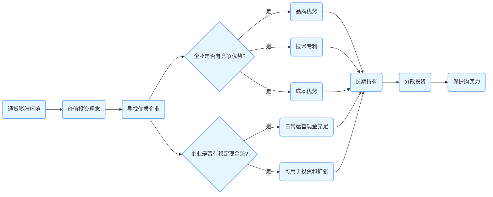

# 巴菲特 - 芒格的通货膨胀对冲策略：保护购买力

> 关键词：巴菲特、芒格、通货膨胀、对冲策略、购买力保护、投资理念、价值投资

> 摘要：本文深入探讨了巴菲特与芒格面对通货膨胀所采用的对冲策略，旨在保护投资者的购买力。通过介绍背景知识，阐述核心概念，剖析核心算法原理，推导数学模型与公式，结合项目实战案例，分析实际应用场景，推荐相关工具和资源等多个方面，全面解读巴菲特 - 芒格的投资智慧。同时，对未来发展趋势与挑战进行总结，为投资者在通货膨胀环境下的资产配置提供有价值的参考。

## 1. 背景介绍 
### 1.1 目的和范围
在经济发展的过程中，通货膨胀是一个不可忽视的经济现象。它会导致货币的购买力下降，影响投资者的资产价值。巴菲特和芒格作为投资界的传奇人物，他们的投资策略在应对通货膨胀方面有着独特的见解和成功的实践。本文的目的就是深入研究巴菲特 - 芒格的通货膨胀对冲策略，详细剖析其原理、方法和应用，范围涵盖了他们的投资理念、具体投资标的选择以及长期投资实践中的经验总结。

### 1.2 预期读者
本文预期读者包括对投资领域感兴趣的普通投资者、金融专业人士、研究投资策略和经济现象的学者等。无论是想要学习投资技巧以保护个人资产免受通货膨胀侵蚀的普通投资者，还是希望深入研究投资理论和实践的专业人士，都能从本文中获得有价值的信息。

### 1.3 文档结构概述
本文将按照以下结构展开：首先介绍相关背景知识，包括目的、预期读者和文档结构等；接着阐述核心概念与联系，构建起巴菲特 - 芒格通货膨胀对冲策略的理论框架；然后深入分析核心算法原理和具体操作步骤，结合 Python 代码进行详细说明；之后推导数学模型和公式，并举例说明；再通过项目实战案例，详细解读代码实现和分析；接着探讨实际应用场景；推荐相关的工具和资源；最后总结未来发展趋势与挑战，解答常见问题，并提供扩展阅读和参考资料。

### 1.4 术语表
#### 1.4.1 核心术语定义
- **通货膨胀**：指在货币流通条件下，因货币供给大于货币实际需求，也即现实购买力大于产出供给，导致货币贬值，而引起的一段时间内物价持续而普遍地上涨现象。其实质是社会总需求大于社会总供给 （求远大于供）。
- **对冲策略**：是一种通过投资不同资产或采用金融工具来降低投资组合风险的策略。在通货膨胀环境下，对冲策略旨在抵消通货膨胀对资产价值的负面影响，保护投资者的购买力。
- **购买力**：指单位货币在一定的价格水平下能买到的商品或劳务的数量。购买力的变化与通货膨胀密切相关，通货膨胀会导致购买力下降。

#### 1.4.2 相关概念解释
- **价值投资**：是一种投资策略，由本杰明·格雷厄姆（Benjamin Graham）和戴维·多德（David Dodd）在 1934 年所提出。该策略强调通过分析公司的基本面，如财务状况、盈利能力、竞争优势等，寻找被市场低估的股票进行投资，以获取长期的投资回报。巴菲特和芒格是价值投资的坚定实践者。
- **护城河理论**：由巴菲特提出，指企业抵御竞争对手的可持续竞争优势。具有宽阔“护城河”的企业能够在市场竞争中保持稳定的盈利能力和市场地位，从而在通货膨胀环境下更具抗风险能力。

#### 1.4.3 缩略词列表
- **PEG 比率**：市盈率相对盈利增长比率（Price/Earnings to Growth Ratio），是用公司的市盈率除以公司的盈利增长速度。PEG 比率是在市盈率估值的基础上考虑了盈利的增长，该指标越低，说明公司的股票被低估的可能性越大。

## 2. 核心概念与联系 

### 核心概念原理
巴菲特 - 芒格的通货膨胀对冲策略基于价值投资理念，核心在于寻找具有强大竞争优势和稳定现金流的企业进行投资。他们认为，在通货膨胀环境下，优质企业能够通过提高产品价格、降低成本等方式将通货膨胀的压力转移出去，从而保持盈利能力和股东价值。

- **竞争优势**：具有宽阔“护城河”的企业，如拥有品牌优势、技术专利、成本优势等，能够在市场竞争中脱颖而出。这些企业在通货膨胀时期可以通过提高产品或服务价格来保持利润水平，因为消费者愿意为其品牌或独特的产品支付更高的价格。
- **稳定现金流**：稳定的现金流是企业抵御通货膨胀的重要保障。企业能够持续产生充足的现金，不仅可以满足日常运营和投资需求，还可以在通货膨胀时期进行必要的调整和扩张。例如，企业可以用现金进行研发投入，提高生产效率，降低成本，从而应对通货膨胀带来的压力。

### 架构的文本示意图
```plaintext
巴菲特 - 芒格通货膨胀对冲策略
|
|-- 价值投资理念
|   |-- 寻找被低估的优质企业
|   |-- 关注企业的长期发展
|
|-- 核心投资标的
|   |-- 具有竞争优势的企业
|   |   |-- 品牌优势
|   |   |-- 技术专利
|   |   |-- 成本优势
|   |-- 稳定现金流的企业
|   |   |-- 日常运营现金充足
|   |   |-- 可用于投资和扩张
|
|-- 投资策略实施
|   |-- 长期持有
|   |-- 分散投资
```

### Mermaid 流程图


## 3. 核心算法原理 & 具体操作步骤 

### 核心算法原理
巴菲特 - 芒格的投资策略并没有严格意义上的数学算法，但可以通过一些财务指标和分析方法来筛选优质企业。以下是一个简化的思路：

- **筛选标准**：通过对企业的财务报表进行分析，筛选出具有高净资产收益率（ROE）、低负债比率、稳定的营业收入和净利润增长的企业。这些指标可以反映企业的盈利能力、财务健康状况和成长潜力。
- **估值方法**：使用市盈率（P/E）、市净率（P/B）等估值指标，结合企业的盈利增长情况，判断企业的股票是否被低估。例如，PEG 比率可以综合考虑市盈率和盈利增长速度，当 PEG 比率小于 1 时，说明企业的股票可能被低估。

### 具体操作步骤

#### 步骤 1：数据收集
收集企业的财务报表数据，包括资产负债表、利润表和现金流量表等。可以从金融数据提供商、证券交易所网站或企业的官方公告中获取这些数据。

#### 步骤 2：指标计算
计算企业的各项财务指标，如 ROE、负债比率、营业收入增长率、净利润增长率、P/E、P/B 和 PEG 比率等。

#### 步骤 3：筛选企业
根据设定的筛选标准，筛选出符合条件的企业。例如，选择 ROE 大于 15%、负债比率小于 50%、PEG 比率小于 1 的企业。

#### 步骤 4：深入分析
对筛选出的企业进行深入分析，了解其竞争优势、行业地位、管理团队等情况。可以通过阅读企业的年报、行业研究报告、新闻报道等方式获取相关信息。

#### 步骤 5：投资决策
根据深入分析的结果，做出投资决策。选择具有强大竞争优势和稳定现金流的企业进行投资，并长期持有。

### Python 源代码实现
```python
import pandas as pd

# 模拟企业财务数据
data = {
    '企业名称': ['企业 A', '企业 B', '企业 C', '企业 D'],
    'ROE': [20, 12, 18, 25],
    '负债比率': [30, 60, 40, 20],
    '营业收入增长率': [15, 8, 12, 20],
    '净利润增长率': [18, 10, 15, 22],
    'P/E': [15, 20, 18, 12],
    'P/B': [2, 3, 2.5, 1.5]
}

df = pd.DataFrame(data)

# 计算 PEG 比率
df['PEG'] = df['P/E'] / df['净利润增长率']

# 筛选企业
filtered_df = df[(df['ROE'] > 15) & (df['负债比率'] < 50) & (df['PEG'] < 1)]

print("筛选出的企业：")
print(filtered_df)
```

### 代码解释
1. **数据模拟**：使用字典 `data` 模拟企业的财务数据，包括 ROE、负债比率、营业收入增长率、净利润增长率、P/E 和 P/B 等指标。
2. **数据处理**：使用 `pandas` 库将数据转换为 DataFrame 对象，并计算 PEG 比率。
3. **筛选企业**：根据设定的筛选标准，筛选出 ROE 大于 15%、负债比率小于 50%、PEG 比率小于 1 的企业。
4. **结果输出**：打印筛选出的企业信息。

## 4. 数学模型和公式 & 详细讲解 & 举例说明 

### 主要财务指标公式

#### 净资产收益率（ROE）
$$ROE = \frac{净利润}{净资产} \times 100\%$$
ROE 反映了企业运用自有资本的效率，是衡量企业盈利能力的重要指标。ROE 越高，说明企业利用自有资本创造利润的能力越强。

**举例**：假设企业 A 的净利润为 1000 万元，净资产为 5000 万元，则其 ROE 为：
$$ROE = \frac{1000}{5000} \times 100\% = 20\%$$

#### 负债比率
$$负债比率 = \frac{总负债}{总资产} \times 100\%$$
负债比率反映了企业的财务风险程度。负债比率越高，说明企业的债务负担越重，财务风险越大。

**举例**：假设企业 B 的总负债为 3000 万元，总资产为 6000 万元，则其负债比率为：
$$负债比率 = \frac{3000}{6000} \times 100\% = 50\%$$

#### 市盈率（P/E）
$$P/E = \frac{股票价格}{每股收益}$$
P/E 反映了市场对企业盈利的预期。P/E 越高，说明市场对企业的未来盈利增长预期越高。

**举例**：假设企业 C 的股票价格为 20 元，每股收益为 2 元，则其 P/E 为：
$$P/E = \frac{20}{2} = 10$$

#### 市净率（P/B）
$$P/B = \frac{股票价格}{每股净资产}$$
P/B 反映了市场对企业净资产的估值。P/B 越低，说明企业的股票可能被低估。

**举例**：假设企业 D 的股票价格为 15 元，每股净资产为 5 元，则其 P/B 为：
$$P/B = \frac{15}{5} = 3$$

#### 市盈率相对盈利增长比率（PEG）
$$PEG = \frac{P/E}{净利润增长率}$$
PEG 比率综合考虑了市盈率和盈利增长速度，是衡量股票估值是否合理的重要指标。PEG 比率小于 1 时，说明企业的股票可能被低估。

**举例**：假设企业 E 的 P/E 为 12，净利润增长率为 15%，则其 PEG 为：
$$PEG = \frac{12}{15} = 0.8$$

### 数学模型在投资决策中的应用
在投资决策中，可以通过综合考虑这些财务指标来评估企业的投资价值。例如，选择 ROE 高、负债比率低、PEG 比率小于 1 的企业进行投资，这些企业通常具有较强的盈利能力、较低的财务风险和较好的估值水平。

## 5. 项目实战：代码实际案例和详细解释说明 

### 5.1  开发环境搭建
- **操作系统**：可以选择 Windows、Linux 或 macOS 等主流操作系统。
- **Python 环境**：安装 Python 3.x 版本，建议使用 Anaconda 进行 Python 环境的管理。
- **开发工具**：可以使用 PyCharm、Jupyter Notebook 等开发工具。
- **数据来源**：可以使用金融数据提供商如 Tushare、BaoStock 等获取企业的财务数据。

### 5.2  源代码详细实现和代码解读

```python
import tushare as ts
import pandas as pd

# 设置 Tushare token
ts.set_token('your_token')
pro = ts.pro_api()

# 获取企业财务数据
def get_financial_data(ts_code, start_date, end_date):
    # 获取利润表数据
    income_df = pro.income(ts_code=ts_code, start_date=start_date, end_date=end_date)
    # 获取资产负债表数据
    balance_df = pro.balancesheet(ts_code=ts_code, start_date=start_date, end_date=end_date)
    # 获取现金流量表数据
    cashflow_df = pro.cashflow(ts_code=ts_code, start_date=start_date, end_date=end_date)
    return income_df, balance_df, cashflow_df

# 计算财务指标
def calculate_financial_metrics(income_df, balance_df, cashflow_df):
    # 计算 ROE
    net_income = income_df['n_income_attr_p'].astype(float)
    net_assets = balance_df['total_hldr_eqy_exc_min_int'].astype(float)
    roe = (net_income / net_assets) * 100
    
    # 计算负债比率
    total_liabilities = balance_df['total_liab'].astype(float)
    total_assets = balance_df['total_assets'].astype(float)
    debt_ratio = (total_liabilities / total_assets) * 100
    
    # 计算营业收入增长率
    revenue = income_df['total_revenue'].astype(float)
    revenue_growth_rate = (revenue.diff(-1) / revenue.shift(-1)) * 100
    
    # 计算净利润增长率
    net_income_growth_rate = (net_income.diff(-1) / net_income.shift(-1)) * 100
    
    # 计算 P/E 和 P/B 需要股票价格数据，这里简化处理，假设已经获取
    # 实际应用中需要从其他接口获取股票价格数据
    pe = 15
    pb = 2
    
    # 计算 PEG 比率
    peg = pe / net_income_growth_rate
    
    return roe, debt_ratio, revenue_growth_rate, net_income_growth_rate, pe, pb, peg

# 主函数
def main():
    ts_code = '000001.SZ'  # 股票代码
    start_date = '20200101'
    end_date = '20231231'
    
    # 获取财务数据
    income_df, balance_df, cashflow_df = get_financial_data(ts_code, start_date, end_date)
    
    # 计算财务指标
    roe, debt_ratio, revenue_growth_rate, net_income_growth_rate, pe, pb, peg = calculate_financial_metrics(income_df, balance_df, cashflow_df)
    
    # 输出结果
    result_df = pd.DataFrame({
        'ROE': roe,
        '负债比率': debt_ratio,
        '营业收入增长率': revenue_growth_rate,
        '净利润增长率': net_income_growth_rate,
        'P/E': pe,
        'P/B': pb,
        'PEG': peg
    })
    
    print(result_df)

if __name__ == '__main__':
    main()
```

### 5.3  代码解读与分析
1. **数据获取**：使用 Tushare 库获取企业的利润表、资产负债表和现金流量表数据。需要设置 Tushare token 才能正常使用该接口。
2. **指标计算**：根据获取的财务数据，计算 ROE、负债比率、营业收入增长率、净利润增长率、P/E、P/B 和 PEG 比率等财务指标。
3. **结果输出**：将计算得到的财务指标存储在 DataFrame 中，并打印输出。

需要注意的是，在实际应用中，P/E 和 P/B 的计算需要获取股票价格数据，这里进行了简化处理。实际应用中可以使用 Tushare 或其他金融数据接口获取股票价格数据。

## 6. 实际应用场景 
### 个人投资者
对于个人投资者来说，巴菲特 - 芒格的通货膨胀对冲策略可以帮助他们在通货膨胀环境下保护个人资产的购买力。个人投资者可以通过学习和运用该策略，筛选出具有投资价值的优质企业进行长期投资，避免因通货膨胀导致资产贬值。例如，个人投资者可以关注消费、医药等行业中具有品牌优势和稳定现金流的企业，这些企业在通货膨胀时期能够更好地抵御风险，保持盈利能力。

### 机构投资者
机构投资者如基金公司、保险公司等，也可以采用巴菲特 - 芒格的投资策略进行资产配置。机构投资者可以通过深入研究企业的基本面，构建具有抗通货膨胀能力的投资组合。例如，基金公司可以选择投资于不同行业的优质企业，分散投资风险，同时通过长期持有来获取稳定的投资回报。

### 企业财务决策
企业在进行财务决策时，也可以借鉴巴菲特 - 芒格的投资理念。企业可以注重提升自身的竞争优势，保持稳定的现金流，以应对通货膨胀带来的挑战。例如，企业可以加大研发投入，提高产品质量和技术含量，增强品牌竞争力；合理安排债务结构，降低财务风险；优化资金管理，确保日常运营和投资活动的现金需求。

## 7. 工具和资源推荐
### 7.1 学习资源推荐
#### 7.1.1 书籍推荐
- 《聪明的投资者》（The Intelligent Investor）：本杰明·格雷厄姆著，被誉为投资界的圣经，是价值投资理念的经典之作。
- 《巴菲特致股东的信：股份公司教程》（Letters to Shareholders of Berkshire Hathaway）：沃伦·巴菲特著，通过巴菲特致股东的信，深入了解他的投资理念和方法。
- 《穷查理宝典：查理·芒格的智慧箴言录》（Poor Charlie's Almanack: The Wit and Wisdom of Charles T. Munger）：彼得·考夫曼编著，全面介绍了查理·芒格的投资思想、人生哲学和多元思维模型。

#### 7.1.2 在线课程
- Coursera 平台上的“投资学原理”课程，由知名高校教授授课，系统讲解投资学的基本原理和方法。
- 网易云课堂上的“价值投资实战课程”，结合实际案例，深入讲解价值投资的策略和技巧。

#### 7.1.3 技术博客和网站
- 雪球网：是一个投资者社区，提供股票、基金等投资产品的分析和讨论，用户可以在上面学习其他投资者的经验和观点。
- 投资界网站：专注于投资领域的资讯和研究，提供最新的投资动态、行业分析和专家观点。

### 7.2 开发工具框架推荐
#### 7.2.1 IDE和编辑器
- PyCharm：是一款专业的 Python 集成开发环境，具有代码自动补全、调试、版本控制等功能，适合开发复杂的 Python 项目。
- Jupyter Notebook：是一个交互式的开发环境，支持多种编程语言，适合数据探索、分析和可视化。

#### 7.2.2 调试和性能分析工具
- PySnooper：是一个简单易用的 Python 调试工具，可以自动记录函数的执行过程和变量的值，方便调试代码。
- cProfile：是 Python 内置的性能分析工具，可以分析代码的执行时间和函数调用关系，帮助优化代码性能。

#### 7.2.3 相关框架和库
- Pandas：是一个强大的数据处理和分析库，提供了高效的数据结构和数据操作方法，适合处理金融数据。
- Tushare：是一个免费、开源的 Python 财经数据接口包，提供了丰富的金融数据，包括股票、基金、债券等。

### 7.3 相关论文著作推荐
#### 7.3.1 经典论文
- Eugene F. Fama 和 Kenneth R. French 的《Common Risk Factors in the Returns on Stocks and Bonds》，提出了著名的 Fama - French 三因子模型，对资产定价理论和投资组合管理产生了深远影响。
- Benjamin Graham 和 David Dodd 的《Security Analysis》，奠定了价值投资理论的基础，是投资领域的经典文献。

#### 7.3.2 最新研究成果
- 关注《Journal of Finance》《Review of Financial Studies》等国际顶级金融学术期刊，了解投资领域的最新研究动态和成果。

#### 7.3.3 应用案例分析
- 研究巴菲特和芒格的投资案例，如伯克希尔·哈撒韦公司的年报和投资决策分析，深入了解他们的投资策略和实践经验。

## 8. 总结：未来发展趋势与挑战
### 未来发展趋势
- **数字化投资**：随着科技的不断发展，数字化投资将成为未来的发展趋势。投资者可以利用大数据、人工智能等技术，更精准地分析企业的基本面和市场趋势，优化投资决策。例如，通过机器学习算法对企业的财务数据和新闻舆情进行分析，挖掘潜在的投资机会。
- **可持续投资**：越来越多的投资者开始关注企业的社会责任和可持续发展。未来，具有良好环境、社会和治理（ESG）表现的企业将更受投资者青睐。巴菲特 - 芒格的投资策略也可能会逐渐融入可持续投资的理念，关注企业的长期价值和社会影响。
- **全球资产配置**：随着经济全球化的深入发展，投资者将更加注重全球资产配置。通过投资不同国家和地区的资产，可以分散投资风险，提高投资组合的抗风险能力。巴菲特 - 芒格的投资策略也可能会拓展到全球市场，寻找具有投资价值的国际企业。

### 挑战
- **市场不确定性增加**：全球经济形势复杂多变，政治、地缘政治等因素都会对市场产生影响，增加了市场的不确定性。投资者需要更加敏锐地捕捉市场变化，及时调整投资策略。
- **科技变革加速**：科技的快速发展使得行业竞争格局不断变化，企业的生命周期也在缩短。投资者需要不断学习和更新知识，准确判断企业的竞争优势和发展前景，避免投资失误。
- **信息过载**：在信息时代，投资者面临着海量的信息。如何从众多信息中筛选出有价值的信息，进行准确的分析和判断，是投资者面临的一大挑战。

## 9. 附录：常见问题与解答
### 问题 1：巴菲特 - 芒格的投资策略适合所有投资者吗？
解答：巴菲特 - 芒格的投资策略基于价值投资理念，注重长期投资和企业的基本面分析。这种策略适合有一定投资知识和耐心的投资者。对于短期投机者或风险承受能力较低的投资者来说，可能需要根据自身情况进行调整。

### 问题 2：如何判断企业的竞争优势？
解答：可以从多个方面判断企业的竞争优势，如品牌优势、技术专利、成本优势、客户忠诚度等。可以通过分析企业的财务报表、行业研究报告、新闻报道等方式，了解企业在市场中的地位和竞争能力。

### 问题 3：在通货膨胀环境下，除了股票投资，还有哪些投资方式可以对冲通货膨胀？
解答：除了股票投资，还可以考虑投资房地产、黄金、债券等资产。房地产在通货膨胀时期通常具有保值增值的功能；黄金是一种传统的避险资产，其价格通常与通货膨胀呈正相关；债券可以提供固定的收益，在一定程度上抵御通货膨胀的影响。

## 10. 扩展阅读 & 参考资料
### 扩展阅读
- 《金融炼金术》（The Alchemy of Finance）：乔治·索罗斯著，介绍了他的投资哲学和反身性理论。
- 《漫步华尔街》（A Random Walk Down Wall Street）：伯顿·马尔基尔著，探讨了股票市场的随机性和投资策略。

### 参考资料
- 巴菲特和芒格的官方言论和著作，如伯克希尔·哈撒韦公司的年报、股东大会讲话等。
- 金融数据提供商的网站和报告，如 Wind 资讯、东方财富网等。
- 相关学术期刊和研究报告，如《金融研究》《经济研究》等。