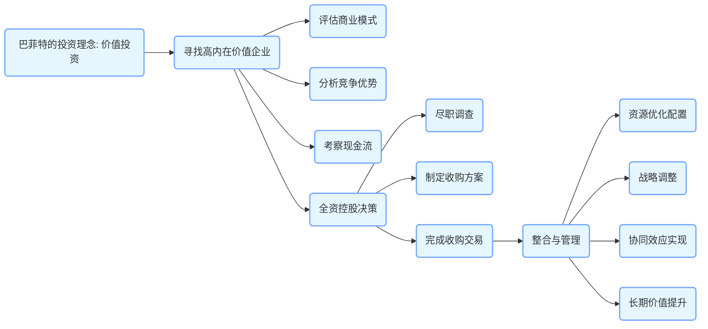

# 巴菲特的公司收购策略：全资控股的魅力

> 关键词：巴菲特、公司收购策略、全资控股、价值投资、伯克希尔·哈撒韦、企业并购、长期投资

> 摘要：本文深入探讨了巴菲特的公司收购策略中全资控股的魅力所在。首先介绍了背景信息，包括目的、预期读者等内容。接着阐述了相关核心概念与联系，详细讲解了核心算法原理及具体操作步骤。通过数学模型和公式进一步剖析其策略的理论基础，并结合项目实战案例进行详细解释。分析了全资控股策略的实际应用场景，推荐了相关的工具和资源。最后总结了未来发展趋势与挑战，提供了常见问题与解答以及扩展阅读和参考资料，旨在全面揭示巴菲特全资控股收购策略的本质和价值，为投资者和企业管理者提供有价值的参考。

## 1. 背景介绍 
### 1.1 目的和范围
本文的目的在于全面深入地研究巴菲特的公司收购策略中全资控股这一关键策略的魅力和价值。通过对其背后的原理、操作步骤、数学模型等多方面的分析，揭示这一策略在企业并购和投资领域的独特优势和意义。范围涵盖了从理论层面的核心概念讲解到实际案例的分析，以及对未来趋势的展望，旨在为读者提供一个全方位、系统性的关于巴菲特全资控股收购策略的认识。

### 1.2 预期读者
预期读者包括对投资领域感兴趣的个人投资者，他们希望从巴菲特的成功经验中学习到有效的投资策略和方法；企业管理者，特别是涉及企业并购、战略规划等方面的人员，能够借鉴巴菲特的收购策略来优化企业的发展战略；金融专业的学生和研究人员，通过本文可以深入了解企业并购和投资领域的经典案例和理论知识；以及对商业和经济领域有广泛兴趣的普通读者，满足他们对巴菲特投资智慧的探索需求。

### 1.3 文档结构概述
本文将按照以下结构进行阐述。首先是背景介绍，包括目的、预期读者、文档结构概述和术语表。接着进入核心概念与联系部分，详细讲解相关概念的原理和架构，并通过示意图和流程图进行直观展示。然后介绍核心算法原理和具体操作步骤，结合Python源代码进行深入分析。再通过数学模型和公式进一步剖析其理论基础，并举例说明。之后通过项目实战案例，包括开发环境搭建、源代码实现和解读，深入分析全资控股策略的实际应用。接着探讨实际应用场景，推荐相关的工具和资源。最后总结未来发展趋势与挑战，提供常见问题与解答以及扩展阅读和参考资料。

### 1.4 术语表
#### 1.4.1 核心术语定义
- **全资控股**：指收购方持有目标公司100%的股权，从而对目标公司拥有完全的控制权和决策权。
- **价值投资**：一种投资策略，强调通过对企业内在价值的评估，寻找被低估的股票或企业进行投资，以获取长期的投资回报。
- **企业并购**：指企业之间的合并和收购行为，包括股权收购、资产收购等多种形式，旨在实现企业的扩张、战略调整等目标。
- **伯克希尔·哈撒韦**：巴菲特领导的一家多元化投资公司，通过收购和投资多种行业的企业，积累了巨大的财富和影响力。

#### 1.4.2 相关概念解释
- **协同效应**：指企业在并购后，通过整合资源、优化业务流程等方式，实现比并购前更高的效率和效益，产生1 + 1 > 2的效果。
- **护城河理论**：巴菲特提出的概念，指企业具有的独特竞争优势，如同城堡周围的护城河一样，能够保护企业免受竞争对手的侵害，维持长期的盈利能力。

#### 1.4.3 缩略词列表
- **BRK**：伯克希尔·哈撒韦公司（Berkshire Hathaway）的股票代码。

## 2. 核心概念与联系 

### 核心概念原理
巴菲特的全资控股收购策略基于其价值投资的理念。价值投资强调对企业内在价值的深入评估，而全资控股则是实现对具有高内在价值企业长期控制和价值挖掘的重要手段。当巴菲特发现一家具有优秀商业模式、强大竞争优势（护城河）和稳定现金流的企业时，如果能够全资控股该企业，就可以将其纳入伯克希尔·哈撒韦的体系中，实现资源的优化配置和协同效应的最大化。

在全资控股的情况下，巴菲特可以对目标企业进行全面的管理和战略调整，确保企业按照其长期价值投资的理念运营。他可以充分发挥伯克希尔·哈撒韦的品牌优势、资金优势和管理经验，帮助目标企业进一步提升竞争力和盈利能力。

### 架构的文本示意图
```plaintext
巴菲特的投资理念（价值投资）
|
|-- 寻找具有高内在价值的企业
|   |
|   |-- 评估企业的商业模式
|   |-- 分析企业的竞争优势（护城河）
|   |-- 考察企业的现金流状况
|
|-- 全资控股决策
|   |
|   |-- 对目标企业进行全面尽职调查
|   |-- 制定收购方案
|   |-- 完成收购交易
|
|-- 整合与管理
|   |
|   |-- 资源优化配置
|   |-- 战略调整与协同效应实现
|   |-- 长期价值提升
```

### Mermaid 流程图


## 3. 核心算法原理 & 具体操作步骤 

### 核心算法原理
巴菲特的全资控股收购策略的核心算法原理可以概括为对企业内在价值的评估和对收购风险与收益的权衡。在评估企业内在价值时，通常采用现金流折现模型（DCF）。该模型的基本思想是将企业未来预期产生的现金流按照一定的折现率折现到当前时刻，得到企业的内在价值。

以下是使用Python实现的简单现金流折现模型示例：
```python
def dcf_valuation(cash_flows, discount_rate):
    """
    现金流折现模型计算企业内在价值
    :param cash_flows: 未来各期的现金流列表
    :param discount_rate: 折现率
    :return: 企业内在价值
    """
    present_value = 0
    for i, cash_flow in enumerate(cash_flows):
        present_value += cash_flow / (1 + discount_rate) ** (i + 1)
    return present_value

# 示例数据
cash_flows = [100, 120, 150, 180, 200]  # 未来5年的现金流
discount_rate = 0.1  # 折现率为10%

# 计算内在价值
intrinsic_value = dcf_valuation(cash_flows, discount_rate)
print(f"企业内在价值: {intrinsic_value}")
```

### 具体操作步骤
1. **筛选目标企业**：巴菲特及其团队会对大量的企业进行研究和筛选，寻找具有优秀商业模式、强大竞争优势和稳定现金流的企业。这需要对不同行业的深入了解和对企业基本面的细致分析。
2. **尽职调查**：一旦确定了潜在的目标企业，就会进行全面的尽职调查。这包括对企业的财务状况、法律合规性、市场竞争力、管理团队等方面的详细审查，以确保企业的质量和收购的可行性。
3. **评估内在价值**：使用现金流折现模型等方法对目标企业的内在价值进行评估。同时，还会考虑企业的品牌价值、无形资产等因素，以更准确地确定企业的真实价值。
4. **制定收购方案**：根据目标企业的内在价值和市场情况，制定合理的收购方案。包括收购价格、支付方式、交易结构等方面的安排，以确保收购交易对双方都具有吸引力。
5. **谈判与交易**：与目标企业的股东或管理层进行谈判，就收购方案达成一致。在谈判过程中，需要充分考虑双方的利益和诉求，以达成互利共赢的交易。一旦谈判成功，就会完成收购交易的各项手续。
6. **整合与管理**：收购完成后，将目标企业纳入伯克希尔·哈撒韦的体系中进行整合和管理。这包括资源的优化配置、战略的调整、企业文化的融合等方面，以实现协同效应和长期价值的提升。

## 4. 数学模型和公式 & 详细讲解 & 举例说明 

### 现金流折现模型（DCF）
现金流折现模型的基本公式为：
$$V = \sum_{t=1}^{n} \frac{CF_t}{(1 + r)^t}$$
其中：
- $V$ 表示企业的内在价值；
- $CF_t$ 表示第 $t$ 期的现金流；
- $r$ 表示折现率；
- $n$ 表示预测的期数。

### 详细讲解
现金流折现模型的核心思想是将企业未来预期产生的现金流按照一定的折现率折现到当前时刻，得到企业的内在价值。折现率 $r$ 反映了资金的时间价值和投资的风险程度。较高的折现率意味着较高的风险，会导致未来现金流的现值较低；较低的折现率则意味着较低的风险，会使未来现金流的现值较高。

预测的期数 $n$ 通常根据企业的行业特点、发展阶段等因素来确定。一般来说，对于成熟企业，可以预测较长的期数；对于处于快速发展阶段的企业，预测期数可能相对较短。

### 举例说明
假设一家企业未来5年的预期现金流分别为100万元、120万元、150万元、180万元和200万元，折现率为10%。则该企业的内在价值计算如下：
$$V = \frac{100}{(1 + 0.1)^1} + \frac{120}{(1 + 0.1)^2} + \frac{150}{(1 + 0.1)^3} + \frac{180}{(1 + 0.1)^4} + \frac{200}{(1 + 0.1)^5}$$
```python
cash_flows = [100, 120, 150, 180, 200]
discount_rate = 0.1
intrinsic_value = 0
for i, cash_flow in enumerate(cash_flows):
    intrinsic_value += cash_flow / (1 + discount_rate) ** (i + 1)
print(f"企业内在价值: {intrinsic_value} 万元")
```
通过计算可得，该企业的内在价值约为587.75万元。这意味着，如果以低于587.75万元的价格收购该企业，从理论上来说是具有投资价值的。

## 5. 项目实战：代码实际案例和详细解释说明 

### 5.1  开发环境搭建
- **操作系统**：可以选择Windows、Linux或macOS等常见的操作系统。
- **Python环境**：安装Python 3.x版本。可以从Python官方网站（https://www.python.org/downloads/）下载安装包进行安装。
- **开发工具**：推荐使用PyCharm、Jupyter Notebook等开发工具。PyCharm是一款功能强大的Python集成开发环境，提供了代码编辑、调试、版本控制等丰富的功能；Jupyter Notebook则适合进行交互式的代码开发和数据分析，方便展示和分享代码。

### 5.2  源代码详细实现和代码解读
以下是一个更完整的Python代码示例，用于模拟巴菲特全资控股收购策略中的企业价值评估和收购决策过程：
```python
class Company:
    def __init__(self, name, cash_flows, discount_rate):
        """
        初始化公司对象
        :param name: 公司名称
        :param cash_flows: 未来各期的现金流列表
        :param discount_rate: 折现率
        """
        self.name = name
        self.cash_flows = cash_flows
        self.discount_rate = discount_rate

    def calculate_intrinsic_value(self):
        """
        计算企业内在价值
        :return: 企业内在价值
        """
        present_value = 0
        for i, cash_flow in enumerate(self.cash_flows):
            present_value += cash_flow / (1 + self.discount_rate) ** (i + 1)
        return present_value

    def evaluate_acquisition(self, acquisition_price):
        """
        评估收购决策
        :param acquisition_price: 收购价格
        :return: 收购是否具有价值（True或False）
        """
        intrinsic_value = self.calculate_intrinsic_value()
        if acquisition_price < intrinsic_value:
            return True
        else:
            return False

# 示例数据
company = Company("ABC公司", [100, 120, 150, 180, 200], 0.1)
acquisition_price = 550  # 收购价格

# 计算内在价值
intrinsic_value = company.calculate_intrinsic_value()
print(f"{company.name} 内在价值: {intrinsic_value}")

# 评估收购决策
is_value_acquisition = company.evaluate_acquisition(acquisition_price)
if is_value_acquisition:
    print(f"以 {acquisition_price} 的价格收购 {company.name} 具有投资价值")
else:
    print(f"以 {acquisition_price} 的价格收购 {company.name} 不具有投资价值")
```
### 代码解读与分析
- **`Company` 类**：定义了一个公司对象，包含公司名称、未来各期的现金流和折现率等属性。
- **`calculate_intrinsic_value` 方法**：实现了现金流折现模型，用于计算企业的内在价值。通过遍历未来各期的现金流，将其按照折现率折现到当前时刻，并求和得到企业的内在价值。
- **`evaluate_acquisition` 方法**：根据计算得到的企业内在价值和给定的收购价格，评估收购决策是否具有投资价值。如果收购价格低于内在价值，则认为收购具有投资价值；否则，认为不具有投资价值。

在示例中，我们创建了一个名为“ABC公司”的公司对象，设置了其未来5年的现金流和折现率。然后计算了该公司的内在价值，并根据给定的收购价格评估了收购决策的投资价值。

## 6. 实际应用场景 
### 行业整合与扩张
巴菲特的全资控股收购策略在行业整合和扩张方面具有重要的应用价值。通过收购同行业或相关行业的企业，伯克希尔·哈撒韦可以实现资源的优化配置和协同效应的最大化。例如，在保险行业，巴菲特通过收购多家保险公司，整合了保险业务的上下游资源，提高了市场竞争力和盈利能力。

### 长期价值投资
全资控股收购是巴菲特长期价值投资理念的重要实践方式。通过全资控股具有优秀商业模式和强大竞争优势的企业，伯克希尔·哈撒韦可以长期持有这些企业的股权，分享企业成长带来的收益。例如，伯克希尔·哈撒韦对可口可乐的投资，通过长期持有可口可乐的股票，获得了丰厚的投资回报。

### 战略转型与多元化
对于一些企业来说，通过被巴菲特的伯克希尔·哈撒韦全资控股，可以实现战略转型和多元化发展。伯克希尔·哈撒韦具有丰富的资源和管理经验，可以帮助目标企业拓展新的业务领域，优化业务结构，提高企业的抗风险能力。例如，一些传统制造业企业被伯克希尔·哈撒韦收购后，借助其资金和技术优势，实现了向高端制造业或新兴产业的转型。

## 7. 工具和资源推荐
### 7.1 学习资源推荐
#### 7.1.1 书籍推荐
- 《聪明的投资者》（The Intelligent Investor）：作者本杰明·格雷厄姆（Benjamin Graham）是价值投资理论的奠基人，这本书是巴菲特推崇的投资经典之作，详细阐述了价值投资的理念和方法。
- 《巴菲特致股东的信：股份公司教程》（Letters to Shareholders of Berkshire Hathaway）：这本书收录了巴菲特历年致股东的信，通过这些信件可以深入了解巴菲特的投资思想、公司管理理念和对市场的看法。
- 《穷查理宝典：查理·芒格的智慧箴言录》（Poor Charlie's Almanack: The Wit and Wisdom of Charles T. Munger）：查理·芒格是巴菲特的长期合作伙伴，这本书汇集了芒格的投资智慧和人生哲学，对理解巴菲特的投资策略有很大的帮助。

#### 7.1.2 在线课程
- Coursera平台上的“投资学原理”（Principles of Investing）课程：由知名教授授课，系统地介绍了投资学的基本原理和方法，包括价值投资、资产定价等内容。
- edX平台上的“金融市场”（Financial Markets）课程：该课程由耶鲁大学教授罗伯特·席勒（Robert Shiller）主讲，深入探讨了金融市场的运行机制和投资策略，对理解巴菲特的投资策略有一定的启发。

#### 7.1.3 技术博客和网站
- 伯克希尔·哈撒韦官方网站（https://www.berkshirehathaway.com/）：可以获取伯克希尔·哈撒韦的最新年报、公告和巴菲特的致股东信等重要信息。
- 价值投资网（https://www.value-investing.net/）：专注于价值投资领域的资讯和研究，提供了大量关于巴菲特投资策略的分析和解读。

### 7.2 开发工具框架推荐
#### 7.2.1 IDE和编辑器
- PyCharm：功能强大的Python集成开发环境，提供了代码编辑、调试、版本控制等丰富的功能，适合进行Python代码的开发和项目管理。
- Jupyter Notebook：交互式的代码开发和数据分析工具，方便展示和分享代码，适合进行数据探索和模型验证。

#### 7.2.2 调试和性能分析工具
- PySnooper：简单易用的Python调试工具，可以自动记录函数的执行过程和变量的值，帮助开发者快速定位问题。
- cProfile：Python内置的性能分析工具，可以分析代码的执行时间和函数调用次数，帮助开发者优化代码性能。

#### 7.2.3 相关框架和库
- Pandas：强大的数据处理和分析库，提供了丰富的数据结构和数据操作方法，适合进行财务数据的处理和分析。
- NumPy：Python的数值计算库，提供了高效的数组和矩阵运算功能，在数学模型的实现中经常使用。

### 7.3 相关论文著作推荐
#### 7.3.1 经典论文
- “The Superinvestors of Graham-and-Doddsville”：巴菲特在1984年发表的这篇论文，通过分析格雷厄姆和多德的追随者的投资业绩，证明了价值投资的有效性。
- “Common Stocks and Uncommon Profits”：作者菲利普·费雪（Philip Fisher）在这篇论文中提出了成长股投资的理念，对巴菲特的投资思想产生了重要影响。

#### 7.3.2 最新研究成果
- 学术界关于企业并购和价值投资的最新研究论文，可以通过学术数据库如IEEE Xplore、ACM Digital Library等进行检索。
- 财经媒体和研究机构发布的关于巴菲特投资策略的最新研究报告，如《金融时报》、《华尔街日报》等。

#### 7.3.3 应用案例分析
- 相关的商业案例书籍和研究报告，分析了伯克希尔·哈撒韦的成功收购案例，如对GEICO保险公司、伯灵顿北方圣太菲铁路公司等的收购案例。
- 企业管理和投资领域的专业期刊，如《哈佛商业评论》、《管理世界》等，会发表一些关于企业并购和投资策略的案例分析文章。

## 8. 总结：未来发展趋势与挑战
### 未来发展趋势
- **全球化并购**：随着全球经济的一体化，巴菲特的全资控股收购策略可能会更加注重全球化布局。通过收购不同国家和地区的企业，实现资源的全球优化配置和市场的拓展。
- **科技领域投资**：科技行业的快速发展和创新为投资带来了新的机遇。巴菲特可能会加大在科技领域的投资力度，通过全资控股或参股科技企业，分享科技进步带来的红利。
- **可持续投资**：社会对可持续发展的关注度不断提高，未来的投资策略可能会更加注重企业的环境、社会和治理（ESG）表现。巴菲特的收购策略也可能会向可持续投资方向发展，选择具有良好ESG表现的企业进行投资。

### 挑战
- **市场竞争加剧**：随着全球经济的发展和投资市场的成熟，越来越多的投资者和企业参与到并购活动中，市场竞争日益激烈。巴菲特在寻找优质的收购目标时，可能会面临更多的竞争对手，增加了收购的难度和成本。
- **科技变革风险**：科技行业的快速变革和创新带来了巨大的机遇，但也伴随着较高的风险。如果巴菲特在科技领域的投资决策失误，可能会导致投资损失。此外，科技的发展也可能会对传统行业造成冲击，影响伯克希尔·哈撒韦旗下企业的盈利能力。
- **监管政策变化**：不同国家和地区的监管政策对企业并购活动有着重要的影响。监管政策的变化可能会增加并购的审批难度和合规成本，甚至可能导致并购交易无法顺利完成。巴菲特需要密切关注监管政策的变化，及时调整收购策略。

## 9. 附录：常见问题与解答
### 问题1：巴菲特的全资控股收购策略是否适用于所有企业？
解答：不是的。巴菲特的全资控股收购策略主要适用于具有优秀商业模式、强大竞争优势和稳定现金流的企业。对于一些处于高风险、高不确定性行业的企业，或者管理不善、财务状况不佳的企业，可能不适合采用这种策略。

### 问题2：现金流折现模型在实际应用中有哪些局限性？
解答：现金流折现模型的局限性主要包括：对未来现金流的预测具有不确定性，预测结果可能与实际情况存在较大偏差；折现率的选择具有主观性，不同的折现率会导致不同的内在价值计算结果；模型假设企业的经营环境和财务状况在预测期内保持相对稳定，而实际情况可能会发生较大变化。

### 问题3：伯克希尔·哈撒韦在收购后如何实现协同效应？
解答：伯克希尔·哈撒韦在收购后通过多种方式实现协同效应。例如，整合资源，包括人力、物力、财力等方面的资源，提高资源的利用效率；共享技术和管理经验，帮助目标企业提升管理水平和技术能力；优化业务流程，减少重复环节，提高运营效率；利用品牌优势，拓展市场渠道，提高产品或服务的市场占有率。

## 10. 扩展阅读 & 参考资料
### 扩展阅读
- 《滚雪球：巴菲特和他的财富人生》（The Snowball: Warren Buffett and the Business of Life）：这本书以传记的形式详细介绍了巴菲特的人生经历和投资生涯，通过阅读可以更深入地了解巴菲特的成长背景和投资理念的形成过程。
- 《投资最重要的事》（The Most Important Thing Illuminated: Uncommon Sense for the Thoughtful Investor）：作者霍华德·马克斯（Howard Marks）分享了自己的投资经验和智慧，对理解投资的本质和风险有很大的帮助。

### 参考资料
- Berkshire Hathaway Annual Reports. Available at: https://www.berkshirehathaway.com/
- Graham, B., & Dodd, D. L. (1934). Security Analysis. McGraw-Hill.
- Buffett, W. E. (1984). The Superinvestors of Graham-and-Doddsville. Hermes.