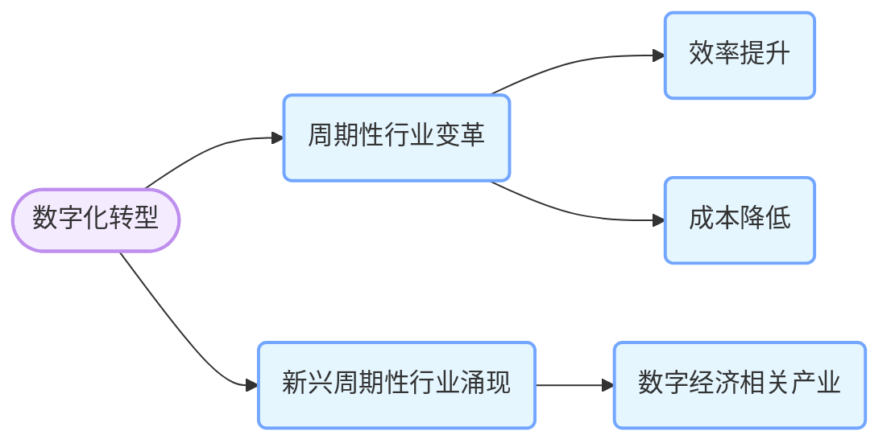

# 巴菲特的周期性行业投资：数字化转型中的机遇把握

> 关键词：巴菲特、周期性行业、数字化转型、投资机遇、价值投资

> 摘要：本文聚焦于巴菲特的周期性行业投资理念，并深入探讨在数字化转型浪潮下该领域所蕴含的投资机遇。首先介绍了巴菲特投资理念的背景，阐述周期性行业的特点与数字化转型的大趋势。接着剖析核心概念，分析周期性行业与数字化转型之间的联系。详细讲解相关的投资算法原理与操作步骤，给出数学模型和公式进行理论支撑。通过项目实战案例，展示在数字化转型中把握周期性行业投资机遇的具体做法。探讨实际应用场景，推荐学习工具和资源，总结未来发展趋势与挑战，最后给出常见问题解答与参考资料，旨在为投资者提供全面且深入的指导，帮助其在数字化时代更好地把握周期性行业的投资机遇。

## 1. 背景介绍 
### 1.1 目的和范围
本文章的目的在于深入研究巴菲特在周期性行业的投资策略，并结合当前数字化转型的大背景，挖掘其中的投资机遇。范围涵盖周期性行业的各个领域，包括但不限于钢铁、化工、汽车、航运等传统周期性行业，以及在数字化转型中与之相关的新兴产业。同时，探讨数字化技术如何改变周期性行业的运营模式、市场格局和投资价值，为投资者提供具有前瞻性和实用性的投资思路。

### 1.2 预期读者
本文预期读者主要包括专业投资者、金融分析师、投资机构从业者、对投资领域感兴趣的学生以及希望了解数字化转型对投资影响的企业管理者等。无论是具有丰富投资经验的专业人士，还是初涉投资领域的新手，都能从本文中获取有价值的信息和启示。

### 1.3 文档结构概述
本文将按照以下结构展开：首先介绍背景信息，包括目的、预期读者和文档结构概述等。接着阐述核心概念，分析周期性行业与数字化转型的联系。然后详细讲解核心算法原理和具体操作步骤，给出数学模型和公式进行理论分析。通过项目实战案例展示投资机遇的把握方法。探讨实际应用场景，推荐学习工具和资源。最后总结未来发展趋势与挑战，给出常见问题解答和参考资料。

### 1.4 术语表
#### 1.4.1 核心术语定义
- **周期性行业**：指和国内或国际经济波动相关性较强的行业，其产品需求、销售和利润等会随着经济周期的变化而呈现周期性波动。例如，在经济繁荣时期，对钢铁、汽车等产品的需求通常会增加，而在经济衰退时期，需求则会下降。
- **数字化转型**：指利用数字化技术和能力来驱动组织商业模式创新和商业生态系统重构的途径和方法。它包括对企业的生产、管理、销售等各个环节进行数字化升级，以提高效率、降低成本、增强竞争力。
- **价值投资**：一种常见的投资方式，其核心思想是通过对股票内在价值的评估，寻找被市场低估的股票，并长期持有，以获得资产的增值。巴菲特是价值投资的典型代表人物。

#### 1.4.2 相关概念解释
- **经济周期**：指经济活动沿着经济发展的总体趋势所经历的有规律的扩张和收缩。一般分为繁荣、衰退、萧条和复苏四个阶段。周期性行业的业绩通常与经济周期密切相关。
- **数字化技术**：包括大数据、人工智能、物联网、云计算等一系列新兴技术，这些技术正在深刻地改变着各个行业的发展模式和竞争格局。

#### 1.4.3 缩略词列表
- **AI**：Artificial Intelligence，人工智能
- **IoT**：Internet of Things，物联网
- **Big Data**：大数据
- **Cloud Computing**：云计算

## 2. 核心概念与联系 

### 周期性行业的特点
周期性行业具有明显的周期性特征，其需求和利润会随着经济周期的波动而变化。在经济繁荣阶段，市场需求旺盛，企业的销售额和利润会大幅增长；而在经济衰退阶段，需求下降，企业面临产能过剩、价格下跌等问题，利润也会随之减少。例如，钢铁行业在经济高速发展时期，由于基础设施建设、房地产开发等对钢铁的需求大增，钢铁企业的产量和价格都会上升，盈利状况良好；但在经济低迷时期，需求减少，钢铁价格下跌，企业可能会出现亏损。

### 数字化转型的趋势
随着科技的不断进步，数字化转型已成为各个行业发展的必然趋势。数字化技术的应用可以帮助企业提高生产效率、优化供应链管理、提升客户体验、创新商业模式等。例如，通过物联网技术，企业可以实现设备的远程监控和智能化管理，提高设备的运行效率和可靠性；利用大数据分析，企业可以深入了解市场需求和客户行为，制定更加精准的营销策略。

### 周期性行业与数字化转型的联系
数字化转型为周期性行业带来了新的发展机遇和挑战。一方面，数字化技术可以帮助周期性行业提高生产效率、降低成本、增强竞争力，从而缓解经济周期波动对企业的影响。例如，钢铁企业可以利用大数据和人工智能技术优化生产流程，提高产品质量和生产效率，降低能耗和环境污染。另一方面，数字化转型也会促使周期性行业的市场格局发生变化，一些传统企业如果不能及时进行数字化转型，可能会面临被淘汰的风险。同时，数字化转型也会催生一些新兴的周期性行业，如数字经济领域的相关产业，这些产业的周期性特征可能与传统周期性行业有所不同。

### 核心概念原理和架构的文本示意图
```plaintext
                数字化转型
                   │
                   │
       ┌───────────┴────────────┐
       │                        │
  周期性行业变革          新兴周期性行业涌现
       │                        │
       │                        │
  ┌────┴────┐             ┌────┴────┐
  │ 效率提升 │             │ 数字经济 │
  │ 成本降低 │             │ 相关产业 │
  └──────────┘             └──────────┘
```

### Mermaid 流程图


## 3. 核心算法原理 & 具体操作步骤 

### 投资评估算法原理
在周期性行业投资中，我们可以采用基于财务指标和行业周期分析的投资评估算法。核心思想是通过对企业的财务数据进行分析，评估企业的价值和风险，同时结合行业周期的判断，确定投资的时机和规模。

以下是一个简单的 Python 示例代码，用于计算企业的一些关键财务指标，如市盈率（PE）、市净率（PB）等：

```python
# 定义计算市盈率的函数
def calculate_pe(market_cap, net_income):
    """
    计算市盈率（PE）
    :param market_cap: 市值
    :param net_income: 净利润
    :return: 市盈率
    """
    if net_income == 0:
        return None
    return market_cap / net_income

# 定义计算市净率的函数
def calculate_pb(market_cap, book_value):
    """
    计算市净率（PB）
    :param market_cap: 市值
    :param book_value: 账面价值
    :return: 市净率
    """
    if book_value == 0:
        return None
    return market_cap / book_value

# 示例数据
market_cap = 100000000  # 市值 1 亿元
net_income = 10000000  # 净利润 1000 万元
book_value = 50000000  # 账面价值 5000 万元

# 计算市盈率和市净率
pe = calculate_pe(market_cap, net_income)
pb = calculate_pb(market_cap, book_value)

print(f"市盈率（PE）: {pe}")
print(f"市净率（PB）: {pb}")
```

### 具体操作步骤
1. **数据收集**：收集企业的财务报表数据，包括资产负债表、利润表、现金流量表等，以及行业的相关数据，如行业增长率、市场份额等。
2. **财务指标计算**：根据收集到的数据，计算企业的关键财务指标，如市盈率、市净率、净资产收益率（ROE）等。
3. **行业周期判断**：通过分析宏观经济数据、行业发展趋势等，判断行业所处的周期阶段，如繁荣、衰退、萧条或复苏。
4. **投资决策**：根据财务指标和行业周期的判断，确定投资的时机和规模。例如，在行业处于衰退末期或复苏初期，且企业的财务指标显示具有投资价值时，可以考虑适当增加投资。
5. **风险控制**：在投资过程中，要设置合理的止损点和止盈点，控制投资风险。同时，要密切关注企业的经营状况和行业的发展变化，及时调整投资策略。

## 4. 数学模型和公式 & 详细讲解 & 举例说明 

### 市盈率（PE）模型
市盈率（PE）是衡量股票估值的常用指标之一，其计算公式为：
$$PE = \frac{市值}{净利润}$$
其中，市值是指企业的市场价值，等于股票价格乘以总股本；净利润是指企业在一定时期内的税后利润。

市盈率反映了投资者为获取企业每一元净利润所愿意支付的价格。一般来说，市盈率较低的股票可能被低估，具有投资价值；而市盈率较高的股票可能被高估，投资风险较大。

**举例说明**：假设某企业的市值为 10 亿元，净利润为 1 亿元，则该企业的市盈率为：
$$PE = \frac{10}{1} = 10$$
这意味着投资者为获取该企业每一元净利润愿意支付 10 元的价格。

### 市净率（PB）模型
市净率（PB）是另一个常用的股票估值指标，其计算公式为：
$$PB = \frac{市值}{账面价值}$$
其中，账面价值是指企业的净资产，等于总资产减去总负债。

市净率反映了投资者为获取企业每一元净资产所愿意支付的价格。一般来说，市净率较低的股票可能被低估，具有投资价值；而市净率较高的股票可能被高估，投资风险较大。

**举例说明**：假设某企业的市值为 10 亿元，账面价值为 5 亿元，则该企业的市净率为：
$$PB = \frac{10}{5} = 2$$
这意味着投资者为获取该企业每一元净资产愿意支付 2 元的价格。

### 净资产收益率（ROE）模型
净资产收益率（ROE）是衡量企业盈利能力的重要指标，其计算公式为：
$$ROE = \frac{净利润}{净资产} \times 100\%$$
其中，净利润是指企业在一定时期内的税后利润，净资产是指企业的所有者权益。

净资产收益率反映了企业运用自有资本获取收益的能力。一般来说，净资产收益率较高的企业盈利能力较强，具有投资价值。

**举例说明**：假设某企业的净利润为 1 亿元，净资产为 5 亿元，则该企业的净资产收益率为：
$$ROE = \frac{1}{5} \times 100\% = 20\%$$
这意味着该企业运用自有资本获取收益的能力为 20%。

## 5. 项目实战：代码实际案例和详细解释说明 

### 5.1  开发环境搭建
在进行项目实战之前，需要搭建相应的开发环境。以下是具体的步骤：
1. **安装 Python**：从 Python 官方网站（https://www.python.org/downloads/）下载并安装 Python 3.x 版本。
2. **安装开发工具**：推荐使用 PyCharm 作为开发工具，它是一款功能强大的 Python 集成开发环境（IDE），可以从 JetBrains 官方网站（https://www.jetbrains.com/pycharm/download/）下载并安装。
3. **安装必要的库**：在项目中，我们需要使用一些 Python 库来处理数据和进行分析，如 Pandas、Numpy 等。可以使用以下命令来安装这些库：
```sh
pip install pandas numpy
```

### 5.2  源代码详细实现和代码解读
以下是一个完整的 Python 代码示例，用于对周期性行业企业的财务数据进行分析和投资评估：

```python
import pandas as pd
import numpy as np

# 定义计算市盈率的函数
def calculate_pe(market_cap, net_income):
    """
    计算市盈率（PE）
    :param market_cap: 市值
    :param net_income: 净利润
    :return: 市盈率
    """
    if net_income == 0:
        return None
    return market_cap / net_income

# 定义计算市净率的函数
def calculate_pb(market_cap, book_value):
    """
    计算市净率（PB）
    :param market_cap: 市值
    :param book_value: 账面价值
    :return: 市净率
    """
    if book_value == 0:
        return None
    return market_cap / book_value

# 定义计算净资产收益率的函数
def calculate_roe(net_income, equity):
    """
    计算净资产收益率（ROE）
    :param net_income: 净利润
    :param equity: 净资产
    :return: 净资产收益率
    """
    if equity == 0:
        return None
    return (net_income / equity) * 100

# 读取财务数据文件（假设数据存储在 CSV 文件中）
def read_financial_data(file_path):
    """
    读取财务数据文件
    :param file_path: 文件路径
    :return: 财务数据 DataFrame
    """
    try:
        data = pd.read_csv(file_path)
        return data
    except Exception as e:
        print(f"读取文件时出错: {e}")
        return None

# 主函数
def main():
    # 读取财务数据文件
    file_path = 'financial_data.csv'
    financial_data = read_financial_data(file_path)

    if financial_data is not None:
        # 计算每个企业的市盈率、市净率和净资产收益率
        financial_data['PE'] = financial_data.apply(lambda row: calculate_pe(row['Market_Cap'], row['Net_Income']), axis=1)
        financial_data['PB'] = financial_data.apply(lambda row: calculate_pb(row['Market_Cap'], row['Book_Value']), axis=1)
        financial_data['ROE'] = financial_data.apply(lambda row: calculate_roe(row['Net_Income'], row['Equity']), axis=1)

        # 筛选出具有投资价值的企业（假设 PE < 10 且 PB < 2 且 ROE > 15%）
        valuable_companies = financial_data[(financial_data['PE'] < 10) & (financial_data['PB'] < 2) & (financial_data['ROE'] > 15)]

        # 输出具有投资价值的企业信息
        print("具有投资价值的企业信息：")
        print(valuable_companies[['Company_Name', 'PE', 'PB', 'ROE']])

if __name__ == "__main__":
    main()
```

### 5.3  代码解读与分析
1. **函数定义**：定义了三个函数 `calculate_pe`、`calculate_pb` 和 `calculate_roe`，分别用于计算市盈率、市净率和净资产收益率。这些函数接收相应的财务数据作为参数，并返回计算结果。
2. **数据读取**：定义了 `read_financial_data` 函数，用于读取存储财务数据的 CSV 文件。如果读取过程中出现错误，会打印错误信息并返回 `None`。
3. **主函数**：在 `main` 函数中，首先调用 `read_financial_data` 函数读取财务数据文件。如果数据读取成功，使用 `apply` 方法对每一行数据应用计算函数，计算每个企业的市盈率、市净率和净资产收益率，并将结果添加到 DataFrame 中。然后，根据设定的投资价值筛选条件（PE < 10 且 PB < 2 且 ROE > 15%）筛选出具有投资价值的企业，并输出这些企业的信息。

## 6. 实际应用场景 
### 传统周期性行业的数字化转型投资
在传统周期性行业，如钢铁、化工、汽车等领域，数字化转型已经成为企业提升竞争力的关键。投资者可以关注那些积极推进数字化转型的企业，例如采用智能制造技术提高生产效率、利用大数据分析优化供应链管理的企业。这些企业在数字化转型过程中可能会面临一定的成本投入，但从长远来看，有望提高企业的盈利能力和市场竞争力，从而为投资者带来回报。

### 新兴周期性行业的投资机遇
随着数字化技术的发展，一些新兴的周期性行业应运而生，如数字经济领域的相关产业。这些产业的周期性特征可能与传统周期性行业有所不同，但同样受到市场需求和经济环境的影响。例如，互联网游戏行业在经济繁荣时期，人们的娱乐消费需求增加，游戏企业的业绩可能会上升；而在经济衰退时期，需求可能会下降。投资者可以关注这些新兴周期性行业的发展趋势，寻找具有投资价值的企业。

### 数字化转型服务提供商的投资
数字化转型需要专业的技术和服务支持，因此数字化转型服务提供商也成为了投资的热点。这些服务提供商包括提供大数据分析、人工智能技术、物联网解决方案等的企业。它们为传统周期性行业和新兴周期性行业的企业提供数字化转型服务，随着数字化转型的加速推进，这些企业的市场需求有望不断增长，具有较大的投资潜力。

## 7. 工具和资源推荐
### 7.1 学习资源推荐
#### 7.1.1 书籍推荐
- 《聪明的投资者》（The Intelligent Investor）：作者是本杰明·格雷厄姆（Benjamin Graham），这本书是价值投资领域的经典之作，对巴菲特的投资理念产生了深远影响。书中详细阐述了价值投资的基本原则和方法，对于投资者理解投资的本质和规律具有重要的指导意义。
- 《巴菲特致股东的信：股份公司教程》（Letters to Shareholders of Berkshire Hathaway）：由沃伦·巴菲特（Warren Buffett）撰写，书中收录了巴菲特历年致股东的信，通过这些信件，读者可以深入了解巴菲特的投资思想、管理理念和对市场的看法。
- 《周期》（Mastering the Market Cycle）：作者是霍华德·马克斯（Howard Marks），这本书深入探讨了经济周期、市场周期和投资周期的规律和特点，对于投资者把握周期性行业的投资机遇具有重要的参考价值。

#### 7.1.2 在线课程
- Coursera 上的“投资学原理”（Principles of Investing）：该课程由知名大学的教授授课，系统地介绍了投资学的基本原理和方法，包括资产定价、投资组合理论、风险管理等内容，适合对投资领域感兴趣的初学者。
- edX 上的“金融市场”（Financial Markets）：由耶鲁大学的罗伯特·席勒（Robert Shiller）教授主讲，课程涵盖了金融市场的各个方面，包括股票市场、债券市场、衍生品市场等，对于投资者了解金融市场的运行机制和投资策略具有重要的帮助。

#### 7.1.3 技术博客和网站
- 雪球网（https://xueqiu.com/）：国内知名的投资社区，提供股票、基金、债券等多种投资品种的资讯、分析和交流平台。投资者可以在雪球网上关注投资大V的观点和分析，学习他们的投资经验和策略。
- 价值投资网（https://www.valueline.com/）：专注于价值投资领域的网站，提供公司分析、行业研究、投资策略等方面的内容，对于价值投资者具有重要的参考价值。

### 7.2 开发工具框架推荐
#### 7.2.1 IDE和编辑器
- PyCharm：功能强大的 Python 集成开发环境（IDE），提供代码编辑、调试、版本控制等一系列功能，适合 Python 开发者使用。
- Visual Studio Code：一款轻量级的代码编辑器，支持多种编程语言，具有丰富的插件生态系统，可以根据需要安装各种插件来扩展功能。

#### 7.2.2 调试和性能分析工具
- PDB：Python 自带的调试工具，可以帮助开发者在代码中设置断点、查看变量值、单步执行代码等，方便调试程序。
- cProfile：Python 标准库中的性能分析工具，可以帮助开发者分析程序的性能瓶颈，找出耗时较长的代码段，从而进行优化。

#### 7.2.3 相关框架和库
- Pandas：Python 中用于数据处理和分析的强大库，提供了 DataFrame 等数据结构，方便对数据进行读取、清洗、转换和分析。
- Numpy：Python 中用于科学计算的基础库，提供了高效的数组操作和数学函数，对于处理大规模数据和进行数值计算非常有用。

### 7.3 相关论文著作推荐
#### 7.3.1 经典论文
- Eugene F. Fama 和 Kenneth R. French 的“Common Risk Factors in the Returns on Stocks and Bonds”：该论文提出了著名的三因子模型，用于解释股票和债券的收益率差异，对于理解资产定价和投资组合理论具有重要的意义。
- Harry Markowitz 的“Portfolio Selection”：这篇论文奠定了现代投资组合理论的基础，提出了通过分散投资来降低风险的方法，对于投资者构建投资组合具有重要的指导作用。

#### 7.3.2 最新研究成果
- 关注《金融研究》《管理世界》等国内外知名学术期刊，这些期刊上发表了许多关于投资领域的最新研究成果，包括周期性行业投资、数字化转型对投资的影响等方面的研究。

#### 7.3.3 应用案例分析
- 可以参考一些知名投资机构的研究报告和案例分析，了解他们在周期性行业投资和数字化转型投资方面的实践经验和策略。例如，高盛、摩根大通等投资银行的研究报告，以及一些私募股权投资机构的案例分析。

## 8. 总结：未来发展趋势与挑战
### 未来发展趋势
1. **数字化转型加速**：随着科技的不断进步，数字化转型将在周期性行业中加速推进。企业将更加广泛地应用大数据、人工智能、物联网等数字化技术，提高生产效率、优化供应链管理、创新商业模式，从而提升企业的竞争力和盈利能力。
2. **新兴周期性行业涌现**：数字化技术的发展将催生更多的新兴周期性行业，如数字经济领域的相关产业。这些新兴行业将具有不同的周期性特征和投资机遇，投资者需要不断学习和研究，以把握这些机遇。
3. **投资策略多元化**：在数字化转型的背景下，投资者的投资策略将更加多元化。除了传统的价值投资策略外，投资者还将关注成长投资、主题投资等策略，以适应市场的变化和发展。

### 挑战
1. **技术风险**：数字化转型涉及到大量的新技术和新应用，企业在实施数字化转型过程中可能会面临技术难题和风险。例如，大数据安全问题、人工智能算法的可靠性问题等。投资者需要评估企业的技术实力和应对风险的能力。
2. **市场竞争加剧**：数字化转型将导致市场竞争加剧，一些传统企业如果不能及时进行数字化转型，可能会面临被淘汰的风险。投资者需要关注企业的市场竞争力和行业地位，选择具有竞争优势的企业进行投资。
3. **经济周期波动**：周期性行业的业绩仍然受到经济周期波动的影响，即使企业进行了数字化转型，也难以完全摆脱经济周期的影响。投资者需要准确判断经济周期的变化，合理调整投资策略，以降低投资风险。

## 9. 附录：常见问题与解答
### 1. 如何判断周期性行业所处的周期阶段？
可以通过分析宏观经济数据、行业发展趋势、企业的业绩表现等多个方面来判断周期性行业所处的周期阶段。例如，观察 GDP 增长率、通货膨胀率、利率等宏观经济指标，了解经济的整体运行状况；关注行业的产能利用率、库存水平、产品价格等指标，了解行业的供需关系；分析企业的销售额、利润、资产负债率等财务指标，了解企业的经营状况。

### 2. 数字化转型对周期性行业的投资价值有哪些影响？
数字化转型可以提高周期性行业企业的生产效率、降低成本、增强竞争力，从而提升企业的投资价值。例如，通过数字化技术优化生产流程，可以提高产品质量和生产效率，降低能耗和环境污染；利用大数据分析可以深入了解市场需求和客户行为，制定更加精准的营销策略，提高市场份额和盈利能力。

### 3. 如何选择具有投资价值的周期性行业企业？
可以从以下几个方面选择具有投资价值的周期性行业企业：一是关注企业的财务状况，选择具有良好盈利能力、偿债能力和现金流状况的企业；二是关注企业的市场竞争力，选择具有核心技术、品牌优势和市场份额的企业；三是关注企业的数字化转型进展，选择积极推进数字化转型、具有创新能力的企业。

### 4. 投资周期性行业需要注意哪些风险？
投资周期性行业需要注意以下风险：一是经济周期波动风险，周期性行业的业绩会随着经济周期的变化而波动，投资者需要准确判断经济周期的变化，合理调整投资策略；二是行业竞争风险，周期性行业的竞争激烈，企业可能面临市场份额下降、价格战等问题；三是技术风险，数字化转型涉及到大量的新技术和新应用，企业可能会面临技术难题和风险。

## 10. 扩展阅读 & 参考资料
### 扩展阅读
- 《投资中最简单的事》，邱国鹭著，中信出版社出版，该书结合中国市场实际，深入浅出地阐述了投资的基本原则和方法，对于投资者具有重要的启示作用。
- 《金融炼金术》，乔治·索罗斯（George Soros）著，海南出版社出版，书中介绍了索罗斯的投资哲学和操作方法，对于投资者理解金融市场的运行机制和投资策略具有重要的参考价值。

### 参考资料
- 上市公司的财务报表和年报，可以从证券交易所的官方网站或公司的官方网站获取。
- 行业研究报告，如券商的研究报告、行业协会的研究报告等，可以从相关机构的官方网站或数据库获取。
- 新闻媒体和财经网站的报道，如新浪财经、腾讯财经等，可以及时了解市场动态和行业信息。