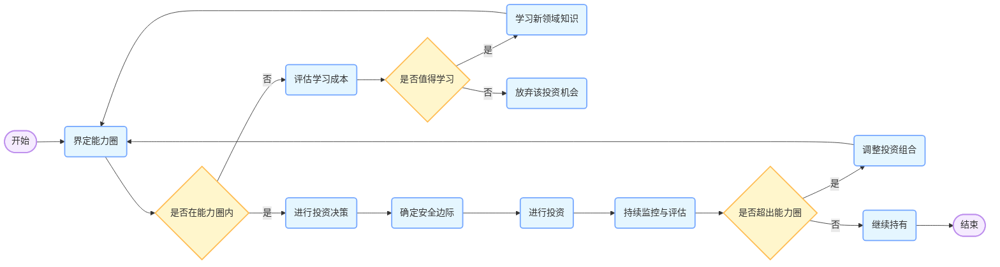

# 巴菲特的圈子能力理论：知道自己的局限

> 关键词：巴菲特、圈子能力理论、投资局限、能力边界、决策智慧、风险控制、长期价值

> 摘要：本文围绕巴菲特的圈子能力理论展开，深入剖析该理论的核心概念、原理及应用。通过详细阐述圈子能力理论的背景，明确其目的、适用范围、预期读者等内容。在核心概念部分，用文本示意图和 Mermaid 流程图清晰展示理论架构。借助 Python 代码讲解核心算法原理和具体操作步骤，运用数学模型和公式进一步阐释其内在逻辑。通过项目实战案例，展示该理论在实际投资决策中的应用及代码实现。探讨其在不同场景下的实际应用，推荐相关学习资源、开发工具和论文著作。最后总结该理论的未来发展趋势与挑战，解答常见问题并提供扩展阅读与参考资料，旨在帮助读者全面理解和运用巴菲特的圈子能力理论，在投资等领域做出更明智的决策。

## 1. 背景介绍 
### 1.1 目的和范围
巴菲特的圈子能力理论在投资界乃至其他众多领域都具有深远的影响。本文章的目的在于深入解析这一理论，不仅帮助投资者更好地理解如何在投资决策中界定自己的能力范围，降低风险，实现长期价值的增长，还希望为其他领域的从业者提供借鉴，使其在决策过程中能够更加理性和明智。

文章的范围涵盖了圈子能力理论的各个方面，包括其核心概念、原理、算法、数学模型，以及在实际投资和其他场景中的应用。同时，还会介绍相关的学习资源、开发工具和研究成果，以帮助读者全面深入地掌握这一理论。

### 1.2 预期读者
本文的预期读者主要包括以下几类人群：
- **投资者**：无论是专业的机构投资者还是普通的个人投资者，都可以从巴菲特的圈子能力理论中获取宝贵的投资智慧，学会识别自己的能力边界，从而做出更合理的投资决策，提高投资收益。
- **企业管理者**：在企业的战略规划、项目决策等方面，圈子能力理论可以帮助管理者明确企业的优势和局限，避免盲目扩张和冒险决策，实现企业的可持续发展。
- **金融从业者**：如分析师、交易员等，通过深入理解该理论，可以提升自己的专业素养和分析能力，更好地为客户提供服务。
- **对投资和决策理论感兴趣的学习者**：包括学生、研究人员等，本文可以作为他们了解投资决策理论的重要参考资料，激发他们对相关领域的研究兴趣。

### 1.3 文档结构概述
本文将按照以下结构展开：
- **核心概念与联系**：介绍圈子能力理论的核心概念，通过文本示意图和 Mermaid 流程图展示其架构和内在联系。
- **核心算法原理 & 具体操作步骤**：运用 Python 代码详细讲解核心算法原理和具体操作步骤，帮助读者理解如何在实际中应用该理论。
- **数学模型和公式 & 详细讲解 & 举例说明**：使用数学模型和公式进一步阐释圈子能力理论的内在逻辑，并通过具体例子进行说明。
- **项目实战：代码实际案例和详细解释说明**：通过实际的投资项目案例，展示该理论在实际中的应用，包括开发环境搭建、源代码实现和代码解读。
- **实际应用场景**：探讨圈子能力理论在不同场景下的应用，如股票投资、企业战略决策等。
- **工具和资源推荐**：推荐相关的学习资源、开发工具和论文著作，帮助读者深入学习和研究该理论。
- **总结：未来发展趋势与挑战**：总结圈子能力理论的未来发展趋势和面临的挑战。
- **附录：常见问题与解答**：解答读者在学习和应用该理论过程中常见的问题。
- **扩展阅读 & 参考资料**：提供相关的扩展阅读材料和参考资料，方便读者进一步深入研究。

### 1.4 术语表
#### 1.4.1 核心术语定义
- **圈子能力理论**：巴菲特提出的一种投资和决策理论，强调投资者应明确自己的能力范围，只在自己熟悉和擅长的领域进行投资和决策，避免涉足超出能力边界的领域。
- **能力边界**：指个人或组织在特定领域所具备的知识、技能和经验的范围，超出这个范围，其决策和行动的风险会显著增加。
- **安全边际**：在投资中，安全边际是指股票的内在价值与市场价格之间的差距，投资者应在有足够安全边际的情况下进行投资，以降低风险。
- **长期价值投资**：一种投资策略，强调投资者应关注企业的长期发展潜力和内在价值，而不是短期的市场波动，通过长期持有优质资产实现资产的增值。

#### 1.4.2 相关概念解释
- **投资决策**：投资者在进行投资时，根据自己的目标、风险承受能力和对市场的分析，选择合适的投资对象和投资时机的过程。
- **风险管理**：识别、评估和应对投资过程中各种风险的过程，旨在降低风险对投资收益的影响。
- **企业内在价值**：企业未来现金流量的现值，是企业真实价值的体现，不受市场短期波动的影响。

#### 1.4.3 缩略词列表
- **ROE**：Return on Equity，净资产收益率，衡量企业盈利能力的重要指标。
- **PE**：Price-to-Earnings Ratio，市盈率，反映股票价格与每股盈利之间的关系。
- **PB**：Price-to-Book Ratio，市净率，反映股票价格与每股净资产之间的关系。

## 2. 核心概念与联系 
### 核心概念原理
巴菲特的圈子能力理论的核心思想是，投资者应该专注于自己熟悉和理解的领域，也就是自己的“能力圈”。每个人的知识、经验和能力都是有限的，在投资中，如果超出自己的能力圈去进行决策，就很容易因为缺乏足够的了解和判断能力而遭受损失。

能力圈并不是固定不变的，它可以通过不断的学习和实践来扩大。但在扩大能力圈的过程中，投资者也应该保持谨慎，确保自己真正掌握了新领域的知识和技能，而不是盲目地进入新的领域。

同时，圈子能力理论强调了安全边际的重要性。即使是在自己的能力圈内进行投资，也应该寻找具有足够安全边际的投资机会，以降低投资风险。

### 文本示意图
```plaintext
              巴菲特的圈子能力理论
                    |
                    |
           能力圈的界定与管理
                    |
        __________________
       |                  |
  知识与经验积累      能力边界的识别
       |                  |
       |                  |
  持续学习与实践      风险评估与控制
       |                  |
       |                  |
  能力圈的扩大         安全边际的确定
```

### Mermaid 流程图


## 3. 核心算法原理 & 具体操作步骤 
### 核心算法原理
圈子能力理论的核心算法可以概括为以下几个步骤：
1. **能力圈的界定**：通过对自己的知识、经验、技能等方面进行评估，确定自己在不同领域的熟悉程度和能力水平，从而界定出自己的能力圈。
2. **投资机会的筛选**：在面对各种投资机会时，判断该机会是否在自己的能力圈内。如果不在能力圈内，则需要评估学习成本和收益，决定是否值得进入该领域。
3. **安全边际的计算**：对于在能力圈内的投资机会，计算其安全边际。安全边际可以通过比较股票的内在价值和市场价格来确定。
4. **投资决策的制定**：根据安全边际的大小和自己的风险承受能力，制定投资决策，包括是否投资、投资的金额和时间等。

### 具体操作步骤及 Python 代码实现
以下是一个简单的 Python 代码示例，用于演示如何根据圈子能力理论进行投资机会的筛选和安全边际的计算：

```python
# 定义能力圈，用字典表示，键为领域名称，值为熟悉程度（0-100）
ability_circle = {
    "消费行业": 80,
    "金融行业": 70,
    "科技行业": 30
}

# 定义投资机会，用字典表示，键为投资机会名称，值为所属领域
investment_opportunities = {
    "公司 A": "消费行业",
    "公司 B": "金融行业",
    "公司 C": "科技行业"
}

# 定义计算安全边际的函数
def calculate_safety_margin(intrinsic_value, market_price):
    """
    计算安全边际
    :param intrinsic_value: 内在价值
    :param market_price: 市场价格
    :return: 安全边际
    """
    return (intrinsic_value - market_price) / intrinsic_value

# 筛选在能力圈内的投资机会
def filter_opportunities(ability_circle, investment_opportunities, threshold=50):
    """
    筛选在能力圈内的投资机会
    :param ability_circle: 能力圈
    :param investment_opportunities: 投资机会
    :param threshold: 熟悉程度阈值
    :return: 筛选后的投资机会
    """
    filtered_opportunities = {}
    for opportunity, industry in investment_opportunities.items():
        if industry in ability_circle and ability_circle[industry] >= threshold:
            filtered_opportunities[opportunity] = industry
    return filtered_opportunities

# 示例数据：假设公司 A 的内在价值为 100，市场价格为 80
intrinsic_value_A = 100
market_price_A = 80

# 筛选在能力圈内的投资机会
filtered_opportunities = filter_opportunities(ability_circle, investment_opportunities)
print("在能力圈内的投资机会:", filtered_opportunities)

# 计算公司 A 的安全边际
safety_margin_A = calculate_safety_margin(intrinsic_value_A, market_price_A)
print("公司 A 的安全边际:", safety_margin_A)
```

### 代码解释
- `ability_circle` 字典表示个人的能力圈，其中键为领域名称，值为熟悉程度（0-100）。
- `investment_opportunities` 字典表示投资机会，其中键为投资机会名称，值为所属领域。
- `calculate_safety_margin` 函数用于计算安全边际，通过比较内在价值和市场价格来确定。
- `filter_opportunities` 函数用于筛选在能力圈内的投资机会，根据熟悉程度阈值进行判断。
- 最后，代码筛选出在能力圈内的投资机会，并计算公司 A 的安全边际。

## 4. 数学模型和公式 & 详细讲解 & 举例说明 
### 数学模型和公式
在圈子能力理论中，主要涉及到两个重要的数学概念：安全边际和内在价值。

#### 安全边际
安全边际（$SM$）的计算公式为：
$$SM = \frac{V - P}{V}$$
其中，$V$ 表示股票的内在价值，$P$ 表示股票的市场价格。

安全边际反映了股票价格相对于内在价值的折扣程度，安全边际越大，说明股票的投资价值越高，风险越低。

#### 内在价值
内在价值的计算方法有很多种，其中一种常用的方法是现金流折现模型（DCF）。现金流折现模型的基本公式为：
$$V = \sum_{t=1}^{n} \frac{CF_t}{(1 + r)^t}$$
其中，$V$ 表示股票的内在价值，$CF_t$ 表示第 $t$ 期的现金流量，$r$ 表示折现率，$n$ 表示预测期数。

### 详细讲解
#### 安全边际
安全边际的概念是圈子能力理论中的重要组成部分。它的作用是在投资中提供一定的缓冲空间，降低投资风险。当安全边际较大时，即使市场价格出现一定的波动，投资者也有较大的概率获得正收益。

例如，假设一只股票的内在价值为 100 元，市场价格为 80 元，则安全边际为：
$$SM = \frac{100 - 80}{100} = 0.2 = 20\%$$
这意味着股票的市场价格相对于内在价值有 20% 的折扣，投资者在购买该股票时具有一定的安全保障。

#### 内在价值
内在价值是股票的真实价值，它不受市场短期波动的影响。现金流折现模型是一种基于未来现金流量的估值方法，它通过预测企业未来的现金流量，并将其折现到当前时刻，来计算股票的内在价值。

在使用现金流折现模型时，需要注意以下几点：
- **现金流量的预测**：现金流量的预测是现金流折现模型的关键，需要对企业的经营状况、行业发展趋势等进行深入的分析和研究。
- **折现率的选择**：折现率反映了投资者对投资风险的预期，折现率越高，说明投资者对风险的要求越高，股票的内在价值也就越低。
- **预测期数的确定**：预测期数的确定需要根据企业的实际情况和行业特点进行合理的估计。

### 举例说明
假设一家公司预计未来三年的现金流量分别为 100 万元、120 万元和 150 万元，折现率为 10%，预测期数为 3 年。则该公司股票的内在价值为：
$$V = \frac{100}{(1 + 0.1)^1} + \frac{120}{(1 + 0.1)^2} + \frac{150}{(1 + 0.1)^3}$$
$$V = \frac{100}{1.1} + \frac{120}{1.21} + \frac{150}{1.331}$$
$$V \approx 90.91 + 99.17 + 112.70$$
$$V \approx 302.78$$（万元）

如果该公司股票的市场价格为 250 万元，则安全边际为：
$$SM = \frac{302.78 - 250}{302.78} \approx 0.174 = 17.4\%$$

这说明该公司股票的市场价格相对于内在价值有 17.4% 的折扣，具有一定的投资价值。

## 5. 项目实战：代码实际案例和详细解释说明 
### 5.1  开发环境搭建
在进行项目实战之前，需要搭建相应的开发环境。以下是具体的步骤：
1. **安装 Python**：从 Python 官方网站（https://www.python.org/downloads/） 下载并安装 Python 3.x 版本。
2. **安装开发工具**：推荐使用 PyCharm 作为开发工具，它是一款功能强大的 Python 集成开发环境（IDE）。可以从 JetBrains 官方网站（https://www.jetbrains.com/pycharm/download/） 下载并安装 PyCharm。
3. **安装必要的库**：在项目中，我们需要使用一些 Python 库，如 `pandas`、`numpy` 等。可以使用以下命令进行安装：
```sh
pip install pandas numpy
```

### 5.2  源代码详细实现和代码解读
以下是一个完整的项目实战代码示例，用于演示如何根据圈子能力理论进行股票投资决策：

```python
import pandas as pd
import numpy as np

# 定义能力圈，用字典表示，键为行业名称，值为熟悉程度（0-100）
ability_circle = {
    "消费行业": 80,
    "金融行业": 70,
    "科技行业": 30
}

# 定义股票数据，用 DataFrame 表示
stocks = pd.DataFrame({
    "股票代码": ["000001", "000002", "000003"],
    "股票名称": ["公司 A", "公司 B", "公司 C"],
    "所属行业": ["消费行业", "金融行业", "科技行业"],
    "内在价值": [100, 120, 80],
    "市场价格": [80, 100, 90]
})

# 定义计算安全边际的函数
def calculate_safety_margin(intrinsic_value, market_price):
    """
    计算安全边际
    :param intrinsic_value: 内在价值
    :param market_price: 市场价格
    :return: 安全边际
    """
    return (intrinsic_value - market_price) / intrinsic_value

# 筛选在能力圈内的股票
def filter_stocks(ability_circle, stocks, threshold=50):
    """
    筛选在能力圈内的股票
    :param ability_circle: 能力圈
    :param stocks: 股票数据
    :param threshold: 熟悉程度阈值
    :return: 筛选后的股票数据
    """
    filtered_stocks = []
    for index, row in stocks.iterrows():
        industry = row["所属行业"]
        if industry in ability_circle and ability_circle[industry] >= threshold:
            filtered_stocks.append(row)
    return pd.DataFrame(filtered_stocks)

# 计算筛选后股票的安全边际
def calculate_safety_margins(filtered_stocks):
    """
    计算筛选后股票的安全边际
    :param filtered_stocks: 筛选后的股票数据
    :return: 包含安全边际的股票数据
    """
    filtered_stocks["安全边际"] = filtered_stocks.apply(lambda row: calculate_safety_margin(row["内在价值"], row["市场价格"]), axis=1)
    return filtered_stocks

# 筛选安全边际大于阈值的股票
def filter_by_safety_margin(filtered_stocks, safety_margin_threshold=0.1):
    """
    筛选安全边际大于阈值的股票
    :param filtered_stocks: 筛选后的股票数据
    :param safety_margin_threshold: 安全边际阈值
    :return: 筛选后的股票数据
    """
    return filtered_stocks[filtered_stocks["安全边际"] >= safety_margin_threshold]

# 筛选在能力圈内的股票
filtered_stocks = filter_stocks(ability_circle, stocks)
print("在能力圈内的股票:")
print(filtered_stocks)

# 计算筛选后股票的安全边际
filtered_stocks_with_safety_margin = calculate_safety_margins(filtered_stocks)
print("包含安全边际的股票:")
print(filtered_stocks_with_safety_margin)

# 筛选安全边际大于阈值的股票
final_stocks = filter_by_safety_margin(filtered_stocks_with_safety_margin)
print("安全边际大于阈值的股票:")
print(final_stocks)
```

### 5.3  代码解读与分析
- **数据定义**：使用字典 `ability_circle` 表示能力圈，使用 `pandas` 的 `DataFrame` 表示股票数据，包含股票代码、股票名称、所属行业、内在价值和市场价格等信息。
- **筛选在能力圈内的股票**：`filter_stocks` 函数根据能力圈和熟悉程度阈值筛选出在能力圈内的股票。
- **计算安全边际**：`calculate_safety_margin` 函数用于计算股票的安全边际，`calculate_safety_margins` 函数将安全边际添加到股票数据中。
- **筛选安全边际大于阈值的股票**：`filter_by_safety_margin` 函数根据安全边际阈值筛选出安全边际大于阈值的股票。

通过以上步骤，我们可以根据圈子能力理论筛选出在能力圈内且安全边际较大的股票，从而进行投资决策。

## 6. 实际应用场景 
### 股票投资
在股票投资中，圈子能力理论具有重要的指导意义。投资者可以根据自己的知识和经验，界定自己的能力圈，只投资于自己熟悉的行业和公司。例如，一个对消费行业有深入了解的投资者，可以重点关注消费类股票，对其基本面、行业趋势等进行深入分析，从而做出更准确的投资决策。

同时，投资者还可以通过计算安全边际，选择具有足够安全边际的股票进行投资，降低投资风险。在市场波动较大时，坚守自己的能力圈，不盲目跟风投资，可以避免因不了解市场和公司而遭受损失。

### 企业战略决策
在企业战略决策中，圈子能力理论也可以帮助企业管理者明确企业的优势和局限，制定合理的战略规划。企业管理者应该了解企业在各个领域的能力和资源，确定企业的核心竞争力所在，避免盲目进入不熟悉的领域。

例如，一家专注于制造业的企业，在考虑多元化发展时，应该谨慎评估自身在新领域的能力和资源，确保有足够的能力和优势在新领域取得成功。如果企业盲目进入不熟悉的领域，可能会面临技术、市场、管理等方面的挑战，导致企业资源的浪费和经营风险的增加。

### 创业投资
在创业投资中，投资者也可以运用圈子能力理论来评估创业项目的可行性。投资者应该关注自己熟悉的行业和领域，对创业项目的团队、技术、市场等方面进行深入了解和评估。如果创业项目超出了投资者的能力圈，投资者应该谨慎投资，或者寻求专业人士的帮助。

同时，投资者还可以通过计算项目的安全边际，评估项目的风险和收益。例如，在评估一个创业项目的估值时，投资者可以通过对项目的未来现金流进行预测，计算其内在价值，然后与项目的估值进行比较，确定是否有足够的安全边际。

## 7. 工具和资源推荐
### 7.1 学习资源推荐
#### 7.1.1 书籍推荐
- 《聪明的投资者》（The Intelligent Investor）：本杰明·格雷厄姆（Benjamin Graham）著，这本书是价值投资的经典之作，详细介绍了价值投资的理念和方法，对巴菲特的投资思想产生了深远的影响。
- 《巴菲特致股东的信：股份公司教程》（Letters to Shareholders of Berkshire Hathaway）：沃伦·巴菲特（Warren Buffett）著，这本书收录了巴菲特历年致股东的信，通过这些信件可以深入了解巴菲特的投资哲学和管理理念。
- 《穷查理宝典：查理·芒格的智慧箴言录》（Poor Charlie's Almanack: The Wit and Wisdom of Charles T. Munger）：彼得·考夫曼（Peter D. Kaufman）编著，这本书介绍了查理·芒格的投资思想和多元思维模型，对理解巴菲特的圈子能力理论有很大的帮助。

#### 7.1.2 在线课程
- Coursera 上的“投资学原理”（Principles of Investing）课程：该课程由宾夕法尼亚大学的教授授课，系统地介绍了投资学的基本原理和方法，包括价值投资、风险管理等内容。
- edX 上的“金融市场”（Financial Markets）课程：该课程由耶鲁大学的教授授课，深入探讨了金融市场的运行机制和投资策略，对理解投资决策有很大的帮助。

#### 7.1.3 技术博客和网站
- 雪球网（https://xueqiu.com/）：一个专注于投资交流的社区，汇聚了众多投资者和投资专家，提供了丰富的投资资讯、研究报告和投资经验分享。
- 价值投资网（https://www.jztz.com/）：一个专注于价值投资的网站，提供了价值投资的理论知识、案例分析和投资工具，对学习和实践价值投资有很大的帮助。

### 7.2 开发工具框架推荐
#### 7.2.1 IDE和编辑器
- PyCharm：一款功能强大的 Python 集成开发环境（IDE），提供了代码编辑、调试、版本控制等功能，适合开发各种 Python 项目。
- Visual Studio Code：一款轻量级的代码编辑器，支持多种编程语言，具有丰富的插件和扩展功能，适合快速开发和调试 Python 代码。

#### 7.2.2 调试和性能分析工具
- `pdb`：Python 内置的调试工具，可以帮助开发者在代码中设置断点、单步执行代码、查看变量值等，方便调试代码。
- `cProfile`：Python 内置的性能分析工具，可以帮助开发者分析代码的性能瓶颈，找出耗时较长的函数和代码段，进行优化。

#### 7.2.3 相关框架和库
- `pandas`：一个强大的数据分析库，提供了数据结构和数据分析工具，适合处理和分析各种类型的数据。
- `numpy`：一个用于科学计算的库，提供了高效的数组和矩阵运算功能，适合进行数值计算和数据分析。

### 7.3 相关论文著作推荐
#### 7.3.1 经典论文
- 《证券分析》（Security Analysis）：本杰明·格雷厄姆（Benjamin Graham）和戴维·多德（David Dodd）著，这是价值投资领域的经典论文，提出了价值投资的基本理念和方法。
- 《有效市场假说》（Efficient Markets Hypothesis）：尤金·法玛（Eugene F. Fama）著，该论文提出了有效市场假说，对金融市场的效率和投资策略产生了深远的影响。

#### 7.3.2 最新研究成果
- 《行为金融学》（Behavioral Finance）：理查德·泰勒（Richard H. Thaler）等著，该领域的研究成果关注投资者的心理和行为对投资决策的影响，为理解投资市场的非理性行为提供了新的视角。
- 《量化投资》（Quantitative Investment）：近年来，量化投资领域的研究成果不断涌现，通过运用数学模型和计算机算法进行投资决策，提高了投资的效率和准确性。

#### 7.3.3 应用案例分析
- 《巴菲特投资案例集》：收集了巴菲特历年的投资案例，通过对这些案例的分析，可以深入了解巴菲特的投资策略和决策过程。
- 《优秀企业的投资价值分析》：对一些优秀企业的投资价值进行分析，包括企业的基本面、行业竞争格局、发展前景等，为投资者提供了参考。

## 8. 总结：未来发展趋势与挑战
### 未来发展趋势
- **跨领域融合**：随着科技的不断发展和社会的进步，各个领域之间的界限越来越模糊，圈子能力理论也将与其他领域的理论和方法进行更深入的融合。例如，将圈子能力理论与人工智能、大数据等技术相结合，可以更准确地界定能力圈，筛选投资机会。
- **个性化投资**：随着投资者个性化需求的不断增加，圈子能力理论将更加注重个性化投资策略的制定。投资者可以根据自己的兴趣、知识、经验和风险承受能力，定制适合自己的投资组合。
- **全球视野**：在全球化的背景下，投资者的投资范围将不再局限于本国市场，而是拓展到全球市场。圈子能力理论也将需要适应全球市场的变化，考虑不同国家和地区的文化、法律、经济等因素。

### 挑战
- **能力圈的动态变化**：随着科技的快速发展和市场环境的不断变化，能力圈也在不断动态变化。投资者需要不断学习和更新知识，及时调整自己的能力圈，以适应市场的变化。
- **信息过载**：在信息爆炸的时代，投资者面临着大量的信息，如何从海量信息中筛选出有价值的信息，准确界定自己的能力圈和筛选投资机会，是一个巨大的挑战。
- **情绪和心理因素的影响**：投资决策往往受到投资者情绪和心理因素的影响，如贪婪、恐惧、从众心理等。这些因素可能导致投资者超出自己的能力圈进行投资，或者在安全边际足够的情况下不敢投资，从而影响投资收益。

## 9. 附录：常见问题与解答
### 如何准确界定自己的能力圈？
准确界定自己的能力圈需要从以下几个方面入手：
- **自我评估**：对自己的知识、经验、技能等方面进行全面的评估，了解自己的优势和劣势。
- **实践经验**：通过实际的投资和工作经验，不断总结和反思，确定自己在不同领域的熟悉程度和能力水平。
- **学习和交流**：不断学习新的知识和技能，与同行和专家进行交流和分享，扩大自己的视野和认知范围。

### 安全边际的阈值应该如何确定？
安全边际的阈值应该根据投资者的风险承受能力和投资目标来确定。一般来说，风险承受能力较低的投资者可以选择较高的安全边际阈值，以降低投资风险；风险承受能力较高的投资者可以选择较低的安全边际阈值，以获取更高的投资收益。

### 如果遇到超出能力圈的投资机会，应该怎么办？
如果遇到超出能力圈的投资机会，可以采取以下几种方法：
- **评估学习成本**：评估学习该领域知识和技能的成本和收益，如果学习成本较低且收益较高，可以考虑学习相关知识，扩大自己的能力圈。
- **寻求专业帮助**：可以寻求该领域的专业人士的帮助，如分析师、投资顾问等，获取他们的建议和意见。
- **放弃该投资机会**：如果学习成本较高且风险较大，可以选择放弃该投资机会，避免盲目投资。

## 10. 扩展阅读 & 参考资料
### 扩展阅读
- 《金融炼金术》（The Alchemy of Finance）：乔治·索罗斯（George Soros）著，这本书介绍了索罗斯的投资思想和哲学，对理解金融市场的运行机制和投资策略有很大的帮助。
- 《黑天鹅》（The Black Swan）：纳西姆·尼古拉斯·塔勒布（Nassim Nicholas Taleb）著，该书探讨了不可预测的重大事件对金融市场和投资决策的影响，提醒投资者要关注不确定性和风险。

### 参考资料
- 巴菲特历年致股东的信：可以从伯克希尔·哈撒韦公司的官方网站（https://www.berkshirehathaway.com/） 上获取。
- 金融学术期刊：如《金融研究》、《经济研究》等，这些期刊发表了大量的金融领域的研究论文和成果，对深入研究投资理论和实践有很大的帮助。