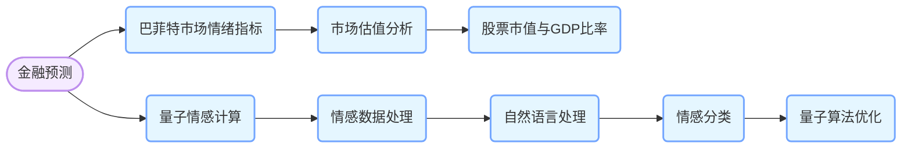

# 巴菲特的市场情绪指标：量子情感计算在金融预测中的应用

> 关键词：巴菲特市场情绪指标、量子情感计算、金融预测、市场情绪分析、量子计算技术、情感量化、投资决策

> 摘要：本文聚焦于巴菲特的市场情绪指标以及量子情感计算在金融预测中的应用。首先介绍相关背景知识，包括研究目的、预期读者等内容。接着阐述核心概念与联系，深入剖析量子情感计算与市场情绪指标的原理和架构。通过Python代码详细讲解核心算法原理与具体操作步骤，同时给出相关数学模型和公式并举例说明。以实际项目案例展示代码实现和详细解读，探讨该技术在不同金融场景中的实际应用。推荐相关学习资源、开发工具框架以及论文著作，最后总结未来发展趋势与挑战，解答常见问题并提供扩展阅读和参考资料，旨在全面深入地探讨量子情感计算在金融预测领域的应用价值。

## 1. 背景介绍 
### 1.1 目的和范围
金融市场充满了不确定性，投资者一直试图寻找有效的方法来预测市场走势，以做出更明智的投资决策。巴菲特的市场情绪指标作为一种重要的市场分析工具，在金融界有着广泛的影响力。而量子情感计算作为新兴的跨学科技术，为金融预测带来了新的思路和方法。本文的目的在于深入探讨量子情感计算如何与巴菲特的市场情绪指标相结合，以及这种结合在金融预测中的应用原理、方法和实际效果。范围涵盖从理论原理的阐述到实际项目案例的分析，涉及量子计算、情感分析、金融市场分析等多个领域。

### 1.2 预期读者
本文预期读者包括金融领域的专业人士，如投资者、分析师、基金经理等，他们希望通过新的技术手段提升金融预测的准确性和投资决策的科学性；计算机科学领域的研究者和开发者，对量子计算、人工智能、情感分析等技术在金融领域的应用感兴趣；以及对金融市场和新兴技术交叉领域有学习和研究需求的学生和爱好者。

### 1.3 文档结构概述
本文将按照以下结构进行阐述：首先介绍背景知识，包括研究目的、预期读者和文档结构概述等内容；接着详细讲解核心概念与联系，包括量子情感计算和巴菲特市场情绪指标的原理和架构；通过Python代码深入分析核心算法原理和具体操作步骤；给出相关的数学模型和公式并进行详细讲解和举例说明；以实际项目案例展示代码实现和详细解读；探讨该技术在不同金融场景中的实际应用；推荐相关的学习资源、开发工具框架以及论文著作；最后总结未来发展趋势与挑战，解答常见问题并提供扩展阅读和参考资料。

### 1.4 术语表
#### 1.4.1 核心术语定义
- **巴菲特市场情绪指标**：是基于巴菲特的投资理念和市场观察总结出的一系列反映市场整体情绪和估值水平的指标，用于辅助投资者判断市场的高估或低估状态，从而做出投资决策。
- **量子情感计算**：是将量子计算技术与情感分析相结合的跨学科领域，通过量子算法处理和分析与情感相关的数据，以挖掘情感信息背后的潜在规律和模式。
- **金融预测**：指运用各种方法和技术对金融市场的未来走势、资产价格变化、风险水平等进行预估和判断的过程。

#### 1.4.2 相关概念解释
- **量子计算**：是一种基于量子力学原理的计算方式，利用量子比特的叠加和纠缠特性，能够在某些问题上实现比经典计算机更快的计算速度和更高的计算效率。
- **情感分析**：也称为意见挖掘，是指通过自然语言处理、机器学习等技术对文本、语音等数据中的情感倾向（如积极、消极、中性）进行识别和分析的过程。

#### 1.4.3 缩略词列表
- **QC**：Quantum Computing，量子计算
- **NLP**：Natural Language Processing，自然语言处理
- **ML**：Machine Learning，机器学习

## 2. 核心概念与联系 

### 2.1 巴菲特市场情绪指标原理
巴菲特市场情绪指标主要基于对市场整体估值水平的评估。其中一个重要的指标是股票总市值与国内生产总值（GDP）的比率。当该比率处于较高水平时，通常意味着市场被高估，投资者需要谨慎；当比率处于较低水平时，市场可能被低估，存在投资机会。其基本原理是认为股票市场的整体价值应该与实体经济的规模相匹配，如果偏离过大，则市场可能存在泡沫或低估的情况。

### 2.2 量子情感计算原理
量子情感计算结合了量子计算和情感分析的优势。量子计算利用量子比特的叠加和纠缠特性，能够同时处理多个状态，大大提高计算效率。在情感计算中，量子算法可以更高效地处理和分析大量的情感相关数据，挖掘其中的潜在模式和规律。情感分析则通过自然语言处理和机器学习技术，对文本、语音等数据中的情感倾向进行识别和分类。量子情感计算通过量子算法对情感分析的结果进行进一步的处理和优化，以提高情感信息的利用价值。

### 2.3 两者的联系
巴菲特市场情绪指标主要关注市场的宏观估值和整体情绪，而量子情感计算可以从微观层面分析投资者的情感和心理状态。投资者的情感和心理状态会影响他们的投资决策，进而影响市场的走势。量子情感计算可以通过分析社交媒体、新闻报道等数据源中的情感信息，捕捉投资者的情绪变化，为巴菲特市场情绪指标提供更丰富的信息和更深入的分析视角。例如，当市场情绪指标显示市场处于高估状态时，量子情感计算可以进一步分析投资者的情绪是否过于乐观，从而更准确地判断市场的风险。

### 2.4 核心概念架构的文本示意图
```plaintext
                        金融预测
                          |
           +-------------+-------------+
           |                           |
  巴菲特市场情绪指标             量子情感计算
           |                           |
  市场估值分析                    情感数据处理
           |                           |
  股票市值与GDP比率              自然语言处理
                                   |
                                情感分类
                                   |
                              量子算法优化
```

### 2.5 Mermaid流程图


## 3. 核心算法原理 & 具体操作步骤 

### 3.1 量子情感计算核心算法原理
量子情感计算的核心算法主要包括量子态表示、量子门操作和量子测量。在量子态表示中，将情感信息编码为量子比特的状态。例如，可以将积极情感表示为量子比特的 $|0\rangle$ 态，消极情感表示为 $|1\rangle$ 态，中性情感表示为两者的叠加态。量子门操作则用于对量子比特的状态进行变换，以实现情感信息的处理和分析。量子测量则用于获取最终的情感分析结果。

### 3.2 基于Python的量子情感计算算法实现

```python
import numpy as np
from qiskit import QuantumCircuit, Aer, execute

# 定义量子比特数量
num_qubits = 1

# 初始化量子电路
qc = QuantumCircuit(num_qubits, num_qubits)

# 假设积极情感为|0>态，消极情感为|1>态，中性情感为叠加态
# 模拟中性情感，制备叠加态
qc.h(0)

# 进行量子测量
qc.measure(0, 0)

# 选择模拟器
backend = Aer.get_backend('qasm_simulator')

# 执行量子电路
job = execute(qc, backend, shots=1000)
result = job.result()
counts = result.get_counts(qc)

# 输出测量结果
print("测量结果:", counts)
```

### 3.3 具体操作步骤
1. **数据收集**：收集与市场情绪相关的数据，如社交媒体评论、新闻报道等。
2. **数据预处理**：对收集到的数据进行清洗、分词、去除停用词等预处理操作。
3. **情感分类**：使用自然语言处理和机器学习技术对预处理后的数据进行情感分类，将其分为积极、消极、中性等类别。
4. **量子态编码**：将情感分类结果编码为量子比特的状态。
5. **量子算法处理**：使用量子门操作对量子比特的状态进行变换，以实现情感信息的处理和分析。
6. **量子测量**：对量子比特的状态进行测量，获取最终的情感分析结果。
7. **结果分析**：将量子情感计算的结果与巴菲特市场情绪指标相结合，进行综合分析，为金融预测提供依据。

## 4. 数学模型和公式 & 详细讲解 & 举例说明 

### 4.1 量子态表示
在量子情感计算中，情感信息可以用量子比特的状态来表示。一个量子比特的状态可以表示为：

$$|\psi\rangle = \alpha|0\rangle + \beta|1\rangle$$

其中，$\alpha$ 和 $\beta$ 是复数，满足 $|\alpha|^2 + |\beta|^2 = 1$。$|0\rangle$ 和 $|1\rangle$ 是量子比特的两个基态。例如，当 $\alpha = 1$，$\beta = 0$ 时，量子比特处于 $|0\rangle$ 态，表示积极情感；当 $\alpha = 0$，$\beta = 1$ 时，量子比特处于 $|1\rangle$ 态，表示消极情感；当 $\alpha = \beta = \frac{1}{\sqrt{2}}$ 时，量子比特处于叠加态，表示中性情感。

### 4.2 量子门操作
量子门操作是对量子比特状态进行变换的操作。常见的量子门包括哈达玛门（H门）、泡利X门、泡利Y门、泡利Z门等。哈达玛门的矩阵表示为：

$$H = \frac{1}{\sqrt{2}}\begin{bmatrix}1 & 1 \\ 1 & -1\end{bmatrix}$$

当对一个处于 $|0\rangle$ 态的量子比特应用哈达玛门时，其状态变为：

$$H|0\rangle = \frac{1}{\sqrt{2}}(|0\rangle + |1\rangle)$$

这表示从确定的积极情感状态变为中性情感的叠加态。

### 4.3 量子测量
量子测量是获取量子比特状态信息的操作。当对一个处于 $|\psi\rangle = \alpha|0\rangle + \beta|1\rangle$ 态的量子比特进行测量时，测量结果为 $|0\rangle$ 的概率为 $|\alpha|^2$，测量结果为 $|1\rangle$ 的概率为 $|\beta|^2$。例如，对于处于叠加态 $\frac{1}{\sqrt{2}}(|0\rangle + |1\rangle)$ 的量子比特，测量结果为 $|0\rangle$ 和 $|1\rangle$ 的概率均为 $\frac{1}{2}$。

### 4.4 举例说明
假设我们收集到一条社交媒体评论：“今天的股市涨得太厉害了，我太开心了！”。通过自然语言处理和情感分类技术，判断该评论的情感为积极。我们将积极情感编码为量子比特的 $|0\rangle$ 态。然后，我们可以对该量子比特应用哈达玛门，将其状态变为叠加态 $\frac{1}{\sqrt{2}}(|0\rangle + |1\rangle)$，表示进行情感信息的处理和分析。最后，对该量子比特进行测量，根据测量结果判断市场情绪的变化。

## 5. 项目实战：代码实际案例和详细解释说明 

### 5.1  开发环境搭建
1. **安装Python**：确保你的系统中安装了Python 3.x版本。可以从Python官方网站（https://www.python.org/downloads/） 下载并安装。
2. **安装Qiskit**：Qiskit是一个用于量子计算的开源框架。可以使用以下命令安装Qiskit：
```sh
pip install qiskit
```
3. **安装自然语言处理库**：可以使用NLTK、SpaCy等自然语言处理库进行文本预处理和情感分类。例如，安装NLTK：
```sh
pip install nltk
```
并下载必要的数据集：
```python
import nltk
nltk.download('punkt')
nltk.download('stopwords')
```

### 5.2  源代码详细实现和代码解读

```python
import numpy as np
from qiskit import QuantumCircuit, Aer, execute
import nltk
from nltk.corpus import stopwords
from nltk.tokenize import word_tokenize
from textblob import TextBlob

# 数据预处理函数
def preprocess_text(text):
    # 分词
    tokens = word_tokenize(text)
    # 去除停用词
    stop_words = set(stopwords.words('english'))
    filtered_tokens = [word for word in tokens if word.lower() not in stop_words]
    return " ".join(filtered_tokens)

# 情感分类函数
def classify_sentiment(text):
    blob = TextBlob(text)
    polarity = blob.sentiment.polarity
    if polarity > 0:
        return "positive"
    elif polarity < 0:
        return "negative"
    else:
        return "neutral"

# 量子情感计算函数
def quantum_sentiment_analysis(sentiment):
    num_qubits = 1
    qc = QuantumCircuit(num_qubits, num_qubits)
    
    if sentiment == "positive":
        # 积极情感，初始化为|0>态
        pass
    elif sentiment == "negative":
        # 消极情感，初始化为|1>态
        qc.x(0)
    else:
        # 中性情感，制备叠加态
        qc.h(0)
    
    qc.measure(0, 0)
    
    backend = Aer.get_backend('qasm_simulator')
    job = execute(qc, backend, shots=1000)
    result = job.result()
    counts = result.get_counts(qc)
    
    return counts

# 主函数
def main():
    text = "The stock market is doing great today! I'm so happy."
    preprocessed_text = preprocess_text(text)
    sentiment = classify_sentiment(preprocessed_text)
    quantum_result = quantum_sentiment_analysis(sentiment)
    
    print("原始文本:", text)
    print("预处理后的文本:", preprocessed_text)
    print("情感分类结果:", sentiment)
    print("量子情感计算结果:", quantum_result)

if __name__ == "__main__":
    main()
```

### 5.3  代码解读与分析
1. **数据预处理函数 `preprocess_text`**：该函数接受一个文本字符串作为输入，首先使用 `word_tokenize` 函数将文本分词，然后去除停用词，最后将处理后的单词重新组合成字符串返回。
2. **情感分类函数 `classify_sentiment`**：该函数使用 `TextBlob` 库对文本的情感极性进行分析。如果极性大于0，则判断为积极情感；如果极性小于0，则判断为消极情感；否则判断为中性情感。
3. **量子情感计算函数 `quantum_sentiment_analysis`**：该函数根据情感分类结果初始化量子比特的状态。如果是积极情感，则量子比特初始化为 $|0\rangle$ 态；如果是消极情感，则应用泡利X门将量子比特初始化为 $|1\rangle$ 态；如果是中性情感，则应用哈达玛门将量子比特制备为叠加态。然后进行量子测量，返回测量结果。
4. **主函数 `main`**：该函数调用上述三个函数，完成数据预处理、情感分类和量子情感计算，并输出相应的结果。

## 6. 实际应用场景 
### 6.1 投资决策辅助
投资者可以利用量子情感计算和巴菲特市场情绪指标相结合的方法，更准确地判断市场的走势和风险。例如，当市场情绪指标显示市场处于高估状态，同时量子情感计算分析出投资者情绪过于乐观时，投资者可以选择适当减持股票，降低风险。反之，当市场被低估且投资者情绪过于悲观时，投资者可以考虑增加投资。

### 6.2 风险管理
金融机构可以使用该技术对市场风险进行实时监测和预警。通过分析投资者的情绪变化和市场估值水平，及时发现潜在的风险因素，并采取相应的风险管理措施。例如，当市场情绪突然变得消极，且市场估值较高时，金融机构可以加强风险控制，减少杠杆率，降低投资组合的风险。

### 6.3 市场趋势预测
研究人员可以利用量子情感计算和市场情绪指标，对金融市场的未来趋势进行预测。通过分析大量的历史数据和实时数据，挖掘市场情绪和市场走势之间的潜在规律，为市场趋势预测提供更准确的依据。例如，通过分析社交媒体上的投资者情绪和市场的交易量、价格等数据，预测市场的短期和长期走势。

## 7. 工具和资源推荐
### 7.1 学习资源推荐
#### 7.1.1 书籍推荐
- 《量子计算与量子信息》（Michael A. Nielsen 和 Isaac L. Chuang 著）：这本书是量子计算领域的经典教材，系统地介绍了量子计算的基本原理、算法和应用。
- 《Python自然语言处理》（Steven Bird、Ewan Klein 和 Edward Loper 著）：该书详细介绍了使用Python进行自然语言处理的方法和技术，包括文本预处理、情感分析、命名实体识别等内容。
- 《金融市场技术分析》（约翰·墨菲 著）：这本书是金融市场技术分析的经典著作，介绍了各种技术分析方法和工具，以及如何应用这些方法和工具进行市场分析和投资决策。

#### 7.1.2 在线课程
- Coursera上的“量子计算基础”课程：由专业的量子计算专家授课，系统地介绍量子计算的基本概念、原理和算法。
- edX上的“自然语言处理基础”课程：该课程涵盖了自然语言处理的各个方面，包括文本分类、情感分析、机器翻译等内容。
- Udemy上的“金融市场分析与投资决策”课程：课程结合实际案例，介绍了金融市场分析的方法和技巧，以及如何做出合理的投资决策。

#### 7.1.3 技术博客和网站
- Qiskit官方博客（https://qiskit.org/blog/）：提供了关于量子计算的最新研究成果、技术文章和案例分享。
- Towards Data Science（https://towardsdatascience.com/）：一个专注于数据科学和机器学习的技术博客，有很多关于自然语言处理和情感分析的文章。
- Seeking Alpha（https://seekingalpha.com/）：一个金融市场分析和投资研究的网站，提供了大量的金融市场数据、分析报告和投资建议。

### 7.2 开发工具框架推荐
#### 7.2.1 IDE和编辑器
- PyCharm：一款功能强大的Python集成开发环境，提供了代码编辑、调试、版本控制等功能，适合开发量子计算和自然语言处理相关的Python项目。
- Jupyter Notebook：一个交互式的开发环境，支持Python、R等多种编程语言，适合进行数据探索、模型训练和结果展示。

#### 7.2.2 调试和性能分析工具
- Qiskit Aer：Qiskit的模拟器，可用于调试和验证量子电路的正确性，并进行性能分析。
- NLTK的调试工具：NLTK提供了一些调试工具，可用于检查文本预处理和情感分类的结果。

#### 7.2.3 相关框架和库
- Qiskit：一个用于量子计算的开源框架，提供了量子电路构建、量子算法实现、量子模拟等功能。
- NLTK：自然语言处理工具包，提供了丰富的文本处理和分析功能，如分词、词性标注、情感分析等。
- TextBlob：一个简单易用的自然语言处理库，提供了情感分析、词性标注、文本分类等功能。

### 7.3 相关论文著作推荐
#### 7.3.1 经典论文
- “Quantum Computation and Shor's Factoring Algorithm”（Peter W. Shor 著）：该论文介绍了Shor算法，是量子计算领域的经典之作，为量子计算的发展奠定了基础。
- “Sentiment Analysis: Mining Opinions, Sentiments, and Emotions”（Bing Liu 著）：这篇论文系统地介绍了情感分析的方法和技术，是情感分析领域的重要文献。

#### 7.3.2 最新研究成果
- 关注量子计算和金融领域的顶级学术会议，如IEEE International Conference on Quantum Computing and Engineering（QCE）、ACM SIGKDD Conference on Knowledge Discovery and Data Mining等，这些会议上的研究成果反映了该领域的最新进展。
- 查阅相关学术期刊，如Physical Review A、Journal of Artificial Intelligence Research等，获取关于量子情感计算和金融预测的最新研究论文。

#### 7.3.3 应用案例分析
- 参考一些金融机构和科技公司的研究报告和案例分享，了解量子情感计算在金融预测中的实际应用效果和经验教训。例如，一些大型投资银行的研究部门会发布关于市场情绪分析和投资策略的报告。

## 8. 总结：未来发展趋势与挑战
### 8.1 未来发展趋势
- **技术融合加深**：量子情感计算将与更多的技术进行深度融合，如区块链、人工智能、大数据等。例如，区块链技术可以为金融数据的安全和可信提供保障，人工智能技术可以进一步提高情感分析的准确性和效率，大数据技术可以提供更丰富的市场数据和情感信息。
- **应用领域拓展**：除了金融预测领域，量子情感计算还将在其他领域得到广泛应用，如市场营销、医疗保健、社会科学等。在市场营销领域，可以通过分析消费者的情感和偏好，制定更精准的营销策略；在医疗保健领域，可以通过分析患者的情绪和心理状态，提供更个性化的医疗服务。
- **硬件技术进步**：随着量子计算硬件技术的不断进步，量子计算机的性能将不断提高，量子比特的数量将不断增加，量子门的保真度将不断提高。这将为量子情感计算的发展提供更强大的计算能力支持，推动量子情感计算技术的进一步发展。

### 8.2 挑战
- **量子计算技术限制**：目前量子计算技术还处于发展阶段，量子比特的稳定性和量子门的保真度还存在一定的问题，量子计算机的计算能力和可靠性还不能满足大规模应用的需求。这限制了量子情感计算技术的实际应用效果。
- **情感量化难题**：情感是一种复杂的心理现象，很难用精确的数学模型和量化指标来描述。目前的情感分析技术还存在一定的局限性，对于一些复杂的情感表达和语境理解还不够准确。这给量子情感计算的准确性和可靠性带来了挑战。
- **数据隐私和安全问题**：在金融预测中，涉及大量的敏感数据，如投资者的个人信息、交易记录、市场数据等。量子情感计算需要处理和分析这些数据，这就带来了数据隐私和安全问题。如何在保证数据安全和隐私的前提下，充分利用这些数据进行有效的金融预测，是一个亟待解决的问题。

## 9. 附录：常见问题与解答
### 9.1 量子情感计算与传统情感分析有什么区别？
量子情感计算结合了量子计算的优势，能够更高效地处理和分析大量的情感数据，挖掘其中的潜在模式和规律。传统情感分析主要基于经典计算机和机器学习算法，计算效率相对较低，对于复杂的情感信息处理能力有限。量子情感计算通过量子算法对情感分析的结果进行进一步的优化和处理，能够提高情感信息的利用价值。

### 9.2 量子情感计算在金融预测中的准确性如何？
量子情感计算在金融预测中的准确性受到多种因素的影响，如量子计算技术的发展水平、情感分析的准确性、市场数据的质量等。目前，量子情感计算还处于研究和发展阶段，其准确性还需要进一步提高。随着技术的不断进步和完善，量子情感计算有望在金融预测中发挥更重要的作用，提高金融预测的准确性和可靠性。

### 9.3 如何获取和处理与市场情绪相关的数据？
可以通过多种渠道获取与市场情绪相关的数据，如社交媒体平台、新闻网站、金融论坛等。获取数据后，需要进行预处理操作，如清洗、分词、去除停用词等，以提高数据的质量和可用性。然后可以使用自然语言处理和机器学习技术对预处理后的数据进行情感分类和分析。

### 9.4 量子情感计算需要哪些专业知识和技能？
量子情感计算需要具备量子计算、自然语言处理、机器学习、金融市场分析等多个领域的专业知识和技能。需要了解量子计算的基本原理、量子算法的实现方法，掌握自然语言处理和机器学习的基本技术，熟悉金融市场的运行机制和分析方法。

## 10. 扩展阅读 & 参考资料
### 10.1 扩展阅读
- 《量子力学导论》（David J. Griffiths 著）：深入学习量子力学的基础知识，有助于更好地理解量子计算的原理。
- 《深度学习》（Ian Goodfellow、Yoshua Bengio 和 Aaron Courville 著）：了解深度学习的基本原理和方法，对于提高情感分析的准确性有帮助。
- 《金融炼金术》（乔治·索罗斯 著）：该书介绍了索罗斯的投资理念和方法，对于理解金融市场的运行规律和投资者的心理有一定的启示作用。

### 10.2 参考资料
- Nielsen, M. A., & Chuang, I. L. (2010). Quantum Computation and Quantum Information. Cambridge University Press.
- Bird, S., Klein, E., & Loper, E. (2009). Natural Language Processing with Python. O'Reilly Media.
- Murphy, J. J. (1999). Technical Analysis of the Financial Markets. New York Institute of Finance.
- Shor, P. W. (1994). Algorithms for quantum computation: discrete logarithms and factoring. Proceedings of the 35th Annual Symposium on Foundations of Computer Science.
- Liu, B. (2012). Sentiment Analysis: Mining Opinions, Sentiments, and Emotions. Cambridge University Press.