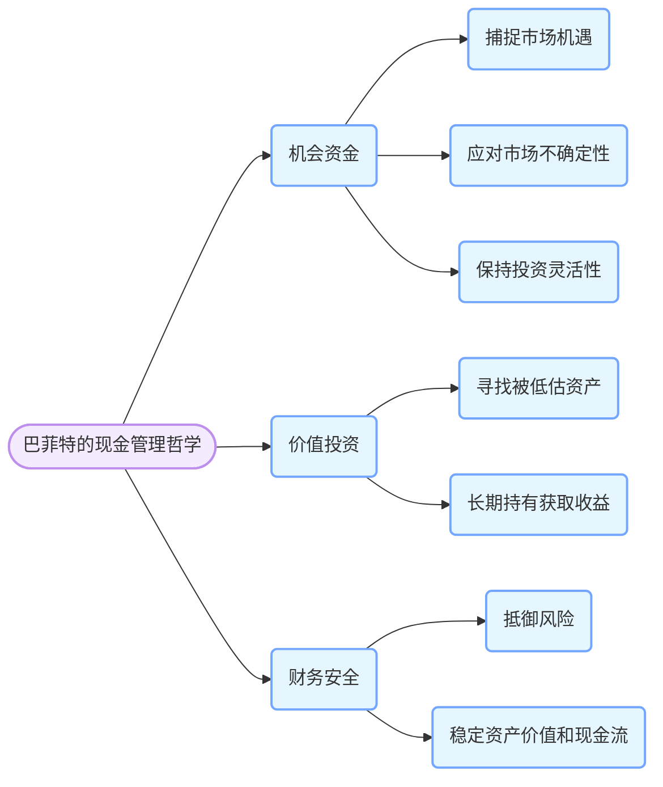

# 巴菲特的现金管理哲学：机会资金的重要性

> 关键词：巴菲特、现金管理哲学、机会资金、投资策略、价值投资、财务安全、市场机遇

> 摘要：本文深入探讨了巴菲特的现金管理哲学，着重强调了机会资金在投资过程中的重要性。通过对巴菲特投资理念和实践的研究，剖析机会资金的核心概念、作用机制，阐述其在不同市场环境下的关键意义。结合数学模型、实际案例以及相关理论，全面展现机会资金在保障财务安全、捕捉市场机遇等方面的价值，为投资者理解和应用这一重要理念提供深度的分析与参考。

## 1. 背景介绍 
### 1.1 目的和范围
本研究旨在深入剖析巴菲特的现金管理哲学，尤其是机会资金在其投资体系中的关键作用。通过对相关理论和实际案例的分析，揭示机会资金对投资决策和财务安全的重要性。研究范围涵盖巴菲特的投资理念、机会资金的概念和运作机制、数学模型分析、实际应用案例以及未来发展趋势等多个方面，以期为投资者提供全面而深入的理解。

### 1.2 预期读者
本文预期读者包括广大投资者、金融从业者、财务管理人员以及对投资哲学和财务策略感兴趣的人士。无论是专业投资者寻求优化投资策略，还是普通投资者希望学习投资智慧，都能从本文中获得有价值的信息和启示。

### 1.3 文档结构概述
本文首先介绍巴菲特现金管理哲学的背景和相关概念，包括机会资金的定义和作用。接着详细阐述机会资金的核心算法原理和具体操作步骤，通过数学模型和公式进一步分析其内在逻辑。然后结合实际项目案例，展示机会资金在投资实践中的应用和效果。随后探讨机会资金在不同实际场景中的应用，推荐相关的学习资源、开发工具和论文著作。最后总结机会资金的未来发展趋势与挑战，并提供常见问题解答和扩展阅读参考资料。

### 1.4 术语表
#### 1.4.1 核心术语定义
- **巴菲特的现金管理哲学**：指沃伦·巴菲特在长期投资实践中形成的关于现金管理的一系列理念和策略，强调现金在投资中的重要性以及如何合理运用现金实现投资目标。
- **机会资金**：是指投资者为了等待和把握市场中出现的优质投资机会而预留的一部分现金或高流动性资产。这部分资金具有高度的灵活性，随时可以投入到有潜力的投资项目中。
- **价值投资**：一种投资策略，核心是通过对公司基本面的深入分析，寻找被市场低估的股票或其他资产，长期持有以获取价值回归带来的收益。

#### 1.4.2 相关概念解释
- **财务安全**：指投资者的财务状况能够抵御各种风险，保持稳定的资产价值和现金流，确保在不同市场环境下都能维持正常的生活和投资活动。
- **市场机遇**：指市场中出现的能够为投资者带来潜在收益的机会，如股票价格低估、新兴行业崛起等。

#### 1.4.3 缩略词列表
- **ROE**：Return on Equity，净资产收益率，衡量公司盈利能力的重要指标。
- **PE**：Price-to-Earnings Ratio，市盈率，反映股票价格与公司盈利之间的关系。

## 2. 核心概念与联系 

### 2.1 巴菲特的现金管理哲学概述
巴菲特的现金管理哲学是其投资理念的重要组成部分。他认为现金不仅仅是一种资产，更是一种等待机会的工具。在市场波动中，保持一定量的现金可以使投资者在面对不确定性时保持冷静，并有能力抓住那些真正具有价值的投资机会。巴菲特强调，现金的持有不是为了闲置，而是为了在合适的时机发挥更大的作用。

### 2.2 机会资金的定义和作用
机会资金是巴菲特现金管理哲学中的核心概念之一。它是投资者预留的一部分现金或高流动性资产，用于在市场出现优质投资机会时迅速出击。机会资金的作用主要体现在以下几个方面：
- **捕捉市场机遇**：当市场出现被低估的资产时，机会资金可以及时投入，获取潜在的高收益。
- **应对市场不确定性**：在市场波动较大或经济环境不稳定时，机会资金可以作为一种缓冲，保障投资者的财务安全。
- **保持投资灵活性**：使投资者能够在不同的投资机会之间灵活切换，优化投资组合。

### 2.3 核心概念的联系
巴菲特的现金管理哲学、机会资金和价值投资理念之间存在着紧密的联系。现金管理哲学为机会资金的预留和运用提供了指导原则，机会资金是实现价值投资的重要手段。通过合理管理现金，预留机会资金，投资者可以在市场中寻找那些被低估的优质资产，从而实现价值投资的目标。

### 2.4 文本示意图
巴菲特的现金管理哲学体系可以用以下文本示意图表示：

巴菲特的现金管理哲学
|-- 机会资金
|   |-- 捕捉市场机遇
|   |-- 应对市场不确定性
|   |-- 保持投资灵活性
|-- 价值投资
|   |-- 寻找被低估资产
|   |-- 长期持有获取收益
|-- 财务安全
|   |-- 抵御风险
|   |-- 稳定资产价值和现金流

### 2.5 Mermaid 流程图


## 3. 核心算法原理 & 具体操作步骤 

### 3.1 机会资金的预留算法原理
机会资金的预留需要综合考虑投资者的财务状况、投资目标和市场环境等因素。一种常见的算法是基于投资者的总资产和风险承受能力来确定机会资金的比例。

假设投资者的总资产为 $A$，风险承受能力用风险系数 $r$ 表示（$0 < r < 1$），则机会资金 $O$ 的计算公式为：

$O = A \times r$

风险系数 $r$ 的确定需要考虑以下几个方面：
- **投资经验**：投资经验丰富的投资者可以适当降低风险系数，因为他们更有能力把握市场机会。
- **市场环境**：在市场波动较大或不确定性较高时，应适当提高风险系数，预留更多的机会资金。
- **财务状况**：财务状况稳定的投资者可以适当降低风险系数，因为他们有更强的抗风险能力。

### 3.2 具体操作步骤
#### 3.2.1 评估财务状况
投资者首先需要对自己的财务状况进行全面评估，包括资产、负债、收入和支出等方面。了解自己的财务实力和风险承受能力，为确定机会资金的比例提供基础。

#### 3.2.2 确定风险系数
根据自己的投资经验、市场环境和财务状况等因素，确定合适的风险系数 $r$。可以参考历史数据和专业机构的建议，但最终的决策应根据自己的实际情况做出。

#### 3.2.3 计算机会资金
根据公式 $O = A \times r$ 计算出应预留的机会资金金额。

#### 3.2.4 资金配置
将计算出的机会资金配置到高流动性的资产中，如现金、短期债券等。确保这部分资金能够随时投入到投资项目中。

#### 3.2.5 持续监控和调整
市场环境和投资者的财务状况是不断变化的，因此需要持续监控和调整机会资金的比例。根据市场变化和投资目标的调整，及时增加或减少机会资金的预留。

### 3.3 Python 源代码实现
```python
def calculate_opportunity_funds(total_assets, risk_coefficient):
    """
    计算机会资金金额
    :param total_assets: 总资产
    :param risk_coefficient: 风险系数
    :return: 机会资金金额
    """
    return total_assets * risk_coefficient

# 示例：假设总资产为 1000000 元，风险系数为 0.2
total_assets = 1000000
risk_coefficient = 0.2
opportunity_funds = calculate_opportunity_funds(total_assets, risk_coefficient)
print(f"应预留的机会资金金额为: {opportunity_funds} 元")
```

## 4. 数学模型和公式 & 详细讲解 & 举例说明 

### 4.1 机会资金的收益模型
机会资金的收益主要来自于其在市场中捕捉到的投资机会。假设机会资金 $O$ 在某个投资机会中投入，投资期限为 $T$，投资收益率为 $R$，则投资收益 $I$ 的计算公式为：

$I = O \times R \times T$

### 4.2 机会成本模型
预留机会资金也存在机会成本，即如果这部分资金没有被预留，而是投资于其他项目可能获得的收益。假设机会资金 $O$ 没有被预留，而是投资于另一个项目，该项目的预期收益率为 $R_0$，投资期限为 $T$，则机会成本 $C$ 的计算公式为：

$C = O \times R_0 \times T$

### 4.3 综合收益模型
综合考虑机会资金的投资收益和机会成本，机会资金的综合收益 $S$ 可以表示为：

$S = I - C = O \times (R - R_0) \times T$

### 4.4 详细讲解
- **投资收益**：机会资金的投资收益取决于投资机会的质量和投资期限。选择优质的投资机会，提高投资收益率 $R$，可以增加投资收益。
- **机会成本**：机会成本反映了预留机会资金所放弃的潜在收益。投资者需要在预留机会资金和投资其他项目之间进行权衡，以降低机会成本。
- **综合收益**：综合收益是衡量机会资金是否合理运用的重要指标。当综合收益 $S > 0$ 时，说明机会资金的运用是有效的，能够带来额外的收益；当 $S < 0$ 时，说明机会资金的运用可能存在问题，需要重新评估。

### 4.5 举例说明
假设投资者预留了 100000 元的机会资金（$O = 100000$），在市场中捕捉到一个投资机会，投资期限为 1 年（$T = 1$），投资收益率为 20%（$R = 0.2$）。如果这部分资金没有被预留，而是投资于另一个预期收益率为 10%（$R_0 = 0.1$）的项目，则：

- 投资收益 $I = O \times R \times T = 100000 \times 0.2 \times 1 = 20000$ 元
- 机会成本 $C = O \times R_0 \times T = 100000 \times 0.1 \times 1 = 10000$ 元
- 综合收益 $S = I - C = 20000 - 10000 = 10000$ 元

在这个例子中，机会资金的运用带来了 10000 元的额外收益，说明预留机会资金并抓住投资机会是有效的。

## 5. 项目实战：代码实际案例和详细解释说明 

### 5.1  开发环境搭建
在进行机会资金管理的项目实战时，我们可以使用 Python 作为开发语言。以下是搭建开发环境的步骤：

#### 5.1.1 安装 Python
从 Python 官方网站（https://www.python.org/downloads/）下载并安装适合你操作系统的 Python 版本。建议安装 Python 3.x 版本。

#### 5.1.2 安装开发工具
可以选择使用 PyCharm、VS Code 等集成开发环境（IDE）来编写和运行 Python 代码。这里以 PyCharm 为例，从 JetBrains 官方网站（https://www.jetbrains.com/pycharm/download/）下载并安装 PyCharm 社区版。

#### 5.1.3 安装必要的库
在项目中，我们可能需要使用一些库来处理数据和进行分析。可以使用以下命令安装必要的库：

```sh
pip install pandas numpy matplotlib
```

### 5.2  源代码详细实现和代码解读
以下是一个完整的机会资金管理项目的 Python 代码示例：

```python
import pandas as pd
import numpy as np
import matplotlib.pyplot as plt

# 定义计算机会资金的函数
def calculate_opportunity_funds(total_assets, risk_coefficient):
    """
    计算机会资金金额
    :param total_assets: 总资产
    :param risk_coefficient: 风险系数
    :return: 机会资金金额
    """
    return total_assets * risk_coefficient

# 定义计算投资收益的函数
def calculate_investment_income(opportunity_funds, investment_return, investment_period):
    """
    计算投资收益
    :param opportunity_funds: 机会资金
    :param investment_return: 投资收益率
    :param investment_period: 投资期限
    :return: 投资收益
    """
    return opportunity_funds * investment_return * investment_period

# 定义计算机会成本的函数
def calculate_opportunity_cost(opportunity_funds, alternative_return, investment_period):
    """
    计算机会成本
    :param opportunity_funds: 机会资金
    :param alternative_return: 替代项目的预期收益率
    :param investment_period: 投资期限
    :return: 机会成本
    """
    return opportunity_funds * alternative_return * investment_period

# 定义计算综合收益的函数
def calculate_comprehensive_income(opportunity_funds, investment_return, alternative_return, investment_period):
    """
    计算综合收益
    :param opportunity_funds: 机会资金
    :param investment_return: 投资收益率
    :param alternative_return: 替代项目的预期收益率
    :param investment_period: 投资期限
    :return: 综合收益
    """
    investment_income = calculate_investment_income(opportunity_funds, investment_return, investment_period)
    opportunity_cost = calculate_opportunity_cost(opportunity_funds, alternative_return, investment_period)
    return investment_income - opportunity_cost

# 模拟数据
total_assets = 1000000
risk_coefficient = 0.2
investment_return = 0.2
alternative_return = 0.1
investment_period = 1

# 计算机会资金
opportunity_funds = calculate_opportunity_funds(total_assets, risk_coefficient)

# 计算投资收益、机会成本和综合收益
investment_income = calculate_investment_income(opportunity_funds, investment_return, investment_period)
opportunity_cost = calculate_opportunity_cost(opportunity_funds, alternative_return, investment_period)
comprehensive_income = calculate_comprehensive_income(opportunity_funds, investment_return, alternative_return, investment_period)

# 输出结果
print(f"总资产: {total_assets} 元")
print(f"风险系数: {risk_coefficient}")
print(f"机会资金: {opportunity_funds} 元")
print(f"投资收益率: {investment_return * 100}%")
print(f"替代项目预期收益率: {alternative_return * 100}%")
print(f"投资期限: {investment_period} 年")
print(f"投资收益: {investment_income} 元")
print(f"机会成本: {opportunity_cost} 元")
print(f"综合收益: {comprehensive_income} 元")

# 可视化结果
labels = ['投资收益', '机会成本', '综合收益']
values = [investment_income, opportunity_cost, comprehensive_income]

plt.bar(labels, values)
plt.title('机会资金收益分析')
plt.xlabel('收益类型')
plt.ylabel('金额（元）')
plt.show()
```

### 5.3  代码解读与分析
#### 5.3.1 函数定义
- `calculate_opportunity_funds`：根据总资产和风险系数计算机会资金金额。
- `calculate_investment_income`：根据机会资金、投资收益率和投资期限计算投资收益。
- `calculate_opportunity_cost`：根据机会资金、替代项目的预期收益率和投资期限计算机会成本。
- `calculate_comprehensive_income`：计算综合收益，即投资收益减去机会成本。

#### 5.3.2 模拟数据
定义了总资产、风险系数、投资收益率、替代项目预期收益率和投资期限等模拟数据。

#### 5.3.3 计算过程
调用上述定义的函数，计算机会资金、投资收益、机会成本和综合收益，并输出结果。

#### 5.3.4 可视化结果
使用 `matplotlib` 库绘制柱状图，直观展示投资收益、机会成本和综合收益的关系。

通过这个项目实战，我们可以更直观地理解机会资金的管理和运用，以及如何评估其收益和成本。

## 6. 实际应用场景 
### 6.1 股票投资
在股票投资中，机会资金可以发挥重要作用。当市场出现大幅下跌，一些优质股票的价格被低估时，投资者可以利用机会资金及时买入这些股票。例如，在 2008 年金融危机期间，巴菲特旗下的伯克希尔·哈撒韦公司利用大量的机会资金，以低价买入了许多具有长期投资价值的股票，如富国银行、美国运通等。这些投资在随后的市场反弹中获得了丰厚的回报。

### 6.2 企业并购
在企业并购领域，机会资金可以帮助企业抓住战略投资机会。当市场上出现合适的并购目标时，企业如果有足够的机会资金，就可以迅速发起并购行动，实现企业的扩张和战略布局。例如，谷歌公司在发展过程中，利用机会资金进行了一系列的并购活动，收购了 YouTube、安卓等公司，从而进一步巩固了其在互联网领域的领先地位。

### 6.3 新兴行业投资
对于新兴行业的投资，机会资金也具有重要意义。新兴行业往往具有较高的不确定性和风险，但同时也蕴含着巨大的发展潜力。当新兴行业出现投资机会时，投资者可以利用机会资金进行早期投资，分享行业发展带来的红利。例如，在新能源汽车行业发展初期，一些投资者利用机会资金投资了特斯拉等公司，随着行业的快速发展，这些投资获得了巨额收益。

### 6.4 应对市场危机
在市场危机期间，机会资金可以作为一种重要的防御和进攻手段。一方面，它可以保障投资者的财务安全，抵御市场风险；另一方面，当市场出现超跌机会时，投资者可以利用机会资金进行抄底，获取未来的收益。例如，在 2020 年新冠疫情导致全球股市暴跌时，一些投资者利用机会资金买入了被低估的股票和债券，在市场反弹中获得了较好的回报。

## 7. 工具和资源推荐
### 7.1 学习资源推荐
#### 7.1.1 书籍推荐
- 《巴菲特致股东的信：投资者和公司高管教程》：这本书收录了巴菲特多年来致股东的信，全面阐述了他的投资理念、公司管理哲学和财务策略，是学习巴菲特投资思想的经典之作。
- 《聪明的投资者》：本杰明·格雷厄姆的经典著作，被誉为投资领域的圣经。书中介绍了价值投资的基本原理和方法，对巴菲特的投资理念产生了深远影响。
- 《穷查理宝典：查理·芒格的智慧箴言录》：这本书汇集了查理·芒格的演讲、文章和思想精华，展示了他独特的思维方式和投资哲学，与巴菲特的投资理念相互补充。

#### 7.1.2 在线课程
- Coursera 平台上的“投资学原理”课程：由知名教授授课，系统介绍了投资学的基本原理和方法，包括资产定价、投资组合管理等内容。
- edX 平台上的“价值投资与财务报表分析”课程：重点讲解了价值投资的理念和财务报表分析的技巧，帮助学习者掌握如何评估公司的价值。

#### 7.1.3 技术博客和网站
- 雪球网：一个专业的投资社区，提供股票、基金等投资产品的信息和分析，用户可以在上面交流投资经验和观点。
- 东方财富网：国内知名的财经网站，提供丰富的财经资讯、行情数据和投资分析工具。

### 7.2 开发工具框架推荐
#### 7.2.1 IDE和编辑器
- PyCharm：一款专业的 Python 集成开发环境，具有代码自动补全、调试、版本控制等功能，适合开发复杂的 Python 项目。
- VS Code：一款轻量级的代码编辑器，支持多种编程语言，通过安装插件可以扩展其功能，适合快速开发和学习。

#### 7.2.2 调试和性能分析工具
- pdb：Python 自带的调试工具，可以帮助开发者定位和解决代码中的问题。
- cProfile：Python 的性能分析工具，可以分析代码的运行时间和资源消耗情况，帮助优化代码性能。

#### 7.2.3 相关框架和库
- pandas：一个强大的数据处理和分析库，提供了高效的数据结构和数据操作方法，适合处理金融数据。
- numpy：一个用于科学计算的基础库，提供了高性能的多维数组对象和数学函数，可用于数值计算和数据分析。
- matplotlib：一个用于绘制图表和可视化数据的库，支持多种图表类型，如折线图、柱状图、散点图等。

### 7.3 相关论文著作推荐
#### 7.3.1 经典论文
- “The Superinvestors of Graham-and-Doddsville”（《格雷厄姆 - 多德都市的超级投资者们》）：巴菲特的经典论文，通过分析一群遵循格雷厄姆价值投资理念的投资者的成功案例，证明了价值投资的有效性。
- “Efficient Capital Markets: A Review of Theory and Empirical Work”（《有效资本市场：理论与实证研究回顾》）：由尤金·法玛（Eugene F. Fama）撰写的经典论文，提出了有效市场假说，对投资理论和实践产生了深远影响。

#### 7.3.2 最新研究成果
- 关注顶级金融学术期刊，如《Journal of Finance》（《金融期刊》）、《Review of Financial Studies》（《金融研究评论》）等，这些期刊上发表的最新研究成果可以帮助我们了解投资领域的前沿动态。

#### 7.3.3 应用案例分析
- 阅读一些专业的金融研究报告和案例分析书籍，如《金融案例分析》等，通过实际案例了解机会资金在不同投资场景中的应用和效果。

## 8. 总结：未来发展趋势与挑战
### 8.1 未来发展趋势
- **数字化和智能化**：随着科技的不断发展，投资领域将越来越数字化和智能化。机会资金的管理和运用也将借助大数据、人工智能等技术，实现更精准的市场分析和投资决策。例如，利用机器学习算法预测市场趋势，优化机会资金的配置。
- **全球化投资**：全球经济一体化的趋势将促使投资者更加关注全球市场的投资机会。机会资金将在全球范围内寻找优质资产，实现多元化投资，降低风险。
- **社会责任投资**：越来越多的投资者开始关注企业的社会责任和可持续发展。未来，机会资金可能会更多地投向那些具有良好社会形象和环境友好型的企业，推动社会的可持续发展。

### 8.2 挑战
- **市场不确定性增加**：全球政治、经济环境的不确定性不断增加，如贸易摩擦、地缘政治冲突等，给市场带来了更多的波动和风险。这使得机会资金的管理和运用面临更大的挑战，投资者需要更加谨慎地评估市场环境和投资机会。
- **技术风险**：数字化和智能化技术的应用虽然为机会资金的管理带来了便利，但也带来了技术风险，如数据安全、算法漏洞等。投资者需要加强技术风险管理，确保投资决策的可靠性。
- **竞争加剧**：随着投资市场的不断发展，越来越多的投资者开始关注机会资金的管理和运用，市场竞争日益激烈。这要求投资者不断提升自己的投资能力和专业水平，以在竞争中脱颖而出。

## 9. 附录：常见问题与解答
### 9.1 机会资金预留多少合适？
机会资金的预留比例需要根据投资者的财务状况、投资目标和市场环境等因素综合确定。一般来说，风险承受能力较低的投资者可以适当提高机会资金的预留比例，以保障财务安全；而风险承受能力较高的投资者可以根据市场情况灵活调整机会资金的比例。

### 9.2 如何判断投资机会是否值得把握？
判断投资机会是否值得把握需要综合考虑多个因素，如公司基本面、行业发展前景、估值水平等。投资者可以通过深入研究和分析，评估投资机会的潜在收益和风险，只有当潜在收益大于风险时，才值得把握。

### 9.3 机会资金闲置时如何处理？
机会资金闲置时，可以将其配置到高流动性、低风险的资产中，如现金、短期债券等。这样可以确保资金的安全性和流动性，同时获得一定的收益。

### 9.4 机会资金的管理需要注意哪些问题？
机会资金的管理需要注意以下几个问题：
- 保持资金的流动性，确保能够随时投入到投资项目中。
- 定期评估和调整机会资金的比例，根据市场变化和投资目标的调整及时做出决策。
- 严格遵守投资纪律，避免盲目跟风和冲动投资。

## 10. 扩展阅读 & 参考资料
### 10.1 扩展阅读
- 《投资中最简单的事》：邱国鹭的著作，介绍了投资的基本原理和方法，强调了投资的简单性和确定性。
- 《金融炼金术》：乔治·索罗斯的经典著作，阐述了他的反身性理论和投资哲学，对理解市场的复杂性和不确定性具有重要意义。

### 10.2 参考资料
- 沃伦·巴菲特的官方网站和公开演讲资料。
- 各大财经媒体和金融研究机构发布的研究报告和分析文章。
- 相关学术期刊上发表的关于投资和财务策略的研究论文。