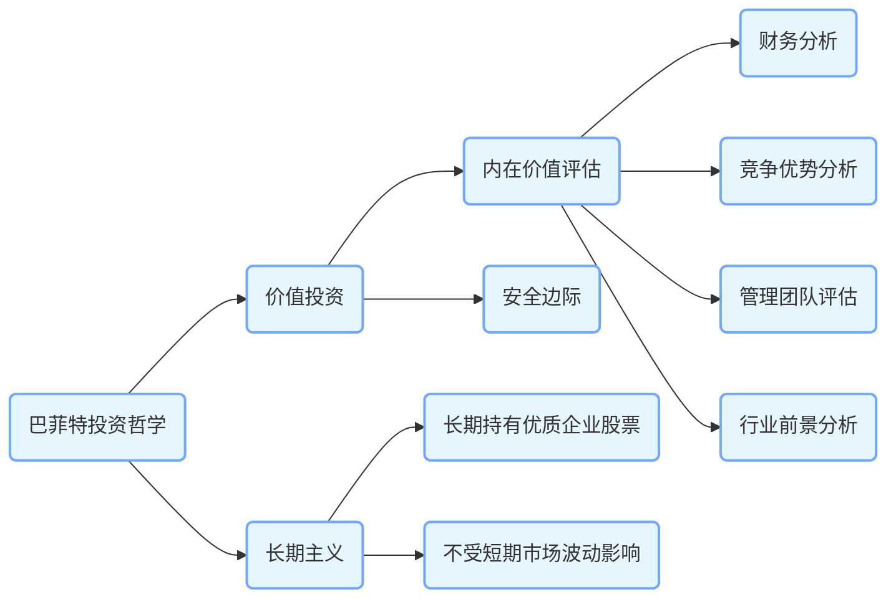

# 巴菲特的简单投资哲学：复杂中寻找简单

> 关键词：巴菲特、投资哲学、简单原则、价值投资、长期主义、市场波动、财务分析

> 摘要：本文深入探讨了巴菲特的简单投资哲学，即在复杂的金融市场中寻找简单有效的投资方法。通过对巴菲特投资理念的背景介绍，剖析其核心概念与联系，阐述核心算法原理及具体操作步骤，运用数学模型和公式进行详细讲解与举例说明。结合项目实战案例，分析其在实际应用场景中的表现。同时，推荐相关的学习资源、开发工具框架以及论文著作。最后总结未来投资领域的发展趋势与挑战，并提供常见问题解答和扩展阅读参考资料，旨在帮助投资者理解和运用巴菲特的投资哲学，在复杂的市场环境中实现稳健的投资收益。

## 1. 背景介绍 
### 1.1 目的和范围
本文的目的在于全面解析巴菲特的投资哲学，揭示其在复杂金融市场中秉持简单原则的奥秘。通过深入研究巴菲特的投资理念、方法和实践案例，为投资者提供一套具有可操作性和借鉴意义的投资思路。范围涵盖巴菲特投资哲学的各个方面，包括核心概念、算法原理、数学模型、实际应用场景等，旨在让读者对巴菲特的投资哲学有一个系统而深入的理解。

### 1.2 预期读者
本文预期读者包括广大的投资者，无论是初入投资领域的新手，还是有一定经验的专业投资者，都能从本文中获得有价值的信息和启示。同时，金融从业者、经济学者以及对投资哲学感兴趣的人士也可作为本文的潜在读者。

### 1.3 文档结构概述
本文首先介绍巴菲特投资哲学的背景，包括目的、预期读者和文档结构概述等内容。接着阐述其核心概念与联系，通过文本示意图和 Mermaid 流程图进行直观展示。然后讲解核心算法原理和具体操作步骤，并结合 Python 源代码进行详细阐述。随后运用数学模型和公式进行深入分析，并举例说明。再通过项目实战案例，介绍开发环境搭建、源代码实现和代码解读。之后探讨实际应用场景，推荐相关的工具和资源。最后总结未来发展趋势与挑战，提供常见问题解答和扩展阅读参考资料。

### 1.4 术语表
#### 1.4.1 核心术语定义
- **价值投资**：一种基于对企业内在价值评估的投资策略，投资者通过分析企业的财务状况、竞争优势等因素，寻找被低估的股票进行投资。
- **长期主义**：指投资者秉持长期投资的理念，不被短期市场波动所影响，注重企业的长期发展和价值增长。
- **内在价值**：企业在其剩余寿命中所能产生的现金流量的折现值，是价值投资的核心概念之一。

#### 1.4.2 相关概念解释
- **安全边际**：指股票的市场价格低于其内在价值的部分，为投资者提供了一定的风险缓冲。
- **护城河**：指企业所拥有的可持续竞争优势，如同城堡周围的护城河一样，保护企业免受竞争对手的攻击。
- **市场先生**：巴菲特借用本杰明·格雷厄姆的概念，将市场比喻为一位情绪不稳定的“市场先生”，其报价有时过高，有时过低，投资者应利用市场先生的错误定价进行投资。

#### 1.4.3 缩略词列表
- **EPS**：每股收益（Earnings Per Share）
- **ROE**：净资产收益率（Return on Equity）
- **DCF**：现金流折现法（Discounted Cash Flow）

## 2. 核心概念与联系 

### 核心概念原理
巴菲特的投资哲学核心在于价值投资和长期主义。价值投资强调通过深入分析企业的基本面，评估其内在价值，寻找被市场低估的股票。长期主义则要求投资者具备耐心和定力，不被短期市场波动所左右，长期持有优质企业的股票，分享企业的成长和价值增长。

价值投资的关键在于对企业内在价值的准确评估。巴菲特认为，企业的内在价值是其未来现金流量的折现值。为了评估企业的内在价值，需要考虑多个因素，包括企业的财务状况、竞争优势、管理团队、行业前景等。通过对这些因素的综合分析，可以大致估算出企业的内在价值范围。

长期主义则是基于对企业长期发展的信心。巴菲特相信，优秀的企业具有强大的竞争优势和持续的盈利能力，在长期的发展过程中，其价值会不断增长。因此，投资者应该选择那些具有长期竞争优势的企业，并长期持有其股票，而不是频繁地买卖股票。

### 架构的文本示意图
```plaintext
巴菲特投资哲学
|-- 价值投资
|   |-- 内在价值评估
|   |   |-- 财务分析
|   |   |-- 竞争优势分析
|   |   |-- 管理团队评估
|   |   |-- 行业前景分析
|   |-- 安全边际
|-- 长期主义
|   |-- 长期持有优质企业股票
|   |-- 不受短期市场波动影响
```

### Mermaid 流程图


## 3. 核心算法原理 & 具体操作步骤 

### 核心算法原理
在巴菲特的投资哲学中，评估企业内在价值是核心环节。常用的方法是现金流折现法（DCF）。现金流折现法的基本原理是将企业未来的现金流量按照一定的折现率折现到当前时刻，从而得到企业的内在价值。

其数学公式为：

$$V = \sum_{t=1}^{n} \frac{CF_t}{(1 + r)^t}$$

其中，$V$ 表示企业的内在价值，$CF_t$ 表示第 $t$ 期的现金流量，$r$ 表示折现率，$n$ 表示预测的期数。

### 具体操作步骤

#### 步骤 1：预测未来现金流量
预测企业未来的现金流量是一个复杂的过程，需要考虑多个因素。一般可以采用以下方法：
- **历史数据分析法**：通过分析企业过去的财务报表，了解其现金流量的变化趋势，以此为基础预测未来的现金流量。
- **行业分析**：研究行业的发展趋势和前景，了解企业在行业中的地位和竞争优势，从而对企业未来的现金流量进行合理预测。
- **宏观经济分析**：考虑宏观经济环境的变化对企业现金流量的影响，如经济增长、通货膨胀、利率等因素。

#### 步骤 2：确定折现率
折现率反映了投资者对投资回报的要求和对风险的评估。一般可以采用以下方法确定折现率：
- **资本资产定价模型（CAPM）**：根据市场风险溢价、无风险利率和企业的贝塔系数来计算折现率。
- **加权平均资本成本（WACC）**：考虑企业的债务成本和股权成本，计算加权平均资本成本作为折现率。

#### 步骤 3：计算内在价值
将预测的未来现金流量按照确定的折现率折现到当前时刻，得到企业的内在价值。

### Python 源代码实现
```python
import numpy as np

def dcf_valuation(cash_flows, discount_rate):
    """
    计算企业的内在价值
    :param cash_flows: 未来现金流量列表
    :param discount_rate: 折现率
    :return: 企业的内在价值
    """
    n = len(cash_flows)
    present_values = []
    for t in range(n):
        present_value = cash_flows[t] / (1 + discount_rate) ** (t + 1)
        present_values.append(present_value)
    intrinsic_value = np.sum(present_values)
    return intrinsic_value

# 示例数据
cash_flows = [100, 120, 150, 180, 200]
discount_rate = 0.1

# 计算内在价值
intrinsic_value = dcf_valuation(cash_flows, discount_rate)
print(f"企业的内在价值为: {intrinsic_value}")
```

### 代码解释
- `dcf_valuation` 函数接受两个参数：`cash_flows` 表示未来现金流量列表，`discount_rate` 表示折现率。
- 在函数内部，通过循环计算每一期现金流量的现值，并将其添加到 `present_values` 列表中。
- 最后，使用 `np.sum` 函数计算所有现值的总和，得到企业的内在价值。

## 4. 数学模型和公式 & 详细讲解 & 举例说明 

### 数学模型和公式
#### 现金流折现法（DCF）
$$V = \sum_{t=1}^{n} \frac{CF_t}{(1 + r)^t}$$

其中，$V$ 表示企业的内在价值，$CF_t$ 表示第 $t$ 期的现金流量，$r$ 表示折现率，$n$ 表示预测的期数。

#### 资本资产定价模型（CAPM）
$$r_i = r_f + \beta_i (r_m - r_f)$$

其中，$r_i$ 表示第 $i$ 种资产的预期收益率，$r_f$ 表示无风险利率，$\beta_i$ 表示第 $i$ 种资产的贝塔系数，$r_m$ 表示市场组合的预期收益率。

#### 加权平均资本成本（WACC）
$$WACC = w_d r_d (1 - T) + w_e r_e$$

其中，$WACC$ 表示加权平均资本成本，$w_d$ 表示债务权重，$r_d$ 表示债务成本，$T$ 表示所得税税率，$w_e$ 表示股权权重，$r_e$ 表示股权成本。

### 详细讲解
#### 现金流折现法（DCF）
现金流折现法是一种基于未来现金流量的估值方法，其核心思想是将企业未来的现金流量折现到当前时刻，以反映其真实价值。在使用 DCF 方法时，需要注意以下几点：
- **现金流量的预测**：现金流量的预测是 DCF 方法的关键，需要综合考虑企业的历史数据、行业前景、宏观经济环境等因素。预测的准确性直接影响到估值的准确性。
- **折现率的确定**：折现率反映了投资者对投资回报的要求和对风险的评估。折现率的选择需要考虑市场利率、企业的风险水平等因素。

#### 资本资产定价模型（CAPM）
资本资产定价模型是一种用于计算资产预期收益率的模型，其核心思想是资产的预期收益率与其系统性风险（贝塔系数）成正比。在使用 CAPM 模型时，需要注意以下几点：
- **无风险利率的选择**：无风险利率一般选择国债收益率作为代表。
- **市场组合的预期收益率**：市场组合的预期收益率可以通过历史数据或专业机构的预测来确定。
- **贝塔系数的计算**：贝塔系数反映了资产的系统性风险，可以通过回归分析等方法来计算。

#### 加权平均资本成本（WACC）
加权平均资本成本是企业融资成本的综合反映，其核心思想是考虑企业的债务成本和股权成本，计算加权平均资本成本作为企业的融资成本。在使用 WACC 模型时，需要注意以下几点：
- **债务权重和股权权重的确定**：债务权重和股权权重可以根据企业的资产负债表来确定。
- **债务成本和股权成本的计算**：债务成本可以根据企业的贷款利率来确定，股权成本可以使用 CAPM 模型等方法来计算。

### 举例说明
假设某企业未来 5 年的现金流量分别为 100 万元、120 万元、150 万元、180 万元和 200 万元，折现率为 10%。则该企业的内在价值为：

$$V = \frac{100}{(1 + 0.1)^1} + \frac{120}{(1 + 0.1)^2} + \frac{150}{(1 + 0.1)^3} + \frac{180}{(1 + 0.1)^4} + \frac{200}{(1 + 0.1)^5}$$

$$V \approx 90.91 + 99.17 + 112.70 + 122.94 + 124.18 = 549.90$$（万元）

假设无风险利率为 3%，市场组合的预期收益率为 10%，某股票的贝塔系数为 1.2。则该股票的预期收益率为：

$$r_i = 3\% + 1.2 \times (10\% - 3\%) = 3\% + 8.4\% = 11.4\%$$

假设某企业的债务权重为 40%，债务成本为 5%，所得税税率为 25%，股权权重为 60%，股权成本为 12%。则该企业的加权平均资本成本为：

$$WACC = 40\% \times 5\% \times (1 - 25\%) + 60\% \times 12\% = 1.5\% + 7.2\% = 8.7\%$$

## 5. 项目实战：代码实际案例和详细解释说明 

### 5.1  开发环境搭建
在进行项目实战之前，需要搭建相应的开发环境。以下是具体的步骤：

#### 安装 Python
首先，需要安装 Python 解释器。可以从 Python 官方网站（https://www.python.org/downloads/） 下载适合自己操作系统的 Python 版本，并按照安装向导进行安装。

#### 安装必要的库
在 Python 环境中，需要安装一些必要的库，如 `numpy`、`pandas` 等。可以使用 `pip` 命令进行安装：

```sh
pip install numpy pandas
```

#### 选择开发工具
可以选择自己喜欢的开发工具，如 PyCharm、Jupyter Notebook 等。这里以 Jupyter Notebook 为例，安装方法如下：

```sh
pip install jupyter notebook
```

安装完成后，可以在命令行中输入以下命令启动 Jupyter Notebook：

```sh
jupyter notebook
```

### 5.2  源代码详细实现和代码解读
以下是一个完整的项目实战案例，用于评估某企业的内在价值。

```python
import numpy as np
import pandas as pd

# 定义预测未来现金流量的函数
def predict_cash_flows(historical_data, growth_rate, n_years):
    """
    预测未来现金流量
    :param historical_data: 历史现金流量数据
    :param growth_rate: 增长率
    :param n_years: 预测的年数
    :return: 未来现金流量列表
    """
    last_cash_flow = historical_data[-1]
    cash_flows = []
    for i in range(n_years):
        cash_flow = last_cash_flow * (1 + growth_rate) ** (i + 1)
        cash_flows.append(cash_flow)
    return cash_flows

# 定义计算内在价值的函数
def dcf_valuation(cash_flows, discount_rate):
    """
    计算企业的内在价值
    :param cash_flows: 未来现金流量列表
    :param discount_rate: 折现率
    :return: 企业的内在价值
    """
    n = len(cash_flows)
    present_values = []
    for t in range(n):
        present_value = cash_flows[t] / (1 + discount_rate) ** (t + 1)
        present_values.append(present_value)
    intrinsic_value = np.sum(present_values)
    return intrinsic_value

# 示例数据
historical_data = [80, 90, 100]
growth_rate = 0.1
n_years = 5
discount_rate = 0.1

# 预测未来现金流量
cash_flows = predict_cash_flows(historical_data, growth_rate, n_years)

# 计算内在价值
intrinsic_value = dcf_valuation(cash_flows, discount_rate)

# 输出结果
print(f"预测的未来现金流量: {cash_flows}")
print(f"企业的内在价值: {intrinsic_value}")
```

### 5.3  代码解读与分析
- **`predict_cash_flows` 函数**：该函数接受历史现金流量数据、增长率和预测的年数作为参数，通过简单的增长模型预测未来的现金流量。具体实现是根据历史数据的最后一个现金流量，按照给定的增长率逐年计算未来的现金流量。
- **`dcf_valuation` 函数**：该函数接受未来现金流量列表和折现率作为参数，使用现金流折现法计算企业的内在价值。具体实现是将每一期的现金流量按照折现率折现到当前时刻，然后求和得到企业的内在价值。
- **主程序**：首先定义了示例数据，包括历史现金流量数据、增长率、预测的年数和折现率。然后调用 `predict_cash_flows` 函数预测未来现金流量，再调用 `dcf_valuation` 函数计算企业的内在价值。最后输出预测的未来现金流量和企业的内在价值。

## 6. 实际应用场景 
巴菲特的投资哲学在实际投资中有广泛的应用场景，以下是一些常见的应用场景：

### 股票投资
在股票投资中，投资者可以运用巴菲特的价值投资理念，通过分析企业的基本面，评估其内在价值，寻找被市场低估的股票进行投资。例如，巴菲特在投资可口可乐公司时，通过深入研究可口可乐的品牌价值、市场份额、财务状况等因素，认为可口可乐具有强大的竞争优势和持续的盈利能力，其内在价值被市场低估，于是大量买入可口可乐的股票，并长期持有，获得了丰厚的回报。

### 基金投资
在基金投资中，投资者可以选择那些遵循价值投资理念的基金进行投资。这些基金通常会选择具有长期竞争优势和良好财务状况的企业进行投资，通过长期持有来实现资产的增值。例如，一些价值型基金经理会借鉴巴菲特的投资哲学，注重企业的内在价值和长期发展，为投资者带来稳定的回报。

### 企业并购
在企业并购中，收购方可以运用巴菲特的投资哲学，对目标企业进行深入的分析和评估，确定其内在价值，从而制定合理的并购价格。例如，在并购过程中，收购方会关注目标企业的财务状况、竞争优势、管理团队等因素，评估其未来的发展潜力和现金流量，以此来确定目标企业的内在价值，并在合理的价格范围内进行并购。

### 个人资产配置
在个人资产配置中，投资者可以根据巴菲特的投资哲学，合理分配资产，选择优质的投资标的进行长期投资。例如，投资者可以将一部分资产投资于股票市场，选择那些具有长期竞争优势和良好财务状况的企业进行投资；将一部分资产投资于债券市场，以获取稳定的收益；将一部分资产投资于房地产市场，以实现资产的保值增值。

## 7. 工具和资源推荐
### 7.1 学习资源推荐
#### 7.1.1 书籍推荐
- 《聪明的投资者》（The Intelligent Investor）：本杰明·格雷厄姆著，这本书是价值投资的经典之作，被誉为投资界的“圣经”，巴菲特称这本书是他投资生涯的启蒙读物。
- 《巴菲特致股东的信：股份公司教程》（Letters to Shareholders of Berkshire Hathaway）：沃伦·巴菲特著，这本书收录了巴菲特多年来致股东的信，通过这些信件，读者可以深入了解巴菲特的投资理念、方法和决策过程。
- 《穷查理宝典：查理·芒格的智慧箴言录》（Poor Charlie's Almanack: The Wit and Wisdom of Charles T. Munger）：彼得·考夫曼编著，这本书介绍了巴菲特的合作伙伴查理·芒格的投资理念和智慧，对于理解巴菲特的投资哲学具有重要的参考价值。

#### 7.1.2 在线课程
- Coursera 上的“投资学原理”（Principles of Investing）：该课程由知名教授授课，系统地介绍了投资学的基本原理和方法，包括价值投资、资产定价等内容。
- edX 上的“金融市场”（Financial Markets）：该课程由耶鲁大学教授罗伯特·席勒授课，深入探讨了金融市场的运行机制和投资策略，对于理解巴菲特的投资哲学具有重要的帮助。

#### 7.1.3 技术博客和网站
- 雪球网（https://xueqiu.com/）：雪球网是一个投资交流社区，提供了丰富的投资资讯、研究报告和投资者交流平台，投资者可以在这里学习到其他投资者的经验和见解。
- 价值投资网（https://www.valueinvestorsclub.com/）：价值投资网是一个专注于价值投资的网站，提供了大量的价值投资案例、研究报告和投资分析工具，对于学习巴菲特的投资哲学具有重要的参考价值。

### 7.2 开发工具框架推荐
#### 7.2.1 IDE和编辑器
- PyCharm：PyCharm 是一款专门为 Python 开发设计的集成开发环境（IDE），具有强大的代码编辑、调试、自动补全、代码分析等功能，适合用于开发投资分析相关的 Python 程序。
- Jupyter Notebook：Jupyter Notebook 是一个交互式的开发环境，支持多种编程语言，如 Python、R 等。它可以将代码、文本、图表等内容整合在一起，方便进行数据分析和可视化展示，适合用于投资分析的实验和研究。

#### 7.2.2 调试和性能分析工具
- PDB：PDB 是 Python 自带的调试工具，可以帮助开发者在程序运行过程中进行调试，查看变量的值、执行流程等信息，方便发现和解决程序中的问题。
- cProfile：cProfile 是 Python 自带的性能分析工具，可以帮助开发者分析程序的性能瓶颈，找出程序中运行时间较长的代码段，从而进行优化。

#### 7.2.3 相关框架和库
- NumPy：NumPy 是 Python 中用于科学计算的基础库，提供了高效的数组操作和数学函数，适合用于投资分析中的数据处理和计算。
- Pandas：Pandas 是 Python 中用于数据分析的库，提供了高效的数据结构和数据处理工具，适合用于投资分析中的数据清洗、整理和分析。
- Matplotlib：Matplotlib 是 Python 中用于数据可视化的库，提供了丰富的绘图函数和工具，适合用于投资分析中的数据可视化展示。

### 7.3 相关论文著作推荐
#### 7.3.1 经典论文
- 《证券分析》（Security Analysis）：本杰明·格雷厄姆和戴维·多德著，这篇论文是价值投资理论的奠基之作，提出了价值投资的基本原理和方法，对后世的投资理论和实践产生了深远的影响。
- 《有效市场假说》（Efficient Markets Hypothesis）：尤金·法玛著，这篇论文提出了有效市场假说，认为市场是有效的，股票价格已经反映了所有可用的信息，投资者无法通过分析基本面来获得超额收益。虽然该假说与巴菲特的价值投资理念存在一定的争议，但对于理解市场的运行机制具有重要的参考价值。

#### 7.3.2 最新研究成果
- 《行为金融学》（Behavioral Finance）：理查德·泰勒等著，行为金融学是近年来兴起的一个研究领域，它结合了心理学和金融学的知识，研究投资者的行为和决策过程。最新的研究成果表明，投资者的行为往往受到心理因素的影响，存在非理性行为，这为价值投资提供了新的理论支持。
- 《量化投资》（Quantitative Investment）：近年来，量化投资逐渐成为投资领域的热门话题。量化投资通过运用数学模型和计算机算法，对大量的历史数据进行分析和挖掘，寻找投资机会。最新的研究成果表明，量化投资可以与价值投资相结合，提高投资决策的准确性和效率。

#### 7.3.3 应用案例分析
- 《巴菲特的投资组合》（The Warren Buffett Portfolio）：罗伯特·哈格斯特朗著，这本书通过分析巴菲特的投资组合，介绍了巴菲特的投资策略和决策过程，为投资者提供了实际的应用案例和参考。
- 《价值投资实战手册》（Value Investing: A Practitioner's Guide）：格林布雷特著，这本书结合了实际案例，详细介绍了价值投资的方法和技巧，对于投资者在实际投资中运用巴菲特的投资哲学具有重要的指导意义。

## 8. 总结：未来发展趋势与挑战
### 未来发展趋势
#### 科技与投资的融合
随着科技的不断发展，科技与投资的融合将越来越深入。例如，人工智能、大数据、区块链等技术将在投资领域得到广泛应用，为投资者提供更加精准的投资分析和决策支持。同时，科技的发展也将催生新的投资机会，如科技创新企业的投资等。

#### 可持续投资的兴起
随着社会对环境保护、社会责任和公司治理（ESG）的关注度不断提高，可持续投资将成为未来投资的重要趋势。投资者将更加注重企业的可持续发展能力，选择那些具有良好 ESG 表现的企业进行投资。巴菲特的投资哲学也将逐渐融入可持续投资的理念，更加关注企业的长期价值和社会影响。

#### 全球投资的一体化
随着经济全球化的不断推进，全球投资的一体化趋势将越来越明显。投资者将更加关注全球市场的投资机会，进行跨国投资和资产配置。巴菲特的投资哲学也将在全球范围内得到更广泛的传播和应用，为全球投资者提供借鉴和参考。

### 挑战
#### 市场的不确定性
金融市场具有高度的不确定性，受到宏观经济环境、政策变化、突发事件等多种因素的影响。投资者很难准确预测市场的走势和企业的未来发展，这给巴菲特的投资哲学带来了一定的挑战。例如，在市场出现剧烈波动时，投资者很难保持冷静和理性，容易受到市场情绪的影响。

#### 信息的不对称性
在金融市场中，信息的不对称性是普遍存在的。企业内部人员往往掌握着更多的信息，而投资者很难获取到全面、准确的信息。这给投资者评估企业的内在价值带来了一定的困难，也增加了投资的风险。例如，一些企业可能会通过财务造假等手段来误导投资者。

#### 竞争的加剧
随着投资市场的不断发展，竞争也越来越激烈。越来越多的投资者开始采用价值投资的理念和方法，寻找被市场低估的股票。这使得市场上的优质投资标的越来越少，投资难度也越来越大。例如，一些热门的股票往往会被市场高估，投资者很难找到真正具有投资价值的股票。

## 9. 附录：常见问题与解答
### 问题 1：巴菲特的投资哲学适用于所有投资者吗？
解答：巴菲特的投资哲学具有一定的普遍性和借鉴意义，但并不适用于所有投资者。巴菲特的投资哲学强调长期投资和价值投资，需要投资者具备一定的耐心、定力和专业知识。对于一些短期投资者或缺乏专业知识的投资者来说，可能难以完全遵循巴菲特的投资哲学。此外，投资者的风险承受能力、投资目标和投资经验等因素也会影响其是否适合采用巴菲特的投资哲学。

### 问题 2：如何评估企业的内在价值？
解答：评估企业的内在价值是一个复杂的过程，需要综合考虑多个因素。常用的方法包括现金流折现法（DCF）、相对估值法等。现金流折现法是通过预测企业未来的现金流量，并将其折现到当前时刻来计算企业的内在价值。相对估值法是通过比较企业与同行业其他企业的估值指标，如市盈率、市净率等，来评估企业的价值。在评估企业的内在价值时，还需要考虑企业的财务状况、竞争优势、管理团队、行业前景等因素。

### 问题 3：如何应对市场的波动？
解答：市场的波动是不可避免的，投资者可以通过以下方法来应对市场的波动：
- **保持冷静和理性**：在市场出现波动时，投资者要保持冷静和理性，不要被市场情绪所左右。要相信优质企业的长期价值，不要因为短期的市场波动而轻易卖出股票。
- **分散投资**：通过分散投资，可以降低单一股票或行业的风险。投资者可以将资产分散投资于不同的股票、行业和资产类别，以减少市场波动对投资组合的影响。
- **定期评估和调整投资组合**：投资者要定期评估自己的投资组合，根据市场情况和企业的基本面变化，适时调整投资组合，以保持投资组合的合理性和稳定性。

### 问题 4：巴菲特的投资哲学在新兴市场是否适用？
解答：巴菲特的投资哲学在新兴市场仍然具有一定的适用性，但也需要根据新兴市场的特点进行适当的调整。新兴市场通常具有较高的经济增长率和发展潜力，但也存在市场不成熟、信息不透明、政策不稳定等问题。在新兴市场应用巴菲特的投资哲学时，投资者需要更加注重对企业基本面的研究和分析，同时要关注政策变化和市场风险。此外，新兴市场的投资机会也更加多样化，投资者可以结合新兴市场的特点，寻找具有投资价值的企业进行投资。

## 10. 扩展阅读 & 参考资料
### 扩展阅读
- 《投资最重要的事》（The Most Important Thing Illuminated: Uncommon Sense for the Thoughtful Investor）：霍华德·马克斯著，这本书介绍了投资中最重要的原则和方法，对于理解巴菲特的投资哲学具有重要的参考价值。
- 《金融炼金术》（The Alchemy of Finance）：乔治·索罗斯著，这本书介绍了索罗斯的投资理念和方法，与巴菲特的投资哲学形成了鲜明的对比，读者可以通过对比学习，更好地理解不同的投资理念和方法。

### 参考资料
- 沃伦·巴菲特官方网站（https://www.berkshirehathaway.com/）：该网站提供了巴菲特的致股东信、公司年报等重要资料，是了解巴菲特投资哲学的重要来源。
- 金融数据提供商，如 Wind、Bloomberg 等：这些金融数据提供商提供了丰富的金融数据和研究报告，对于投资者进行投资分析和决策具有重要的帮助。