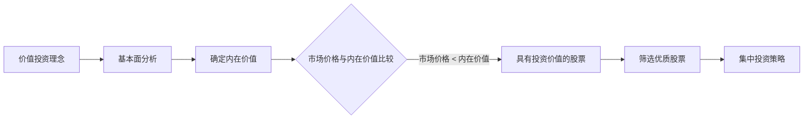

# 巴菲特的集中投资策略：利弊分析

> 关键词：巴菲特、集中投资策略、利弊分析、价值投资、风险、收益

> 摘要：本文深入探讨了巴菲特的集中投资策略，详细阐述了该策略的核心概念、算法原理、数学模型等内容。通过项目实战案例分析了其在实际操作中的具体应用，探讨了其在不同场景下的实际应用价值。同时，全面分析了集中投资策略的利弊，为投资者提供了全面的参考。最后，对该策略的未来发展趋势与挑战进行了总结，并对常见问题进行了解答，还提供了丰富的扩展阅读和参考资料。

## 1. 背景介绍 
### 1.1 目的和范围
本文章的目的在于全面、深入地分析巴菲特的集中投资策略的利弊。通过对该策略的原理、实际应用等多方面的研究，为投资者提供一个客观、全面的视角，帮助他们更好地理解这一策略，在投资决策中做出更明智的选择。范围涵盖集中投资策略的理论基础、实际操作案例、应用场景以及与其他投资策略的比较等。

### 1.2 预期读者
本文预期读者包括对投资领域感兴趣的普通投资者、专业的金融从业者、金融专业的学生以及对巴菲特投资理念有深入研究需求的人群。无论是初涉投资领域希望学习投资知识的新手，还是希望深入研究投资策略的专业人士，都能从本文中获得有价值的信息。

### 1.3 文档结构概述
本文首先介绍集中投资策略的背景信息，包括目的、预期读者和文档结构概述等。接着阐述核心概念与联系，通过文本示意图和 Mermaid 流程图展示其原理和架构。然后讲解核心算法原理和具体操作步骤，并给出相应的 Python 源代码。之后介绍数学模型和公式，结合具体例子进行详细讲解。再通过项目实战案例，展示代码的实际实现和解读。随后探讨该策略的实际应用场景。接着推荐相关的工具和资源，包括学习资源、开发工具框架和相关论文著作。最后总结未来发展趋势与挑战，解答常见问题，并提供扩展阅读和参考资料。

### 1.4 术语表
#### 1.4.1 核心术语定义
- **集中投资策略**：指投资者将大部分资金集中投资于少数经过深入研究和筛选的优质股票，而不是分散投资于众多股票的一种投资策略。
- **价值投资**：一种基于对股票内在价值的评估，寻找被市场低估的股票进行投资的理念和方法。

#### 1.4.2 相关概念解释
- **安全边际**：在价值投资中，安全边际是指股票的市场价格低于其内在价值的部分。这是一种保护投资者免受市场波动和错误估值影响的缓冲机制。
- **内在价值**：股票所代表的公司的真实价值，通常通过对公司的财务状况、经营业绩、行业前景等多方面因素进行综合分析和评估得出。

#### 1.4.3 缩略词列表
- **PEG**：市盈率相对盈利增长比率（Price/Earnings to Growth Ratio），用于衡量股票的估值是否合理，综合考虑了公司的市盈率和盈利增长率。

## 2. 核心概念与联系 
巴菲特的集中投资策略与价值投资理念紧密相连。价值投资强调寻找被市场低估的股票，而集中投资策略则是在价值投资的基础上，将资金集中投入到这些被认为具有高潜力的少数股票上。

### 文本示意图
集中投资策略以价值投资为基石。价值投资通过对公司的基本面分析，确定股票的内在价值。当发现股票的市场价格低于其内在价值时，认为该股票具有投资价值。集中投资策略则是在众多具有投资价值的股票中，挑选出少数最优质、最有潜力的股票，将大部分资金集中投资于这些股票。

### Mermaid 流程图


## 3. 核心算法原理 & 具体操作步骤 
### 核心算法原理
集中投资策略的核心在于对股票的筛选和资金的分配。首先，通过对公司的财务报表、行业前景、管理层能力等多方面进行深入分析，确定股票的内在价值。然后，比较股票的市场价格与内在价值，选择被低估的股票。最后，将大部分资金集中投资于这些被选中的少数股票。

### 具体操作步骤
1. **公司基本面分析**：收集公司的财务报表，包括资产负债表、利润表和现金流量表，分析公司的盈利能力、偿债能力、运营能力等指标。同时，研究公司所处的行业前景，了解行业的发展趋势、竞争格局等。
2. **确定内在价值**：可以使用多种方法来确定股票的内在价值，如现金流折现法（DCF）、相对估值法等。
3. **筛选股票**：根据内在价值和市场价格的比较，筛选出被低估的股票。同时，考虑公司的竞争优势、管理层素质等因素，进一步筛选出少数优质股票。
4. **资金分配**：将大部分资金集中投资于这些被选中的少数股票，一般来说，巴菲特的集中投资组合中股票数量较少，通常在 5 - 10 只左右。

### Python 源代码阐述
```python
import pandas as pd
import numpy as np

# 假设我们有一个包含公司财务数据和市场价格的数据集
# 这里简单模拟一个数据集
data = {
    'company': ['A', 'B', 'C', 'D', 'E'],
    'earnings_per_share': [2, 3, 1, 4, 2.5],
    'book_value_per_share': [10, 15, 8, 20, 12],
    'market_price': [15, 20, 10, 30, 18]
}
df = pd.DataFrame(data)

# 计算市盈率（PE）和市净率（PB）
df['PE'] = df['market_price'] / df['earnings_per_share']
df['PB'] = df['market_price'] / df['book_value_per_share']

# 假设我们使用简单的相对估值法，设定 PE 和 PB 的合理范围
pe_threshold = 15
pb_threshold = 2

# 筛选被低估的股票
undervalued_stocks = df[(df['PE'] < pe_threshold) & (df['PB'] < pb_threshold)]

# 模拟资金分配
total_funds = 100000
num_stocks = len(undervalued_stocks)
funds_per_stock = total_funds / num_stocks

# 输出结果
print("被低估的股票：")
print(undervalued_stocks)
print(f"每只股票的投资金额：{funds_per_stock}")
```
这段代码首先模拟了一个包含公司财务数据和市场价格的数据集，然后计算了市盈率和市净率。接着，根据设定的合理范围筛选出被低估的股票。最后，模拟了资金的分配，将总资金平均分配到每只被选中的股票上。

## 4. 数学模型和公式 & 详细讲解 & 举例说明 
### 现金流折现法（DCF）
现金流折现法是确定股票内在价值的一种常用方法。其基本原理是将公司未来的现金流折现到当前，以确定公司的内在价值。

#### 数学公式
$$V = \sum_{t=1}^{n} \frac{CF_t}{(1 + r)^t} + \frac{TV}{(1 + r)^n}$$
其中：
- $V$ 表示公司的内在价值
- $CF_t$ 表示第 $t$ 期的现金流
- $r$ 表示折现率
- $n$ 表示预测期数
- $TV$ 表示终值

#### 详细讲解
1. **现金流预测**：需要对公司未来的现金流进行预测。这通常需要考虑公司的历史业绩、行业前景、市场竞争等因素。
2. **折现率选择**：折现率反映了投资者对投资的风险要求。一般来说，可以使用资本资产定价模型（CAPM）来确定折现率。
3. **终值计算**：终值是指预测期结束后公司的价值。可以使用多种方法来计算终值，如永续增长模型等。

#### 举例说明
假设一家公司未来 5 年的现金流分别为 100 万元、120 万元、130 万元、140 万元和 150 万元，预测期结束后的终值为 1000 万元，折现率为 10%。则该公司的内在价值为：
$$V = \frac{100}{(1 + 0.1)^1} + \frac{120}{(1 + 0.1)^2} + \frac{130}{(1 + 0.1)^3} + \frac{140}{(1 + 0.1)^4} + \frac{150}{(1 + 0.1)^5} + \frac{1000}{(1 + 0.1)^5}$$
```python
import numpy as np

cash_flows = [100, 120, 130, 140, 150]
terminal_value = 1000
discount_rate = 0.1
n = len(cash_flows)

present_values = []
for t in range(1, n + 1):
    present_values.append(cash_flows[t - 1] / (1 + discount_rate) ** t)
present_values.append(terminal_value / (1 + discount_rate) ** n)

intrinsic_value = np.sum(present_values)
print(f"公司的内在价值：{intrinsic_value} 万元")
```

### 相对估值法
相对估值法是通过比较公司与同行业其他公司的估值指标来确定公司的价值。常用的估值指标包括市盈率（PE）、市净率（PB）等。

#### 数学公式
- **市盈率法**：$V = EPS \times PE_{industry}$
其中：
- $V$ 表示公司的价值
- $EPS$ 表示每股收益
- $PE_{industry}$ 表示行业平均市盈率

- **市净率法**：$V = BVPS \times PB_{industry}$
其中：
- $V$ 表示公司的价值
- $BVPS$ 表示每股净资产
- $PB_{industry}$ 表示行业平均市净率

#### 详细讲解
1. **选择可比公司**：需要选择与目标公司在业务、规模、财务状况等方面相似的同行业公司作为可比公司。
2. **计算估值指标**：计算可比公司的平均市盈率、市净率等估值指标。
3. **确定公司价值**：根据目标公司的每股收益或每股净资产，以及行业平均估值指标，计算目标公司的价值。

#### 举例说明
假设一家公司的每股收益为 2 元，行业平均市盈率为 15。则该公司的价值为：
$$V = 2 \times 15 = 30$$（元/股）

## 5. 项目实战：代码实际案例和详细解释说明 
### 5.1  开发环境搭建
- **操作系统**：可以选择 Windows、Linux 或 macOS 等操作系统。
- **编程语言**：Python，建议使用 Python 3.7 及以上版本。
- **开发工具**：可以使用 PyCharm、Jupyter Notebook 等开发工具。
- **库和框架**：需要安装 pandas、numpy 等常用库。可以使用以下命令进行安装：
```sh
pip install pandas numpy
```

### 5.2  源代码详细实现和代码解读
```python
import pandas as pd
import numpy as np
import yfinance as yf

# 定义要分析的股票列表
stock_list = ['AAPL', 'MSFT', 'GOOG', 'AMZN', 'FB']

# 获取股票数据
start_date = '2020-01-01'
end_date = '2021-01-01'
data = yf.download(stock_list, start=start_date, end=end_date)['AdjClose']

# 计算股票的收益率
returns = data.pct_change().dropna()

# 计算每只股票的平均收益率和标准差
mean_returns = returns.mean()
std_returns = returns.std()

# 假设总资金为 100000 元，平均分配到每只股票
total_funds = 100000
num_stocks = len(stock_list)
funds_per_stock = total_funds / num_stocks

# 计算投资组合的收益率和标准差
weights = np.ones(num_stocks) / num_stocks
portfolio_return = np.sum(mean_returns * weights)
portfolio_std = np.sqrt(np.dot(weights.T, np.dot(returns.cov(), weights)))

# 输出结果
print("每只股票的平均收益率：")
print(mean_returns)
print("每只股票的标准差：")
print(std_returns)
print(f"投资组合的收益率：{portfolio_return}")
print(f"投资组合的标准差：{portfolio_std}")
```
### 代码解读与分析
1. **数据获取**：使用 `yfinance` 库从雅虎财经获取指定股票在指定时间段内的调整收盘价数据。
2. **收益率计算**：计算每只股票的日收益率，并去除缺失值。
3. **统计指标计算**：计算每只股票的平均收益率和标准差，以衡量股票的收益和风险。
4. **资金分配**：假设总资金为 100000 元，平均分配到每只股票。
5. **投资组合计算**：计算投资组合的收益率和标准差，以评估投资组合的绩效。

通过这个项目实战案例，我们可以看到如何使用 Python 实现集中投资策略的基本操作，包括数据获取、收益率计算、资金分配和投资组合评估等。

## 6. 实际应用场景 
### 长期投资
巴菲特的集中投资策略非常适合长期投资。通过深入研究和筛选优质股票，将资金集中投资于这些股票，可以充分享受公司成长带来的收益。长期来看，优质公司的业绩通常会持续增长，股票价格也会随之上涨。

### 价值投资理念践行
对于秉持价值投资理念的投资者来说，集中投资策略是一种有效的实践方式。通过寻找被市场低估的股票，并集中投资于这些股票，可以在市场发现股票的真实价值时获得超额收益。

### 专业投资者应用
专业投资者通常具有更深入的研究能力和更丰富的投资经验，他们可以更好地运用集中投资策略。通过对行业和公司的深入了解，他们可以挑选出更具潜力的股票，并合理分配资金，以实现更高的收益。

## 7. 工具和资源推荐
### 7.1 学习资源推荐
#### 7.1.1 书籍推荐
- 《聪明的投资者》（The Intelligent Investor）：本杰明·格雷厄姆（Benjamin Graham）的经典著作，是价值投资领域的奠基之作，对巴菲特的投资理念产生了深远影响。
- 《巴菲特致股东的信》（Letters to Shareholders）：收录了巴菲特历年致股东的信，通过这些信件可以深入了解巴菲特的投资思想和决策过程。
- 《怎样选择成长股》（Common Stocks and Uncommon Profits）：菲利普·费雪（Philip Fisher）的著作，介绍了寻找成长股的方法和技巧，对巴菲特的投资策略有重要影响。

#### 7.1.2 在线课程
- Coursera 上的“投资学原理”（Principles of Investing）课程：由知名教授授课，系统介绍了投资学的基本原理和方法。
- edX 上的“价值投资基础”（Foundations of Value Investing）课程：专注于价值投资的理论和实践，适合对价值投资感兴趣的学习者。

#### 7.1.3 技术博客和网站
- 雪球网（xueqiu.com）：国内知名的投资交流社区，提供丰富的股票分析、投资策略分享等内容。
- Seeking Alpha（seekingalpha.com）：国外的投资研究网站，有众多专业投资者和分析师分享的投资观点和研究报告。

### 7.2 开发工具框架推荐
#### 7.2.1 IDE和编辑器
- PyCharm：功能强大的 Python 集成开发环境，提供代码编辑、调试、版本控制等多种功能。
- Jupyter Notebook：交互式的开发环境，适合进行数据分析和可视化，方便展示代码和结果。

#### 7.2.2 调试和性能分析工具
- PDB：Python 自带的调试器，可以帮助开发者定位代码中的问题。
- cProfile：Python 标准库中的性能分析工具，可以分析代码的执行时间和调用关系。

#### 7.2.3 相关框架和库
- pandas：强大的数据处理和分析库，提供了丰富的数据结构和数据操作方法。
- numpy：用于科学计算的基础库，提供了高效的数组操作和数学函数。
- yfinance：用于获取雅虎财经股票数据的库，方便进行股票数据分析。

### 7.3 相关论文著作推荐
#### 7.3.1 经典论文
- 《证券分析》（Security Analysis）：本杰明·格雷厄姆和戴维·多德（David Dodd）的经典论文，奠定了价值投资的理论基础。
- 《有效资本市场：理论与实证研究回顾》（Efficient Capital Markets: A Review of Theory and Empirical Work）：尤金·法玛（Eugene F. Fama）的论文，对有效市场假说进行了系统阐述。

#### 7.3.2 最新研究成果
- 定期关注《金融研究》《经济研究》等国内外知名金融学术期刊，了解集中投资策略和价值投资领域的最新研究成果。

#### 7.3.3 应用案例分析
- 可以参考一些知名投资机构的研究报告和案例分析，了解集中投资策略在实际应用中的效果和经验教训。

## 8. 总结：未来发展趋势与挑战
### 未来发展趋势
- **数字化和智能化**：随着科技的不断发展，投资领域也将越来越数字化和智能化。投资者可以利用大数据、人工智能等技术，更高效地进行股票筛选和分析，提高集中投资策略的效果。
- **全球化投资**：全球经济一体化的趋势不断加强，投资者将有更多的机会进行全球化投资。集中投资策略可以帮助投资者在全球范围内寻找优质的投资标的，实现资产的多元化配置。
- **社会责任投资**：越来越多的投资者开始关注企业的社会责任和可持续发展。未来，集中投资策略可能会更多地考虑企业的社会责任因素，选择具有良好社会形象和可持续发展能力的企业进行投资。

### 挑战
- **市场波动风险**：集中投资策略将大部分资金集中于少数股票，一旦这些股票的价格出现大幅波动，投资者的损失也会比较大。市场的不确定性和波动性是集中投资策略面临的主要挑战之一。
- **信息不对称**：在投资过程中，投资者可能无法获取所有的信息，存在信息不对称的问题。这可能导致投资者对股票的价值判断出现偏差，从而影响投资决策的准确性。
- **行业竞争加剧**：随着投资市场的不断发展，竞争也越来越激烈。投资者需要不断提高自己的研究能力和分析水平，才能在众多的投资机会中挑选出真正具有潜力的股票。

## 9. 附录：常见问题与解答
### 1. 集中投资策略是否适合所有投资者？
集中投资策略并不适合所有投资者。该策略要求投资者具有较强的研究能力和风险承受能力。对于缺乏投资经验和研究能力的普通投资者来说，分散投资可能是更合适的选择。

### 2. 如何确定股票的内在价值？
确定股票的内在价值可以使用多种方法，如现金流折现法、相对估值法等。这些方法都需要对公司的财务状况、经营业绩、行业前景等多方面因素进行综合分析。

### 3. 集中投资策略的风险如何控制？
可以通过深入研究和筛选股票、合理分配资金、设置止损点等方法来控制集中投资策略的风险。同时，投资者还需要保持理性和冷静，避免盲目跟风和情绪化决策。

### 4. 集中投资策略与分散投资策略有什么区别？
集中投资策略将大部分资金集中于少数股票，以追求更高的收益；而分散投资策略则将资金分散投资于众多股票，以降低风险。两种策略各有优缺点，投资者需要根据自己的投资目标、风险承受能力等因素选择适合自己的策略。

## 10. 扩展阅读 & 参考资料
### 扩展阅读
- 《金融炼金术》（The Alchemy of Finance）：乔治·索罗斯（George Soros）的著作，介绍了他的投资哲学和方法。
- 《漫步华尔街》（A Random Walk Down Wall Street）：伯顿·马尔基尔（Burton G. Malkiel）的著作，对有效市场假说和投资策略进行了深入探讨。

### 参考资料
- 雅虎财经（finance.yahoo.com）：提供丰富的股票数据和财经新闻。
- 晨星网（morningstar.com）：专业的基金和股票评级机构，提供详细的投资分析和研究报告。
- 美国证券交易委员会（SEC）官网（sec.gov）：提供美国证券市场的法规、公告和公司披露信息等。