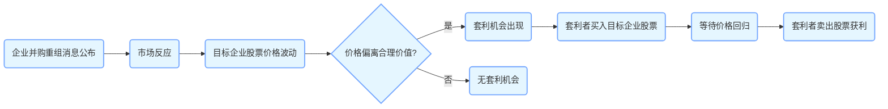

# 并购套利策略：从企业重组中获利

> 关键词：并购套利、企业重组、套利策略、风险评估、金融市场

> 摘要：本文围绕并购套利策略展开，深入探讨如何从企业重组中获利。首先介绍并购套利的背景知识，包括目的、预期读者、文档结构和相关术语。接着阐述核心概念与联系，分析核心算法原理及具体操作步骤，并给出相应的数学模型和公式。通过项目实战案例详细解释代码实现和分析。同时探讨并购套利在实际中的应用场景，推荐相关学习资源、开发工具框架以及论文著作。最后总结并购套利的未来发展趋势与挑战，提供常见问题解答和扩展阅读参考资料，旨在为读者全面呈现并购套利策略的全貌，助力其在企业重组的金融活动中把握获利机会。

## 1. 背景介绍 
### 1.1 目的和范围
并购套利策略旨在利用企业并购重组过程中出现的价格差异来获取利润。在金融市场中，企业的并购重组是常见的经济活动，由于市场信息的不完全对称、投资者情绪等多种因素，目标企业的股票价格往往会与并购交易价格存在偏离。本策略的目的就是通过合理分析和操作，捕捉这些价格差异带来的套利机会。

其范围涵盖了各种类型的企业并购重组活动，包括横向并购（同行业企业之间的并购）、纵向并购（产业链上下游企业之间的并购）、混合并购（不同行业企业之间的并购）等。同时，也涉及到不同的金融市场，如股票市场、债券市场等。

### 1.2 预期读者
本文预期读者主要包括金融投资者，如个人投资者、机构投资者（基金公司、证券公司等），他们希望通过深入了解并购套利策略来优化投资组合，获取额外收益。金融分析师也可从本文中获取关于企业并购重组分析的方法和思路，提升其对市场的分析能力。此外，企业管理人员可以从并购套利的角度了解市场对企业重组的反应，为企业的战略决策提供参考。

### 1.3 文档结构概述
本文首先介绍并购套利的背景知识，让读者对并购套利有一个初步的认识。接着详细阐述核心概念与联系，包括并购套利的原理和相关架构。然后讲解核心算法原理和具体操作步骤，通过Python代码进行详细说明。随后给出数学模型和公式，并结合实例进行讲解。项目实战部分通过具体的代码案例展示并购套利策略的实现过程。之后探讨实际应用场景，推荐相关的工具和资源。最后总结未来发展趋势与挑战，提供常见问题解答和扩展阅读参考资料。

### 1.4 术语表
#### 1.4.1 核心术语定义
- **并购套利**：指在企业并购重组过程中，通过买入被低估的目标企业股票或其他相关金融资产，同时卖出高估的资产，在并购交易完成或价格回归合理水平时获取差价收益的投资策略。
- **目标企业**：在并购交易中被收购的企业。
- **收购企业**：发起并购交易，试图收购目标企业的企业。
- **换股比率**：在换股并购中，收购企业与目标企业股票的兑换比例。
- **并购溢价**：收购企业为了获得目标企业的控制权，支付的价格高于目标企业当前市场价格的部分。

#### 1.4.2 相关概念解释
- **协同效应**：企业并购后，通过整合资源、优化业务流程等方式，实现的大于单个企业独立运营时的效益。协同效应可以体现在成本降低、收入增加、市场份额扩大等方面。
- **要约收购**：收购企业向目标企业的全体股东发出购买其股份的要约，以获取目标企业的控制权。
- **敌意收购**：收购企业在未得到目标企业管理层同意的情况下，强行发起的收购行动。

#### 1.4.3 缩略词列表
- **M&A**：Merger & Acquisition，即并购。
- **EPS**：Earnings Per Share，每股收益。

## 2. 核心概念与联系 
### 核心概念原理
并购套利的核心原理基于市场的非有效性。在企业并购重组消息公布后，市场对该事件的反应往往不是即时和完全准确的。一方面，由于信息传播的延迟和投资者对信息的不同解读，目标企业的股票价格可能不会立即反映并购交易的真实价值。另一方面，投资者的情绪、市场的短期波动等因素也会导致股票价格偏离其合理价值。

例如，当收购企业宣布以高于目标企业当前市场价格的溢价收购目标企业时，目标企业的股票价格通常会上涨，但可能不会立即上涨到收购价格的水平。这就为套利者提供了机会，他们可以在价格较低时买入目标企业的股票，等待价格上涨到接近或达到收购价格时卖出，从而获取差价收益。

### 架构示意图


该流程图展示了并购套利的基本过程。首先企业并购重组消息公布，市场对此做出反应，导致目标企业股票价格波动。判断价格是否偏离合理价值，如果偏离则出现套利机会，套利者买入股票，等待价格回归后卖出获利；如果没有偏离则不存在套利机会。

## 3. 核心算法原理 & 具体操作步骤 
### 核心算法原理
并购套利的核心算法主要围绕对目标企业股票价格的估值和风险评估。以下是一个简化的Python代码示例，用于计算并购套利的潜在收益：

```python
# 定义目标企业当前股价、收购价格、交易成功概率等参数
target_stock_price = 50  # 目标企业当前股价
acquisition_price = 60  # 收购企业给出的收购价格
transaction_success_probability = 0.8  # 并购交易成功的概率

# 计算预期收益
expected_return = (acquisition_price - target_stock_price) * transaction_success_probability

print(f"预期收益: {expected_return}")
```

### 具体操作步骤
1. **信息收集**：密切关注金融市场上的企业并购重组消息，收集相关信息，包括收购企业和目标企业的基本情况、并购交易的具体条款（如收购价格、支付方式、换股比率等）、交易的预期时间等。
2. **估值分析**：运用各种估值方法，如市盈率法、现金流折现法等，对目标企业的股票进行估值，判断当前股票价格是否被低估。
3. **风险评估**：评估并购交易的风险，包括交易失败的风险、监管审批风险、市场风险等。可以通过分析交易双方的财务状况、行业竞争态势、政策环境等因素来评估风险。
4. **制定套利策略**：根据估值分析和风险评估的结果，制定具体的套利策略。如果判断存在套利机会，确定买入和卖出的时机、仓位等。
5. **执行套利操作**：按照制定的套利策略，在合适的时机买入目标企业的股票或其他相关金融资产。
6. **跟踪和监控**：在套利过程中，持续跟踪并购交易的进展和市场情况，及时调整套利策略。如果交易出现变化或风险增加，及时采取措施降低损失。
7. **获利了结**：当目标企业的股票价格达到预期目标或并购交易完成时，卖出股票或相关金融资产，实现获利。

## 4. 数学模型和公式 & 详细讲解 & 举例说明 
### 数学模型和公式
#### 预期收益公式
预期收益 $E(R)$ 的计算公式为：

$$E(R) = (P_a - P_t) \times p$$

其中，$P_a$ 是收购价格，$P_t$ 是目标企业当前股票价格，$p$ 是并购交易成功的概率。

#### 风险调整后的预期收益公式
考虑到风险因素，风险调整后的预期收益 $E(R_{adj})$ 可以用以下公式计算：

$$E(R_{adj}) = (P_a - P_t) \times p - C \times (1 - p)$$

其中，$C$ 是交易失败时的损失成本，如交易费用、资金占用成本等。

### 详细讲解
预期收益公式简单地计算了在并购交易成功的情况下，套利者可以获得的差价收益。但在实际情况中，并购交易存在失败的风险，因此需要考虑风险调整后的预期收益。风险调整后的预期收益公式在预期收益的基础上，减去了交易失败时的损失成本，更准确地反映了套利策略的实际收益情况。

### 举例说明
假设目标企业当前股票价格 $P_t = 50$ 元，收购价格 $P_a = 60$ 元，并购交易成功的概率 $p = 0.8$，交易失败时的损失成本 $C = 5$ 元。

首先计算预期收益：

$$E(R) = (60 - 50) \times 0.8 = 8$$（元）

然后计算风险调整后的预期收益：

$$E(R_{adj}) = (60 - 50) \times 0.8 - 5 \times (1 - 0.8) = 8 - 1 = 7$$（元）

这表明，在考虑了交易失败的风险后，套利者的实际预期收益为 7 元。

## 5. 项目实战：代码实际案例和详细解释说明 
### 5.1  开发环境搭建
为了实现并购套利策略的代码，我们可以使用Python编程语言，并安装相关的库，如`pandas`用于数据处理，`yfinance`用于获取股票数据，`numpy`用于数值计算等。

以下是安装相关库的命令：

```sh
pip install pandas yfinance numpy
```

### 5.2  源代码详细实现和代码解读
```python
import yfinance as yf
import pandas as pd
import numpy as np

# 定义目标企业股票代码和收购价格、交易成功概率
target_stock_symbol = "TGT"  # 目标企业股票代码
acquisition_price = 80  # 收购价格
transaction_success_probability = 0.7  # 交易成功概率

# 获取目标企业股票数据
target_stock = yf.Ticker(target_stock_symbol)
stock_data = target_stock.history(period="1d")
current_stock_price = stock_data['Close'].iloc[-1]

# 计算预期收益
expected_return = (acquisition_price - current_stock_price) * transaction_success_probability

# 打印结果
print(f"目标企业当前股价: {current_stock_price}")
print(f"预期收益: {expected_return}")
```

### 代码解读与分析
1. **导入库**：导入`yfinance`库用于获取股票数据，`pandas`库用于数据处理，`numpy`库用于数值计算。
2. **定义参数**：定义目标企业的股票代码、收购价格和交易成功概率。
3. **获取股票数据**：使用`yfinance`库的`Ticker`函数获取目标企业的股票数据，并通过`history`方法获取最近一天的股票数据。然后提取收盘价作为当前股票价格。
4. **计算预期收益**：根据预期收益公式计算预期收益。
5. **打印结果**：打印目标企业当前股价和预期收益。

这个代码示例简单地展示了如何获取目标企业的股票数据，并计算并购套利的预期收益。在实际应用中，还需要考虑更多的因素，如风险评估、交易时机的选择等。

## 6. 实际应用场景 
### 股票市场套利
在股票市场中，并购套利是一种常见的投资策略。当企业宣布并购重组消息后，投资者可以通过分析目标企业的股票价格与收购价格之间的差异，判断是否存在套利机会。如果目标企业的股票价格低于收购价格，且交易成功的概率较高，投资者可以买入目标企业的股票，等待价格上涨到接近或达到收购价格时卖出，获取差价收益。

### 债券市场套利
在债券市场中，企业并购重组也可能会对债券价格产生影响。例如，当收购企业通过发行债券来筹集并购资金时，债券的价格可能会受到市场供求关系、企业信用评级等因素的影响。投资者可以通过分析债券价格的变化，寻找套利机会。

### 跨国并购套利
随着经济全球化的发展，跨国并购越来越频繁。跨国并购套利涉及到不同国家的金融市场、法律法规、汇率等因素，具有更高的复杂性和风险。但同时，也可能带来更大的套利机会。投资者需要综合考虑各种因素，制定合理的套利策略。

## 7. 工具和资源推荐
### 7.1 学习资源推荐
#### 7.1.1 书籍推荐
- 《并购创造价值》：本书详细介绍了企业并购的理论和实践，包括并购的战略规划、估值方法、整合策略等内容，对于理解并购套利的背景和原理有很大的帮助。
- 《金融市场与金融机构》：全面介绍了金融市场和金融机构的基本知识，包括股票市场、债券市场、衍生品市场等，为学习并购套利提供了必要的金融知识基础。

#### 7.1.2 在线课程
- Coursera上的“Corporate Finance”（公司金融）课程：该课程由知名大学的教授授课，涵盖了公司金融的各个方面，包括企业估值、并购重组等内容。
- Udemy上的“Mergers and Acquisitions for Beginners”（并购入门）课程：适合初学者学习，课程内容通俗易懂，通过案例分析介绍了并购的基本概念和操作流程。

#### 7.1.3 技术博客和网站
- Seeking Alpha：提供了丰富的金融市场分析和投资策略文章，包括并购套利相关的内容。
- Bloomberg：全球知名的金融资讯平台，提供实时的金融市场数据和新闻，对于跟踪企业并购重组消息非常有帮助。

### 7.2 开发工具框架推荐
#### 7.2.1 IDE和编辑器
- PyCharm：功能强大的Python集成开发环境，提供了代码编辑、调试、版本控制等功能，适合开发并购套利相关的Python代码。
- Jupyter Notebook：交互式的开发环境，方便进行数据分析和代码演示，对于学习和实践并购套利策略非常有用。

#### 7.2.2 调试和性能分析工具
- PDB：Python自带的调试工具，可以帮助开发者定位代码中的错误。
- cProfile：Python的性能分析工具，可以分析代码的运行时间和资源占用情况，优化代码性能。

#### 7.2.3 相关框架和库
- Pandas：强大的数据处理库，用于处理和分析股票数据、财务数据等。
- Numpy：用于数值计算的基础库，提供了高效的数组操作和数学函数。
- Scikit-learn：机器学习库，可以用于风险评估、预测模型的构建等。

### 7.3 相关论文著作推荐
#### 7.3.1 经典论文
- “The Market for Corporate Control: The Scientific Evidence”（企业控制权市场：科学证据）：该论文对企业并购的市场效率、股东收益等问题进行了深入研究，是并购领域的经典文献。
- “Do Mergers Create Value?”（并购是否创造价值？）：探讨了并购对企业价值的影响，为理解并购的经济效应提供了理论依据。

#### 7.3.2 最新研究成果
- 关注顶尖金融学术期刊，如《Journal of Finance》（金融杂志）、《Review of Financial Studies》（金融研究评论）等，这些期刊上发表了关于并购套利的最新研究成果。

#### 7.3.3 应用案例分析
- 可以参考一些专业的金融研究机构发布的并购案例分析报告，了解实际操作中的并购套利策略和风险控制方法。

## 8. 总结：未来发展趋势与挑战
### 未来发展趋势
- **技术驱动**：随着金融科技的发展，大数据、人工智能、机器学习等技术将在并购套利中得到更广泛的应用。通过数据分析和模型预测，可以更准确地评估并购交易的风险和收益，提高套利策略的成功率。
- **全球化趋势**：跨国并购的规模和频率将继续增加，并购套利的市场空间也将进一步扩大。投资者需要具备全球视野，了解不同国家的金融市场和法律法规，把握跨国并购套利的机会。
- **多元化策略**：除了传统的股票和债券市场套利，并购套利策略将向多元化方向发展。例如，结合衍生品市场、私募股权市场等，开发更加复杂和多样化的套利策略。

### 挑战
- **信息不对称**：在企业并购重组过程中，信息不对称是一个普遍存在的问题。投资者可能无法获取全面、准确的信息，导致对并购交易的评估出现偏差，增加套利风险。
- **监管政策变化**：不同国家和地区的监管政策对企业并购重组有严格的规定，监管政策的变化可能会影响并购交易的进程和结果。投资者需要密切关注监管政策的变化，及时调整套利策略。
- **市场波动**：金融市场的波动是不可预测的，市场的短期波动可能会导致目标企业的股票价格大幅波动，影响套利策略的实施。投资者需要具备较强的风险承受能力和应对市场波动的能力。

## 9. 附录：常见问题与解答
### 问题1：并购套利一定能获利吗？
答：并购套利并不是一定能获利的。虽然并购套利策略基于市场的非有效性，通过捕捉价格差异来获取利润，但并购交易存在失败的风险、市场波动风险等多种因素。如果交易失败或市场情况发生不利变化，投资者可能会遭受损失。

### 问题2：如何评估并购交易的成功概率？
答：评估并购交易的成功概率需要综合考虑多个因素，包括交易双方的财务状况、行业竞争态势、监管审批情况、市场环境等。可以通过分析公司的年报、公告、行业研究报告等资料，以及参考专业机构的分析意见来评估交易成功的概率。

### 问题3：并购套利需要多少资金？
答：并购套利所需的资金量取决于多个因素，如投资策略、目标企业的股票价格、仓位控制等。投资者可以根据自己的风险承受能力和投资目标来确定资金量。一般来说，建议投资者不要将全部资金投入到并购套利中，以分散风险。

## 10. 扩展阅读 & 参考资料
### 扩展阅读
- 《资本的游戏》：进一步深入探讨了企业的资本运作和金融市场的奥秘，对于理解并购套利在企业资本运作中的作用有很大的帮助。
- 《聪明的投资者》：价值投资的经典著作，书中的投资理念和方法可以为并购套利提供参考。

### 参考资料
- 金融时报、华尔街日报等金融媒体的相关报道。
- 各金融机构发布的研究报告和市场分析。
- 相关企业的年报、公告等官方文件。