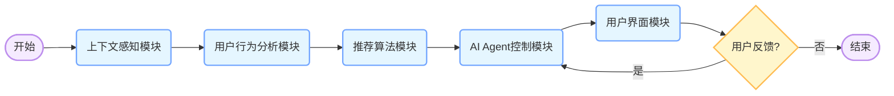

# 开发AI Agent的上下文感知推荐系统

> 关键词：AI Agent、上下文感知、推荐系统、机器学习、数据挖掘、用户行为分析、个性化推荐

> 摘要：本文围绕开发AI Agent的上下文感知推荐系统展开深入探讨。首先介绍了该系统开发的背景，包括目的、预期读者等内容。接着阐述了核心概念与联系，分析了系统的原理和架构。详细讲解了核心算法原理及具体操作步骤，并给出了相应的Python源代码。同时，运用数学模型和公式对系统进行理论分析，并举例说明。通过项目实战，展示了开发环境搭建、源代码实现与解读等过程。探讨了该系统的实际应用场景，推荐了相关的工具和资源。最后总结了未来发展趋势与挑战，提供了常见问题的解答和扩展阅读参考资料，旨在为开发AI Agent的上下文感知推荐系统提供全面且深入的技术指导。

## 1. 背景介绍 
### 1.1 目的和范围
随着互联网技术的飞速发展，信息呈现爆炸式增长，用户在海量信息中寻找自己感兴趣的内容变得越来越困难。推荐系统作为解决信息过载问题的有效手段，应运而生。传统的推荐系统主要基于用户的历史行为数据进行推荐，但忽略了用户当前所处的上下文信息，如时间、地点、设备等。而AI Agent的上下文感知推荐系统旨在结合用户的上下文信息，更精准地理解用户的需求和偏好，从而提供更加个性化、符合用户当前情境的推荐结果。

本文章的范围涵盖了AI Agent的上下文感知推荐系统的核心概念、算法原理、数学模型、项目实战、应用场景以及相关工具和资源推荐等方面，旨在为开发者和研究者提供全面的技术指导和参考。

### 1.2 预期读者
本文的预期读者包括但不限于以下几类人群：
- **人工智能开发者**：希望深入了解上下文感知推荐系统的开发原理和技术细节，以便在实际项目中应用。
- **数据科学家**：对用户行为分析、机器学习算法在推荐系统中的应用感兴趣，希望通过本文了解相关技术和方法。
- **研究人员**：从事推荐系统、人工智能等领域的研究工作，希望从理论和实践两个方面获取最新的研究成果和应用案例。
- **产品经理**：希望了解上下文感知推荐系统的优势和应用场景，以便在产品设计中融入相关功能，提升用户体验。

### 1.3 文档结构概述
本文的文档结构如下：
- **核心概念与联系**：介绍AI Agent、上下文感知、推荐系统等核心概念，以及它们之间的联系，通过文本示意图和Mermaid流程图进行展示。
- **核心算法原理 & 具体操作步骤**：详细讲解核心算法的原理，并给出Python源代码实现，同时说明具体的操作步骤。
- **数学模型和公式 & 详细讲解 & 举例说明**：运用数学模型和公式对系统进行理论分析，并通过具体例子进行说明。
- **项目实战：代码实际案例和详细解释说明**：包括开发环境搭建、源代码详细实现和代码解读，以及代码的分析。
- **实际应用场景**：探讨AI Agent的上下文感知推荐系统在不同领域的实际应用场景。
- **工具和资源推荐**：推荐相关的学习资源、开发工具框架和论文著作。
- **总结：未来发展趋势与挑战**：总结系统的未来发展趋势和面临的挑战。
- **附录：常见问题与解答**：提供常见问题的解答。
- **扩展阅读 & 参考资料**：列出扩展阅读的内容和参考资料。

### 1.4 术语表
#### 1.4.1 核心术语定义
- **AI Agent**：人工智能代理，是一种能够感知环境、自主决策并采取行动以实现特定目标的软件实体。
- **上下文感知**：指系统能够感知和利用用户所处的上下文信息，如时间、地点、设备、环境等，以提供更加个性化和准确的服务。
- **推荐系统**：一种信息过滤系统，通过分析用户的历史行为数据和上下文信息，为用户推荐可能感兴趣的物品或内容。
- **用户画像**：对用户的特征、偏好、行为等信息进行建模和描述，以便更好地理解用户需求。
- **协同过滤**：一种基于用户行为数据的推荐算法，通过寻找与目标用户行为相似的其他用户，来为目标用户推荐物品。

#### 1.4.2 相关概念解释
- **上下文信息**：包括用户的时间上下文（如一天中的不同时间段、一周中的不同日期等）、地点上下文（如用户所在的地理位置）、设备上下文（如用户使用的设备类型）、环境上下文（如天气、温度等）。
- **个性化推荐**：根据用户的个人特征、偏好和行为历史，为用户提供个性化的推荐结果，以提高用户的满意度和参与度。
- **冷启动问题**：指在推荐系统中，当新用户或新物品进入系统时，由于缺乏足够的历史数据，导致推荐效果不佳的问题。

#### 1.4.3 缩略词列表
- **ML**：Machine Learning，机器学习
- **AI**：Artificial Intelligence，人工智能
- **CF**：Collaborative Filtering，协同过滤
- **SVD**：Singular Value Decomposition，奇异值分解

## 2. 核心概念与联系 

### 核心概念原理
#### AI Agent
AI Agent是一种具有自主性、反应性、社会性和学习性的软件实体。它能够感知周围环境的变化，根据自身的目标和知识，自主地做出决策并采取行动。在上下文感知推荐系统中，AI Agent可以作为推荐系统的核心控制单元，负责收集用户的上下文信息、分析用户需求、生成推荐结果并与用户进行交互。

#### 上下文感知
上下文感知是指系统能够感知和利用用户所处的上下文信息。通过对上下文信息的分析，系统可以更好地理解用户的当前状态和需求，从而提供更加个性化和准确的推荐。例如，在不同的时间和地点，用户的兴趣和需求可能会发生变化。在早上，用户可能更关注新闻资讯；在晚上，用户可能更倾向于观看电影或听音乐。因此，考虑上下文信息可以提高推荐系统的准确性和用户满意度。

#### 推荐系统
推荐系统是一种信息过滤系统，它通过分析用户的历史行为数据和上下文信息，为用户推荐可能感兴趣的物品或内容。推荐系统的主要任务包括数据收集、数据预处理、特征提取、模型训练和推荐生成等。常见的推荐算法包括协同过滤、内容推荐、基于模型的推荐等。

### 架构的文本示意图
AI Agent的上下文感知推荐系统主要由以下几个部分组成：
- **上下文感知模块**：负责收集用户的上下文信息，包括时间、地点、设备、环境等。
- **用户行为分析模块**：分析用户的历史行为数据，如浏览记录、购买记录等，以构建用户画像。
- **推荐算法模块**：根据用户的上下文信息和用户画像，选择合适的推荐算法，生成推荐结果。
- **AI Agent控制模块**：作为系统的核心控制单元，协调各个模块之间的工作，根据用户的反馈和系统的运行情况，调整推荐策略。
- **用户界面模块**：提供用户与系统交互的界面，显示推荐结果，接收用户的反馈信息。

### Mermaid流程图


## 3. 核心算法原理 & 具体操作步骤 

### 核心算法原理 - 基于内容的推荐算法
基于内容的推荐算法是一种常用的推荐算法，它通过分析物品的内容特征和用户的偏好特征，为用户推荐与用户偏好相似的物品。具体步骤如下：
1. **特征提取**：对物品的内容进行特征提取，例如对于文本内容，可以提取关键词、主题等特征；对于图像内容，可以提取颜色、纹理等特征。
2. **用户偏好建模**：根据用户的历史行为数据，如浏览记录、购买记录等，构建用户的偏好模型。用户的偏好模型可以表示为一个特征向量，其中每个维度表示一个特征的权重。
3. **相似度计算**：计算物品的特征向量与用户的偏好向量之间的相似度。常用的相似度计算方法包括余弦相似度、欧几里得距离等。
4. **推荐生成**：根据相似度的大小，选择相似度较高的物品作为推荐结果。

### Python源代码实现
```python
import numpy as np

# 定义物品的特征矩阵
item_features = np.array([
    [0.1, 0.2, 0.3],
    [0.4, 0.5, 0.6],
    [0.7, 0.8, 0.9]
])

# 定义用户的偏好向量
user_preference = np.array([0.2, 0.3, 0.4])

# 计算余弦相似度
def cosine_similarity(a, b):
    dot_product = np.dot(a, b)
    norm_a = np.linalg.norm(a)
    norm_b = np.linalg.norm(b)
    if norm_a == 0 or norm_b == 0:
        return 0
    return dot_product / (norm_a * norm_b)

# 计算每个物品与用户偏好的相似度
similarities = []
for item_feature in item_features:
    similarity = cosine_similarity(item_feature, user_preference)
    similarities.append(similarity)

# 选择相似度最高的物品作为推荐结果
recommended_item_index = np.argmax(similarities)
recommended_item = item_features[recommended_item_index]

print("推荐的物品特征向量:", recommended_item)
```

### 具体操作步骤
1. **数据收集**：收集物品的内容数据和用户的历史行为数据。
2. **数据预处理**：对收集到的数据进行清洗、归一化等预处理操作，以提高数据的质量。
3. **特征提取**：根据物品的类型和特点，选择合适的特征提取方法，提取物品的特征向量。
4. **用户偏好建模**：根据用户的历史行为数据，构建用户的偏好向量。
5. **相似度计算**：使用余弦相似度等方法，计算物品的特征向量与用户的偏好向量之间的相似度。
6. **推荐生成**：根据相似度的大小，选择相似度较高的物品作为推荐结果。

## 4. 数学模型和公式 & 详细讲解 & 举例说明 

### 数学模型 - 基于内容的推荐模型
基于内容的推荐模型可以用以下数学公式表示：

设用户的偏好向量为 $\mathbf{u} = [u_1, u_2, \cdots, u_n]$，物品的特征向量为 $\mathbf{v} = [v_1, v_2, \cdots, v_n]$，其中 $n$ 表示特征的维度。则用户与物品之间的相似度 $s(\mathbf{u}, \mathbf{v})$ 可以用余弦相似度来计算：

$$s(\mathbf{u}, \mathbf{v}) = \frac{\mathbf{u} \cdot \mathbf{v}}{\|\mathbf{u}\| \|\mathbf{v}\|}$$

其中，$\mathbf{u} \cdot \mathbf{v}$ 表示向量 $\mathbf{u}$ 和 $\mathbf{v}$ 的点积，$\|\mathbf{u}\|$ 和 $\|\mathbf{v}\|$ 分别表示向量 $\mathbf{u}$ 和 $\mathbf{v}$ 的模。

### 详细讲解
余弦相似度是一种常用的相似度计算方法，它通过计算两个向量之间的夹角余弦值来衡量它们的相似度。余弦值越接近 1，表示两个向量的方向越相似，即它们的相似度越高；余弦值越接近 -1，表示两个向量的方向越相反，即它们的相似度越低。

在基于内容的推荐系统中，我们通过计算用户的偏好向量与物品的特征向量之间的余弦相似度，来判断用户对物品的感兴趣程度。相似度越高，说明用户对该物品越感兴趣，因此该物品越有可能被推荐给用户。

### 举例说明
假设用户的偏好向量为 $\mathbf{u} = [0.2, 0.3, 0.4]$，物品的特征向量为 $\mathbf{v} = [0.1, 0.2, 0.3]$。则它们之间的余弦相似度为：

$$\mathbf{u} \cdot \mathbf{v} = 0.2 \times 0.1 + 0.3 \times 0.2 + 0.4 \times 0.3 = 0.02 + 0.06 + 0.12 = 0.2$$

$$\|\mathbf{u}\| = \sqrt{0.2^2 + 0.3^2 + 0.4^2} = \sqrt{0.04 + 0.09 + 0.16} = \sqrt{0.29} \approx 0.5385$$

$$\|\mathbf{v}\| = \sqrt{0.1^2 + 0.2^2 + 0.3^2} = \sqrt{0.01 + 0.04 + 0.09} = \sqrt{0.14} \approx 0.3742$$

$$s(\mathbf{u}, \mathbf{v}) = \frac{0.2}{0.5385 \times 0.3742} \approx 0.994$$

由于余弦相似度接近 1，说明用户对该物品比较感兴趣，因此该物品可以作为推荐结果推荐给用户。

## 5. 项目实战：代码实际案例和详细解释说明 

### 5.1  开发环境搭建
#### 操作系统
建议使用 Linux 或 macOS 操作系统，因为它们对 Python 开发环境的支持较好。如果使用 Windows 操作系统，也可以安装 Anaconda 来管理 Python 环境。

#### Python 版本
建议使用 Python 3.7 及以上版本。

#### 依赖库安装
在项目中，我们需要使用以下依赖库：
- **numpy**：用于数值计算。
- **pandas**：用于数据处理和分析。
- **scikit-learn**：用于机器学习算法的实现。

可以使用以下命令来安装这些依赖库：
```sh
pip install numpy pandas scikit-learn
```

### 5.2  源代码详细实现和代码解读
以下是一个简单的基于内容的推荐系统的源代码实现：

```python
import numpy as np
import pandas as pd
from sklearn.feature_extraction.text import TfidfVectorizer
from sklearn.metrics.pairwise import cosine_similarity

# 加载数据
data = pd.read_csv('items.csv')

# 提取物品的文本特征
vectorizer = TfidfVectorizer()
item_features = vectorizer.fit_transform(data['description'])

# 定义用户的历史行为数据
user_history = ['This is a great product', 'I like this item']
user_features = vectorizer.transform(user_history)

# 计算用户特征的平均值作为用户的偏好向量
user_preference = np.mean(user_features.toarray(), axis=0)

# 计算每个物品与用户偏好的相似度
similarities = cosine_similarity(item_features, [user_preference])

# 选择相似度最高的前 5 个物品作为推荐结果
top_indices = similarities.flatten().argsort()[::-1][:5]
recommended_items = data.iloc[top_indices]

print("推荐的物品：")
print(recommended_items)
```

### 代码解读与分析
1. **数据加载**：使用 `pandas` 库的 `read_csv` 函数加载物品数据，数据文件为 `items.csv`，其中包含物品的描述信息。
2. **特征提取**：使用 `TfidfVectorizer` 类将物品的文本描述转换为 TF-IDF 特征向量。TF-IDF 是一种常用的文本特征表示方法，它可以反映一个词在文档中的重要程度。
3. **用户偏好建模**：根据用户的历史行为数据，使用 `TfidfVectorizer` 类将用户的历史文本转换为特征向量。然后，计算这些特征向量的平均值作为用户的偏好向量。
4. **相似度计算**：使用 `cosine_similarity` 函数计算每个物品的特征向量与用户的偏好向量之间的余弦相似度。
5. **推荐生成**：根据相似度的大小，选择相似度最高的前 5 个物品作为推荐结果，并输出这些物品的信息。

## 6. 实际应用场景 
### 电子商务
在电子商务领域，AI Agent的上下文感知推荐系统可以根据用户的当前地理位置、时间、设备等上下文信息，为用户推荐更加个性化的商品。例如，在旅游景点附近，推荐当地的特色商品；在晚上，推荐适合夜间使用的商品。同时，结合用户的历史购买记录和浏览行为，进一步提高推荐的准确性和用户的购买转化率。

### 在线视频
在在线视频平台，上下文感知推荐系统可以根据用户的观看时间、设备类型、网络环境等上下文信息，为用户推荐适合当前情境的视频内容。例如，在上班途中，推荐短视频；在晚上休息时，推荐长视频。此外，还可以根据用户的历史观看记录和收藏偏好，为用户提供个性化的视频推荐。

### 音乐推荐
在音乐推荐领域，上下文感知推荐系统可以根据用户的当前心情、活动状态、时间等上下文信息，为用户推荐适合的音乐类型和歌曲。例如，在运动时，推荐节奏明快的音乐；在放松时，推荐舒缓的音乐。同时，结合用户的历史播放记录和收藏列表，为用户提供更加精准的音乐推荐。

### 新闻资讯
在新闻资讯平台，上下文感知推荐系统可以根据用户的地理位置、时间、兴趣偏好等上下文信息，为用户推荐感兴趣的新闻内容。例如，在本地发生重大事件时，推荐相关的本地新闻；在特定的时间段，推荐适合该时间段的新闻类型。此外，还可以根据用户的历史阅读记录，为用户提供个性化的新闻推荐。

## 7. 工具和资源推荐
### 7.1 学习资源推荐
#### 7.1.1 书籍推荐
- 《推荐系统实践》：作者项亮，本书全面介绍了推荐系统的基本原理、算法和实践经验，是学习推荐系统的经典书籍。
- 《机器学习》：作者周志华，本书系统地介绍了机器学习的基本概念、算法和应用，对于理解推荐系统中的机器学习算法有很大帮助。
- 《Python 数据分析实战》：作者 Wes McKinney，本书详细介绍了使用 Python 进行数据分析的方法和技巧，对于处理推荐系统中的数据有很大帮助。

#### 7.1.2 在线课程
- Coursera 上的“Machine Learning”课程：由 Andrew Ng 教授讲授，是机器学习领域的经典课程，对于学习推荐系统中的机器学习算法有很大帮助。
- edX 上的“Introduction to Artificial Intelligence”课程：由麻省理工学院的教授讲授，介绍了人工智能的基本概念、算法和应用，对于理解 AI Agent 的相关知识有很大帮助。
- 网易云课堂上的“推荐系统实战”课程：由一线工程师讲授，结合实际项目，介绍了推荐系统的开发流程和技术细节。

#### 7.1.3 技术博客和网站
- 博客园：是一个技术博客平台，上面有很多关于推荐系统、人工智能等领域的技术文章。
- 开源中国：是一个开源技术社区，上面有很多开源的推荐系统项目和相关技术文章。
- Kaggle：是一个数据科学竞赛平台，上面有很多关于推荐系统的数据集和竞赛项目，可以通过参与竞赛来提高自己的实践能力。

### 7.2 开发工具框架推荐
#### 7.2.1 IDE和编辑器
- PyCharm：是一款专业的 Python 集成开发环境，提供了丰富的代码编辑、调试、版本控制等功能，适合开发推荐系统项目。
- Visual Studio Code：是一款轻量级的代码编辑器，支持多种编程语言和插件扩展，对于快速开发和调试推荐系统代码非常方便。

#### 7.2.2 调试和性能分析工具
- pdb：是 Python 自带的调试工具，可以帮助开发者定位和解决代码中的问题。
- cProfile：是 Python 自带的性能分析工具，可以帮助开发者分析代码的性能瓶颈，优化代码性能。

#### 7.2.3 相关框架和库
- Scikit-learn：是一个开源的机器学习库，提供了丰富的机器学习算法和工具，对于实现推荐系统中的机器学习算法非常方便。
- TensorFlow：是一个开源的深度学习框架，提供了丰富的深度学习模型和工具，对于实现复杂的推荐系统模型有很大帮助。
- PyTorch：是一个开源的深度学习框架，提供了动态图和静态图两种编程方式，对于实现推荐系统中的深度学习模型非常灵活。

### 7.3 相关论文著作推荐
#### 7.3.1 经典论文
- “Item-based Collaborative Filtering Recommendation Algorithms”：提出了基于物品的协同过滤推荐算法，是协同过滤推荐算法领域的经典论文。
- “Matrix Factorization Techniques for Recommender Systems”：介绍了矩阵分解技术在推荐系统中的应用，是推荐系统领域的经典论文。

#### 7.3.2 最新研究成果
- 可以通过 Google Scholar、IEEE Xplore、ACM Digital Library 等学术数据库，搜索关于 AI Agent、上下文感知推荐系统等领域的最新研究成果。

#### 7.3.3 应用案例分析
- 可以通过阅读一些行业报告和案例分析，了解 AI Agent的上下文感知推荐系统在不同领域的应用案例和实践经验。

## 8. 总结：未来发展趋势与挑战
### 未来发展趋势
- **多模态信息融合**：未来的上下文感知推荐系统将不仅仅考虑文本、图像等单一模态的信息，而是会融合多模态信息，如音频、视频、传感器数据等，以更全面地理解用户的需求和偏好。
- **强化学习的应用**：强化学习可以通过与环境的交互，不断优化推荐策略，提高推荐系统的性能。未来的推荐系统将更多地应用强化学习技术，实现更加智能和自适应的推荐。
- **边缘计算与云计算的结合**：边缘计算可以在本地设备上进行数据处理和推荐计算，减少数据传输延迟，提高推荐系统的实时性。未来的推荐系统将结合边缘计算和云计算的优势，实现更加高效和智能的推荐。
- **隐私保护与安全**：随着用户对隐私和安全的关注度不断提高，未来的推荐系统将更加注重隐私保护和安全技术的应用，如差分隐私、同态加密等，以确保用户数据的安全和隐私。

### 挑战
- **数据质量和可用性**：上下文感知推荐系统需要大量的高质量数据来训练模型，但实际应用中，数据往往存在噪声、缺失值等问题，影响模型的性能。此外，一些敏感的上下文信息可能难以获取，限制了推荐系统的应用范围。
- **模型复杂度和计算资源**：随着推荐系统的功能不断增强，模型的复杂度也越来越高，需要大量的计算资源来训练和运行模型。如何在有限的计算资源下，实现高效的推荐系统是一个挑战。
- **用户隐私和安全**：推荐系统需要收集和处理用户的大量个人信息，包括上下文信息和历史行为数据，这涉及到用户的隐私和安全问题。如何在保证推荐系统性能的同时，保护用户的隐私和安全是一个亟待解决的问题。
- **可解释性和透明度**：推荐系统的决策过程往往是复杂的，难以理解和解释。用户可能对推荐结果的合理性和公正性存在疑问，因此如何提高推荐系统的可解释性和透明度是一个重要的挑战。

## 9. 附录：常见问题与解答
### 问题 1：如何解决推荐系统的冷启动问题？
解答：冷启动问题是推荐系统中常见的问题，可以通过以下几种方法来解决：
- **基于内容的推荐**：对于新用户，可以根据用户提供的个人信息和偏好，推荐与这些信息相关的物品。对于新物品，可以根据物品的内容特征，推荐给可能感兴趣的用户。
- **利用社交网络信息**：如果用户有社交网络账号，可以利用社交网络中的好友信息和行为数据，为用户推荐物品。
- **引导用户提供反馈**：在用户注册时，引导用户提供一些初始的偏好信息，如喜欢的物品类型、品牌等，以便系统更好地为用户推荐物品。

### 问题 2：如何评估推荐系统的性能？
解答：可以使用以下几种指标来评估推荐系统的性能：
- **准确率（Precision）**：指推荐结果中用户感兴趣的物品占总推荐物品的比例。
- **召回率（Recall）**：指用户感兴趣的物品中被推荐出来的物品占总感兴趣物品的比例。
- **F1 值**：是准确率和召回率的调和平均数，综合考虑了准确率和召回率。
- **均方误差（MSE）**：用于评估预测评分与实际评分之间的误差。

### 问题 3：如何选择合适的推荐算法？
解答：选择合适的推荐算法需要考虑以下几个因素：
- **数据特点**：不同的推荐算法适用于不同类型的数据。例如，协同过滤算法适用于用户行为数据丰富的场景，基于内容的推荐算法适用于物品内容特征明显的场景。
- **业务需求**：根据业务的具体需求，选择合适的推荐算法。例如，如果需要实时推荐，可能需要选择计算效率高的算法；如果需要个性化程度高的推荐，可能需要选择基于模型的推荐算法。
- **可解释性要求**：如果对推荐结果的可解释性要求较高，可能需要选择可解释性较强的算法，如基于内容的推荐算法。

## 10. 扩展阅读 & 参考资料
### 扩展阅读
- 《人工智能：现代方法》：作者 Stuart Russell 和 Peter Norvig，本书全面介绍了人工智能的基本概念、算法和应用，对于深入理解 AI Agent 和推荐系统的相关知识有很大帮助。
- 《深度学习》：作者 Ian Goodfellow、Yoshua Bengio 和 Aaron Courville，本书系统地介绍了深度学习的基本概念、算法和应用，对于理解推荐系统中的深度学习模型有很大帮助。

### 参考资料
- 相关的学术论文和研究报告，可以通过 Google Scholar、IEEE Xplore、ACM Digital Library 等学术数据库获取。
- 开源的推荐系统项目，如 Surprise、LightFM 等，可以通过 GitHub 等代码托管平台获取。
- 官方文档和技术博客，如 Python 官方文档、Scikit-learn 官方文档、TensorFlow 官方博客等，可以获取最新的技术信息和使用指南。