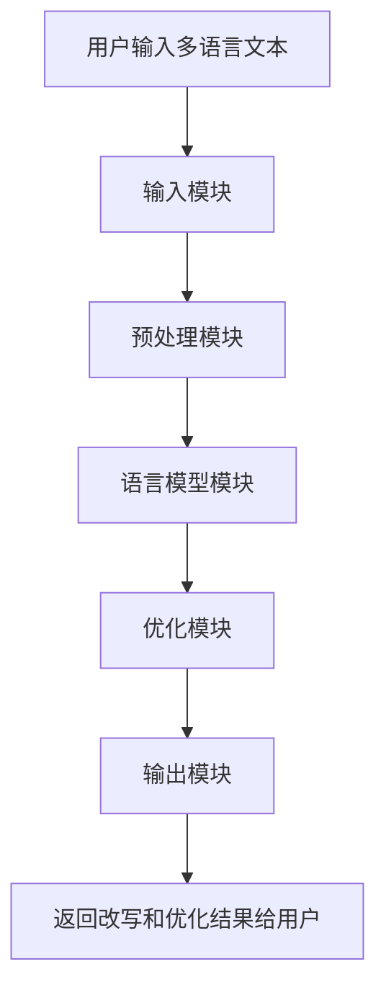

# 开发AI Agent的多语言文本改写与优化系统

> 关键词：AI Agent、多语言、文本改写、文本优化、自然语言处理

> 摘要：本文围绕开发AI Agent的多语言文本改写与优化系统展开。首先介绍了该系统开发的背景、目的、预期读者等内容。接着深入探讨了核心概念，包括其原理和架构，并以Mermaid流程图呈现。详细阐述了核心算法原理和具体操作步骤，结合Python源代码进行说明。还介绍了相关的数学模型和公式，并举例解释。通过项目实战，从开发环境搭建到源代码实现与解读，全面展示系统的开发过程。同时分析了该系统的实际应用场景，推荐了学习、开发工具框架以及相关论文著作等资源。最后对系统的未来发展趋势与挑战进行总结，并提供常见问题解答和扩展阅读参考资料，旨在为开发者提供全面的技术指导和知识储备。

## 1. 背景介绍 
### 1.1 目的和范围
在全球化的今天，信息的交流跨越了语言的界限，多语言文本处理的需求日益增长。开发AI Agent的多语言文本改写与优化系统的主要目的是为用户提供高效、准确且自然的多语言文本改写和优化服务。该系统的范围涵盖了多种常见语言，如英语、中文、法语、德语、西班牙语等，能够处理各种类型的文本，包括新闻报道、学术论文、商务文案、日常交流等。通过该系统，用户可以快速获得不同风格、不同表述方式的文本，提升文本的质量和可读性。

### 1.2 预期读者
本文的预期读者主要包括自然语言处理领域的研究人员、AI开发者、软件工程师、对多语言文本处理感兴趣的技术爱好者等。对于研究人员，本文可以为他们的学术研究提供新的思路和方法；对于开发者和工程师，本文详细的技术实现过程和代码示例可以帮助他们快速开发出类似的系统；对于技术爱好者，本文可以让他们了解多语言文本改写与优化系统的基本原理和实现方式。

### 1.3 文档结构概述
本文首先介绍开发AI Agent的多语言文本改写与优化系统的背景信息，包括目的、预期读者和文档结构概述等。然后深入探讨核心概念，包括其原理和架构，并以Mermaid流程图展示。接着详细阐述核心算法原理和具体操作步骤，结合Python源代码进行说明。再介绍相关的数学模型和公式，并举例解释。通过项目实战，从开发环境搭建到源代码实现与解读，全面展示系统的开发过程。分析系统的实际应用场景，推荐学习、开发工具框架以及相关论文著作等资源。最后总结系统的未来发展趋势与挑战，提供常见问题解答和扩展阅读参考资料。

### 1.4 术语表
#### 1.4.1 核心术语定义
- **AI Agent**：人工智能代理，是一种能够感知环境、做出决策并采取行动以实现特定目标的智能实体。在本文中，AI Agent负责处理多语言文本的改写与优化任务。
- **多语言**：指系统支持多种不同的自然语言，如英语、中文、法语等。
- **文本改写**：对给定的文本进行重新表述，保持其核心语义不变，但改变文本的表达方式，以满足不同的需求。
- **文本优化**：对文本进行修改和完善，提高文本的质量、可读性和准确性。
- **自然语言处理（NLP）**：计算机科学与人工智能领域的一个重要分支，旨在让计算机理解、处理和生成自然语言。

#### 1.4.2 相关概念解释
- **机器翻译**：将一种自然语言翻译成另一种自然语言的技术。虽然多语言文本改写与优化系统与机器翻译有一定的关联，但前者更侧重于对文本的改写和优化，而不仅仅是翻译。
- **语言模型**：一种基于概率统计的模型，用于预测文本中下一个词的概率。在多语言文本改写与优化系统中，语言模型可以帮助生成自然流畅的文本。

#### 1.4.3 缩略词列表
- **NLP**：自然语言处理（Natural Language Processing）
- **API**：应用程序编程接口（Application Programming Interface）
- **RNN**：循环神经网络（Recurrent Neural Network）
- **LSTM**：长短期记忆网络（Long Short-Term Memory）
- **Transformer**：一种基于注意力机制的深度学习模型

## 2. 核心概念与联系 
### 核心概念原理
AI Agent的多语言文本改写与优化系统的核心原理基于自然语言处理技术。系统首先对输入的多语言文本进行预处理，包括分词、词性标注、命名实体识别等操作，以提取文本的语义信息。然后，利用预训练的语言模型对文本进行分析和理解，生成多种可能的改写方案。最后，通过优化算法对这些方案进行评估和筛选，选择出最合适的改写和优化结果。

### 架构的文本示意图
该系统主要由以下几个模块组成：
1. **输入模块**：接收用户输入的多语言文本。
2. **预处理模块**：对输入的文本进行分词、词性标注、命名实体识别等预处理操作。
3. **语言模型模块**：利用预训练的语言模型对文本进行分析和理解，生成多种可能的改写方案。
4. **优化模块**：通过优化算法对生成的改写方案进行评估和筛选，选择出最合适的结果。
5. **输出模块**：将最终的改写和优化结果返回给用户。

### Mermaid 流程图


## 3. 核心算法原理 & 具体操作步骤 
### 核心算法原理
本系统主要采用Transformer架构的语言模型，如GPT、BERT等。Transformer模型基于注意力机制，能够捕捉文本中的长距离依赖关系，从而更好地理解文本的语义信息。在文本改写和优化过程中，我们使用语言模型生成多种可能的改写方案，然后通过基于规则和机器学习的优化算法对这些方案进行评估和筛选。

### 具体操作步骤
1. **数据预处理**：对输入的多语言文本进行分词、词性标注、命名实体识别等操作，将文本转换为适合语言模型处理的格式。
2. **语言模型生成**：利用预训练的语言模型对预处理后的文本进行分析和理解，生成多种可能的改写方案。
3. **优化算法评估**：通过基于规则和机器学习的优化算法对生成的改写方案进行评估，计算每个方案的得分。
4. **结果筛选**：选择得分最高的改写方案作为最终的结果。

### Python源代码详细阐述
```python
import torch
from transformers import AutoTokenizer, AutoModelForCausalLM

# 加载预训练的语言模型和分词器
tokenizer = AutoTokenizer.from_pretrained("gpt2")
model = AutoModelForCausalLM.from_pretrained("gpt2")

def preprocess_text(text):
    """
    文本预处理函数
    :param text: 输入的文本
    :return: 预处理后的文本
    """
    # 分词
    tokens = tokenizer.tokenize(text)
    # 转换为词索引
    input_ids = tokenizer.convert_tokens_to_ids(tokens)
    return torch.tensor([input_ids])

def generate_rewrites(input_ids, num_rewrites=5):
    """
    生成改写方案
    :param input_ids: 输入的文本的词索引
    :param num_rewrites: 生成的改写方案数量
    :return: 生成的改写方案列表
    """
    outputs = model.generate(input_ids, max_length=100, num_return_sequences=num_rewrites)
    rewrites = []
    for output in outputs:
        rewrite = tokenizer.decode(output, skip_special_tokens=True)
        rewrites.append(rewrite)
    return rewrites

def optimize_rewrites(rewrites):
    """
    优化改写方案
    :param rewrites: 生成的改写方案列表
    :return: 优化后的改写方案
    """
    # 简单示例：选择长度最长的改写方案
    best_rewrite = max(rewrites, key=len)
    return best_rewrite

# 示例输入文本
input_text = "This is a sample sentence."

# 预处理文本
input_ids = preprocess_text(input_text)

# 生成改写方案
rewrites = generate_rewrites(input_ids)

# 优化改写方案
best_rewrite = optimize_rewrites(rewrites)

print("原始文本:", input_text)
print("优化后的改写文本:", best_rewrite)
```

## 4. 数学模型和公式 & 详细讲解 & 举例说明 
### 语言模型的数学模型
语言模型的目标是计算给定文本序列 $x = (x_1, x_2, \cdots, x_n)$ 的概率 $P(x)$。在基于Transformer的语言模型中，通常采用自回归的方式来计算这个概率，即：

$$P(x) = \prod_{i=1}^{n} P(x_i | x_1, x_2, \cdots, x_{i-1})$$

其中，$P(x_i | x_1, x_2, \cdots, x_{i-1})$ 表示在给定前面 $i-1$ 个词的条件下，第 $i$ 个词出现的概率。

### 注意力机制的数学公式
注意力机制是Transformer模型的核心组件，其计算过程可以表示为：

$$Attention(Q, K, V) = softmax(\frac{QK^T}{\sqrt{d_k}})V$$

其中，$Q$、$K$、$V$ 分别是查询矩阵、键矩阵和值矩阵，$d_k$ 是键向量的维度。

### 详细讲解
语言模型通过不断学习文本序列中词与词之间的概率关系，来预测下一个词的出现概率。注意力机制则允许模型在处理每个词时，能够关注到文本中其他相关的词，从而捕捉到长距离依赖关系。

### 举例说明
假设我们有一个文本序列 "The cat is on the mat"，语言模型会计算每个词在给定前面词的条件下出现的概率。例如，在给定 "The cat" 的条件下，计算 "is" 出现的概率。注意力机制则会在处理 "is" 这个词时，关注到 "cat" 等相关的词，从而更好地理解文本的语义。

## 5. 项目实战：代码实际案例和详细解释说明 
### 5.1  开发环境搭建
1. **安装Python**：确保你的系统中安装了Python 3.6及以上版本。
2. **安装必要的库**：使用pip安装所需的库，如`transformers`、`torch`等。
```bash
pip install transformers torch
```
3. **下载预训练模型**：可以从Hugging Face的模型库中下载预训练的语言模型，如GPT-2、BERT等。

### 5.2  源代码详细实现和代码解读
```python
import torch
from transformers import AutoTokenizer, AutoModelForCausalLM

# 加载预训练的语言模型和分词器
tokenizer = AutoTokenizer.from_pretrained("gpt2")
model = AutoModelForCausalLM.from_pretrained("gpt2")

def preprocess_text(text):
    """
    文本预处理函数
    :param text: 输入的文本
    :return: 预处理后的文本
    """
    # 分词
    tokens = tokenizer.tokenize(text)
    # 转换为词索引
    input_ids = tokenizer.convert_tokens_to_ids(tokens)
    return torch.tensor([input_ids])

def generate_rewrites(input_ids, num_rewrites=5):
    """
    生成改写方案
    :param input_ids: 输入的文本的词索引
    :param num_rewrites: 生成的改写方案数量
    :return: 生成的改写方案列表
    """
    outputs = model.generate(input_ids, max_length=100, num_return_sequences=num_rewrites)
    rewrites = []
    for output in outputs:
        rewrite = tokenizer.decode(output, skip_special_tokens=True)
        rewrites.append(rewrite)
    return rewrites

def optimize_rewrites(rewrites):
    """
    优化改写方案
    :param rewrites: 生成的改写方案列表
    :return: 优化后的改写方案
    """
    # 简单示例：选择长度最长的改写方案
    best_rewrite = max(rewrites, key=len)
    return best_rewrite

# 示例输入文本
input_text = "This is a sample sentence."

# 预处理文本
input_ids = preprocess_text(input_text)

# 生成改写方案
rewrites = generate_rewrites(input_ids)

# 优化改写方案
best_rewrite = optimize_rewrites(rewrites)

print("原始文本:", input_text)
print("优化后的改写文本:", best_rewrite)
```
### 代码解读与分析
1. **加载预训练模型和分词器**：使用`AutoTokenizer`和`AutoModelForCausalLM`从Hugging Face的模型库中加载GPT-2的预训练模型和分词器。
2. **文本预处理**：`preprocess_text`函数将输入的文本进行分词，并转换为词索引，以便输入到语言模型中。
3. **生成改写方案**：`generate_rewrites`函数利用语言模型生成多个可能的改写方案。
4. **优化改写方案**：`optimize_rewrites`函数对生成的改写方案进行优化，这里简单地选择长度最长的方案作为最终结果。
5. **输出结果**：将原始文本和优化后的改写文本打印输出。

## 6. 实际应用场景 
### 内容创作
在内容创作领域，多语言文本改写与优化系统可以帮助作者快速生成不同风格的文本，提高创作效率。例如，新闻记者可以使用该系统对同一事件生成多种不同表述方式的新闻报道，以满足不同读者的需求。

### 翻译辅助
在翻译过程中，该系统可以对翻译后的文本进行改写和优化，提高翻译的质量和自然度。例如，翻译人员可以将翻译初稿输入到系统中，系统可以帮助生成更流畅、更准确的译文。

### 教育领域
在教育领域，该系统可以用于辅助学生写作。学生可以将自己的作文输入到系统中，系统可以提供改写和优化建议，帮助学生提高写作水平。

### 商务文案处理
在商务领域，该系统可以帮助企业生成高质量的商务文案，如产品说明书、营销邮件等。通过改写和优化文案，提高企业的沟通效率和形象。

## 7. 工具和资源推荐
### 7.1 学习资源推荐
#### 7.1.1 书籍推荐
- 《自然语言处理入门》：介绍了自然语言处理的基本概念、方法和技术，适合初学者阅读。
- 《深度学习》：详细介绍了深度学习的原理和应用，包括神经网络、卷积神经网络、循环神经网络等。
- 《Python自然语言处理》：通过Python代码示例，介绍了自然语言处理的各种技术和方法。

#### 7.1.2 在线课程
- Coursera上的“自然语言处理专项课程”：由知名高校的教授授课，系统地介绍了自然语言处理的各个方面。
- edX上的“深度学习基础”：帮助学习者掌握深度学习的基本原理和方法。
- 哔哩哔哩上的“自然语言处理教程”：有很多免费的自然语言处理教程视频，适合初学者观看。

#### 7.1.3 技术博客和网站
- Hugging Face博客：提供了关于自然语言处理模型和技术的最新资讯和教程。
- Medium上的自然语言处理相关文章：有很多优秀的自然语言处理技术文章和案例分享。
- 开源中国：有很多关于自然语言处理的技术文章和开源项目。

### 7.2 开发工具框架推荐
#### 7.2.1 IDE和编辑器
- PyCharm：一款功能强大的Python集成开发环境，提供了代码编辑、调试、版本控制等功能。
- Visual Studio Code：一款轻量级的代码编辑器，支持多种编程语言，有丰富的插件扩展。
- Jupyter Notebook：一种交互式的开发环境，适合进行数据探索和模型训练。

#### 7.2.2 调试和性能分析工具
- TensorBoard：用于可视化深度学习模型的训练过程和性能指标。
- Py-Spy：用于分析Python代码的性能瓶颈。
- Pylint：用于检查Python代码的语法错误和代码规范。

#### 7.2.3 相关框架和库
- Transformers：Hugging Face开发的自然语言处理框架，提供了多种预训练的语言模型和工具。
- PyTorch：一个开源的深度学习框架，广泛应用于自然语言处理领域。
- NLTK：Python的自然语言处理工具包，提供了多种自然语言处理的工具和数据集。

### 7.3 相关论文著作推荐
#### 7.3.1 经典论文
- 《Attention Is All You Need》：介绍了Transformer模型的原理和结构，是自然语言处理领域的经典论文。
- 《BERT: Pre-training of Deep Bidirectional Transformers for Language Understanding》：介绍了BERT模型的预训练方法和应用，对自然语言处理的发展产生了重要影响。
- 《GPT: Generative Pretrained Transformer》：介绍了GPT模型的原理和应用，开创了基于生成式预训练的自然语言处理方法。

#### 7.3.2 最新研究成果
- 每年的ACL（Association for Computational Linguistics）会议论文集：包含了自然语言处理领域的最新研究成果。
- arXiv上的自然语言处理相关论文：可以及时了解到最新的研究动态和技术进展。

#### 7.3.3 应用案例分析
- 《自然语言处理实战》：通过实际案例介绍了自然语言处理技术在各个领域的应用。
- 各大公司的技术博客：如Google、Facebook等公司的技术博客，会分享一些自然语言处理的应用案例和实践经验。

## 8. 总结：未来发展趋势与挑战
### 未来发展趋势
1. **更强的多语言处理能力**：未来的多语言文本改写与优化系统将支持更多的语言，并且能够更好地处理不同语言之间的差异和特点。
2. **更智能的文本理解和生成**：随着深度学习技术的不断发展，系统将能够更深入地理解文本的语义信息，生成更加自然、流畅的文本。
3. **与其他技术的融合**：多语言文本改写与优化系统将与计算机视觉、语音识别等技术融合，实现更加智能化的交互和应用。
4. **个性化服务**：系统将能够根据用户的个性化需求和偏好，提供更加定制化的文本改写和优化服务。

### 挑战
1. **语言多样性**：不同语言的语法、词汇、文化背景等差异很大，如何处理这些差异是一个挑战。
2. **语义理解**：准确理解文本的语义信息是文本改写和优化的关键，但目前的技术还存在一定的局限性。
3. **计算资源需求**：训练和运行大规模的语言模型需要大量的计算资源，如何降低计算成本是一个需要解决的问题。
4. **数据隐私和安全**：多语言文本改写与优化系统需要处理大量的用户文本数据，如何保障数据的隐私和安全是一个重要的挑战。

## 9. 附录：常见问题与解答
### 1. 系统支持哪些语言？
本系统目前支持多种常见语言，如英语、中文、法语、德语、西班牙语等。未来会根据需求不断扩展支持的语言种类。

### 2. 系统生成的改写方案质量如何保证？
系统通过预训练的语言模型生成多种可能的改写方案，然后通过优化算法对这些方案进行评估和筛选，选择出最合适的结果。同时，我们也会不断优化语言模型和优化算法，提高生成方案的质量。

### 3. 系统的处理速度如何？
系统的处理速度取决于输入文本的长度和复杂度，以及系统的计算资源。一般来说，对于较短的文本，系统可以在较短的时间内给出结果。对于较长的文本，处理时间可能会相对较长。

### 4. 如何使用系统？
用户可以将需要改写和优化的多语言文本输入到系统中，系统会自动进行处理，并返回改写和优化后的结果。具体的使用方法可以参考系统的用户手册或在线帮助文档。

## 10. 扩展阅读 & 参考资料
1. 《自然语言处理综论》
2. Hugging Face官方文档：https://huggingface.co/docs
3. PyTorch官方文档：https://pytorch.org/docs/stable/index.html
4. ACL会议官网：https://www.aclweb.org/
5. arXiv官网：https://arxiv.org/