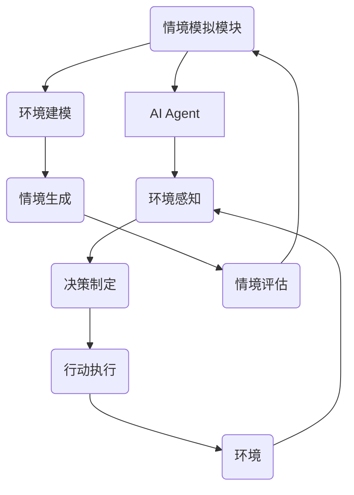

# 开发具有情境模拟能力的AI Agent

> 关键词：AI Agent、情境模拟、人工智能、智能体开发、深度学习、强化学习、情境感知

> 摘要：本文围绕开发具有情境模拟能力的AI Agent展开，深入探讨了其核心概念、算法原理、数学模型等关键内容。详细阐述了开发过程中的具体操作步骤，通过项目实战展示了代码实现与解读。同时分析了其实际应用场景，推荐了相关的学习资源、开发工具框架以及论文著作。最后总结了未来发展趋势与挑战，并提供了常见问题解答和扩展阅读参考资料，旨在为开发者和研究者全面了解和开发具有情境模拟能力的AI Agent提供有价值的参考。

## 1. 背景介绍 
### 1.1 目的和范围
随着人工智能技术的不断发展，AI Agent在各个领域的应用越来越广泛。开发具有情境模拟能力的AI Agent的目的在于使智能体能够更好地理解和适应不同的环境情境，从而做出更加合理和智能的决策。本文章的范围涵盖了从AI Agent情境模拟能力的基础概念到具体开发实现的全过程，包括核心算法原理、数学模型、项目实战等方面的内容。

### 1.2 预期读者
本文预期读者包括人工智能领域的开发者、研究人员、对AI Agent技术感兴趣的工程师以及相关专业的学生。希望通过本文的介绍，能够帮助读者深入理解具有情境模拟能力的AI Agent的开发过程和技术要点。

### 1.3 文档结构概述
本文首先介绍背景信息，包括目的、预期读者和文档结构概述等内容。接着阐述核心概念与联系，包括AI Agent和情境模拟的原理及架构。然后详细讲解核心算法原理和具体操作步骤，通过Python源代码进行阐述。随后介绍数学模型和公式，并举例说明。再通过项目实战展示代码实际案例和详细解释。之后分析实际应用场景，推荐相关工具和资源。最后总结未来发展趋势与挑战，提供常见问题解答和扩展阅读参考资料。

### 1.4 术语表
#### 1.4.1 核心术语定义
- **AI Agent（人工智能智能体）**：是一种能够感知环境、进行决策并采取行动的智能实体。
- **情境模拟**：指对特定环境情境进行建模和仿真，以便AI Agent能够在模拟情境中学习和决策。
- **强化学习**：一种机器学习方法，智能体通过与环境进行交互，根据奖励信号来学习最优策略。
- **深度学习**：基于人工神经网络的机器学习技术，能够自动从大量数据中学习特征和模式。

#### 1.4.2 相关概念解释
- **环境感知**：AI Agent通过各种传感器获取环境信息的过程。
- **决策制定**：根据感知到的环境信息和自身的目标，AI Agent选择合适的行动的过程。
- **情境感知**：AI Agent对当前环境情境的理解和判断能力。

#### 1.4.3 缩略词列表
- **RL**：Reinforcement Learning（强化学习）
- **DL**：Deep Learning（深度学习）
- **ANN**：Artificial Neural Network（人工神经网络）

## 2. 核心概念与联系 
### 2.1 AI Agent概述
AI Agent是人工智能系统中的一个重要概念，它可以被看作是一个具有自主性、反应性、社会性和主动性的智能实体。自主性意味着AI Agent能够独立地感知环境、进行决策和采取行动；反应性表示AI Agent能够对环境中的变化做出及时的响应；社会性体现了AI Agent可以与其他智能体进行交互和协作；主动性则指AI Agent能够主动地追求自己的目标。

### 2.2 情境模拟原理
情境模拟的核心思想是对真实环境进行建模和仿真，通过构建一个虚拟的环境来模拟各种可能的情境。在这个模拟环境中，AI Agent可以进行学习和训练，以提高其在不同情境下的决策能力和适应性。情境模拟通常包括环境建模、情境生成和情境评估等步骤。

### 2.3 两者联系
AI Agent和情境模拟是相互关联的。情境模拟为AI Agent提供了一个学习和训练的平台，使得AI Agent能够在不同的情境中进行试验和探索，从而不断优化自己的决策策略。而AI Agent的决策和行动又会对情境产生影响，进一步推动情境的发展和变化。通过这种相互作用，AI Agent能够更好地适应不同的环境情境，提高其智能水平和决策能力。

### 2.4 文本示意图
AI Agent与情境模拟的关系可以用以下文本示意图表示：

AI Agent通过传感器感知环境信息，将其输入到决策模块中。决策模块根据预设的目标和策略，结合感知到的环境信息，做出决策并输出行动指令。行动指令通过执行器作用于环境，从而改变环境的状态。情境模拟模块对环境进行建模和仿真，生成各种不同的情境，并将这些情境提供给AI Agent进行学习和训练。AI Agent在模拟情境中不断优化自己的决策策略，以提高其在真实环境中的适应性和决策能力。

### 2.5 Mermaid流程图


## 3. 核心算法原理 & 具体操作步骤 
### 3.1 强化学习算法原理
强化学习是开发具有情境模拟能力的AI Agent的常用算法之一。其基本思想是智能体通过与环境进行交互，根据环境反馈的奖励信号来学习最优策略。在强化学习中，智能体的目标是最大化长期累积奖励。

强化学习的基本要素包括状态空间 $S$、动作空间 $A$、奖励函数 $R$ 和策略 $\pi$。状态空间 $S$ 表示环境的所有可能状态；动作空间 $A$ 表示智能体可以采取的所有可能动作；奖励函数 $R$ 表示智能体在某个状态下采取某个动作后获得的即时奖励；策略 $\pi$ 表示智能体在每个状态下选择动作的概率分布。

强化学习的学习过程可以用以下伪代码表示：

```plaintext
初始化策略 $\pi$ 和价值函数 $V$
重复以下步骤直到满足终止条件：
    初始化环境状态 $s$
    重复以下步骤直到达到终止状态：
        根据策略 $\pi$ 选择动作 $a$
        执行动作 $a$，观察环境反馈的奖励 $r$ 和下一个状态 $s'$
        更新价值函数 $V$ 和策略 $\pi$
        $s = s'$
```

### 3.2 基于深度学习的强化学习算法
为了处理复杂的环境和高维的状态空间，通常会结合深度学习技术来实现强化学习。深度强化学习使用深度神经网络来近似价值函数或策略函数，从而提高学习效率和泛化能力。

常见的深度强化学习算法包括深度Q网络（Deep Q-Network，DQN）、异步优势演员-评论家（Asynchronous Advantage Actor-Critic，A3C）等。

以DQN为例，其基本思想是使用一个深度神经网络来近似Q值函数，即智能体在某个状态下采取某个动作的预期累积奖励。DQN的训练过程可以用以下Python代码表示：

```python
import torch
import torch.nn as nn
import torch.optim as optim
import numpy as np
import random

# 定义Q网络
class QNetwork(nn.Module):
    def __init__(self, state_size, action_size):
        super(QNetwork, self).__init__()
        self.fc1 = nn.Linear(state_size, 64)
        self.fc2 = nn.Linear(64, 64)
        self.fc3 = nn.Linear(64, action_size)

    def forward(self, x):
        x = torch.relu(self.fc1(x))
        x = torch.relu(self.fc2(x))
        x = self.fc3(x)
        return x

# 定义DQN智能体
class DQNAgent:
    def __init__(self, state_size, action_size):
        self.state_size = state_size
        self.action_size = action_size
        self.gamma = 0.95  # 折扣因子
        self.epsilon = 1.0  # 探索率
        self.epsilon_min = 0.01
        self.epsilon_decay = 0.995
        self.learning_rate = 0.001
        self.model = QNetwork(state_size, action_size)
        self.optimizer = optim.Adam(self.model.parameters(), lr=self.learning_rate)
        self.criterion = nn.MSELoss()

    def act(self, state):
        if np.random.rand() <= self.epsilon:
            return random.randrange(self.action_size)
        state = torch.FloatTensor(state).unsqueeze(0)
        q_values = self.model(state)
        action = torch.argmax(q_values).item()
        return action

    def replay(self, batch_size, memory):
        if len(memory) < batch_size:
            return
        minibatch = random.sample(memory, batch_size)
        for state, action, reward, next_state, done in minibatch:
            state = torch.FloatTensor(state).unsqueeze(0)
            next_state = torch.FloatTensor(next_state).unsqueeze(0)
            target = reward
            if not done:
                target = (reward + self.gamma * torch.max(self.model(next_state)).item())
            target_f = self.model(state)
            target_f[0][action] = target
            self.optimizer.zero_grad()
            loss = self.criterion(self.model(state), target_f)
            loss.backward()
            self.optimizer.step()
        if self.epsilon > self.epsilon_min:
            self.epsilon *= self.epsilon_decay
```

### 3.3 具体操作步骤
1. **环境建模**：根据具体的应用场景，对环境进行建模，定义状态空间、动作空间和奖励函数。
2. **智能体设计**：选择合适的算法（如DQN），设计智能体的结构和参数。
3. **数据收集**：在模拟环境中收集智能体的经验数据，包括状态、动作、奖励和下一个状态等信息。
4. **训练智能体**：使用收集到的经验数据对智能体进行训练，不断优化其策略。
5. **评估和调优**：在模拟环境中对训练好的智能体进行评估，根据评估结果调整智能体的参数和策略。
6. **部署和应用**：将训练好的智能体部署到实际环境中，进行应用和验证。

## 4. 数学模型和公式 & 详细讲解 & 举例说明 
### 4.1 马尔可夫决策过程（MDP）
马尔可夫决策过程是强化学习的理论基础，它描述了一个智能体在环境中进行决策的过程。MDP可以用一个五元组 $(S, A, P, R, \gamma)$ 来表示，其中：
- $S$ 是状态空间，表示环境的所有可能状态。
- $A$ 是动作空间，表示智能体可以采取的所有可能动作。
- $P$ 是状态转移概率函数，表示在状态 $s$ 下采取动作 $a$ 后转移到状态 $s'$ 的概率，即 $P(s'|s, a)$。
- $R$ 是奖励函数，表示在状态 $s$ 下采取动作 $a$ 后获得的即时奖励，即 $R(s, a)$。
- $\gamma$ 是折扣因子，取值范围为 $[0, 1]$，用于衡量未来奖励的重要性。

### 4.2 价值函数
价值函数用于评估智能体在某个状态下的价值，分为状态价值函数 $V(s)$ 和动作价值函数 $Q(s, a)$。

状态价值函数 $V(s)$ 表示在策略 $\pi$ 下，从状态 $s$ 开始的预期累积奖励，其数学定义为：
$$V^{\pi}(s) = \mathbb{E}_{\pi}\left[\sum_{t=0}^{\infty}\gamma^t R_{t+1} | S_0 = s\right]$$

动作价值函数 $Q(s, a)$ 表示在策略 $\pi$ 下，从状态 $s$ 采取动作 $a$ 后开始的预期累积奖励，其数学定义为：
$$Q^{\pi}(s, a) = \mathbb{E}_{\pi}\left[\sum_{t=0}^{\infty}\gamma^t R_{t+1} | S_0 = s, A_0 = a\right]$$

### 4.3 贝尔曼方程
贝尔曼方程是价值函数的递归方程，它描述了价值函数之间的关系。

状态价值函数的贝尔曼方程为：
$$V^{\pi}(s) = \sum_{a \in A} \pi(a|s) \left[R(s, a) + \gamma \sum_{s' \in S} P(s'|s, a) V^{\pi}(s')\right]$$

动作价值函数的贝尔曼方程为：
$$Q^{\pi}(s, a) = R(s, a) + \gamma \sum_{s' \in S} P(s'|s, a) \sum_{a' \in A} \pi(a'|s') Q^{\pi}(s', a')$$

### 4.4 举例说明
假设有一个简单的网格世界环境，智能体可以在网格中上下左右移动。状态空间 $S$ 表示网格中的所有位置，动作空间 $A$ 表示上下左右四个方向的移动。奖励函数 $R$ 定义为：如果智能体到达目标位置，则获得奖励 $+10$；如果智能体撞到墙壁，则获得奖励 $-1$；其他情况下获得奖励 $0$。

假设智能体当前处于状态 $s$，采取动作 $a$ 后转移到状态 $s'$。根据贝尔曼方程，可以计算出状态价值函数 $V(s)$ 和动作价值函数 $Q(s, a)$。通过不断迭代更新价值函数，智能体可以学习到最优策略。

## 5. 项目实战：代码实际案例和详细解释说明 
### 5.1  开发环境搭建
1. **安装Python**：建议使用Python 3.7及以上版本。
2. **安装深度学习框架**：可以选择PyTorch或TensorFlow等深度学习框架。以PyTorch为例，可以使用以下命令进行安装：
```sh
pip install torch torchvision
```
3. **安装相关库**：安装numpy、matplotlib等相关库，用于数据处理和可视化。
```sh
pip install numpy matplotlib
```

### 5.2  源代码详细实现和代码解读
以下是一个简单的网格世界环境的代码实现，以及使用DQN算法训练智能体的代码：

```python
import numpy as np
import random
import torch
import torch.nn as nn
import torch.optim as optim

# 定义网格世界环境
class GridWorld:
    def __init__(self, size=5):
        self.size = size
        self.grid = np.zeros((size, size))
        self.start = (0, 0)
        self.goal = (size - 1, size - 1)
        self.current_state = self.start

    def reset(self):
        self.current_state = self.start
        return self.current_state

    def step(self, action):
        x, y = self.current_state
        if action == 0:  # 上
            x = max(x - 1, 0)
        elif action == 1:  # 下
            x = min(x + 1, self.size - 1)
        elif action == 2:  # 左
            y = max(y - 1, 0)
        elif action == 3:  # 右
            y = min(y + 1, self.size - 1)
        self.current_state = (x, y)
        if self.current_state == self.goal:
            reward = 10
            done = True
        else:
            reward = 0
            done = False
        return self.current_state, reward, done

# 定义Q网络
class QNetwork(nn.Module):
    def __init__(self, state_size, action_size):
        super(QNetwork, self).__init__()
        self.fc1 = nn.Linear(state_size, 64)
        self.fc2 = nn.Linear(64, 64)
        self.fc3 = nn.Linear(64, action_size)

    def forward(self, x):
        x = torch.relu(self.fc1(x))
        x = torch.relu(self.fc2(x))
        x = self.fc3(x)
        return x

# 定义DQN智能体
class DQNAgent:
    def __init__(self, state_size, action_size):
        self.state_size = state_size
        self.action_size = action_size
        self.gamma = 0.95  # 折扣因子
        self.epsilon = 1.0  # 探索率
        self.epsilon_min = 0.01
        self.epsilon_decay = 0.995
        self.learning_rate = 0.001
        self.model = QNetwork(state_size, action_size)
        self.optimizer = optim.Adam(self.model.parameters(), lr=self.learning_rate)
        self.criterion = nn.MSELoss()

    def act(self, state):
        if np.random.rand() <= self.epsilon:
            return random.randrange(self.action_size)
        state = torch.FloatTensor(state).unsqueeze(0)
        q_values = self.model(state)
        action = torch.argmax(q_values).item()
        return action

    def replay(self, batch_size, memory):
        if len(memory) < batch_size:
            return
        minibatch = random.sample(memory, batch_size)
        for state, action, reward, next_state, done in minibatch:
            state = torch.FloatTensor(state).unsqueeze(0)
            next_state = torch.FloatTensor(next_state).unsqueeze(0)
            target = reward
            if not done:
                target = (reward + self.gamma * torch.max(self.model(next_state)).item())
            target_f = self.model(state)
            target_f[0][action] = target
            self.optimizer.zero_grad()
            loss = self.criterion(self.model(state), target_f)
            loss.backward()
            self.optimizer.step()
        if self.epsilon > self.epsilon_min:
            self.epsilon *= self.epsilon_decay

# 训练智能体
def train_agent():
    env = GridWorld()
    state_size = 2
    action_size = 4
    agent = DQNAgent(state_size, action_size)
    memory = []
    batch_size = 32
    episodes = 1000
    for episode in range(episodes):
        state = env.reset()
        state = np.array(state)
        done = False
        total_reward = 0
        while not done:
            action = agent.act(state)
            next_state, reward, done = env.step(action)
            next_state = np.array(next_state)
            memory.append((state, action, reward, next_state, done))
            agent.replay(batch_size, memory)
            state = next_state
            total_reward += reward
        print(f"Episode {episode}: Total Reward = {total_reward}")

if __name__ == "__main__":
    train_agent()
```

### 5.3  代码解读与分析
1. **GridWorld类**：定义了网格世界环境，包括环境的初始化、重置和状态转移等方法。
2. **QNetwork类**：定义了Q网络，用于近似Q值函数。
3. **DQNAgent类**：定义了DQN智能体，包括动作选择、经验回放等方法。
4. **train_agent函数**：训练智能体的主函数，通过不断与环境交互，收集经验数据并进行训练。

在训练过程中，智能体通过不断探索环境，根据奖励信号来学习最优策略。随着训练的进行，智能体的性能会逐渐提高，能够更快地找到目标位置。

## 6. 实际应用场景 
### 6.1 游戏领域
在游戏中，具有情境模拟能力的AI Agent可以作为游戏中的智能对手，根据玩家的行为和游戏情境做出不同的决策，提高游戏的趣味性和挑战性。例如，在策略游戏中，AI Agent可以模拟不同的战术和策略，与玩家进行对抗。

### 6.2 机器人领域
在机器人领域，AI Agent可以控制机器人的行为，使其能够在不同的环境中完成任务。例如，在智能家居中，机器人可以根据环境情境自动调整自己的行为，如清洁、监控等。

### 6.3 金融领域
在金融领域，AI Agent可以用于风险评估、投资决策等。通过模拟不同的市场情境，AI Agent可以帮助投资者制定更加合理的投资策略。

### 6.4 医疗领域
在医疗领域，AI Agent可以用于疾病诊断、治疗方案推荐等。通过模拟患者的病情和治疗过程，AI Agent可以为医生提供更加准确的诊断和治疗建议。

## 7. 工具和资源推荐
### 7.1 学习资源推荐
#### 7.1.1 书籍推荐
- 《Reinforcement Learning: An Introduction》：强化学习领域的经典教材，全面介绍了强化学习的理论和算法。
- 《Deep Learning》：深度学习领域的权威书籍，详细介绍了深度学习的基本原理和应用。
- 《Artificial Intelligence: A Modern Approach》：人工智能领域的经典教材，涵盖了人工智能的各个方面。

#### 7.1.2 在线课程
- Coursera上的“Reinforcement Learning Specialization”：由DeepMind的研究人员授课，系统地介绍了强化学习的理论和实践。
- edX上的“Introduction to Artificial Intelligence”：由麻省理工学院的教授授课，介绍了人工智能的基本概念和方法。

#### 7.1.3 技术博客和网站
- OpenAI Blog：OpenAI发布的最新研究成果和技术文章。
- Medium上的人工智能相关博客：有许多优秀的人工智能技术文章和案例分享。

### 7.2 开发工具框架推荐
#### 7.2.1 IDE和编辑器
- PyCharm：功能强大的Python集成开发环境，适合开发人工智能项目。
- Jupyter Notebook：交互式编程环境，方便进行代码测试和数据分析。

#### 7.2.2 调试和性能分析工具
- TensorBoard：TensorFlow提供的可视化工具，用于监控训练过程和分析模型性能。
- PyTorch Profiler：PyTorch提供的性能分析工具，用于分析模型的计算效率和内存使用情况。

#### 7.2.3 相关框架和库
- OpenAI Gym：一个用于开发和比较强化学习算法的工具包，提供了各种模拟环境。
- Stable Baselines3：基于PyTorch的强化学习库，提供了许多预训练的强化学习算法。

### 7.3 相关论文著作推荐
#### 7.3.1 经典论文
- “Playing Atari with Deep Reinforcement Learning”：首次提出了深度Q网络（DQN）算法，开启了深度强化学习的时代。
- “Asynchronous Methods for Deep Reinforcement Learning”：提出了异步优势演员-评论家（A3C）算法，提高了深度强化学习的训练效率。

#### 7.3.2 最新研究成果
- 关注NeurIPS、ICML、AAAI等顶级人工智能会议，了解最新的研究成果和技术进展。

#### 7.3.3 应用案例分析
- 许多企业和研究机构会发布人工智能应用案例，如Google、DeepMind等，可以从中学习到实际应用中的经验和技巧。

## 8. 总结：未来发展趋势与挑战
### 8.1 未来发展趋势
- **多智能体协作**：未来的AI Agent将越来越多地与其他智能体进行协作，共同完成复杂的任务。例如，在自动驾驶领域，多辆自动驾驶汽车之间需要进行协作，以实现高效的交通流量管理。
- **情境感知与理解**：AI Agent将具备更强的情境感知和理解能力，能够更好地理解环境中的各种信息和情境变化，从而做出更加智能的决策。
- **结合人类知识**：将人类的知识和经验融入到AI Agent的开发中，提高智能体的学习效率和决策能力。例如，通过专家知识来引导智能体的学习过程。

### 8.2 挑战
- **数据隐私和安全**：在情境模拟和智能决策过程中，需要处理大量的敏感数据，如何保证数据的隐私和安全是一个重要的挑战。
- **可解释性**：AI Agent的决策过程往往是黑盒的，难以解释其决策的依据和原因。如何提高AI Agent的可解释性，是当前研究的热点问题之一。
- **计算资源需求**：开发具有情境模拟能力的AI Agent通常需要大量的计算资源，如何降低计算成本，提高计算效率，是一个亟待解决的问题。

## 9. 附录：常见问题与解答
### 9.1 问题1：如何选择合适的强化学习算法？
解答：选择合适的强化学习算法需要考虑多个因素，如环境的复杂度、状态空间和动作空间的大小、计算资源等。对于简单的环境，可以选择传统的强化学习算法，如Q学习、SARSA等；对于复杂的环境，建议使用深度强化学习算法，如DQN、A3C等。

### 9.2 问题2：如何评估AI Agent的性能？
解答：可以使用多种指标来评估AI Agent的性能，如累积奖励、成功率、平均步数等。在不同的应用场景中，可以根据具体的任务目标选择合适的评估指标。

### 9.3 问题3：如何处理稀疏奖励问题？
解答：稀疏奖励问题是强化学习中的一个常见问题，可以采用以下方法来处理：使用奖励塑造技术，为智能体提供额外的中间奖励；使用层次化强化学习，将复杂的任务分解为多个子任务；使用探索策略，鼓励智能体进行更多的探索。

## 10. 扩展阅读 & 参考资料
### 10.1 扩展阅读
- 阅读更多关于人工智能、机器学习和强化学习的书籍和论文，深入了解相关领域的知识和技术。
- 关注人工智能领域的前沿研究成果和技术动态，了解最新的发展趋势和应用案例。

### 10.2 参考资料
- Sutton, R. S., & Barto, A. G. (2018). Reinforcement Learning: An Introduction. MIT Press.
- Goodfellow, I., Bengio, Y., & Courville, A. (2016). Deep Learning. MIT Press.
- Russell, S. J., & Norvig, P. (2020). Artificial Intelligence: A Modern Approach. Pearson.
- Mnih, V., Kavukcuoglu, K., Silver, D., et al. (2013). Playing Atari with Deep Reinforcement Learning. arXiv preprint arXiv:1312.5602.
- Mnih, V., Badia, A. P., Mirza, M., et al. (2016). Asynchronous Methods for Deep Reinforcement Learning. In Proceedings of the 33rd International Conference on Machine Learning (ICML 2016).