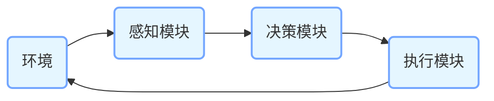

# 开发具有持续适应能力的AI Agent

> 关键词：AI Agent、持续适应能力、强化学习、元学习、自适应算法、环境感知、智能体进化

> 摘要：本文围绕开发具有持续适应能力的AI Agent展开深入探讨。首先介绍了相关背景知识，包括开发目的、预期读者和文档结构等。接着阐述了AI Agent、持续适应能力等核心概念及其联系，给出了原理和架构的文本示意图与Mermaid流程图。详细讲解了核心算法原理，用Python源代码进行说明，并介绍了相关数学模型和公式。通过项目实战展示了开发环境搭建、源代码实现与解读。分析了实际应用场景，推荐了学习资源、开发工具框架以及相关论文著作。最后总结了未来发展趋势与挑战，提供了常见问题解答和扩展阅读参考资料，旨在为开发者和研究者提供全面的指导，助力开发出更具适应性和智能性的AI Agent。

## 1. 背景介绍 
### 1.1 目的和范围
在当今复杂多变的环境中，传统的AI系统往往难以应对动态变化的任务和场景。开发具有持续适应能力的AI Agent的目的在于让智能体能够在不断变化的环境中持续学习、调整自身策略，以实现最优的性能表现。其范围涵盖了多个领域，如机器人控制、自动驾驶、智能游戏、金融投资等，旨在为各种需要智能决策和实时响应的场景提供有效的解决方案。

### 1.2 预期读者
本文预期读者包括人工智能领域的研究者、开发者、软件工程师、对AI Agent技术感兴趣的学生以及相关行业的从业者。无论您是初学者希望了解基础知识，还是有一定经验的专业人士寻求技术突破，都能从本文中获得有价值的信息。

### 1.3 文档结构概述
本文将按照以下结构展开：首先介绍背景知识，包括目的、读者和文档结构等；接着阐述核心概念及其联系，用示意图和流程图辅助理解；然后详细讲解核心算法原理和具体操作步骤，结合Python代码；再介绍相关数学模型和公式，并举例说明；通过项目实战展示开发过程和代码解读；分析实际应用场景；推荐学习资源、开发工具框架和相关论文著作；最后总结未来发展趋势与挑战，提供常见问题解答和扩展阅读参考资料。

### 1.4 术语表
#### 1.4.1 核心术语定义
- **AI Agent（人工智能智能体）**：是一个能够感知环境、做出决策并采取行动的实体，它可以是软件程序、机器人或其他智能设备。
- **持续适应能力**：指AI Agent在不断变化的环境中，能够持续学习、调整自身行为和策略，以保持良好性能的能力。
- **强化学习**：一种机器学习方法，智能体通过与环境进行交互，根据环境反馈的奖励信号来学习最优策略。
- **元学习**：也称为“学习如何学习”，旨在让智能体能够快速适应新任务，通过学习在不同任务上的通用学习策略。

#### 1.4.2 相关概念解释
- **环境感知**：AI Agent通过各种传感器获取环境信息的过程，包括视觉、听觉、触觉等多种感知方式。
- **策略更新**：根据环境反馈和学习算法，对AI Agent的决策策略进行调整和优化的过程。
- **智能体进化**：随着时间的推移，AI Agent通过不断学习和适应，其性能和能力逐渐提升的过程。

#### 1.4.3 缩略词列表
- **RL**：Reinforcement Learning（强化学习）
- **ML**：Machine Learning（机器学习）
- **MAML**：Model-Agnostic Meta-Learning（模型无关元学习）

## 2. 核心概念与联系 

### 核心概念原理
#### AI Agent
AI Agent是一个具有自主性和智能性的实体，它由感知模块、决策模块和执行模块组成。感知模块负责收集环境信息，决策模块根据感知到的信息和自身的策略进行决策，执行模块将决策转化为实际行动。例如，在一个机器人导航任务中，机器人的摄像头和激光雷达等传感器是感知模块，算法根据传感器数据计算出路径是决策模块，机器人的电机驱动其移动是执行模块。

#### 持续适应能力
持续适应能力的核心在于让AI Agent能够在环境变化时及时调整自己的行为和策略。这需要智能体具备良好的学习能力和灵活性。例如，在一个自动驾驶汽车的场景中，当道路状况、交通规则或天气条件发生变化时，自动驾驶系统能够快速适应并做出正确的决策。

### 架构的文本示意图
AI Agent的架构可以表示为一个循环结构：环境 -> 感知模块 -> 决策模块 -> 执行模块 -> 环境。感知模块从环境中获取信息，传递给决策模块，决策模块根据信息生成决策，执行模块将决策转化为行动作用于环境，环境再反馈新的信息给感知模块，如此循环。

### Mermaid流程图


## 3. 核心算法原理 & 具体操作步骤 

### 强化学习算法原理
强化学习的基本思想是智能体通过与环境进行交互，根据环境反馈的奖励信号来学习最优策略。智能体的目标是最大化长期累积奖励。以下是一个简单的强化学习算法示例，使用Q-learning算法。

```python
import numpy as np

# 定义环境参数
num_states = 10
num_actions = 4
gamma = 0.9  # 折扣因子
alpha = 0.1  # 学习率

# 初始化Q表
Q = np.zeros((num_states, num_actions))

# 定义环境交互函数
def get_reward(state, action):
    # 简单示例，根据状态和动作返回奖励
    if state == 5 and action == 2:
        return 10
    else:
        return -1

# Q-learning算法
def q_learning(num_episodes):
    for episode in range(num_episodes):
        state = np.random.randint(0, num_states)  # 随机初始化状态
        done = False
        while not done:
            # 选择动作
            if np.random.uniform(0, 1) < 0.1:  # 探索率
                action = np.random.randint(0, num_actions)
            else:
                action = np.argmax(Q[state, :])

            # 执行动作，获取奖励和下一个状态
            reward = get_reward(state, action)
            next_state = np.random.randint(0, num_states)

            # 更新Q表
            Q[state, action] = Q[state, action] + alpha * (reward + gamma * np.max(Q[next_state, :]) - Q[state, action])

            # 判断是否结束
            if state == 5 and action == 2:
                done = True
            state = next_state

    return Q

# 训练模型
Q = q_learning(1000)
print(Q)
```

### 具体操作步骤
1. **环境定义**：明确智能体所处的环境，包括状态空间、动作空间和奖励函数。
2. **初始化**：初始化Q表或其他学习参数。
3. **训练循环**：在每个训练周期中，智能体选择动作，与环境交互，获取奖励和下一个状态，然后更新学习参数。
4. **策略评估**：在训练过程中，定期评估智能体的性能，根据评估结果调整训练参数。

### 元学习算法原理
元学习的目标是让智能体能够快速适应新任务。一种常见的元学习算法是MAML（Model-Agnostic Meta-Learning）。MAML的核心思想是在多个任务上进行训练，找到一个初始参数，使得在新任务上进行少量的梯度更新就能快速收敛到较好的性能。

以下是一个简化的MAML算法的Python示例：

```python
import torch
import torch.nn as nn
import torch.optim as optim

# 定义一个简单的神经网络模型
class SimpleNet(nn.Module):
    def __init__(self):
        super(SimpleNet, self).__init__()
        self.fc1 = nn.Linear(10, 20)
        self.fc2 = nn.Linear(20, 1)

    def forward(self, x):
        x = torch.relu(self.fc1(x))
        x = self.fc2(x)
        return x

# 定义元学习函数
def maml(num_tasks, num_inner_steps, inner_lr, meta_lr):
    model = SimpleNet()
    meta_optimizer = optim.Adam(model.parameters(), lr=meta_lr)

    for task in range(num_tasks):
        # 复制模型参数
        fast_weights = list(model.parameters())

        # 内循环更新
        for inner_step in range(num_inner_steps):
            # 生成任务数据
            x = torch.randn(10)
            y = torch.randn(1)

            # 前向传播
            output = model(x)
            loss = nn.MSELoss()(output, y)

            # 计算梯度
            gradients = torch.autograd.grad(loss, fast_weights)

            # 更新快速权重
            fast_weights = [w - inner_lr * g for w, g in zip(fast_weights, gradients)]

        # 元更新
        x = torch.randn(10)
        y = torch.randn(1)
        output = model(x)
        loss = nn.MSELoss()(output, y)

        meta_optimizer.zero_grad()
        loss.backward()
        meta_optimizer.step()

    return model

# 训练模型
model = maml(100, 5, 0.01, 0.001)
```

### 具体操作步骤
1. **任务生成**：生成多个不同的任务，每个任务有自己的数据和目标。
2. **内循环更新**：在每个任务上进行少量的梯度更新，得到快速权重。
3. **元更新**：根据所有任务的快速权重，更新模型的元参数。
4. **重复训练**：重复上述步骤，直到模型收敛。

## 4. 数学模型和公式 & 详细讲解 & 举例说明 

### 强化学习数学模型
在强化学习中，智能体与环境的交互可以用马尔可夫决策过程（MDP）来描述。MDP由一个五元组 $<S, A, P, R, \gamma>$ 组成，其中：
- $S$ 是状态空间，表示环境的所有可能状态。
- $A$ 是动作空间，表示智能体可以采取的所有可能动作。
- $P(s'|s, a)$ 是状态转移概率，表示在状态 $s$ 采取动作 $a$ 后转移到状态 $s'$ 的概率。
- $R(s, a, s')$ 是奖励函数，表示在状态 $s$ 采取动作 $a$ 转移到状态 $s'$ 时获得的奖励。
- $\gamma$ 是折扣因子，用于平衡短期奖励和长期奖励。

智能体的目标是找到一个策略 $\pi(a|s)$，使得长期累积奖励最大化。长期累积奖励可以表示为：

$$G_t = \sum_{k=0}^{\infty} \gamma^k R_{t+k+1}$$

Q-learning算法通过更新Q值来学习最优策略，Q值表示在状态 $s$ 采取动作 $a$ 后的期望累积奖励。Q值的更新公式为：

$$Q(s, a) \leftarrow Q(s, a) + \alpha [R(s, a, s') + \gamma \max_{a'} Q(s', a') - Q(s, a)]$$

其中，$\alpha$ 是学习率。

### 举例说明
假设有一个简单的网格世界环境，智能体的目标是从起点到达终点。状态空间 $S$ 是网格的所有位置，动作空间 $A$ 是上下左右四个方向。奖励函数 $R$ 可以定义为：到达终点获得正奖励，撞到墙壁或边界获得负奖励，其他情况奖励为0。通过Q-learning算法，智能体可以学习到从起点到终点的最优路径。

### 元学习数学模型
MAML的目标是找到一个初始参数 $\theta$，使得在新任务上进行少量的梯度更新就能快速收敛到较好的性能。设 $L_{T_i}(\theta')$ 表示在任务 $T_i$ 上的损失函数，$\theta'$ 是在任务 $T_i$ 上进行一次梯度更新后的参数。MAML的优化目标可以表示为：

$$\min_{\theta} \sum_{T_i} L_{T_i}(\theta - \alpha \nabla_{\theta} L_{T_i}(\theta))$$

其中，$\alpha$ 是内循环的学习率。

### 举例说明
假设有多个回归任务，每个任务有不同的数据集。MAML通过在这些任务上进行训练，找到一个初始参数 $\theta$，使得在新的回归任务上，只需要进行少量的梯度更新就能得到较好的预测结果。

## 5. 项目实战：代码实际案例和详细解释说明 

### 5.1  开发环境搭建
#### 安装Python
首先需要安装Python环境，建议使用Python 3.7及以上版本。可以从Python官方网站（https://www.python.org/downloads/） 下载安装包进行安装。

#### 安装相关库
使用pip命令安装所需的库，如numpy、torch等。

```bash
pip install numpy torch
```

### 5.2  源代码详细实现和代码解读
以下是一个结合强化学习和元学习的项目示例，实现一个智能体在不同环境中持续适应的任务。

```python
import numpy as np
import torch
import torch.nn as nn
import torch.optim as optim

# 定义环境类
class Environment:
    def __init__(self, num_states, num_actions):
        self.num_states = num_states
        self.num_actions = num_actions
        self.state = np.random.randint(0, num_states)

    def step(self, action):
        # 简单示例，随机转移状态并返回奖励
        next_state = np.random.randint(0, self.num_states)
        if next_state == 5:
            reward = 10
        else:
            reward = -1
        self.state = next_state
        return next_state, reward

# 定义神经网络模型
class PolicyNetwork(nn.Module):
    def __init__(self, num_states, num_actions):
        super(PolicyNetwork, self).__init__()
        self.fc1 = nn.Linear(num_states, 20)
        self.fc2 = nn.Linear(20, num_actions)

    def forward(self, x):
        x = torch.relu(self.fc1(x))
        x = self.fc2(x)
        return x

# 强化学习训练函数
def reinforce(env, model, num_episodes, gamma, lr):
    optimizer = optim.Adam(model.parameters(), lr=lr)
    for episode in range(num_episodes):
        states = []
        actions = []
        rewards = []
        state = env.state
        done = False
        while not done:
            state_tensor = torch.FloatTensor([state])
            action_probs = torch.softmax(model(state_tensor), dim=0)
            action = torch.multinomial(action_probs, 1).item()
            next_state, reward = env.step(action)
            states.append(state)
            actions.append(action)
            rewards.append(reward)
            state = next_state
            if next_state == 5:
                done = True

        # 计算累积奖励
        R = 0
        returns = []
        for r in reversed(rewards):
            R = r + gamma * R
            returns.insert(0, R)
        returns = torch.FloatTensor(returns)

        # 计算损失
        states = torch.FloatTensor(states)
        actions = torch.LongTensor(actions)
        action_probs = torch.softmax(model(states), dim=1)
        log_probs = torch.log(action_probs.gather(1, actions.unsqueeze(1)).squeeze(1))
        loss = -log_probs * returns
        loss = loss.sum()

        # 更新模型
        optimizer.zero_grad()
        loss.backward()
        optimizer.step()

    return model

# 元学习训练函数
def meta_learning(num_tasks, num_inner_steps, inner_lr, meta_lr):
    model = PolicyNetwork(10, 4)
    meta_optimizer = optim.Adam(model.parameters(), lr=meta_lr)

    for task in range(num_tasks):
        # 复制模型参数
        fast_weights = list(model.parameters())

        # 内循环更新
        env = Environment(10, 4)
        for inner_step in range(num_inner_steps):
            model_copy = PolicyNetwork(10, 4)
            model_copy.load_state_dict(model.state_dict())
            model_copy = reinforce(env, model_copy, 10, 0.9, inner_lr)

            # 计算梯度
            gradients = []
            for w1, w2 in zip(model.parameters(), model_copy.parameters()):
                gradients.append((w2 - w1) / inner_lr)

            # 更新快速权重
            fast_weights = [w - inner_lr * g for w, g in zip(fast_weights, gradients)]

        # 元更新
        env = Environment(10, 4)
        model_copy = PolicyNetwork(10, 4)
        model_copy.load_state_dict(model.state_dict())
        model_copy = reinforce(env, model_copy, 10, 0.9, inner_lr)

        loss = 0
        for w1, w2 in zip(model.parameters(), model_copy.parameters()):
            loss += ((w2 - w1) ** 2).sum()

        meta_optimizer.zero_grad()
        loss.backward()
        meta_optimizer.step()

    return model

# 训练模型
model = meta_learning(100, 5, 0.01, 0.001)
```

### 5.3  代码解读与分析
- **环境类**：`Environment` 类定义了智能体所处的环境，包括状态空间、动作空间和状态转移规则。
- **神经网络模型**：`PolicyNetwork` 类定义了一个简单的神经网络，用于学习智能体的策略。
- **强化学习训练函数**：`reinforce` 函数实现了强化学习的训练过程，通过与环境交互，计算累积奖励并更新模型参数。
- **元学习训练函数**：`meta_learning` 函数实现了元学习的训练过程，在多个任务上进行训练，找到一个初始参数，使得在新任务上能够快速适应。

通过结合强化学习和元学习，智能体可以在不同的环境中持续适应，不断提升自己的性能。

## 6. 实际应用场景 

### 机器人控制
在机器人控制领域，具有持续适应能力的AI Agent可以让机器人在不同的工作场景中自动调整行为和策略。例如，在工业生产线上，机器人需要根据不同的产品类型和生产任务进行操作；在服务机器人领域，机器人需要根据不同的用户需求和环境变化提供个性化的服务。

### 自动驾驶
自动驾驶汽车需要在复杂多变的道路环境中行驶，包括不同的交通规则、天气条件和道路状况。具有持续适应能力的AI Agent可以让自动驾驶汽车快速适应这些变化，做出正确的决策，提高行驶安全性和效率。

### 智能游戏
在智能游戏中，AI Agent需要与玩家进行对抗或合作。随着玩家策略的变化，AI Agent需要不断调整自己的策略，以保持竞争力。例如，在电子竞技游戏中，AI Agent可以学习玩家的游戏风格，制定相应的战术。

### 金融投资
在金融投资领域，市场环境不断变化，具有持续适应能力的AI Agent可以根据市场数据和经济形势的变化，实时调整投资策略，降低风险，提高收益。

## 7. 工具和资源推荐
### 7.1 学习资源推荐
#### 7.1.1 书籍推荐
- 《强化学习：原理与Python实现》：详细介绍了强化学习的基本原理和算法，通过Python代码实现了多个实例。
- 《元学习：理论与实践》：系统阐述了元学习的理论和方法，提供了丰富的研究案例和实验结果。
- 《人工智能：一种现代方法》：经典的人工智能教材，涵盖了AI Agent、机器学习等多个领域的知识。

#### 7.1.2 在线课程
- Coursera上的“强化学习专项课程”：由知名学者授课，讲解了强化学习的基本概念、算法和应用。
- edX上的“元学习基础”：介绍了元学习的基本原理和最新研究成果。
- 哔哩哔哩上的“人工智能入门教程”：适合初学者，通过通俗易懂的方式讲解人工智能的基础知识。

#### 7.1.3 技术博客和网站
- OpenAI官方博客：提供了人工智能领域的最新研究成果和技术动态。
- Medium上的AI相关博客：有许多专业人士分享的关于AI Agent、强化学习和元学习的文章。
- 机器之心：专注于人工智能领域的资讯和技术分析，提供了丰富的学习资源和案例。

### 7.2 开发工具框架推荐
#### 7.2.1 IDE和编辑器
- PyCharm：功能强大的Python集成开发环境，提供了代码编辑、调试、版本控制等多种功能。
- Jupyter Notebook：交互式的开发环境，适合进行数据探索和模型实验。
- Visual Studio Code：轻量级的代码编辑器，支持多种编程语言和插件扩展。

#### 7.2.2 调试和性能分析工具
- TensorBoard：用于可视化深度学习模型的训练过程和性能指标。
- Py-Spy：Python性能分析工具，可以帮助开发者找出代码中的性能瓶颈。
- cProfile：Python内置的性能分析模块，可以分析代码的执行时间和函数调用关系。

#### 7.2.3 相关框架和库
- PyTorch：开源的深度学习框架，提供了丰富的神经网络模型和优化算法。
- TensorFlow：广泛使用的深度学习框架，具有高效的分布式计算能力。
- Gym：OpenAI开发的强化学习环境库，提供了多种标准的强化学习任务。

### 7.3 相关论文著作推荐
#### 7.3.1 经典论文
- “Reinforcement Learning: An Introduction”：强化学习领域的经典著作，系统介绍了强化学习的基本理论和算法。
- “Model-Agnostic Meta-Learning for Fast Adaptation of Deep Networks”：提出了MAML算法，开创了元学习的先河。
- “Proximal Policy Optimization Algorithms”：介绍了近端策略优化算法，是强化学习中的重要算法之一。

#### 7.3.2 最新研究成果
- 每年的NeurIPS、ICML、AAAI等人工智能顶级会议上的相关论文，展示了AI Agent、强化学习和元学习的最新研究成果。
- arXiv预印本平台上的相关论文，提供了最新的研究进展和技术思路。

#### 7.3.3 应用案例分析
- 一些知名企业和研究机构发布的技术报告和案例分析，如谷歌、微软、OpenAI等，介绍了AI Agent在实际应用中的经验和成果。

## 8. 总结：未来发展趋势与挑战

### 未来发展趋势
- **多模态感知与融合**：未来的AI Agent将具备更强大的多模态感知能力，能够融合视觉、听觉、触觉等多种信息，更好地理解环境。
- **群体智能与协作**：多个AI Agent之间的协作和群体智能将成为研究热点，通过协作可以完成更复杂的任务。
- **跨领域应用**：AI Agent将在更多领域得到应用，如医疗、教育、农业等，为社会发展带来更大的价值。

### 挑战
- **计算资源需求**：开发具有持续适应能力的AI Agent需要大量的计算资源，如何降低计算成本是一个挑战。
- **数据隐私与安全**：在收集和使用环境数据时，需要保障数据的隐私和安全，防止数据泄露和滥用。
- **可解释性和可靠性**：AI Agent的决策过程往往是黑盒的，如何提高其可解释性和可靠性是一个亟待解决的问题。

## 9. 附录：常见问题与解答

### 问题1：如何选择合适的强化学习算法？
答：选择合适的强化学习算法需要考虑任务的特点、状态空间和动作空间的大小、是否有模型信息等因素。例如，对于离散动作空间的任务，可以选择Q-learning、SARSA等算法；对于连续动作空间的任务，可以选择Actor-Critic、DDPG等算法。

### 问题2：元学习和传统机器学习有什么区别？
答：传统机器学习通常在固定的数据集上进行训练，模型的泛化能力有限。而元学习的目标是让模型能够快速适应新任务，通过学习在不同任务上的通用学习策略，提高模型的适应性和泛化能力。

### 问题3：如何评估AI Agent的持续适应能力？
答：可以通过在不同的环境或任务上测试AI Agent的性能，观察其在环境变化时的适应速度和性能表现。常用的评估指标包括累积奖励、成功率、收敛速度等。

## 10. 扩展阅读 & 参考资料
- Sutton, R. S., & Barto, A. G. (2018). Reinforcement Learning: An Introduction. MIT press.
- Finn, C., Abbeel, P., & Levine, S. (2017). Model-agnostic meta-learning for fast adaptation of deep networks. In Proceedings of the 34th International Conference on Machine Learning-Volume 70 (pp. 1126-1135). JMLR. org.
- Schulman, J., Wolski, F., Dhariwal, P., Radford, A., & Klimov, O. (2017). Proximal policy optimization algorithms. arXiv preprint arXiv:1707.06347.
- OpenAI Gym官方文档：https://gym.openai.com/
- PyTorch官方文档：https://pytorch.org/docs/stable/index.html
- TensorFlow官方文档：https://www.tensorflow.org/api_docs