# 开发具有隐私保护联邦学习能力的AI Agent

> 关键词：隐私保护、联邦学习、AI Agent、数据安全、分布式学习、人工智能、机器学习

> 摘要：本文聚焦于开发具有隐私保护联邦学习能力的AI Agent。首先介绍了相关背景，包括目的、预期读者等内容。接着深入阐述核心概念与联系，剖析联邦学习与AI Agent结合的原理和架构。详细讲解核心算法原理，给出Python源代码示例。通过数学模型和公式进一步揭示其内在机制，并举例说明。在项目实战部分，从开发环境搭建到源代码实现与解读，全面展示开发过程。探讨实际应用场景，推荐相关工具和资源。最后总结未来发展趋势与挑战，解答常见问题，并提供扩展阅读和参考资料，旨在为开发者提供全面且深入的技术指导，推动具有隐私保护联邦学习能力的AI Agent的发展。

## 1. 背景介绍

### 1.1 目的和范围

在当今数字化时代，数据的[](https://)重要性日益凸显，同时数据隐私和安全问题也备受关注。传统的机器学习方法通常需要将数据集中到一个中心节点进行训练，这可能会导致数据隐私泄露的风险。联邦学习作为一种新兴的机器学习范式，允许在不共享原始数据的情况下进行模型训练，从而有效保护数据隐私。AI Agent作为一种具有自主决策和行动能力的智能体，在各个领域有着广泛的应用前景。将隐私保护联邦学习能力融入AI Agent中，可以使AI Agent在处理敏感数据时更加安全可靠，同时充分利用分布式数据进行模型训练，提高模型的性能和泛化能力。

本文的范围主要涵盖具有隐私保护联邦学习能力的AI Agent的核心概念、算法原理、数学模型、项目实战、实际应用场景、工具资源推荐等方面，旨在为开发者提供一个全面且深入的技术指南，帮助他们开发出高质量的具有隐私保护联邦学习能力的AI Agent。

### 1.2 预期读者

本文预期读者包括但不限于以下几类人群：

- **人工智能开发者**：希望了解和掌握隐私保护联邦学习与AI Agent结合的技术，用于开发更安全、更智能的AI系统。
- **数据科学家**：对数据隐私保护和分布式学习感兴趣，希望将联邦学习技术应用到实际的数据挖掘和分析任务中。
- **研究人员**：从事人工智能、机器学习、数据安全等领域的研究，希望深入了解具有隐私保护联邦学习能力的AI Agent的理论和实践。
- **企业技术决策者**：关注企业数据安全和智能化发展，希望通过引入具有隐私保护联邦学习能力的AI Agent来提升企业的竞争力和数据价值。

### 1.3 文档结构概述

本文将按照以下结构进行组织：

- **核心概念与联系**：介绍联邦学习、AI Agent、隐私保护等核心概念，以及它们之间的联系和结合方式。
- **核心算法原理 & 具体操作步骤**：详细讲解联邦学习的核心算法原理，给出Python源代码示例，并说明具体的操作步骤。
- **数学模型和公式 & 详细讲解 & 举例说明**：通过数学模型和公式揭示联邦学习的内在机制，并举例说明其应用。
- **项目实战：代码实际案例和详细解释说明**：从开发环境搭建到源代码实现与解读，全面展示开发具有隐私保护联邦学习能力的AI Agent的过程。
- **实际应用场景**：探讨具有隐私保护联邦学习能力的AI Agent在不同领域的实际应用场景。
- **工具和资源推荐**：推荐相关的学习资源、开发工具框架和论文著作。
- **总结：未来发展趋势与挑战**：总结具有隐私保护联邦学习能力的AI Agent的未来发展趋势和面临的挑战。
- **附录：常见问题与解答**：解答读者在开发过程中可能遇到的常见问题。
- **扩展阅读 & 参考资料**：提供相关的扩展阅读和参考资料，方便读者进一步深入学习。

### 1.4 术语表

#### 1.4.1 核心术语定义

- **联邦学习（Federated Learning）**：一种分布式机器学习技术，允许多个参与方在不共享原始数据的情况下进行模型训练，通过交换模型参数或梯度来协作提升模型性能。
- **AI Agent（人工智能智能体）**：一种能够感知环境、自主决策并采取行动的智能实体，通常基于机器学习和人工智能算法实现。
- **隐私保护（Privacy Protection）**：采取一系列技术和措施，确保数据在收集、存储、传输和使用过程中的隐私性和安全性，防止数据泄露和滥用。
- **模型参数（Model Parameters）**：机器学习模型中的可学习变量，通过训练过程不断调整以优化模型性能。
- **梯度（Gradient）**：函数在某一点的导数，表示函数在该点的变化率，在机器学习中常用于优化模型参数。

#### 1.4.2 相关概念解释

- **分布式学习（Distributed Learning）**：将机器学习任务分布在多个计算节点上进行，通过协作完成模型训练，提高计算效率和可扩展性。
- **同态加密（Homomorphic Encryption）**：一种特殊的加密技术，允许在加密数据上进行特定的计算，而无需先解密数据，从而实现数据隐私保护。
- **差分隐私（Differential Privacy）**：一种用于保护数据隐私的数学框架，通过在数据中添加噪声来掩盖个体信息，同时保证数据的统计特性不受影响。

#### 1.4.3 缩略词列表

- **FL**：Federated Learning（联邦学习）
- **AI**：Artificial Intelligence（人工智能）
- **DP**：Differential Privacy（差分隐私）
- **HE**：Homomorphic Encryption（同态加密）

## 2. 核心概念与联系

### 2.1 联邦学习的原理

联邦学习是一种分布式机器学习技术，其核心思想是在不共享原始数据的情况下，多个参与方（如客户端、服务器）通过协作来训练一个共享的机器学习模型。联邦学习主要分为横向联邦学习、纵向联邦学习和联邦迁移学习三种类型。

横向联邦学习适用于参与方的数据特征空间相同但样本空间不同的情况。例如，不同地区的银行拥有相似的客户特征（如年龄、收入等），但客户群体不同。在横向联邦学习中，各个参与方在本地使用自己的数据训练模型，然后将模型参数或梯度上传到服务器，服务器对这些参数或梯度进行聚合，得到全局模型，再将全局模型下发给各个参与方进行下一轮训练。

纵向联邦学习适用于参与方的数据样本空间相同但特征空间不同的情况。例如，一家电商平台拥有用户的购物行为数据，而一家金融机构拥有用户的信用数据，双方可以在不共享原始数据的情况下，通过纵向联邦学习协作训练一个预测用户购买能力的模型。

联邦迁移学习适用于参与方的数据特征空间和样本空间都不同的情况，通过迁移学习的方法，利用不同领域的数据来提升模型性能。

### 2.2 AI Agent的概念

AI Agent是一种能够感知环境、自主决策并采取行动的智能实体。它通常由感知模块、决策模块和行动模块组成。感知模块负责收集环境信息，决策模块根据感知到的信息和自身的目标进行决策，行动模块根据决策结果执行相应的行动。AI Agent可以应用于各种领域，如机器人、自动驾驶、智能客服等。

### 2.3 隐私保护的重要性

在数据驱动的时代，数据隐私和安全是至关重要的。传统的机器学习方法通常需要将数据集中到一个中心节点进行训练，这可能会导致数据隐私泄露的风险。例如，医疗数据、金融数据等敏感数据包含大量个人隐私信息，如果这些数据被泄露，可能会给用户带来严重的损失。因此，在开发AI Agent时，需要采取有效的隐私保护措施，确保数据的安全性和隐私性。

### 2.4 联邦学习与AI Agent的结合

将联邦学习与AI Agent结合，可以使AI Agent在处理敏感数据时更加安全可靠。AI Agent可以作为联邦学习的参与方，在本地使用自己的数据训练模型，然后将模型参数或梯度上传到服务器进行聚合。这样，AI Agent在不共享原始数据的情况下，就可以利用其他参与方的数据来提升自己的性能。同时，通过隐私保护技术，可以进一步确保数据的安全性和隐私性。

### 2.5 核心概念架构的文本示意图

具有隐私保护联邦学习能力的AI Agent的架构主要包括以下几个部分：

- **客户端（AI Agent）**：负责感知环境、收集数据、在本地训练模型，并将模型参数或梯度上传到服务器。
- **服务器**：负责接收客户端上传的模型参数或梯度，进行聚合操作，得到全局模型，并将全局模型下发给客户端。
- **隐私保护模块**：采用同态加密、差分隐私等技术，确保数据在传输和处理过程中的隐私性和安全性。

### 2.6 Mermaid流程图

```mermaid
graph LR
    classDef startend fill:#F5EBFF,stroke:#BE8FED,stroke-width:2px;
    classDef process fill:#E5F6FF,stroke:#73A6FF,stroke-width:2px;
    classDef decision fill:#FFF6CC,stroke:#FFBC52,stroke-width:2px;
  
    A([开始]):::startend --> B(客户端感知环境收集数据):::process
    B --> C(客户端在本地训练模型):::process
    C --> D{是否满足上传条件}:::decision
    D -- 是 --> E(客户端对模型参数或梯度加密):::process
    E --> F(客户端上传加密后的参数或梯度到服务器):::process
    F --> G(服务器接收并解密参数或梯度):::process
    G --> H(服务器聚合参数或梯度得到全局模型):::process
    H --> I(服务器对全局模型加密):::process
    I --> J(服务器下发加密后的全局模型到客户端):::process
    J --> K(客户端接收并解密全局模型):::process
    K --> L(客户端使用全局模型更新本地模型):::process
    L --> M(客户端执行行动):::process
    M --> N(客户端继续感知环境收集数据):::process
    N --> C
    D -- 否 --> C
```



## 3. 核心算法原理 & 具体操作步骤

### 3.1 联邦平均算法（Federated Averaging, FedAvg）原理

联邦平均算法是一种经典的联邦学习算法，其基本思想是通过多次迭代，在客户端和服务器之间交换模型参数，逐步优化全局模型。具体步骤如下：

1. **初始化**：服务器初始化一个全局模型，并将其下发给所有客户端。
2. **本地训练**：每个客户端在本地使用自己的数据训练模型，更新模型参数。
3. **上传参数**：客户端将本地训练后的模型参数上传到服务器。
4. **参数聚合**：服务器对所有客户端上传的模型参数进行加权平均，得到全局模型的更新参数。
5. **下发全局模型**：服务器将更新后的全局模型下发给所有客户端。
6. **重复步骤2 - 5**：直到满足停止条件（如达到最大迭代次数、模型收敛等）。

### 3.2 Python源代码实现

```python
import torch
import torch.nn as nn
import torch.optim as optim
from torch.utils.data import DataLoader, Dataset

# 定义一个简单的神经网络模型
class SimpleNet(nn.Module):
    def __init__(self):
        super(SimpleNet, self).__init__()
        self.fc1 = nn.Linear(10, 20)
        self.fc2 = nn.Linear(20, 1)

    def forward(self, x):
        x = torch.relu(self.fc1(x))
        x = self.fc2(x)
        return x

# 定义本地数据集
class LocalDataset(Dataset):
    def __init__(self, data, labels):
        self.data = data
        self.labels = labels

    def __len__(self):
        return len(self.data)

    def __getitem__(self, idx):
        return self.data[idx], self.labels[idx]

# 本地训练函数
def local_train(model, local_data, epochs, lr):
    criterion = nn.MSELoss()
    optimizer = optim.SGD(model.parameters(), lr=lr)
    dataloader = DataLoader(local_data, batch_size=10, shuffle=True)
    for epoch in range(epochs):
        for inputs, labels in dataloader:
            optimizer.zero_grad()
            outputs = model(inputs)
            loss = criterion(outputs, labels)
            loss.backward()
            optimizer.step()
    return model.state_dict()

# 服务器聚合函数
def server_aggregate(client_states):
    num_clients = len(client_states)
    global_state = client_states[0].copy()
    for key in global_state.keys():
        for i in range(1, num_clients):
            global_state[key] += client_states[i][key]
        global_state[key] = torch.div(global_state[key], num_clients)
    return global_state

# 联邦学习主函数
def federated_learning(num_clients, num_rounds, local_epochs, lr):
    # 初始化全局模型
    global_model = SimpleNet()
    global_state = global_model.state_dict()

    # 模拟客户端数据
    client_datasets = []
    for _ in range(num_clients):
        data = torch.randn(100, 10)
        labels = torch.randn(100, 1)
        client_datasets.append(LocalDataset(data, labels))

    for round in range(num_rounds):
        client_states = []
        for client_id in range(num_clients):
            # 客户端下载全局模型
            local_model = SimpleNet()
            local_model.load_state_dict(global_state)
            # 本地训练
            local_state = local_train(local_model, client_datasets[client_id], local_epochs, lr)
            client_states.append(local_state)
        # 服务器聚合
        global_state = server_aggregate(client_states)
        # 更新全局模型
        global_model.load_state_dict(global_state)

    return global_model
```

### 3.3 具体操作步骤

1. **初始化环境**：安装必要的Python库，如`torch`、`torchvision`等。
2. **定义模型**：根据具体任务需求，定义一个合适的神经网络模型，如上述代码中的`SimpleNet`。
3. **准备数据**：将数据分配到各个客户端，每个客户端拥有自己的本地数据集。
4. **设置参数**：设置联邦学习的参数，如客户端数量、迭代轮数、本地训练轮数、学习率等。
5. **执行联邦学习**：调用`federated_learning`函数，开始进行联邦学习训练。
6. **评估模型**：训练完成后，使用测试数据对全局模型进行评估，检查模型的性能。

## 4. 数学模型和公式 & 详细讲解 & 举例说明

### 4.1 联邦平均算法的数学模型

设共有 $K$ 个客户端，第 $k$ 个客户端的本地数据集为 $\mathcal{D}_k$，数据集大小为 $n_k$，总数据集大小为 $N = \sum_{k=1}^{K} n_k$。全局模型的参数为 $\theta$，第 $k$ 个客户端在第 $t$ 轮迭代时的本地模型参数为 $\theta_k^t$。

#### 本地训练阶段

在第 $t$ 轮迭代中，第 $k$ 个客户端在本地使用自己的数据集 $\mathcal{D}_k$ 进行 $E$ 轮训练，更新本地模型参数 $\theta_k^t$。本地训练的目标是最小化本地损失函数 $L_k(\theta)$，通常采用随机梯度下降（SGD）算法进行优化：

$$
\theta_k^{t+1} \leftarrow \theta_k^t - \eta \nabla L_k(\theta_k^t)
$$

其中，$\eta$ 是学习率，$\nabla L_k(\theta_k^t)$ 是本地损失函数 $L_k(\theta)$ 在 $\theta_k^t$ 处的梯度。

#### 服务器聚合阶段

服务器收集所有客户端上传的本地模型参数 $\theta_k^{t+1}$，并进行加权平均，得到全局模型的更新参数 $\theta^{t+1}$：

$$
\theta^{t+1} \leftarrow \sum_{k=1}^{K} \frac{n_k}{N} \theta_k^{t+1}
$$

### 4.2 详细讲解

- **本地训练**：每个客户端在本地使用自己的数据训练模型，更新本地模型参数。由于每个客户端的数据是私有的，因此训练过程是在本地进行的，不会泄露数据隐私。
- **服务器聚合**：服务器通过加权平均的方式，将所有客户端的本地模型参数进行聚合，得到全局模型的更新参数。加权平均的权重是每个客户端数据集的大小占总数据集大小的比例，这样可以保证全局模型能够充分利用各个客户端的数据。

### 4.3 举例说明

假设有 3 个客户端，每个客户端的数据集大小分别为 $n_1 = 100$，$n_2 = 200$，$n_3 = 300$，总数据集大小为 $N = n_1 + n_2 + n_3 = 600$。在第 $t$ 轮迭代中，3 个客户端上传的本地模型参数分别为 $\theta_1^t$，$\theta_2^t$，$\theta_3^t$。服务器进行聚合时，全局模型的更新参数 $\theta^{t+1}$ 计算如下：

$$
\theta^{t+1} = \frac{100}{600} \theta_1^t + \frac{200}{600} \theta_2^t + \frac{300}{600} \theta_3^t
$$

## 5. 项目实战：代码实际案例和详细解释说明

### 5.1  开发环境搭建

#### 5.1.1 安装Python

首先，确保你已经安装了Python 3.6或更高版本。可以从Python官方网站（https://www.python.org/downloads/） 下载并安装Python。

#### 5.1.2 创建虚拟环境

为了避免不同项目之间的依赖冲突，建议使用虚拟环境。可以使用`venv`或`conda`来创建虚拟环境。以下是使用`venv`创建虚拟环境的示例：

```bash
python -m venv federated_learning_env
source federated_learning_env/bin/activate  # 激活虚拟环境（Linux/Mac）
federated_learning_env\Scripts\activate  # 激活虚拟环境（Windows）
```

#### 5.1.3 安装依赖库

在激活虚拟环境后，安装必要的依赖库，如`torch`、`torchvision`等。可以使用`pip`来安装：

```bash
pip install torch torchvision
```

### 5.2  源代码详细实现和代码解读

```python
import torch
import torch.nn as nn
import torch.optim as optim
from torch.utils.data import DataLoader, Dataset

# 定义一个简单的神经网络模型
class SimpleNet(nn.Module):
    def __init__(self):
        super(SimpleNet, self).__init__()
        self.fc1 = nn.Linear(10, 20)
        self.fc2 = nn.Linear(20, 1)

    def forward(self, x):
        x = torch.relu(self.fc1(x))
        x = self.fc2(x)
        return x

# 定义本地数据集
class LocalDataset(Dataset):
    def __init__(self, data, labels):
        self.data = data
        self.labels = labels

    def __len__(self):
        return len(self.data)

    def __getitem__(self, idx):
        return self.data[idx], self.labels[idx]

# 本地训练函数
def local_train(model, local_data, epochs, lr):
    criterion = nn.MSELoss()
    optimizer = optim.SGD(model.parameters(), lr=lr)
    dataloader = DataLoader(local_data, batch_size=10, shuffle=True)
    for epoch in range(epochs):
        for inputs, labels in dataloader:
            optimizer.zero_grad()
            outputs = model(inputs)
            loss = criterion(outputs, labels)
            loss.backward()
            optimizer.step()
    return model.state_dict()

# 服务器聚合函数
def server_aggregate(client_states):
    num_clients = len(client_states)
    global_state = client_states[0].copy()
    for key in global_state.keys():
        for i in range(1, num_clients):
            global_state[key] += client_states[i][key]
        global_state[key] = torch.div(global_state[key], num_clients)
    return global_state

# 联邦学习主函数
def federated_learning(num_clients, num_rounds, local_epochs, lr):
    # 初始化全局模型
    global_model = SimpleNet()
    global_state = global_model.state_dict()

    # 模拟客户端数据
    client_datasets = []
    for _ in range(num_clients):
        data = torch.randn(100, 10)
        labels = torch.randn(100, 1)
        client_datasets.append(LocalDataset(data, labels))

    for round in range(num_rounds):
        client_states = []
        for client_id in range(num_clients):
            # 客户端下载全局模型
            local_model = SimpleNet()
            local_model.load_state_dict(global_state)
            # 本地训练
            local_state = local_train(local_model, client_datasets[client_id], local_epochs, lr)
            client_states.append(local_state)
        # 服务器聚合
        global_state = server_aggregate(client_states)
        # 更新全局模型
        global_model.load_state_dict(global_state)

    return global_model

# 运行联邦学习
if __name__ == "__main__":
    num_clients = 3
    num_rounds = 10
    local_epochs = 5
    lr = 0.01
    final_model = federated_learning(num_clients, num_rounds, local_epochs, lr)
    print("联邦学习训练完成，最终模型已生成。")
```

### 5.3  代码解读与分析

- **模型定义**：`SimpleNet` 类定义了一个简单的两层全连接神经网络，用于演示联邦学习的过程。
- **本地数据集**：`LocalDataset` 类定义了本地数据集，用于存储每个客户端的数据和标签。
- **本地训练函数**：`local_train` 函数实现了客户端的本地训练过程，使用随机梯度下降算法更新本地模型参数。
- **服务器聚合函数**：`server_aggregate` 函数实现了服务器的参数聚合过程，将所有客户端上传的本地模型参数进行加权平均，得到全局模型的更新参数。
- **联邦学习主函数**：`federated_learning` 函数实现了联邦学习的主要流程，包括初始化全局模型、模拟客户端数据、进行多轮迭代训练等。
- **主程序**：在主程序中，设置了客户端数量、迭代轮数、本地训练轮数、学习率等参数，调用`federated_learning` 函数进行联邦学习训练，并输出最终模型。

## 6. 实际应用场景

### 6.1 医疗领域

在医疗领域，各个医院拥有大量的患者医疗数据，这些数据包含患者的隐私信息，不能随意共享。通过具有隐私保护联邦学习能力的AI Agent，可以在不共享原始数据的情况下，各个医院协作训练一个疾病诊断模型。每个医院的AI Agent在本地使用自己的患者数据训练模型，然后将模型参数或梯度上传到服务器进行聚合。这样，既可以保护患者的隐私信息，又可以充分利用各个医院的数据，提高疾病诊断模型的准确性和泛化能力。

### 6.2 金融领域

在金融领域，银行、证券、保险等金融机构拥有大量的客户金融数据，这些数据涉及客户的隐私和商业机密。通过具有隐私保护联邦学习能力的AI Agent，金融机构可以协作训练一个风险评估模型。每个金融机构的AI Agent在本地使用自己的客户数据训练模型，然后将模型参数或梯度上传到服务器进行聚合。这样，既可以保护客户的隐私信息和金融机构的商业机密，又可以提高风险评估模型的准确性和可靠性。

### 6.3 智能交通领域

在智能交通领域，各个交通管理部门、汽车制造商、互联网企业等拥有大量的交通数据，如车辆行驶轨迹、交通流量、交通事故等。通过具有隐私保护联邦学习能力的AI Agent，可以在不共享原始数据的情况下，协作训练一个交通流量预测模型、自动驾驶模型等。每个参与方的AI Agent在本地使用自己的数据训练模型，然后将模型参数或梯度上传到服务器进行聚合。这样，既可以保护数据隐私，又可以提高交通系统的智能化水平和运行效率。

### 6.4 物联网领域

在物联网领域，大量的物联网设备产生了海量的数据，如传感器数据、设备状态数据等。这些数据通常包含用户的隐私信息和设备的敏感信息。通过具有隐私保护联邦学习能力的AI Agent，可以在不共享原始数据的情况下，各个物联网设备协作训练一个设备故障预测模型、能源管理模型等。每个物联网设备的AI Agent在本地使用自己的数据训练模型，然后将模型参数或梯度上传到服务器进行聚合。这样，既可以保护用户的隐私信息和设备的敏感信息，又可以提高物联网系统的可靠性和能源利用效率。

## 7. 工具和资源推荐

### 7.1 学习资源推荐

#### 7.1.1 书籍推荐

- 《联邦学习》：全面介绍了联邦学习的理论、算法和应用，是学习联邦学习的经典书籍。
- 《深度学习》：深度学习领域的经典教材，涵盖了深度学习的基本原理、算法和应用，对于理解联邦学习中的机器学习算法有很大帮助。
- 《Python机器学习》：介绍了使用Python进行机器学习的方法和技巧，对于开发具有隐私保护联邦学习能力的AI Agent有很大帮助。

#### 7.1.2 在线课程

- Coursera上的“Deep Learning Specialization”：由深度学习领域的知名学者Andrew Ng教授授课，系统地介绍了深度学习的理论和实践。
- edX上的“Federated Learning for Data Privacy and Confidentiality”：专门介绍了联邦学习的原理、算法和应用，以及如何保护数据隐私和机密性。
- 中国大学MOOC上的“人工智能基础”：介绍了人工智能的基本概念、算法和应用，对于初学者来说是一个很好的入门课程。

#### 7.1.3 技术博客和网站

- 联邦学习官网（https://federatedlearning.org/）：提供了联邦学习的最新研究成果、技术文档和开源项目。
- Medium上的“Towards Data Science”：有很多关于机器学习、深度学习和联邦学习的技术文章和案例分享。
- 知乎上的“人工智能”、“机器学习”、“联邦学习”等话题：有很多专业人士分享的技术经验和见解。

### 7.2 开发工具框架推荐

#### 7.2.1 IDE和编辑器

- PyCharm：一款专业的Python集成开发环境，提供了丰富的代码编辑、调试和项目管理功能。
- Visual Studio Code：一款轻量级的代码编辑器，支持多种编程语言，有丰富的插件可以扩展功能。
- Jupyter Notebook：一种交互式的开发环境，适合进行数据分析、模型训练和实验验证。

#### 7.2.2 调试和性能分析工具

- PyTorch Profiler：PyTorch提供的性能分析工具，可以帮助开发者分析模型训练过程中的性能瓶颈。
- TensorBoard：TensorFlow提供的可视化工具，可以帮助开发者可视化模型训练过程中的损失函数、准确率等指标。
- cProfile：Python内置的性能分析工具，可以帮助开发者分析Python代码的性能瓶颈。

#### 7.2.3 相关框架和库

- TensorFlow Federated：Google开发的联邦学习框架，提供了丰富的联邦学习算法和工具，支持多种深度学习模型。
- PySyft：OpenMined开发的隐私保护深度学习框架，支持联邦学习、同态加密、差分隐私等隐私保护技术。
- Flower：一个通用的联邦学习框架，支持多种机器学习框架和编程语言，易于扩展和定制。

### 7.3 相关论文著作推荐

#### 7.3.1 经典论文

- “Communication-Efficient Learning of Deep Networks from Decentralized Data”：提出了联邦平均算法（FedAvg），是联邦学习领域的经典论文。
- “Differential Privacy: A Survey of Results”：系统地介绍了差分隐私的理论和应用，是差分隐私领域的经典论文。
- “Homomorphic Encryption for Machine Learning: A Survey”：对同态加密在机器学习中的应用进行了全面的综述，是同态加密领域的经典论文。

#### 7.3.2 最新研究成果

- 关注顶级学术会议如NeurIPS、ICML、CVPR等上的相关论文，了解联邦学习和隐私保护领域的最新研究成果。
- 关注知名学术期刊如Journal of Artificial Intelligence Research（JAIR）、Artificial Intelligence等上的相关论文，了解最新的理论和技术进展。

#### 7.3.3 应用案例分析

- 关注各大科技公司和研究机构发布的应用案例，了解具有隐私保护联邦学习能力的AI Agent在实际应用中的经验和教训。
- 参考相关的行业报告和白皮书，了解联邦学习和隐私保护技术在不同行业的应用现状和发展趋势。

## 8. 总结：未来发展趋势与挑战

### 8.1 未来发展趋势

- **技术融合**：未来，具有隐私保护联邦学习能力的AI Agent将与区块链、边缘计算、物联网等技术深度融合，实现更加安全、高效、智能的分布式学习和决策。
- **应用拓展**：随着技术的不断发展，具有隐私保护联邦学习能力的AI Agent将在更多领域得到应用，如教育、能源、农业等，为各个行业的数字化转型和智能化发展提供支持。
- **标准和规范制定**：为了促进具有隐私保护联邦学习能力的AI Agent的健康发展，未来将制定更多的标准和规范，包括数据隐私保护标准、联邦学习协议标准、AI Agent行为规范等。

### 8.2 挑战

- **隐私保护技术的局限性**：目前的隐私保护技术如差分隐私、同态加密等还存在一些局限性，如计算效率低、隐私保护强度与模型性能之间的平衡等问题，需要进一步研究和改进。
- **通信开销和计算资源的限制**：联邦学习需要在客户端和服务器之间频繁交换模型参数或梯度，会产生较大的通信开销和计算资源消耗。在资源受限的环境下，如何提高联邦学习的效率是一个挑战。
- **安全和信任问题**：在联邦学习中，各个参与方之间需要建立安全和信任机制，防止恶意攻击和数据泄露。如何确保联邦学习系统的安全性和可靠性是一个重要的挑战。
- **法律法规和伦理问题**：具有隐私保护联邦学习能力的AI Agent涉及到数据隐私、知识产权、责任归属等法律法规和伦理问题，需要制定相应的法律法规和伦理准则来规范其发展和应用。

## 9. 附录：常见问题与解答

### 9.1 联邦学习与传统机器学习有什么区别？

传统机器学习通常需要将所有数据集中到一个中心节点进行训练，而联邦学习允许在不共享原始数据的情况下，多个参与方通过协作来训练一个共享的机器学习模型。联邦学习可以有效保护数据隐私，同时充分利用分布式数据进行模型训练。

### 9.2 如何选择合适的隐私保护技术？

选择合适的隐私保护技术需要考虑多个因素，如数据的敏感性、计算资源的限制、模型性能的要求等。例如，对于对隐私要求较高的数据，可以选择同态加密技术；对于计算资源有限的场景，可以选择差分隐私技术。

### 9.3 联邦学习的性能如何评估？

联邦学习的性能可以从多个方面进行评估，如模型的准确率、召回率、F1值等指标，以及通信开销、计算时间等效率指标。可以使用测试数据集对全局模型进行评估，同时记录通信开销和计算时间等指标，来综合评估联邦学习的性能。

### 9.4 如何确保联邦学习系统的安全性？

确保联邦学习系统的安全性需要采取多种措施，如使用加密技术保护数据传输和存储，采用安全多方计算技术进行参数聚合，建立安全审计和监控机制等。同时，需要对参与方进行身份认证和授权管理，防止恶意攻击和数据泄露。

## 10. 扩展阅读 & 参考资料

### 10.1 扩展阅读

- 《人工智能：现代方法》：全面介绍了人工智能的基本概念、算法和应用，是人工智能领域的经典教材。
- 《数据挖掘：概念与技术》：介绍了数据挖掘的基本概念、算法和应用，对于理解联邦学习中的数据处理和分析有很大帮助。
- 《区块链技术原理与应用》：介绍了区块链的基本原理、技术和应用，对于了解联邦学习与区块链的融合有很大帮助。

### 10.2 参考资料

- 联邦学习相关的开源项目和代码库，如TensorFlow Federated、PySyft、Flower等。
- 相关的学术论文和研究报告，如NeurIPS、ICML、CVPR等学术会议上的论文，以及各大科技公司和研究机构发布的研究报告。
- 行业标准和规范，如数据隐私保护标准、联邦学习协议标准等。
