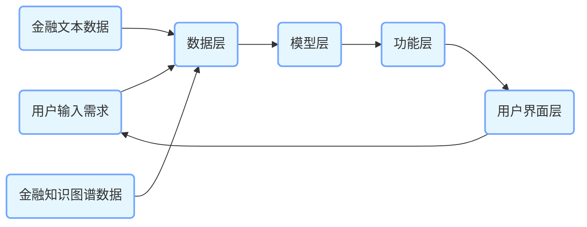

# 开发基于大模型的金融专业论文写作辅助系统

> 关键词：大模型、金融专业、论文写作辅助系统、自然语言处理、人工智能

> 摘要：本文围绕开发基于大模型的金融专业论文写作辅助系统展开。首先介绍了开发该系统的背景，包括目的、预期读者等。接着阐述了核心概念及联系，分析了核心算法原理并给出具体操作步骤，通过数学模型和公式进一步深入探讨。以项目实战的方式详细展示了系统的开发环境搭建、源代码实现及解读。探讨了该系统的实际应用场景，推荐了相关学习资源、开发工具框架和论文著作。最后总结了未来发展趋势与挑战，并提供了常见问题解答及参考资料，旨在为开发此类系统提供全面、深入的技术指导和理论支持。

## 1. 背景介绍 
### 1.1 目的和范围
在金融学术研究领域，撰写高质量的专业论文是学者和研究人员的重要工作。然而，金融领域知识复杂、更新迅速，论文写作过程中需要查阅大量资料、进行严谨的逻辑推理和准确的表达。开发基于大模型的金融专业论文写作辅助系统的目的在于利用先进的自然语言处理技术和大模型的强大能力，为金融专业论文的撰写提供全方位的支持，提高写作效率和质量。

本系统的范围涵盖金融领域的各个子学科，包括但不限于金融市场、金融机构、金融风险管理、投资学等。系统将提供包括文献检索、思路启发、语法检查、内容润色、结构建议等功能，辅助用户完成从论文选题到最终定稿的整个写作过程。

### 1.2 预期读者
本系统的预期读者主要包括以下几类人群：
1. **金融专业学生**：包括本科生、研究生等，他们在学习过程中需要完成课程论文、毕业论文等写作任务，系统可以帮助他们更好地掌握金融专业知识，提高论文写作水平。
2. **金融领域研究人员**：专业的研究人员在进行学术研究和论文发表时，需要快速获取最新的研究成果和数据，系统可以提供文献检索和思路启发等功能，辅助他们进行深入的研究和写作。
3. **金融从业者**：如银行职员、证券分析师、投资经理等，他们在工作中可能需要撰写金融分析报告、研究论文等，系统可以帮助他们提升写作的专业性和准确性。

### 1.3 文档结构概述
本文将按照以下结构详细阐述开发基于大模型的金融专业论文写作辅助系统的相关内容：
1. **核心概念与联系**：介绍系统涉及的核心概念，包括大模型、金融专业知识图谱等，并分析它们之间的联系。
2. **核心算法原理 & 具体操作步骤**：讲解系统所采用的核心算法，如自然语言处理算法、机器学习算法等，并给出具体的操作步骤。
3. **数学模型和公式 & 详细讲解 & 举例说明**：运用数学模型和公式对系统的原理进行深入分析，并通过具体例子进行说明。
4. **项目实战：代码实际案例和详细解释说明**：展示系统的开发过程，包括开发环境搭建、源代码实现和代码解读。
5. **实际应用场景**：探讨系统在金融专业论文写作中的实际应用场景和效果。
6. **工具和资源推荐**：推荐相关的学习资源、开发工具框架和论文著作，帮助读者进一步深入学习和研究。
7. **总结：未来发展趋势与挑战**：总结系统的发展现状，分析未来的发展趋势和面临的挑战。
8. **附录：常见问题与解答**：解答读者在开发和使用系统过程中可能遇到的常见问题。
9. **扩展阅读 & 参考资料**：提供相关的扩展阅读材料和参考资料，方便读者进一步学习和研究。

### 1.4 术语表
#### 1.4.1 核心术语定义
1. **大模型**：指具有大量参数和强大计算能力的人工智能模型，如GPT系列模型、BERT模型等，能够处理复杂的自然语言任务。
2. **金融专业知识图谱**：将金融领域的各种知识和概念进行结构化组织，形成的一种语义网络，用于表示金融知识之间的关系。
3. **自然语言处理（NLP）**：是计算机科学与人工智能领域中的一个重要方向，旨在让计算机理解和处理人类语言。
4. **机器学习**：是一门多领域交叉学科，涉及概率论、统计学、逼近论、凸分析、算法复杂度理论等多门学科，它专门研究计算机怎样模拟或实现人类的学习行为，以获取新的知识或技能，重新组织已有的知识结构使之不断改善自身的性能。

#### 1.4.2 相关概念解释
1. **预训练模型**：在大规模无监督数据上进行预训练的模型，能够学习到通用的语言知识和特征，为后续的任务提供良好的初始化。
2. **微调**：在预训练模型的基础上，使用特定任务的有监督数据对模型进行进一步训练，使其适应具体的任务需求。
3. **词向量**：将文本中的词语表示为向量形式，以便计算机能够处理和分析文本。

#### 1.4.3 缩略词列表
1. **NLP**：自然语言处理（Natural Language Processing）
2. **GPT**：生成式预训练变压器（Generative Pretrained Transformer）
3. **BERT**：来自变压器的双向编码器表示（Bidirectional Encoder Representations from Transformers）

## 2. 核心概念与联系 

### 核心概念原理
#### 大模型
大模型通常基于深度学习架构，如Transformer架构。Transformer架构通过自注意力机制（Self - Attention Mechanism）来捕捉输入序列中不同位置之间的依赖关系。自注意力机制允许模型在处理每个位置的输入时，考虑到序列中其他所有位置的信息，从而更好地理解文本的语义和上下文。

例如，在GPT系列模型中，采用了基于Transformer的解码器架构。模型通过在大规模的文本数据上进行无监督预训练，学习到语言的统计规律和模式。预训练过程中，模型的目标是根据输入的文本预测下一个可能的词语。通过不断地优化这个目标函数，模型能够学习到丰富的语言知识和表示能力。

#### 金融专业知识图谱
金融专业知识图谱是一种结构化的金融知识表示方法。它由实体（如金融机构、金融产品、金融事件等）、属性（如机构的资产规模、产品的收益率等）和关系（如机构与产品的发行关系、事件与机构的影响关系等）组成。

知识图谱的构建过程通常包括知识抽取、知识融合和知识存储等步骤。知识抽取是从各种金融数据源（如新闻报道、研究报告、金融数据库等）中提取实体、属性和关系信息；知识融合是将不同数据源中抽取的知识进行整合，消除重复和冲突；知识存储是将融合后的知识以图数据库（如Neo4j）的形式进行存储，以便后续的查询和推理。

### 架构的文本示意图
基于大模型的金融专业论文写作辅助系统主要由以下几个部分组成：
1. **数据层**：包括金融领域的文本数据（如学术论文、新闻报道、研究报告等）、金融专业知识图谱数据。
2. **模型层**：大模型（如预训练语言模型），用于处理自然语言任务，如文本生成、文本分类、语义理解等。
3. **功能层**：实现具体的论文写作辅助功能，如文献检索、思路启发、语法检查、内容润色、结构建议等。
4. **用户界面层**：提供用户与系统交互的界面，方便用户输入需求和获取系统的辅助信息。

### Mermaid流程图


## 3. 核心算法原理 & 具体操作步骤 

### 核心算法原理
#### 自然语言处理算法 - 文本生成
文本生成是金融专业论文写作辅助系统中的重要功能之一，用于为用户提供思路启发和内容补充。在基于大模型的文本生成中，通常采用序列到序列（Seq2Seq）的模型架构。

以GPT模型为例，其文本生成过程基于概率分布。给定输入文本 $x = [x_1, x_2, \cdots, x_n]$，模型的目标是预测下一个词语 $y$ 的概率分布 $P(y|x)$。模型通过自回归的方式依次生成后续的词语，直到满足终止条件（如生成指定长度的文本或遇到结束标记）。

#### 机器学习算法 - 文本分类
文本分类用于对金融论文进行分类，如将论文分为实证研究、理论分析、案例研究等类别。常见的文本分类算法包括朴素贝叶斯、支持向量机（SVM）和深度学习模型（如卷积神经网络CNN、循环神经网络RNN及其变体LSTM、GRU等）。

以深度学习模型为例，其基本原理是将文本表示为词向量，然后通过神经网络对词向量进行特征提取和分类。例如，CNN通过卷积层提取文本的局部特征，通过池化层对特征进行降维，最后通过全连接层进行分类。

### 具体操作步骤
#### 文本生成步骤
1. **数据预处理**：对输入的文本进行清洗、分词等预处理操作，将文本转换为模型能够处理的格式。
2. **模型加载**：加载预训练的大模型。
3. **输入编码**：将预处理后的文本编码为模型的输入格式。
4. **文本生成**：使用模型根据输入文本生成后续的文本。
5. **解码输出**：将生成的文本解码为自然语言形式。

#### 文本分类步骤
1. **数据收集与标注**：收集金融论文数据，并对其进行分类标注。
2. **数据预处理**：对论文文本进行清洗、分词、词向量转换等预处理操作。
3. **模型选择与训练**：选择合适的文本分类模型（如CNN、LSTM等），并使用标注好的数据进行训练。
4. **模型评估**：使用测试数据对训练好的模型进行评估，计算分类准确率、召回率、F1值等指标。
5. **分类预测**：使用训练好的模型对新的金融论文进行分类预测。

### Python源代码示例
#### 文本生成示例（使用Hugging Face的transformers库）
```python
from transformers import GPT2LMHeadModel, GPT2Tokenizer

# 加载预训练的模型和分词器
model_name = "gpt2"
tokenizer = GPT2Tokenizer.from_pretrained(model_name)
model = GPT2LMHeadModel.from_pretrained(model_name)

# 输入文本
input_text = "金融市场的发展趋势是"

# 对输入文本进行编码
input_ids = tokenizer.encode(input_text, return_tensors='pt')

# 生成文本
output = model.generate(input_ids, max_length=100, num_beams=5, no_repeat_ngram_size=2, early_stopping=True)

# 解码输出文本
generated_text = tokenizer.decode(output[0], skip_special_tokens=True)

print(generated_text)
```

#### 文本分类示例（使用Keras实现简单的CNN文本分类模型）
```python
import numpy as np
from keras.preprocessing.text import Tokenizer
from keras.preprocessing.sequence import pad_sequences
from keras.models import Sequential
from keras.layers import Embedding, Conv1D, GlobalMaxPooling1D, Dense

# 示例数据
texts = ["这是一篇实证研究的金融论文", "该论文主要进行理论分析", "案例研究表明金融风险的影响"]
labels = [0, 1, 2]  # 0: 实证研究，1: 理论分析，2: 案例研究

# 数据预处理
tokenizer = Tokenizer(num_words=1000)
tokenizer.fit_on_texts(texts)
sequences = tokenizer.texts_to_sequences(texts)
max_length = max([len(seq) for seq in sequences])
padded_sequences = pad_sequences(sequences, maxlen=max_length)

# 构建CNN模型
model = Sequential()
model.add(Embedding(input_dim=1000, output_dim=100, input_length=max_length))
model.add(Conv1D(filters=128, kernel_size=5, activation='relu'))
model.add(GlobalMaxPooling1D())
model.add(Dense(3, activation='softmax'))

# 编译模型
model.compile(optimizer='adam', loss='sparse_categorical_crossentropy', metrics=['accuracy'])

# 训练模型
model.fit(padded_sequences, np.array(labels), epochs=10, batch_size=1)

# 预测
new_text = ["这是一篇新的实证研究论文"]
new_sequence = tokenizer.texts_to_sequences(new_text)
new_padded_sequence = pad_sequences(new_sequence, maxlen=max_length)
prediction = model.predict(new_padded_sequence)
predicted_label = np.argmax(prediction)

print("预测标签:", predicted_label)
```

## 4. 数学模型和公式 & 详细讲解 & 举例说明 

### 文本生成的数学模型
在基于大模型的文本生成中，通常采用自回归语言模型。给定一个输入序列 $x = [x_1, x_2, \cdots, x_n]$，模型的目标是预测下一个词语 $x_{n + 1}$ 的概率分布 $P(x_{n + 1}|x_1, x_2, \cdots, x_n)$。

根据链式法则，整个序列 $x = [x_1, x_2, \cdots, x_N]$ 的概率可以表示为：

$$P(x) = \prod_{i = 1}^{N} P(x_i|x_1, x_2, \cdots, x_{i - 1})$$

在实际应用中，模型通常使用softmax函数将模型的输出转换为概率分布。假设模型的输出为 $z = [z_1, z_2, \cdots, z_V]$，其中 $V$ 是词汇表的大小，则第 $j$ 个词语的概率为：

$$P(x_j|x_1, x_2, \cdots, x_{i - 1}) = \frac{\exp(z_j)}{\sum_{k = 1}^{V} \exp(z_k)}$$

### 文本分类的数学模型
以逻辑回归为例，逻辑回归是一种常用的二分类算法，也可以扩展到多分类问题。假设输入特征向量为 $x = [x_1, x_2, \cdots, x_d]$，其中 $d$ 是特征的维度。逻辑回归模型通过线性组合输入特征和权重向量 $w = [w_1, w_2, \cdots, w_d]$ 得到一个得分 $z$：

$$z = \sum_{i = 1}^{d} w_i x_i + b$$

其中 $b$ 是偏置项。然后使用sigmoid函数将得分 $z$ 转换为概率 $p$：

$$p = \frac{1}{1 + \exp(-z)}$$

对于多分类问题，可以使用softmax函数将得分转换为概率分布。假设模型的输出为 $z = [z_1, z_2, \cdots, z_K]$，其中 $K$ 是类别的数量，则第 $k$ 个类别的概率为：

$$P(y = k|x) = \frac{\exp(z_k)}{\sum_{j = 1}^{K} \exp(z_j)}$$

### 详细讲解
#### 文本生成
文本生成的数学模型基于概率分布，通过预测下一个词语的概率来生成文本。自回归的方式使得模型能够逐步生成后续的词语，同时考虑到前面已经生成的词语的上下文信息。softmax函数将模型的输出转换为概率分布，确保所有词语的概率之和为1。

#### 文本分类
文本分类的数学模型通过线性组合输入特征和权重向量得到得分，然后使用sigmoid或softmax函数将得分转换为概率。逻辑回归模型通过最小化损失函数（如交叉熵损失函数）来学习权重向量和偏置项，使得模型能够对输入的文本进行准确的分类。

### 举例说明
#### 文本生成
假设词汇表为 $\{“金融”, “市场”, “发展”, “趋势”, “是”\}$，输入序列为 $x = [“金融”, “市场”]$，模型的输出得分 $z = [1, 2, 3, 4, 5]$。则根据softmax函数计算每个词语的概率：

$$P(“金融”|“金融”, “市场”) = \frac{\exp(1)}{\exp(1) + \exp(2) + \exp(3) + \exp(4) + \exp(5)} \approx 0.0117$$
$$P(“市场”|“金融”, “市场”) = \frac{\exp(2)}{\exp(1) + \exp(2) + \exp(3) + \exp(4) + \exp(5)} \approx 0.0317$$
$$P(“发展”|“金融”, “市场”) = \frac{\exp(3)}{\exp(1) + \exp(2) + \exp(3) + \exp(4) + \exp(5)} \approx 0.0861$$
$$P(“趋势”|“金融”, “市场”) = \frac{\exp(4)}{\exp(1) + \exp(2) + \exp(3) + \exp(4) + \exp(5)} \approx 0.2341$$
$$P(“是”|“金融”, “市场”) = \frac{\exp(5)}{\exp(1) + \exp(2) + \exp(3) + \exp(4) + \exp(5)} \approx 0.6364$$

根据概率分布，模型可能会选择概率最大的词语 “是” 作为下一个生成的词语。

#### 文本分类
假设输入文本的特征向量为 $x = [0.1, 0.2, 0.3]$，权重向量 $w = [0.4, 0.5, 0.6]$，偏置项 $b = 0.1$。则得分 $z$ 为：

$$z = 0.4 \times 0.1 + 0.5 \times 0.2 + 0.6 \times 0.3 + 0.1 = 0.38$$

使用sigmoid函数计算概率 $p$：

$$p = \frac{1}{1 + \exp(-0.38)} \approx 0.594$$

如果这是一个二分类问题，且阈值为0.5，则可以判断该文本属于正类。

## 5. 项目实战：代码实际案例和详细解释说明 

### 5.1  开发环境搭建
#### 操作系统
建议使用Linux系统（如Ubuntu）或Windows 10系统，因为这些系统支持大多数的开发工具和库。

#### Python环境
安装Python 3.7及以上版本。可以从Python官方网站（https://www.python.org/downloads/） 下载安装包进行安装。

#### 开发工具
推荐使用PyCharm作为集成开发环境（IDE），它提供了丰富的功能，如代码编辑、调试、版本控制等。也可以使用Jupyter Notebook进行快速的代码测试和实验。

#### 依赖库安装
使用pip命令安装以下依赖库：
```bash
pip install transformers
pip install keras
pip install numpy
pip install pandas
pip install scikit-learn
```

### 5.2  源代码详细实现和代码解读
#### 文献检索功能实现
文献检索功能主要通过调用学术数据库的API来实现。以知网为例，知网提供了基于RESTful API的文献检索接口。以下是一个简单的Python代码示例：
```python
import requests

# 知网API地址
api_url = "https://api.cnki.net/search"

# 请求参数
params = {
    "keyword": "金融市场风险",
    "page": 1,
    "page_size": 10
}

# 发送请求
response = requests.get(api_url, params=params)

# 解析响应
if response.status_code == 200:
    data = response.json()
    for item in data["results"]:
        print("标题:", item["title"])
        print("作者:", item["author"])
        print("发表时间:", item["publish_date"])
        print("链接:", item["link"])
        print("-" * 50)
else:
    print("请求失败:", response.status_code)
```
**代码解读**：
1. 首先导入`requests`库，用于发送HTTP请求。
2. 定义知网API的地址和请求参数，包括关键词、页码和每页显示的文献数量。
3. 使用`requests.get`方法发送请求，并获取响应。
4. 检查响应状态码，如果状态码为200，则表示请求成功，解析响应的JSON数据并输出文献信息；否则，输出请求失败的信息。

#### 思路启发功能实现
思路启发功能可以基于大模型的文本生成来实现。以下是一个使用Hugging Face的transformers库的代码示例：
```python
from transformers import GPT2LMHeadModel, GPT2Tokenizer

# 加载预训练的模型和分词器
model_name = "gpt2"
tokenizer = GPT2Tokenizer.from_pretrained(model_name)
model = GPT2LMHeadModel.from_pretrained(model_name)

# 输入问题
input_text = "金融市场风险的研究思路有哪些？"

# 对输入文本进行编码
input_ids = tokenizer.encode(input_text, return_tensors='pt')

# 生成文本
output = model.generate(input_ids, max_length=200, num_beams=5, no_repeat_ngram_size=2, early_stopping=True)

# 解码输出文本
generated_text = tokenizer.decode(output[0], skip_special_tokens=True)

print(generated_text)
```
**代码解读**：
1. 导入`transformers`库中的`GPT2LMHeadModel`和`GPT2Tokenizer`类。
2. 加载预训练的GPT2模型和分词器。
3. 定义输入问题，并使用分词器对其进行编码。
4. 使用模型的`generate`方法生成文本，设置生成的最大长度、束搜索的束数等参数。
5. 使用分词器对生成的文本进行解码，并输出结果。

### 5.3  代码解读与分析
#### 文献检索功能
该功能的关键在于理解学术数据库API的使用方法和请求参数的含义。不同的学术数据库API可能有不同的接口地址和参数格式，需要根据具体情况进行调整。在实际应用中，还需要处理请求失败、数据解析错误等异常情况，以提高系统的稳定性。

#### 思路启发功能
基于大模型的文本生成功能需要注意模型的选择和参数的调整。不同的模型在性能和效果上可能存在差异，需要根据具体的任务需求选择合适的模型。生成文本的参数（如最大长度、束搜索的束数等）也会影响生成文本的质量和效率，需要进行适当的调整。

## 6. 实际应用场景 
### 论文选题阶段
在论文选题阶段，金融专业论文写作辅助系统可以帮助用户快速了解金融领域的研究热点和前沿问题。通过文献检索功能，用户可以获取大量的相关文献，分析研究趋势和空白点，从而确定具有创新性和研究价值的论文选题。同时，思路启发功能可以为用户提供选题的思路和方向，帮助用户拓展思维。

### 资料收集阶段
在资料收集阶段，系统的文献检索功能可以帮助用户快速找到所需的学术论文、研究报告、统计数据等资料。用户可以根据关键词、作者、发表时间等条件进行精准检索，提高资料收集的效率。此外，系统还可以对收集到的资料进行分类整理，方便用户进行后续的阅读和分析。

### 论文撰写阶段
在论文撰写阶段，系统可以提供语法检查、内容润色、结构建议等功能。语法检查功能可以帮助用户发现和纠正论文中的语法错误和拼写错误，提高论文的语言质量。内容润色功能可以对论文的表述进行优化，使论文更加流畅、准确。结构建议功能可以根据金融专业论文的一般结构和规范，为用户提供论文结构的建议，帮助用户组织论文的内容。

### 论文修改阶段
在论文修改阶段，系统可以对用户修改后的论文进行再次检查和评估。通过与之前的版本进行对比，系统可以帮助用户发现修改过程中可能出现的新问题，并提供相应的改进建议。同时，系统还可以对论文的整体质量进行评估，给出综合评分和改进方向，帮助用户不断完善论文。

## 7. 工具和资源推荐
### 7.1 学习资源推荐
#### 7.1.1 书籍推荐
1. 《自然语言处理入门》：作者何晗，本书系统地介绍了自然语言处理的基本概念、方法和技术，适合初学者入门。
2. 《深度学习》：作者Ian Goodfellow、Yoshua Bengio和Aaron Courville，本书是深度学习领域的经典著作，对深度学习的理论和实践进行了全面的阐述。
3. 《金融市场学》：作者张亦春、郑振龙，本书是金融领域的经典教材，全面介绍了金融市场的基本概念、运行机制和金融产品。

#### 7.1.2 在线课程
1. Coursera上的“Natural Language Processing Specialization”：由深度学习领域的知名学者授课，系统地介绍了自然语言处理的各个方面。
2. edX上的“Deep Learning Fundamentals”：该课程深入讲解了深度学习的基本原理和方法，适合有一定编程基础的学习者。
3. 中国大学MOOC上的“金融市场学”：由国内知名高校的教授授课，全面介绍了金融市场的相关知识。

#### 7.1.3 技术博客和网站
1. Hugging Face官方博客：提供了关于自然语言处理模型和技术的最新研究成果和应用案例。
2. 机器之心：专注于人工智能领域的技术和应用，提供了丰富的技术文章和行业资讯。
3. 金融界：提供了金融领域的最新新闻、研究报告和数据分析，是了解金融市场动态的重要渠道。

### 7.2 开发工具框架推荐
#### 7.2.1 IDE和编辑器
1. PyCharm：功能强大的Python集成开发环境，提供了代码编辑、调试、版本控制等丰富的功能。
2. Jupyter Notebook：交互式的代码编辑和运行环境，适合快速的代码测试和实验。
3. Visual Studio Code：轻量级的代码编辑器，支持多种编程语言和插件扩展。

#### 7.2.2 调试和性能分析工具
1. PySnooper：简单易用的Python调试工具，可以实时输出函数的执行过程和变量的值。
2. cProfile：Python标准库中的性能分析工具，可以分析代码的执行时间和函数调用关系。
3. TensorBoard：用于可视化深度学习模型训练过程和性能指标的工具，支持TensorFlow、PyTorch等深度学习框架。

#### 7.2.3 相关框架和库
1. Transformers：Hugging Face开发的自然语言处理框架，提供了多种预训练模型和工具，方便用户进行文本生成、文本分类等任务。
2. Keras：高级神经网络API，简单易用，适合快速搭建深度学习模型。
3. NumPy：Python的数值计算库，提供了高效的数组操作和数学函数，是许多机器学习和深度学习库的基础。

### 7.3 相关论文著作推荐
#### 7.3.1 经典论文
1. “Attention Is All You Need”：提出了Transformer架构，是自然语言处理领域的经典论文。
2. “BERT: Pre-training of Deep Bidirectional Transformers for Language Understanding”：介绍了BERT模型，开创了预训练语言模型的先河。
3. “Efficient Estimation of Word Representations in Vector Space”：提出了Word2Vec算法，用于将词语表示为向量形式。

#### 7.3.2 最新研究成果
1. 关注顶级学术会议（如ACL、EMNLP、NeurIPS等）上关于自然语言处理和金融领域的最新研究成果。
2. 阅读知名学术期刊（如Journal of Financial Economics、Review of Financial Studies等）上的相关论文。

#### 7.3.3 应用案例分析
1. 分析国内外金融机构和研究机构在金融文本分析、智能投研等领域的应用案例，了解实际应用中的技术和方法。
2. 参考相关的行业报告和白皮书，了解金融科技领域的发展趋势和应用案例。

## 8. 总结：未来发展趋势与挑战
### 未来发展趋势
#### 模型性能提升
随着深度学习技术的不断发展，大模型的性能将不断提升。未来的模型将具有更强的语言理解和生成能力，能够更好地处理金融专业领域的复杂文本和任务。例如，模型可能能够更好地理解金融术语和概念，生成更加准确、专业的论文内容。

#### 多模态融合
未来的金融专业论文写作辅助系统可能会融合多种模态的信息，如文本、图像、语音等。通过多模态融合，系统可以提供更加丰富、全面的辅助信息。例如，在分析金融市场数据时，可以结合图表和语音讲解，帮助用户更好地理解数据和趋势。

#### 个性化服务
系统将更加注重个性化服务，根据用户的需求、偏好和历史行为，为用户提供个性化的写作建议和辅助信息。例如，对于不同水平的用户，系统可以提供不同难度层次的写作指导；对于不同研究方向的用户，系统可以推送相关的文献和研究成果。

### 挑战
#### 数据质量和安全
金融领域的数据通常具有敏感性和保密性，数据的质量和安全是开发金融专业论文写作辅助系统的重要挑战。需要确保数据的准确性、完整性和安全性，防止数据泄露和滥用。同时，还需要解决数据标注和清洗的问题，提高数据的质量和可用性。

#### 模型可解释性
大模型通常具有较高的复杂度和黑盒性，模型的可解释性是一个重要的问题。在金融领域，模型的决策需要具有可解释性，以便用户理解和信任系统的建议。因此，需要研究和开发可解释的模型和方法，提高模型的可解释性和透明度。

#### 伦理和法律问题
随着人工智能技术的广泛应用，伦理和法律问题也日益受到关注。在开发金融专业论文写作辅助系统时，需要考虑伦理和法律问题，如数据隐私、知识产权、算法歧视等。需要制定相应的法律法规和伦理准则，规范系统的开发和使用。

## 9. 附录：常见问题与解答
### 问题1：如何选择合适的大模型？
解答：选择合适的大模型需要考虑以下几个因素：
1. **任务需求**：不同的任务对模型的要求不同，如文本生成任务可能需要具有较强生成能力的模型，而文本分类任务可能需要具有较好特征提取能力的模型。
2. **模型性能**：可以参考模型在公开数据集上的性能指标，如准确率、召回率、F1值等。
3. **计算资源**：大模型通常需要较大的计算资源，需要根据自己的计算资源情况选择合适的模型。

### 问题2：如何提高文本生成的质量？
解答：可以从以下几个方面提高文本生成的质量：
1. **调整生成参数**：如最大长度、束搜索的束数、温度参数等，不同的参数设置会影响生成文本的质量和多样性。
2. **使用优质的训练数据**：训练数据的质量直接影响模型的性能，使用高质量的金融专业文本数据进行训练可以提高生成文本的专业性和准确性。
3. **微调模型**：在预训练模型的基础上，使用特定任务的有监督数据对模型进行微调，使模型更好地适应具体的任务需求。

### 问题3：如何解决文献检索时数据获取不完整的问题？
解答：可以采取以下措施解决文献检索时数据获取不完整的问题：
1. **使用多个数据源**：不同的学术数据库可能收录的文献有所不同，使用多个数据源进行检索可以提高文献的覆盖率。
2. **调整检索策略**：优化检索关键词、筛选条件等，提高检索的准确性和全面性。
3. **手动补充数据**：对于一些重要的文献，如果无法通过检索获取，可以手动查找和补充相关数据。

## 10. 扩展阅读 & 参考资料
### 扩展阅读
1. 《人工智能时代的金融创新与风险防控》：深入探讨了人工智能在金融领域的应用和风险防控问题。
2. 《自然语言处理实战：基于Python和深度学习》：通过实际案例介绍了自然语言处理的应用和实现方法。
3. 《金融科技前沿：技术趋势与应用实践》：介绍了金融科技领域的最新技术和应用实践。

### 参考资料
1. Hugging Face官方文档：https://huggingface.co/docs
2. Keras官方文档：https://keras.io/
3. 知网API文档：https://api.cnki.net/docs
4. 相关学术论文和研究报告：可以从学术数据库（如知网、万方、维普等）和研究机构的官方网站获取。