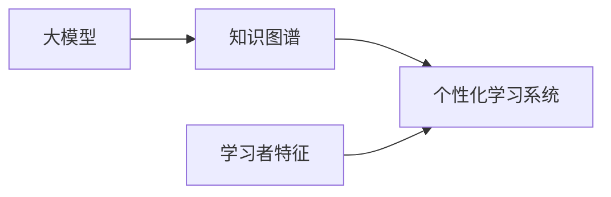

# 开发基于大模型的金融合规培训个性化学习系统

> 关键词：大模型、金融合规培训、个性化学习系统、人工智能、自然语言处理、知识图谱、机器学习

> 摘要：本文聚焦于开发基于大模型的金融合规培训个性化学习系统。在金融行业对合规要求日益严格的背景下，传统培训方式已难以满足需求。该系统借助大模型强大的自然语言处理和知识推理能力，结合个性化学习的理念，旨在为金融从业者提供定制化的学习体验，提高培训效果和效率。文章详细阐述了系统的核心概念、算法原理、数学模型，通过项目实战展示了系统的开发过程和代码实现，探讨了实际应用场景，并推荐了相关的工具和资源，最后对系统的未来发展趋势与挑战进行了总结。

## 1. 背景介绍 
### 1.1 目的和范围
金融行业是一个高度监管的行业，合规要求不断变化和更新。金融机构需要确保其员工具备扎实的合规知识，以避免法律风险和声誉损失。传统的金融合规培训通常采用统一的课程和教学方式，无法满足不同员工的学习需求和能力水平。本系统的目的是开发一个基于大模型的金融合规培训个性化学习系统，能够根据员工的学习历史、知识水平、职业角色等因素，为其提供个性化的学习路径和内容推荐，提高培训的针对性和有效性。

本系统的范围涵盖了金融合规培训的各个方面，包括法律法规、监管政策、行业标准、内部规章制度等。系统将整合多种学习资源，如文本、视频、案例等，以满足不同员工的学习偏好。同时，系统将支持多种学习模式，如在线学习、离线学习、混合式学习等，以适应不同的工作场景和学习需求。

### 1.2 预期读者
本文的预期读者包括金融机构的培训管理人员、合规管理人员、技术研发人员，以及对金融合规培训和个性化学习系统感兴趣的研究人员和从业人员。

### 1.3 文档结构概述
本文将按照以下结构进行组织：
1. 背景介绍：介绍系统开发的目的、范围、预期读者和文档结构概述。
2. 核心概念与联系：阐述大模型、金融合规培训、个性化学习系统等核心概念及其之间的联系。
3. 核心算法原理 & 具体操作步骤：介绍系统中使用的核心算法，如知识图谱构建算法、个性化推荐算法等，并给出具体的操作步骤。
4. 数学模型和公式 & 详细讲解 & 举例说明：给出系统中涉及的数学模型和公式，并进行详细讲解和举例说明。
5. 项目实战：代码实际案例和详细解释说明：通过项目实战，展示系统的开发过程和代码实现，并对代码进行详细解释说明。
6. 实际应用场景：探讨系统在金融机构中的实际应用场景。
7. 工具和资源推荐：推荐相关的学习资源、开发工具框架和论文著作。
8. 总结：未来发展趋势与挑战：总结系统的开发经验，探讨未来的发展趋势和面临的挑战。
9. 附录：常见问题与解答：提供常见问题的解答。
10. 扩展阅读 & 参考资料：提供扩展阅读和参考资料。

### 1.4 术语表
#### 1.4.1 核心术语定义
- **大模型**：指具有大量参数和强大计算能力的人工智能模型，如GPT系列、BERT等。
- **金融合规培训**：指金融机构为确保员工遵守法律法规、监管政策、行业标准和内部规章制度而开展的培训活动。
- **个性化学习系统**：指能够根据学习者的学习历史、知识水平、兴趣爱好等因素，为其提供个性化学习路径和内容推荐的学习系统。
- **知识图谱**：指一种以图的形式表示知识的语义网络，用于存储和管理领域知识。
- **自然语言处理**：指计算机对自然语言的理解和处理技术，包括文本分类、情感分析、命名实体识别等。

#### 1.4.2 相关概念解释
- **深度学习**：指一类基于人工神经网络的机器学习技术，通过多层神经网络自动学习数据的特征和模式。
- **机器学习**：指让计算机通过数据学习规律和模式，从而实现预测和决策的技术。
- **人工智能**：指让计算机模拟人类智能的技术，包括自然语言处理、计算机视觉、机器学习等。

#### 1.4.3 缩略词列表
- **NLP**：Natural Language Processing，自然语言处理
- **KG**：Knowledge Graph，知识图谱
- **ML**：Machine Learning，机器学习
- **DL**：Deep Learning，深度学习
- **AI**：Artificial Intelligence，人工智能

## 2. 核心概念与联系 

### 2.1 大模型
大模型是近年来人工智能领域的重要突破，它通过大规模的预训练和微调，能够学习到丰富的语言知识和语义信息。大模型通常基于Transformer架构，具有强大的自然语言处理能力，如文本生成、文本分类、问答系统等。

### 2.2 金融合规培训
金融合规培训是金融机构为确保员工遵守法律法规、监管政策、行业标准和内部规章制度而开展的培训活动。金融合规培训的内容包括法律法规、监管政策、行业标准、内部规章制度等，培训方式包括在线学习、面授培训、案例分析等。

### 2.3 个性化学习系统
个性化学习系统是一种能够根据学习者的学习历史、知识水平、兴趣爱好等因素，为其提供个性化学习路径和内容推荐的学习系统。个性化学习系统通常采用机器学习和人工智能技术，如知识图谱、推荐系统等，来实现个性化学习的功能。

### 2.4 核心概念之间的联系
大模型为金融合规培训个性化学习系统提供了强大的自然语言处理能力，能够对金融合规知识进行理解、分析和生成。知识图谱用于存储和管理金融合规知识，为个性化推荐提供知识基础。个性化学习系统则根据学习者的学习历史、知识水平、兴趣爱好等因素，结合大模型和知识图谱的能力，为学习者提供个性化的学习路径和内容推荐。

### 2.5 核心概念原理和架构的文本示意图
```plaintext
+----------------------+
| 大模型               |
| (如GPT、BERT等)      |
+----------------------+
         |
         v
+----------------------+
| 知识图谱             |
| (存储金融合规知识)  |
+----------------------+
         |
         v
+----------------------+
| 个性化学习系统       |
| (根据学习者特征推荐) |
+----------------------+
```

### 2.6 Mermaid 流程图


## 3. 核心算法原理 & 具体操作步骤 

### 3.1 知识图谱构建算法
知识图谱是一种以图的形式表示知识的语义网络，用于存储和管理领域知识。在金融合规培训个性化学习系统中，知识图谱用于存储和管理金融合规知识，为个性化推荐提供知识基础。

#### 3.1.1 算法原理
知识图谱的构建过程主要包括实体识别、关系抽取和图谱存储三个步骤。
- **实体识别**：从文本中识别出实体，如法律法规、监管政策、金融机构、金融产品等。
- **关系抽取**：从文本中抽取实体之间的关系，如“属于”、“引用”、“适用”等。
- **图谱存储**：将识别出的实体和抽取的关系存储到图数据库中，如Neo4j、JanusGraph等。

#### 3.1.2 Python 源代码实现
```python
import spacy
from py2neo import Graph

# 加载预训练的NLP模型
nlp = spacy.load("en_core_web_sm")

# 连接图数据库
graph = Graph("bolt://localhost:7687", auth=("neo4j", "password"))

# 示例文本
text = "《商业银行法》适用于所有商业银行。"

# 实体识别
doc = nlp(text)
entities = []
for ent in doc.ents:
    entities.append(ent.text)

# 关系抽取
relations = []
for token in doc:
    if token.dep_ == "nsubj" and token.head.dep_ == "ROOT":
        relation = (token.text, token.head.text, token.head.head.text)
        relations.append(relation)

# 图谱存储
for entity in entities:
    graph.run("MERGE (n:Entity {name: $name})", name=entity)

for relation in relations:
    graph.run("MATCH (a:Entity {name: $source}), (b:Entity {name: $target}) "
              "MERGE (a)-[r:Rel {name: $relation}]->(b)",
              source=relation[0], target=relation[2], relation=relation[1])
```

### 3.2 个性化推荐算法
个性化推荐算法是个性化学习系统的核心算法，用于根据学习者的学习历史、知识水平、兴趣爱好等因素，为其提供个性化的学习路径和内容推荐。

#### 3.2.1 算法原理
个性化推荐算法通常采用协同过滤、内容推荐、混合推荐等方法。在金融合规培训个性化学习系统中，我们采用混合推荐方法，结合协同过滤和内容推荐的优点。
- **协同过滤**：根据学习者的学习历史和行为数据，找到与目标学习者相似的其他学习者，然后推荐这些相似学习者喜欢的学习内容。
- **内容推荐**：根据学习内容的特征和目标学习者的兴趣爱好，推荐与目标学习者兴趣相关的学习内容。

#### 3.2.2 Python 源代码实现
```python
import pandas as pd
from sklearn.metrics.pairwise import cosine_similarity

# 示例数据
user_learning_history = pd.DataFrame({
    "user_id": [1, 1, 2, 2],
    "content_id": [101, 102, 102, 103],
    "score": [80, 90, 85, 95]
})

content_features = pd.DataFrame({
    "content_id": [101, 102, 103],
    "feature1": [0.1, 0.2, 0.3],
    "feature2": [0.4, 0.5, 0.6]
})

# 协同过滤推荐
user_item_matrix = user_learning_history.pivot_table(index="user_id", columns="content_id", values="score", fill_value=0)
user_similarity = cosine_similarity(user_item_matrix)

def collaborative_filtering_recommendation(user_id, top_n=3):
    user_index = user_item_matrix.index.get_loc(user_id)
    similar_users = user_similarity[user_index].argsort()[::-1][1:top_n + 1]
    similar_user_ids = user_item_matrix.index[similar_users]
    recommended_content = []
    for similar_user_id in similar_user_ids:
        similar_user_history = user_learning_history[user_learning_history["user_id"] == similar_user_id]
        target_user_history = user_learning_history[user_learning_history["user_id"] == user_id]
        new_content = similar_user_history[~similar_user_history["content_id"].isin(target_user_history["content_id"])]
        recommended_content.extend(new_content["content_id"].tolist())
    return recommended_content

# 内容推荐
def content_based_recommendation(user_id, top_n=3):
    target_user_history = user_learning_history[user_learning_history["user_id"] == user_id]
    target_content_features = content_features[content_features["content_id"].isin(target_user_history["content_id"])]
    average_features = target_content_features.mean()
    content_similarity = cosine_similarity(content_features.drop("content_id", axis=1), [average_features])
    sorted_indices = content_similarity.argsort()[::-1].flatten()
    recommended_content = []
    for index in sorted_indices:
        content_id = content_features.iloc[index]["content_id"]
        if content_id not in target_user_history["content_id"].tolist():
            recommended_content.append(content_id)
        if len(recommended_content) == top_n:
            break
    return recommended_content

# 混合推荐
def hybrid_recommendation(user_id, top_n=3):
    collaborative_recommended = collaborative_filtering_recommendation(user_id, top_n)
    content_recommended = content_based_recommendation(user_id, top_n)
    recommended_content = list(set(collaborative_recommended + content_recommended))[:top_n]
    return recommended_content

# 示例调用
user_id = 1
recommended_content = hybrid_recommendation(user_id)
print(f"Recommended content for user {user_id}: {recommended_content}")
```

## 4. 数学模型和公式 & 详细讲解 & 举例说明 

### 4.1 知识图谱中的图表示
知识图谱可以用图 $G=(V, E)$ 来表示，其中 $V$ 是节点集合，代表实体；$E$ 是边集合，代表实体之间的关系。

#### 4.1.1 节点表示
节点 $v \in V$ 可以用向量 $\mathbf{x}_v$ 来表示，向量的维度和元素取决于节点的特征。例如，对于一个法律法规实体，其特征可以包括名称、发布时间、适用范围等。

#### 4.1.2 边表示
边 $e=(u, v) \in E$ 可以用向量 $\mathbf{r}_e$ 来表示，向量的维度和元素取决于边的类型和属性。例如，对于一个“属于”关系，其属性可以包括关系的强度、权重等。

#### 4.1.3 图的邻接矩阵表示
图 $G$ 的邻接矩阵 $A$ 是一个 $|V| \times |V|$ 的矩阵，其中 $A_{ij}$ 表示节点 $i$ 和节点 $j$ 之间的边的权重。如果节点 $i$ 和节点 $j$ 之间没有边，则 $A_{ij}=0$。

### 4.2 协同过滤中的相似度计算
在协同过滤中，常用的相似度计算方法是余弦相似度。给定两个向量 $\mathbf{x}$ 和 $\mathbf{y}$，它们的余弦相似度定义为：

$$
\cos(\mathbf{x}, \mathbf{y}) = \frac{\mathbf{x} \cdot \mathbf{y}}{\|\mathbf{x}\| \|\mathbf{y}\|}
$$

其中，$\mathbf{x} \cdot \mathbf{y}$ 表示向量 $\mathbf{x}$ 和 $\mathbf{y}$ 的点积，$\|\mathbf{x}\|$ 和 $\|\mathbf{y}\|$ 分别表示向量 $\mathbf{x}$ 和 $\mathbf{y}$ 的模。

#### 4.2.1 举例说明
假设有两个用户的学习历史向量 $\mathbf{x} = [80, 90, 70]$ 和 $\mathbf{y} = [85, 95, 75]$，则它们的余弦相似度为：

$$
\begin{align*}
\cos(\mathbf{x}, \mathbf{y}) &= \frac{80 \times 85 + 90 \times 95 + 70 \times 75}{\sqrt{80^2 + 90^2 + 70^2} \sqrt{85^2 + 95^2 + 75^2}} \\
&= \frac{6800 + 8550 + 5250}{\sqrt{6400 + 8100 + 4900} \sqrt{7225 + 9025 + 5625}} \\
&= \frac{20600}{\sqrt{19400} \sqrt{21875}} \\
&\approx 0.98
\end{align*}
$$

### 4.3 内容推荐中的相似度计算
在内容推荐中，同样可以使用余弦相似度来计算学习内容之间的相似度。给定两个学习内容的特征向量 $\mathbf{a}$ 和 $\mathbf{b}$，它们的余弦相似度计算方法与协同过滤中的相似度计算方法相同。

#### 4.3.1 举例说明
假设有两个学习内容的特征向量 $\mathbf{a} = [0.1, 0.4]$ 和 $\mathbf{b} = [0.2, 0.5]$，则它们的余弦相似度为：

$$
\begin{align*}
\cos(\mathbf{a}, \mathbf{b}) &= \frac{0.1 \times 0.2 + 0.4 \times 0.5}{\sqrt{0.1^2 + 0.4^2} \sqrt{0.2^2 + 0.5^2}} \\
&= \frac{0.02 + 0.2}{\sqrt{0.01 + 0.16} \sqrt{0.04 + 0.25}} \\
&= \frac{0.22}{\sqrt{0.17} \sqrt{0.29}} \\
&\approx 0.97
\end{align*}
$$

## 5. 项目实战：代码实际案例和详细解释说明 

### 5.1  开发环境搭建
#### 5.1.1 操作系统
推荐使用 Linux 或 macOS 操作系统，因为它们对开发工具和库的支持更好。

#### 5.1.2 编程语言
使用 Python 作为开发语言，因为 Python 具有丰富的机器学习和自然语言处理库，如 TensorFlow、PyTorch、Scikit-learn、NLTK、SpaCy 等。

#### 5.1.3 数据库
使用图数据库 Neo4j 来存储知识图谱，因为 Neo4j 具有强大的图数据处理能力和可视化功能。

#### 5.1.4 开发工具
使用 PyCharm 作为集成开发环境（IDE），因为 PyCharm 具有强大的代码编辑、调试和版本控制功能。

#### 5.1.5 安装依赖库
在项目根目录下创建一个 `requirements.txt` 文件，内容如下：
```plaintext
spacy
py2neo
pandas
scikit-learn
```
然后使用以下命令安装依赖库：
```bash
pip install -r requirements.txt
```

### 5.2  源代码详细实现和代码解读
#### 5.2.1 知识图谱构建模块
```python
import spacy
from py2neo import Graph

# 加载预训练的NLP模型
nlp = spacy.load("en_core_web_sm")

# 连接图数据库
graph = Graph("bolt://localhost:7687", auth=("neo4j", "password"))

def build_knowledge_graph(text):
    # 实体识别
    doc = nlp(text)
    entities = []
    for ent in doc.ents:
        entities.append(ent.text)

    # 关系抽取
    relations = []
    for token in doc:
        if token.dep_ == "nsubj" and token.head.dep_ == "ROOT":
            relation = (token.text, token.head.text, token.head.head.text)
            relations.append(relation)

    # 图谱存储
    for entity in entities:
        graph.run("MERGE (n:Entity {name: $name})", name=entity)

    for relation in relations:
        graph.run("MATCH (a:Entity {name: $source}), (b:Entity {name: $target}) "
                  "MERGE (a)-[r:Rel {name: $relation}]->(b)",
                  source=relation[0], target=relation[2], relation=relation[1])
```
**代码解读**：
- 首先加载预训练的 NLP 模型 `en_core_web_sm`，用于实体识别和关系抽取。
- 然后连接到 Neo4j 图数据库。
- `build_knowledge_graph` 函数接受一个文本作为输入，首先进行实体识别，将识别出的实体存储在 `entities` 列表中。
- 接着进行关系抽取，将抽取的关系存储在 `relations` 列表中。
- 最后将实体和关系存储到图数据库中。

#### 5.2.2 个性化推荐模块
```python
import pandas as pd
from sklearn.metrics.pairwise import cosine_similarity

# 示例数据
user_learning_history = pd.DataFrame({
    "user_id": [1, 1, 2, 2],
    "content_id": [101, 102, 102, 103],
    "score": [80, 90, 85, 95]
})

content_features = pd.DataFrame({
    "content_id": [101, 102, 103],
    "feature1": [0.1, 0.2, 0.3],
    "feature2": [0.4, 0.5, 0.6]
})

# 协同过滤推荐
user_item_matrix = user_learning_history.pivot_table(index="user_id", columns="content_id", values="score", fill_value=0)
user_similarity = cosine_similarity(user_item_matrix)

def collaborative_filtering_recommendation(user_id, top_n=3):
    user_index = user_item_matrix.index.get_loc(user_id)
    similar_users = user_similarity[user_index].argsort()[::-1][1:top_n + 1]
    similar_user_ids = user_item_matrix.index[similar_users]
    recommended_content = []
    for similar_user_id in similar_user_ids:
        similar_user_history = user_learning_history[user_learning_history["user_id"] == similar_user_id]
        target_user_history = user_learning_history[user_learning_history["user_id"] == user_id]
        new_content = similar_user_history[~similar_user_history["content_id"].isin(target_user_history["content_id"])]
        recommended_content.extend(new_content["content_id"].tolist())
    return recommended_content

# 内容推荐
def content_based_recommendation(user_id, top_n=3):
    target_user_history = user_learning_history[user_learning_history["user_id"] == user_id]
    target_content_features = content_features[content_features["content_id"].isin(target_user_history["content_id"])]
    average_features = target_content_features.mean()
    content_similarity = cosine_similarity(content_features.drop("content_id", axis=1), [average_features])
    sorted_indices = content_similarity.argsort()[::-1].flatten()
    recommended_content = []
    for index in sorted_indices:
        content_id = content_features.iloc[index]["content_id"]
        if content_id not in target_user_history["content_id"].tolist():
            recommended_content.append(content_id)
        if len(recommended_content) == top_n:
            break
    return recommended_content

# 混合推荐
def hybrid_recommendation(user_id, top_n=3):
    collaborative_recommended = collaborative_filtering_recommendation(user_id, top_n)
    content_recommended = content_based_recommendation(user_id, top_n)
    recommended_content = list(set(collaborative_recommended + content_recommended))[:top_n]
    return recommended_content
```
**代码解读**：
- 首先定义了示例数据 `user_learning_history` 和 `content_features`，分别表示用户的学习历史和学习内容的特征。
- 然后计算用户之间的相似度矩阵 `user_similarity`。
- `collaborative_filtering_recommendation` 函数实现了协同过滤推荐，根据用户之间的相似度找到相似用户，然后推荐相似用户喜欢的学习内容。
- `content_based_recommendation` 函数实现了内容推荐，根据用户的学习历史计算平均特征向量，然后推荐与该特征向量相似的学习内容。
- `hybrid_recommendation` 函数实现了混合推荐，将协同过滤推荐和内容推荐的结果合并，取前 `top_n` 个推荐内容。

### 5.3  代码解读与分析
#### 5.3.1 知识图谱构建模块分析
- **优点**：使用 SpaCy 进行实体识别和关系抽取，简单方便，效率较高。使用 Neo4j 图数据库存储知识图谱，便于知识的管理和查询。
- **缺点**：SpaCy 的实体识别和关系抽取能力有限，对于复杂的金融合规文本可能存在识别不准确的问题。Neo4j 图数据库的性能在处理大规模数据时可能会受到影响。

#### 5.3.2 个性化推荐模块分析
- **优点**：采用混合推荐方法，结合了协同过滤和内容推荐的优点，能够提供更准确的个性化推荐。使用 Pandas 和 Scikit-learn 库，代码简洁，易于理解和维护。
- **缺点**：示例数据有限，可能无法反映真实的用户学习历史和学习内容特征。相似度计算方法可能不够准确，对于一些特殊用户和学习内容可能会出现推荐不准确的问题。

## 6. 实际应用场景 
### 6.1 新员工入职培训
对于新入职的金融员工，系统可以根据其岗位和专业背景，为其提供个性化的金融合规培训课程。例如，对于新入职的信贷员，系统可以推荐与信贷业务相关的法律法规、监管政策和内部规章制度等学习内容。

### 6.2 员工定期培训
金融机构需要定期对员工进行合规培训，以确保员工及时了解和掌握最新的合规要求。系统可以根据员工的学习历史和知识水平，为其提供个性化的复习和巩固课程，帮助员工加深对合规知识的理解和记忆。

### 6.3 违规员工培训
当员工出现违规行为时，系统可以根据违规类型和情节，为其提供针对性的培训课程，帮助员工认识错误，提高合规意识。例如，对于违规销售金融产品的员工，系统可以推荐与销售合规相关的学习内容。

### 6.4 监管政策更新培训
当监管政策发生更新时，系统可以及时推送相关的培训内容，帮助员工了解和掌握最新的监管要求。系统可以根据员工的岗位和职责，为其提供个性化的培训方案，确保员工能够快速适应监管政策的变化。

## 7. 工具和资源推荐
### 7.1 学习资源推荐
#### 7.1.1 书籍推荐
- 《Python 自然语言处理》：介绍了 Python 中自然语言处理的基本概念、方法和工具，是学习自然语言处理的经典书籍。
- 《机器学习》：由周志华教授编写，系统地介绍了机器学习的基本概念、算法和应用，是学习机器学习的优秀教材。
- 《知识图谱：方法、实践与应用》：全面介绍了知识图谱的基本概念、构建方法、应用场景和技术发展趋势，是学习知识图谱的权威书籍。

#### 7.1.2 在线课程
- Coursera 上的“Natural Language Processing Specialization”：由斯坦福大学教授授课，系统地介绍了自然语言处理的基本概念、方法和技术。
- edX 上的“Artificial Intelligence”：由麻省理工学院教授授课，介绍了人工智能的基本概念、算法和应用。
- 中国大学 MOOC 上的“机器学习”：由清华大学教授授课，系统地介绍了机器学习的基本概念、算法和应用。

#### 7.1.3 技术博客和网站
- Medium：一个技术博客平台，上面有很多关于人工智能、自然语言处理、机器学习等领域的优秀文章。
- Towards Data Science：一个专注于数据科学和机器学习的技术博客，上面有很多关于数据分析、机器学习算法、深度学习等方面的文章。
- arXiv：一个预印本数据库，上面有很多关于人工智能、自然语言处理、机器学习等领域的最新研究成果。

### 7.2 开发工具框架推荐
#### 7.2.1 IDE和编辑器
- PyCharm：一个专业的 Python 集成开发环境，具有强大的代码编辑、调试和版本控制功能。
- Visual Studio Code：一个轻量级的代码编辑器，支持多种编程语言，具有丰富的插件和扩展功能。

#### 7.2.2 调试和性能分析工具
- PDB：Python 内置的调试器，可以帮助开发者调试代码，查找问题。
- cProfile：Python 内置的性能分析工具，可以帮助开发者分析代码的性能瓶颈，优化代码。

#### 7.2.3 相关框架和库
- TensorFlow：一个开源的机器学习框架，由 Google 开发，具有强大的深度学习能力。
- PyTorch：一个开源的深度学习框架，由 Facebook 开发，具有简洁易用的特点。
- Scikit-learn：一个开源的机器学习库，提供了丰富的机器学习算法和工具，如分类、回归、聚类等。
- NLTK：一个开源的自然语言处理库，提供了丰富的自然语言处理工具和数据集，如分词、词性标注、命名实体识别等。
- SpaCy：一个开源的自然语言处理库，具有高效、易用的特点，提供了预训练的语言模型和工具，如实体识别、关系抽取等。

### 7.3 相关论文著作推荐
#### 7.3.1 经典论文
- “Attention Is All You Need”：提出了 Transformer 架构，是自然语言处理领域的重要突破。
- “BERT: Pre-training of Deep Bidirectional Transformers for Language Understanding”：提出了 BERT 模型，在自然语言处理任务中取得了很好的效果。
- “Knowledge Graph Embedding: A Survey of Approaches and Applications”：对知识图谱嵌入的方法和应用进行了全面的综述。

#### 7.3.2 最新研究成果
- 关注 ACL（Association for Computational Linguistics）、EMNLP（Conference on Empirical Methods in Natural Language Processing）、NeurIPS（Conference on Neural Information Processing Systems）等顶级学术会议的最新研究成果。
- 关注 arXiv 上关于金融合规、个性化学习、大模型等领域的最新预印本论文。

#### 7.3.3 应用案例分析
- 关注金融机构的官方网站和行业报告，了解他们在金融合规培训和个性化学习方面的实践经验和应用案例。
- 关注科技公司的博客和技术分享，了解他们在大模型、知识图谱等技术在金融领域的应用案例。

## 8. 总结：未来发展趋势与挑战
### 8.1 未来发展趋势
#### 8.1.1 大模型的不断发展
随着大模型技术的不断发展，其在自然语言处理、知识推理等方面的能力将不断提升。未来，基于大模型的金融合规培训个性化学习系统将能够更好地理解和处理金融合规知识，为学习者提供更准确、更智能的学习服务。

#### 8.1.2 多模态学习的应用
除了文本信息，金融合规培训还可以涉及到图片、视频、音频等多种模态的信息。未来，系统将能够综合利用多模态信息，为学习者提供更加丰富、生动的学习体验。

#### 8.1.3 与区块链技术的结合
区块链技术具有去中心化、不可篡改、可追溯等特点，可以为金融合规培训提供更加安全、可信的学习环境。未来，系统可以与区块链技术结合，实现学习记录的安全存储和共享，提高培训的可信度和有效性。

#### 8.1.4 智能化学习管理
未来，系统将能够实现智能化的学习管理，如自动评估学习者的学习进度和效果，自动调整学习路径和内容推荐，为学习者提供更加个性化、智能化的学习服务。

### 8.2 挑战
#### 8.2.1 数据隐私和安全问题
金融合规培训涉及到大量的敏感信息，如员工的个人信息、学习记录、合规情况等。如何确保这些信息的隐私和安全是系统开发和应用过程中面临的重要挑战。

#### 8.2.2 大模型的可解释性问题
大模型通常是黑盒模型，其决策过程和结果难以解释。在金融合规培训中，需要确保系统的推荐结果是可解释的，以便员工理解和接受。

#### 8.2.3 知识图谱的构建和维护问题
知识图谱的构建和维护是一个复杂的过程，需要大量的人力、物力和时间。如何高效地构建和维护金融合规知识图谱，确保知识的准确性和完整性，是系统开发和应用过程中面临的重要挑战。

#### 8.2.4 个性化推荐的准确性问题
个性化推荐的准确性直接影响到系统的用户体验和培训效果。如何提高个性化推荐的准确性，是系统开发和应用过程中需要不断研究和改进的问题。

## 9. 附录：常见问题与解答
### 9.1 如何选择合适的大模型？
选择合适的大模型需要考虑以下因素：
- **任务需求**：不同的大模型适用于不同的任务，如文本生成、文本分类、问答系统等。需要根据系统的任务需求选择合适的大模型。
- **计算资源**：大模型通常需要大量的计算资源，如 GPU、内存等。需要根据自身的计算资源选择合适的大模型。
- **数据规模**：大模型的训练需要大量的数据。需要根据自身的数据规模选择合适的大模型。

### 9.2 如何提高知识图谱的构建效率？
可以从以下几个方面提高知识图谱的构建效率：
- **使用预训练模型**：使用预训练的自然语言处理模型，如 BERT、SpaCy 等，可以提高实体识别和关系抽取的效率。
- **自动化工具**：使用自动化的知识图谱构建工具，如 Protégé、Neo4j Bloom 等，可以提高知识图谱的构建效率。
- **数据清洗和预处理**：对原始数据进行清洗和预处理，去除噪声和冗余信息，可以提高知识图谱的构建效率。

### 9.3 如何评估个性化推荐的效果？
可以从以下几个方面评估个性化推荐的效果：
- **准确率**：推荐的内容与用户实际需求的匹配程度。
- **召回率**：能够推荐出用户感兴趣的内容的比例。
- **覆盖率**：推荐的内容覆盖的用户兴趣范围。
- **用户满意度**：用户对推荐结果的满意程度。

### 9.4 如何保障系统的安全性？
可以从以下几个方面保障系统的安全性：
- **数据加密**：对敏感数据进行加密处理，确保数据在传输和存储过程中的安全性。
- **访问控制**：设置严格的访问控制策略，限制用户对系统的访问权限。
- **安全审计**：对系统的操作和访问进行审计，及时发现和处理安全问题。
- **定期更新**：定期更新系统的软件和补丁，修复安全漏洞。

## 10. 扩展阅读 & 参考资料
### 10.1 扩展阅读
- 《人工智能时代的金融科技》：介绍了人工智能在金融领域的应用和发展趋势。
- 《金融合规管理》：系统地介绍了金融合规管理的基本概念、方法和实践。
- 《个性化学习的理论与实践》：探讨了个性化学习的理论基础和实践方法。

### 10.2 参考资料
- SpaCy 官方文档：https://spacy.io/
- Neo4j 官方文档：https://neo4j.com/docs/
- Pandas 官方文档：https://pandas.pydata.org/docs/
- Scikit-learn 官方文档：https://scikit-learn.org/stable/
- TensorFlow 官方文档：https://www.tensorflow.org/
- PyTorch 官方文档：https://pytorch.org/