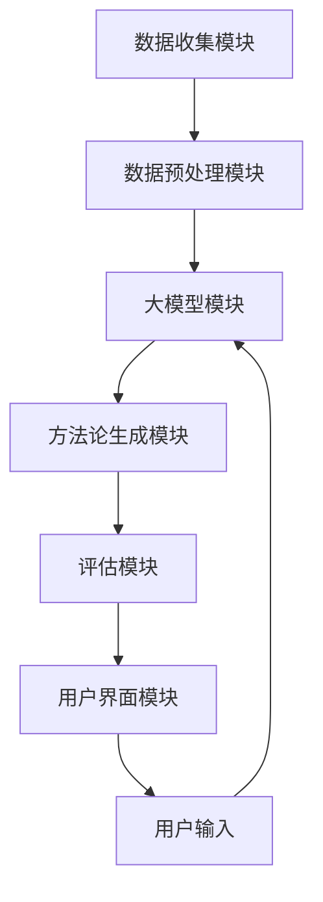

# 开发基于大模型的金融研究方法论创新生成系统

> 关键词：大模型、金融研究方法论、创新生成系统、人工智能、自然语言处理、金融科技、数据挖掘

> 摘要：本文聚焦于开发基于大模型的金融研究方法论创新生成系统。在金融市场日益复杂、数据量爆炸式增长的背景下，传统金融研究方法面临诸多挑战。大模型凭借其强大的语言理解和生成能力，为金融研究方法论的创新提供了新的途径。文章详细阐述了该系统开发的背景、核心概念、算法原理、数学模型，通过项目实战展示了系统的实现过程和代码解读，探讨了其实际应用场景，推荐了相关的学习资源、开发工具和论文著作，最后总结了未来发展趋势与挑战，并对常见问题进行了解答。

## 1. 背景介绍 
### 1.1 目的和范围
在当今金融领域，市场环境瞬息万变，金融数据的规模和复杂度不断增加。传统的金融研究方法在处理海量数据、挖掘潜在规律以及快速响应市场变化等方面逐渐显得力不从心。本系统的开发目的在于利用大模型的优势，为金融研究人员提供一种创新的方法论生成工具，帮助他们更高效地进行金融研究，发现新的研究视角和方法。

本系统的范围涵盖了从金融数据的收集、预处理，到利用大模型进行方法论的生成和评估的全过程。它可以应用于金融市场分析、投资策略制定、风险管理等多个金融研究领域。

### 1.2 预期读者
本系统的预期读者主要包括金融研究人员、金融分析师、投资经理等金融领域的专业人士，他们希望借助先进的技术手段提升金融研究的效率和质量。同时，对金融科技、人工智能在金融领域应用感兴趣的研究人员和开发者也可以从本文中获得相关的技术知识和实践经验。

### 1.3 文档结构概述
本文将按照以下结构进行阐述：首先介绍开发基于大模型的金融研究方法论创新生成系统的背景信息，包括目的、预期读者和文档结构概述等；接着详细讲解核心概念与联系，包括相关的原理和架构；然后深入探讨核心算法原理和具体操作步骤，并给出Python源代码；之后介绍数学模型和公式，并进行详细讲解和举例说明；通过项目实战展示系统的实际开发过程，包括开发环境搭建、源代码实现和代码解读；探讨系统的实际应用场景；推荐相关的学习资源、开发工具和论文著作；总结未来发展趋势与挑战；在附录中解答常见问题；最后提供扩展阅读和参考资料。

### 1.4 术语表
#### 1.4.1 核心术语定义
- **大模型**：指具有大量参数和强大计算能力的人工智能模型，如GPT系列、BERT等，能够处理自然语言理解、生成等复杂任务。
- **金融研究方法论**：指在金融研究过程中所采用的理论、方法和技术的总和，包括数据收集、分析、建模等环节。
- **创新生成系统**：指利用人工智能技术，能够自动生成新的金融研究方法论的系统。

#### 1.4.2 相关概念解释
- **自然语言处理（NLP）**：是人工智能的一个重要领域，研究如何让计算机理解和处理人类语言。在本系统中，NLP技术用于对金融文本数据的处理和分析。
- **机器学习**：是一门多领域交叉学科，涉及概率论、统计学、逼近论、凸分析、算法复杂度理论等多门学科。它专门研究计算机怎样模拟或实现人类的学习行为，以获取新的知识或技能，重新组织已有的知识结构使之不断改善自身的性能。在本系统中，机器学习算法用于对金融数据的建模和分析。

#### 1.4.3 缩略词列表
- **NLP**：自然语言处理（Natural Language Processing）
- **GPT**：生成式预训练变压器（Generative Pretrained Transformer）
- **BERT**：双向编码器表示来自变换器（Bidirectional Encoder Representations from Transformers）

## 2. 核心概念与联系 
### 核心概念原理
本系统的核心在于利用大模型的强大语言理解和生成能力，结合金融领域的专业知识和数据，生成创新的金融研究方法论。大模型通过在大规模文本数据上进行预训练，学习到了丰富的语言知识和语义信息。在金融领域，我们可以将金融文本数据（如研究报告、新闻资讯、行业动态等）输入到预训练好的大模型中，让模型理解金融领域的语言和概念。

然后，通过特定的提示和引导，大模型可以根据输入的金融问题和需求，生成相关的研究思路、方法和技术，从而为金融研究人员提供创新的方法论。例如，当输入“如何对股票市场的波动性进行更准确的预测”时，大模型可以生成基于深度学习的时间序列分析方法、结合宏观经济指标的多元回归分析方法等。

### 架构的文本示意图
本系统主要由以下几个模块组成：
1. **数据收集模块**：负责收集金融领域的各种数据，包括文本数据（如研究报告、新闻资讯等）和数值数据（如股票价格、财务报表等）。
2. **数据预处理模块**：对收集到的数据进行清洗、标注、分词等预处理操作，以便后续的模型训练和分析。
3. **大模型模块**：使用预训练好的大模型，如GPT或BERT，对预处理后的数据进行处理和分析。
4. **方法论生成模块**：根据用户输入的金融问题和需求，结合大模型的输出，生成创新的金融研究方法论。
5. **评估模块**：对生成的方法论进行评估和验证，确保其有效性和可行性。
6. **用户界面模块**：为用户提供一个友好的交互界面，方便用户输入问题、查看生成的方法论和评估结果。

### Mermaid流程图


## 3. 核心算法原理 & 具体操作步骤 
### 核心算法原理
本系统主要使用大模型的文本生成算法。以GPT模型为例，GPT是基于Transformer架构的生成式预训练模型。Transformer架构采用了自注意力机制（Self-Attention Mechanism），能够更好地捕捉文本中的长距离依赖关系。

GPT的训练过程分为两个阶段：预训练阶段和微调阶段。在预训练阶段，模型在大规模无标签文本数据上进行训练，学习语言的通用模式和语义信息。在微调阶段，模型在特定领域的有标签数据上进行微调，以适应具体的任务需求。

在本系统中，我们首先使用预训练好的GPT模型，然后在金融领域的文本数据上进行微调，使其更好地理解金融领域的语言和概念。当用户输入金融问题时，模型根据输入的文本，利用其内部的语言模型生成相关的金融研究方法论。

### 具体操作步骤
1. **数据收集**：收集金融领域的各种数据，包括研究报告、新闻资讯、财务报表等。可以使用网络爬虫技术从金融网站、新闻媒体等渠道获取数据。
2. **数据预处理**：对收集到的数据进行清洗，去除噪声和无效信息；进行标注，将数据标记为不同的类别和标签；进行分词，将文本数据分割成单个的词语或短语。
3. **模型微调**：使用预处理后的数据对预训练好的GPT模型进行微调。可以使用Python的Transformers库来实现模型的微调。
4. **方法论生成**：用户输入金融问题，将问题输入到微调后的模型中，模型根据输入生成相关的金融研究方法论。
5. **评估和优化**：对生成的方法论进行评估，使用金融领域的专业知识和数据验证其有效性和可行性。根据评估结果对模型进行优化，提高生成方法论的质量。

### Python源代码
以下是一个使用Transformers库对GPT模型进行微调并生成文本的示例代码：
```python
import torch
from transformers import GPT2LMHeadModel, GPT2Tokenizer, TextDataset, DataCollatorForLanguageModeling
from transformers import Trainer, TrainingArguments

# 加载预训练的GPT模型和分词器
model_name = "gpt2"
tokenizer = GPT2Tokenizer.from_pretrained(model_name)
model = GPT2LMHeadModel.from_pretrained(model_name)

# 定义数据集
train_dataset = TextDataset(
    tokenizer=tokenizer,
    file_path="financial_data.txt",  # 金融领域的文本数据文件
    block_size=128
)

# 定义数据收集器
data_collator = DataCollatorForLanguageModeling(
    tokenizer=tokenizer, mlm=False
)

# 定义训练参数
training_args = TrainingArguments(
    output_dir="./results",
    overwrite_output_dir=True,
    num_train_epochs=3,
    per_device_train_batch_size=4,
    save_steps=10_000,
    save_total_limit=2,
    prediction_loss_only=True,
)

# 定义训练器
trainer = Trainer(
    model=model,
    args=training_args,
    data_collator=data_collator,
    train_dataset=train_dataset,
)

# 微调模型
trainer.train()

# 保存微调后的模型
trainer.save_model("./fine_tuned_model")

# 加载微调后的模型
fine_tuned_model = GPT2LMHeadModel.from_pretrained("./fine_tuned_model")

# 生成文本
input_text = "如何对股票市场的波动性进行更准确的预测"
input_ids = tokenizer.encode(input_text, return_tensors="pt")
output = fine_tuned_model.generate(input_ids, max_length=200, num_beams=5, no_repeat_ngram_size=2, early_stopping=True)
generated_text = tokenizer.decode(output[0], skip_special_tokens=True)
print(generated_text)
```

## 4. 数学模型和公式 & 详细讲解 & 举例说明 
### 自注意力机制数学模型
自注意力机制是Transformer架构的核心，其数学模型可以表示为：

$$Attention(Q, K, V) = softmax(\frac{QK^T}{\sqrt{d_k}})V$$

其中，$Q$ 是查询矩阵（Query），$K$ 是键矩阵（Key），$V$ 是值矩阵（Value），$d_k$ 是键向量的维度。

### 详细讲解
自注意力机制的主要作用是计算输入序列中每个位置与其他位置的相关性。具体步骤如下：
1. **线性变换**：将输入序列 $X$ 通过三个不同的线性变换得到查询矩阵 $Q$、键矩阵 $K$ 和值矩阵 $V$。
$$Q = XW_Q$$
$$K = XW_K$$
$$V = XW_V$$

其中，$W_Q$、$W_K$ 和 $W_V$ 是可学习的权重矩阵。

2. **计算注意力分数**：计算查询矩阵 $Q$ 和键矩阵 $K$ 的点积，然后除以 $\sqrt{d_k}$ 进行缩放，最后通过softmax函数得到注意力分数。
$$Attention\ Scores = \frac{QK^T}{\sqrt{d_k}}$$
$$Attention\ Probabilities = softmax(Attention\ Scores)$$

3. **加权求和**：将注意力概率与值矩阵 $V$ 相乘，得到最终的输出。
$$Output = Attention\ Probabilities \times V$$

### 举例说明
假设输入序列 $X$ 是一个长度为 $n$ 的向量序列，每个向量的维度为 $d$。经过线性变换后，$Q$、$K$ 和 $V$ 的维度分别为 $n \times d_k$、$n \times d_k$ 和 $n \times d_v$。

计算注意力分数时，$QK^T$ 的维度为 $n \times n$，表示每个位置与其他位置的相关性。通过softmax函数将注意力分数转换为概率分布，然后与 $V$ 相乘，得到最终的输出。

例如，当输入序列是一个金融新闻文本时，自注意力机制可以捕捉到文本中不同词语之间的语义关系，从而更好地理解文本的含义。

## 5. 项目实战：代码实际案例和详细解释说明 
### 5.1  开发环境搭建
1. **安装Python**：建议使用Python 3.7及以上版本。可以从Python官方网站（https://www.python.org/downloads/）下载并安装。
2. **安装依赖库**：使用pip安装必要的依赖库，包括Transformers、torch等。
```bash
pip install transformers torch
```
3. **准备数据**：收集金融领域的文本数据，并将其保存为文本文件，如`financial_data.txt`。

### 5.2  源代码详细实现和代码解读
以下是完整的项目实战代码：
```python
import torch
from transformers import GPT2LMHeadModel, GPT2Tokenizer, TextDataset, DataCollatorForLanguageModeling
from transformers import Trainer, TrainingArguments

# 加载预训练的GPT模型和分词器
model_name = "gpt2"
tokenizer = GPT2Tokenizer.from_pretrained(model_name)
model = GPT2LMHeadModel.from_pretrained(model_name)

# 定义数据集
train_dataset = TextDataset(
    tokenizer=tokenizer,
    file_path="financial_data.txt",  # 金融领域的文本数据文件
    block_size=128
)

# 定义数据收集器
data_collator = DataCollatorForLanguageModeling(
    tokenizer=tokenizer, mlm=False
)

# 定义训练参数
training_args = TrainingArguments(
    output_dir="./results",
    overwrite_output_dir=True,
    num_train_epochs=3,
    per_device_train_batch_size=4,
    save_steps=10_000,
    save_total_limit=2,
    prediction_loss_only=True,
)

# 定义训练器
trainer = Trainer(
    model=model,
    args=training_args,
    data_collator=data_collator,
    train_dataset=train_dataset,
)

# 微调模型
trainer.train()

# 保存微调后的模型
trainer.save_model("./fine_tuned_model")

# 加载微调后的模型
fine_tuned_model = GPT2LMHeadModel.from_pretrained("./fine_tuned_model")

# 生成文本
input_text = "如何对股票市场的波动性进行更准确的预测"
input_ids = tokenizer.encode(input_text, return_tensors="pt")
output = fine_tuned_model.generate(input_ids, max_length=200, num_beams=5, no_repeat_ngram_size=2, early_stopping=True)
generated_text = tokenizer.decode(output[0], skip_special_tokens=True)
print(generated_text)
```

### 代码解读
1. **加载预训练的GPT模型和分词器**：使用`GPT2LMHeadModel`和`GPT2Tokenizer`从Hugging Face的模型库中加载预训练的GPT模型和分词器。
2. **定义数据集**：使用`TextDataset`将金融领域的文本数据转换为适合模型训练的数据集。
3. **定义数据收集器**：使用`DataCollatorForLanguageModeling`将数据集转换为适合模型训练的格式。
4. **定义训练参数**：使用`TrainingArguments`定义模型训练的参数，如训练轮数、批次大小等。
5. **定义训练器**：使用`Trainer`定义模型训练的对象，将模型、训练参数、数据收集器和数据集传递给训练器。
6. **微调模型**：调用`trainer.train()`方法对模型进行微调。
7. **保存微调后的模型**：调用`trainer.save_model()`方法保存微调后的模型。
8. **加载微调后的模型**：使用`GPT2LMHeadModel.from_pretrained()`方法加载微调后的模型。
9. **生成文本**：将用户输入的金融问题编码为输入ID，然后调用`fine_tuned_model.generate()`方法生成相关的金融研究方法论，最后将生成的ID解码为文本并输出。

### 5.3  代码解读与分析
通过上述代码，我们可以看到如何使用Transformers库对GPT模型进行微调并生成文本。在实际应用中，我们可以根据具体的需求调整训练参数和生成参数，以提高模型的性能和生成方法论的质量。

例如，增加训练轮数可以让模型更好地学习金融领域的语言和概念，但也可能导致过拟合；增加生成的最大长度可以生成更详细的方法论，但也可能导致生成的文本冗长和不准确。因此，需要根据实际情况进行合理的调整。

## 6. 实际应用场景 
### 金融市场分析
在金融市场分析中，本系统可以帮助分析师快速生成新的研究思路和方法。例如，当市场出现异常波动时，分析师可以输入相关问题，如“如何分析当前市场波动的原因和趋势”，系统可以生成基于宏观经济指标、技术分析、情绪分析等多种方法的研究思路，帮助分析师更全面地了解市场情况。

### 投资策略制定
在投资策略制定方面，系统可以根据投资者的风险偏好、投资目标等输入信息，生成创新的投资策略。例如，对于风险偏好较低的投资者，系统可以生成基于资产配置、价值投资等方法的投资策略；对于风险偏好较高的投资者，系统可以生成基于量化交易、趋势跟踪等方法的投资策略。

### 风险管理
在风险管理领域，系统可以帮助金融机构识别和评估潜在的风险，并生成相应的风险应对策略。例如，当金融机构面临信用风险、市场风险等问题时，系统可以根据相关数据和信息，生成基于风险度量模型、压力测试等方法的风险管理策略，帮助金融机构降低风险损失。

### 金融产品创新
在金融产品创新方面，系统可以为金融机构提供新的产品设计思路和方法。例如，系统可以根据市场需求和客户偏好，生成基于人工智能、区块链等新技术的金融产品创新方案，帮助金融机构推出更具竞争力的金融产品。

## 7. 工具和资源推荐
### 7.1 学习资源推荐
#### 7.1.1 书籍推荐
- 《Python深度学习》：介绍了Python在深度学习领域的应用，包括神经网络、卷积神经网络、循环神经网络等，是学习深度学习的经典书籍。
- 《自然语言处理入门》：详细介绍了自然语言处理的基本概念、方法和技术，包括分词、词性标注、命名实体识别等，是学习自然语言处理的入门书籍。
- 《金融科技：人工智能与机器学习在金融领域的应用》：介绍了人工智能和机器学习在金融领域的应用，包括风险评估、投资决策、金融市场预测等，是了解金融科技的重要书籍。

#### 7.1.2 在线课程
- Coursera上的“Deep Learning Specialization”：由深度学习领域的知名学者Andrew Ng教授授课，全面介绍了深度学习的理论和实践，是学习深度学习的优质在线课程。
- edX上的“Natural Language Processing with Deep Learning”：介绍了自然语言处理与深度学习的结合，包括词嵌入、循环神经网络、Transformer等，是学习自然语言处理的高级在线课程。
- 中国大学MOOC上的“金融科技前沿：技术应用与趋势分析”：介绍了金融科技的前沿技术和应用趋势，包括区块链、人工智能、大数据等，是了解金融科技的在线课程。

#### 7.1.3 技术博客和网站
- Hugging Face官方博客：提供了关于Transformer模型和自然语言处理的最新研究成果和技术文章，是了解自然语言处理领域最新动态的重要渠道。
- Medium上的“Towards Data Science”：汇集了大量关于数据科学、机器学习、深度学习等领域的技术文章和案例分析，是学习数据科学和人工智能的优质博客。
- 金融界网站：提供了丰富的金融新闻、研究报告、数据等信息，是了解金融市场和金融行业的重要网站。

### 7.2 开发工具框架推荐
#### 7.2.1 IDE和编辑器
- PyCharm：是一款专业的Python集成开发环境，提供了丰富的代码编辑、调试、测试等功能，是Python开发的首选工具。
- Visual Studio Code：是一款轻量级的代码编辑器，支持多种编程语言和插件扩展，具有良好的用户体验和开发效率。

#### 7.2.2 调试和性能分析工具
- PyTorch Profiler：是PyTorch提供的性能分析工具，可以帮助开发者分析模型的训练和推理性能，找出性能瓶颈并进行优化。
- TensorBoard：是TensorFlow提供的可视化工具，可以帮助开发者可视化模型的训练过程、损失曲线、准确率等指标，方便进行模型调优。

#### 7.2.3 相关框架和库
- Transformers：是Hugging Face开发的自然语言处理框架，提供了丰富的预训练模型和工具，方便开发者进行自然语言处理任务的开发。
- PyTorch：是一个开源的深度学习框架，具有高效的计算能力和灵活的编程接口，是深度学习研究和开发的常用框架。
- Pandas：是一个用于数据处理和分析的Python库，提供了丰富的数据结构和数据操作函数，方便开发者进行数据清洗、预处理和分析。

### 7.3 相关论文著作推荐
#### 7.3.1 经典论文
- “Attention Is All You Need”：介绍了Transformer架构和自注意力机制，是自然语言处理领域的经典论文。
- “BERT: Pre-training of Deep Bidirectional Transformers for Language Understanding”：介绍了BERT模型的预训练和微调方法，是自然语言处理领域的重要论文。
- “Generative Pretrained Transformer 3 (GPT-3): Language Models are Few-Shot Learners”：介绍了GPT-3模型的强大语言生成能力和少样本学习能力，是自然语言处理领域的前沿论文。

#### 7.3.2 最新研究成果
- 关注顶级学术会议和期刊，如ACL（Association for Computational Linguistics）、EMNLP（Conference on Empirical Methods in Natural Language Processing）、NeurIPS（Conference on Neural Information Processing Systems）等，了解自然语言处理和人工智能领域的最新研究成果。

#### 7.3.3 应用案例分析
- 关注金融科技领域的研究报告和案例分析，了解人工智能和机器学习在金融领域的实际应用案例和效果，如高盛、摩根大通等金融机构的相关研究报告。

## 8. 总结：未来发展趋势与挑战
### 未来发展趋势
1. **多模态融合**：未来的金融研究方法论创新生成系统将不仅仅局限于文本数据，还将融合图像、语音等多模态数据，实现更全面、更准确的金融研究。
2. **强化学习与优化**：结合强化学习技术，系统可以自动优化生成的方法论，根据实际应用效果不断调整和改进，提高方法论的有效性和可行性。
3. **个性化服务**：根据用户的不同需求和偏好，系统可以提供个性化的金融研究方法论生成服务，满足不同用户的特定需求。
4. **跨领域融合**：金融研究将与其他领域（如物理学、生物学等）进行更深入的融合，系统可以借鉴其他领域的研究方法和技术，生成更具创新性的金融研究方法论。

### 挑战
1. **数据质量和隐私问题**：金融数据的质量和隐私是系统开发和应用的重要挑战。需要确保数据的准确性、完整性和安全性，同时遵守相关的法律法规和隐私政策。
2. **模型可解释性**：大模型的黑盒性质使得其生成的方法论难以解释和理解。需要研究和开发可解释的人工智能技术，提高模型的可解释性和透明度。
3. **伦理和道德问题**：人工智能技术在金融领域的应用可能会带来一些伦理和道德问题，如算法偏见、不公平性等。需要建立相应的伦理和道德准则，规范系统的开发和应用。
4. **技术更新换代快**：人工智能技术发展迅速，新的模型和算法不断涌现。需要及时跟踪和学习最新的技术，不断更新和优化系统，以保持系统的竞争力。

## 9. 附录：常见问题与解答
### 1. 系统生成的方法论是否一定可行？
系统生成的方法论是基于大模型的语言理解和生成能力，结合金融领域的知识和数据生成的。虽然模型经过了微调，但生成的方法论仍然需要经过金融领域的专业知识和数据验证，确保其有效性和可行性。

### 2. 如何提高系统生成方法论的质量？
可以通过以下方法提高系统生成方法论的质量：
- 增加训练数据的数量和质量，让模型学习到更丰富的金融领域知识和语言模式。
- 调整训练参数和生成参数，如增加训练轮数、调整生成的最大长度等。
- 结合人工审核和优化，对生成的方法论进行人工评估和修改，提高其质量。

### 3. 系统是否可以处理不同语言的金融数据？
可以选择支持多语言的大模型，如mBERT等，对不同语言的金融数据进行处理。在微调模型时，使用相应语言的金融数据进行训练，以提高模型对不同语言的理解和生成能力。

### 4. 系统的性能如何优化？
可以通过以下方法优化系统的性能：
- 使用更高效的硬件设备，如GPU、TPU等，加速模型的训练和推理过程。
- 优化模型的架构和参数，减少模型的计算量和内存占用。
- 使用分布式训练技术，将模型训练任务分布到多个设备或节点上，提高训练效率。

## 10. 扩展阅读 & 参考资料
### 扩展阅读
- 《人工智能时代的金融科技》
- 《金融科技：重塑金融行业的未来》
- 《自然语言处理实战：基于Python和深度学习》

### 参考资料
- Hugging Face官方文档：https://huggingface.co/docs
- PyTorch官方文档：https://pytorch.org/docs/stable/index.html
- Pandas官方文档：https://pandas.pydata.org/docs/