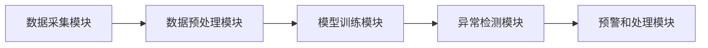

# 开发智能化的金融市场异常交易检测模型

> 关键词：金融市场、异常交易检测、智能化模型、机器学习、深度学习

> 摘要：本文聚焦于开发智能化的金融市场异常交易检测模型。首先介绍了该研究的背景、目的、预期读者等内容，接着阐述了异常交易检测相关的核心概念与联系，详细讲解了核心算法原理及具体操作步骤，包括使用 Python 源代码进行说明。还深入探讨了数学模型和公式，并结合举例进行解释。通过项目实战展示了代码实际案例及详细解释，分析了其在实际应用场景中的作用。最后推荐了相关的工具和资源，总结了未来发展趋势与挑战，提供了常见问题与解答以及扩展阅读和参考资料，旨在为金融市场异常交易检测提供全面、深入的技术指导和研究思路。

## 1. 背景介绍 
### 1.1 目的和范围
金融市场的稳定与安全对于经济的健康发展至关重要。异常交易行为，如市场操纵、内幕交易等，不仅损害了投资者的利益，还可能引发系统性金融风险。开发智能化的金融市场异常交易检测模型的目的在于及时、准确地识别这些异常交易行为，维护金融市场的公平、公正和透明。

本研究的范围涵盖了股票市场、期货市场、外汇市场等主要金融市场，旨在构建一个通用的、可扩展的异常交易检测模型，能够适应不同金融市场的特点和需求。

### 1.2 预期读者
本文的预期读者包括金融机构的风险管理人员、数据分析师、软件开发人员，以及对金融市场异常交易检测感兴趣的研究人员和学者。对于金融从业者，本文提供了实用的技术和方法，帮助他们更好地管理风险；对于技术人员，本文深入探讨了相关的算法和模型，为他们的研究和开发工作提供参考。

### 1.3 文档结构概述
本文共分为十个部分。第一部分介绍了开发智能化金融市场异常交易检测模型的背景信息，包括目的、预期读者和文档结构概述等。第二部分阐述了核心概念与联系，包括异常交易的定义、检测模型的架构等，并给出了相应的示意图和流程图。第三部分详细讲解了核心算法原理和具体操作步骤，通过 Python 源代码进行说明。第四部分介绍了数学模型和公式，并结合实际例子进行解释。第五部分通过项目实战展示了代码实际案例及详细解释。第六部分探讨了该模型在实际金融市场中的应用场景。第七部分推荐了相关的学习资源、开发工具框架和论文著作。第八部分总结了未来发展趋势与挑战。第九部分提供了常见问题与解答。第十部分列出了扩展阅读和参考资料。

### 1.4 术语表
#### 1.4.1 核心术语定义
- **异常交易**：指偏离正常交易模式和行为的交易活动，可能包括价格操纵、内幕交易、高频交易异常等。
- **异常检测模型**：用于识别数据中异常模式的模型，通过对历史数据的学习和分析，判断新的交易数据是否异常。
- **机器学习**：是一门多领域交叉学科，涉及概率论、统计学、逼近论、凸分析、算法复杂度理论等多门学科。它专门研究计算机怎样模拟或实现人类的学习行为，以获取新的知识或技能，重新组织已有的知识结构使之不断改善自身的性能。
- **深度学习**：是机器学习的一个分支领域，它是一种基于对数据进行表征学习的方法。深度学习通过构建具有很多层的神经网络模型，自动从大量数据中学习复杂的模式和特征。

#### 1.4.2 相关概念解释
- **监督学习**：是机器学习中的一种学习方式，在监督学习中，训练数据包含输入数据和对应的输出标签。模型通过学习输入数据和输出标签之间的关系，来对新的输入数据进行预测。
- **无监督学习**：与监督学习不同，无监督学习的训练数据不包含输出标签。模型通过对输入数据的分析和挖掘，发现数据中的潜在结构和模式，如聚类分析等。
- **特征工程**：是指从原始数据中提取和选择有用的特征，以提高模型的性能和准确性。在异常交易检测中，特征工程包括对交易数据的清洗、转换和特征提取等操作。

#### 1.4.3 缩略词列表
- **ML**：Machine Learning（机器学习）
- **DL**：Deep Learning（深度学习）
- **PCA**：Principal Component Analysis（主成分分析）
- **SVM**：Support Vector Machine（支持向量机）

## 2. 核心概念与联系 

### 异常交易的定义和分类
异常交易是指在金融市场中偏离正常交易模式和行为的交易活动。根据其行为特征和影响程度，异常交易可以分为以下几类：
- **价格操纵**：通过大量买卖股票或其他金融资产，人为地影响市场价格，以获取非法利益。
- **内幕交易**：利用未公开的内幕信息进行交易，获取不公平的利润。
- **高频交易异常**：高频交易是指利用计算机算法和高速网络进行的快速交易。高频交易异常可能包括异常的交易速度、交易量和交易策略等。

### 异常交易检测模型的架构
一个典型的异常交易检测模型通常包括以下几个部分：
- **数据采集模块**：负责收集金融市场的交易数据，包括交易时间、交易价格、交易量等。
- **数据预处理模块**：对采集到的原始数据进行清洗、转换和特征提取等操作，以提高数据的质量和可用性。
- **模型训练模块**：选择合适的机器学习或深度学习算法，对预处理后的数据进行训练，构建异常交易检测模型。
- **异常检测模块**：使用训练好的模型对新的交易数据进行实时检测，判断是否存在异常交易行为。
- **预警和处理模块**：当检测到异常交易行为时，及时发出预警信息，并采取相应的处理措施，如限制交易、调查取证等。

### 核心概念的文本示意图
```plaintext
金融市场异常交易检测模型
|-- 数据采集模块
|   |-- 交易数据收集
|-- 数据预处理模块
|   |-- 数据清洗
|   |-- 数据转换
|   |-- 特征提取
|-- 模型训练模块
|   |-- 算法选择
|   |-- 模型训练
|-- 异常检测模块
|   |-- 实时检测
|-- 预警和处理模块
|   |-- 预警信息发送
|   |-- 处理措施执行
```

### Mermaid 流程图


## 3. 核心算法原理 & 具体操作步骤 

### 核心算法原理
在金融市场异常交易检测中，常用的算法包括机器学习算法和深度学习算法。下面以支持向量机（SVM）和卷积神经网络（CNN）为例，介绍其原理。

#### 支持向量机（SVM）
支持向量机是一种二分类模型，其基本思想是在特征空间中找到一个最优的超平面，将不同类别的样本分开。对于线性可分的数据集，SVM 可以找到一个唯一的最优超平面；对于线性不可分的数据集，SVM 可以通过引入核函数将其映射到高维空间，使其在高维空间中线性可分。

#### 卷积神经网络（CNN）
卷积神经网络是一种深度学习模型，主要用于处理具有网格结构的数据，如图像、时间序列等。CNN 通过卷积层、池化层和全连接层等组件，自动提取数据的特征，并进行分类或回归任务。在异常交易检测中，CNN 可以学习交易数据的时空特征，提高检测的准确性。

### 具体操作步骤

#### 数据准备
首先，需要收集金融市场的交易数据，并进行预处理。以下是一个简单的 Python 代码示例，用于读取和清洗交易数据：

```python
import pandas as pd

# 读取交易数据
data = pd.read_csv('transaction_data.csv')

# 数据清洗
data = data.dropna()  # 删除缺失值
data = data.reset_index(drop=True)  # 重置索引

# 特征选择
features = data[['price', 'volume', 'time']]
labels = data['label']  # 假设数据集中有一个标签列，标记是否为异常交易
```

#### 数据划分
将数据集划分为训练集和测试集，用于模型的训练和评估。

```python
from sklearn.model_selection import train_test_split

X_train, X_test, y_train, y_test = train_test_split(features, labels, test_size=0.2, random_state=42)
```

#### 模型训练
使用支持向量机进行模型训练。

```python
from sklearn.svm import SVC

# 创建 SVM 模型
svm_model = SVC(kernel='rbf', C=1.0, gamma='scale')

# 训练模型
svm_model.fit(X_train, y_train)
```

#### 模型评估
使用测试集对训练好的模型进行评估。

```python
from sklearn.metrics import accuracy_score, precision_score, recall_score, f1_score

# 预测
y_pred = svm_model.predict(X_test)

# 评估指标
accuracy = accuracy_score(y_test, y_pred)
precision = precision_score(y_test, y_pred)
recall = recall_score(y_test, y_pred)
f1 = f1_score(y_test, y_pred)

print(f'Accuracy: {accuracy}')
print(f'Precision: {precision}')
print(f'Recall: {recall}')
print(f'F1-score: {f1}')
```

## 4. 数学模型和公式 & 详细讲解 & 举例说明 

### 支持向量机（SVM）的数学模型和公式
#### 线性可分情况
对于线性可分的数据集 $\{(x_1, y_1), (x_2, y_2), \cdots, (x_n, y_n)\}$，其中 $x_i \in \mathbb{R}^d$ 是特征向量，$y_i \in \{-1, +1\}$ 是标签。SVM 的目标是找到一个超平面 $w^T x + b = 0$，使得不同类别的样本能够被正确分开，并且间隔最大。

间隔的定义为：$$\gamma = \frac{2}{\|w\|}$$

SVM 的优化问题可以表示为：
$$
\begin{aligned}
\min_{w, b} &\quad \frac{1}{2} \|w\|^2 \\
\text{s.t.} &\quad y_i (w^T x_i + b) \geq 1, \quad i = 1, 2, \cdots, n
\end{aligned}
$$

#### 线性不可分情况
对于线性不可分的数据集，需要引入松弛变量 $\xi_i \geq 0$，允许一些样本点被错误分类。此时，SVM 的优化问题变为：
$$
\begin{aligned}
\min_{w, b, \xi} &\quad \frac{1}{2} \|w\|^2 + C \sum_{i=1}^{n} \xi_i \\
\text{s.t.} &\quad y_i (w^T x_i + b) \geq 1 - \xi_i, \quad i = 1, 2, \cdots, n \\
&\quad \xi_i \geq 0, \quad i = 1, 2, \cdots, n
\end{aligned}
$$

其中，$C$ 是惩罚参数，用于控制错误分类的惩罚程度。

### 卷积神经网络（CNN）的数学模型和公式
#### 卷积层
卷积层是 CNN 的核心组件，通过卷积操作提取数据的特征。对于输入特征图 $X$ 和卷积核 $K$，卷积操作的输出特征图 $Y$ 可以表示为：
$$
Y_{i, j} = \sum_{m=0}^{M-1} \sum_{n=0}^{N-1} X_{i+m, j+n} K_{m, n} + b
$$

其中，$M$ 和 $N$ 是卷积核的大小，$b$ 是偏置项。

#### 池化层
池化层用于减少特征图的维度，提高模型的计算效率和泛化能力。常见的池化操作包括最大池化和平均池化。以最大池化为例，对于输入特征图 $X$，池化窗口大小为 $P \times P$，步长为 $S$，最大池化操作的输出特征图 $Y$ 可以表示为：
$$
Y_{i, j} = \max_{m=0}^{P-1} \max_{n=0}^{P-1} X_{iS+m, jS+n}
$$

#### 全连接层
全连接层将卷积层和池化层提取的特征进行整合，用于分类或回归任务。对于输入特征向量 $x$ 和权重矩阵 $W$，全连接层的输出 $y$ 可以表示为：
$$
y = Wx + b
$$

### 举例说明
假设我们有一个简单的二维数据集，包含两个类别，每个类别有 10 个样本。我们可以使用 SVM 对这个数据集进行分类。

```python
import numpy as np
import matplotlib.pyplot as plt
from sklearn.svm import SVC

# 生成数据集
np.random.seed(42)
X1 = np.random.randn(10, 2) + [2, 2]
X2 = np.random.randn(10, 2) + [-2, -2]
X = np.vstack((X1, X2))
y = np.hstack((np.ones(10), -np.ones(10)))

# 创建 SVM 模型
svm_model = SVC(kernel='linear', C=1.0)

# 训练模型
svm_model.fit(X, y)

# 绘制决策边界
plt.scatter(X[:, 0], X[:, 1], c=y, cmap=plt.cm.Paired)
ax = plt.gca()
xlim = ax.get_xlim()
ylim = ax.get_ylim()

xx = np.linspace(xlim[0], xlim[1], 30)
yy = np.linspace(ylim[0], ylim[1], 30)
YY, XX = np.meshgrid(yy, xx)
xy = np.vstack([XX.ravel(), YY.ravel()]).T
Z = svm_model.decision_function(xy).reshape(XX.shape)

ax.contour(XX, YY, Z, colors='k', levels=[-1, 0, 1], alpha=0.5, linestyles=['--', '-', '--'])
plt.show()
```

在这个例子中，我们使用线性核的 SVM 对二维数据集进行分类，并绘制了决策边界。

## 5. 项目实战：代码实际案例和详细解释说明 

### 5.1  开发环境搭建
#### 操作系统
建议使用 Linux 或 macOS 操作系统，因为它们对 Python 开发环境的支持更好。

#### Python 版本
建议使用 Python 3.7 及以上版本。

#### 安装依赖库
使用以下命令安装所需的依赖库：
```sh
pip install pandas numpy scikit-learn tensorflow matplotlib
```

### 5.2  源代码详细实现和代码解读
以下是一个使用卷积神经网络（CNN）进行金融市场异常交易检测的完整代码示例：

```python
import pandas as pd
import numpy as np
from sklearn.model_selection import train_test_split
from sklearn.preprocessing import StandardScaler
from tensorflow.keras.models import Sequential
from tensorflow.keras.layers import Conv1D, MaxPooling1D, Flatten, Dense
from tensorflow.keras.utils import to_categorical
import matplotlib.pyplot as plt

# 读取交易数据
data = pd.read_csv('transaction_data.csv')

# 数据清洗
data = data.dropna()  # 删除缺失值
data = data.reset_index(drop=True)  # 重置索引

# 特征选择
features = data[['price', 'volume', 'time']].values
labels = data['label'].values

# 数据标准化
scaler = StandardScaler()
features = scaler.fit_transform(features)

# 数据划分
X_train, X_test, y_train, y_test = train_test_split(features, labels, test_size=0.2, random_state=42)

# 调整数据形状以适应 CNN 输入
X_train = np.expand_dims(X_train, axis=2)
X_test = np.expand_dims(X_test, axis=2)

# 标签编码
y_train = to_categorical(y_train)
y_test = to_categorical(y_test)

# 构建 CNN 模型
model = Sequential()
model.add(Conv1D(filters=32, kernel_size=3, activation='relu', input_shape=(X_train.shape[1], 1)))
model.add(MaxPooling1D(pool_size=2))
model.add(Flatten())
model.add(Dense(64, activation='relu'))
model.add(Dense(y_train.shape[1], activation='softmax'))

# 编译模型
model.compile(optimizer='adam', loss='categorical_crossentropy', metrics=['accuracy'])

# 训练模型
history = model.fit(X_train, y_train, epochs=10, batch_size=32, validation_data=(X_test, y_test))

# 评估模型
loss, accuracy = model.evaluate(X_test, y_test)
print(f'Test Loss: {loss}')
print(f'Test Accuracy: {accuracy}')

# 绘制训练和验证损失曲线
plt.plot(history.history['loss'], label='Training Loss')
plt.plot(history.history['val_loss'], label='Validation Loss')
plt.xlabel('Epochs')
plt.ylabel('Loss')
plt.legend()
plt.show()

# 绘制训练和验证准确率曲线
plt.plot(history.history['accuracy'], label='Training Accuracy')
plt.plot(history.history['val_accuracy'], label='Validation Accuracy')
plt.xlabel('Epochs')
plt.ylabel('Accuracy')
plt.legend()
plt.show()
```

### 5.3  代码解读与分析
#### 数据读取和清洗
使用 `pandas` 库读取交易数据，并进行缺失值处理和索引重置。

#### 特征选择和标准化
选择 `price`、`volume` 和 `time` 作为特征，并使用 `StandardScaler` 对特征进行标准化处理，以提高模型的训练效果。

#### 数据划分
使用 `train_test_split` 函数将数据集划分为训练集和测试集，比例为 8:2。

#### 数据形状调整
由于 CNN 模型的输入需要特定的形状，因此使用 `np.expand_dims` 函数将数据的维度扩展为三维。

#### 标签编码
使用 `to_categorical` 函数将标签进行 one-hot 编码，以适应多分类任务。

#### 构建 CNN 模型
使用 `Sequential` 模型构建一个简单的 CNN 模型，包括卷积层、池化层、全连接层等组件。

#### 编译模型
使用 `adam` 优化器和 `categorical_crossentropy` 损失函数编译模型，并设置评估指标为准确率。

#### 训练模型
使用 `fit` 函数对模型进行训练，并记录训练过程中的损失和准确率。

#### 评估模型
使用 `evaluate` 函数对训练好的模型进行评估，输出测试集的损失和准确率。

#### 绘制曲线
使用 `matplotlib` 库绘制训练和验证损失曲线、训练和验证准确率曲线，以便观察模型的训练效果。

## 6. 实际应用场景 
### 股票市场
在股票市场中，异常交易检测模型可以帮助监管机构及时发现价格操纵、内幕交易等异常行为，维护市场的公平和稳定。例如，当某个股票的交易量突然大幅增加，而价格却没有相应上涨时，模型可以及时发出预警，提示可能存在异常交易行为。

### 期货市场
期货市场的交易具有高杠杆、高风险的特点，异常交易可能会引发系统性风险。异常交易检测模型可以对期货市场的交易数据进行实时监测，识别异常的交易策略和行为，如过度投机、操纵价格等，帮助期货公司和监管机构及时采取措施，防范风险。

### 外汇市场
外汇市场是全球最大的金融市场之一，交易规模巨大，流动性强。异常交易检测模型可以对外汇市场的交易数据进行分析，发现异常的汇率波动、大额资金流动等情况，帮助外汇交易商和监管机构及时掌握市场动态，防范外汇风险。

### 金融机构内部风险管理
金融机构，如银行、证券公司等，也可以使用异常交易检测模型对内部员工的交易行为进行监测，防范内部欺诈和违规交易行为。例如，当某个员工的交易行为与以往模式明显不同时，模型可以及时发出预警，提示可能存在风险。

## 7. 工具和资源推荐
### 7.1 学习资源推荐
#### 7.1.1 书籍推荐
- 《机器学习》（周志华）：全面介绍了机器学习的基本概念、算法和应用，是机器学习领域的经典教材。
- 《深度学习》（Ian Goodfellow、Yoshua Bengio、Aaron Courville）：深度学习领域的权威著作，深入讲解了深度学习的原理、算法和实践。
- 《Python 数据分析实战》（Wei-Meng Lee）：介绍了使用 Python 进行数据分析的方法和技巧，包括数据处理、可视化、机器学习等内容。

#### 7.1.2 在线课程
- Coursera 上的“机器学习”课程（Andrew Ng 教授）：全球知名的机器学习课程，讲解深入浅出，适合初学者。
- edX 上的“深度学习基础”课程：由百度深度学习研究院院长余凯教授授课，系统介绍了深度学习的基本概念和算法。
- 哔哩哔哩上的“Python 数据分析与机器学习实战”系列视频：内容丰富，结合实际案例进行讲解，适合快速入门。

#### 7.1.3 技术博客和网站
- 博客园：国内知名的技术博客平台，有很多关于机器学习、深度学习和金融数据分析的优秀博客文章。
- Medium：国外知名的技术博客平台，有很多国际顶尖的技术专家分享的最新研究成果和实践经验。
- Kaggle：全球知名的数据科学竞赛平台，有很多关于金融市场数据分析和异常检测的数据集和优秀代码。

### 7.2 开发工具框架推荐
#### 7.2.1 IDE和编辑器
- PyCharm：功能强大的 Python 集成开发环境，支持代码编辑、调试、版本控制等功能，适合专业的 Python 开发者。
- Jupyter Notebook：交互式的开发环境，适合数据探索、模型训练和可视化等任务，方便快速验证想法和分享代码。
- Visual Studio Code：轻量级的代码编辑器，支持多种编程语言和插件扩展，具有良好的用户体验。

#### 7.2.2 调试和性能分析工具
- TensorBoard：TensorFlow 提供的可视化工具，可以帮助用户直观地观察模型的训练过程、损失曲线、准确率曲线等信息，方便调试和优化模型。
- PyTorch Profiler：PyTorch 提供的性能分析工具，可以帮助用户分析模型的计算性能、内存使用情况等，找出性能瓶颈并进行优化。
- cProfile：Python 内置的性能分析工具，可以帮助用户分析 Python 代码的运行时间和函数调用情况，找出性能瓶颈。

#### 7.2.3 相关框架和库
- TensorFlow：开源的深度学习框架，由 Google 开发，支持多种深度学习算法和模型，具有高效的计算性能和广泛的应用场景。
- PyTorch：开源的深度学习框架，由 Facebook 开发，具有简洁易用的 API 和动态计算图的特点，适合快速开发和研究。
- Scikit-learn：开源的机器学习库，提供了丰富的机器学习算法和工具，如分类、回归、聚类、降维等，适合初学者和快速验证想法。

### 7.3 相关论文著作推荐
#### 7.3.1 经典论文
- “Support-Vector Networks”（Cortes 和 Vapnik，1995）：支持向量机的经典论文，首次提出了支持向量机的概念和算法。
- “Gradient-Based Learning Applied to Document Recognition”（LeCun 等人，1998）：卷积神经网络的经典论文，提出了 LeNet-5 模型，开启了深度学习在图像识别领域的应用。
- “Deep Learning”（LeCun、Bengio 和 Hinton，2015）：深度学习领域的综述论文，全面介绍了深度学习的发展历程、原理和应用。

#### 7.3.2 最新研究成果
- “Adversarial Attacks and Defenses in Financial Machine Learning”（2021）：研究了金融机器学习中的对抗攻击和防御方法，为金融市场异常交易检测模型的安全性提供了新的思路。
- “Graph Neural Networks for Financial Fraud Detection”（2022）：提出了使用图神经网络进行金融欺诈检测的方法，为异常交易检测提供了新的技术手段。

#### 7.3.3 应用案例分析
- “Anomaly Detection in Financial Markets: A Review”（2020）：对金融市场异常检测的方法和应用进行了综述，分析了不同方法的优缺点和适用场景。
- “Real-Time Anomaly Detection in High-Frequency Financial Data”（2019）：介绍了在高频金融数据中进行实时异常检测的方法和案例，为实际应用提供了参考。

## 8. 总结：未来发展趋势与挑战
### 未来发展趋势
#### 多模态数据融合
未来的异常交易检测模型将不仅仅依赖于交易数据，还会融合更多的多模态数据，如新闻文本、社交媒体数据、图像数据等。通过综合分析多种数据来源，可以更全面地了解市场动态和交易行为，提高异常检测的准确性和可靠性。

#### 深度学习与强化学习的结合
深度学习可以自动提取数据的特征，而强化学习可以通过与环境的交互不断优化策略。将深度学习与强化学习相结合，可以使异常交易检测模型更加智能和自适应，能够根据市场变化及时调整检测策略。

#### 联邦学习的应用
在金融领域，数据隐私和安全是非常重要的问题。联邦学习可以在不共享原始数据的情况下，实现多个参与方之间的模型训练和共享。未来，联邦学习可能会在金融市场异常交易检测中得到广泛应用，以保护数据隐私和安全。

### 挑战
#### 数据质量和标注问题
金融市场的交易数据通常具有高维度、高噪声、不平衡等特点，数据质量的好坏直接影响模型的性能。此外，异常交易的标注是一个非常困难的任务，需要专业的金融知识和经验，标注的准确性也会影响模型的训练效果。

#### 模型的可解释性
深度学习模型通常是黑盒模型，难以解释其决策过程和依据。在金融市场中，模型的可解释性非常重要，监管机构和投资者需要了解模型是如何做出决策的，以便评估风险和信任模型。因此，如何提高异常交易检测模型的可解释性是一个亟待解决的问题。

#### 对抗攻击
随着异常交易检测技术的发展，攻击者也会采用各种对抗攻击手段来绕过检测模型。如何提高异常交易检测模型的鲁棒性，抵御对抗攻击，是未来需要面对的挑战之一。

## 9. 附录：常见问题与解答
### 问题 1：如何选择合适的异常检测算法？
答：选择合适的异常检测算法需要考虑多个因素，如数据类型、数据规模、异常类型、模型的可解释性等。对于高维数据，可以考虑使用降维技术和基于深度学习的算法；对于不平衡数据，可以使用采样方法或代价敏感学习算法；对于需要可解释性的场景，可以选择基于规则的算法或简单的机器学习算法。

### 问题 2：如何处理数据中的缺失值？
答：处理数据中的缺失值有多种方法，如删除含有缺失值的样本、使用均值、中位数或众数填充缺失值、使用插值方法填充缺失值、使用机器学习模型预测缺失值等。具体选择哪种方法需要根据数据的特点和分析的目的来决定。

### 问题 3：如何评估异常检测模型的性能？
答：评估异常检测模型的性能可以使用多种指标，如准确率、召回率、F1 分数、ROC 曲线、AUC 值等。对于不平衡数据，准确率可能不是一个合适的评估指标，建议使用召回率、F1 分数或 AUC 值等指标来评估模型的性能。

### 问题 4：如何提高异常检测模型的准确率？
答：提高异常检测模型的准确率可以从以下几个方面入手：收集更多的高质量数据、进行特征工程，提取更有价值的特征、选择合适的异常检测算法和模型、调整模型的超参数、使用集成学习方法等。

## 10. 扩展阅读 & 参考资料
### 扩展阅读
- 《金融科技前沿：人工智能与区块链》：介绍了金融科技领域的最新发展趋势和技术应用，包括人工智能、区块链等技术在金融领域的应用案例和实践经验。
- 《大数据时代的金融风险管理》：探讨了大数据时代金融风险管理的挑战和机遇，介绍了如何利用大数据技术和人工智能算法进行金融风险的监测和预警。

### 参考资料
- [Scikit-learn 官方文档](https://scikit-learn.org/stable/)
- [TensorFlow 官方文档](https://www.tensorflow.org/)
- [PyTorch 官方文档](https://pytorch.org/)
- [Kaggle 数据集](https://www.kaggle.com/)