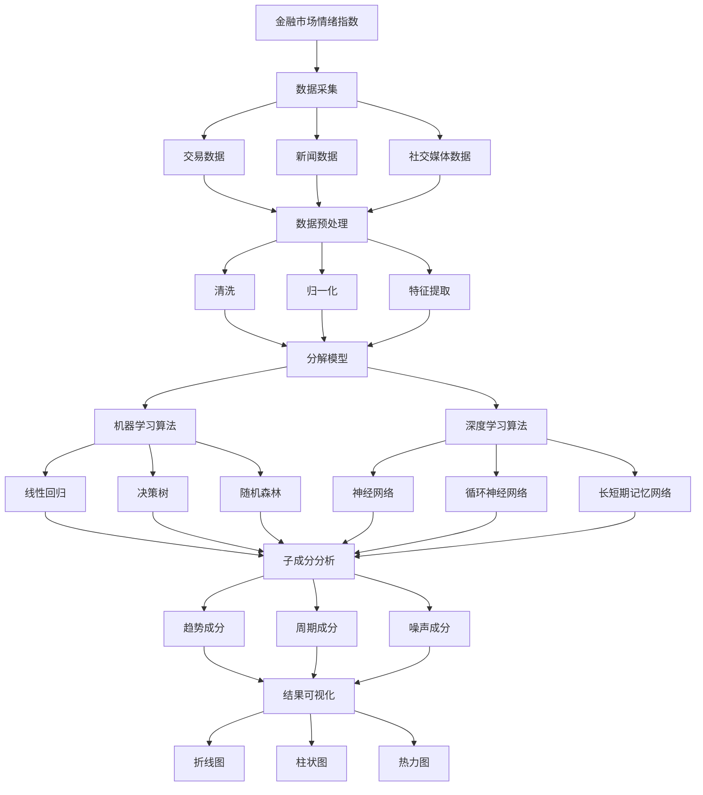

# 开发智能化的金融市场情绪指数分解模型

> 关键词：金融市场情绪指数、智能化分解模型、机器学习、数据挖掘、时间序列分析、量化金融、情绪分析

> 摘要：本文聚焦于开发智能化的金融市场情绪指数分解模型。随着金融市场的日益复杂和数据量的急剧增长，准确把握市场情绪对于投资者和金融机构至关重要。通过构建智能化的分解模型，能够将金融市场情绪指数进行有效分解，挖掘出其中潜在的信息和规律。文章详细阐述了该模型的背景、核心概念、算法原理、数学模型，结合项目实战给出具体代码案例和解释，探讨了实际应用场景，推荐了相关工具和资源，并对未来发展趋势与挑战进行了总结，同时提供常见问题解答和参考资料，旨在为相关领域的研究和实践提供全面而深入的指导。

## 1. 背景介绍 
### 1.1 目的和范围
在金融市场中，投资者的情绪对资产价格的波动有着重要影响。传统的金融分析方法往往侧重于基本面和技术面的分析，而忽略了市场情绪这一关键因素。开发智能化的金融市场情绪指数分解模型的目的在于更全面、深入地理解金融市场的运行机制，为投资者提供更准确的决策依据。

本模型的范围涵盖了多种金融市场，如股票市场、债券市场、期货市场等。通过对不同市场的情绪指数进行分解，挖掘出市场情绪的构成因素和变化规律，帮助投资者更好地把握市场动态。

### 1.2 预期读者
本文预期读者包括金融从业者，如投资经理、分析师、交易员等，他们可以借助该模型提升投资决策的准确性和效率；也包括计算机科学和人工智能领域的研究人员和开发者，模型的开发过程涉及到多种先进的技术和算法，对他们的研究和实践具有一定的参考价值；此外，还适合对金融市场和人工智能交叉领域感兴趣的学生和爱好者。

### 1.3 文档结构概述
本文首先介绍了开发智能化的金融市场情绪指数分解模型的背景信息，包括目的、预期读者和文档结构概述等内容。接着阐述了核心概念与联系，包括相关概念的原理和架构，并通过文本示意图和 Mermaid 流程图进行展示。然后详细讲解了核心算法原理和具体操作步骤，使用 Python 源代码进行阐述。之后介绍了数学模型和公式，并通过举例说明加深理解。在项目实战部分，给出了代码实际案例和详细解释说明。接着探讨了实际应用场景，推荐了相关的工具和资源。最后总结了未来发展趋势与挑战，提供了常见问题解答和参考资料。

### 1.4 术语表
#### 1.4.1 核心术语定义
- **金融市场情绪指数**：反映投资者对金融市场整体情绪的量化指标，通常基于投资者的交易行为、言论、新闻报道等数据构建。
- **智能化分解模型**：利用人工智能技术，如机器学习、深度学习等，对金融市场情绪指数进行分解的模型，能够自动挖掘出情绪指数中的潜在信息和规律。
- **时间序列分析**：一种用于分析按时间顺序排列的数据的统计方法，通过对历史数据的分析，预测未来的趋势和变化。
- **量化金融**：将数学、统计学和计算机科学等方法应用于金融领域，通过建立量化模型进行投资决策和风险管理。

#### 1.4.2 相关概念解释
- **情绪分析**：也称为情感分析，是指对文本数据中的情感倾向进行识别和分类的技术，常用于分析投资者的言论和新闻报道中的情绪。
- **特征工程**：在机器学习中，特征工程是指从原始数据中提取和选择有用的特征，以提高模型的性能和准确性。
- **模型评估**：对训练好的模型进行评估，以确定其性能和准确性的过程，常用的评估指标包括准确率、召回率、F1 值等。

#### 1.4.3 缩略词列表
- **AI**：Artificial Intelligence，人工智能
- **ML**：Machine Learning，机器学习
- **DL**：Deep Learning，深度学习
- **NLP**：Natural Language Processing，自然语言处理
- **ARIMA**：Autoregressive Integrated Moving Average，自回归积分滑动平均模型

## 2. 核心概念与联系 

### 核心概念原理
金融市场情绪指数分解模型的核心原理是将复杂的市场情绪指数分解为多个具有不同特征和含义的子成分。这些子成分可以反映市场情绪的不同方面，如短期波动、长期趋势、投资者的乐观或悲观情绪等。

市场情绪指数通常是由多种因素共同作用的结果，包括宏观经济数据、公司财务报表、政策变化、投资者的心理预期等。通过对这些因素的分析和挖掘，可以将市场情绪指数分解为不同的成分，从而更好地理解市场情绪的形成机制和变化规律。

### 架构的文本示意图
```plaintext
金融市场情绪指数
|
|-- 数据采集
|   |-- 交易数据
|   |-- 新闻数据
|   |-- 社交媒体数据
|
|-- 数据预处理
|   |-- 清洗
|   |-- 归一化
|   |-- 特征提取
|
|-- 分解模型
|   |-- 机器学习算法
|   |   |-- 线性回归
|   |   |-- 决策树
|   |   |-- 随机森林
|   |-- 深度学习算法
|   |   |-- 神经网络
|   |   |-- 循环神经网络
|   |   |-- 长短期记忆网络
|
|-- 子成分分析
|   |-- 趋势成分
|   |-- 周期成分
|   |-- 噪声成分
|
|-- 结果可视化
|   |-- 折线图
|   |-- 柱状图
|   |-- 热力图
```

### Mermaid 流程图


## 3. 核心算法原理 & 具体操作步骤 

### 核心算法原理
在金融市场情绪指数分解模型中，我们可以使用多种算法，这里以自回归积分滑动平均模型（ARIMA）和长短期记忆网络（LSTM）为例进行讲解。

#### ARIMA 算法原理
ARIMA 模型是一种经典的时间序列分析模型，它结合了自回归（AR）、差分（I）和滑动平均（MA）三个部分。其基本思想是通过对时间序列数据的历史值和误差项进行线性组合，来预测未来的值。

ARIMA 模型的一般形式可以表示为 $ARIMA(p, d, q)$，其中 $p$ 表示自回归项的阶数，$d$ 表示差分的阶数，$q$ 表示滑动平均项的阶数。

#### LSTM 算法原理
LSTM 是一种特殊的循环神经网络（RNN），它能够解决传统 RNN 中的梯度消失问题，从而更好地处理长序列数据。LSTM 网络通过门控机制来控制信息的流动，包括输入门、遗忘门和输出门。

输入门决定了哪些新信息可以进入细胞状态，遗忘门决定了哪些旧信息需要被遗忘，输出门决定了哪些信息可以从细胞状态中输出。

### 具体操作步骤

#### 步骤 1：数据准备
首先，我们需要收集金融市场的相关数据，包括交易数据、新闻数据、社交媒体数据等。然后对这些数据进行预处理，包括清洗、归一化和特征提取等操作。

#### 步骤 2：模型训练
使用准备好的数据对 ARIMA 模型和 LSTM 模型进行训练。对于 ARIMA 模型，需要确定合适的 $p$、$d$ 和 $q$ 参数；对于 LSTM 模型，需要确定网络的结构和参数，如神经元的数量、层数等。

#### 步骤 3：模型评估
使用测试数据对训练好的模型进行评估，计算评估指标，如均方误差（MSE）、平均绝对误差（MAE）等，以确定模型的性能和准确性。

#### 步骤 4：模型优化
根据评估结果，对模型进行优化，调整模型的参数和结构，以提高模型的性能和准确性。

#### 步骤 5：分解和分析
使用优化后的模型对金融市场情绪指数进行分解，得到不同的子成分，如趋势成分、周期成分和噪声成分。然后对这些子成分进行分析，挖掘出其中的潜在信息和规律。

### Python 源代码实现

```python
import pandas as pd
import numpy as np
from statsmodels.tsa.arima.model import ARIMA
from tensorflow.keras.models import Sequential
from tensorflow.keras.layers import LSTM, Dense
from sklearn.preprocessing import MinMaxScaler
from sklearn.metrics import mean_squared_error

# 步骤 1：数据准备
# 假设我们有一个包含金融市场情绪指数的时间序列数据
data = pd.read_csv('market_sentiment_index.csv', index_col='date', parse_dates=True)
scaler = MinMaxScaler()
scaled_data = scaler.fit_transform(data)

# 划分训练集和测试集
train_size = int(len(scaled_data) * 0.8)
train_data = scaled_data[:train_size]
test_data = scaled_data[train_size:]

# 步骤 2：ARIMA 模型训练
p, d, q = 1, 1, 1  # 假设的 p, d, q 参数
arima_model = ARIMA(train_data, order=(p, d, q))
arima_fit = arima_model.fit()

# 步骤 3：ARIMA 模型预测
arima_predictions = arima_fit.predict(start=len(train_data), end=len(train_data)+len(test_data)-1)
arima_predictions = arima_predictions.reshape(-1, 1)
arima_predictions = scaler.inverse_transform(arima_predictions)

# 步骤 4：LSTM 模型训练
def create_dataset(dataset, time_step=1):
    X, Y = [], []
    for i in range(len(dataset)-time_step-1):
        a = dataset[i:(i+time_step), 0]
        X.append(a)
        Y.append(dataset[i + time_step, 0])
    return np.array(X), np.array(Y)

time_step = 100
X_train, y_train = create_dataset(train_data, time_step)
X_test, y_test = create_dataset(test_data, time_step)

X_train = X_train.reshape(X_train.shape[0], X_train.shape[1], 1)
X_test = X_test.reshape(X_test.shape[0], X_test.shape[1], 1)

lstm_model = Sequential()
lstm_model.add(LSTM(50, return_sequences=True, input_shape=(time_step, 1)))
lstm_model.add(LSTM(50, return_sequences=True))
lstm_model.add(LSTM(50))
lstm_model.add(Dense(1))
lstm_model.compile(loss='mean_squared_error', optimizer='adam')
lstm_model.fit(X_train, y_train, epochs=100, batch_size=64, verbose=1)

# 步骤 5：LSTM 模型预测
lstm_predictions = lstm_model.predict(X_test)
lstm_predictions = scaler.inverse_transform(lstm_predictions)

# 步骤 6：模型评估
arima_mse = mean_squared_error(data.values[train_size+time_step+1:], arima_predictions)
lstm_mse = mean_squared_error(data.values[train_size+time_step+1:], lstm_predictions)

print(f'ARIMA MSE: {arima_mse}')
print(f'LSTM MSE: {lstm_mse}')
```

## 4. 数学模型和公式 & 详细讲解 & 举例说明 

### ARIMA 模型数学公式
ARIMA 模型的一般形式可以表示为：

$$
(1 - \sum_{i=1}^{p} \phi_i B^i)(1 - B)^d Y_t = (1 + \sum_{j=1}^{q} \theta_j B^j) \epsilon_t
$$

其中：
- $Y_t$ 是时间序列在 $t$ 时刻的值。
- $B$ 是后移算子，$B Y_t = Y_{t-1}$。
- $\phi_i$ 是自回归系数，$i = 1, 2, \cdots, p$。
- $d$ 是差分的阶数。
- $\theta_j$ 是滑动平均系数，$j = 1, 2, \cdots, q$。
- $\epsilon_t$ 是白噪声序列。

### 详细讲解
- **自回归部分（AR）**：自回归部分表示当前值与过去值之间的线性关系，通过自回归系数 $\phi_i$ 来描述。
- **差分部分（I）**：差分部分用于处理非平稳时间序列，通过差分操作将非平稳时间序列转换为平稳时间序列。
- **滑动平均部分（MA）**：滑动平均部分表示当前值与过去误差项之间的线性关系，通过滑动平均系数 $\theta_j$ 来描述。

### 举例说明
假设我们有一个时间序列 $Y_t$，$p = 1$，$d = 1$，$q = 1$，则 ARIMA(1, 1, 1) 模型可以表示为：

$$
(1 - \phi_1 B)(1 - B) Y_t = (1 + \theta_1 B) \epsilon_t
$$

展开可得：

$$
Y_t - Y_{t-1} - \phi_1 (Y_{t-1} - Y_{t-2}) = \epsilon_t + \theta_1 \epsilon_{t-1}
$$

### LSTM 模型数学公式
LSTM 网络的核心是细胞状态 $C_t$，它通过三个门控机制来控制信息的流动：

- **遗忘门**：决定哪些信息需要从细胞状态中遗忘。

$$
f_t = \sigma(W_f [h_{t-1}, x_t] + b_f)
$$

- **输入门**：决定哪些新信息可以进入细胞状态。

$$
i_t = \sigma(W_i [h_{t-1}, x_t] + b_i)
$$

$$
\tilde{C}_t = \tanh(W_C [h_{t-1}, x_t] + b_C)
$$

- **输出门**：决定哪些信息可以从细胞状态中输出。

$$
o_t = \sigma(W_o [h_{t-1}, x_t] + b_o)
$$

$$
h_t = o_t \tanh(C_t)
$$

其中：
- $f_t$ 是遗忘门的输出。
- $i_t$ 是输入门的输出。
- $\tilde{C}_t$ 是候选细胞状态。
- $o_t$ 是输出门的输出。
- $h_t$ 是隐藏状态。
- $\sigma$ 是 sigmoid 函数。
- $\tanh$ 是双曲正切函数。
- $W$ 是权重矩阵。
- $b$ 是偏置向量。

### 详细讲解
- **遗忘门**：通过 sigmoid 函数将输入的隐藏状态 $h_{t-1}$ 和当前输入 $x_t$ 转换为一个介于 0 到 1 之间的值，0 表示完全遗忘，1 表示完全保留。
- **输入门**：首先通过 sigmoid 函数决定哪些信息需要更新，然后通过双曲正切函数创建一个候选细胞状态 $\tilde{C}_t$，最后将两者相乘得到更新后的细胞状态。
- **输出门**：通过 sigmoid 函数决定哪些信息可以从细胞状态中输出，然后将输出门的输出与细胞状态的双曲正切值相乘得到隐藏状态。

### 举例说明
假设我们有一个输入序列 $x_t$，隐藏状态 $h_{t-1}$，权重矩阵 $W_f$、$W_i$、$W_C$、$W_o$ 和偏置向量 $b_f$、$b_i$、$b_C$、$b_o$。首先计算遗忘门的输出 $f_t$，然后计算输入门的输出 $i_t$ 和候选细胞状态 $\tilde{C}_t$，接着更新细胞状态 $C_t$，最后计算输出门的输出 $o_t$ 和隐藏状态 $h_t$。

## 5. 项目实战：代码实际案例和详细解释说明 

### 5.1  开发环境搭建
#### 安装 Python
首先，确保你已经安装了 Python 环境，建议使用 Python 3.7 及以上版本。你可以从 Python 官方网站（https://www.python.org/downloads/） 下载并安装适合你操作系统的 Python 版本。

#### 安装依赖库
使用以下命令安装项目所需的依赖库：

```sh
pip install pandas numpy statsmodels tensorflow scikit-learn
```

### 5.2  源代码详细实现和代码解读
```python
import pandas as pd
import numpy as np
from statsmodels.tsa.arima.model import ARIMA
from tensorflow.keras.models import Sequential
from tensorflow.keras.layers import LSTM, Dense
from sklearn.preprocessing import MinMaxScaler
from sklearn.metrics import mean_squared_error

# 步骤 1：数据准备
# 假设我们有一个包含金融市场情绪指数的时间序列数据
data = pd.read_csv('market_sentiment_index.csv', index_col='date', parse_dates=True)
scaler = MinMaxScaler()
scaled_data = scaler.fit_transform(data)

# 划分训练集和测试集
train_size = int(len(scaled_data) * 0.8)
train_data = scaled_data[:train_size]
test_data = scaled_data[train_size:]

# 步骤 2：ARIMA 模型训练
p, d, q = 1, 1, 1  # 假设的 p, d, q 参数
arima_model = ARIMA(train_data, order=(p, d, q))
arima_fit = arima_model.fit()

# 步骤 3：ARIMA 模型预测
arima_predictions = arima_fit.predict(start=len(train_data), end=len(train_data)+len(test_data)-1)
arima_predictions = arima_predictions.reshape(-1, 1)
arima_predictions = scaler.inverse_transform(arima_predictions)

# 步骤 4：LSTM 模型训练
def create_dataset(dataset, time_step=1):
    X, Y = [], []
    for i in range(len(dataset)-time_step-1):
        a = dataset[i:(i+time_step), 0]
        X.append(a)
        Y.append(dataset[i + time_step, 0])
    return np.array(X), np.array(Y)

time_step = 100
X_train, y_train = create_dataset(train_data, time_step)
X_test, y_test = create_dataset(test_data, time_step)

X_train = X_train.reshape(X_train.shape[0], X_train.shape[1], 1)
X_test = X_test.reshape(X_test.shape[0], X_test.shape[1], 1)

lstm_model = Sequential()
lstm_model.add(LSTM(50, return_sequences=True, input_shape=(time_step, 1)))
lstm_model.add(LSTM(50, return_sequences=True))
lstm_model.add(LSTM(50))
lstm_model.add(Dense(1))
lstm_model.compile(loss='mean_squared_error', optimizer='adam')
lstm_model.fit(X_train, y_train, epochs=100, batch_size=64, verbose=1)

# 步骤 5：LSTM 模型预测
lstm_predictions = lstm_model.predict(X_test)
lstm_predictions = scaler.inverse_transform(lstm_predictions)

# 步骤 6：模型评估
arima_mse = mean_squared_error(data.values[train_size+time_step+1:], arima_predictions)
lstm_mse = mean_squared_error(data.values[train_size+time_step+1:], lstm_predictions)

print(f'ARIMA MSE: {arima_mse}')
print(f'LSTM MSE: {lstm_mse}')
```

### 代码解读与分析
- **数据准备**：使用 `pandas` 库读取包含金融市场情绪指数的时间序列数据，并使用 `MinMaxScaler` 对数据进行归一化处理，将数据缩放到 0 到 1 之间。然后将数据划分为训练集和测试集。
- **ARIMA 模型训练和预测**：使用 `statsmodels` 库中的 `ARIMA` 模型进行训练，指定 $p$、$d$ 和 $q$ 参数。训练完成后，使用训练好的模型对测试集进行预测，并将预测结果进行反归一化处理。
- **LSTM 模型训练和预测**：定义 `create_dataset` 函数将时间序列数据转换为适合 LSTM 模型输入的格式。然后使用 `tensorflow.keras` 库构建 LSTM 模型，包括多个 LSTM 层和一个全连接层。编译模型并进行训练，训练完成后对测试集进行预测，并将预测结果进行反归一化处理。
- **模型评估**：使用 `sklearn.metrics` 库中的 `mean_squared_error` 函数计算 ARIMA 模型和 LSTM 模型的均方误差（MSE），评估模型的性能。

## 6. 实际应用场景 
### 投资决策
投资者可以利用金融市场情绪指数分解模型，深入了解市场情绪的构成和变化规律，从而做出更准确的投资决策。例如，当趋势成分显示市场情绪处于上升阶段时，投资者可以适当增加投资仓位；当噪声成分较大时，投资者可以保持谨慎，避免盲目跟风。

### 风险管理
金融机构可以使用该模型对市场风险进行监测和预警。通过分析市场情绪指数的子成分，及时发现潜在的风险因素，采取相应的风险管理措施，如调整投资组合、增加风险对冲等，降低风险损失。

### 政策制定
政策制定者可以借助该模型了解投资者的情绪和预期，为制定宏观经济政策提供参考。例如，当市场情绪过于悲观时，政策制定者可以出台一些刺激经济的政策，以稳定市场信心；当市场情绪过于乐观时，政策制定者可以采取一些措施防范金融泡沫的形成。

### 市场研究
研究机构可以利用该模型对金融市场进行深入研究，探索市场情绪与资产价格、宏观经济变量之间的关系。通过分析不同市场的情绪指数分解结果，揭示市场的运行机制和规律，为学术研究和市场分析提供支持。

## 7. 工具和资源推荐
### 7.1 学习资源推荐
#### 7.1.1 书籍推荐
- 《Python 金融大数据分析》：介绍了如何使用 Python 进行金融数据的分析和处理，包括时间序列分析、机器学习在金融领域的应用等内容。
- 《深度学习》：由 Ian Goodfellow、Yoshua Bengio 和 Aaron Courville 合著，是深度学习领域的经典教材，详细介绍了深度学习的基本原理和算法。
- 《量化投资：策略与技术》：全面介绍了量化投资的理论和实践，包括量化投资的策略、模型、算法等内容。

#### 7.1.2 在线课程
- Coursera 上的“机器学习”课程：由 Andrew Ng 教授主讲，是机器学习领域的经典课程，介绍了机器学习的基本概念、算法和应用。
- edX 上的“深度学习基础”课程：由 deeplearning.ai 提供，系统地介绍了深度学习的基本原理和算法，包括神经网络、卷积神经网络、循环神经网络等。
- Udemy 上的“Python 金融分析与算法交易”课程：介绍了如何使用 Python 进行金融分析和算法交易，包括金融数据的获取、处理、分析和建模等内容。

#### 7.1.3 技术博客和网站
- Medium：一个知名的技术博客平台，上面有很多关于金融科技、人工智能、机器学习等领域的优秀文章。
- Towards Data Science：专注于数据科学和机器学习领域的博客网站，提供了很多实用的技术文章和案例分析。
- QuantNet：量化投资领域的专业论坛，提供了很多关于量化投资的讨论、资源和经验分享。

### 7.2 开发工具框架推荐
#### 7.2.1 IDE和编辑器
- PyCharm：一款功能强大的 Python 集成开发环境（IDE），提供了代码编辑、调试、版本控制等功能，适合开发大型 Python 项目。
- Jupyter Notebook：一个交互式的编程环境，支持多种编程语言，如 Python、R 等，适合进行数据探索、分析和可视化。
- Visual Studio Code：一款轻量级的代码编辑器，支持多种编程语言和插件扩展，具有丰富的功能和良好的用户体验。

#### 7.2.2 调试和性能分析工具
- TensorBoard：TensorFlow 提供的可视化工具，可以帮助用户监控模型的训练过程、分析模型的性能和结构。
- Py-Spy：一个用于分析 Python 程序性能的工具，可以帮助用户找出程序中的性能瓶颈和优化点。
- cProfile：Python 标准库中的性能分析工具，可以帮助用户分析程序的执行时间和函数调用关系。

#### 7.2.3 相关框架和库
- TensorFlow：一个开源的机器学习框架，提供了丰富的工具和库，支持深度学习模型的构建、训练和部署。
- PyTorch：另一个开源的机器学习框架，具有动态计算图和易于使用的特点，在学术界和工业界都有广泛的应用。
- scikit-learn：一个简单易用的机器学习库，提供了多种机器学习算法和工具，适合初学者和快速原型开发。

### 7.3 相关论文著作推荐
#### 7.3.1 经典论文
- “Efficient Market Hypothesis”：有效市场假说的经典论文，阐述了市场效率的概念和分类。
- “Capital Asset Pricing Model (CAPM)”：资本资产定价模型的经典论文，提出了资产预期收益率与市场风险之间的关系。
- “A Behavioral Model of Rational Choice”：行为金融学领域的经典论文，探讨了投资者的行为偏差和决策过程。

#### 7.3.2 最新研究成果
- 在学术数据库如 IEEE Xplore、ACM Digital Library、ScienceDirect 等上搜索关于金融市场情绪分析、人工智能在金融领域应用等方面的最新研究论文。
- 关注顶级金融学术期刊如 Journal of Finance、Journal of Financial Economics 等上发表的相关研究成果。

#### 7.3.3 应用案例分析
- 一些知名金融机构的研究报告和案例分析，如高盛、摩根大通等发布的关于市场情绪分析和量化投资的报告。
- 金融科技公司的技术博客和案例分享，如蚂蚁金服、腾讯金融科技等发布的关于金融数据挖掘和人工智能应用的案例。

## 8. 总结：未来发展趋势与挑战
### 未来发展趋势
#### 多模态数据融合
未来的金融市场情绪指数分解模型将不仅仅依赖于传统的交易数据和文本数据，还将融合更多的多模态数据，如语音、图像、视频等。通过多模态数据的融合，可以更全面、准确地捕捉市场情绪的变化。

#### 深度学习与强化学习的结合
将深度学习和强化学习相结合，能够使模型具有更强的自适应能力和决策能力。深度学习可以用于提取市场情绪的特征和模式，强化学习可以用于优化投资策略和风险管理决策。

#### 跨市场和跨领域的应用
随着金融市场的全球化和数字化，未来的模型将不仅仅局限于单一市场和领域，而是会拓展到跨市场和跨领域的应用。例如，将股票市场、债券市场、外汇市场等的情绪指数进行整合分析，或者将金融市场与宏观经济、社会舆情等领域进行关联研究。

#### 实时监测和预测
随着技术的不断进步，未来的模型将能够实现对金融市场情绪的实时监测和预测。通过实时分析市场数据和情绪信息，及时发现市场的变化和风险，为投资者和金融机构提供更及时、准确的决策支持。

### 挑战
#### 数据质量和隐私问题
金融市场数据的质量和隐私问题是一个重要的挑战。数据中可能存在噪声、缺失值和异常值等问题，需要进行有效的清洗和预处理。同时，随着数据的大量收集和使用，数据隐私和安全问题也日益突出，需要采取有效的措施保护用户的隐私和数据安全。

#### 模型的可解释性
深度学习模型通常是黑盒模型，其决策过程和结果难以解释。在金融领域，模型的可解释性尤为重要，因为投资者和监管机构需要了解模型的决策依据和风险评估。因此，如何提高模型的可解释性是一个亟待解决的问题。

#### 市场的复杂性和不确定性
金融市场具有高度的复杂性和不确定性，市场情绪受到多种因素的影响，如宏观经济数据、政策变化、突发事件等。这些因素的变化往往是难以预测的，给模型的准确性和稳定性带来了挑战。

#### 技术的更新换代
人工智能和机器学习技术发展迅速，新的算法和模型不断涌现。为了保持模型的先进性和竞争力，需要不断学习和掌握新的技术，及时更新和优化模型。

## 9. 附录：常见问题与解答
### 问题 1：如何选择合适的 ARIMA 模型参数 $p$、$d$ 和 $q$？
可以使用网格搜索的方法，尝试不同的 $p$、$d$ 和 $q$ 参数组合，然后根据模型的评估指标（如 AIC、BIC 等）选择最优的参数组合。也可以使用自动 ARIMA 模型，它可以自动选择合适的参数。

### 问题 2：LSTM 模型的训练时间较长，如何优化训练效率？
可以采取以下措施优化 LSTM 模型的训练效率：
- 减少训练数据的规模，选择有代表性的样本进行训练。
- 调整模型的结构，减少神经元的数量和层数。
- 使用 GPU 进行加速训练，提高计算效率。

### 问题 3：如何处理金融市场数据中的缺失值和异常值？
对于缺失值，可以使用插值法（如线性插值、样条插值等）进行填充，或者删除包含缺失值的样本。对于异常值，可以使用统计方法（如 Z-score 法、箱线图法等）进行识别和处理，或者使用鲁棒性强的模型进行训练。

### 问题 4：模型的预测结果不准确，可能是什么原因？
模型的预测结果不准确可能有以下原因：
- 数据质量问题，如数据中存在噪声、缺失值和异常值等。
- 模型选择不当，没有选择适合数据特点和问题需求的模型。
- 模型参数设置不合理，需要进行调优。
- 市场的复杂性和不确定性，导致模型难以准确捕捉市场的变化。

## 10. 扩展阅读 & 参考资料
### 扩展阅读
- 《行为金融学》：深入探讨了投资者的行为偏差和心理因素对金融市场的影响。
- 《金融时间序列分析》：详细介绍了金融时间序列的分析方法和模型，包括 ARIMA 模型、GARCH 模型等。
- 《人工智能与金融科技》：介绍了人工智能在金融领域的应用现状和发展趋势，包括机器学习、深度学习、自然语言处理等技术在金融市场分析、风险管理、投资决策等方面的应用。

### 参考资料
- 相关学术论文和研究报告，可以从学术数据库（如 IEEE Xplore、ACM Digital Library、ScienceDirect 等）和金融机构的官方网站上获取。
- 开源代码库，如 GitHub 上的相关项目，可以参考其中的代码实现和技术细节。
- 官方文档和教程，如 TensorFlow、PyTorch、scikit-learn 等框架和库的官方文档和教程，提供了详细的使用说明和示例代码。