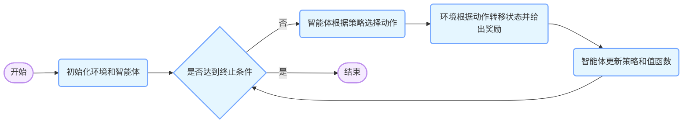

# 强化学习优化推理过程中的不确定性决策策略设计

> 关键词：强化学习、不确定性决策、推理过程、策略设计、优化

> 摘要：本文聚焦于强化学习在优化推理过程中不确定性决策策略设计的相关问题。首先介绍了该研究的背景、目的和范围等内容，阐述了强化学习、不确定性决策等核心概念及其联系。接着详细讲解了核心算法原理，通过Python代码进行具体说明，并给出了相关数学模型和公式。然后通过项目实战展示了代码的实际应用和详细解读。探讨了实际应用场景，推荐了相关的工具和资源。最后对未来发展趋势与挑战进行总结，同时给出常见问题解答和参考资料，旨在为相关领域的研究和实践提供全面且深入的指导。

## 1. 背景介绍 
### 1.1 目的和范围
在许多现实场景中，决策过程往往面临着不确定性。例如在自动驾驶领域，车辆需要在复杂多变的交通环境中做出决策，环境的不确定性（如其他车辆的突然变道、行人的意外出现等）给决策带来了巨大挑战。强化学习作为一种强大的机器学习方法，能够在与环境的交互中不断学习，优化决策策略。本研究的目的就是探索如何利用强化学习来优化推理过程中的不确定性决策策略，提高决策的准确性和可靠性。

本研究的范围涵盖了强化学习的基本理论、不确定性决策的相关概念、核心算法的实现，以及在多个实际场景中的应用，如机器人控制、金融投资等。

### 1.2 预期读者
本文预期读者包括对强化学习、机器学习、人工智能等领域感兴趣的研究人员、工程师和学生。对于正在从事相关领域研究和开发的专业人士，本文可以提供深入的技术细节和实践经验；对于初学者，本文可以帮助他们建立对强化学习和不确定性决策的基本理解。

### 1.3 文档结构概述
本文首先介绍研究的背景信息，包括目的、范围、预期读者等。然后阐述强化学习和不确定性决策的核心概念及其联系，通过文本示意图和Mermaid流程图进行说明。接着详细讲解核心算法原理，并使用Python代码进行具体实现。之后给出相关的数学模型和公式，并进行详细讲解和举例说明。通过项目实战展示代码的实际应用和详细解读。探讨实际应用场景，推荐相关的工具和资源。最后对未来发展趋势与挑战进行总结，同时给出常见问题解答和参考资料。

### 1.4 术语表
#### 1.4.1 核心术语定义
- **强化学习（Reinforcement Learning）**：一种机器学习范式，智能体通过与环境进行交互，根据环境反馈的奖励信号来学习最优策略，以最大化长期累积奖励。
- **不确定性决策（Uncertainty Decision - Making）**：在决策过程中，由于信息不完全或环境的随机性，导致决策结果存在不确定性的决策方式。
- **策略（Policy）**：智能体在给定状态下选择动作的规则，通常用 $\pi$ 表示。
- **状态（State）**：对环境当前情况的描述，智能体根据状态来选择动作。
- **动作（Action）**：智能体在某个状态下可以采取的行为。
- **奖励（Reward）**：环境对智能体采取的动作的反馈，用于指导智能体学习。

#### 1.4.2 相关概念解释
- **探索与利用（Exploration and Exploitation）**：在强化学习中，探索是指智能体尝试不同的动作以发现更好的策略，利用是指智能体选择已知的最优动作以获取最大奖励。这两者需要平衡，以避免过早收敛到局部最优解。
- **马尔可夫决策过程（Markov Decision Process，MDP）**：一种用于描述强化学习问题的数学模型，由状态集合、动作集合、状态转移概率、奖励函数和折扣因子组成。

#### 1.4.3 缩略词列表
- **MDP**：Markov Decision Process（马尔可夫决策过程）
- **Q - learning**：一种基于值函数的强化学习算法
- **SARSA**：State - Action - Reward - State - Action（一种基于策略的强化学习算法）

## 2. 核心概念与联系 
### 核心概念原理
#### 强化学习原理
强化学习的基本原理是智能体在环境中不断地进行交互。智能体根据当前状态 $s_t$ 选择一个动作 $a_t$，环境根据智能体的动作转移到下一个状态 $s_{t + 1}$，并给予智能体一个奖励 $r_{t+1}$。智能体的目标是学习一个策略 $\pi$，使得长期累积奖励最大化。

长期累积奖励通常用折扣累积奖励来表示，公式为：
$$G_t=\sum_{k = 0}^{\infty}\gamma^{k}r_{t + k+1}$$
其中，$\gamma$ 是折扣因子，取值范围为 $[0, 1]$，用于权衡近期奖励和远期奖励。

#### 不确定性决策原理
不确定性决策是在信息不完全或环境具有随机性的情况下进行的决策。在这种情况下，决策结果存在多种可能性，决策者需要考虑各种可能的结果及其概率。例如，在金融投资中，投资者需要在市场不确定性的情况下选择投资组合，不同的投资组合可能带来不同的收益和风险。

### 架构的文本示意图
```plaintext
智能体 <------> 环境
  |             |
  |  动作 a     |  状态 s
  |             |
  |             |  奖励 r
  v             v
策略 π <------> 值函数 V
```
这个示意图展示了智能体与环境之间的交互过程。智能体根据策略 $\pi$ 选择动作 $a$ 作用于环境，环境返回状态 $s$ 和奖励 $r$ 给智能体。智能体通过学习来更新策略 $\pi$ 和值函数 $V$。

### Mermaid 流程图

这个流程图展示了强化学习的基本流程。首先初始化环境和智能体，然后智能体不断地与环境进行交互，直到达到终止条件。在每次交互中，智能体根据当前策略选择动作，环境根据动作转移状态并给出奖励，智能体再根据奖励更新策略和值函数。

## 3. 核心算法原理 & 具体操作步骤 
### Q - learning 算法原理
Q - learning 是一种基于值函数的强化学习算法，它通过学习动作值函数 $Q(s, a)$ 来找到最优策略。动作值函数 $Q(s, a)$ 表示在状态 $s$ 下采取动作 $a$ 并遵循最优策略所能获得的期望折扣累积奖励。

Q - learning 的更新公式为：
$$Q(s_t,a_t)\leftarrow Q(s_t,a_t)+\alpha\left[r_{t + 1}+\gamma\max_{a}Q(s_{t+1},a)-Q(s_t,a_t)\right]$$
其中，$\alpha$ 是学习率，用于控制每次更新的步长；$\gamma$ 是折扣因子。

### 具体操作步骤
1. **初始化**：初始化动作值函数 $Q(s, a)$ 为任意值（通常初始化为 0）。
2. **循环迭代**：
    - 观察当前状态 $s_t$。
    - 根据 $\epsilon$ - 贪心策略选择动作 $a_t$。$\epsilon$ - 贪心策略以 $\epsilon$ 的概率随机选择动作，以 $1 - \epsilon$ 的概率选择 $Q(s_t, a)$ 值最大的动作。
    - 执行动作 $a_t$，观察环境返回的下一个状态 $s_{t + 1}$ 和奖励 $r_{t+1}$。
    - 根据 Q - learning 更新公式更新 $Q(s_t, a_t)$。
    - 更新当前状态 $s_t=s_{t + 1}$。
3. **终止条件**：当达到最大迭代次数或满足其他终止条件时，停止迭代。

### Python 源代码实现
```python
import numpy as np

# 定义 Q - learning 类
class QLearning:
    def __init__(self, num_states, num_actions, learning_rate=0.1, discount_factor=0.9, epsilon=0.1):
        self.num_states = num_states
        self.num_actions = num_actions
        self.learning_rate = learning_rate
        self.discount_factor = discount_factor
        self.epsilon = epsilon
        # 初始化 Q 表
        self.Q = np.zeros((num_states, num_actions))

    def choose_action(self, state):
        if np.random.uniform(0, 1) < self.epsilon:
            # 探索：随机选择动作
            action = np.random.choice(self.num_actions)
        else:
            # 利用：选择 Q 值最大的动作
            action = np.argmax(self.Q[state, :])
        return action

    def update(self, state, action, reward, next_state):
        # Q - learning 更新公式
        max_q_next = np.max(self.Q[next_state, :])
        self.Q[state, action] += self.learning_rate * (reward + self.discount_factor * max_q_next - self.Q[state, action])
```

### 代码解释
- `__init__` 方法：初始化 Q - learning 算法的参数，包括状态数量、动作数量、学习率、折扣因子和探索率。同时初始化 Q 表为全零矩阵。
- `choose_action` 方法：根据 $\epsilon$ - 贪心策略选择动作。以 $\epsilon$ 的概率随机选择动作，以 $1 - \epsilon$ 的概率选择 Q 值最大的动作。
- `update` 方法：根据 Q - learning 更新公式更新 Q 表。

## 4. 数学模型和公式 & 详细讲解 & 举例说明 
### 马尔可夫决策过程（MDP）模型
马尔可夫决策过程（MDP）是一种用于描述强化学习问题的数学模型，它由以下几个部分组成：
- **状态集合 $S$**：所有可能的状态的集合。
- **动作集合 $A$**：所有可能的动作的集合。
- **状态转移概率 $P(s_{t+1}|s_t, a_t)$**：在状态 $s_t$ 下采取动作 $a_t$ 后转移到状态 $s_{t + 1}$ 的概率。
- **奖励函数 $R(s_t, a_t, s_{t+1})$**：在状态 $s_t$ 下采取动作 $a_t$ 并转移到状态 $s_{t + 1}$ 时获得的奖励。
- **折扣因子 $\gamma$**：用于权衡近期奖励和远期奖励，取值范围为 $[0, 1]$。

### 策略评估和策略改进
#### 策略评估
策略评估的目标是计算给定策略 $\pi$ 下的状态值函数 $V^{\pi}(s)$ 和动作值函数 $Q^{\pi}(s, a)$。

状态值函数 $V^{\pi}(s)$ 的定义为：
$$V^{\pi}(s)=\mathbb{E}_{\pi}\left[G_t|s_t = s\right]=\mathbb{E}_{\pi}\left[\sum_{k = 0}^{\infty}\gamma^{k}r_{t + k+1}|s_t = s\right]$$
动作值函数 $Q^{\pi}(s, a)$ 的定义为：
$$Q^{\pi}(s, a)=\mathbb{E}_{\pi}\left[G_t|s_t = s, a_t = a\right]=\mathbb{E}_{\pi}\left[\sum_{k = 0}^{\infty}\gamma^{k}r_{t + k+1}|s_t = s, a_t = a\right]$$

#### 策略改进
策略改进的目标是根据当前的动作值函数 $Q^{\pi}(s, a)$ 来改进策略 $\pi$。通常采用贪心策略改进，即：
$$\pi'(s)=\arg\max_{a}Q^{\pi}(s, a)$$

### 举例说明
考虑一个简单的网格世界问题。网格世界是一个二维的网格，智能体在网格中移动。智能体的目标是从起点移动到终点，每移动一步会得到一个负奖励（表示消耗能量），到达终点会得到一个正奖励。

假设网格世界的大小为 $3\times3$，起点为 $(0, 0)$，终点为 $(2, 2)$。智能体可以采取的动作包括上、下、左、右。状态可以用智能体在网格中的坐标表示。

初始时，智能体的策略是随机的。通过不断地与环境进行交互，利用 Q - learning 算法更新 Q 表，智能体逐渐学习到最优策略，即能够最快到达终点的策略。

## 5. 项目实战：代码实际案例和详细解释说明 
### 5.1  开发环境搭建
- **Python 环境**：建议使用 Python 3.6 及以上版本。可以从 Python 官方网站（https://www.python.org/downloads/） 下载并安装。
- **依赖库**：本项目需要使用 `numpy` 库进行数值计算。可以使用以下命令安装：
```sh
pip install numpy
```

### 5.2  源代码详细实现和代码解读
```python
import numpy as np

# 定义网格世界环境
class GridWorld:
    def __init__(self, grid_size=3):
        self.grid_size = grid_size
        self.start_state = (0, 0)
        self.goal_state = (grid_size - 1, grid_size - 1)
        self.current_state = self.start_state
        # 动作定义：上、下、左、右
        self.actions = [(0, -1), (0, 1), (-1, 0), (1, 0)]

    def reset(self):
        # 重置环境到初始状态
        self.current_state = self.start_state
        return self.current_state

    def step(self, action):
        # 根据动作更新状态
        next_state = (self.current_state[0] + self.actions[action][0], self.current_state[1] + self.actions[action][1])
        # 检查是否越界
        next_state = (max(0, min(next_state[0], self.grid_size - 1)), max(0, min(next_state[1], self.grid_size - 1)))
        self.current_state = next_state
        # 计算奖励
        if next_state == self.goal_state:
            reward = 10
            done = True
        else:
            reward = -1
            done = False
        return next_state, reward, done

# 定义 Q - learning 类
class QLearning:
    def __init__(self, num_states, num_actions, learning_rate=0.1, discount_factor=0.9, epsilon=0.1):
        self.num_states = num_states
        self.num_actions = num_actions
        self.learning_rate = learning_rate
        self.discount_factor = discount_factor
        self.epsilon = epsilon
        # 初始化 Q 表
        self.Q = np.zeros((num_states, num_actions))

    def choose_action(self, state):
        if np.random.uniform(0, 1) < self.epsilon:
            # 探索：随机选择动作
            action = np.random.choice(self.num_actions)
        else:
            # 利用：选择 Q 值最大的动作
            action = np.argmax(self.Q[state, :])
        return action

    def update(self, state, action, reward, next_state):
        # Q - learning 更新公式
        max_q_next = np.max(self.Q[next_state, :])
        self.Q[state, action] += self.learning_rate * (reward + self.discount_factor * max_q_next - self.Q[state, action])

# 主函数
def main():
    grid_size = 3
    num_states = grid_size * grid_size
    num_actions = 4
    env = GridWorld(grid_size)
    agent = QLearning(num_states, num_actions)
    num_episodes = 1000

    for episode in range(num_episodes):
        state = env.reset()
        state_index = state[0] * grid_size + state[1]
        done = False
        while not done:
            action = agent.choose_action(state_index)
            next_state, reward, done = env.step(action)
            next_state_index = next_state[0] * grid_size + next_state[1]
            agent.update(state_index, action, reward, next_state_index)
            state_index = next_state_index

    # 打印最终的 Q 表
    print("Final Q - table:")
    print(agent.Q)

if __name__ == "__main__":
    main()
```

### 5.3  代码解读与分析
- **GridWorld 类**：定义了网格世界环境。`__init__` 方法初始化环境的参数，包括网格大小、起点、终点和动作集合。`reset` 方法将环境重置到初始状态。`step` 方法根据智能体的动作更新状态，并返回下一个状态、奖励和是否终止的标志。
- **QLearning 类**：实现了 Q - learning 算法。`__init__` 方法初始化 Q - learning 算法的参数和 Q 表。`choose_action` 方法根据 $\epsilon$ - 贪心策略选择动作。`update` 方法根据 Q - learning 更新公式更新 Q 表。
- **main 函数**：主函数中创建了网格世界环境和 Q - learning 智能体，进行了 1000 个回合的训练。在每个回合中，智能体与环境进行交互，根据 Q - learning 算法更新 Q 表。最后打印出最终的 Q 表。

## 6. 实际应用场景 
### 机器人控制
在机器人控制领域，机器人需要在复杂的环境中完成各种任务，如导航、抓取等。环境的不确定性（如障碍物的位置、光照条件等）给机器人的决策带来了挑战。强化学习可以帮助机器人在不确定性环境中学习最优的决策策略，提高机器人的适应性和任务完成能力。例如，在机器人导航中，机器人可以通过强化学习学习如何在不同的地图环境中选择最优的路径。

### 金融投资
在金融投资领域，投资者需要在市场不确定性的情况下选择投资组合。市场的波动、宏观经济因素等都会影响投资决策的结果。强化学习可以通过学习历史数据和市场信息，帮助投资者优化投资策略，提高投资收益。例如，在股票投资中，强化学习智能体可以根据股票的价格走势、公司财务状况等信息选择最优的买入和卖出时机。

### 游戏开发
在游戏开发中，游戏中的角色需要在不同的游戏场景中做出决策。例如，在策略游戏中，玩家需要决定如何部署军队、建造建筑等。强化学习可以用于训练游戏中的智能角色，使其能够在不确定性的游戏环境中做出最优的决策，提高游戏的趣味性和挑战性。

## 7. 工具和资源推荐
### 7.1 学习资源推荐
#### 7.1.1 书籍推荐
- 《强化学习：原理与Python实现》：本书系统地介绍了强化学习的基本理论和算法，并通过Python代码实现了多个实际案例，适合初学者和有一定基础的读者。
- 《Reinforcement Learning: An Introduction》：这是强化学习领域的经典教材，由强化学习领域的两位权威专家 Richard S. Sutton 和 Andrew G. Barto 编写，全面介绍了强化学习的理论和算法。

#### 7.1.2 在线课程
- Coursera 上的《Reinforcement Learning Specialization》：由 University of Alberta 提供的强化学习专项课程，包括多个课程模块，从基础理论到实际应用都有涉及。
- edX 上的《Introduction to Reinforcement Learning》：由 Massachusetts Institute of Technology (MIT) 提供的强化学习入门课程，适合初学者。

#### 7.1.3 技术博客和网站
- OpenAI Blog（https://openai.com/blog/）：OpenAI 官方博客，发布了许多关于强化学习和人工智能的最新研究成果和技术文章。
- DeepMind Blog（https://deepmind.com/blog/）：DeepMind 官方博客，分享了他们在强化学习和人工智能领域的研究进展和应用案例。

### 7.2 开发工具框架推荐
#### 7.2.1 IDE和编辑器
- PyCharm：一款功能强大的 Python 集成开发环境，提供了代码编辑、调试、版本控制等功能，适合开发强化学习项目。
- Jupyter Notebook：一种交互式的开发环境，适合进行数据分析和算法实验。可以方便地展示代码、图表和文本说明，非常适合学习和研究强化学习。

#### 7.2.2 调试和性能分析工具
- TensorBoard：TensorFlow 提供的可视化工具，可以用于可视化强化学习训练过程中的各种指标，如奖励曲线、损失曲线等，帮助开发者分析训练效果。
- cProfile：Python 内置的性能分析工具，可以用于分析强化学习代码的性能瓶颈，找出需要优化的部分。

#### 7.2.3 相关框架和库
- OpenAI Gym：一个用于开发和比较强化学习算法的工具包，提供了多种不同类型的环境，如游戏、机器人控制等，方便开发者进行算法实验。
- Stable Baselines3：一个基于 PyTorch 的强化学习库，提供了多种预训练的强化学习算法和工具，方便开发者快速实现和测试强化学习算法。

### 7.3 相关论文著作推荐
#### 7.3.1 经典论文
- “Q - learning” by Watkins, C. J. C. H., & Dayan, P.：这是 Q - learning 算法的经典论文，首次提出了 Q - learning 算法，对强化学习领域产生了深远的影响。
- “Policy Gradient Methods for Reinforcement Learning with Function Approximation” by Sutton, R. S., McAllester, D. A., Singh, S. P., & Mansour, Y.：这篇论文提出了策略梯度方法，为基于策略的强化学习算法奠定了基础。

#### 7.3.2 最新研究成果
- 关注 NeurIPS（Conference on Neural Information Processing Systems）、ICML（International Conference on Machine Learning）等顶级机器学习会议的论文，这些会议上发表了许多关于强化学习的最新研究成果。
- 关注 arXiv（https://arxiv.org/）上的预印本论文，许多研究者会在 arXiv 上提前发表他们的研究成果。

#### 7.3.3 应用案例分析
- 关注相关领域的顶级期刊和会议论文，如 Journal of Artificial Intelligence Research（JAIR）、AAAI Conference on Artificial Intelligence（AAAI）等，这些期刊和会议上发表了许多强化学习在不同领域的应用案例分析。

## 8. 总结：未来发展趋势与挑战
### 未来发展趋势
- **结合深度学习**：将强化学习与深度学习相结合，形成深度强化学习。深度强化学习可以处理高维的状态和动作空间，在图像、语音等领域取得了显著的成果。未来，深度强化学习将在更多领域得到应用，如自动驾驶、医疗诊断等。
- **多智能体强化学习**：研究多个智能体之间的协作和竞争关系，解决复杂的多智能体系统中的决策问题。多智能体强化学习在机器人协作、智能交通系统等领域具有广阔的应用前景。
- **无模型强化学习与模型预测控制相结合**：无模型强化学习具有较强的通用性，但学习效率较低；模型预测控制可以利用环境模型进行快速决策，但对模型的准确性要求较高。将两者相结合，可以充分发挥各自的优势，提高决策的效率和准确性。

### 挑战
- **样本效率问题**：强化学习通常需要大量的样本进行训练，学习效率较低。如何提高强化学习的样本效率，减少训练时间和资源消耗，是当前研究的一个重要挑战。
- **环境不确定性处理**：在实际应用中，环境的不确定性往往非常复杂，如部分可观测性、随机干扰等。如何有效地处理环境的不确定性，提高强化学习在不确定性环境中的决策能力，是一个亟待解决的问题。
- **安全性和可靠性问题**：在一些关键应用领域，如自动驾驶、医疗机器人等，强化学习系统的安全性和可靠性至关重要。如何确保强化学习系统在各种情况下都能做出安全可靠的决策，是当前研究的一个重要方向。

## 9. 附录：常见问题与解答
### Q1：强化学习和监督学习有什么区别？
A1：监督学习是通过给定的输入 - 输出对来学习一个映射函数，目标是最小化预测输出与真实输出之间的误差。而强化学习是通过与环境进行交互，根据环境反馈的奖励信号来学习最优策略，目标是最大化长期累积奖励。监督学习通常用于分类和回归问题，而强化学习用于决策和控制问题。

### Q2：如何选择合适的学习率和折扣因子？
A2：学习率 $\alpha$ 控制每次更新的步长，折扣因子 $\gamma$ 权衡近期奖励和远期奖励。一般来说，学习率 $\alpha$ 取值在 $[0.1, 0.5]$ 之间，折扣因子 $\gamma$ 取值在 $[0.9, 0.99]$ 之间。具体的取值需要根据具体问题进行调优，可以通过实验和交叉验证来选择合适的参数。

### Q3：什么是探索与利用困境？如何解决？
A3：探索与利用困境是指在强化学习中，智能体需要在探索新的动作以发现更好的策略和利用已知的最优动作以获取最大奖励之间进行权衡。如果只进行探索，智能体可能无法收敛到最优策略；如果只进行利用，智能体可能会陷入局部最优解。常见的解决方法包括 $\epsilon$ - 贪心策略、玻尔兹曼探索策略等。

## 10. 扩展阅读 & 参考资料
### 扩展阅读
- 阅读关于机器学习、深度学习的相关书籍和论文，加深对强化学习的理解。
- 关注相关领域的学术会议和研讨会，了解最新的研究动态和发展趋势。

### 参考资料
- Sutton, R. S., & Barto, A. G. (2018). Reinforcement Learning: An Introduction. MIT Press.
- Watkins, C. J. C. H., & Dayan, P. (1992). Q - learning. Machine learning, 8(3 - 4), 279 - 292.
- Sutton, R. S., McAllester, D. A., Singh, S. P., & Mansour, Y. (2000). Policy Gradient Methods for Reinforcement Learning with Function Approximation. Advances in neural information processing systems.