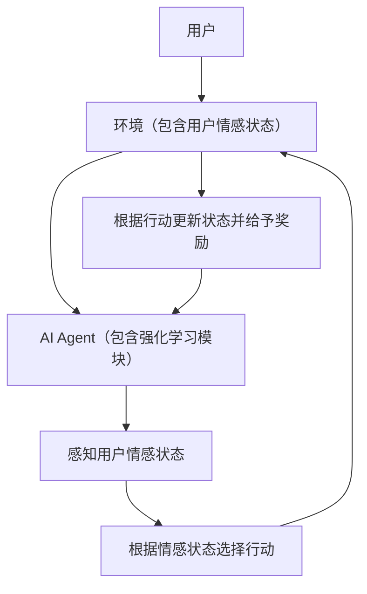

# 强化学习在AI Agent情感计算中的创新应用

> 关键词：强化学习、AI Agent、情感计算、创新应用、智能交互、情感建模、决策优化

> 摘要：本文聚焦于强化学习在AI Agent情感计算中的创新应用。首先介绍了相关背景，包括研究目的、预期读者、文档结构和术语表。接着阐述了强化学习与AI Agent情感计算的核心概念及联系，通过文本示意图和Mermaid流程图进行清晰展示。详细讲解了核心算法原理并给出Python源代码示例，同时介绍了相关数学模型和公式。通过项目实战，展示了代码实现和详细解释。探讨了实际应用场景，推荐了学习资源、开发工具框架以及相关论文著作。最后总结了未来发展趋势与挑战，并提供了常见问题解答和参考资料，旨在全面深入地剖析强化学习在AI Agent情感计算领域的应用，为该领域的研究和实践提供有价值的参考。

## 1. 背景介绍 
### 1.1 目的和范围
在人工智能飞速发展的今天，AI Agent的应用越来越广泛，从智能客服到自动驾驶等各个领域。然而，目前的AI Agent大多缺乏情感理解和表达能力，难以实现真正自然和有效的人机交互。本研究的目的在于探索强化学习在AI Agent情感计算中的创新应用，通过强化学习算法使AI Agent能够更好地感知、理解和表达情感，从而提升其智能交互水平。

研究范围涵盖了强化学习的基本原理、AI Agent情感计算的相关概念、两者结合的算法实现、实际应用场景分析以及未来发展趋势等方面。旨在为相关研究人员和开发者提供全面的理论和实践指导，推动AI Agent情感计算技术的发展。

### 1.2 预期读者
本文预期读者包括人工智能领域的研究人员、计算机科学专业的学生、AI Agent开发者、对情感计算和强化学习感兴趣的技术爱好者等。无论是希望深入研究该领域理论的学者，还是致力于将相关技术应用到实际项目中的开发者，都能从本文中获取有价值的信息。

### 1.3 文档结构概述
本文共分为十个部分。第一部分为背景介绍，阐述研究的目的、范围、预期读者和文档结构概述，并给出术语表。第二部分介绍强化学习与AI Agent情感计算的核心概念与联系，通过文本示意图和Mermaid流程图进行展示。第三部分讲解核心算法原理，并使用Python源代码详细阐述具体操作步骤。第四部分介绍相关数学模型和公式，并进行详细讲解和举例说明。第五部分通过项目实战，展示代码实际案例和详细解释说明。第六部分探讨实际应用场景。第七部分推荐学习资源、开发工具框架以及相关论文著作。第八部分总结未来发展趋势与挑战。第九部分为附录，提供常见问题与解答。第十部分列出扩展阅读和参考资料。

### 1.4 术语表
#### 1.4.1 核心术语定义
- **强化学习（Reinforcement Learning）**：一种机器学习范式，智能体通过与环境进行交互，根据环境反馈的奖励信号来学习最优行为策略，以最大化长期累积奖励。
- **AI Agent（人工智能智能体）**：能够感知环境、进行决策并采取行动的智能实体，可在不同的应用场景中执行各种任务。
- **情感计算（Affective Computing）**：研究如何让计算机感知、理解和表达人类情感的技术和方法。
- **奖励函数（Reward Function）**：强化学习中用于评估智能体行为好坏的函数，智能体的目标是通过学习使累积奖励最大化。
- **策略（Policy）**：智能体在不同状态下选择行动的规则，是强化学习的核心输出。

#### 1.4.2 相关概念解释
- **状态（State）**：环境的一种描述，智能体根据当前状态来选择行动。在AI Agent情感计算中，状态可以包括用户的情感状态、对话历史等信息。
- **行动（Action）**：智能体在某个状态下采取的操作。例如，在对话系统中，行动可以是回复用户的语句。
- **环境（Environment）**：智能体所处的外部世界，智能体与环境进行交互，环境根据智能体的行动给出相应的奖励和下一个状态。

#### 1.4.3 缩略词列表
- **RL**：Reinforcement Learning（强化学习）
- **AI**：Artificial Intelligence（人工智能）
- **MDP**：Markov Decision Process（马尔可夫决策过程）

## 2. 核心概念与联系 
### 核心概念原理
#### 强化学习原理
强化学习基于马尔可夫决策过程（MDP），其核心思想是智能体在环境中不断进行交互。智能体根据当前状态 $s_t$ 选择一个行动 $a_t$，环境根据智能体的行动转移到下一个状态 $s_{t + 1}$，并给予智能体一个奖励 $r_t$。智能体的目标是学习一个策略 $\pi$，使得长期累积奖励最大化。累积奖励通常定义为折扣累积奖励 $G_t=\sum_{k = 0}^{\infty}\gamma^k r_{t + k}$，其中 $\gamma$ 是折扣因子，用于平衡短期和长期奖励。

#### AI Agent情感计算原理
AI Agent情感计算旨在让AI Agent能够感知用户的情感状态，理解情感背后的含义，并根据情感状态做出合适的响应。这涉及到情感感知技术，如通过语音、文本、表情等多模态信息来识别用户的情感；情感建模技术，将情感状态进行量化和表示；以及情感决策技术，根据用户情感状态和任务目标选择合适的行动。

### 架构的文本示意图
```plaintext
用户 <----> 环境（包含用户情感状态）
        |
        | 感知用户情感状态
        v
AI Agent（包含强化学习模块）
        |
        | 根据情感状态选择行动
        v
        环境（根据行动更新状态并给予奖励）
```

### Mermaid流程图


## 3. 核心算法原理 & 具体操作步骤 
### 核心算法原理
在强化学习中，常用的算法有Q - learning算法。Q - learning是一种无模型的强化学习算法，通过学习一个动作价值函数 $Q(s, a)$ 来确定在状态 $s$ 下采取行动 $a$ 的价值。智能体根据 $Q$ 值选择行动，目标是使得 $Q$ 值收敛到最优值 $Q^*$。

$Q$ 值的更新公式为：
$Q(s_t, a_t) \leftarrow Q(s_t, a_t)+\alpha\left[r_t+\gamma\max_{a}Q(s_{t + 1}, a)-Q(s_t, a_t)\right]$
其中，$\alpha$ 是学习率，$\gamma$ 是折扣因子。

### 具体操作步骤
1. **初始化**：初始化 $Q$ 表，将所有状态 - 行动对的 $Q$ 值初始化为0。
2. **智能体与环境交互**：智能体在环境中进行多轮交互，每一轮包含以下步骤：
    - 观察当前状态 $s_t$。
    - 根据当前的 $Q$ 表选择行动 $a_t$，可以使用 $\epsilon$ - 贪心策略，以 $\epsilon$ 的概率随机选择行动，以 $1 - \epsilon$ 的概率选择 $Q$ 值最大的行动。
    - 执行行动 $a_t$，环境返回下一个状态 $s_{t + 1}$ 和奖励 $r_t$。
    - 根据 $Q$ 值更新公式更新 $Q(s_t, a_t)$。
3. **终止条件**：当达到预设的训练轮数或 $Q$ 值收敛时，训练结束。

### Python源代码示例
```python
import numpy as np

# 定义环境参数
num_states = 10
num_actions = 4
gamma = 0.9
alpha = 0.1
epsilon = 0.1
num_episodes = 1000

# 初始化Q表
Q = np.zeros((num_states, num_actions))

# 定义环境的转移和奖励函数（示例）
def get_next_state_and_reward(state, action):
    # 这里简单模拟，实际应用中需要根据具体环境定义
    next_state = (state + action) % num_states
    reward = -1 if next_state == 0 else 1
    return next_state, reward

# Q - learning算法
for episode in range(num_episodes):
    state = np.random.randint(0, num_states)
    done = False
    while not done:
        if np.random.uniform(0, 1) < epsilon:
            action = np.random.randint(0, num_actions)
        else:
            action = np.argmax(Q[state, :])
        
        next_state, reward = get_next_state_and_reward(state, action)
        
        Q[state, action] = Q[state, action] + alpha * (reward + gamma * np.max(Q[next_state, :]) - Q[state, action])
        
        state = next_state
        
        # 简单终止条件，实际应用中根据具体情况定义
        if state == 0:
            done = True

print("训练后的Q表：")
print(Q)
```

## 4. 数学模型和公式 & 详细讲解 & 举例说明 
### 马尔可夫决策过程（MDP）
马尔可夫决策过程是强化学习的理论基础，它由一个四元组 $(S, A, P, R)$ 表示，其中：
- $S$ 是有限的状态集合。
- $A$ 是有限的行动集合。
- $P(s_{t + 1}|s_t, a_t)$ 是状态转移概率，表示在状态 $s_t$ 采取行动 $a_t$ 后转移到状态 $s_{t + 1}$ 的概率。
- $R(s_t, a_t, s_{t + 1})$ 是奖励函数，表示在状态 $s_t$ 采取行动 $a_t$ 转移到状态 $s_{t + 1}$ 时获得的奖励。

### 动作价值函数和状态价值函数
- **动作价值函数**：$Q^{\pi}(s, a)=\mathbb{E}_{\pi}\left[G_t|s_t = s, a_t = a\right]$，表示在策略 $\pi$ 下，从状态 $s$ 采取行动 $a$ 后获得的期望累积奖励。
- **状态价值函数**：$V^{\pi}(s)=\mathbb{E}_{\pi}\left[G_t|s_t = s\right]$，表示在策略 $\pi$ 下，从状态 $s$ 开始获得的期望累积奖励。

### 贝尔曼方程
贝尔曼方程描述了动作价值函数和状态价值函数的递归关系。
- **动作价值函数的贝尔曼方程**：
$Q^{\pi}(s, a)=\sum_{s'}\left[R(s, a, s')+\gamma\sum_{a'} \pi(a'|s')Q^{\pi}(s', a')\right]P(s'|s, a)$
- **状态价值函数的贝尔曼方程**：
$V^{\pi}(s)=\sum_{a}\pi(a|s)\sum_{s'}\left[R(s, a, s')+\gamma V^{\pi}(s')\right]P(s'|s, a)$

### 举例说明
假设一个简单的网格世界环境，智能体在一个 $3\times3$ 的网格中移动，目标是到达右下角的网格。状态 $s$ 表示智能体在网格中的位置，行动 $a$ 包括上下左右移动。奖励函数 $R$ 定义为：到达目标网格获得奖励10，撞到墙壁或边界获得奖励 -1，其他情况获得奖励0。

初始时，智能体随机探索环境，根据 $Q$ 学习算法更新 $Q$ 值。随着训练的进行，$Q$ 值逐渐收敛，智能体能够学习到最优策略，即最快到达目标网格的路径。

## 5. 项目实战：代码实际案例和详细解释说明 
### 5.1  开发环境搭建
- **操作系统**：推荐使用Linux或Windows操作系统。
- **Python环境**：安装Python 3.6及以上版本。
- **依赖库**：安装NumPy、Matplotlib等常用库，可以使用以下命令进行安装：
```bash
pip install numpy matplotlib
```

### 5.2  源代码详细实现和代码解读
以下是一个简单的基于强化学习的AI Agent情感计算示例，模拟一个对话系统，根据用户的情感状态进行回复。

```python
import numpy as np

# 定义情感状态和回复动作
emotion_states = ["happy", "sad", "angry"]
reply_actions = ["Cheer up!", "Don't be sad!", "Calm down!"]

# 初始化Q表
num_states = len(emotion_states)
num_actions = len(reply_actions)
Q = np.zeros((num_states, num_actions))

# 定义超参数
gamma = 0.9
alpha = 0.1
epsilon = 0.1
num_episodes = 1000

# 定义奖励函数（示例）
def get_reward(state, action):
    if state == "happy" and action == "Cheer up!":
        return -1
    elif state == "sad" and action == "Don't be sad!":
        return 1
    elif state == "angry" and action == "Calm down!":
        return 1
    else:
        return -1

# Q - learning算法
for episode in range(num_episodes):
    # 随机选择一个初始情感状态
    state_index = np.random.randint(0, num_states)
    state = emotion_states[state_index]
    done = False
    while not done:
        if np.random.uniform(0, 1) < epsilon:
            action_index = np.random.randint(0, num_actions)
        else:
            action_index = np.argmax(Q[state_index, :])
        
        action = reply_actions[action_index]
        
        reward = get_reward(state, action)
        
        # 简单模拟下一个状态，实际应用中需要根据具体情况定义
        next_state_index = np.random.randint(0, num_states)
        next_state = emotion_states[next_state_index]
        
        Q[state_index, action_index] = Q[state_index, action_index] + alpha * (reward + gamma * np.max(Q[next_state_index, :]) - Q[state_index, action_index])
        
        state_index = next_state_index
        state = next_state
        
        # 简单终止条件，实际应用中根据具体情况定义
        if np.random.uniform(0, 1) < 0.1:
            done = True

# 测试训练好的模型
test_state_index = np.random.randint(0, num_states)
test_state = emotion_states[test_state_index]
test_action_index = np.argmax(Q[test_state_index, :])
test_action = reply_actions[test_action_index]
print(f"用户情感状态: {test_state}")
print(f"AI Agent回复: {test_action}")
```

### 5.3  代码解读与分析
1. **情感状态和回复动作定义**：定义了用户可能的情感状态和AI Agent可能的回复动作。
2. **Q表初始化**：初始化一个 $Q$ 表，用于存储每个状态 - 行动对的价值。
3. **超参数设置**：设置折扣因子 $\gamma$、学习率 $\alpha$、探索率 $\epsilon$ 和训练轮数。
4. **奖励函数**：根据用户的情感状态和AI Agent的回复动作给出相应的奖励。
5. **Q - learning算法**：智能体在环境中进行多轮交互，根据 $\epsilon$ - 贪心策略选择行动，根据 $Q$ 值更新公式更新 $Q$ 表。
6. **测试**：随机选择一个测试状态，根据训练好的 $Q$ 表选择最优行动并输出。

## 6. 实际应用场景 
### 智能客服系统
在智能客服系统中，强化学习可以帮助AI Agent更好地理解用户的情感状态。例如，当用户感到愤怒或不满时，AI Agent可以通过强化学习学习到合适的回复策略，如安抚用户情绪、提供解决方案等，从而提高用户满意度和服务质量。

### 教育辅助系统
在教育辅助系统中，AI Agent可以根据学生的情感状态调整教学策略。如果学生感到沮丧或焦虑，AI Agent可以给予鼓励和支持；如果学生表现出积极的学习态度，AI Agent可以提供更具挑战性的学习任务，以提高学习效果。

### 社交机器人
社交机器人需要与人类进行自然和有效的交互。强化学习可以使社交机器人感知人类的情感状态，并根据情感状态做出合适的表情、语言和动作反应，增强社交机器人的亲和力和交互能力。

### 游戏AI
在游戏中，AI Agent可以根据玩家的情感状态调整游戏难度和策略。例如，当玩家感到无聊时，增加游戏难度或引入新的游戏元素；当玩家感到压力过大时，降低游戏难度，提高玩家的游戏体验。

## 7. 工具和资源推荐
### 7.1 学习资源推荐
#### 7.1.1 书籍推荐
- 《强化学习：原理与Python实现》：全面介绍了强化学习的基本原理和算法，并通过Python代码进行实现，适合初学者入门。
- 《情感计算》：系统阐述了情感计算的相关理论和技术，包括情感感知、情感建模和情感交互等方面。
- 《深度学习》：虽然主要介绍深度学习，但其中也涉及到与强化学习和人工智能相关的基础知识，对于理解AI Agent的工作原理有帮助。

#### 7.1.2 在线课程
- Coursera上的“Reinforcement Learning Specialization”：由知名教授授课，涵盖了强化学习的各个方面，包括理论、算法和应用。
- edX上的“Introduction to Artificial Intelligence”：介绍了人工智能的基本概念和技术，包括强化学习和情感计算的相关内容。
- 中国大学MOOC上的“人工智能基础”：国内高校开设的课程，讲解了人工智能的基础知识和前沿技术。

#### 7.1.3 技术博客和网站
- OpenAI Blog：OpenAI官方博客，提供了关于强化学习和人工智能的最新研究成果和应用案例。
- Towards Data Science：一个专注于数据科学和人工智能的技术博客平台，有很多关于强化学习和情感计算的优质文章。
- arXiv：一个预印本平台，提供了大量关于人工智能和机器学习的学术论文，可以及时了解最新的研究动态。

### 7.2 开发工具框架推荐
#### 7.2.1 IDE和编辑器
- PyCharm：一款功能强大的Python集成开发环境，提供了代码编辑、调试、版本控制等功能，适合Python项目开发。
- Jupyter Notebook：一个交互式的开发环境，适合进行数据探索、算法验证和代码演示，方便展示和分享代码。
- Visual Studio Code：一款轻量级的代码编辑器，支持多种编程语言和插件，具有丰富的扩展功能。

#### 7.2.2 调试和性能分析工具
- TensorBoard：一个可视化工具，用于监控和分析深度学习模型的训练过程，包括损失函数、准确率等指标。
- cProfile：Python内置的性能分析工具，可以帮助开发者找出代码中的性能瓶颈。
- PDB：Python的调试器，可以在代码中设置断点，逐行调试代码，方便排查问题。

#### 7.2.3 相关框架和库
- OpenAI Gym：一个开源的强化学习环境库，提供了多种不同类型的环境，方便开发者进行强化学习算法的测试和验证。
- Stable Baselines：一个基于OpenAI Gym的强化学习库，提供了多种预训练的强化学习算法，方便开发者快速上手。
- NLTK：自然语言处理工具包，提供了文本处理、情感分析等功能，可用于AI Agent情感计算中的文本情感分析。

### 7.3 相关论文著作推荐
#### 7.3.1 经典论文
- “Q - learning”：Watkins和Dayan提出的经典Q - learning算法论文，奠定了无模型强化学习的基础。
- “Affective Computing”：Rosalind W. Picard的经典论文，首次提出了情感计算的概念，并阐述了情感计算的研究内容和应用前景。
- “Playing Atari with Deep Reinforcement Learning”：DeepMind团队的论文，提出了深度Q网络（DQN）算法，将深度学习与强化学习相结合，在Atari游戏中取得了优异的成绩。

#### 7.3.2 最新研究成果
- 关注顶级人工智能会议（如NeurIPS、ICML、AAAI等）上的最新论文，了解强化学习和情感计算领域的最新研究进展。
- 查阅知名学术期刊（如Journal of Artificial Intelligence Research、Artificial Intelligence等）上的相关论文，获取高质量的研究成果。

#### 7.3.3 应用案例分析
- 分析一些实际应用中的案例，如智能客服系统、社交机器人等的相关研究论文，了解强化学习在AI Agent情感计算中的具体应用和实践经验。

## 8. 总结：未来发展趋势与挑战
### 未来发展趋势
- **多模态融合**：未来的AI Agent情感计算将更加注重多模态信息的融合，包括语音、文本、图像、表情等多种信息源，以更准确地感知用户的情感状态。
- **个性化情感交互**：AI Agent将能够根据用户的个性化特征和历史交互记录，提供更加个性化的情感交互服务，提高用户体验。
- **强化学习与其他技术的结合**：强化学习将与深度学习、自然语言处理、计算机视觉等技术更加紧密地结合，进一步提升AI Agent的智能水平和情感计算能力。
- **情感计算在更多领域的应用**：除了现有的智能客服、教育、社交等领域，情感计算将在医疗、金融、交通等更多领域得到广泛应用。

### 挑战
- **情感数据的获取和标注**：情感数据的获取和标注是一个难题，因为情感具有主观性和复杂性，不同人对同一情感的表达和理解可能存在差异。
- **情感模型的泛化能力**：目前的情感模型在特定数据集上表现较好，但在不同场景和数据集上的泛化能力有待提高。
- **伦理和隐私问题**：AI Agent情感计算涉及到用户的情感信息，需要关注伦理和隐私问题，确保用户的情感信息得到保护。
- **计算资源和效率**：强化学习算法通常需要大量的计算资源和时间进行训练，如何提高计算效率和降低计算成本是一个挑战。

## 9. 附录：常见问题与解答
### Q1：强化学习在AI Agent情感计算中的优势是什么？
A1：强化学习可以让AI Agent通过与环境的交互不断学习和优化策略，根据用户的情感状态动态调整行为，从而实现更加智能和有效的情感交互。与传统的基于规则的方法相比，强化学习具有更强的适应性和灵活性。

### Q2：如何选择合适的奖励函数？
A2：选择合适的奖励函数是强化学习的关键。奖励函数应该能够准确地反映智能体行为的好坏，并且要与任务目标一致。在AI Agent情感计算中，奖励函数可以根据用户的情感反馈、任务完成情况等因素来设计。例如，如果AI Agent的回复能够缓解用户的负面情绪，则给予正奖励；如果回复导致用户情绪恶化，则给予负奖励。

### Q3：强化学习算法的收敛性如何保证？
A3：强化学习算法的收敛性与算法的类型、超参数的设置以及环境的性质等因素有关。对于一些经典的强化学习算法，如Q - learning，在一定条件下可以保证收敛。为了提高收敛速度和稳定性，可以采用合适的超参数调整策略，如学习率衰减、探索率衰减等。

### Q4：如何处理AI Agent情感计算中的不确定性？
A4：情感计算中存在很多不确定性，如用户情感表达的模糊性、环境的动态变化等。可以采用概率模型、贝叶斯方法等处理不确定性。例如，在情感感知阶段，可以使用概率模型来估计用户的情感状态；在决策阶段，可以考虑不同行动的概率分布，选择期望收益最大的行动。

## 10. 扩展阅读 & 参考资料
- Sutton, R. S., & Barto, A. G. (2018). Reinforcement learning: An introduction. MIT press.
- Picard, R. W. (1997). Affective computing. MIT press.
- Mnih, V., et al. (2013). Playing Atari with deep reinforcement learning. arXiv preprint arXiv:1312.5602.
- OpenAI Gym官方文档：https://gym.openai.com/
- Stable Baselines官方文档：https://stable-baselines.readthedocs.io/
- NLTK官方文档：https://www.nltk.org/