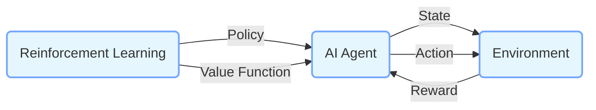

# 强化学习在AI Agent行为优化中的应用

> 关键词：强化学习、AI Agent、行为优化、马尔可夫决策过程、策略梯度算法

> 摘要：本文深入探讨了强化学习在AI Agent行为优化中的应用。首先介绍了强化学习和AI Agent的背景知识，包括目的、预期读者、文档结构和相关术语。接着阐述了强化学习和AI Agent的核心概念及联系，给出了原理和架构的文本示意图与Mermaid流程图。详细讲解了核心算法原理，并用Python代码进行具体实现。介绍了相关的数学模型和公式，并举例说明。通过项目实战展示了如何搭建开发环境、实现源代码并进行解读分析。列举了强化学习在AI Agent行为优化中的实际应用场景，推荐了学习资源、开发工具框架和相关论文著作。最后总结了未来发展趋势与挑战，提供了常见问题解答和扩展阅读参考资料，旨在帮助读者全面了解强化学习在AI Agent行为优化方面的理论与实践。

## 1. 背景介绍 
### 1.1 目的和范围
强化学习作为机器学习的一个重要分支，在AI Agent行为优化领域展现出了巨大的潜力。本文章的目的在于深入探讨强化学习如何应用于AI Agent的行为优化，详细阐述其核心概念、算法原理、数学模型，并通过实际案例展示其在不同场景下的应用。文章的范围涵盖了强化学习的基础理论、常见算法，以及如何将这些理论和算法应用到AI Agent的开发和优化中，同时会提供相关的代码示例和实际应用场景分析。

### 1.2 预期读者
本文预期读者包括对人工智能、机器学习有一定基础的开发者、研究人员，以及对强化学习和AI Agent行为优化感兴趣的技术爱好者。读者需要具备基本的编程知识，如Python语言的使用，以及一定的数学基础，包括概率论、线性代数等。

### 1.3 文档结构概述
本文将按照以下结构进行组织：首先介绍强化学习和AI Agent的核心概念及联系，包括其原理和架构；接着详细讲解核心算法原理，并给出Python代码实现；然后介绍相关的数学模型和公式，并举例说明；通过项目实战展示如何将强化学习应用于AI Agent的行为优化；列举实际应用场景；推荐学习资源、开发工具框架和相关论文著作；最后总结未来发展趋势与挑战，提供常见问题解答和扩展阅读参考资料。

### 1.4 术语表
#### 1.4.1 核心术语定义
- **强化学习（Reinforcement Learning）**：是一种机器学习方法，智能体（Agent）通过与环境进行交互，根据环境反馈的奖励信号来学习最优行为策略，以最大化长期累积奖励。
- **AI Agent（人工智能智能体）**：是一个能够感知环境、做出决策并执行动作的实体，它的目标是在特定环境中完成特定任务。
- **状态（State）**：环境在某一时刻的特征描述，AI Agent根据当前状态来选择动作。
- **动作（Action）**：AI Agent在某一状态下可以执行的操作。
- **奖励（Reward）**：环境在AI Agent执行动作后给予的即时反馈，用于评估动作的好坏。
- **策略（Policy）**：AI Agent在不同状态下选择动作的规则，通常表示为从状态到动作的映射。

#### 1.4.2 相关概念解释
- **马尔可夫决策过程（Markov Decision Process，MDP）**：是强化学习的数学基础，描述了一个环境的动态特性。在MDP中，环境的下一状态只依赖于当前状态和AI Agent执行的动作，满足马尔可夫性质。
- **值函数（Value Function）**：用于评估在某一状态下，按照某一策略执行动作所能获得的长期累积奖励的期望。常见的值函数包括状态值函数 $V(s)$ 和动作值函数 $Q(s,a)$。
- **策略梯度（Policy Gradient）**：是一类直接优化策略的强化学习算法，通过计算策略的梯度来更新策略参数，以最大化长期累积奖励。

#### 1.4.3 缩略词列表
- **MDP**：Markov Decision Process（马尔可夫决策过程）
- **Q-Learning**：一种基于值函数的强化学习算法
- **SARSA**：一种基于值函数的强化学习算法
- **A2C**：Advantage Actor-Critic（优势演员-评论家算法）
- **PPO**：Proximal Policy Optimization（近端策略优化算法）

## 2. 核心概念与联系 

### 强化学习原理
强化学习的核心思想是智能体（AI Agent）通过与环境进行交互，不断尝试不同的动作，并根据环境反馈的奖励信号来学习最优行为策略。智能体在每个时间步 $t$ 感知环境的当前状态 $s_t$，并根据当前策略 $\pi$ 选择一个动作 $a_t$ 执行。环境接收到动作后，会转移到下一个状态 $s_{t+1}$，并给予智能体一个奖励 $r_{t+1}$。智能体的目标是学习一个最优策略 $\pi^*$，使得长期累积奖励最大化。

### AI Agent架构
AI Agent通常由三个主要部分组成：感知模块、决策模块和执行模块。感知模块负责感知环境的状态信息，决策模块根据当前状态和策略选择合适的动作，执行模块将选择的动作执行到环境中。

### 核心概念联系
强化学习为AI Agent的行为优化提供了理论基础和算法支持。AI Agent通过强化学习算法学习到的策略来指导其在不同状态下的动作选择，从而实现行为的优化。而AI Agent的行为优化结果又可以反馈到强化学习算法中，进一步改进策略。

### 文本示意图
```plaintext
+------------------+          +------------------+          +------------------+
|   AI Agent       |          |   Environment    |          |   Reinforcement  |
|                  |          |                  |          |   Learning       |
| - Perception     |  State   |                  |  Reward  | - Policy         |
| - Decision       | -------> |                  | <------- | - Value Function |
| - Execution      |          |                  |          |                  |
|                  |  Action  |                  |          |                  |
|                  | -------> |                  |          |                  |
+------------------+          +------------------+          +------------------+
```

### Mermaid流程图


## 3. 核心算法原理 & 具体操作步骤 

### Q-Learning算法原理
Q-Learning是一种基于值函数的强化学习算法，它通过学习动作值函数 $Q(s,a)$ 来找到最优策略。动作值函数 $Q(s,a)$ 表示在状态 $s$ 下执行动作 $a$ 所能获得的长期累积奖励的期望。

Q-Learning的更新公式为：
$$Q(s_t,a_t) \leftarrow Q(s_t,a_t) + \alpha [r_{t+1} + \gamma \max_{a} Q(s_{t+1},a) - Q(s_t,a_t)]$$
其中，$\alpha$ 是学习率，控制每次更新的步长；$\gamma$ 是折扣因子，用于权衡即时奖励和未来奖励。

### Q-Learning算法Python代码实现
```python
import numpy as np

# 定义环境参数
num_states = 5
num_actions = 2
alpha = 0.1
gamma = 0.9
epsilon = 0.1
num_episodes = 100

# 初始化Q表
Q = np.zeros((num_states, num_actions))

# 定义epsilon-greedy策略
def epsilon_greedy(state, Q, epsilon):
    if np.random.uniform(0, 1) < epsilon:
        action = np.random.choice(num_actions)
    else:
        action = np.argmax(Q[state, :])
    return action

# Q-Learning算法
for episode in range(num_episodes):
    state = np.random.randint(0, num_states)
    done = False
    while not done:
        action = epsilon_greedy(state, Q, epsilon)
        # 这里简单模拟环境的反馈
        next_state = np.random.randint(0, num_states)
        reward = np.random.randint(0, 10)
        # Q表更新
        Q[state, action] = Q[state, action] + alpha * (reward + gamma * np.max(Q[next_state, :]) - Q[state, action])
        state = next_state
        # 简单设置终止条件
        if np.random.uniform(0, 1) < 0.1:
            done = True

print("Final Q table:")
print(Q)
```

### 代码解释
1. **初始化**：定义环境的状态数、动作数、学习率、折扣因子、探索率和训练轮数，并初始化Q表。
2. **epsilon-greedy策略**：用于在探索和利用之间进行权衡。以一定的概率 $\epsilon$ 随机选择动作，以 $1 - \epsilon$ 的概率选择Q值最大的动作。
3. **训练过程**：在每个训练轮次中，智能体从随机状态开始，根据epsilon-greedy策略选择动作，与环境进行交互，获得下一个状态和奖励，并更新Q表。
4. **终止条件**：简单设置一个随机终止条件，当满足条件时结束当前训练轮次。

### 策略梯度算法原理
策略梯度算法直接对策略进行优化，通过计算策略的梯度来更新策略参数。策略通常表示为一个参数化的函数 $\pi_{\theta}(a|s)$，其中 $\theta$ 是策略的参数。

策略梯度的目标是最大化长期累积奖励的期望，其梯度计算公式为：
$$\nabla_{\theta} J(\theta) = \mathbb{E}_{\tau \sim \pi_{\theta}} \left[ \sum_{t=0}^{T} \nabla_{\theta} \log \pi_{\theta}(a_t|s_t) G_t \right]$$
其中，$\tau$ 是一个轨迹，$G_t$ 是从时间步 $t$ 开始的长期累积奖励。

### 策略梯度算法Python代码实现
```python
import torch
import torch.nn as nn
import torch.optim as optim
import numpy as np

# 定义策略网络
class PolicyNetwork(nn.Module):
    def __init__(self, input_size, output_size):
        super(PolicyNetwork, self).__init__()
        self.fc1 = nn.Linear(input_size, 16)
        self.fc2 = nn.Linear(16, output_size)

    def forward(self, x):
        x = torch.relu(self.fc1(x))
        x = torch.softmax(self.fc2(x), dim=0)
        return x

# 定义环境参数
input_size = 5
output_size = 2
num_episodes = 100
gamma = 0.9

# 初始化策略网络和优化器
policy = PolicyNetwork(input_size, output_size)
optimizer = optim.Adam(policy.parameters(), lr=0.01)

# 训练过程
for episode in range(num_episodes):
    states = []
    actions = []
    rewards = []
    state = torch.randn(input_size)
    done = False
    while not done:
        states.append(state)
        probs = policy(state)
        action = torch.multinomial(probs, 1).item()
        actions.append(action)
        # 简单模拟环境的反馈
        next_state = torch.randn(input_size)
        reward = np.random.randint(0, 10)
        rewards.append(reward)
        state = next_state
        # 简单设置终止条件
        if np.random.uniform(0, 1) < 0.1:
            done = True

    # 计算累积奖励
    G = []
    discounted_return = 0
    for r in reversed(rewards):
        discounted_return = r + gamma * discounted_return
        G.insert(0, discounted_return)
    G = torch.tensor(G, dtype=torch.float32)

    # 计算损失
    log_probs = []
    for s, a in zip(states, actions):
        probs = policy(s)
        log_prob = torch.log(probs[a])
        log_probs.append(log_prob)
    log_probs = torch.stack(log_probs)
    loss = -torch.mean(log_probs * G)

    # 更新策略网络
    optimizer.zero_grad()
    loss.backward()
    optimizer.step()

print("Training finished.")
```

### 代码解释
1. **策略网络定义**：定义一个简单的全连接神经网络作为策略网络，输入为状态，输出为动作的概率分布。
2. **训练过程**：在每个训练轮次中，智能体根据策略网络的输出选择动作，与环境进行交互，记录状态、动作和奖励。
3. **累积奖励计算**：计算从每个时间步开始的长期累积奖励。
4. **损失计算**：根据策略梯度的公式计算损失，目标是最大化长期累积奖励的期望。
5. **参数更新**：使用优化器更新策略网络的参数。

## 4. 数学模型和公式 & 详细讲解 & 举例说明 

### 马尔可夫决策过程（MDP）
马尔可夫决策过程是强化学习的数学基础，它可以用一个五元组 $(S, A, P, R, \gamma)$ 来表示，其中：
- $S$ 是状态集合，表示环境的所有可能状态。
- $A$ 是动作集合，表示AI Agent在每个状态下可以执行的所有可能动作。
- $P$ 是状态转移概率函数，表示在状态 $s$ 下执行动作 $a$ 后转移到状态 $s'$ 的概率，即 $P(s'|s,a) = \mathbb{P}(S_{t+1}=s'|S_t=s, A_t=a)$。
- $R$ 是奖励函数，表示在状态 $s$ 下执行动作 $a$ 后获得的即时奖励，即 $R(s,a) = \mathbb{E}[R_{t+1}|S_t=s, A_t=a]$。
- $\gamma$ 是折扣因子，取值范围为 $[0, 1]$，用于权衡即时奖励和未来奖励。

### 值函数
#### 状态值函数
状态值函数 $V^{\pi}(s)$ 表示在策略 $\pi$ 下，从状态 $s$ 开始所能获得的长期累积奖励的期望，定义为：
$$V^{\pi}(s) = \mathbb{E}_{\pi} \left[ \sum_{t=0}^{\infty} \gamma^t R_{t+1} | S_0 = s \right]$$

#### 动作值函数
动作值函数 $Q^{\pi}(s,a)$ 表示在策略 $\pi$ 下，在状态 $s$ 执行动作 $a$ 后所能获得的长期累积奖励的期望，定义为：
$$Q^{\pi}(s,a) = \mathbb{E}_{\pi} \left[ \sum_{t=0}^{\infty} \gamma^t R_{t+1} | S_0 = s, A_0 = a \right]$$

### 贝尔曼方程
#### 状态值函数的贝尔曼方程
状态值函数满足贝尔曼方程：
$$V^{\pi}(s) = \sum_{a \in A} \pi(a|s) \left[ R(s,a) + \gamma \sum_{s' \in S} P(s'|s,a) V^{\pi}(s') \right]$$

#### 动作值函数的贝尔曼方程
动作值函数满足贝尔曼方程：
$$Q^{\pi}(s,a) = R(s,a) + \gamma \sum_{s' \in S} P(s'|s,a) \sum_{a' \in A} \pi(a'|s') Q^{\pi}(s',a')$$

### 最优值函数和最优策略
最优状态值函数 $V^*(s)$ 和最优动作值函数 $Q^*(s,a)$ 分别定义为：
$$V^*(s) = \max_{\pi} V^{\pi}(s)$$
$$Q^*(s,a) = \max_{\pi} Q^{\pi}(s,a)$$

最优策略 $\pi^*$ 满足：
$$\pi^*(a|s) = \begin{cases} 1, & \text{if } a = \arg \max_{a'} Q^*(s,a') \\ 0, & \text{otherwise} \end{cases}$$

### 举例说明
考虑一个简单的网格世界环境，智能体的目标是从起点到达终点。环境的状态可以用智能体在网格中的位置表示，动作包括上下左右移动。奖励函数可以设置为：到达终点获得正奖励，撞到障碍物获得负奖励，每移动一步获得一个小的负奖励。

假设智能体当前处于状态 $s$，执行动作 $a$ 后转移到状态 $s'$，获得奖励 $r$。根据贝尔曼方程，状态值函数的更新可以表示为：
$$V(s) \leftarrow r + \gamma V(s')$$

如果使用Q-Learning算法，动作值函数的更新可以表示为：
$$Q(s,a) \leftarrow Q(s,a) + \alpha [r + \gamma \max_{a'} Q(s',a') - Q(s,a)]$$

## 5. 项目实战：代码实际案例和详细解释说明 

### 5.1  开发环境搭建
#### 安装Python
首先需要安装Python，建议使用Python 3.7及以上版本。可以从Python官方网站（https://www.python.org/downloads/）下载并安装。

#### 安装必要的库
使用以下命令安装必要的库：
```sh
pip install numpy torch gym
```
- `numpy`：用于数值计算。
- `torch`：PyTorch深度学习框架，用于构建和训练神经网络。
- `gym`：OpenAI Gym是一个用于开发和比较强化学习算法的工具包，提供了各种环境供测试和训练。

### 5.2  源代码详细实现和代码解读
#### 项目目标
使用强化学习算法训练一个智能体在OpenAI Gym的CartPole环境中保持平衡。

#### 代码实现
```python
import gym
import torch
import torch.nn as nn
import torch.optim as optim
import numpy as np

# 定义策略网络
class PolicyNetwork(nn.Module):
    def __init__(self, input_size, output_size):
        super(PolicyNetwork, self).__init__()
        self.fc1 = nn.Linear(input_size, 16)
        self.fc2 = nn.Linear(16, output_size)

    def forward(self, x):
        x = torch.relu(self.fc1(x))
        x = torch.softmax(self.fc2(x), dim=0)
        return x

# 定义环境和超参数
env = gym.make('CartPole-v1')
input_size = env.observation_space.shape[0]
output_size = env.action_space.n
num_episodes = 1000
gamma = 0.99
lr = 0.01

# 初始化策略网络和优化器
policy = PolicyNetwork(input_size, output_size)
optimizer = optim.Adam(policy.parameters(), lr=lr)

# 训练过程
for episode in range(num_episodes):
    states = []
    actions = []
    rewards = []
    state = env.reset()
    state = torch.tensor(state, dtype=torch.float32)
    done = False
    while not done:
        states.append(state)
        probs = policy(state)
        action = torch.multinomial(probs, 1).item()
        actions.append(action)
        next_state, reward, done, _ = env.step(action)
        next_state = torch.tensor(next_state, dtype=torch.float32)
        rewards.append(reward)
        state = next_state

    # 计算累积奖励
    G = []
    discounted_return = 0
    for r in reversed(rewards):
        discounted_return = r + gamma * discounted_return
        G.insert(0, discounted_return)
    G = torch.tensor(G, dtype=torch.float32)

    # 计算损失
    log_probs = []
    for s, a in zip(states, actions):
        probs = policy(s)
        log_prob = torch.log(probs[a])
        log_probs.append(log_prob)
    log_probs = torch.stack(log_probs)
    loss = -torch.mean(log_probs * G)

    # 更新策略网络
    optimizer.zero_grad()
    loss.backward()
    optimizer.step()

    if episode % 100 == 0:
        print(f"Episode {episode}: Total reward = {sum(rewards)}")

env.close()
```

#### 代码解读
1. **策略网络定义**：定义一个简单的全连接神经网络作为策略网络，输入为环境的状态，输出为动作的概率分布。
2. **环境初始化**：使用OpenAI Gym创建CartPole环境，获取环境的状态空间和动作空间维度。
3. **训练过程**：在每个训练轮次中，智能体根据策略网络的输出选择动作，与环境进行交互，记录状态、动作和奖励。
4. **累积奖励计算**：计算从每个时间步开始的长期累积奖励。
5. **损失计算**：根据策略梯度的公式计算损失，目标是最大化长期累积奖励的期望。
6. **参数更新**：使用优化器更新策略网络的参数。
7. **打印奖励信息**：每100个训练轮次打印一次总奖励，用于监控训练过程。

### 5.3  代码解读与分析
#### 策略网络
策略网络的作用是将环境的状态映射到动作的概率分布。通过神经网络的非线性变换，策略网络可以学习到复杂的状态-动作映射关系。

#### 累积奖励
累积奖励 $G_t$ 用于评估每个时间步的动作对长期累积奖励的贡献。折扣因子 $\gamma$ 的作用是权衡即时奖励和未来奖励，使得智能体更关注近期的奖励。

#### 损失函数
损失函数的目标是最大化长期累积奖励的期望。通过最小化负的对数概率与累积奖励的乘积，策略网络的参数会朝着增加长期累积奖励的方向更新。

#### 训练效果
随着训练轮次的增加，智能体的总奖励会逐渐提高，说明策略网络在不断学习和优化。最终，智能体可以在CartPole环境中保持较长时间的平衡。

## 6. 实际应用场景 
### 游戏领域
在电子游戏中，强化学习可以用于训练AI Agent来优化游戏策略。例如，在围棋、象棋等棋类游戏中，通过强化学习训练的AI Agent可以学习到最优的落子策略，击败人类选手。在实时策略游戏中，AI Agent可以学习如何合理分配资源、指挥部队，提高游戏的胜率。

### 机器人控制
在机器人领域，强化学习可以用于优化机器人的行为。例如，机器人在未知环境中进行导航时，通过与环境进行交互，根据环境反馈的奖励信号来学习最优的移动策略。在机器人操作任务中，如抓取物体，强化学习可以帮助机器人学习如何调整手臂的姿态和力度，提高操作的准确性和效率。

### 自动驾驶
在自动驾驶领域，强化学习可以用于优化车辆的驾驶策略。AI Agent可以根据实时的交通状况、道路信息和其他车辆的行为，选择最优的行驶速度、方向和车道变更策略，提高行车的安全性和效率。

### 金融领域
在金融领域，强化学习可以用于优化投资策略。AI Agent可以根据市场的历史数据和实时行情，学习如何选择最优的投资组合，最大化投资收益。在风险管理方面，强化学习可以帮助金融机构学习如何合理分配风险，降低损失。

### 资源管理
在云计算、数据中心等领域，强化学习可以用于优化资源分配。AI Agent可以根据不同任务的需求和资源的使用情况，动态地分配计算资源、存储资源和网络带宽，提高资源的利用率和系统的性能。

## 7. 工具和资源推荐
### 7.1 学习资源推荐
#### 7.1.1 书籍推荐
- 《Reinforcement Learning: An Introduction》（《强化学习：原理与Python实现》）：这是强化学习领域的经典教材，详细介绍了强化学习的基本概念、算法和应用。
- 《Deep Reinforcement Learning Hands-On》（《深度强化学习实战》）：通过实际案例和代码示例，介绍了深度强化学习的算法和应用。
- 《Algorithms for Reinforcement Learning》（《强化学习算法》）：专注于强化学习算法的理论和实现，适合有一定数学基础的读者。

#### 7.1.2 在线课程
- Coursera上的“Reinforcement Learning Specialization”：由知名教授授课，系统地介绍了强化学习的理论和实践。
- edX上的“Introduction to Reinforcement Learning”：提供了强化学习的入门知识和基本算法。
- OpenAI的Spinning Up：提供了深度强化学习的教程和代码实现，适合初学者和有一定经验的开发者。

#### 7.1.3 技术博客和网站
- OpenAI官方博客：发布了很多关于强化学习的最新研究成果和应用案例。
- DeepMind官方博客：分享了深度强化学习在游戏、机器人等领域的研究进展。
- Medium上的“Reinforcement Learning”专栏：有很多优秀的强化学习文章和教程。

### 7.2 开发工具框架推荐
#### 7.2.1 IDE和编辑器
- PyCharm：一款专业的Python集成开发环境，提供了丰富的代码编辑、调试和版本控制功能。
- Jupyter Notebook：一种交互式的开发环境，适合进行数据分析和模型训练，方便展示代码和结果。
- Visual Studio Code：一款轻量级的代码编辑器，支持多种编程语言和插件，可用于强化学习的开发。

#### 7.2.2 调试和性能分析工具
- TensorBoard：用于可视化深度学习模型的训练过程和性能指标，方便监控和调试。
- PyTorch Profiler：用于分析PyTorch模型的性能瓶颈，帮助优化代码。
- cProfile：Python自带的性能分析工具，可用于分析代码的运行时间和函数调用次数。

#### 7.2.3 相关框架和库
- PyTorch：一个开源的深度学习框架，提供了丰富的神经网络模块和优化算法，适合用于强化学习的模型训练。
- TensorFlow：另一个流行的深度学习框架，具有强大的分布式训练和部署能力。
- Stable Baselines3：一个基于PyTorch的强化学习库，提供了多种强化学习算法的实现和预训练模型。

### 7.3 相关论文著作推荐
#### 7.3.1 经典论文
- “Q-Learning”（Watkins, 1992）：提出了Q-Learning算法，是基于值函数的强化学习算法的经典之作。
- “Policy Gradient Methods for Reinforcement Learning with Function Approximation”（Sutton, 2000）：提出了策略梯度算法，为直接优化策略提供了理论基础。
- “Human-level control through deep reinforcement learning”（Mnih, 2015）：首次将深度神经网络与强化学习相结合，实现了在Atari游戏上的人类水平表现。

#### 7.3.2 最新研究成果
- “Proximal Policy Optimization Algorithms”（Schulman, 2017）：提出了近端策略优化算法（PPO），是一种高效的策略优化算法。
- “Soft Actor-Critic: Off-Policy Maximum Entropy Deep Reinforcement Learning with a Stochastic Actor”（Haarnoja, 2018）：提出了软演员-评论家算法（SAC），结合了最大熵原理和离线策略学习。
- “Mastering the Game of Go without Human Knowledge”（Silver, 2017）：介绍了AlphaGo Zero，通过自我对弈学习到了超越人类的围棋水平。

#### 7.3.3 应用案例分析
- “Deep Reinforcement Learning for Autonomous Driving: A Survey”（Pan, 2020）：对强化学习在自动驾驶领域的应用进行了综述，介绍了相关的算法和挑战。
- “Reinforcement Learning in Robotics: A Survey”（Kober, 2013）：对强化学习在机器人领域的应用进行了综述，包括机器人控制、导航和操作等方面。
- “Financial Trading as a Game: A Deep Reinforcement Learning Approach”（Zhang, 2018）：介绍了强化学习在金融交易中的应用，通过训练AI Agent来优化投资策略。

## 8. 总结：未来发展趋势与挑战
### 未来发展趋势
#### 多智能体强化学习
随着智能体数量的增加和应用场景的复杂化，多智能体强化学习将成为未来的研究热点。多智能体强化学习可以用于解决协作、竞争等复杂的交互问题，如自动驾驶中的多车协同、机器人团队的协作任务等。

#### 结合其他技术
强化学习与深度学习、计算机视觉、自然语言处理等技术的结合将进一步拓展其应用领域。例如，结合计算机视觉技术，强化学习可以用于图像识别和目标检测；结合自然语言处理技术，强化学习可以用于对话系统和智能客服。

#### 无模型强化学习的发展
无模型强化学习不需要对环境进行建模，具有更强的适应性和泛化能力。未来，无模型强化学习算法将不断改进和优化，提高学习效率和性能。

#### 应用场景的拓展
强化学习将在更多领域得到应用，如医疗保健、教育、能源管理等。例如，在医疗保健领域，强化学习可以用于优化治疗方案和药物研发；在教育领域，强化学习可以用于个性化学习和智能教学。

### 挑战
#### 样本效率问题
强化学习通常需要大量的样本进行训练，样本效率较低。如何提高样本效率，减少训练时间和资源消耗，是强化学习面临的一个重要挑战。

#### 可解释性问题
强化学习模型通常是黑盒模型，其决策过程难以解释。在一些对安全性和可靠性要求较高的应用场景中，如自动驾驶和医疗保健，模型的可解释性至关重要。

#### 环境建模问题
在复杂的现实环境中，准确地对环境进行建模是非常困难的。环境的不确定性和动态性会影响强化学习算法的性能，如何处理环境建模问题是一个挑战。

#### 伦理和安全问题
随着强化学习在越来越多的领域得到应用，伦理和安全问题也日益凸显。例如，强化学习模型的决策可能会对人类产生负面影响，如何确保模型的决策符合伦理和安全标准是一个需要解决的问题。

## 9. 附录：常见问题与解答
### 1. 强化学习和监督学习有什么区别？
监督学习是通过给定的输入-输出对进行学习，目标是学习一个从输入到输出的映射函数。而强化学习是通过与环境进行交互，根据环境反馈的奖励信号来学习最优行为策略，没有明确的输入-输出对。

### 2. 如何选择合适的强化学习算法？
选择合适的强化学习算法需要考虑多个因素，如环境的复杂度、状态和动作空间的大小、样本效率要求等。一般来说，对于简单的环境和较小的状态动作空间，可以选择基于值函数的算法，如Q-Learning；对于复杂的环境和连续的状态动作空间，可以选择策略梯度算法，如PPO。

### 3. 强化学习中的折扣因子 $\gamma$ 有什么作用？
折扣因子 $\gamma$ 用于权衡即时奖励和未来奖励。当 $\gamma$ 接近1时，智能体更关注未来的奖励；当 $\gamma$ 接近0时，智能体更关注即时奖励。选择合适的 $\gamma$ 值可以影响智能体的学习策略和性能。

### 4. 如何处理强化学习中的探索和利用问题？
探索和利用是强化学习中的一个重要问题。常用的方法包括epsilon-greedy策略、玻尔兹曼探索等。epsilon-greedy策略以一定的概率 $\epsilon$ 随机选择动作进行探索，以 $1 - \epsilon$ 的概率选择Q值最大的动作进行利用。玻尔兹曼探索根据动作的Q值计算概率分布，以概率选择动作，使得Q值高的动作有更高的选择概率。

### 5. 强化学习在实际应用中可能会遇到哪些问题？
强化学习在实际应用中可能会遇到样本效率低、环境建模困难、模型可解释性差等问题。此外，还可能会遇到奖励设计不合理、训练不稳定等问题。解决这些问题需要综合考虑算法选择、环境建模、奖励设计等多个方面。

## 10. 扩展阅读 & 参考资料
### 扩展阅读
- 《Fundamentals of Reinforcement Learning》：深入介绍了强化学习的基本理论和算法。
- 《Deep Reinforcement Learning in Action》：通过实际案例介绍了深度强化学习的应用。
- 《Reinforcement Learning and Optimal Control》：将强化学习与最优控制理论相结合，提供了更深入的理论分析。

### 参考资料
- Sutton, R. S., & Barto, A. G. (2018). Reinforcement Learning: An Introduction. MIT Press.
- Mnih, V., et al. (2015). Human-level control through deep reinforcement learning. Nature, 518(7540), 529-533.
- Schulman, J., et al. (2017). Proximal Policy Optimization Algorithms. arXiv preprint arXiv:1707.06347.
- Haarnoja, T., et al. (2018). Soft Actor-Critic: Off-Policy Maximum Entropy Deep Reinforcement Learning with a Stochastic Actor. arXiv preprint arXiv:1801.01290.
- Silver, D., et al. (2017). Mastering the Game of Go without Human Knowledge. Nature, 550(7676), 354-359.